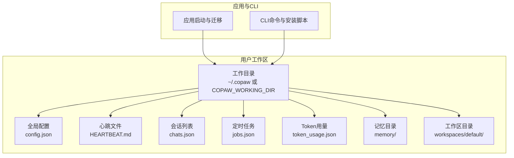
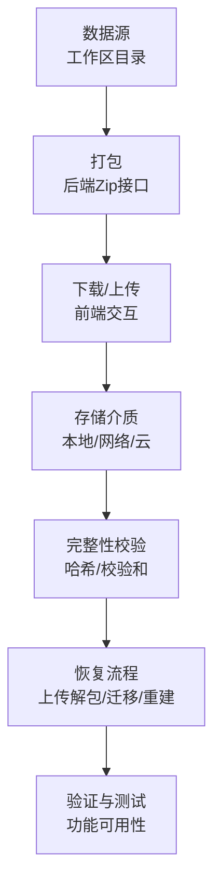
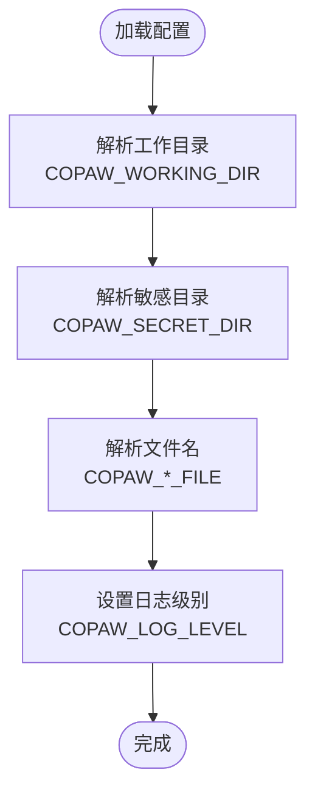
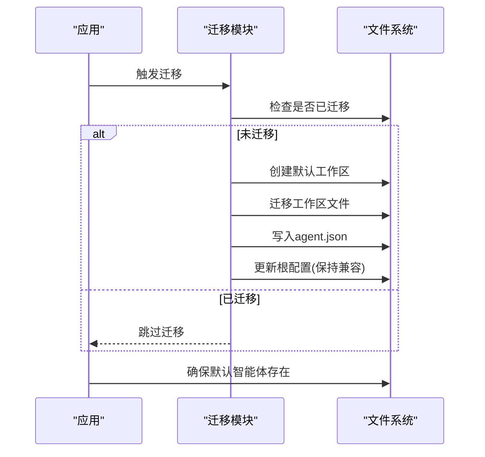
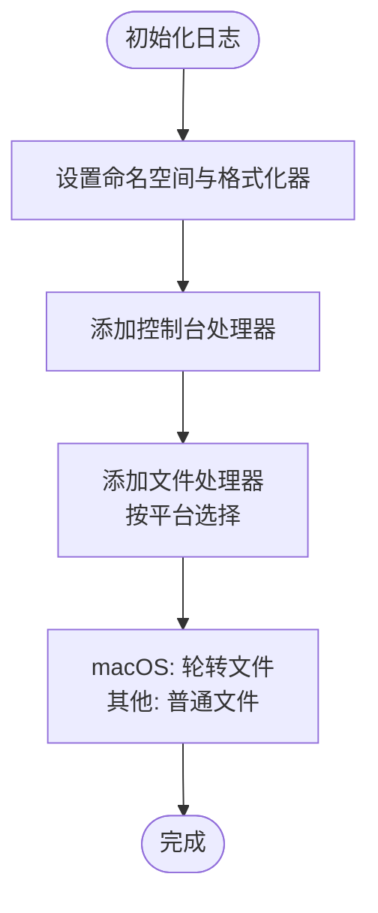
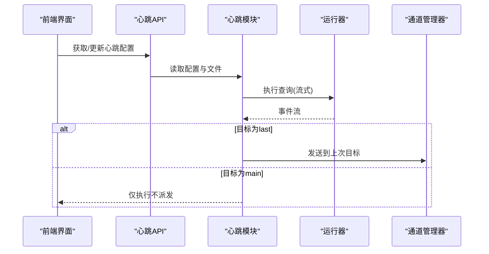
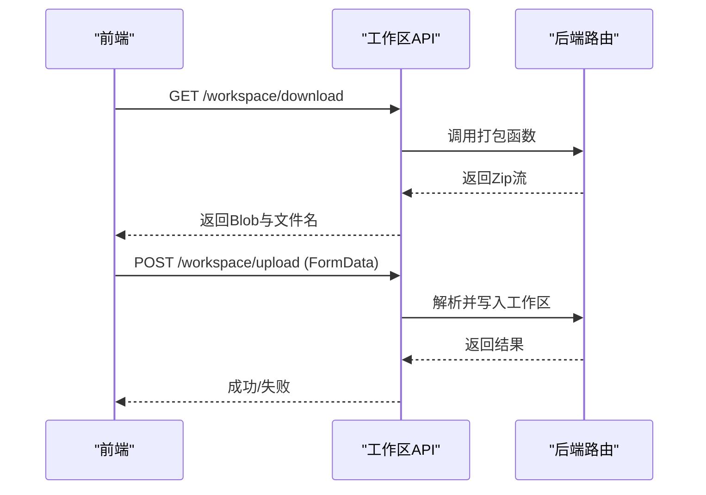
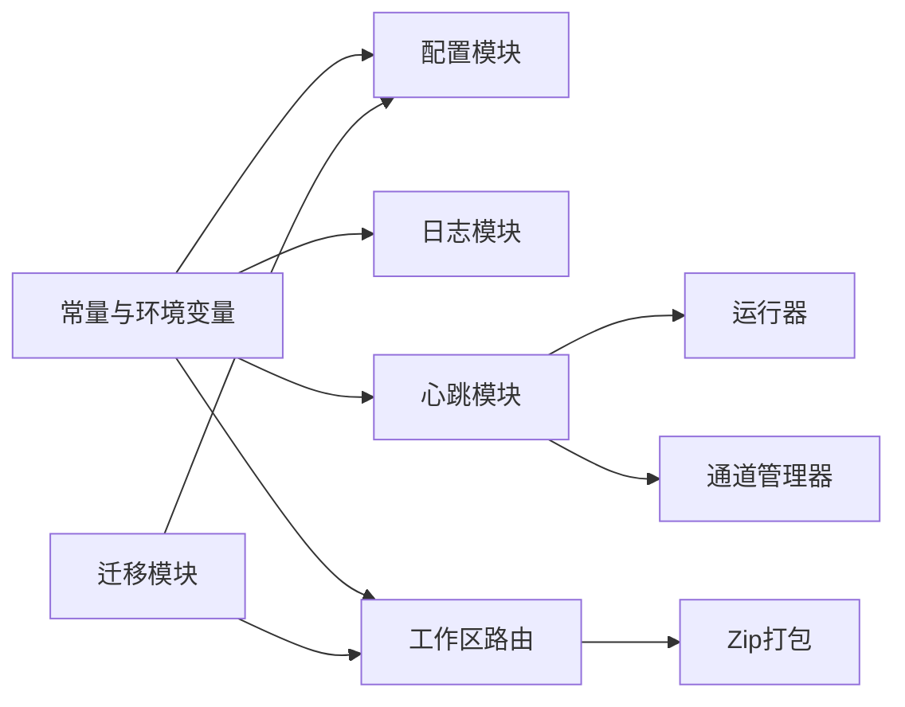

# 备份与恢复

<cite>
**本文引用的文件**
- [src/copaw/constant.py](file://src/copaw/constant.py)
- [src/copaw/config/config.py](file://src/copaw/config/config.py)
- [src/copaw/app/migration.py](file://src/copaw/app/migration.py)
- [src/copaw/utils/logging.py](file://src/copaw/utils/logging.py)
- [src/copaw/app/crons/heartbeat.py](file://src/copaw/app/crons/heartbeat.py)
- [src/copaw/app/routers/workspace.py](file://src/copaw/app/routers/workspace.py)
- [console/src/api/modules/workspace.ts](file://console/src/api/modules/workspace.ts)
- [console/src/pages/Control/Heartbeat/index.tsx](file://console/src/pages/Control/Heartbeat/index.tsx)
- [console/src/api/modules/heartbeat.ts](file://console/src/api/modules/heartbeat.ts)
- [console/src/api/types/heartbeat.ts](file://console/src/api/types/heartbeat.ts)
- [website/public/docs/config.zh.md](file://website/public/docs/config.zh.md)
- [scripts/install.sh](file://scripts/install.sh)
- [deploy/entrypoint.sh](file://deploy/entrypoint.sh)
</cite>

## 目录
1. [简介](#简介)
2. [项目结构](#项目结构)
3. [核心组件](#核心组件)
4. [架构总览](#架构总览)
5. [详细组件分析](#详细组件分析)
6. [依赖分析](#依赖分析)
7. [性能考虑](#性能考虑)
8. [故障排查指南](#故障排查指南)
9. [结论](#结论)
10. [附录](#附录)

## 简介
本文件面向CoPaw系统的备份与恢复，围绕以下目标展开：
- 明确数据备份策略、备份频率与存储位置配置
- 覆盖工作区数据、配置文件与日志文件的备份要点
- 解释增量备份、全量备份与差异备份的实现方式与适用场景
- 说明备份数据的加密、压缩与完整性校验
- 提供自动化备份脚本、定时任务配置与备份验证流程
- 覆盖灾难恢复计划、故障切换与业务连续性保障
- 包含数据迁移、版本升级与回滚策略
- 提供备份监控、告警通知与恢复演练建议

## 项目结构
CoPaw的数据与配置主要位于用户工作目录（默认~/.copaw），通过环境变量可调整工作区、配置文件、心跳文件、会话与Token用量等文件名及路径。日志采用按大小轮转策略，并支持在守护进程模式下输出到文件。

**图表来源**
- [src/copaw/constant.py:72-111](file://src/copaw/constant.py#L72-L111)
- [website/public/docs/config.zh.md:47-98](file://website/public/docs/config.zh.md#L47-L98)

**章节来源**
- [src/copaw/constant.py:72-111](file://src/copaw/constant.py#L72-L111)
- [website/public/docs/config.zh.md:47-98](file://website/public/docs/config.zh.md#L47-L98)

## 核心组件
- 工作区与配置路径解析：通过常量模块统一管理工作目录、配置文件、心跳文件、会话与Token用量等文件名与默认路径，支持通过环境变量覆盖。
- 迁移与兼容：迁移模块负责从旧版单智能体结构迁移到新版多智能体结构，确保配置与工作区文件的兼容与一致性。
- 日志与轮转：日志模块提供控制台彩色输出与文件处理器，支持按大小轮转，避免日志无限增长。
- 心跳与定时任务：心跳模块基于配置文件进行周期性任务触发，结合定时任务模块实现自动化运维。
- 工作区打包下载：后端提供工作区打包下载接口，前端提供下载与上传交互，便于离线备份与恢复。

**章节来源**
- [src/copaw/constant.py:72-111](file://src/copaw/constant.py#L72-L111)
- [src/copaw/app/migration.py:45-189](file://src/copaw/app/migration.py#L45-L189)
- [src/copaw/utils/logging.py:104-185](file://src/copaw/utils/logging.py#L104-L185)
- [src/copaw/app/crons/heartbeat.py:89-183](file://src/copaw/app/crons/heartbeat.py#L89-L183)
- [src/copaw/app/routers/workspace.py:1-45](file://src/copaw/app/routers/workspace.py#L1-L45)
- [console/src/api/modules/workspace.ts:83-137](file://console/src/api/modules/workspace.ts#L83-L137)

## 架构总览
备份与恢复涉及“数据源—打包—传输—存储—验证—恢复”的闭环。CoPaw通过以下路径与组件支撑该闭环：
- 数据源：工作区目录（包含配置、会话、定时任务、记忆、Markdown提示词等）
- 打包：后端Zip打包接口，前端下载与上传交互
- 存储：外部存储（本地磁盘、网络存储、云存储）
- 验证：完整性校验（哈希/校验和）、解压验证
- 恢复：上传并解包至工作区，必要时触发迁移与配置重建

[此图为概念性架构示意，无需图表来源]

## 详细组件分析

### 工作区与配置路径
- 工作目录与敏感目录：可通过环境变量覆盖，默认工作目录为~/.copaw，敏感目录与其同级~/.copaw.secret。
- 文件名与路径：心跳文件、会话列表、定时任务、Token用量等文件名可通过环境变量覆盖。
- 日志级别：可通过环境变量设置日志级别。

**图表来源**
- [src/copaw/constant.py:72-115](file://src/copaw/constant.py#L72-L115)
- [website/public/docs/config.zh.md:70-98](file://website/public/docs/config.zh.md#L70-L98)

**章节来源**
- [src/copaw/constant.py:72-115](file://src/copaw/constant.py#L72-L115)
- [website/public/docs/config.zh.md:70-98](file://website/public/docs/config.zh.md#L70-L98)

### 迁移与版本兼容
- 迁移流程：从旧版单智能体结构迁移到新版多智能体结构，创建默认工作区、迁移工作区文件、生成agent.json、更新根配置并保持向后兼容字段。
- 启动时确保默认智能体存在：若缺失则创建并保证必要的JSON文件存在。

**图表来源**
- [src/copaw/app/migration.py:45-189](file://src/copaw/app/migration.py#L45-L189)

**章节来源**
- [src/copaw/app/migration.py:45-189](file://src/copaw/app/migration.py#L45-L189)

### 日志与轮转
- 日志处理器：控制台彩色输出与文件处理器，支持按大小轮转（macOS使用RotatingFileHandler，其他平台使用普通FileHandler以避免锁问题）。
- 轮转参数：单文件最大大小与备份数量。

**图表来源**
- [src/copaw/utils/logging.py:104-185](file://src/copaw/utils/logging.py#L104-L185)

**章节来源**
- [src/copaw/utils/logging.py:104-185](file://src/copaw/utils/logging.py#L104-L185)

### 心跳与定时任务
- 心跳配置：支持启用/禁用、间隔、目标通道（main/last）与活跃时段。
- 心跳执行：读取心跳文件内容作为查询，按配置调度执行，超时保护。

**图表来源**
- [console/src/pages/Control/Heartbeat/index.tsx:70-86](file://console/src/pages/Control/Heartbeat/index.tsx#L70-L86)
- [console/src/api/modules/heartbeat.ts:1-12](file://console/src/api/modules/heartbeat.ts#L1-L12)
- [console/src/api/types/heartbeat.ts:1-11](file://console/src/api/types/heartbeat.ts#L1-L11)
- [src/copaw/app/crons/heartbeat.py:89-183](file://src/copaw/app/crons/heartbeat.py#L89-L183)

**章节来源**
- [console/src/pages/Control/Heartbeat/index.tsx:70-86](file://console/src/pages/Control/Heartbeat/index.tsx#L70-L86)
- [console/src/api/modules/heartbeat.ts:1-12](file://console/src/api/modules/heartbeat.ts#L1-L12)
- [console/src/api/types/heartbeat.ts:1-11](file://console/src/api/types/heartbeat.ts#L1-L11)
- [src/copaw/app/crons/heartbeat.py:89-183](file://src/copaw/app/crons/heartbeat.py#L89-L183)

### 工作区打包下载与上传
- 下载：后端将工作区目录打包为Zip，前端从响应头提取文件名或生成默认文件名。
- 上传：前端上传Zip，后端解包并写入工作区。

**图表来源**
- [console/src/api/modules/workspace.ts:83-137](file://console/src/api/modules/workspace.ts#L83-L137)
- [src/copaw/app/routers/workspace.py:1-45](file://src/copaw/app/routers/workspace.py#L1-L45)

**章节来源**
- [console/src/api/modules/workspace.ts:83-137](file://console/src/api/modules/workspace.ts#L83-L137)
- [src/copaw/app/routers/workspace.py:1-45](file://src/copaw/app/routers/workspace.py#L1-L45)

## 依赖分析
- 路径与配置：工作区路径、文件名与日志级别均来自常量模块与环境变量。
- 迁移：依赖配置加载与保存，以及工作区目录的文件/目录迁移。
- 日志：依赖平台特性（Windows/非Windows）与日志轮转策略。
- 心跳：依赖配置模块与通道管理器。
- 工作区打包：依赖Zip库与FastAPI响应流。

**图表来源**
- [src/copaw/constant.py:72-115](file://src/copaw/constant.py#L72-L115)
- [src/copaw/app/migration.py:45-189](file://src/copaw/app/migration.py#L45-L189)
- [src/copaw/utils/logging.py:104-185](file://src/copaw/utils/logging.py#L104-L185)
- [src/copaw/app/crons/heartbeat.py:89-183](file://src/copaw/app/crons/heartbeat.py#L89-L183)
- [src/copaw/app/routers/workspace.py:1-45](file://src/copaw/app/routers/workspace.py#L1-L45)

**章节来源**
- [src/copaw/constant.py:72-115](file://src/copaw/constant.py#L72-L115)
- [src/copaw/app/migration.py:45-189](file://src/copaw/app/migration.py#L45-L189)
- [src/copaw/utils/logging.py:104-185](file://src/copaw/utils/logging.py#L104-L185)
- [src/copaw/app/crons/heartbeat.py:89-183](file://src/copaw/app/crons/heartbeat.py#L89-L183)
- [src/copaw/app/routers/workspace.py:1-45](file://src/copaw/app/routers/workspace.py#L1-L45)

## 性能考虑
- 打包性能：Zip打包遍历目录树，文件数量与大小直接影响打包时间。建议定期清理不必要的大文件或临时文件。
- 日志轮转：轮转策略避免单文件过大导致I/O压力，同时减少日志对磁盘空间的影响。
- 心跳执行：超时保护防止长时间阻塞，建议合理设置间隔与活跃时段。

[本节为通用指导，无需章节来源]

## 故障排查指南
- 心跳未执行：检查心跳配置（启用、间隔、目标）、活跃时段与心跳文件是否存在且非空。
- 工作区下载失败：确认后端Zip打包逻辑与前端响应头处理；检查文件名解析与默认回退逻辑。
- 日志未落盘：确认文件处理器已添加且路径正确；在Windows上注意文件锁问题。
- 迁移失败：查看迁移日志与异常堆栈，确认工作区目录权限与目标路径存在性。

**章节来源**
- [src/copaw/app/crons/heartbeat.py:89-183](file://src/copaw/app/crons/heartbeat.py#L89-L183)
- [console/src/api/modules/workspace.ts:83-137](file://console/src/api/modules/workspace.ts#L83-L137)
- [src/copaw/utils/logging.py:142-185](file://src/copaw/utils/logging.py#L142-L185)
- [src/copaw/app/migration.py:45-189](file://src/copaw/app/migration.py#L45-L189)

## 结论
CoPaw通过明确的路径与配置管理、完善的日志轮转、可配置的心跳与定时任务，以及工作区打包下载能力，为备份与恢复提供了坚实基础。结合外部存储与校验机制，可构建完整的备份策略与灾难恢复方案。

[本节为总结，无需章节来源]

## 附录

### 备份策略与实施建议
- 备份对象
  - 工作区数据：包含配置、会话、定时任务、记忆与提示词文件
  - 配置文件：config.json、agent.json、各渠道配置
  - 日志文件：按大小轮转的日志文件
- 备份频率
  - 全量备份：建议每周一次
  - 增量/差异备份：基于文件变更的时间戳或校验和，每日或每小时触发
- 存储位置
  - 本地磁盘、网络存储、云存储；建议异地多副本
- 加密与压缩
  - 建议对备份包进行压缩与加密，使用强密码与安全算法
- 完整性校验
  - 生成并校验SHA-256/MD5摘要，确保传输与存储过程中的数据一致
- 自动化与验证
  - 使用定时任务触发备份脚本，脚本内包含压缩、加密、上传与校验步骤
  - 定期进行恢复演练，验证备份包可被成功还原

[本节为通用指导，无需章节来源]

### 定时任务配置与自动化脚本
- 定时任务
  - 使用系统crontab或作业调度器，按需执行备份脚本
- 自动化脚本
  - 脚本流程：打包工作区Zip → 压缩 → 加密 → 校验 → 上传 → 清理临时文件
  - 参考接口：工作区下载与上传API，便于在脚本中调用
- 守护进程与容器
  - 容器入口脚本用于替换配置模板并启动服务，可配合备份脚本在宿主机侧执行

**章节来源**
- [console/src/api/modules/workspace.ts:83-137](file://console/src/api/modules/workspace.ts#L83-L137)
- [deploy/entrypoint.sh:1-10](file://deploy/entrypoint.sh#L1-L10)

### 灾难恢复与业务连续性
- 灾难恢复计划
  - 明确RPO/RTO目标，准备恢复流程与责任人
  - 预留备用节点与网络路径，确保快速接管
- 故障切换
  - 切换到备用实例后，优先恢复工作区与配置，再启动应用
- 业务连续性
  - 通过日志轮转与心跳机制保障运行可观测性，及时发现异常

[本节为通用指导，无需章节来源]

### 数据迁移、版本升级与回滚
- 迁移
  - 从旧版单智能体结构迁移到新版多智能体结构，保持向后兼容字段
- 升级
  - 使用安装脚本升级，升级后触发迁移与配置重建
- 回滚
  - 若升级失败，使用备份包回滚至升级前状态；回滚后重新执行迁移

**章节来源**
- [src/copaw/app/migration.py:45-189](file://src/copaw/app/migration.py#L45-L189)
- [scripts/install.sh:1-340](file://scripts/install.sh#L1-L340)

### 监控、告警与恢复演练
- 监控
  - 监控备份任务执行状态、压缩/加密成功率、上传进度与存储容量
- 告警
  - 失败告警与重试上限，确保问题被及时发现
- 演练
  - 定期进行恢复演练，验证备份包可用性与恢复流程有效性

[本节为通用指导，无需章节来源]