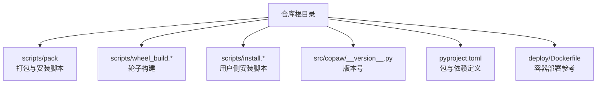
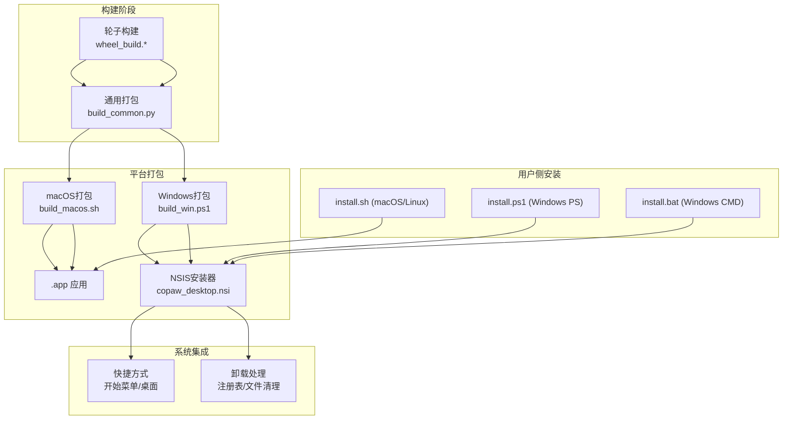
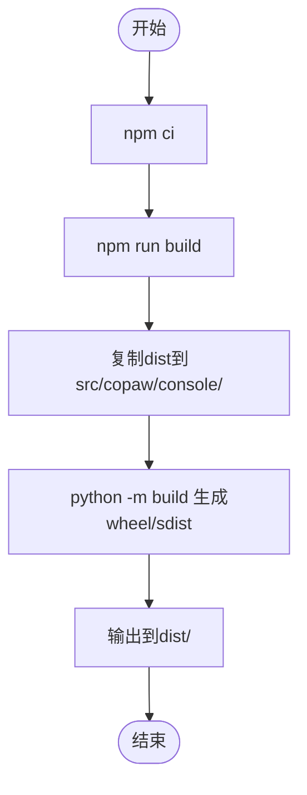
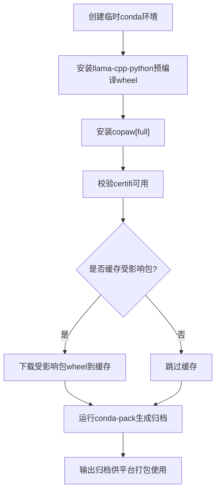
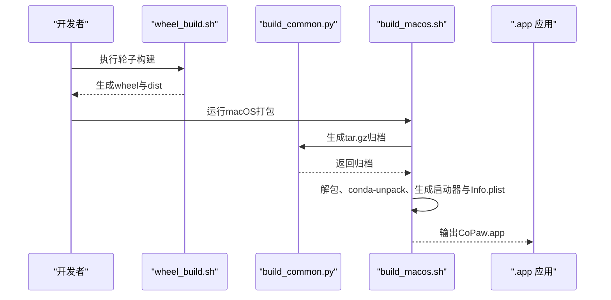
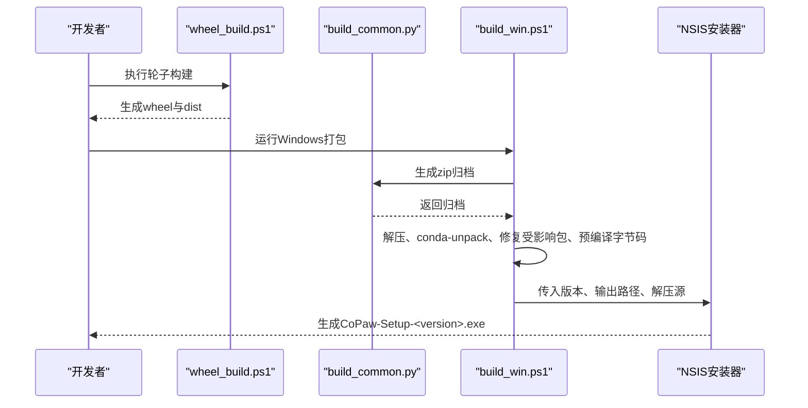
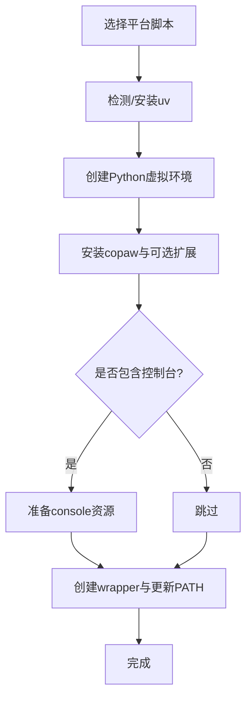
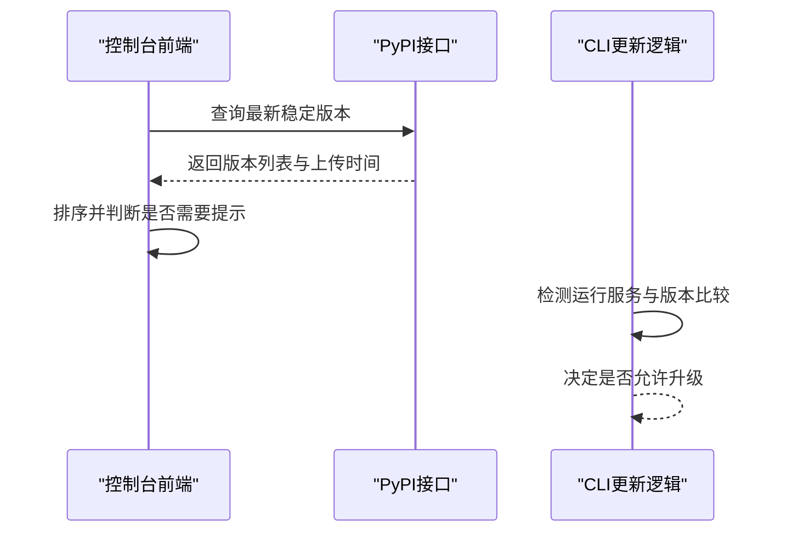
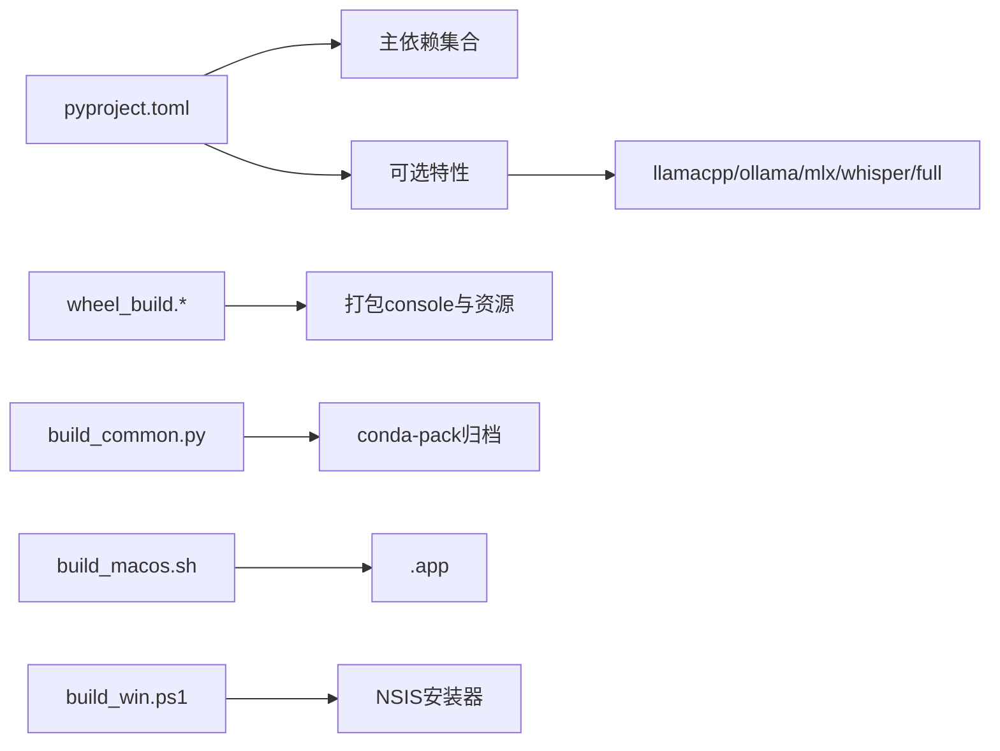

# 桌面应用部署

<cite>
**本文档引用的文件**
- [scripts/pack/build_macos.sh](file://scripts/pack/build_macos.sh)
- [scripts/pack/build_win.ps1](file://scripts/pack/build_win.ps1)
- [scripts/pack/copaw_desktop.nsi](file://scripts/pack/copaw_desktop.nsi)
- [scripts/pack/build_common.py](file://scripts/pack/build_common.py)
- [scripts/wheel_build.sh](file://scripts/wheel_build.sh)
- [scripts/wheel_build.ps1](file://scripts/wheel_build.ps1)
- [scripts/install.sh](file://scripts/install.sh)
- [scripts/install.ps1](file://scripts/install.ps1)
- [scripts/install.bat](file://scripts/install.bat)
- [src/copaw/__version__.py](file://src/copaw/__version__.py)
- [pyproject.toml](file://pyproject.toml)
- [deploy/Dockerfile](file://deploy/Dockerfile)
</cite>

## 目录
1. [简介](#简介)
2. [项目结构](#项目结构)
3. [核心组件](#核心组件)
4. [架构总览](#架构总览)
5. [详细组件分析](#详细组件分析)
6. [依赖关系分析](#依赖关系分析)
7. [性能考虑](#性能考虑)
8. [故障排查指南](#故障排查指南)
9. [结论](#结论)
10. [附录](#附录)

## 简介
本文件面向CoPaw桌面应用的部署与发布，覆盖跨平台打包流程（macOS与Windows）、安装脚本功能与系统兼容性、资源与依赖管理、自动更新机制、版本与发布流程、离线安装包制作与安全校验，以及系统集成（快捷方式、卸载处理）等。内容基于仓库中的构建与安装脚本进行深入解析，帮助开发者与运维人员高效完成打包、分发与维护。

## 项目结构
围绕桌面应用部署的关键目录与文件如下：
- 打包与安装脚本：scripts/pack、scripts/install.*
- 轮子构建：scripts/wheel_build.*
- 版本信息：src/copaw/__version__.py
- 包配置：pyproject.toml
- 容器化部署参考：deploy/Dockerfile

图表来源
- [scripts/pack/build_macos.sh](file://scripts/pack/build_macos.sh)
- [scripts/pack/build_win.ps1](file://scripts/pack/build_win.ps1)
- [scripts/wheel_build.sh](file://scripts/wheel_build.sh)
- [scripts/wheel_build.ps1](file://scripts/wheel_build.ps1)
- [scripts/install.sh](file://scripts/install.sh)
- [scripts/install.ps1](file://scripts/install.ps1)
- [scripts/install.bat](file://scripts/install.bat)
- [src/copaw/__version__.py](file://src/copaw/__version__.py)
- [pyproject.toml](file://pyproject.toml)
- [deploy/Dockerfile](file://deploy/Dockerfile)

章节来源
- [scripts/pack/build_macos.sh](file://scripts/pack/build_macos.sh)
- [scripts/pack/build_win.ps1](file://scripts/pack/build_win.ps1)
- [scripts/wheel_build.sh](file://scripts/wheel_build.sh)
- [scripts/wheel_build.ps1](file://scripts/wheel_build.ps1)
- [scripts/install.sh](file://scripts/install.sh)
- [scripts/install.ps1](file://scripts/install.ps1)
- [scripts/install.bat](file://scripts/install.bat)
- [src/copaw/__version__.py](file://src/copaw/__version__.py)
- [pyproject.toml](file://pyproject.toml)
- [deploy/Dockerfile](file://deploy/Dockerfile)

## 核心组件
- 轮子构建：统一在仓库根目录执行，先构建前端控制台产物，再打包生成wheel与sdist，供后续打包与安装使用。
- 通用打包逻辑：build_common.py负责创建临时conda环境、安装指定wheel与依赖、运行conda-pack生成可移植归档。
- macOS打包：build_macos.sh调用build_common.py，生成.app并设置Info.plist、图标、日志与启动器。
- Windows打包：build_win.ps1调用build_common.py，解压环境、修复conda-unpack路径替换bug、预编译字节码、生成NSIS安装器与快捷方式。
- 用户侧安装：install.sh（macOS/Linux）、install.ps1（Windows PowerShell）、install.bat（Windows CMD）三套脚本，均通过uv管理Python环境与依赖。
- 自动更新：控制台前端通过查询PyPI接口检测最新稳定版本；CLI层亦有更新检测逻辑（单元测试体现）。

章节来源
- [scripts/wheel_build.sh](file://scripts/wheel_build.sh)
- [scripts/wheel_build.ps1](file://scripts/wheel_build.ps1)
- [scripts/pack/build_common.py](file://scripts/pack/build_common.py)
- [scripts/pack/build_macos.sh](file://scripts/pack/build_macos.sh)
- [scripts/pack/build_win.ps1](file://scripts/pack/build_win.ps1)
- [scripts/pack/copaw_desktop.nsi](file://scripts/pack/copaw_desktop.nsi)
- [scripts/install.sh](file://scripts/install.sh)
- [scripts/install.ps1](file://scripts/install.ps1)
- [scripts/install.bat](file://scripts/install.bat)
- [pyproject.toml](file://pyproject.toml)

## 架构总览
下图展示从源码到最终分发包的关键流程：前端构建 → 轮子构建 → 通用打包 → 平台特定打包/安装 → 用户侧安装与系统集成。

图表来源
- [scripts/wheel_build.sh](file://scripts/wheel_build.sh)
- [scripts/wheel_build.ps1](file://scripts/wheel_build.ps1)
- [scripts/pack/build_common.py](file://scripts/pack/build_common.py)
- [scripts/pack/build_macos.sh](file://scripts/pack/build_macos.sh)
- [scripts/pack/build_win.ps1](file://scripts/pack/build_win.ps1)
- [scripts/pack/copaw_desktop.nsi](file://scripts/pack/copaw_desktop.nsi)
- [scripts/install.sh](file://scripts/install.sh)
- [scripts/install.ps1](file://scripts/install.ps1)
- [scripts/install.bat](file://scripts/install.bat)

## 详细组件分析

### 轮子构建（Console + Python Package）
- 前端控制台构建：在console目录执行npm ci与npm run build，产物复制到src/copaw/console/，确保打包时包含Web界面资源。
- 轮子与源码分发：使用build工具生成wheel与sdist，输出至dist目录，供打包与安装脚本使用。
- 版本来源：优先使用src/copaw/__version__.py中的版本号，确保打包产物与版本一致。

图表来源
- [scripts/wheel_build.sh](file://scripts/wheel_build.sh)
- [scripts/wheel_build.ps1](file://scripts/wheel_build.ps1)
- [src/copaw/__version__.py](file://src/copaw/__version__.py)

章节来源
- [scripts/wheel_build.sh](file://scripts/wheel_build.sh)
- [scripts/wheel_build.ps1](file://scripts/wheel_build.ps1)
- [src/copaw/__version__.py](file://src/copaw/__version__.py)

### 通用打包（conda-pack）
- 创建临时conda环境，安装llama-cpp-python预编译wheel（按平台选择Metal或CPU版本），随后安装copaw[full]。
- 使用conda-pack将环境打包为归档文件（macOS为tar.gz，Windows为zip），用于后续平台打包。
- 可选缓存受影响包的wheel，用于修复Windows conda-unpack路径替换bug。

图表来源
- [scripts/pack/build_common.py](file://scripts/pack/build_common.py)

章节来源
- [scripts/pack/build_common.py](file://scripts/pack/build_common.py)

### macOS 打包（.app）
- 生成wheel（如dist中无当前版本wheel则构建），调用build_common.py生成tar.gz归档。
- 解包归档至Contents/Resources/env，执行conda-unpack以修正路径。
- 生成启动器脚本（含PATH、SSL证书路径、日志级别、首次初始化等），设置Info.plist（版本、图标、最低系统版本、权限描述）。
- 可选创建zip压缩包便于分发。

图表来源
- [scripts/wheel_build.sh](file://scripts/wheel_build.sh)
- [scripts/pack/build_common.py](file://scripts/pack/build_common.py)
- [scripts/pack/build_macos.sh](file://scripts/pack/build_macos.sh)

章节来源
- [scripts/pack/build_macos.sh](file://scripts/pack/build_macos.sh)
- [scripts/pack/build_common.py](file://scripts/pack/build_common.py)

### Windows 打包（NSIS安装器）
- 生成wheel，调用build_common.py生成zip归档并解压。
- 定位python.exe所在根目录，执行conda-unpack修复路径替换bug，重新安装受影响包（如huggingface_hub）。
- 预编译Python字节码以提升启动速度；生成隐藏控制台与显示控制台的启动器（.bat与.vbs），复制图标至环境根目录。
- 使用NSIS模板生成安装器，写入安装路径、注册表项、创建开始菜单与桌面快捷方式，并生成卸载程序。

图表来源
- [scripts/wheel_build.ps1](file://scripts/wheel_build.ps1)
- [scripts/pack/build_common.py](file://scripts/pack/build_common.py)
- [scripts/pack/build_win.ps1](file://scripts/pack/build_win.ps1)
- [scripts/pack/copaw_desktop.nsi](file://scripts/pack/copaw_desktop.nsi)

章节来源
- [scripts/pack/build_win.ps1](file://scripts/pack/build_win.ps1)
- [scripts/pack/copaw_desktop.nsi](file://scripts/pack/copaw_desktop.nsi)

### 用户侧安装脚本（多平台）
- install.sh（macOS/Linux）：自动检测/安装uv，创建Python 3.12虚拟环境，安装copaw及其可选扩展，准备控制台资源，创建wrapper脚本，更新shell profile PATH。
- install.ps1（Windows PowerShell）：自动检测/安装uv（支持GitHub Releases回退），创建虚拟环境，安装copaw，生成.ps1与.cmd wrapper，通过注册表更新用户PATH。
- install.bat（Windows CMD）：与PowerShell版等价的批处理实现，具备安全输入校验与注册表更新。

图表来源
- [scripts/install.sh](file://scripts/install.sh)
- [scripts/install.ps1](file://scripts/install.ps1)
- [scripts/install.bat](file://scripts/install.bat)

章节来源
- [scripts/install.sh](file://scripts/install.sh)
- [scripts/install.ps1](file://scripts/install.ps1)
- [scripts/install.bat](file://scripts/install.bat)

### 自动更新机制与版本管理
- 控制台前端：通过查询PyPI接口获取稳定/后发布版本列表，按上传时间排序，仅当最新版本较当前版本新且足够“陈旧”（超过1小时）时提示更新。
- CLI层：单元测试覆盖了检测运行服务、比较版本、阻止正在运行的服务升级等场景，保证升级流程的安全性与一致性。

图表来源
- [console/src/layouts/Sidebar.tsx](file://console/src/layouts/Sidebar.tsx)
- [tests/unit/cli/test_cli_update.py](file://tests/unit/cli/test_cli_update.py)

章节来源
- [console/src/layouts/Sidebar.tsx](file://console/src/layouts/Sidebar.tsx)
- [tests/unit/cli/test_cli_update.py](file://tests/unit/cli/test_cli_update.py)

### 发布流程与离线包
- 版本号：来源于src/copaw/__version__.py，打包脚本优先使用该版本，确保一致性。
- 发布步骤建议：
  1) 更新版本号；
  2) 执行轮子构建，生成dist中的wheel；
  3) macOS：执行build_macos.sh，得到CoPaw.app与可选zip；
  4) Windows：执行build_win.ps1，得到NSIS安装器；
  5) 生成数字签名（见下一节）与完整性校验（如SHA256）；
  6) 发布渠道同步（PyPI、官网、镜像站）。
- 离线安装包：Windows安装器即离线包；macOS可提供.app与zip两种形式。

章节来源
- [src/copaw/__version__.py](file://src/copaw/__version__.py)
- [scripts/wheel_build.sh](file://scripts/wheel_build.sh)
- [scripts/pack/build_macos.sh](file://scripts/pack/build_macos.sh)
- [scripts/pack/build_win.ps1](file://scripts/pack/build_win.ps1)

### 数字签名与安全校验
- Windows安装器：建议使用代码签名证书对NSIS安装器进行签名，确保用户信任与防篡改。
- macOS应用：建议对.app进行公证（notarization），并启用沙箱与权限声明（Info.plist中已有部分权限描述）。
- 校验清单：发布时提供SHA256摘要文件，供用户核验下载完整性。
- 供应链安全：build_common.py对llama-cpp-python采用两步下载安装策略，隔离第三方索引影响，降低供应链风险。

章节来源
- [scripts/pack/build_common.py](file://scripts/pack/build_common.py)
- [scripts/pack/build_win.ps1](file://scripts/pack/build_win.ps1)
- [scripts/pack/build_macos.sh](file://scripts/pack/build_macos.sh)

### 系统集成与卸载处理
- Windows：
  - 安装路径：用户目录下的本地应用数据路径；
  - 快捷方式：创建于开始菜单与桌面，分别对应隐藏控制台与显示控制台的启动器；
  - 注册表：写入安装路径，卸载时删除；
  - 卸载：NSIS卸载页删除快捷方式、程序目录与注册表项。
- macOS：
  - .app结构与Info.plist配置；
  - 可选创建zip便于分发；
  - 首次运行自动初始化配置文件。

章节来源
- [scripts/pack/copaw_desktop.nsi](file://scripts/pack/copaw_desktop.nsi)
- [scripts/pack/build_win.ps1](file://scripts/pack/build_win.ps1)
- [scripts/pack/build_macos.sh](file://scripts/pack/build_macos.sh)

## 依赖关系分析
- 包与依赖：pyproject.toml定义了主依赖与可选特性（llamacpp、mlx、ollama、whisper、full等），wheel构建时将console资源与md文件等打包进包内。
- 平台差异：llama-cpp-python根据平台选择Metal或CPU预编译wheel；Windows打包时修复conda-unpack路径替换bug。
- 运行时容器参考：Dockerfile展示了在容器环境中安装与初始化流程，可用于对比系统级依赖与运行条件。

图表来源
- [pyproject.toml](file://pyproject.toml)
- [scripts/wheel_build.sh](file://scripts/wheel_build.sh)
- [scripts/wheel_build.ps1](file://scripts/wheel_build.ps1)
- [scripts/pack/build_common.py](file://scripts/pack/build_common.py)
- [scripts/pack/build_macos.sh](file://scripts/pack/build_macos.sh)
- [scripts/pack/build_win.ps1](file://scripts/pack/build_win.ps1)

章节来源
- [pyproject.toml](file://pyproject.toml)
- [scripts/wheel_build.sh](file://scripts/wheel_build.sh)
- [scripts/wheel_build.ps1](file://scripts/wheel_build.ps1)
- [scripts/pack/build_common.py](file://scripts/pack/build_common.py)
- [scripts/pack/build_macos.sh](file://scripts/pack/build_macos.sh)
- [scripts/pack/build_win.ps1](file://scripts/pack/build_win.ps1)

## 性能考虑
- 启动优化：Windows打包阶段预编译Python字节码，减少首次启动编译开销。
- 环境便携：使用conda-pack将完整Python环境打包，避免宿主机缺失依赖导致的启动失败。
- 前端资源：console资源随wheel打包，减少运行时网络加载与初始化时间。
- 依赖精简：通过可选特性按需安装，减小体积与安装时间。

## 故障排查指南
- macOS启动崩溃或找不到Python：
  - 检查启动器中PYTHONHOME与PATH设置是否正确；
  - 确认Info.plist中最低系统版本满足目标机器；
  - 查看用户目录日志文件定位SSL证书路径问题。
- Windows安装器失败：
  - 确认NSIS在PATH中，makensis可用；
  - 检查conda-unpack修复是否成功（受影响包重新安装）；
  - 若出现路径替换错误，确认缓存wheel可用并已执行重装。
- 用户侧安装失败：
  - install.sh：确认uv安装成功、shell profile已更新PATH；
  - install.ps1：检查执行策略与注册表更新是否成功；
  - install.bat：注意安全输入校验，避免非法字符导致的安装中断。
- 自动更新未触发：
  - 控制台前端仅在最新版本足够“陈旧”时提示；
  - CLI更新需确保版本可比较且未检测到运行中的服务。

章节来源
- [scripts/pack/build_macos.sh](file://scripts/pack/build_macos.sh)
- [scripts/pack/build_win.ps1](file://scripts/pack/build_win.ps1)
- [scripts/install.sh](file://scripts/install.sh)
- [scripts/install.ps1](file://scripts/install.ps1)
- [scripts/install.bat](file://scripts/install.bat)
- [console/src/layouts/Sidebar.tsx](file://console/src/layouts/Sidebar.tsx)

## 结论
本文档梳理了CoPaw桌面应用的跨平台打包与发布流程，明确了轮子构建、通用打包、平台特定打包、用户侧安装与系统集成为一体的完整链路。结合自动更新机制与版本管理策略，可支撑稳定高效的发布与维护。建议在正式发布前完善数字签名与完整性校验，并持续关注平台兼容性与依赖更新。

## 附录
- 容器化部署参考：Dockerfile展示了在容器环境中安装与初始化流程，可作为系统依赖与运行条件的对照依据。
- 包配置：pyproject.toml定义了主依赖、可选特性与打包规则，wheel构建脚本会将console与资源一并打包。

章节来源
- [deploy/Dockerfile](file://deploy/Dockerfile)
- [pyproject.toml](file://pyproject.toml)