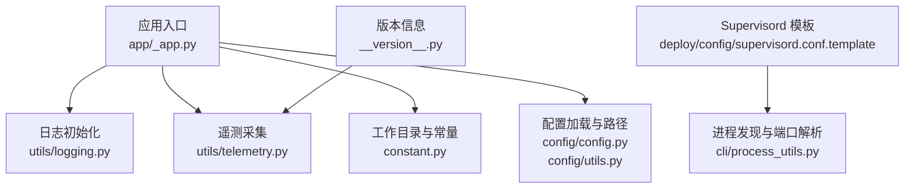
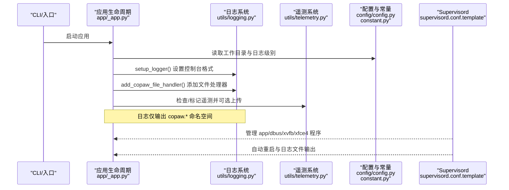
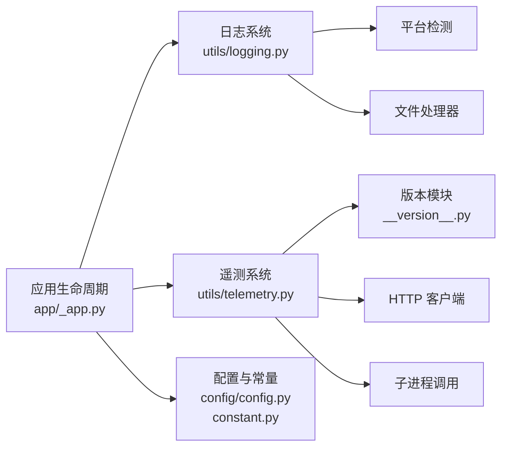

# 监控与日志

<cite>
**本文引用的文件**
- [src/copaw/utils/logging.py](file://src/copaw/utils/logging.py)
- [src/copaw/utils/telemetry.py](file://src/copaw/utils/telemetry.py)
- [src/copaw/app/_app.py](file://src/copaw/app/_app.py)
- [src/copaw/constant.py](file://src/copaw/constant.py)
- [deploy/config/supervisord.conf.template](file://deploy/config/supervisord.conf.template)
- [src/copaw/cli/process_utils.py](file://src/copaw/cli/process_utils.py)
- [src/copaw/__version__.py](file://src/copaw/__version__.py)
- [src/copaw/config/config.py](file://src/copaw/config/config.py)
- [src/copaw/config/utils.py](file://src/copaw/config/utils.py)
- [src/copaw/cli/init_cmd.py](file://src/copaw/cli/init_cmd.py)
</cite>

## 目录
1. [简介](#简介)
2. [项目结构](#项目结构)
3. [核心组件](#核心组件)
4. [架构总览](#架构总览)
5. [组件详解](#组件详解)
6. [依赖关系分析](#依赖关系分析)
7. [性能考量](#性能考量)
8. [故障排查指南](#故障排查指南)
9. [结论](#结论)
10. [附录](#附录)

## 简介
本文件面向运维与开发人员，系统化梳理 CoPaw 的监控与日志体系，覆盖以下主题：
- 日志配置结构、日志级别设置与输出格式定制
- 日志轮转策略、存储位置与清理规则
- 遥测数据采集、性能指标监控与错误追踪机制
- Supervisord 进程管理配置、服务监控与自动重启策略
- 告警规则设置、阈值配置与通知机制
- 性能监控指标、资源使用统计与瓶颈分析
- 日志分析工具、查询语法与可视化展示
- 监控仪表板配置、自定义指标与报告生成

## 项目结构
围绕监控与日志的关键目录与文件如下：
- 日志与遥测：src/copaw/utils/logging.py、src/copaw/utils/telemetry.py
- 应用启动与生命周期：src/copaw/app/_app.py
- 环境变量与常量：src/copaw/constant.py
- 进程与容器信息：src/copaw/cli/process_utils.py
- 配置模型与路径：src/copaw/config/config.py、src/copaw/config/utils.py
- Supervisord 模板：deploy/config/supervisord.conf.template
- 版本信息：src/copaw/__version__.py
- 初始化流程（含遥测提示）：src/copaw/cli/init_cmd.py

图表来源
- [src/copaw/app/_app.py:32-33](file://src/copaw/app/_app.py#L32-L33)
- [src/copaw/utils/logging.py:104-139](file://src/copaw/utils/logging.py#L104-L139)
- [src/copaw/utils/telemetry.py:292-311](file://src/copaw/utils/telemetry.py#L292-L311)
- [src/copaw/constant.py:72-121](file://src/copaw/constant.py#L72-L121)
- [src/copaw/config/config.py:1-120](file://src/copaw/config/config.py#L1-L120)
- [src/copaw/config/utils.py:1-65](file://src/copaw/config/utils.py#L1-L65)
- [deploy/config/supervisord.conf.template:1-40](file://deploy/config/supervisord.conf.template#L1-L40)
- [src/copaw/cli/process_utils.py:13-237](file://src/copaw/cli/process_utils.py#L13-L237)
- [src/copaw/__version__.py:1-3](file://src/copaw/__version__.py#L1-L3)

章节来源
- [src/copaw/app/_app.py:32-33](file://src/copaw/app/_app.py#L32-L33)
- [src/copaw/utils/logging.py:104-139](file://src/copaw/utils/logging.py#L104-L139)
- [src/copaw/utils/telemetry.py:292-311](file://src/copaw/utils/telemetry.py#L292-L311)
- [src/copaw/constant.py:72-121](file://src/copaw/constant.py#L72-L121)
- [src/copaw/config/config.py:1-120](file://src/copaw/config/config.py#L1-L120)
- [src/copaw/config/utils.py:1-65](file://src/copaw/config/utils.py#L1-L65)
- [deploy/config/supervisord.conf.template:1-40](file://deploy/config/supervisord.conf.template#L1-L40)
- [src/copaw/cli/process_utils.py:13-237](file://src/copaw/cli/process_utils.py#L13-L237)
- [src/copaw/__version__.py:1-3](file://src/copaw/__version__.py#L1-L3)

## 核心组件
- 日志系统
  - 控制台彩色输出与时间戳格式
  - 可选文件处理器（按平台差异）
  - 访问日志过滤器（抑制特定路径）
  - 日志级别映射与动态设置
- 遥测系统
  - 安装方法检测、系统信息采集
  - 同步上传与失败静默处理
  - 标记文件记录已采集版本与用户选择
- 应用生命周期
  - 启动时添加文件处理器到 copaw 命名空间
  - 生命周期内统一日志级别
- Supervisord 进程编排
  - 多程序管理、自动重启、优先级与日志文件
  - 容器运行环境变量注入
- 进程与容器探测
  - 跨平台进程快照与命令行解析
  - 端口提取与候选主机地址推导

章节来源
- [src/copaw/utils/logging.py:104-185](file://src/copaw/utils/logging.py#L104-L185)
- [src/copaw/utils/telemetry.py:29-311](file://src/copaw/utils/telemetry.py#L29-L311)
- [src/copaw/app/_app.py:148-200](file://src/copaw/app/_app.py#L148-L200)
- [deploy/config/supervisord.conf.template:1-40](file://deploy/config/supervisord.conf.template#L1-L40)
- [src/copaw/cli/process_utils.py:13-237](file://src/copaw/cli/process_utils.py#L13-L237)

## 架构总览
下图展示了从应用启动到日志落盘、遥测上报以及进程管理的整体流程。

图表来源
- [src/copaw/app/_app.py:148-200](file://src/copaw/app/_app.py#L148-L200)
- [src/copaw/utils/logging.py:104-185](file://src/copaw/utils/logging.py#L104-L185)
- [src/copaw/utils/telemetry.py:292-311](file://src/copaw/utils/telemetry.py#L292-L311)
- [src/copaw/constant.py:72-121](file://src/copaw/constant.py#L72-L121)
- [deploy/config/supervisord.conf.template:1-40](file://deploy/config/supervisord.conf.template#L1-L40)

## 组件详解

### 日志配置与输出格式
- 日志命名空间与作用域
  - 仅输出 copaw.* 命名空间的日志，避免第三方库噪声
  - 通过根日志器级别与处理器级别控制输出粒度
- 控制台输出
  - 彩色级别前缀（调试/信息/警告/错误/严重）
  - 时间戳与消息体格式化
  - 路径相对化显示，便于定位源码位置
- 文件输出
  - Windows/Linux：使用简单文件处理器，避免锁竞争
  - macOS：使用带轮转的文件处理器
  - 默认最大单文件大小与备份数量
- 访问日志过滤
  - 可配置路径子串列表以抑制特定访问日志
- 动态级别设置
  - 支持字符串映射到数值级别
  - 通过环境变量在启动时生效

章节来源
- [src/copaw/utils/logging.py:16-22](file://src/copaw/utils/logging.py#L16-L22)
- [src/copaw/utils/logging.py:49-80](file://src/copaw/utils/logging.py#L49-L80)
- [src/copaw/utils/logging.py:104-139](file://src/copaw/utils/logging.py#L104-L139)
- [src/copaw/utils/logging.py:142-185](file://src/copaw/utils/logging.py#L142-L185)
- [src/copaw/utils/logging.py:82-102](file://src/copaw/utils/logging.py#L82-L102)
- [src/copaw/constant.py:114-116](file://src/copaw/constant.py#L114-L116)

### 日志轮转策略、存储位置与清理规则
- 存储位置
  - 应用启动时在工作目录下创建 copaw.log
  - 文件处理器按平台差异选择
- 轮转策略
  - macOS 使用带大小限制与备份数的轮转
  - Windows/Linux 使用简单文件处理器，不进行自动轮转
- 清理规则
  - 未实现自动清理逻辑；可通过外部工具（如 logrotate）或手动维护
  - 建议结合容器日志驱动与持久卷策略

章节来源
- [src/copaw/app/_app.py:153](file://src/copaw/app/_app.py#L153)
- [src/copaw/utils/logging.py:171-176](file://src/copaw/utils/logging.py#L171-L176)
- [src/copaw/utils/logging.py:12-13](file://src/copaw/utils/logging.py#L12-L13)

### 遥测数据采集与错误追踪
- 数据采集
  - 安装方式检测（pip/Docker/桌面应用）
  - 系统信息（操作系统、架构、Python 版本、GPU 检测）
  - 版本号来自版本模块
- 上报机制
  - 同步 HTTP 客户端上传，超时短路
  - 失败静默，不影响安装流程
- 标记文件
  - 已采集版本列表与永久退出选项
  - 升级/降级后重新触发采集
- 错误追踪
  - 生命周期中对遥测异常进行 debug 级别记录

章节来源
- [src/copaw/utils/telemetry.py:29-46](file://src/copaw/utils/telemetry.py#L29-L46)
- [src/copaw/utils/telemetry.py:48-75](file://src/copaw/utils/telemetry.py#L48-L75)
- [src/copaw/utils/telemetry.py:78-161](file://src/copaw/utils/telemetry.py#L78-L161)
- [src/copaw/utils/telemetry.py:163-182](file://src/copaw/utils/telemetry.py#L163-L182)
- [src/copaw/utils/telemetry.py:194-241](file://src/copaw/utils/telemetry.py#L194-L241)
- [src/copaw/utils/telemetry.py:243-290](file://src/copaw/utils/telemetry.py#L243-L290)
- [src/copaw/utils/telemetry.py:292-311](file://src/copaw/utils/telemetry.py#L292-L311)
- [src/copaw/__version__.py:1-3](file://src/copaw/__version__.py#L1-L3)
- [src/copaw/app/_app.py:167-175](file://src/copaw/app/_app.py#L167-L175)

### Supervisord 进程管理与自动重启
- 程序定义
  - app/dbus/xvfb/xfce4 四个程序
  - autostart/autorestart 开启自动管理
  - stderr_logfile/stdout_logfile 分离标准输出与错误
- 优先级与依赖
  - priority 控制启动顺序（越小越先）
  - xfce4 依赖 xvfb 先就绪
- 环境变量
  - 容器运行标志与浏览器可执行路径等关键变量
- 日志位置
  - /var/log 下的对应程序日志文件

章节来源
- [deploy/config/supervisord.conf.template:1-40](file://deploy/config/supervisord.conf.template#L1-L40)

### 进程发现与容器环境探测
- 跨平台进程快照
  - Windows：PowerShell JSON 与 WMIC CSV 两种回退方案
  - 类 Unix：ps 命令解析
- 命令行解析
  - 判断是否为 CoPaw 服务命令
  - 提取 --port 参数默认值
- 主机候选
  - 将 0.0.0.0/::/localhost 映射为本地可达地址

章节来源
- [src/copaw/cli/process_utils.py:85-129](file://src/copaw/cli/process_utils.py#L85-L129)
- [src/copaw/cli/process_utils.py:167-196](file://src/copaw/cli/process_utils.py#L167-L196)
- [src/copaw/cli/process_utils.py:198-201](file://src/copaw/cli/process_utils.py#L198-L201)
- [src/copaw/cli/process_utils.py:212-237](file://src/copaw/cli/process_utils.py#L212-L237)

### 配置与路径
- 工作目录与媒体目录
  - 通过环境变量 COPAW_WORKING_DIR/COPAW_SECRET_DIR 控制
  - 默认位于用户主目录下的 .copaw 与 .copaw.secret
- 日志级别环境变量
  - COPAW_LOG_LEVEL 在启动时生效
- 路径归一化
  - 将旧版 ~/.copaw 路径重写到当前工作目录
- 浏览器可执行路径
  - 容器内优先使用环境变量指定路径
  - 非容器场景扫描系统浏览器路径

章节来源
- [src/copaw/constant.py:72-86](file://src/copaw/constant.py#L72-L86)
- [src/copaw/constant.py:114-121](file://src/copaw/constant.py#L114-L121)
- [src/copaw/config/utils.py:31-64](file://src/copaw/config/utils.py#L31-L64)
- [src/copaw/config/utils.py:108-127](file://src/copaw/config/utils.py#L108-L127)

### 初始化流程中的遥测提示
- 交互式初始化时，提供遥测信息面板
- 用户可选择共享匿名使用数据或永久退出
- 成功上传后记录标记文件，避免重复提示

章节来源
- [src/copaw/cli/init_cmd.py:57-95](file://src/copaw/cli/init_cmd.py#L57-L95)
- [src/copaw/cli/init_cmd.py:179-193](file://src/copaw/cli/init_cmd.py#L179-L193)

## 依赖关系分析
- 日志系统依赖
  - 平台检测与 ANSI 支持
  - 文件处理器按平台差异化
- 遥测系统依赖
  - 版本模块、HTTP 客户端、子进程调用
  - 标记文件用于幂等与去重
- 应用生命周期依赖
  - 常量模块提供工作目录与日志级别
  - 配置模块提供路径归一化与浏览器路径探测

图表来源
- [src/copaw/utils/logging.py:28-46](file://src/copaw/utils/logging.py#L28-L46)
- [src/copaw/utils/logging.py:142-185](file://src/copaw/utils/logging.py#L142-L185)
- [src/copaw/utils/telemetry.py:172-182](file://src/copaw/utils/telemetry.py#L172-L182)
- [src/copaw/utils/telemetry.py:184-191](file://src/copaw/utils/telemetry.py#L184-L191)
- [src/copaw/app/_app.py:148-200](file://src/copaw/app/_app.py#L148-L200)
- [src/copaw/constant.py:72-121](file://src/copaw/constant.py#L72-L121)
- [src/copaw/config/config.py:1-120](file://src/copaw/config/config.py#L1-L120)
- [src/copaw/__version__.py:1-3](file://src/copaw/__version__.py#L1-L3)

## 性能考量
- 日志性能
  - 控制台输出启用颜色与相对路径解析，开销较低
  - 文件处理器在 macOS 使用轮转，避免单文件过大
  - Windows/Linux 使用简单文件处理器，减少锁竞争
- 遥测性能
  - 短超时同步上传，失败静默，不影响启动
  - GPU 检测通过多途径探测，失败即降级
- 进程与容器
  - 进程快照采用回退策略，避免阻塞
  - 容器内优先使用系统浏览器路径，减少下载成本

章节来源
- [src/copaw/utils/logging.py:171-176](file://src/copaw/utils/logging.py#L171-L176)
- [src/copaw/utils/telemetry.py:172-182](file://src/copaw/utils/telemetry.py#L172-L182)
- [src/copaw/cli/process_utils.py:85-129](file://src/copaw/cli/process_utils.py#L85-L129)

## 故障排查指南
- 日志级别无效
  - 检查 COPAW_LOG_LEVEL 是否正确设置
  - 确认启动时已读取该环境变量
- 日志未落盘
  - 确认应用生命周期中已调用添加文件处理器
  - 检查工作目录权限与路径
- 遥测未上传
  - 网络不可达或超时导致失败属预期行为
  - 检查标记文件是否存在且版本一致
- Supervisord 程序未启动
  - 检查 autostart/autorestart 与优先级
  - 查看对应 stdout/stderr 日志文件
- 进程查找失败
  - Windows 平台回退到 WMIC 方案
  - 类 Unix 平台确认 ps 命令可用

章节来源
- [src/copaw/constant.py:114-116](file://src/copaw/constant.py#L114-L116)
- [src/copaw/app/_app.py:153](file://src/copaw/app/_app.py#L153)
- [src/copaw/utils/telemetry.py:172-182](file://src/copaw/utils/telemetry.py#L172-L182)
- [deploy/config/supervisord.conf.template:1-40](file://deploy/config/supervisord.conf.template#L1-L40)
- [src/copaw/cli/process_utils.py:85-129](file://src/copaw/cli/process_utils.py#L85-L129)

## 结论
CoPaw 的监控与日志体系以简洁稳健为核心：日志系统聚焦于可控输出与跨平台兼容；遥测系统提供最小侵入的匿名数据采集；Supervisord 配置确保关键服务稳定运行。建议在生产环境中结合容器日志驱动与外部轮转策略，完善日志保留与清理；同时通过环境变量与模板配置实现灵活部署与可观测性增强。

## 附录

### 日志配置清单
- 日志级别映射
  - critical/error/warning/info/debug
- 输出格式
  - 时间戳 | 消息
  - 控制台：彩色级别前缀 + 相对路径
  - 文件：时间戳 + 消息
- 存储位置
  - 工作目录/copaw.log
- 轮转策略
  - macOS：按大小轮转，保留若干备份数
  - Windows/Linux：简单文件处理器，无自动轮转

章节来源
- [src/copaw/utils/logging.py:16-22](file://src/copaw/utils/logging.py#L16-L22)
- [src/copaw/utils/logging.py:106-107](file://src/copaw/utils/logging.py#L106-L107)
- [src/copaw/utils/logging.py:49-80](file://src/copaw/utils/logging.py#L49-L80)
- [src/copaw/utils/logging.py:171-176](file://src/copaw/utils/logging.py#L171-L176)
- [src/copaw/app/_app.py:153](file://src/copaw/app/_app.py#L153)

### 遥测字段说明
- 安装标识：安装方式（pip/docker/desktop）
- 系统信息：操作系统、版本、CPU 架构
- 运行环境：Python 版本、GPU 可用性
- 版本信息：CoPaw 当前版本
- 标记文件：已采集版本列表与永久退出选项

章节来源
- [src/copaw/utils/telemetry.py:48-75](file://src/copaw/utils/telemetry.py#L48-L75)
- [src/copaw/utils/telemetry.py:194-241](file://src/copaw/utils/telemetry.py#L194-L241)
- [src/copaw/utils/telemetry.py:243-290](file://src/copaw/utils/telemetry.py#L243-L290)
- [src/copaw/__version__.py:1-3](file://src/copaw/__version__.py#L1-L3)

### Supervisord 程序与日志
- 程序：dbus、app、xvfb、xfce4
- 自动重启：开启
- 日志文件：/var/log/*.log
- 环境变量：容器运行标志与浏览器路径

章节来源
- [deploy/config/supervisord.conf.template:7-39](file://deploy/config/supervisord.conf.template#L7-L39)

### 进程与端口解析
- Windows：PowerShell JSON 与 WMIC CSV
- 类 Unix：ps 命令
- 端口提取：正则匹配 --port
- 主机候选：0.0.0.0/::/localhost 映射

章节来源
- [src/copaw/cli/process_utils.py:85-129](file://src/copaw/cli/process_utils.py#L85-L129)
- [src/copaw/cli/process_utils.py:198-201](file://src/copaw/cli/process_utils.py#L198-L201)
- [src/copaw/cli/process_utils.py:212-237](file://src/copaw/cli/process_utils.py#L212-L237)