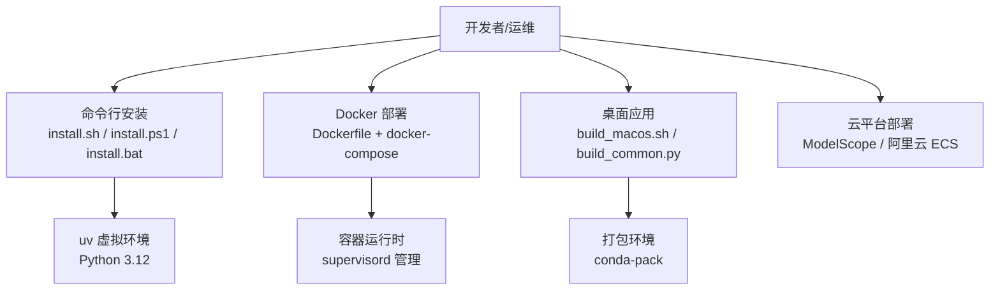
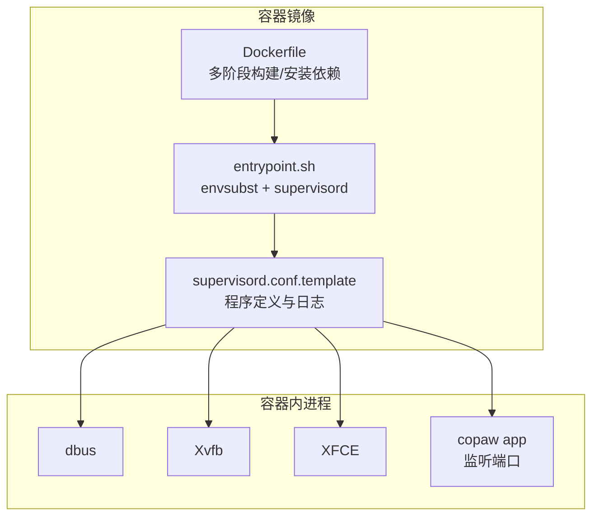
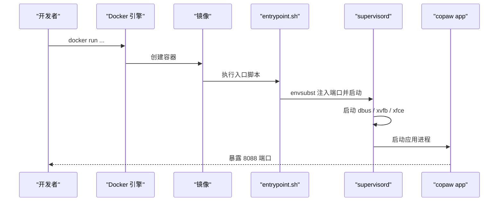
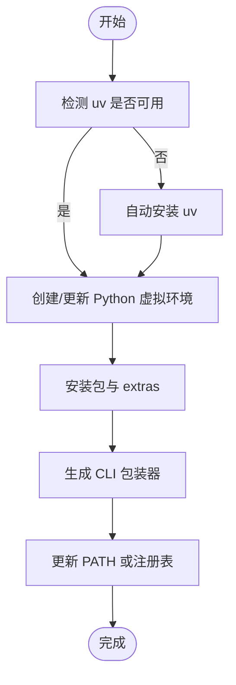
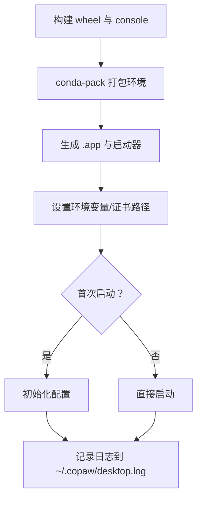
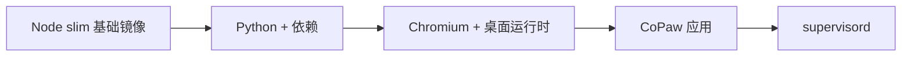

# 部署运维

<cite>
**本文引用的文件**
- [README.md](file://README.md)
- [Dockerfile](file://deploy/Dockerfile)
- [entrypoint.sh](file://deploy/entrypoint.sh)
- [supervisord.conf.template](file://deploy/config/supervisord.conf.template)
- [docker-compose.yml](file://docker-compose.yml)
- [scripts/docker_build.sh](file://scripts/docker_build.sh)
- [scripts/docker_sync_latest.sh](file://scripts/docker_sync_latest.sh)
- [scripts/install.sh](file://scripts/install.sh)
- [scripts/install.ps1](file://scripts/install.ps1)
- [scripts/install.bat](file://scripts/install.bat)
- [scripts/pack/build_macos.sh](file://scripts/pack/build_macos.sh)
- [scripts/pack/build_common.py](file://scripts/pack/build_common.py)
- [src/copaw/utils/logging.py](file://src/copaw/utils/logging.py)
- [src/copaw/config/config.py](file://src/copaw/config/config.py)
</cite>

## 目录
1. [简介](#简介)
2. [项目结构](#项目结构)
3. [核心组件](#核心组件)
4. [架构总览](#架构总览)
5. [详细组件分析](#详细组件分析)
6. [依赖分析](#依赖分析)
7. [性能考虑](#性能考虑)
8. [故障排查指南](#故障排查指南)
9. [结论](#结论)
10. [附录](#附录)

## 简介
本文件面向运维与平台工程团队，系统化梳理 CoPaw 的多种部署方式与运维实践，覆盖本地安装、Docker 容器、桌面应用、云平台一键部署等场景；明确部署前准备、环境要求与依赖检查清单；给出生产环境配置建议、性能优化与监控方案；提供部署脚本使用说明、自动化部署流程与 CI/CD 集成要点；包含日志配置、错误追踪与性能监控方法；以及备份策略、灾难恢复与升级流程，并总结常见部署问题的诊断与解决方案。

## 项目结构
CoPaw 提供多条部署路径与工具链：
- 命令行安装：自动管理 uv 虚拟环境、Python 版本与依赖，支持 extras（如本地模型后端）。
- Docker 容器：官方镜像与自构建镜像，内置前端构建产物，通过 supervisord 管理进程。
- 桌面应用：打包后的 .app（macOS）或安装包（Windows），开箱即用。
- 云平台：提供 ModelScope 一键部署与阿里云 ECS 一键部署链接。
- 自动化脚本：构建镜像、同步 latest 标签、打包桌面应用等。

**章节来源**
- [README.md: 97-321:97-321](file://README.md#L97-L321)
- [Dockerfile: 1-103:1-103](file://deploy/Dockerfile#L1-L103)
- [docker-compose.yml: 1-23:1-23](file://docker-compose.yml#L1-L23)
- [scripts/install.sh: 1-340:1-340](file://scripts/install.sh#L1-L340)
- [scripts/install.ps1: 1-477:1-477](file://scripts/install.ps1#L1-L477)
- [scripts/install.bat: 1-557:1-557](file://scripts/install.bat#L1-L557)
- [scripts/pack/build_macos.sh: 1-184:1-184](file://scripts/pack/build_macos.sh#L1-L184)
- [scripts/pack/build_common.py: 1-321:1-321](file://scripts/pack/build_common.py#L1-L321)

## 核心组件
- 容器镜像与入口
  - 多阶段构建前端产物并打包应用，安装 Python 与必要系统依赖，预置 supervisord 配置模板与入口脚本。
- 进程管理
  - 使用 supervisord 启动 dbus、Xvfb、XFCE 与应用进程，统一输出日志到 /var/log。
- 安装器
  - 自动检测/安装 uv，创建虚拟环境，安装包与可选 extras，生成 CLI 包装器并更新 PATH。
- 桌面应用
  - 通过 conda-pack 打包环境，提供 .app（macOS）启动器，自动初始化配置与日志。
- 日志系统
  - 统一命名空间的日志配置，支持彩色控制台输出与按平台选择文件处理器，支持轮转与文件句柄去重。

**章节来源**
- [Dockerfile: 1-103:1-103](file://deploy/Dockerfile#L1-L103)
- [entrypoint.sh: 1-10:1-10](file://deploy/entrypoint.sh#L1-L10)
- [supervisord.conf.template: 1-40:1-40](file://deploy/config/supervisord.conf.template#L1-L40)
- [scripts/install.sh: 104-245:104-245](file://scripts/install.sh#L104-L245)
- [scripts/install.ps1: 121-324:121-324](file://scripts/install.ps1#L121-L324)
- [scripts/install.bat: 306-459:306-459](file://scripts/install.bat#L306-L459)
- [scripts/pack/build_macos.sh: 59-131:59-131](file://scripts/pack/build_macos.sh#L59-L131)
- [src/copaw/utils/logging.py: 104-185:104-185](file://src/copaw/utils/logging.py#L104-L185)

## 架构总览
下图展示容器部署的关键交互：Dockerfile 定义镜像与运行时，entrypoint.sh 注入端口并启动 supervisord，supervisord 启动 dbus、Xvfb、XFCE 与应用进程，应用监听指定端口并通过 Console 提供 Web 界面。

**图表来源**
- [Dockerfile: 12-103:12-103](file://deploy/Dockerfile#L12-L103)
- [entrypoint.sh: 1-10:1-10](file://deploy/entrypoint.sh#L1-L10)
- [supervisord.conf.template: 1-40:1-40](file://deploy/config/supervisord.conf.template#L1-L40)

**章节来源**
- [Dockerfile: 12-103:12-103](file://deploy/Dockerfile#L12-L103)
- [entrypoint.sh: 1-10:1-10](file://deploy/entrypoint.sh#L1-L10)
- [supervisord.conf.template: 14-31:14-31](file://deploy/config/supervisord.conf.template#L14-L31)

## 详细组件分析

### Docker 部署
- 镜像构建
  - 多阶段构建前端产物，复制至应用目录；安装 Python、编译工具、Chromium 与桌面运行时；安装应用与默认配置。
  - 支持通过构建参数控制通道白/黑名单，便于裁剪镜像。
- 运行时
  - 默认暴露 8088 端口，可通过环境变量覆盖；入口脚本使用 envsubst 将端口注入 supervisord 配置，然后启动 supervisord。
  - supervisord 管理 dbus、Xvfb、XFCE 与应用进程，统一输出日志。
- 编排
  - docker-compose 提供数据卷与端口映射示例，便于持久化工作区与密钥区。

**图表来源**
- [Dockerfile: 82-99:82-99](file://deploy/Dockerfile#L82-L99)
- [entrypoint.sh: 5-9:5-9](file://deploy/entrypoint.sh#L5-L9)
- [supervisord.conf.template: 14-21:14-21](file://deploy/config/supervisord.conf.template#L14-L21)

**章节来源**
- [Dockerfile: 20-25:20-25](file://deploy/Dockerfile#L20-L25)
- [Dockerfile: 94-99:94-99](file://deploy/Dockerfile#L94-L99)
- [entrypoint.sh: 5-9:5-9](file://deploy/entrypoint.sh#L5-L9)
- [supervisord.conf.template: 14-21:14-21](file://deploy/config/supervisord.conf.template#L14-L21)
- [docker-compose.yml: 14-22:14-22](file://docker-compose.yml#L14-L22)

### 命令行安装（uv 管理）
- 自动化流程
  - 自动检测/安装 uv，创建 Python 3.12 虚拟环境，安装包与 extras，生成包装器并更新 PATH。
  - 支持从源码安装、指定版本安装与 extras 列表。
- Windows 特性
  - 提供 .ps1 与 .bat 两套安装脚本，自动处理执行策略、Constrained Language Mode、注册表 PATH 更新等。

**图表来源**
- [scripts/install.sh: 104-147:104-147](file://scripts/install.sh#L104-L147)
- [scripts/install.ps1: 121-209:121-209](file://scripts/install.ps1#L121-L209)
- [scripts/install.bat: 306-329:306-329](file://scripts/install.bat#L306-L329)

**章节来源**
- [scripts/install.sh: 104-245:104-245](file://scripts/install.sh#L104-L245)
- [scripts/install.ps1: 121-324:121-324](file://scripts/install.ps1#L121-L324)
- [scripts/install.bat: 306-459:306-459](file://scripts/install.bat#L306-L459)

### 桌面应用（macOS）
- 打包流程
  - 先构建 wheel 与 console 前端，再使用 conda-pack 打包环境，生成 .app 并在启动器中设置环境变量与日志路径。
- 启动行为
  - 首次启动自动初始化配置；非 TTY 时将日志重定向到用户目录日志文件；支持通过环境变量设置日志级别与证书路径。

**图表来源**
- [scripts/pack/build_macos.sh: 14-40:14-40](file://scripts/pack/build_macos.sh#L14-L40)
- [scripts/pack/build_common.py: 76-316:76-316](file://scripts/pack/build_common.py#L76-L316)
- [scripts/pack/build_macos.sh: 59-131:59-131](file://scripts/pack/build_macos.sh#L59-L131)

**章节来源**
- [scripts/pack/build_macos.sh: 14-40:14-40](file://scripts/pack/build_macos.sh#L14-L40)
- [scripts/pack/build_common.py: 76-316:76-316](file://scripts/pack/build_common.py#L76-L316)
- [scripts/pack/build_macos.sh: 59-131:59-131](file://scripts/pack/build_macos.sh#L59-L131)

### 云平台与一键部署
- ModelScope 一键部署：无需本地安装，直接在云端创建实例。
- 阿里云 ECS 一键部署：提供服务创建链接，快速拉起实例。

**章节来源**
- [README.md: 314-321:314-321](file://README.md#L314-L321)

## 依赖分析
- 容器镜像依赖
  - 基于 slim Node 镜像，安装 Python、编译工具、Chromium 与桌面运行时，确保浏览器自动化能力。
  - 通过 supervisord 管理多个系统级进程，保证桌面环境可用。
- 安装器依赖
  - 依赖 uv 管理 Python 环境与包；Windows 安装器同时处理执行策略与注册表 PATH。
- 桌面应用依赖
  - 依赖 conda-pack 打包环境；启动器设置 SSL 证书路径以适配打包环境。

**图表来源**
- [Dockerfile: 29-68:29-68](file://deploy/Dockerfile#L29-L68)
- [Dockerfile: 82-89:82-89](file://deploy/Dockerfile#L82-L89)

**章节来源**
- [Dockerfile: 29-68:29-68](file://deploy/Dockerfile#L29-L68)
- [Dockerfile: 82-89:82-89](file://deploy/Dockerfile#L82-L89)

## 性能考虑
- 容器运行时
  - 使用 Xvfb 与 XFCE 提供无头桌面环境，适合浏览器自动化；如需更高性能，可在宿主机启用硬件加速或调整显示分辨率。
- 进程管理
  - supervisord 设置优先级与自动重启，确保服务稳定性；建议结合外部监控与健康检查。
- 日志与 I/O
  - 文件日志在不同平台采用不同策略（Windows/Linux 使用简单文件句柄，macOS 使用轮转），避免锁竞争与磁盘占用。
- 本地模型
  - 如使用 llama.cpp/MLX/Ollama，建议在宿主机或专用服务侧部署，容器内通过网络访问，减少容器体积与资源争用。

**章节来源**
- [supervisord.conf.template: 14-39:14-39](file://deploy/config/supervisord.conf.template#L14-L39)
- [src/copaw/utils/logging.py: 142-185:142-185](file://src/copaw/utils/logging.py#L142-L185)
- [README.md: 338-354:338-354](file://README.md#L338-L354)

## 故障排查指南
- 容器端口冲突
  - 确认宿主机端口未被占用；如需变更，通过环境变量覆盖默认端口并在 docker run 中重新映射。
- 无法访问 Ollama/LM Studio
  - 在容器内 localhost 指向容器自身；使用 host.docker.internal 或 host-gateway 方案，或将网络模式设为 host（Linux）。
- Windows 安装失败
  - 检查执行策略与 Constrained Language Mode；手动安装 uv 并更新 PATH；必要时使用 .cmd 脚本。
- 日志定位
  - 容器：查看 supervisord 与各子进程日志；桌面应用：查看用户目录下的日志文件。
- 权限与密钥
  - 确保工作区与密钥区挂载正确且具备读写权限；API 密钥通过环境变量或 Console 设置。

**章节来源**
- [docker-compose.yml: 14-22:14-22](file://docker-compose.yml#L14-L22)
- [README.md: 287-311:287-311](file://README.md#L287-L311)
- [scripts/install.ps1: 68-83:68-83](file://scripts/install.ps1#L68-L83)
- [scripts/install.bat: 306-329:306-329](file://scripts/install.bat#L306-L329)
- [scripts/pack/build_macos.sh: 86-125:86-125](file://scripts/pack/build_macos.sh#L86-L125)

## 结论
CoPaw 提供从命令行到容器、从桌面应用到云平台的完整部署谱系。通过 uv/conda-pack 等工具实现环境隔离与可移植性，借助 supervisord 保障进程稳定性。建议在生产环境中结合健康检查、日志轮转与密钥管理策略，配合 CI/CD 实现自动化发布与回滚。

## 附录

### 部署前准备与环境要求
- 通用
  - 确认系统满足最低版本要求（Windows 10+/macOS 14+）；准备可写的工作目录与密钥目录。
- Docker
  - 准备 Docker 与 docker-compose；如需跨主机访问本地模型服务，准备 host.docker.internal 映射。
- 桌面应用
  - macOS 首次启动可能较慢，等待初始化完成；必要时解除系统安全限制。
- 云平台
  - ModelScope 与阿里云 ECS 一键部署，按提示完成鉴权与网络配置。

**章节来源**
- [README.md: 271-321:271-321](file://README.md#L271-L321)
- [scripts/pack/build_macos.sh: 254-267:254-267](file://scripts/pack/build_macos.sh#L254-L267)

### 生产环境配置建议
- 端口与网络
  - 固定端口映射并开启防火墙放行；如需反向代理，确保 WebSocket 与静态资源转发正确。
- 数据持久化
  - 使用独立卷保存工作区与密钥区，避免容器重建导致数据丢失。
- 安全
  - 仅暴露必要端口；在 Console 中集中管理 API 密钥；必要时启用 Web 认证。
- 可观测性
  - 开启应用日志轮转；结合外部日志收集与告警；对关键进程设置健康检查。

**章节来源**
- [docker-compose.yml: 20-22:20-22](file://docker-compose.yml#L20-L22)
- [src/copaw/utils/logging.py: 142-185:142-185](file://src/copaw/utils/logging.py#L142-L185)

### 性能优化与监控
- 进程与资源
  - 合理设置 supervisord 优先级与重启策略；根据并发需求调整容器资源限制。
- 日志与指标
  - 使用统一日志格式与命名空间；在容器外聚合日志；对关键接口与错误进行采样与告警。
- 浏览器自动化
  - 在容器内使用无头模式与固定分辨率，减少内存与 CPU 占用。

**章节来源**
- [supervisord.conf.template: 14-39:14-39](file://deploy/config/supervisord.conf.template#L14-L39)
- [src/copaw/utils/logging.py: 104-185:104-185](file://src/copaw/utils/logging.py#L104-L185)

### 备份策略与灾难恢复
- 备份对象
  - 工作区（配置、记忆、技能）、密钥区（API 密钥、证书）。
- 备份方式
  - 定期导出配置与快照；对密钥区进行加密备份。
- 恢复流程
  - 停止服务 → 恢复卷 → 启动服务 → 验证 Console 与各通道连通性。

**章节来源**
- [docker-compose.yml: 3-7:3-7](file://docker-compose.yml#L3-L7)

### 升级流程
- 命令行安装
  - 重新运行安装脚本即可升级；如需保留数据，确保安装目录与工作区不变。
- Docker
  - 拉取新镜像 → 停止旧容器 → 删除旧容器 → 以相同卷与端口启动新容器。
- 桌面应用
  - 下载新版安装包 → 安装 → 首次启动自动迁移配置。

**章节来源**
- [scripts/install.sh: 310-340:310-340](file://scripts/install.sh#L310-L340)
- [scripts/install.ps1: 452-476:452-476](file://scripts/install.ps1#L452-L476)
- [scripts/install.bat: 535-557:535-557](file://scripts/install.bat#L535-L557)
- [README.md: 271-281:271-281](file://README.md#L271-L281)

### CI/CD 集成要点
- 构建镜像
  - 使用 scripts/docker_build.sh 指定标签与构建参数；支持通道裁剪与 extras 注入。
- 同步标签
  - 使用 scripts/docker_sync_latest.sh 将 pre 标签同步为 latest，便于稳定版本分发。
- 自动化测试
  - 在流水线中运行单元测试与集成测试，确保升级不影响功能。

**章节来源**
- [scripts/docker_build.sh: 1-32:1-32](file://scripts/docker_build.sh#L1-L32)
- [scripts/docker_sync_latest.sh: 41-77:41-77](file://scripts/docker_sync_latest.sh#L41-L77)

### 日志配置与错误追踪
- 控制台日志
  - 使用统一命名空间与彩色输出；在容器内通过 supervisord 日志文件查看；桌面应用将日志写入用户目录。
- 文件日志
  - 按平台选择文件处理器；macOS 使用轮转；Windows/Linux 使用简单文件句柄，避免锁竞争。
- 错误追踪
  - 在 Console 中查看最近错误；结合容器日志与应用日志定位问题；必要时临时提升日志级别。

**章节来源**
- [src/copaw/utils/logging.py: 104-185:104-185](file://src/copaw/utils/logging.py#L104-L185)
- [scripts/pack/build_macos.sh: 86-125:86-125](file://scripts/pack/build_macos.sh#L86-L125)

### 配置与工作区
- 配置项概览
  - 通道配置（启用/禁用、策略、媒体目录等）、心跳配置、工具与安全策略、MCP 客户端等。
- 工作区与密钥区
  - 工作区保存配置与记忆；密钥区保存敏感信息；两者分别挂载到独立卷。

**章节来源**
- [src/copaw/config/config.py: 167-185:167-185](file://src/copaw/config/config.py#L167-L185)
- [src/copaw/config/config.py: 199-211:199-211](file://src/copaw/config/config.py#L199-L211)
- [docker-compose.yml: 20-22:20-22](file://docker-compose.yml#L20-L22)