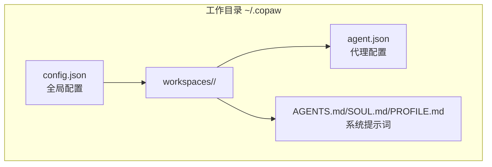
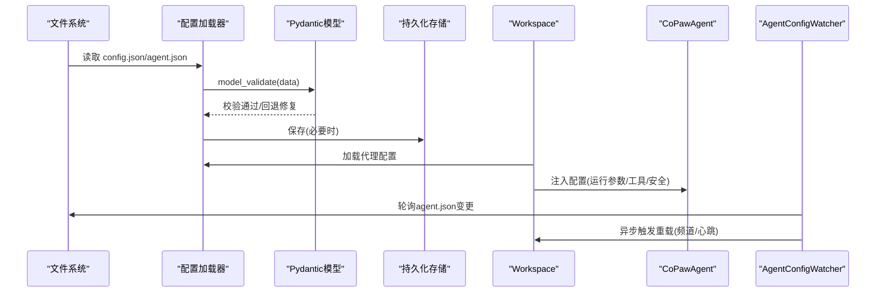
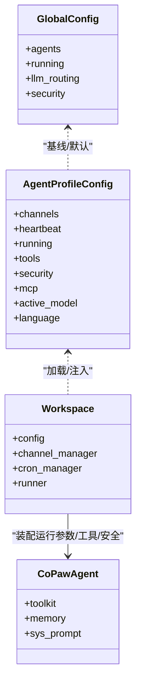
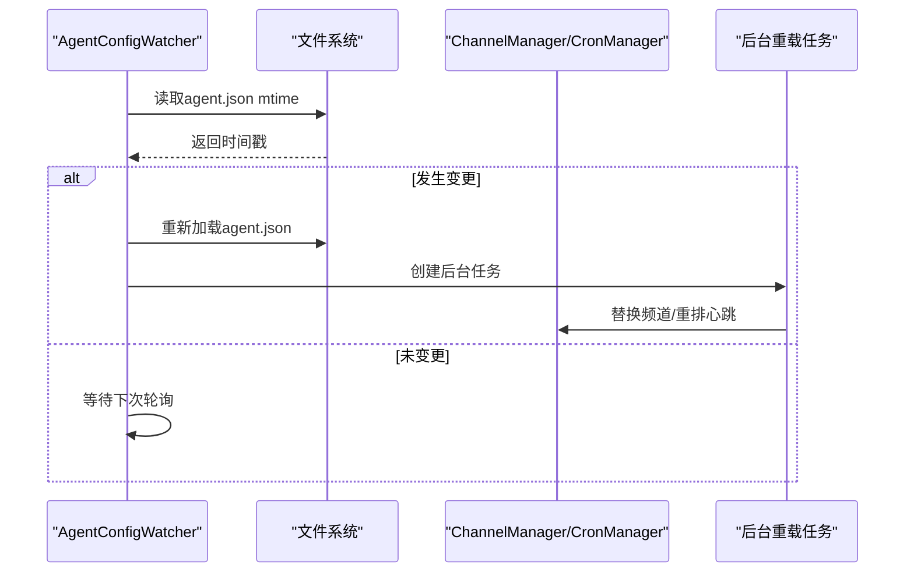
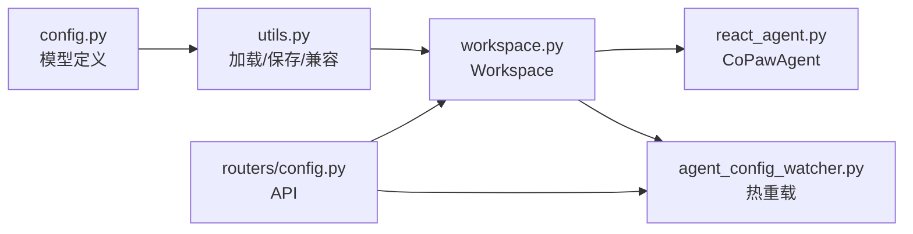

# 代理配置

<cite>
**本文引用的文件**
- [config.py](file://src/copaw/config/config.py)
- [utils.py](file://src/copaw/config/utils.py)
- [agent_config_watcher.py](file://src/copaw/app/agent_config_watcher.py)
- [workspace.py](file://src/copaw/app/workspace/workspace.py)
- [service_factories.py](file://src/copaw/app/workspace/service_factories.py)
- [config.py（路由）](file://src/copaw/app/routers/config.py)
- [react_agent.py](file://src/copaw/agents/react_agent.py)
- [models.py](file://src/copaw/providers/models.py)
- [migration.py](file://src/copaw/app/migration.py)
- [config.zh.md](file://website/public/docs/config.zh.md)
</cite>

## 目录
1. [简介](#简介)
2. [项目结构](#项目结构)
3. [核心组件](#核心组件)
4. [架构总览](#架构总览)
5. [详细组件分析](#详细组件分析)
6. [依赖分析](#依赖分析)
7. [性能考虑](#性能考虑)
8. [故障排查指南](#故障排查指南)
9. [结论](#结论)
10. [附录](#附录)

## 简介
本文件系统化梳理 CoPaw 的“代理配置”体系，覆盖：
- 全局代理设置与单个代理配置的结构与差异
- 核心配置项：模型选择、工具配置、安全设置、运行参数
- 继承关系：从工作空间配置到代理实例配置的层级结构
- 验证规则、默认值与冲突解决机制
- 热重载、配置备份与版本兼容处理
- 实战示例与最佳实践

## 项目结构
CoPaw 将配置分为两层：
- 全局配置：位于工作目录根的 config.json，包含智能体概览、全局运行参数、提供商等
- 代理配置：位于各智能体工作区的 agent.json，包含该智能体的频道、心跳、工具、MCP、运行参数、安全策略等

图表来源
- [config.zh.md:13-66](file://website/public/docs/config.zh.md#L13-L66)

章节来源
- [config.zh.md:13-66](file://website/public/docs/config.zh.md#L13-L66)

## 核心组件
- 全局配置模型：定义全局字段、默认值与兼容性处理
- 代理配置模型：定义代理级字段（频道、心跳、运行参数、工具、安全、MCP、模型槽位等）
- 配置加载与保存：统一的加载/校验/回退与持久化流程
- 热重载：基于文件监控的增量更新与异步重载
- 工作区：封装代理运行时组件（Runner、ChannelManager、MemoryManager、CronManager、MCPClientManager）

章节来源
- [config.py:455-525](file://src/copaw/config/config.py#L455-L525)
- [config.py:394-453](file://src/copaw/config/config.py#L394-L453)
- [utils.py:423-474](file://src/copaw/config/utils.py#L423-L474)
- [workspace.py:39-122](file://src/copaw/app/workspace/workspace.py#L39-L122)

## 架构总览
代理配置的生命周期：从文件读取、模型校验、合并默认值、持久化，再到运行时注入到代理实例，支持热重载与版本迁移。

图表来源
- [utils.py:423-474](file://src/copaw/config/utils.py#L423-L474)
- [workspace.py:116-122](file://src/copaw/app/workspace/workspace.py#L116-L122)
- [agent_config_watcher.py:74-132](file://src/copaw/app/agent_config_watcher.py#L74-L132)

## 详细组件分析

### 1) 全局配置与代理配置的结构与差异
- 全局配置（config.json）
  - 包含 agents 概览（active_agent、profiles）、全局运行参数（如 running、llm_routing）、音频模式、转录配置、安全策略等
  - 作为代理配置的“基线”，代理配置可覆盖或补充
- 代理配置（agent.json）
  - 包含该代理的独立设置：channels、heartbeat、running、tools、security、mcp、active_model、language、system_prompt_files 等
  - 代理配置优先于全局配置生效

章节来源
- [config.py:455-525](file://src/copaw/config/config.py#L455-L525)
- [config.py:394-453](file://src/copaw/config/config.py#L394-L453)
- [config.py:475-485](file://src/copaw/config/config.py#L475-L485)

### 2) 核心配置项详解
- 模型选择
  - 全局：agents.llm_routing（双槽位路由策略）
  - 代理：active_model（provider_id + model），可覆盖全局
- 工具配置
  - tools.builtin_tools：内置工具开关与显示策略
- 安全设置
  - security.tool_guard：工具守卫规则集
  - security.skill_scanner：技能扫描策略与白名单
- 运行参数
  - running.max_iters、max_input_length、memory_compact_*、tool_result_compact_* 等
  - embedding_config：嵌入模型配置
- 频道与心跳
  - channels：各渠道的启用与参数
  - heartbeat：周期、目标、活跃时段

章节来源
- [config.py:355-378](file://src/copaw/config/config.py#L355-L378)
- [config.py:425-453](file://src/copaw/config/config.py#L425-L453)
- [config.py:252-353](file://src/copaw/config/config.py#L252-L353)
- [config.py:213-250](file://src/copaw/config/config.py#L213-L250)
- [config.py:199-211](file://src/copaw/config/config.py#L199-L211)

### 3) 继承关系与层级结构
- 层级顺序：全局配置（基线）→ 代理配置（覆盖）→ 运行时注入（最终生效）
- 运行时装配：Workspace 在启动时加载代理配置，注入到 Runner、ChannelManager、MemoryManager 等组件
- 热重载：AgentConfigWatcher 监控 agent.json，按需重载频道与心跳

图表来源
- [config.py:455-525](file://src/copaw/config/config.py#L455-L525)
- [config.py:394-453](file://src/copaw/config/config.py#L394-L453)
- [workspace.py:116-122](file://src/copaw/app/workspace/workspace.py#L116-L122)
- [react_agent.py:83-165](file://src/copaw/agents/react_agent.py#L83-L165)

章节来源
- [workspace.py:116-122](file://src/copaw/app/workspace/workspace.py#L116-L122)
- [react_agent.py:83-165](file://src/copaw/agents/react_agent.py#L83-L165)

### 4) 验证规则、默认值与冲突解决
- 验证与回退
  - 加载失败时尝试移除导致错误的字段并再次校验，若仍失败则返回默认配置
- 默认值
  - 多处使用默认工厂或显式默认值（如 running、llm_routing、channels 等）
- 兼容性
  - 兼容旧字段（如 last_api_host/port → last_api），并保留降级兼容字段
- 冲突解决
  - 代理配置优先于全局配置；未显式设置的字段采用默认值

章节来源
- [utils.py:423-474](file://src/copaw/config/utils.py#L423-L474)
- [utils.py:446-460](file://src/copaw/config/utils.py#L446-L460)
- [config.py:475-485](file://src/copaw/config/config.py#L475-L485)
- [config.py:472-474](file://src/copaw/config/config.py#L472-L474)

### 5) 热重载机制
- 文件监控：AgentConfigWatcher 轮询 agent.json，计算哈希判断变更
- 增量重载：仅对变更的频道进行替换，心跳变更触发重新调度
- 异步执行：后台任务触发重载，避免阻塞请求

图表来源
- [agent_config_watcher.py:240-278](file://src/copaw/app/agent_config_watcher.py#L240-L278)
- [agent_config_watcher.py:178-217](file://src/copaw/app/agent_config_watcher.py#L178-L217)
- [agent_config_watcher.py:218-239](file://src/copaw/app/agent_config_watcher.py#L218-L239)

章节来源
- [agent_config_watcher.py:74-132](file://src/copaw/app/agent_config_watcher.py#L74-L132)
- [agent_config_watcher.py:178-217](file://src/copaw/app/agent_config_watcher.py#L178-L217)
- [agent_config_watcher.py:218-239](file://src/copaw/app/agent_config_watcher.py#L218-L239)

### 6) 配置备份与版本兼容
- 迁移与备份
  - 迁移脚本将旧版工作区迁移至新结构，保留旧配置字段以支持降级
- 版本兼容
  - 旧字段映射（如 last_api_host → last_api），兼容降级场景
- 备份建议
  - 在大规模改动前，保留 config.json 与 agent.json 的历史快照

章节来源
- [migration.py:47-154](file://src/copaw/app/migration.py#L47-L154)
- [utils.py:436-444](file://src/copaw/config/utils.py#L436-L444)
- [config.py:1070-1089](file://src/copaw/config/config.py#L1070-L1089)

### 7) API 与控制台集成
- 频道配置
  - GET /config/channels 列出可用频道及其配置
  - PUT /config/channels 更新全部频道配置，触发后台重载
  - GET/PUT /config/channels/{channel_name} 单个频道更新
- 心跳配置
  - GET/PUT /config/heartbeat 更新心跳配置并重排调度
- 安全配置
  - GET/PUT /config/security/tool-guard
  - GET/PUT /config/security/skill-scanner 及其白名单与历史

章节来源
- [config.py（路由）:59-98](file://src/copaw/app/routers/config.py#L59-L98)
- [config.py（路由）:111-153](file://src/copaw/app/routers/config.py#L111-L153)
- [config.py（路由）:155-196](file://src/copaw/app/routers/config.py#L155-L196)
- [config.py（路由）:199-265](file://src/copaw/app/routers/config.py#L199-L265)
- [config.py（路由）:268-325](file://src/copaw/app/routers/config.py#L268-L325)
- [config.py（路由）:385-414](file://src/copaw/app/routers/config.py#L385-L414)
- [config.py（路由）:446-467](file://src/copaw/app/routers/config.py#L446-L467)

### 8) 运行时装配与工具/安全注入
- Workspace 在启动时加载代理配置，并将 running、tools、security 等注入到 Runner/Agent
- CoPawAgent 从 agent_config.running 获取 max_iters/max_input_length 等参数
- 工具注册与安全拦截通过 mixin 机制在运行时生效

章节来源
- [workspace.py:116-122](file://src/copaw/app/workspace/workspace.py#L116-L122)
- [react_agent.py:83-165](file://src/copaw/agents/react_agent.py#L83-L165)
- [react_agent.py:166-200](file://src/copaw/agents/react_agent.py#L166-L200)

## 依赖分析
- 配置模型依赖 Pydantic 进行校验与序列化
- Workspace 依赖 ServiceManager 组织组件生命周期
- AgentConfigWatcher 依赖文件系统与 ChannelManager/CronManager
- 路由层负责对外暴露配置接口，并触发后台重载

图表来源
- [config.py:455-525](file://src/copaw/config/config.py#L455-L525)
- [utils.py:423-474](file://src/copaw/config/utils.py#L423-L474)
- [workspace.py:134-277](file://src/copaw/app/workspace/workspace.py#L134-L277)
- [react_agent.py:83-165](file://src/copaw/agents/react_agent.py#L83-L165)
- [agent_config_watcher.py:35-131](file://src/copaw/app/agent_config_watcher.py#L35-L131)
- [config.py（路由）:40-56](file://src/copaw/app/routers/config.py#L40-L56)

章节来源
- [workspace.py:134-277](file://src/copaw/app/workspace/workspace.py#L134-L277)
- [agent_config_watcher.py:35-131](file://src/copaw/app/agent_config_watcher.py#L35-L131)
- [config.py（路由）:40-56](file://src/copaw/app/routers/config.py#L40-L56)

## 性能考虑
- 热重载轮询间隔可调，默认约 2 秒，可根据部署规模调整
- 频道重载采用“按需替换”，避免全量重启
- 运行参数中的内存压缩阈值与比例影响上下文窗口占用与 GC 频率
- 工具结果压缩策略（recent/n/old/threshold/days）平衡存储与检索成本

[本节为通用指导，无需特定文件来源]

## 故障排查指南
- 配置加载失败
  - 现象：启动时报错或回退到默认配置
  - 排查：检查 JSON 语法、字段类型；确认旧字段是否被映射到新字段
- 热重载不生效
  - 现象：修改 agent.json 后未见频道/心跳变化
  - 排查：确认 Watcher 已启动、轮询间隔、文件权限；查看日志输出
- 工具/安全策略异常
  - 现象：工具被拦截或未注册
  - 排查：核对 tools.builtin_tools.enabled 与 security.tool_guard 设置
- 模型选择冲突
  - 现象：代理未使用预期模型
  - 排查：确认 agent.active_model 是否存在，否则回退到全局 llm_routing

章节来源
- [utils.py:446-460](file://src/copaw/config/utils.py#L446-L460)
- [agent_config_watcher.py:240-278](file://src/copaw/app/agent_config_watcher.py#L240-L278)
- [config.py:425-453](file://src/copaw/config/config.py#L425-L453)
- [config.py:355-378](file://src/copaw/config/config.py#L355-L378)

## 结论
CoPaw 的代理配置体系通过“全局基线 + 代理覆盖”的分层设计，结合严格的模型校验、默认值与兼容性策略，以及文件监控驱动的热重载机制，实现了灵活、稳定且可演进的配置管理。配合 API 与控制台，用户可在不中断服务的情况下完成配置迭代与优化。

[本节为总结，无需特定文件来源]

## 附录

### A. 配置示例与最佳实践
- 示例
  - 全局配置示例与字段说明参见文档
  - 代理配置示例与字段说明参见文档
- 最佳实践
  - 使用 agent.json 精细化控制每个代理的频道与运行参数
  - 通过 security.tool_guard 与 skill_scanner 保障工具与技能安全
  - 合理设置 running.memory_compact_* 与 tool_result_compact_*，平衡性能与存储
  - 在生产环境开启热重载并设置合适的轮询间隔

章节来源
- [config.zh.md:108-187](file://website/public/docs/config.zh.md#L108-L187)

### B. 配置验证与默认值速览
- 验证
  - model_validate + 错误字段自动移除 + 回退到默认配置
- 默认值
  - running.max_iters、max_input_length、memory_compact_ratio、tool_result_compact_* 等均有明确默认
  - llm_routing.enabled=false，mode=local_first
  - channels.* 默认禁用，需显式启用

章节来源
- [utils.py:446-460](file://src/copaw/config/utils.py#L446-L460)
- [config.py:252-353](file://src/copaw/config/config.py#L252-L353)
- [config.py:355-378](file://src/copaw/config/config.py#L355-L378)
- [config.py:167-184](file://src/copaw/config/config.py#L167-L184)

### C. 模型槽位与提供商
- 模型槽位：provider_id + model
- 提供商定义与设置：包含默认 base_url、api_key_prefix、模型列表等

章节来源
- [models.py:74-81](file://src/copaw/providers/models.py#L74-L81)
- [models.py:16-51](file://src/copaw/providers/models.py#L16-L51)