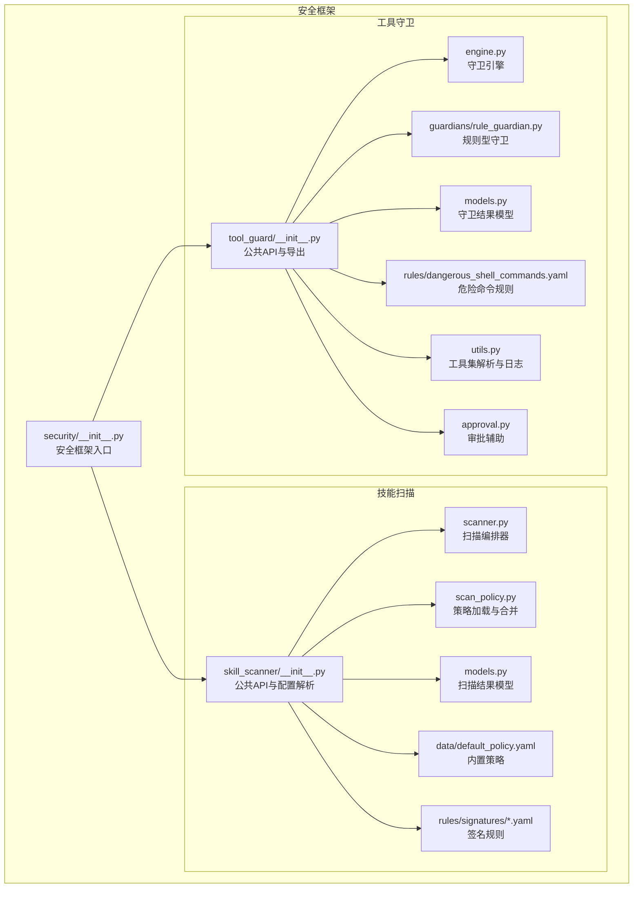
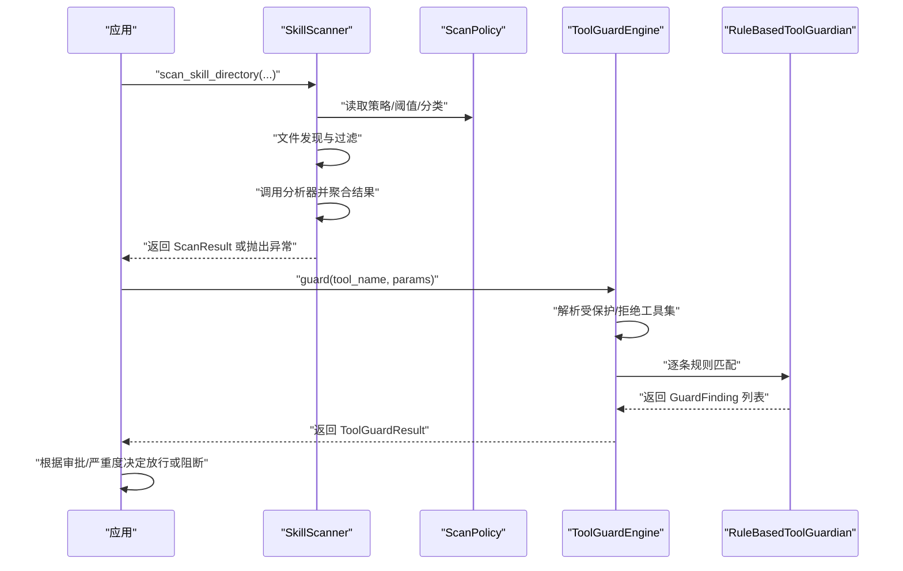
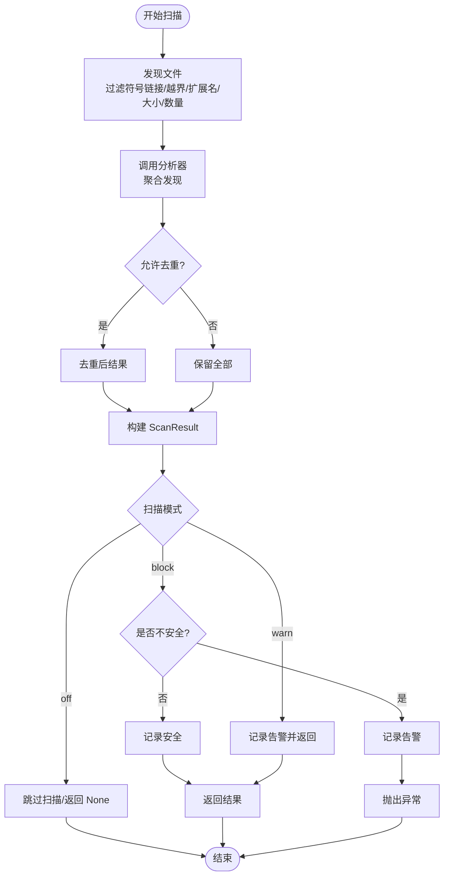
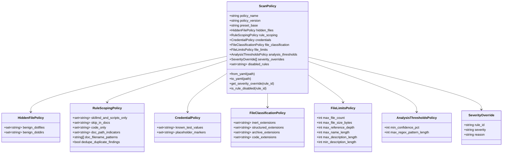
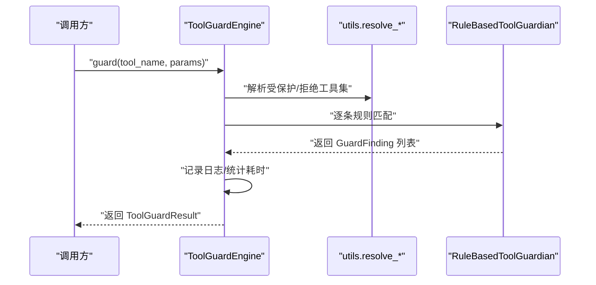
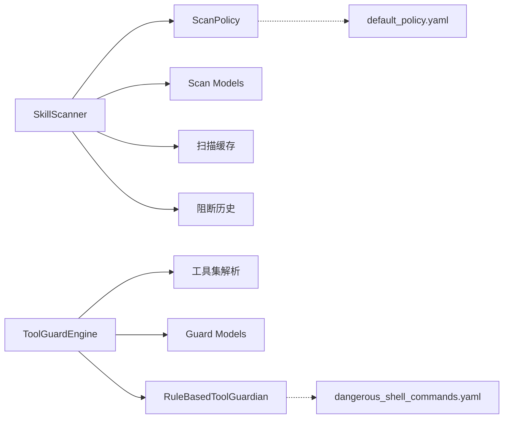

# 安全配置

<cite>
**本文引用的文件**
- [security/__init__.py](file://src/copaw/security/__init__.py)
- [skill_scanner/__init__.py](file://src/copaw/security/skill_scanner/__init__.py)
- [tool_guard/__init__.py](file://src/copaw/security/tool_guard/__init__.py)
- [models.py（技能扫描）](file://src/copaw/security/skill_scanner/models.py)
- [models.py（工具守卫）](file://src/copaw/security/tool_guard/models.py)
- [scan_policy.py](file://src/copaw/security/skill_scanner/scan_policy.py)
- [scanner.py](file://src/copaw/security/skill_scanner/scanner.py)
- [engine.py](file://src/copaw/security/tool_guard/engine.py)
- [rule_guardian.py](file://src/copaw/security/tool_guard/guardians/rule_guardian.py)
- [default_policy.yaml](file://src/copaw/security/skill_scanner/data/default_policy.yaml)
- [command_injection.yaml](file://src/copaw/security/skill_scanner/rules/signatures/command_injection.yaml)
- [dangerous_shell_commands.yaml](file://src/copaw/security/tool_guard/rules/dangerous_shell_commands.yaml)
- [utils.py（工具守卫）](file://src/copaw/security/tool_guard/utils.py)
- [approval.py（工具守卫）](file://src/copaw/security/tool_guard/approval.py)
</cite>

## 目录
1. [简介](#简介)
2. [项目结构](#项目结构)
3. [核心组件](#核心组件)
4. [架构总览](#架构总览)
5. [详细组件分析](#详细组件分析)
6. [依赖关系分析](#依赖关系分析)
7. [性能考量](#性能考量)
8. [故障排查指南](#故障排查指南)
9. [结论](#结论)
10. [附录](#附录)

## 简介
本文件系统化梳理 CoPaw 的安全配置体系，覆盖以下方面：
- 工具防护：在工具调用前对参数进行规则匹配与风险评估，支持审批流程与拒绝标记。
- 技能扫描：对技能包进行静态分析，识别潜在威胁（命令注入、数据外泄、硬编码密钥等），支持策略化规则与白名单。
- 访问控制：通过环境变量与配置文件控制启用范围、受保护工具集与拒绝工具集。
- 规则定义与配置格式：YAML 规则文件与策略文件的字段说明、优先级与继承关系。
- 生效机制：扫描模式、超时、缓存、白名单、阻断与告警的联动。
- 验证规则、默认策略与最佳实践：如何校验配置正确性、推荐的最小权限与最小暴露面原则。
- 示例模板与常见场景：提供可直接参考的配置模板与典型场景方案。
- 热更新、审计日志与安全事件处理：运行时重载规则、结构化日志输出与阻断历史记录。

## 项目结构
安全子系统位于 src/copaw/security 下，分为两个独立但互补的模块：
- skill_scanner：技能静态扫描与策略管理
- tool_guard：工具调用前的参数守卫与审批

**图表来源**
- [security/__init__.py:1-17](file://src/copaw/security/__init__.py#L1-L17)
- [skill_scanner/__init__.py:1-505](file://src/copaw/security/skill_scanner/__init__.py#L1-L505)
- [tool_guard/__init__.py:1-57](file://src/copaw/security/tool_guard/__init__.py#L1-L57)
- [scanner.py:1-319](file://src/copaw/security/skill_scanner/scanner.py#L1-L319)
- [scan_policy.py:1-476](file://src/copaw/security/skill_scanner/scan_policy.py#L1-L476)
- [engine.py:1-218](file://src/copaw/security/tool_guard/engine.py#L1-L218)
- [rule_guardian.py:1-383](file://src/copaw/security/tool_guard/guardians/rule_guardian.py#L1-L383)
- [default_policy.yaml:1-245](file://src/copaw/security/skill_scanner/data/default_policy.yaml#L1-L245)
- [dangerous_shell_commands.yaml:1-120](file://src/copaw/security/tool_guard/rules/dangerous_shell_commands.yaml#L1-L120)
- [utils.py（工具守卫）:1-156](file://src/copaw/security/tool_guard/utils.py#L1-L156)
- [approval.py（工具守卫）:1-38](file://src/copaw/security/tool_guard/approval.py#L1-L38)

**章节来源**
- [security/__init__.py:1-17](file://src/copaw/security/__init__.py#L1-L17)
- [skill_scanner/__init__.py:1-505](file://src/copaw/security/skill_scanner/__init__.py#L1-L505)
- [tool_guard/__init__.py:1-57](file://src/copaw/security/tool_guard/__init__.py#L1-L57)

## 核心组件
- 技能扫描器（SkillScanner）
  - 负责遍历技能目录、按策略过滤文件、调用分析器聚合结果。
  - 支持缓存、超时、白名单与阻断/告警联动。
- 扫描策略（ScanPolicy）
  - 内置默认策略，支持用户自定义策略文件叠加，提供隐藏文件、规则作用域、凭证抑制、文件分类、阈值与严重度覆盖等配置。
- 工具守卫引擎（ToolGuardEngine）
  - 在工具调用前扫描参数，支持多守卫器、规则热重载、受保护工具集与拒绝工具集。
- 规则型守卫（RuleBasedToolGuardian）
  - 基于 YAML 规则的正则匹配，支持内置规则与配置扩展规则。
- 模型层
  - ScanResult/GuardFinding/ToolGuardResult 等统一描述“发现”“严重度”“类别”“修复建议”等信息，便于日志与审批展示。

**章节来源**
- [scanner.py:76-319](file://src/copaw/security/skill_scanner/scanner.py#L76-L319)
- [scan_policy.py:156-476](file://src/copaw/security/skill_scanner/scan_policy.py#L156-L476)
- [engine.py:52-218](file://src/copaw/security/tool_guard/engine.py#L52-L218)
- [rule_guardian.py:280-383](file://src/copaw/security/tool_guard/guardians/rule_guardian.py#L280-L383)
- [models.py（技能扫描）:16-235](file://src/copaw/security/skill_scanner/models.py#L16-L235)
- [models.py（工具守卫）:25-185](file://src/copaw/security/tool_guard/models.py#L25-L185)

## 架构总览
下图展示从应用启动到执行阶段的安全控制路径，包括技能扫描与工具守卫的关键节点与优先级来源。

**图表来源**
- [skill_scanner/__init__.py:415-505](file://src/copaw/security/skill_scanner/__init__.py#L415-L505)
- [scanner.py:148-242](file://src/copaw/security/skill_scanner/scanner.py#L148-L242)
- [scan_policy.py:236-304](file://src/copaw/security/skill_scanner/scan_policy.py#L236-L304)
- [engine.py:161-206](file://src/copaw/security/tool_guard/engine.py#L161-L206)
- [rule_guardian.py:329-382](file://src/copaw/security/tool_guard/guardians/rule_guardian.py#L329-L382)

## 详细组件分析

### 技能扫描（SkillScanner）
- 文件发现与过滤
  - 跳过符号链接与越界路径；按策略/回退规则过滤扩展名；按大小与数量阈值限制。
- 分析器编排
  - 默认使用 PatternAnalyzer；支持注册自定义分析器；失败项记录在 analyzers_failed 中。
- 结果聚合
  - 合并去重后生成 ScanResult，包含最高严重度、分析器列表与失败详情。
- 缓存与超时
  - 基于目录 mtime 的轻量缓存；扫描超时可由外部传入或从配置读取。
- 白名单与阻断/告警
  - 支持内容哈希匹配的白名单；阻断或告警分别写入阻断历史文件。

**图表来源**
- [scanner.py:248-299](file://src/copaw/security/skill_scanner/scanner.py#L248-L299)
- [scanner.py:194-242](file://src/copaw/security/skill_scanner/scanner.py#L194-L242)
- [skill_scanner/__init__.py:415-505](file://src/copaw/security/skill_scanner/__init__.py#L415-L505)

**章节来源**
- [scanner.py:76-319](file://src/copaw/security/skill_scanner/scanner.py#L76-L319)
- [skill_scanner/__init__.py:327-505](file://src/copaw/security/skill_scanner/__init__.py#L327-L505)

### 扫描策略（ScanPolicy）
- 继承与覆盖
  - 用户策略文件与内置默认策略进行深合并，仅覆盖指定字段。
- 关键配置段
  - hidden_files：哪些点文件/点目录被视为无害。
  - rule_scoping：规则在文档区/脚本区/代码区的触发范围与去重。
  - credentials：测试值与占位符标记自动抑制。
  - file_classification：扩展名分类（惰性/结构化/归档/代码）。
  - file_limits：最大文件数、单文件大小、引用深度、名称/描述长度。
  - analysis_thresholds：最低置信度、正则最大长度。
  - severity_overrides/disabled_rules：按规则调整严重度或禁用规则。
- 加载与导出
  - from_yaml()/to_yaml() 支持策略编辑与版本化管理。

**图表来源**
- [scan_policy.py:156-476](file://src/copaw/security/skill_scanner/scan_policy.py#L156-L476)
- [default_policy.yaml:1-245](file://src/copaw/security/skill_scanner/data/default_policy.yaml#L1-L245)

**章节来源**
- [scan_policy.py:1-476](file://src/copaw/security/skill_scanner/scan_policy.py#L1-L476)
- [default_policy.yaml:1-245](file://src/copaw/security/skill_scanner/data/default_policy.yaml#L1-L245)

### 工具守卫（ToolGuardEngine）
- 启用控制
  - COPAW_TOOL_GUARD_ENABLED 环境变量 > 配置文件 > 默认启用。
- 工具集解析
  - 受保护工具集：构造函数 > COPAW_TOOL_GUARD_TOOLS > 配置 > 默认集合。
  - 拒绝工具集：构造函数 > COPAW_TOOL_GUARD_DENIED_TOOLS > 配置 > 默认空集。
- 审批与日志
  - 高严重度发现以警告级别输出；低严重度以信息级别输出；支持摘要日志。
- 规则热重载
  - reload_rules() 刷新规则与工具集。

**图表来源**
- [engine.py:161-206](file://src/copaw/security/tool_guard/engine.py#L161-L206)
- [utils.py（工具守卫）:56-118](file://src/copaw/security/tool_guard/utils.py#L56-L118)
- [rule_guardian.py:329-382](file://src/copaw/security/tool_guard/guardians/rule_guardian.py#L329-L382)

**章节来源**
- [engine.py:34-218](file://src/copaw/security/tool_guard/engine.py#L34-L218)
- [utils.py（工具守卫）:1-156](file://src/copaw/security/tool_guard/utils.py#L1-L156)
- [approval.py（工具守卫）:1-38](file://src/copaw/security/tool_guard/approval.py#L1-L38)

### 规则定义与签名
- 技能扫描签名规则
  - 示例：命令注入、路径穿越、SQL 注入、SVG/JS 注入、find -exec 等。
- 工具守卫危险命令规则
  - 示例：rm/mv、文件系统破坏、DoS/ForkBomb、管道到 shell、反向连接、持久化与提权、权限变更、混淆与规避等。

**章节来源**
- [command_injection.yaml:1-195](file://src/copaw/security/skill_scanner/rules/signatures/command_injection.yaml#L1-L195)
- [dangerous_shell_commands.yaml:1-120](file://src/copaw/security/tool_guard/rules/dangerous_shell_commands.yaml#L1-L120)

## 依赖关系分析
- 模块内聚与耦合
  - skill_scanner 与 tool_guard 独立演进，通过各自的模型共享“严重度/类别/发现”的概念词汇。
  - 共同依赖配置加载（config.load_config）与工作目录常量（WORKING_DIR）用于持久化。
- 外部依赖
  - YAML 解析、正则表达式、并发线程池、文件系统遍历与哈希计算。
- 循环依赖
  - 未见循环导入；扫描器与守卫器均通过延迟导入避免相互依赖。

**图表来源**
- [scanner.py:100-134](file://src/copaw/security/skill_scanner/scanner.py#L100-L134)
- [engine.py:64-77](file://src/copaw/security/tool_guard/engine.py#L64-L77)
- [rule_guardian.py:280-314](file://src/copaw/security/tool_guard/guardians/rule_guardian.py#L280-L314)
- [default_policy.yaml:1-245](file://src/copaw/security/skill_scanner/data/default_policy.yaml#L1-L245)
- [dangerous_shell_commands.yaml:1-120](file://src/copaw/security/tool_guard/rules/dangerous_shell_commands.yaml#L1-L120)

**章节来源**
- [scanner.py:1-319](file://src/copaw/security/skill_scanner/scanner.py#L1-L319)
- [engine.py:1-218](file://src/copaw/security/tool_guard/engine.py#L1-L218)

## 性能考量
- 扫描器
  - 文件发现与过滤采用一次性遍历，跳过符号链接与越界路径，减少 IO 开销。
  - 正则匹配在字符串表示上进行，避免复杂对象解析成本。
  - mtime 基础的轻量缓存限制最大条目数，避免内存膨胀。
- 守卫器
  - 规则预编译正则，匹配时仅做一次搜索。
  - 受保护工具集为空集时短路返回，避免不必要的匹配。
- 超时与并发
  - 扫描超时可配置；守卫器串行匹配，规则数量有限时开销可控。

[本节为通用性能讨论，无需具体文件分析]

## 故障排查指南
- 技能扫描
  - 模式为 off 时不执行扫描；检查环境变量 COPAW_SKILL_SCAN_MODE 与配置 security.skill_scanner.mode。
  - 超时导致返回 None；检查 timeout 配置与磁盘 IO。
  - 白名单命中跳过扫描；确认 content_hash 是否与当前目录一致。
  - 阻断历史无法写入：检查工作目录权限与路径。
- 工具守卫
  - 守卫未生效：确认 COPAW_TOOL_GUARD_ENABLED 与配置 security.tool_guard.enabled。
  - 工具集解析异常：检查 COPAW_TOOL_GUARD_TOOLS/COPAW_TOOL_GUARD_DENIED_TOOLS 与配置。
  - 规则热重载无效：确保调用 reload_rules() 并刷新工具集。
  - 日志缺失：确认日志级别与结构化日志格式。

**章节来源**
- [skill_scanner/__init__.py:82-114](file://src/copaw/security/skill_scanner/__init__.py#L82-L114)
- [skill_scanner/__init__.py:231-303](file://src/copaw/security/skill_scanner/__init__.py#L231-L303)
- [engine.py:34-50](file://src/copaw/security/tool_guard/engine.py#L34-L50)
- [utils.py（工具守卫）:56-118](file://src/copaw/security/tool_guard/utils.py#L56-L118)
- [utils.py（工具守卫）:121-156](file://src/copaw/security/tool_guard/utils.py#L121-L156)

## 结论
CoPaw 的安全配置以“策略即代码”为核心理念：通过可编辑的 YAML 策略与规则文件实现组织级定制；通过环境变量与配置文件实现灵活的启用/范围控制；通过缓存与超时保障性能与稳定性；通过阻断历史与结构化日志实现可观测性与审计能力。建议在生产环境中遵循最小权限与最小暴露面原则，结合审批流程与定期规则热更新，持续提升整体安全基线。

[本节为总结性内容，无需具体文件分析]

## 附录

### 安全配置优先级与继承关系
- 扫描模式与超时
  - COPAW_SKILL_SCAN_MODE > 配置 security.skill_scanner.mode > 默认 warn/block
  - timeout 从配置读取，可被调用方覆盖。
- 工具守卫启用与工具集
  - COPAW_TOOL_GUARD_ENABLED > 配置 security.tool_guard.enabled > 默认启用
  - 受保护工具集：构造函数 > COPAW_TOOL_GUARD_TOOLS > 配置 guarded_tools > 默认高危集合
  - 拒绝工具集：构造函数 > COPAW_TOOL_GUARD_DENIED_TOOLS > 配置 denied_tools > 默认空集
- 策略继承
  - 用户策略与内置 default_policy.yaml 深合并，仅覆盖指定字段。

**章节来源**
- [skill_scanner/__init__.py:95-114](file://src/copaw/security/skill_scanner/__init__.py#L95-L114)
- [engine.py:34-50](file://src/copaw/security/tool_guard/engine.py#L34-L50)
- [utils.py（工具守卫）:56-118](file://src/copaw/security/tool_guard/utils.py#L56-L118)
- [scan_policy.py:261-304](file://src/copaw/security/skill_scanner/scan_policy.py#L261-L304)

### 安全规则定义与配置格式
- 技能扫描规则（YAML）
  - 字段：id、category、severity、patterns、exclude_patterns、file_types、description、remediation。
  - 示例：command_injection.yaml。
- 工具守卫规则（YAML）
  - 字段：id、tools/params、category、severity、patterns、exclude_patterns、description、remediation。
  - 示例：dangerous_shell_commands.yaml。
- 策略文件（YAML）
  - sections：hidden_files、rule_scoping、credentials、file_classification、file_limits、analysis_thresholds、severity_overrides、disabled_rules。
  - 示例：default_policy.yaml。

**章节来源**
- [command_injection.yaml:1-195](file://src/copaw/security/skill_scanner/rules/signatures/command_injection.yaml#L1-L195)
- [dangerous_shell_commands.yaml:1-120](file://src/copaw/security/tool_guard/rules/dangerous_shell_commands.yaml#L1-L120)
- [default_policy.yaml:1-245](file://src/copaw/security/skill_scanner/data/default_policy.yaml#L1-L245)

### 生效机制与默认策略
- 默认扫描模式：warn（当检测到 HIGH/CRITICAL 时记录告警但不阻断）。
- 默认工具集：execute_shell_command（高危命令）。
- 默认拒绝集：空集（可按需扩展）。
- 默认策略：default_policy.yaml 提供平衡的规则作用域与抑制清单。

**章节来源**
- [skill_scanner/__init__.py:95-108](file://src/copaw/security/skill_scanner/__init__.py#L95-L108)
- [engine.py:34-50](file://src/copaw/security/tool_guard/engine.py#L34-L50)
- [utils.py（工具守卫）:18-22](file://src/copaw/security/tool_guard/utils.py#L18-L22)
- [default_policy.yaml:1-245](file://src/copaw/security/skill_scanner/data/default_policy.yaml#L1-L245)

### 验证规则与最佳实践
- 验证规则
  - 正则长度不超过 max_regex_pattern_length；非法正则会被跳过并记录警告。
  - 文档区规则与代码区规则分离，避免误报。
  - 测试值与占位符自动抑制，降低噪音。
- 最佳实践
  - 仅在必要时放宽扫描模式；生产环境建议 block。
  - 明确受保护工具集，避免“全量保护”带来的性能与误报问题。
  - 使用白名单限定已知安全技能，结合内容哈希确保一致性。
  - 定期审查与热更新规则，关注新威胁趋势。
  - 将高严重度发现纳入审批流程，保留审计日志。

**章节来源**
- [scan_policy.py:49-67](file://src/copaw/security/skill_scanner/scan_policy.py#L49-L67)
- [scan_policy.py:194-231](file://src/copaw/security/skill_scanner/scan_policy.py#L194-L231)
- [rule_guardian.py:153-186](file://src/copaw/security/tool_guard/guardians/rule_guardian.py#L153-L186)

### 示例模板与常见场景
- 示例模板
  - 技能扫描策略模板：基于 default_policy.yaml 进行增量覆盖。
  - 工具守卫规则模板：在 rules/ 目录新增 YAML 文件，定义 id/tools/params/category/severity/patterns。
  - 配置文件模板：security.skill_scanner 与 security.tool_guard 段落。
- 常见场景
  - 企业合规：将扫描模式设为 block，启用严格规则集，开启审批流程。
  - 开发环境：扫描模式 warn，扩大受保护工具集，保留告警日志。
  - 低风险技能：通过白名单与内容哈希快速放行，减少重复扫描。
  - 危险命令拦截：在工具守卫中增加拒绝集，如格式化磁盘、反向连接等。

**章节来源**
- [default_policy.yaml:1-245](file://src/copaw/security/skill_scanner/data/default_policy.yaml#L1-L245)
- [dangerous_shell_commands.yaml:1-120](file://src/copaw/security/tool_guard/rules/dangerous_shell_commands.yaml#L1-L120)
- [skill_scanner/__init__.py:141-168](file://src/copaw/security/skill_scanner/__init__.py#L141-L168)

### 热更新、审计日志与安全事件处理
- 热更新
  - 守卫器：调用 reload_rules() 刷新规则与工具集。
  - 扫描器：通过重新初始化或外部触发重新扫描。
- 审计日志
  - 守卫发现按严重度输出结构化日志，包含工具名、参数、规则 ID、描述与匹配值。
  - 扫描结果包含时间戳、分析器列表与失败详情，便于溯源。
- 安全事件处理
  - 阻断历史文件记录每次阻断/告警的技能名、严重度、发现列表与内容哈希。
  - 提供查询、清理与删除接口，支持运维审计。

**章节来源**
- [engine.py:140-146](file://src/copaw/security/tool_guard/engine.py#L140-L146)
- [utils.py（工具守卫）:121-156](file://src/copaw/security/tool_guard/utils.py#L121-L156)
- [skill_scanner/__init__.py:231-303](file://src/copaw/security/skill_scanner/__init__.py#L231-L303)