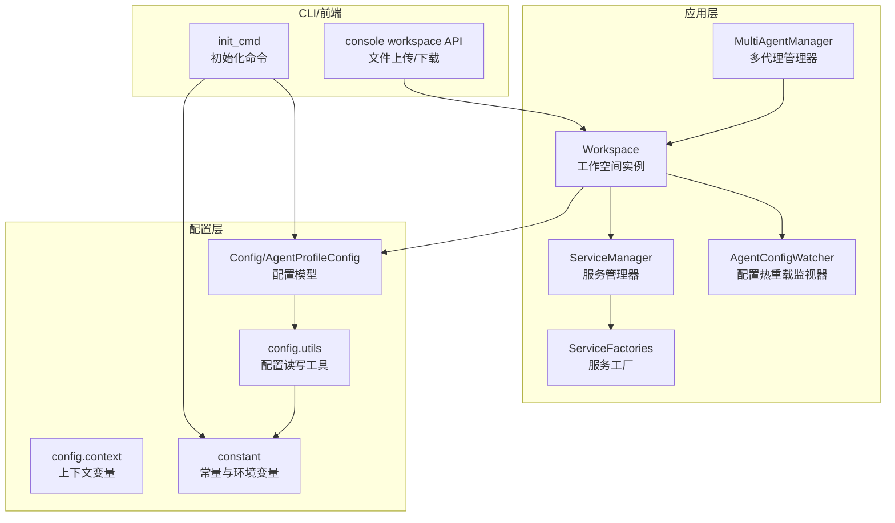
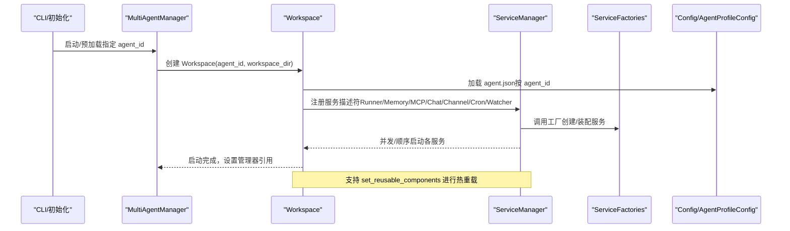
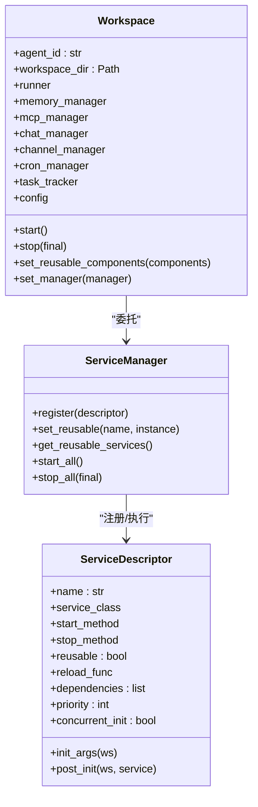
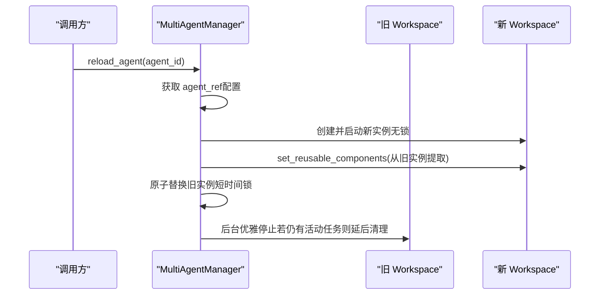
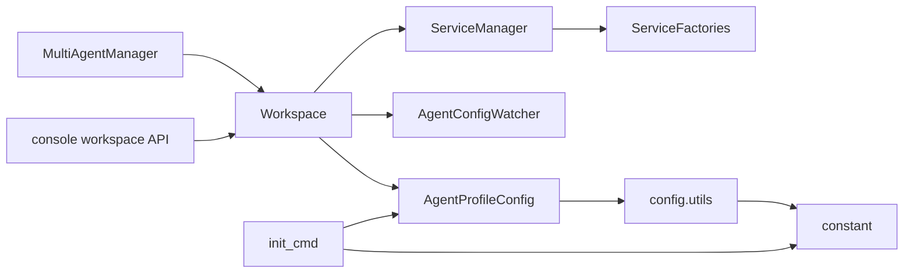

# 工作空间配置

<cite>
**本文引用的文件**
- [workspace.py](file://src/copaw/app/workspace/workspace.py)
- [service_manager.py](file://src/copaw/app/workspace/service_manager.py)
- [service_factories.py](file://src/copaw/app/workspace/service_factories.py)
- [multi_agent_manager.py](file://src/copaw/app/multi_agent_manager.py)
- [agent_config_watcher.py](file://src/copaw/app/agent_config_watcher.py)
- [config.py](file://src/copaw/config/config.py)
- [utils.py](file://src/copaw/config/utils.py)
- [context.py](file://src/copaw/config/context.py)
- [migration.py](file://src/copaw/app/migration.py)
- [constant.py](file://src/copaw/constant.py)
- [init_cmd.py](file://src/copaw/cli/init_cmd.py)
- [workspace.ts](file://console/src/api/modules/workspace.ts)
- [SECURITY.md](file://SECURITY.md)
</cite>

## 目录
1. [简介](#简介)
2. [项目结构](#项目结构)
3. [核心组件](#核心组件)
4. [架构总览](#架构总览)
5. [详细组件分析](#详细组件分析)
6. [依赖分析](#依赖分析)
7. [性能考虑](#性能考虑)
8. [故障排查指南](#故障排查指南)
9. [结论](#结论)
10. [附录](#附录)

## 简介
本文件系统性阐述 CoPaw 的工作空间（Workspace）配置与运行机制，覆盖以下主题：
- 工作空间的概念、作用与隔离边界
- 多工作空间支持、切换与配置继承规则
- 创建、初始化与销毁流程
- 配置隔离与数据持久化机制
- 热重载与动态调整能力
- 备份、迁移与恢复策略
- 权限管理、访问控制与安全隔离
- 前端工作空间文件操作接口

## 项目结构
工作空间相关代码主要位于应用层的 workspace 子模块与配置层的 config 子模块，并通过多代理管理器进行统一调度。

图示来源
- [workspace.py:39-367](file://src/copaw/app/workspace/workspace.py#L39-L367)
- [service_manager.py:74-415](file://src/copaw/app/workspace/service_manager.py#L74-L415)
- [service_factories.py:18-164](file://src/copaw/app/workspace/service_factories.py#L18-L164)
- [multi_agent_manager.py:17-451](file://src/copaw/app/multi_agent_manager.py#L17-L451)
- [agent_config_watcher.py:35-278](file://src/copaw/app/agent_config_watcher.py#L35-L278)
- [config.py:394-453](file://src/copaw/config/config.py#L394-L453)
- [utils.py:423-474](file://src/copaw/config/utils.py#L423-L474)
- [context.py:18-34](file://src/copaw/config/context.py#L18-L34)
- [constant.py:72-98](file://src/copaw/constant.py#L72-L98)
- [init_cmd.py:138-487](file://src/copaw/cli/init_cmd.py#L138-L487)
- [workspace.ts:86-137](file://console/src/api/modules/workspace.ts#L86-L137)

章节来源
- [workspace.py:39-367](file://src/copaw/app/workspace/workspace.py#L39-L367)
- [service_manager.py:74-415](file://src/copaw/app/workspace/service_manager.py#L74-L415)
- [service_factories.py:18-164](file://src/copaw/app/workspace/service_factories.py#L18-L164)
- [multi_agent_manager.py:17-451](file://src/copaw/app/multi_agent_manager.py#L17-L451)
- [agent_config_watcher.py:35-278](file://src/copaw/app/agent_config_watcher.py#L35-L278)
- [config.py:394-453](file://src/copaw/config/config.py#L394-L453)
- [utils.py:423-474](file://src/copaw/config/utils.py#L423-L474)
- [context.py:18-34](file://src/copaw/config/context.py#L18-L34)
- [constant.py:72-98](file://src/copaw/constant.py#L72-L98)
- [init_cmd.py:138-487](file://src/copaw/cli/init_cmd.py#L138-L487)
- [workspace.ts:86-137](file://console/src/api/modules/workspace.ts#L86-L137)

## 核心组件
- 工作空间（Workspace）
  - 封装独立的代理运行时，包含 Runner、ChannelManager、MemoryManager、MCPClientManager、CronManager 等组件。
  - 通过 ServiceManager 统一注册与生命周期管理，支持可复用组件与热重载。
- 服务管理器（ServiceManager）
  - 提供服务描述符（ServiceDescriptor）声明式注册、并发/顺序启动、依赖解析、可复用组件传递等能力。
- 服务工厂（ServiceFactories）
  - 将配置转换为具体服务实例，负责服务间装配与连接（如 MCP、聊天仓库、通道管理器等）。
- 多代理管理器（MultiAgentManager）
  - 支持懒加载、零停机热重载、批量启动、后台清理任务等。
- 配置热重载监视器（AgentConfigWatcher）
  - 轮询 agent.json 变更，自动重载通道与心跳等配置。
- 配置模型与工具（Config/Utils）
  - 定义 AgentProfileConfig、ChannelConfig、MCPConfig 等模型；提供配置读取/保存、路径归一化、通道可用性过滤等。
- 上下文变量（ContextVar）
  - 通过当前工作空间目录上下文，确保工具函数能正确解析相对路径。
- 常量与环境变量（Constant）
  - 定义工作目录、文件名、默认媒体目录、心跳文件、日志级别等。
- CLI 初始化（init_cmd）
  - 交互式创建默认工作空间、生成 HEARTBEAT.md、配置通道与技能等。
- 前端工作空间 API（workspace.ts）
  - 提供工作空间文件下载与上传能力。

章节来源
- [workspace.py:39-367](file://src/copaw/app/workspace/workspace.py#L39-L367)
- [service_manager.py:30-415](file://src/copaw/app/workspace/service_manager.py#L30-L415)
- [service_factories.py:18-164](file://src/copaw/app/workspace/service_factories.py#L18-L164)
- [multi_agent_manager.py:17-451](file://src/copaw/app/multi_agent_manager.py#L17-L451)
- [agent_config_watcher.py:35-278](file://src/copaw/app/agent_config_watcher.py#L35-L278)
- [config.py:394-453](file://src/copaw/config/config.py#L394-L453)
- [utils.py:423-474](file://src/copaw/config/utils.py#L423-L474)
- [context.py:18-34](file://src/copaw/config/context.py#L18-L34)
- [constant.py:72-98](file://src/copaw/constant.py#L72-L98)
- [init_cmd.py:138-487](file://src/copaw/cli/init_cmd.py#L138-L487)
- [workspace.ts:86-137](file://console/src/api/modules/workspace.ts#L86-L137)

## 架构总览
工作空间以“配置驱动 + 服务编排”的方式组织，核心流程如下：

图示来源
- [multi_agent_manager.py:34-82](file://src/copaw/app/multi_agent_manager.py#L34-L82)
- [workspace.py:134-367](file://src/copaw/app/workspace/workspace.py#L134-L367)
- [service_manager.py:92-200](file://src/copaw/app/workspace/service_manager.py#L92-L200)
- [service_factories.py:18-164](file://src/copaw/app/workspace/service_factories.py#L18-L164)
- [config.py:394-453](file://src/copaw/config/config.py#L394-L453)

## 详细组件分析

### 工作空间（Workspace）类
- 角色与职责
  - 封装单个代理的完整运行时，提供 runner/memory/mcp/chat/channel/cron 等属性访问。
  - 通过 ServiceManager 统一生命周期管理，支持可复用组件与热重载。
- 关键方法
  - start()/stop()：启动/停止所有服务，错误时回滚并清理。
  - set_reusable_components()：在启动前注入可复用组件（如 MemoryManager、ChatManager），避免重启造成的数据丢失。
  - config 属性：延迟加载 agent.json，保证配置隔离。
- 生命周期优先级
  - Runner（10）→ 内核服务（并发，20）→ Runner 启动钩子（25）→ Channel（30）→ Cron（40）→ 配置 Watcher（50/51）。

图示来源
- [workspace.py:39-133](file://src/copaw/app/workspace/workspace.py#L39-L133)
- [service_manager.py:30-105](file://src/copaw/app/workspace/service_manager.py#L30-L105)

章节来源
- [workspace.py:39-367](file://src/copaw/app/workspace/workspace.py#L39-L367)
- [service_manager.py:30-105](file://src/copaw/app/workspace/service_manager.py#L30-L105)

### 服务管理器（ServiceManager）
- 设计要点
  - 使用 ServiceDescriptor 声明式注册服务，支持依赖、优先级、并发/顺序初始化、可复用与重载回调。
  - start_all() 按优先级分组并发启动，sequential 描述符串行启动。
  - stop_all(final) 支持跳过可复用组件或强制停止。
- 可复用组件
  - set_reusable()/get_reusable_services() 支持在热重载时保留内存与聊天等资源，减少抖动。

章节来源
- [service_manager.py:74-415](file://src/copaw/app/workspace/service_manager.py#L74-L415)

### 服务工厂（ServiceFactories）
- 职责
  - 将配置转换为具体服务实例并进行装配：
    - create_mcp_service：从 agent 配置初始化 MCPClientManager，并注入到 Runner。
    - create_chat_service：创建或复用 ChatManager，并绑定到 Runner。
    - create_channel_service：根据配置创建 ChannelManager，并设置回调。
    - create_agent_config_watcher/create_mcp_config_watcher：条件性创建配置监视器。
- 作用
  - 解耦 Workspace 与具体服务构造逻辑，提升可测试性与扩展性。

章节来源
- [service_factories.py:18-164](file://src/copaw/app/workspace/service_factories.py#L18-L164)

### 多代理管理器（MultiAgentManager）
- 功能
  - 懒加载：首次请求才创建并启动 Workspace。
  - 零停机热重载：原子替换旧实例，后台优雅清理，保障持续服务。
  - 批量启动：并发启动所有已配置代理。
  - 清理任务跟踪：延迟清理旧实例，避免阻塞主流程。
- 关键流程
  - reload_agent()：创建新实例 → 设置可复用组件 → 启动 → 原子替换 → 后台优雅停止旧实例。

图示来源
- [multi_agent_manager.py:200-311](file://src/copaw/app/multi_agent_manager.py#L200-L311)

章节来源
- [multi_agent_manager.py:17-451](file://src/copaw/app/multi_agent_manager.py#L17-L451)

### 配置热重载监视器（AgentConfigWatcher）
- 功能
  - 轮询 agent.json 的修改时间与内容哈希，检测通道与心跳配置变更。
  - 对单个通道执行克隆与替换，失败时回滚。
  - 心跳变更触发 CronManager 重新调度。
- 参数
  - 默认轮询间隔为固定秒数，路径指向 workspace/agent.json。

章节来源
- [agent_config_watcher.py:35-278](file://src/copaw/app/agent_config_watcher.py#L35-L278)

### 配置模型与工具
- 配置模型
  - AgentProfileConfig：每个 agent 的独立配置文件（workspace/agent.json），包含 channels、mcp、heartbeat、running、llm_routing、tools、security 等。
  - Config/AgentsConfig：根配置（config.json），包含 profiles（agent 引用）与全局默认项。
- 工具函数
  - load_config()/save_config()：读取/保存配置，兼容历史字段与路径归一化。
  - get_available_channels()：基于环境变量过滤可用通道。
  - update_last_dispatch()/get_heartbeat_config()：与通道/心跳相关的辅助功能。

章节来源
- [config.py:394-453](file://src/copaw/config/config.py#L394-L453)
- [utils.py:423-474](file://src/copaw/config/utils.py#L423-L474)
- [utils.py:333-359](file://src/copaw/config/utils.py#L333-L359)
- [utils.py:502-537](file://src/copaw/config/utils.py#L502-L537)

### 上下文变量与路径隔离
- 通过 ContextVar 传递当前 agent 的 workspace_dir，使工具函数能在多代理环境中解析相对路径，避免跨实例污染。

章节来源
- [context.py:18-34](file://src/copaw/config/context.py#L18-L34)

### 常量与默认行为
- 工作目录、文件名、默认媒体目录、心跳文件、日志级别、容器运行标记等由常量模块集中定义，便于统一管理与测试。

章节来源
- [constant.py:72-98](file://src/copaw/constant.py#L72-L98)

### CLI 初始化与默认工作空间
- 初始化流程
  - 安全提示与遥测确认。
  - 确保默认 agent 存在（创建工作空间目录、chats.json、jobs.json）。
  - 交互式配置通道、提供商、技能、语言、音频模式等。
  - 生成 HEARTBEAT.md。
- 与迁移的衔接
  - 旧版单代理配置会迁移至多代理结构，保留向后兼容字段。

章节来源
- [init_cmd.py:138-487](file://src/copaw/cli/init_cmd.py#L138-L487)
- [migration.py:45-189](file://src/copaw/app/migration.py#L45-L189)

### 前端工作空间文件操作
- 接口
  - 下载工作空间打包文件（含文件名解析）。
  - 上传文件到工作空间。
- 用途
  - 支持备份、迁移与恢复场景中的文件传输。

章节来源
- [workspace.ts:86-137](file://console/src/api/modules/workspace.ts#L86-L137)

## 依赖分析
- 组件耦合
  - Workspace 与 ServiceManager 高内聚，通过描述符解耦具体服务类型。
  - ServiceFactories 仅依赖 Workspace 与配置模型，便于测试。
  - MultiAgentManager 仅依赖 Workspace 与配置工具，不直接操作服务细节。
- 外部依赖
  - 配置读写依赖 JSON 文件系统；通道/频道通过注册表发现与过滤。
  - 环境变量用于容器识别、通道白名单/黑名单、日志级别等。

图示来源
- [multi_agent_manager.py:17-451](file://src/copaw/app/multi_agent_manager.py#L17-L451)
- [workspace.py:39-367](file://src/copaw/app/workspace/workspace.py#L39-L367)
- [service_manager.py:74-415](file://src/copaw/app/workspace/service_manager.py#L74-L415)
- [service_factories.py:18-164](file://src/copaw/app/workspace/service_factories.py#L18-L164)
- [agent_config_watcher.py:35-278](file://src/copaw/app/agent_config_watcher.py#L35-L278)
- [config.py:394-453](file://src/copaw/config/config.py#L394-L453)
- [utils.py:423-474](file://src/copaw/config/utils.py#L423-L474)
- [constant.py:72-98](file://src/copaw/constant.py#L72-L98)
- [init_cmd.py:138-487](file://src/copaw/cli/init_cmd.py#L138-L487)
- [workspace.ts:86-137](file://console/src/api/modules/workspace.ts#L86-L137)

## 性能考虑
- 并发启动：ServiceManager 按优先级分组并发初始化，显著缩短启动时间。
- 零停机热重载：新实例先于旧实例启动，原子替换，最小化停机窗口。
- 可复用组件：内存与聊天等资源在热重载中复用，降低抖动与重建成本。
- I/O 优化：配置轮询采用固定间隔与内容哈希对比，避免频繁重载。

## 故障排查指南
- 启动失败
  - Workspace 在启动异常时会回滚并尝试停止已启动的服务，检查日志定位具体服务。
  - 关注 ServiceManager 的 start_all() 抛错点与描述符配置。
- 热重载失败
  - 新实例启动失败时会清理新实例并保留旧实例；检查配置合法性与依赖服务状态。
  - 可复用组件未生效：确认 set_reusable_components() 在 start() 前调用且描述符标记 reusable/reload_func。
- 配置未生效
  - AgentConfigWatcher 仅在检测到 mtime 或内容哈希变化时更新；检查 agent.json 是否被正确写入。
  - 通道重载失败会回滚到旧配置，检查通道 clone/replace 流程。
- 文件操作问题
  - 下载/上传失败：检查响应状态码与 Content-Disposition 解析，确认目标路径存在且有写权限。

章节来源
- [workspace.py:330-337](file://src/copaw/app/workspace/workspace.py#L330-L337)
- [service_manager.py:171-200](file://src/copaw/app/workspace/service_manager.py#L171-L200)
- [multi_agent_manager.py:274-289](file://src/copaw/app/multi_agent_manager.py#L274-L289)
- [agent_config_watcher.py:149-177](file://src/copaw/app/agent_config_watcher.py#L149-L177)
- [workspace.ts:86-137](file://console/src/api/modules/workspace.ts#L86-L137)

## 结论
CoPaw 的工作空间通过“配置驱动 + 服务编排”的架构实现了强隔离、高可用与可扩展的多代理运行时。其设计在以下方面表现突出：
- 配置隔离：每个 agent 拥有独立的 workspace/agent.json，确保配置与数据完全隔离。
- 生命周期管理：统一的服务注册与启动/停止机制，支持并发与顺序组合。
- 热重载与零停机：通过可复用组件与原子替换，实现无缝升级。
- 安全与合规：严格的默认信任模型与安全建议，结合通道白名单与最小权限原则。

## 附录

### 工作空间概念与作用
- 概念
  - 工作空间是独立的代理运行时，封装了请求处理、通信渠道、记忆、MCP 工具客户端、定时任务等全部必要组件。
- 作用
  - 实现多代理隔离与独立运维，支持按需启停、热重载与配置热更新。

章节来源
- [workspace.py:2-12](file://src/copaw/app/workspace/workspace.py#L2-L12)

### 创建、初始化与销毁流程
- 创建
  - MultiAgentManager 懒加载：首次请求时创建 Workspace 并启动。
- 初始化
  - Workspace 加载 agent.json → 注册服务描述符 → 并发/顺序启动 → 设置管理器引用。
- 销毁
  - stop(final)：可选择跳过可复用组件或强制停止；错误时回滚。

章节来源
- [multi_agent_manager.py:34-82](file://src/copaw/app/multi_agent_manager.py#L34-L82)
- [workspace.py:311-358](file://src/copaw/app/workspace/workspace.py#L311-L358)

### 多工作空间支持、切换与配置继承
- 多工作空间
  - 通过 AgentProfileRef 与 AgentProfileConfig 实现；每个 agent 有独立 workspace_dir。
- 切换
  - 通过 agent_id 选择不同 Workspace；MultiAgentManager 提供懒加载与缓存。
- 配置继承
  - 根配置（config.json）提供全局默认项；agent.json 为局部覆盖，优先级更高。

章节来源
- [config.py:455-496](file://src/copaw/config/config.py#L455-L496)
- [config.py:394-453](file://src/copaw/config/config.py#L394-L453)

### 配置隔离与数据持久化
- 隔离
  - 每个 agent 的 channels、mcp、jobs、chats、memory 等均位于独立目录。
- 持久化
  - jobs.json、chats.json、markdown 文件等在工作空间内持久化，重启后恢复。

章节来源
- [migration.py:23-42](file://src/copaw/app/migration.py#L23-L42)
- [constant.py:91-98](file://src/copaw/constant.py#L91-L98)

### 热重载与动态调整
- 热重载
  - set_reusable_components() + ServiceManager 可复用机制；MultiAgentManager 原子替换。
- 动态调整
  - AgentConfigWatcher 自动重载通道与心跳；MCPConfigWatcher 监控 MCP 配置变更。

章节来源
- [workspace.py:279-310](file://src/copaw/app/workspace/workspace.py#L279-L310)
- [service_manager.py:106-157](file://src/copaw/app/workspace/service_manager.py#L106-L157)
- [multi_agent_manager.py:200-311](file://src/copaw/app/multi_agent_manager.py#L200-L311)
- [agent_config_watcher.py:74-96](file://src/copaw/app/agent_config_watcher.py#L74-L96)
- [service_factories.py:134-164](file://src/copaw/app/workspace/service_factories.py#L134-L164)

### 备份、迁移与恢复策略
- 备份
  - 通过前端工作空间 API 下载打包文件，或直接复制工作空间目录。
- 迁移
  - 旧版单代理配置迁移至多代理结构，保留根配置兼容字段。
- 恢复
  - 将备份文件上传至对应工作空间目录，或直接拷贝目录后重启相应 agent。

章节来源
- [workspace.ts:86-137](file://console/src/api/modules/workspace.ts#L86-L137)
- [migration.py:45-189](file://src/copaw/app/migration.py#L45-L189)

### 权限管理、访问控制与安全隔离
- 信任模型
  - 单用户/单操作员边界；共享实例需严格隔离（通道白名单、最小权限、分离主机/用户）。
- 工作空间边界
  - 工作目录被视为受信任本地状态；编辑即跨越信任边界。
- 技能与工具
  - 技能在进程内运行，具备与 CoPaw 相同权限；应谨慎启用与最小化暴露。

章节来源
- [SECURITY.md:99-141](file://SECURITY.md#L99-L141)