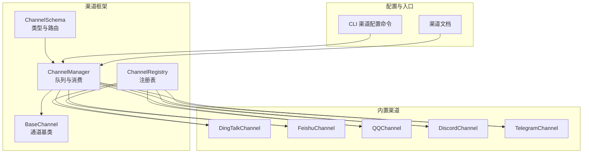
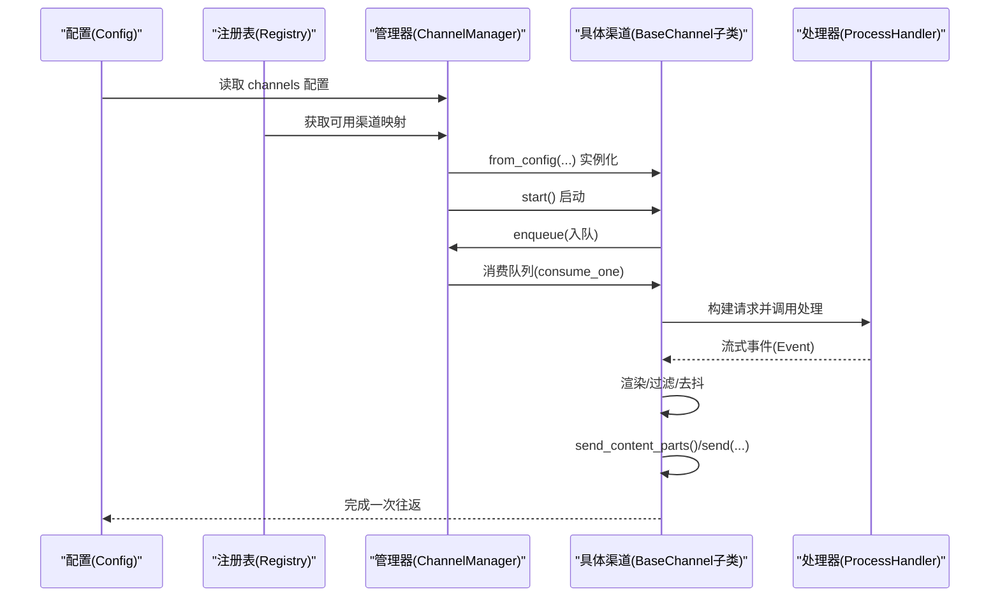
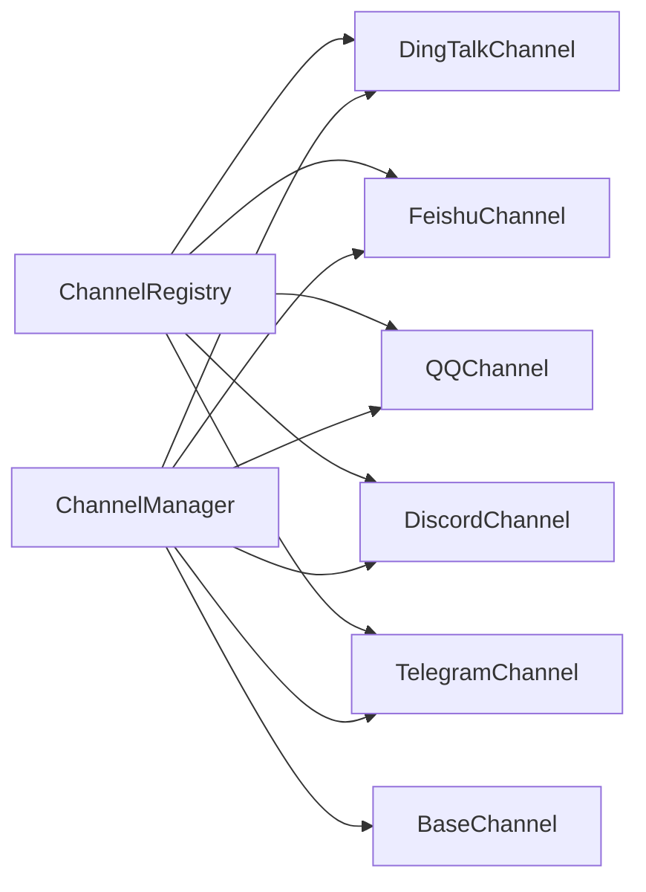

# 渠道配置

<cite>
**本文引用的文件**
- [schema.py](file://src/copaw/app/channels/schema.py)
- [base.py](file://src/copaw/app/channels/base.py)
- [manager.py](file://src/copaw/app/channels/manager.py)
- [registry.py](file://src/copaw/app/channels/registry.py)
- [dingtalk/channel.py](file://src/copaw/app/channels/dingtalk/channel.py)
- [feishu/channel.py](file://src/copaw/app/channels/feishu/channel.py)
- [qq/channel.py](file://src/copaw/app/channels/qq/channel.py)
- [discord_/channel.py](file://src/copaw/app/channels/discord_/channel.py)
- [telegram/channel.py](file://src/copaw/app/channels/telegram/channel.py)
- [channels_cmd.py](file://src/copaw/cli/channels_cmd.py)
- [channels.zh.md](file://website/public/docs/channels.zh.md)
- [channels.en.md](file://website/public/docs/channels.en.md)
</cite>

## 目录
1. [简介](#简介)
2. [项目结构](#项目结构)
3. [核心组件](#核心组件)
4. [架构总览](#架构总览)
5. [详细组件分析](#详细组件分析)
6. [依赖分析](#依赖分析)
7. [性能考虑](#性能考虑)
8. [故障排除指南](#故障排除指南)
9. [结论](#结论)
10. [附录](#附录)

## 简介
本文件系统性阐述 CoPaw 的“渠道”（Channel）配置与运行机制，覆盖以下方面：
- 各聊天渠道（钉钉、飞书、QQ、Discord、Telegram 等）的配置项、启用/禁用、权限控制、消息过滤策略
- 全局配置到代理（Agent）特定配置的继承与覆盖规则
- 渠道启用/禁用、权限控制（群/私聊策略、白名单、是否必须被@）与消息过滤（工具消息、思考内容）
- 渠道配置的热重载、故障排除与性能优化建议
- 提供配置模板与最佳实践

## 项目结构
CoPaw 的渠道体系由“通道基类 + 多个具体渠道实现 + 管理器 + 注册表 + CLI/控制台配置入口”构成。下图展示关键模块之间的关系。

图表来源
- [registry.py:19-33](file://src/copaw/app/channels/registry.py#L19-L33)
- [base.py:69-125](file://src/copaw/app/channels/base.py#L69-L125)
- [manager.py:114-247](file://src/copaw/app/channels/manager.py#L114-L247)
- [schema.py:12-48](file://src/copaw/app/channels/schema.py#L12-L48)
- [channels_cmd.py:727-734](file://src/copaw/cli/channels_cmd.py#L727-L734)

章节来源
- [registry.py:19-33](file://src/copaw/app/channels/registry.py#L19-L33)
- [base.py:69-125](file://src/copaw/app/channels/base.py#L69-L125)
- [manager.py:114-247](file://src/copaw/app/channels/manager.py#L114-L247)
- [schema.py:12-48](file://src/copaw/app/channels/schema.py#L12-L48)
- [channels_cmd.py:727-734](file://src/copaw/cli/channels_cmd.py#L727-L734)

## 核心组件
- 通道基类 BaseChannel：统一消息收发、会话解析、时间去抖、权限校验、消息过滤、渲染与发送流程。
- 渠道管理器 ChannelManager：负责从配置创建通道实例、启动/停止、入队/出队、合并同一会话请求、替换单通道实例。
- 渠道注册表 ChannelRegistry：内置渠道映射与自定义渠道发现。
- 渠道模式与路由 ChannelSchema：统一 ChannelType、ChannelAddress、转换协议。
- CLI/控制台配置入口：交互式配置与写回配置文件。

章节来源
- [base.py:69-125](file://src/copaw/app/channels/base.py#L69-L125)
- [manager.py:114-247](file://src/copaw/app/channels/manager.py#L114-L247)
- [registry.py:19-33](file://src/copaw/app/channels/registry.py#L19-L33)
- [schema.py:12-48](file://src/copaw/app/channels/schema.py#L12-L48)
- [channels_cmd.py:727-734](file://src/copaw/cli/channels_cmd.py#L727-L734)

## 架构总览
下图展示从配置到渠道实例化、消息处理与回复的整体流程。

图表来源
- [manager.py:158-247](file://src/copaw/app/channels/manager.py#L158-L247)
- [base.py:443-583](file://src/copaw/app/channels/base.py#L443-L583)

章节来源
- [manager.py:158-247](file://src/copaw/app/channels/manager.py#L158-L247)
- [base.py:443-583](file://src/copaw/app/channels/base.py#L443-L583)

## 详细组件分析

### 渠道通用配置与策略
- 启用/禁用：各渠道均支持 enabled 字段控制是否加载。
- 权限控制：
  - dm_policy/group_policy：私聊/群聊开放策略（open 或 allowlist）。
  - allow_from：白名单列表（字符串或数组）。
  - require_mention：群聊中是否要求@机器人。
  - deny_message：拒绝消息提示文本。
- 消息过滤：
  - filter_tool_messages：过滤工具消息。
  - filter_thinking：过滤思考内容。
- 全局工具可见性：由 show_tool_details 控制渲染风格，影响工具消息显示。

章节来源
- [base.py:79-125](file://src/copaw/app/channels/base.py#L79-L125)
- [manager.py:195-219](file://src/copaw/app/channels/manager.py#L195-L219)

### 钉钉（DingTalk）
- 必需参数
  - enabled: 布尔
  - client_id: 应用标识
  - client_secret: 应用密钥
  - bot_prefix: 机器人前缀
- 可选参数
  - message_type: 文本格式（默认 markdown）
  - card_template_id/key: 卡片模板
  - robot_code: 机器人编码（默认与 client_id 相同）
  - media_dir: 媒体目录
  - dm_policy/group_policy/allow_from/deny_message/require_mention
- 特性
  - 支持 sessionWebhook 主动发送，带去重与持久化存储。
  - 时间去抖关闭（由管理器合并同一会话）。
  - 支持 AI 卡片状态管理与多消息合并发送。
- 验证规则
  - 缺少必要字段时初始化失败。
  - 通过环境变量与配置文件双入口注入。

章节来源
- [dingtalk/channel.py:95-171](file://src/copaw/app/channels/dingtalk/channel.py#L95-L171)
- [dingtalk/channel.py:217-251](file://src/copaw/app/channels/dingtalk/channel.py#L217-L251)
- [dingtalk/channel.py:269-291](file://src/copaw/app/channels/dingtalk/channel.py#L269-L291)
- [dingtalk/channel.py:316-415](file://src/copaw/app/channels/dingtalk/channel.py#L316-L415)

### 飞书（Feishu/Lark）
- 必需参数
  - enabled: 布尔
  - app_id/app_secret: 应用凭证
  - bot_prefix: 机器人前缀
- 可选参数
  - encrypt_key/verification_token: 加解密与校验
  - media_dir: 媒体目录
  - dm_policy/group_policy/allow_from/deny_message/require_mention
- 特性
  - WebSocket 接收事件，Open API 发送消息。
  - 会话键短化以适配定时任务查找。
  - 去重与昵称缓存，支持富媒体下载与转发。
- 验证规则
  - 依赖 lark-oapi，缺失时按可选依赖处理。
  - 通过环境变量与配置文件注入。

章节来源
- [feishu/channel.py:145-230](file://src/copaw/app/channels/feishu/channel.py#L145-L230)
- [feishu/channel.py:230-291](file://src/copaw/app/channels/feishu/channel.py#L230-L291)
- [feishu/channel.py:293-309](file://src/copaw/app/channels/feishu/channel.py#L293-L309)
- [feishu/channel.py:398-446](file://src/copaw/app/channels/feishu/channel.py#L398-L446)

### QQ
- 必需参数
  - enabled: 布尔
  - app_id/client_secret: 应用凭证
  - bot_prefix: 机器人前缀
- 可选参数
  - markdown_enabled: 是否使用 Markdown
  - media_dir: 媒体目录
  - dm_policy/group_policy/allow_from/deny_message/require_mention
- 特性
  - WebSocket 接收事件，HTTP API 发送消息。
  - 多级回退：Markdown → 纯文本 → URL 敏感字符清理。
  - 会话路径自动选择（C2C/群组/频道）。
- 验证规则
  - URL 内容错误与 Markdown 验证失败时自动回退。
  - 令牌缓存与过期刷新。

章节来源
- [qq/channel.py:503-548](file://src/copaw/app/channels/qq/channel.py#L503-L548)
- [qq/channel.py:621-659](file://src/copaw/app/channels/qq/channel.py#L621-L659)
- [qq/channel.py:695-800](file://src/copaw/app/channels/qq/channel.py#L695-L800)

### Discord
- 必需参数
  - enabled: 布尔
  - bot_token: 机器人令牌
  - http_proxy/http_proxy_auth: 代理与认证
  - bot_prefix: 机器人前缀
- 可选参数
  - dm_policy/group_policy/allow_from/deny_message/require_mention
- 特性
  - 基于 discord.py 的事件驱动。
  - 文本分片（2000 字符限制），保留代码块闭合。
  - 媒体作为附件上传。
- 验证规则
  - 未初始化客户端或未就绪时抛出异常。
  - 通过 meta["channel_id"] 或 ["user_id"] 解析目标。

章节来源
- [discord_/channel.py:39-100](file://src/copaw/app/channels/discord_/channel.py#L39-L100)
- [discord_/channel.py:228-284](file://src/copaw/app/channels/discord_/channel.py#L228-L284)
- [discord_/channel.py:305-367](file://src/copaw/app/channels/discord_/channel.py#L305-L367)
- [discord_/channel.py:369-401](file://src/copaw/app/channels/discord_/channel.py#L369-L401)

### Telegram
- 必需参数
  - enabled: 布尔
  - bot_token: 机器人令牌
  - http_proxy/http_proxy_auth: 代理与认证
  - bot_prefix: 机器人前缀
- 可选参数
  - media_dir/workspace_dir: 媒体与工作区目录
  - show_typing: 是否显示打字状态
  - dm_policy/group_policy/allow_from/deny_message/require_mention
- 特性
  - 轮询接收消息，HTML 渲染与回退纯文本。
  - 分片发送（4000 字节），保留换行与空格。
  - 媒体下载到本地再上传，超限与权限错误处理。
- 验证规则
  - 文件过大、网络错误、权限不足时进行用户友好提示。
  - 会话键基于 chat_id。

章节来源
- [telegram/channel.py:264-334](file://src/copaw/app/channels/telegram/channel.py#L264-L334)
- [telegram/channel.py:453-524](file://src/copaw/app/channels/telegram/channel.py#L453-L524)
- [telegram/channel.py:526-546](file://src/copaw/app/channels/telegram/channel.py#L526-L546)
- [telegram/channel.py:597-650](file://src/copaw/app/channels/telegram/channel.py#L597-L650)

### 渠道配置继承与覆盖规则
- 配置来源优先级（从高到低）
  - 代理（Agent）配置：覆盖全局配置
  - 全局配置：覆盖默认值
  - 环境变量：覆盖默认值（部分渠道支持）
- 关键点
  - ChannelManager 从 Config.channels 中读取每个渠道配置，并通过 from_config 构造实例。
  - 若配置为字典，会与 BaseChannelConfig 默认值合并后再注入。
  - enabled 字段决定是否实例化该渠道。
  - 过滤与策略参数（如 filter_tool_messages、dm_policy 等）在实例化时传入。

章节来源
- [manager.py:173-247](file://src/copaw/app/channels/manager.py#L173-L247)
- [channels_cmd.py:727-734](file://src/copaw/cli/channels_cmd.py#L727-L734)

### 渠道启用/禁用、权限控制与消息过滤
- 启用/禁用
  - 通过 enabled 字段控制；未显式设置时默认禁用（部分渠道例外，详见各渠道注释）。
- 权限控制
  - 私聊/群聊策略：open（开放）或 allowlist（白名单）。
  - 白名单 allow_from：支持字符串或数组。
  - require_mention：群聊中要求@机器人。
  - deny_message：拒绝时返回的消息。
- 消息过滤
  - filter_tool_messages：隐藏内部工具消息。
  - filter_thinking：隐藏思考内容。
  - show_tool_details：全局开关，影响渲染风格。

章节来源
- [base.py:79-125](file://src/copaw/app/channels/base.py#L79-L125)
- [base.py:281-315](file://src/copaw/app/channels/base.py#L281-L315)

### 渠道配置示例模板与最佳实践
- 示例模板（字段说明见上文）
  - 钉钉
    - enabled: true
    - client_id: <你的应用ID>
    - client_secret: <你的应用密钥>
    - bot_prefix: "[BOT] "
    - dm_policy: open
    - group_policy: allowlist
    - allow_from: ["<用户ID>"]
    - require_mention: true
  - 飞书
    - enabled: true
    - app_id: <你的应用ID>
    - app_secret: <你的应用密钥>
    - bot_prefix: "[BOT] "
    - dm_policy: open
    - group_policy: open
  - QQ
    - enabled: true
    - app_id: <你的应用ID>
    - client_secret: <你的应用密钥>
    - bot_prefix: ""
    - markdown_enabled: true
    - dm_policy: open
    - group_policy: open
  - Discord
    - enabled: true
    - bot_token: <你的机器人令牌>
    - http_proxy: ""
    - http_proxy_auth: ""
    - bot_prefix: "[BOT] "
    - dm_policy: open
    - group_policy: open
  - Telegram
    - enabled: true
    - bot_token: <你的机器人令牌>
    - http_proxy: ""
    - http_proxy_auth: ""
    - bot_prefix: ""
    - dm_policy: open
    - group_policy: open
- 最佳实践
  - 使用白名单策略限制风险较高的群聊场景。
  - 对外部网络（WebSocket/HTTP API）配置代理与认证。
  - 合理设置消息过滤，避免泄露内部工具细节。
  - 对媒体目录进行容量与权限管理，防止磁盘耗尽。
  - 对长文本进行分片发送，避免平台限制导致失败。

章节来源
- [channels.zh.md:1-8](file://website/public/docs/channels.zh.md#L1-L8)
- [channels.en.md:602-618](file://website/public/docs/channels.en.md#L602-L618)

## 依赖分析
- 渠道注册表内置映射与自定义渠道发现。
- 管理器根据可用渠道与配置实例化具体渠道。
- 基类统一处理去抖、合并、渲染与发送。
- CLI/控制台提供交互式配置入口。

图表来源
- [registry.py:19-33](file://src/copaw/app/channels/registry.py#L19-L33)
- [manager.py:114-156](file://src/copaw/app/channels/manager.py#L114-L156)

章节来源
- [registry.py:19-33](file://src/copaw/app/channels/registry.py#L19-L33)
- [manager.py:114-156](file://src/copaw/app/channels/manager.py#L114-L156)

## 性能考虑
- 队列与并发
  - 每个渠道拥有独立队列与固定数量消费者（每渠道多个 worker），提升吞吐。
  - 同一会话去重与合并，减少重复处理。
- 去抖与合并
  - 基类对无文本内容进行缓冲合并，避免消息乱序与重复。
  - 部分渠道（如钉钉）关闭时间去抖，交由管理器统一合并。
- 媒体处理
  - 下载到本地再上传，避免大文件直接流式传输。
  - 对超限与权限错误进行快速反馈，降低重试成本。
- 代理与网络
  - 支持 HTTP 代理与认证，便于跨网络部署。
  - 对外部 API 错误进行分类处理与降级。

章节来源
- [manager.py:35-40](file://src/copaw/app/channels/manager.py#L35-L40)
- [manager.py:307-372](file://src/copaw/app/channels/manager.py#L307-L372)
- [base.py:208-279](file://src/copaw/app/channels/base.py#L208-L279)
- [dingtalk/channel.py:169-171](file://src/copaw/app/channels/dingtalk/channel.py#L169-L171)

## 故障排除指南
- 渠道无法启动
  - 检查 enabled 与凭证是否正确。
  - 查看日志中的初始化警告或异常堆栈。
- 消息未送达
  - 确认目标会话键（to_handle）与路由是否正确。
  - 对 Discord/Telegram 等平台检查权限与代理设置。
- 媒体发送失败
  - 检查文件大小限制与本地路径解析。
  - 对 Telegram 检查权限与网络错误码。
- 白名单/权限问题
  - 确认 allow_from 列表与策略（open/allowlist）。
  - 群聊中是否要求@机器人（require_mention）。
- 环境变量与配置冲突
  - 确认环境变量与配置文件的优先级与覆盖关系。
  - 使用 CLI 交互式配置确保写回正确。

章节来源
- [base.py:281-315](file://src/copaw/app/channels/base.py#L281-L315)
- [discord_/channel.py:369-401](file://src/copaw/app/channels/discord_/channel.py#L369-L401)
- [telegram/channel.py:652-768](file://src/copaw/app/channels/telegram/channel.py#L652-L768)
- [channels_cmd.py:727-734](file://src/copaw/cli/channels_cmd.py#L727-L734)

## 结论
CoPaw 的渠道配置体系以统一的 BaseChannel 为基础，结合 ChannelManager 的队列与并发模型，实现了跨平台、可扩展、可治理的聊天接入能力。通过明确的启用/禁用、权限控制与消息过滤策略，以及完善的热重载与故障处理机制，能够在复杂网络环境中稳定运行。建议在生产环境中遵循白名单策略、合理设置消息过滤与代理配置，并对媒体与网络进行容量与权限管理。

## 附录
- 配置入口
  - 控制台：在 Control → Channels 页面启用并填写鉴权信息，保存即生效。
  - 手动编辑：在配置文件中设置 channels 下对应渠道的 enabled 与凭证。
- 热重载
  - 保存配置文件后自动重载，无需重启服务（部分渠道需重新启动客户端，如 Discord/Telegram）。
- 参考文档
  - 渠道文档（中/英）提供了基础配置表格与平台差异说明。

章节来源
- [channels.zh.md:1-8](file://website/public/docs/channels.zh.md#L1-L8)
- [channels.en.md:602-618](file://website/public/docs/channels.en.md#L602-L618)