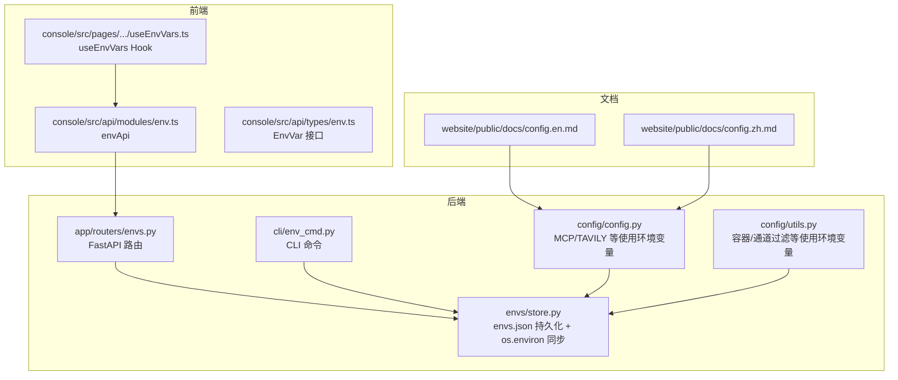
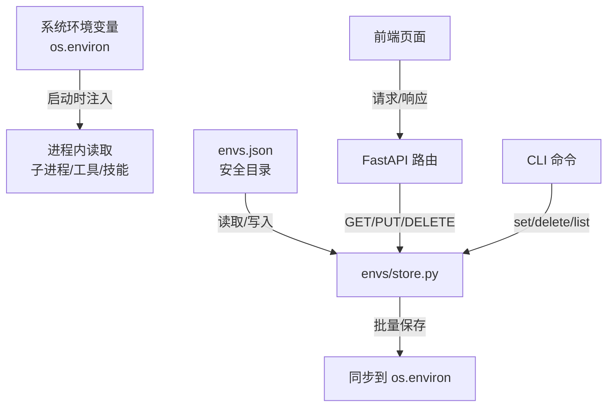
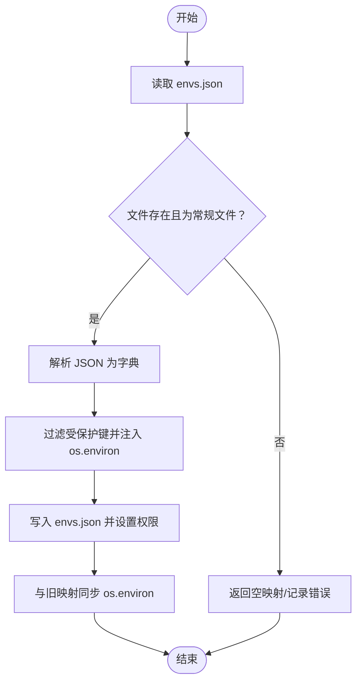
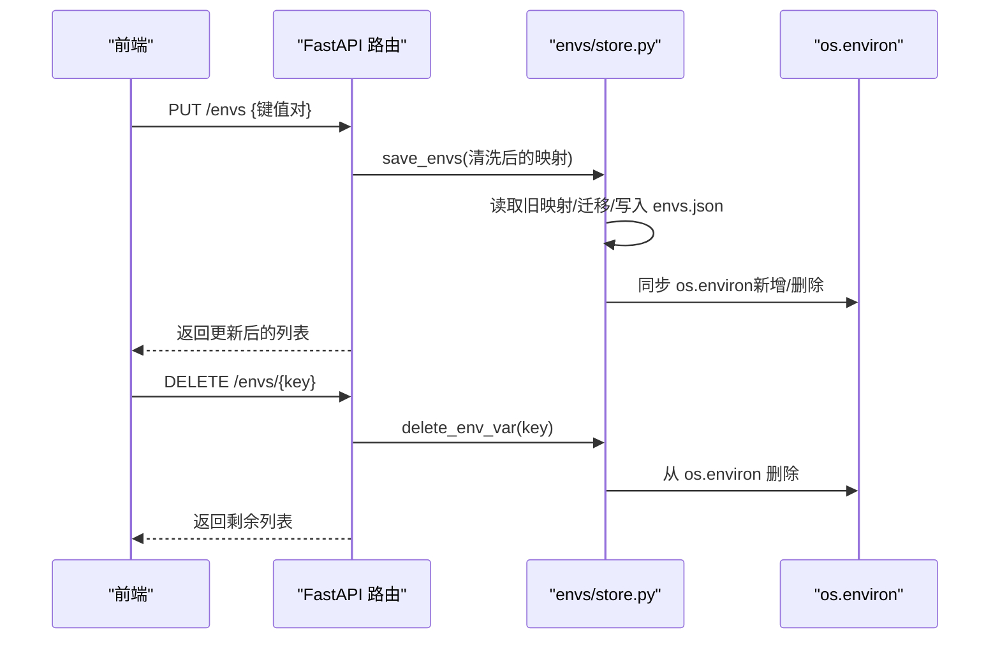
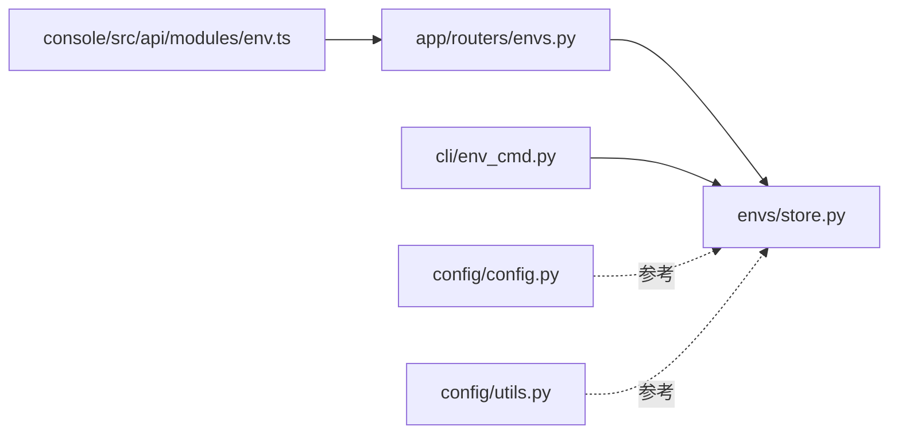

# 环境变量管理

<cite>
**本文引用的文件**
- [src/copaw/envs/store.py](file://src/copaw/envs/store.py)
- [src/copaw/cli/env_cmd.py](file://src/copaw/cli/env_cmd.py)
- [src/copaw/app/routers/envs.py](file://src/copaw/app/routers/envs.py)
- [console/src/api/modules/env.ts](file://console/src/api/modules/env.ts)
- [console/src/api/types/env.ts](file://console/src/api/types/env.ts)
- [console/src/pages/Settings/Environments/useEnvVars.ts](file://console/src/pages/Settings/Environments/useEnvVars.ts)
- [src/copaw/config/config.py](file://src/copaw/config/config.py)
- [src/copaw/config/utils.py](file://src/copaw/config/utils.py)
- [website/public/docs/config.en.md](file://website/public/docs/config.en.md)
- [website/public/docs/config.zh.md](file://website/public/docs/config.zh.md)
</cite>

## 目录
1. [简介](#简介)
2. [项目结构](#项目结构)
3. [核心组件](#核心组件)
4. [架构总览](#架构总览)
5. [详细组件分析](#详细组件分析)
6. [依赖分析](#依赖分析)
7. [性能考虑](#性能考虑)
8. [故障排查指南](#故障排查指南)
9. [结论](#结论)
10. [附录](#附录)

## 简介
本文件系统性阐述 CoPaw 的环境变量管理机制，覆盖以下方面：
- 存储机制：持久化到安全目录的 envs.json 与进程注入 os.environ 的双层策略
- 读取方式：启动时加载、运行时通过 API/CLI/前端界面访问
- 安全策略：受保护键的隔离、文件权限控制、敏感数据目录分离
- 命名规范、作用域与生命周期：统一以键值对形式管理，支持运行时替换
- 动态更新与热重载：API 批量保存触发 os.environ 同步，子进程立即可见
- 验证、默认值与错误处理：接口参数校验、异常响应、日志记录
- 最佳实践：开发/测试/生产环境的差异化配置与安全建议

## 项目结构
围绕环境变量管理的关键模块分布如下：
- 后端存储与同步：Python 层的 envs/store.py 负责 envs.json 的读写与 os.environ 注入
- API 层：FastAPI 路由器提供列出、批量保存、删除等接口
- CLI 层：命令行工具提供交互式与非交互式环境变量管理
- 前端层：React Hook 与 API 模块负责展示与提交
- 配置与文档：全局配置与文档说明了环境变量的作用域与默认值来源

**图表来源**
- [src/copaw/envs/store.py:103-242](file://src/copaw/envs/store.py#L103-L242)
- [src/copaw/app/routers/envs.py:12-81](file://src/copaw/app/routers/envs.py#L12-L81)
- [src/copaw/cli/env_cmd.py:10-99](file://src/copaw/cli/env_cmd.py#L10-L99)
- [console/src/api/modules/env.ts:1-19](file://console/src/api/modules/env.ts#L1-L19)
- [console/src/api/types/env.ts:1-5](file://console/src/api/types/env.ts#L1-L5)
- [console/src/pages/Settings/Environments/useEnvVars.ts:1-34](file://console/src/pages/Settings/Environments/useEnvVars.ts#L1-L34)
- [src/copaw/config/config.py:614-625](file://src/copaw/config/config.py#L614-L625)
- [src/copaw/config/utils.py:342-358](file://src/copaw/config/utils.py#L342-L358)
- [website/public/docs/config.en.md:70-101](file://website/public/docs/config.en.md#L70-L101)
- [website/public/docs/config.zh.md:70-98](file://website/public/docs/config.zh.md#L70-L98)

**章节来源**
- [src/copaw/envs/store.py:103-242](file://src/copaw/envs/store.py#L103-L242)
- [src/copaw/app/routers/envs.py:12-81](file://src/copaw/app/routers/envs.py#L12-L81)
- [src/copaw/cli/env_cmd.py:10-99](file://src/copaw/cli/env_cmd.py#L10-L99)
- [console/src/api/modules/env.ts:1-19](file://console/src/api/modules/env.ts#L1-L19)
- [console/src/api/types/env.ts:1-5](file://console/src/api/types/env.ts#L1-L5)
- [console/src/pages/Settings/Environments/useEnvVars.ts:1-34](file://console/src/pages/Settings/Environments/useEnvVars.ts#L1-L34)
- [src/copaw/config/config.py:614-625](file://src/copaw/config/config.py#L614-L625)
- [src/copaw/config/utils.py:342-358](file://src/copaw/config/utils.py#L342-L358)
- [website/public/docs/config.en.md:70-101](file://website/public/docs/config.en.md#L70-L101)
- [website/public/docs/config.zh.md:70-98](file://website/public/docs/config.zh.md#L70-L98)

## 核心组件
- 存储与同步层（envs/store.py）
  - 持久化：envs.json 写入安全目录（COPAW_SECRET_DIR），文件权限 0o600
  - 注入：仅在启动时将“受保护键”之外的键注入 os.environ，避免覆盖系统/进程已有变量
  - 迁移：自动迁移旧位置的 envs.json 到新安全目录
- API 层（app/routers/envs.py）
  - GET /envs：返回全部环境变量
  - PUT /envs：批量保存（全量替换），进行键名校验
  - DELETE /envs/{key}：删除单个变量，不存在则 404
- CLI 层（cli/env_cmd.py）
  - env list：列出全部
  - env set KEY VALUE：设置单个
  - env delete KEY：删除单个
  - configure_env_interactive：交互式添加/编辑
- 前端层（console/src/api/modules/env.ts + useEnvVars.ts）
  - 使用 envApi.listEnvs/saveEnvs/deleteEnv 与后端交互
  - useEnvVars Hook 负责拉取与错误处理
- 配置与文档（config/config.py、config/utils.py、website/docs）
  - 文档明确 COPAW_WORKING_DIR、COPAW_SECRET_DIR 等关键变量
  - MCP/TAVILY 等组件直接读取系统环境变量，体现“优先系统环境”的设计

**章节来源**
- [src/copaw/envs/store.py:151-242](file://src/copaw/envs/store.py#L151-L242)
- [src/copaw/app/routers/envs.py:32-81](file://src/copaw/app/routers/envs.py#L32-L81)
- [src/copaw/cli/env_cmd.py:20-99](file://src/copaw/cli/env_cmd.py#L20-L99)
- [console/src/api/modules/env.ts:4-18](file://console/src/api/modules/env.ts#L4-L18)
- [console/src/pages/Settings/Environments/useEnvVars.ts:5-33](file://console/src/pages/Settings/Environments/useEnvVars.ts#L5-L33)
- [src/copaw/config/config.py:614-625](file://src/copaw/config/config.py#L614-L625)
- [src/copaw/config/utils.py:342-358](file://src/copaw/config/utils.py#L342-L358)
- [website/public/docs/config.en.md:70-101](file://website/public/docs/config.en.md#L70-L101)
- [website/public/docs/config.zh.md:70-98](file://website/public/docs/config.zh.md#L70-L98)

## 架构总览
环境变量管理采用“持久化 + 进程注入”的双层架构，确保：
- 数据持久：envs.json 在安全目录中长期保存
- 即时生效：os.environ 注入使子进程与后续读取立即可见
- 安全隔离：受保护键不被注入，避免覆盖系统/进程变量

**图表来源**
- [src/copaw/envs/store.py:222-242](file://src/copaw/envs/store.py#L222-L242)
- [src/copaw/app/routers/envs.py:32-81](file://src/copaw/app/routers/envs.py#L32-L81)
- [src/copaw/cli/env_cmd.py:20-99](file://src/copaw/cli/env_cmd.py#L20-L99)
- [console/src/api/modules/env.ts:4-18](file://console/src/api/modules/env.ts#L4-L18)

## 详细组件分析

### 存储与同步（envs/store.py）
- 关键职责
  - 加载/保存 envs.json，迁移旧位置，设置文件权限
  - 将受保护键排除在外，避免覆盖系统/进程变量
  - 批量保存时先读取旧映射，再同步 os.environ，保证最小变更
- 受保护键
  - COPAW_WORKING_DIR、COPAW_SECRET_DIR 不注入 os.environ
- 安全措施
  - 安全目录准备与权限设置（父目录 0o700，文件 0o600）
  - 迁移失败仅记录警告，不影响主流程
- 错误处理
  - 文件存在但非常规文件：记录错误并返回空映射
  - OS 错误：记录警告并回退为空映射
  - 批量保存时若路径非文件则抛出异常

**图表来源**
- [src/copaw/envs/store.py:151-201](file://src/copaw/envs/store.py#L151-L201)
- [src/copaw/envs/store.py:222-242](file://src/copaw/envs/store.py#L222-L242)

**章节来源**
- [src/copaw/envs/store.py:151-201](file://src/copaw/envs/store.py#L151-L201)
- [src/copaw/envs/store.py:222-242](file://src/copaw/envs/store.py#L222-L242)

### API 管理（app/routers/envs.py）
- GET /envs：返回排序后的键值列表
- PUT /envs：全量替换，清理空键并校验
- DELETE /envs/{key}：按键删除，不存在返回 404
- 异常处理：HTTPException 返回错误详情

**图表来源**
- [src/copaw/app/routers/envs.py:32-81](file://src/copaw/app/routers/envs.py#L32-L81)
- [src/copaw/envs/store.py:182-219](file://src/copaw/envs/store.py#L182-L219)

**章节来源**
- [src/copaw/app/routers/envs.py:32-81](file://src/copaw/app/routers/envs.py#L32-L81)
- [src/copaw/envs/store.py:182-219](file://src/copaw/envs/store.py#L182-L219)

### CLI 管理（cli/env_cmd.py）
- 子命令
  - env list：打印全部键值
  - env set KEY VALUE：设置单个
  - env delete KEY：删除单个（不存在时退出码 1）
  - configure_env_interactive：交互式配置循环
- 与存储层协作：直接调用 load_envs/save_envs/delete_env_var

**章节来源**
- [src/copaw/cli/env_cmd.py:20-99](file://src/copaw/cli/env_cmd.py#L20-L99)
- [src/copaw/envs/store.py:151-219](file://src/copaw/envs/store.py#L151-L219)

### 前端集成（console/src/api/modules/env.ts + useEnvVars.ts）
- envApi：封装 listEnvs/saveEnvs/deleteEnv
- useEnvVars：拉取数据、错误处理、加载状态管理
- 类型定义：EnvVar 接口

**章节来源**
- [console/src/api/modules/env.ts:4-18](file://console/src/api/modules/env.ts#L4-L18)
- [console/src/api/types/env.ts:1-5](file://console/src/api/types/env.ts#L1-L5)
- [console/src/pages/Settings/Environments/useEnvVars.ts:5-33](file://console/src/pages/Settings/Environments/useEnvVars.ts#L5-L33)

### 配置与文档（config/config.py、config/utils.py、website/docs）
- 文档明确关键环境变量及其默认值与用途（如 COPAW_WORKING_DIR、COPAW_SECRET_DIR、COPAW_CONFIG_FILE 等）
- MCP/TAVILY 等组件直接读取系统环境变量，体现“优先系统环境”的原则
- 容器/通道过滤等逻辑也依赖环境变量

**章节来源**
- [src/copaw/config/config.py:614-625](file://src/copaw/config/config.py#L614-L625)
- [src/copaw/config/utils.py:342-358](file://src/copaw/config/utils.py#L342-L358)
- [website/public/docs/config.en.md:70-101](file://website/public/docs/config.en.md#L70-L101)
- [website/public/docs/config.zh.md:70-98](file://website/public/docs/config.zh.md#L70-L98)

## 依赖分析
- 组件耦合
  - API 路由依赖存储层（load_envs/save_envs/delete_env_var）
  - CLI 依赖存储层
  - 前端依赖 API 路由
  - 配置与文档为外部参考，不直接参与运行时依赖
- 外部依赖
  - FastAPI、Pydantic（API 层）
  - Click（CLI 层）
  - React（前端层）

**图表来源**
- [src/copaw/app/routers/envs.py:10-11](file://src/copaw/app/routers/envs.py#L10-L11)
- [src/copaw/cli/env_cmd.py:7-7](file://src/copaw/cli/env_cmd.py#L7-L7)
- [console/src/api/modules/env.ts:1-2](file://console/src/api/modules/env.ts#L1-L2)
- [src/copaw/config/config.py:614-625](file://src/copaw/config/config.py#L614-L625)
- [src/copaw/config/utils.py:342-358](file://src/copaw/config/utils.py#L342-L358)

**章节来源**
- [src/copaw/app/routers/envs.py:10-11](file://src/copaw/app/routers/envs.py#L10-L11)
- [src/copaw/cli/env_cmd.py:7-7](file://src/copaw/cli/env_cmd.py#L7-L7)
- [console/src/api/modules/env.ts:1-2](file://console/src/api/modules/env.ts#L1-L2)
- [src/copaw/config/config.py:614-625](file://src/copaw/config/config.py#L614-L625)
- [src/copaw/config/utils.py:342-358](file://src/copaw/config/utils.py#L342-L358)

## 性能考虑
- 写入开销：批量保存涉及磁盘写入与权限设置，通常为毫秒级
- 注入成本：同步 os.environ 为小规模键值操作，影响极低
- 前端刷新：API 返回全量列表，适合中等规模的环境变量集
- 建议
  - 频繁变更时合并为一次批量保存，减少多次写入
  - 对于大量键值，考虑分组管理或分页展示（前端可扩展）

## 故障排查指南
- 症状：无法读取 envs.json
  - 检查文件是否存在且为常规文件
  - 查看日志中关于“非常规文件”或“OS 错误”的警告
- 症状：子进程未读取到最新变量
  - 确认是否通过 API/CLI/前端完成批量保存
  - 确认受保护键未被注入（如 COPAW_WORKING_DIR/COPAW_SECRET_DIR）
- 症状：删除失败返回 404
  - 确认键名正确且存在于持久化映射中
- 症状：权限问题导致写入失败
  - 检查 COPAW_SECRET_DIR 父目录权限是否为 0o700，文件权限是否为 0o600

**章节来源**
- [src/copaw/envs/store.py:151-199](file://src/copaw/envs/store.py#L151-L199)
- [src/copaw/app/routers/envs.py:73-80](file://src/copaw/app/routers/envs.py#L73-L80)

## 结论
CoPaw 的环境变量管理通过“持久化 + 进程注入”的双层策略实现了高可用与安全性：
- 安全目录与权限控制保障敏感数据安全
- 受保护键隔离避免覆盖系统/进程变量
- API/CLI/前端多入口统一管理，支持批量保存与即时生效
- 文档明确了关键变量与默认值，便于不同环境的差异化配置

## 附录

### 命名规范与作用域
- 命名规范
  - 键名应简洁、语义明确，避免特殊字符
  - 建议使用大写与下划线风格（如 COPAW_WORKING_DIR）
- 作用域
  - 运行时：通过 os.environ 注入，子进程与工具/技能可直接读取
  - 配置文件：部分变量用于控制全局路径与行为（如 COPAW_CONFIG_FILE、COPAW_SECRET_DIR）

**章节来源**
- [website/public/docs/config.en.md:70-101](file://website/public/docs/config.en.md#L70-L101)
- [website/public/docs/config.zh.md:70-98](file://website/public/docs/config.zh.md#L70-L98)

### 生命周期管理
- 创建：通过 CLI/前端/API 设置单个或批量保存
- 更新：通过 PUT 全量替换，或单个 set/delete
- 删除：通过 DELETE 按键删除
- 清理：受保护键不会被注入，避免误删系统变量

**章节来源**
- [src/copaw/cli/env_cmd.py:39-67](file://src/copaw/cli/env_cmd.py#L39-L67)
- [src/copaw/app/routers/envs.py:43-63](file://src/copaw/app/routers/envs.py#L43-L63)
- [src/copaw/envs/store.py:203-219](file://src/copaw/envs/store.py#L203-L219)

### 动态更新与热重载
- 动态更新：批量保存后立即同步 os.environ，子进程读取即刻生效
- 热重载：API 返回更新后的完整列表，前端可刷新显示

**章节来源**
- [src/copaw/envs/store.py:182-201](file://src/copaw/envs/store.py#L182-L201)
- [console/src/api/modules/env.ts:8-12](file://console/src/api/modules/env.ts#L8-L12)

### 敏感信息处理
- 存储：敏感数据存放在 COPAW_SECRET_DIR 下的 envs.json，文件权限 0o600
- 注入：受保护键不注入 os.environ，避免泄露到子进程
- 迁移：自动迁移旧位置，失败仅记录警告

**章节来源**
- [src/copaw/envs/store.py:38-91](file://src/copaw/envs/store.py#L38-L91)
- [src/copaw/envs/store.py:222-242](file://src/copaw/envs/store.py#L222-L242)

### 验证、默认值与错误处理
- 验证：PUT 接口对键名进行清洗与空值检查
- 默认值：部分变量在配置与文档中给出默认值（如 COPAW_WORKING_DIR）
- 错误处理：API 返回 HTTP 异常，存储层记录日志并回退

**章节来源**
- [src/copaw/app/routers/envs.py:54-63](file://src/copaw/app/routers/envs.py#L54-L63)
- [website/public/docs/config.en.md:70-101](file://website/public/docs/config.en.md#L70-L101)
- [src/copaw/envs/store.py:151-179](file://src/copaw/envs/store.py#L151-L179)

### 最佳实践（开发/测试/生产）
- 开发环境
  - 使用默认工作目录与敏感目录，便于快速启动
  - 通过前端或 CLI 管理少量变量，避免污染系统环境
- 测试环境
  - 明确 COPAW_SECRET_DIR，确保测试数据隔离
  - 使用批量保存统一注入测试所需变量
- 生产环境
  - 将 COPAW_SECRET_DIR 设为只读挂载的卷，避免意外写入
  - 通过 CI/CD 注入系统环境变量，优先于持久化变量
  - 定期审计 envs.json 权限与内容，防止泄露

**章节来源**
- [website/public/docs/config.en.md:78-80](file://website/public/docs/config.en.md#L78-L80)
- [website/public/docs/config.zh.md:76-82](file://website/public/docs/config.zh.md#L76-L82)
- [src/copaw/config/utils.py:342-358](file://src/copaw/config/utils.py#L342-L358)