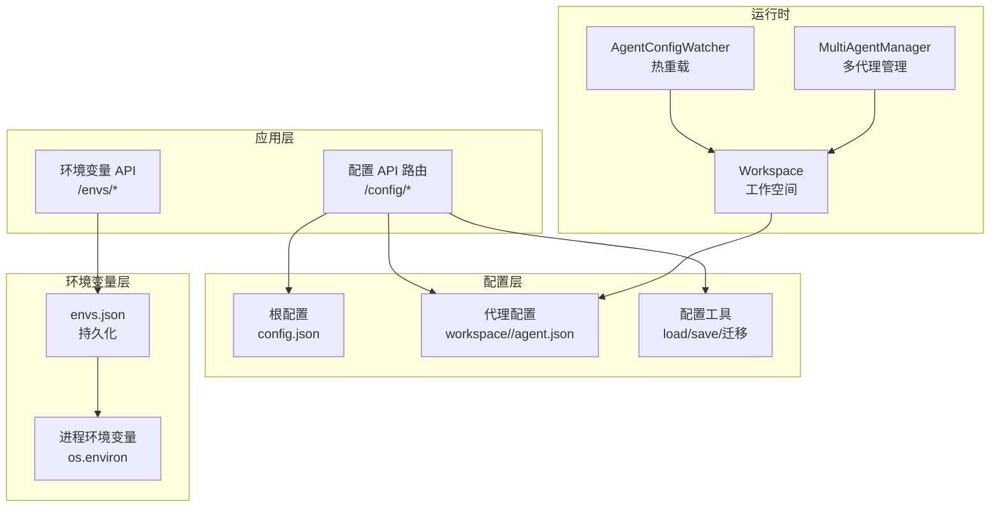
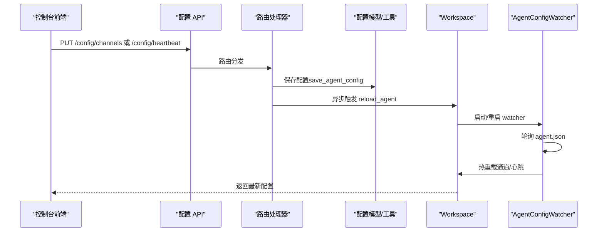
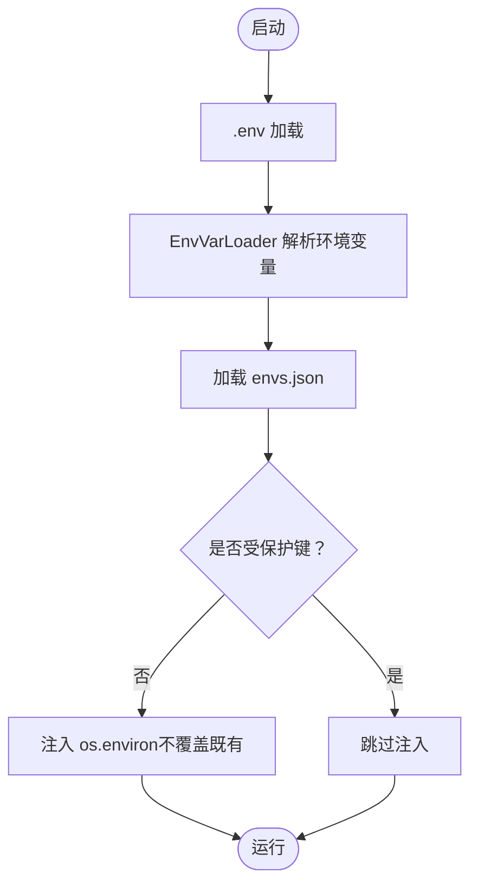
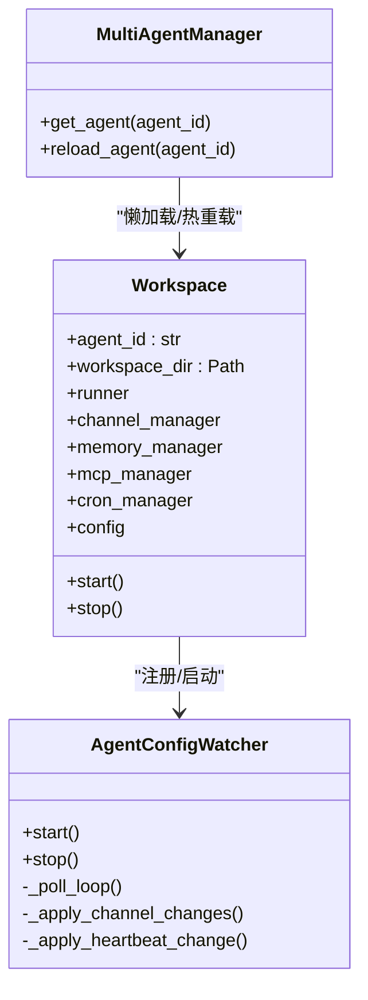
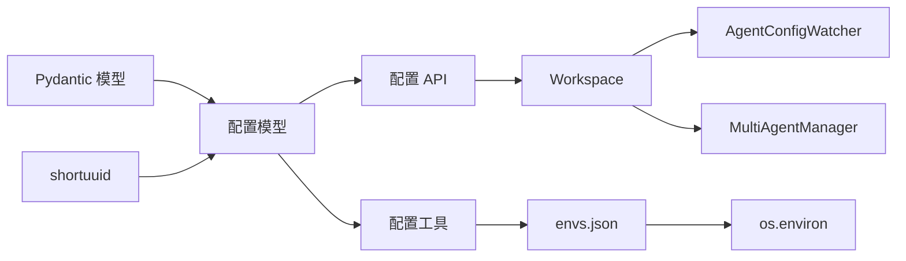

# 配置管理

<cite>
**本文引用的文件**
- [src/copaw/config/config.py](file://src/copaw/config/config.py)
- [src/copaw/config/utils.py](file://src/copaw/config/utils.py)
- [src/copaw/config/context.py](file://src/copaw/config/context.py)
- [src/copaw/constant.py](file://src/copaw/constant.py)
- [src/copaw/envs/store.py](file://src/copaw/envs/store.py)
- [src/copaw/app/routers/config.py](file://src/copaw/app/routers/config.py)
- [src/copaw/app/routers/envs.py](file://src/copaw/app/routers/envs.py)
- [src/copaw/app/agent_config_watcher.py](file://src/copaw/app/agent_config_watcher.py)
- [src/copaw/app/workspace/workspace.py](file://src/copaw/app/workspace/workspace.py)
- [src/copaw/app/multi_agent_manager.py](file://src/copaw/app/multi_agent_manager.py)
- [src/copaw/cli/init_cmd.py](file://src/copaw/cli/init_cmd.py)
- [console/src/pages/Control/Heartbeat/index.tsx](file://console/src/pages/Control/Heartbeat/index.tsx)
- [console/src/api/modules/heartbeat.ts](file://console/src/api/modules/heartbeat.ts)
- [console/src/api/types/heartbeat.ts](file://console/src/api/types/heartbeat.ts)
- [console/src/pages/Settings/Environments/useEnvVars.ts](file://console/src/pages/Settings/Environments/useEnvVars.ts)
- [console/src/api/types/env.ts](file://console/src/api/types/env.ts)
- [website/public/docs/config.zh.md](file://website/public/docs/config.zh.md)
</cite>

## 目录
1. [简介](#简介)
2. [项目结构](#项目结构)
3. [核心组件](#核心组件)
4. [架构总览](#架构总览)
5. [详细组件分析](#详细组件分析)
6. [依赖分析](#依赖分析)
7. [性能考虑](#性能考虑)
8. [故障排除指南](#故障排除指南)
9. [结论](#结论)
10. [附录](#附录)

## 简介
本文件系统化阐述 CoPaw 的配置管理体系，覆盖以下方面：
- 配置文件结构与分层（根配置、代理配置、工作区配置）
- 环境变量加载、持久化与注入策略
- 默认值管理与校验规则
- 配置优先级、继承关系与覆盖机制
- 工作空间配置、多代理隔离与热重载
- 配置备份与恢复建议
- 常见问题与排障方法

## 项目结构
CoPaw 将配置分为三层：
- 根配置（config.json）：全局与默认设置，包含代理概览、默认运行参数、安全策略等
- 代理配置（workspace/<agent>/agent.json）：每个代理独立的完整配置，包含通道、心跳、运行参数、工具、安全等
- 工作区配置（workspace/<agent>/...）：运行时数据与状态（如 jobs.json、chats.json、token_usage.json）

图示来源
- [src/copaw/app/routers/config.py:40-565](file://src/copaw/app/routers/config.py#L40-L565)
- [src/copaw/app/routers/envs.py:12-81](file://src/copaw/app/routers/envs.py#L12-L81)
- [src/copaw/config/utils.py:423-474](file://src/copaw/config/utils.py#L423-L474)
- [src/copaw/envs/store.py:151-242](file://src/copaw/envs/store.py#L151-L242)
- [src/copaw/app/workspace/workspace.py:39-122](file://src/copaw/app/workspace/workspace.py#L39-L122)
- [src/copaw/app/agent_config_watcher.py:35-96](file://src/copaw/app/agent_config_watcher.py#L35-L96)
- [src/copaw/app/multi_agent_manager.py:17-76](file://src/copaw/app/multi_agent_manager.py#L17-L76)

章节来源
- [src/copaw/config/config.py:1-1101](file://src/copaw/config/config.py#L1-L1101)
- [src/copaw/config/utils.py:423-565](file://src/copaw/config/utils.py#L423-L565)
- [src/copaw/constant.py:72-201](file://src/copaw/constant.py#L72-L201)
- [src/copaw/envs/store.py:1-243](file://src/copaw/envs/store.py#L1-L243)
- [src/copaw/app/routers/config.py:40-565](file://src/copaw/app/routers/config.py#L40-L565)
- [src/copaw/app/routers/envs.py:12-81](file://src/copaw/app/routers/envs.py#L12-L81)
- [src/copaw/app/workspace/workspace.py:39-122](file://src/copaw/app/workspace/workspace.py#L39-L122)
- [src/copaw/app/agent_config_watcher.py:35-96](file://src/copaw/app/agent_config_watcher.py#L35-L96)
- [src/copaw/app/multi_agent_manager.py:17-76](file://src/copaw/app/multi_agent_manager.py#L17-L76)

## 核心组件
- 配置模型与默认值
  - 根配置：包含代理概览、默认运行参数、语言、音频模式、转录后端、MCP 客户端、工具、安全策略等
  - 代理配置：每个代理独立的完整配置，包含通道、心跳、运行参数、LLM 路由、活跃时段、工具、安全等
  - 通道配置：内置多种通道（Telegram、Discord、飞书、钉钉、QQ、IMessage、Console、Voice、Mattermost、MQTT、Matrix、WeCom、小艺）及通用扩展
  - 安全配置：工具守卫与技能扫描器策略
- 配置工具
  - 加载/保存：支持路径规范化、兼容性迁移、字段修复
  - 心跳与最后调度：读取有效心跳配置、更新最后分发目标
  - 浏览器与容器检测：Playwright 可执行路径、容器运行判断
- 环境变量
  - 持久化到 envs.json，启动时注入 os.environ，受保护键不注入
  - 支持批量保存、删除单个变量
- 运行时与热重载
  - Workspace 独立工作空间，懒加载与生命周期管理
  - AgentConfigWatcher 轮询 agent.json 并热重载通道与心跳
  - MultiAgentManager 统一管理多个 Workspace，支持热重载

章节来源
- [src/copaw/config/config.py:19-1101](file://src/copaw/config/config.py#L19-L1101)
- [src/copaw/config/utils.py:423-565](file://src/copaw/config/utils.py#L423-L565)
- [src/copaw/envs/store.py:151-242](file://src/copaw/envs/store.py#L151-L242)
- [src/copaw/app/workspace/workspace.py:39-122](file://src/copaw/app/workspace/workspace.py#L39-L122)
- [src/copaw/app/agent_config_watcher.py:35-96](file://src/copaw/app/agent_config_watcher.py#L35-L96)
- [src/copaw/app/multi_agent_manager.py:17-76](file://src/copaw/app/multi_agent_manager.py#L17-L76)

## 架构总览
配置管理采用“模型驱动 + API 管理 + 热重载”的架构：
- 模型层：Pydantic 模型定义配置结构与校验
- API 层：FastAPI 提供配置与环境变量的增删改查接口
- 运行时层：Workspace 与 Watcher 负责加载与热重载
- 环境变量层：envs.json 与 os.environ 双层持久化与注入

图示来源
- [src/copaw/app/routers/config.py:111-153](file://src/copaw/app/routers/config.py#L111-L153)
- [src/copaw/app/workspace/workspace.py:311-337](file://src/copaw/app/workspace/workspace.py#L311-L337)
- [src/copaw/app/agent_config_watcher.py:74-96](file://src/copaw/app/agent_config_watcher.py#L74-L96)

## 详细组件分析

### 配置文件结构与分层
- 根配置（config.json）
  - 代理概览：当前激活代理、代理档案映射
  - 默认运行参数：最大迭代次数、令牌计数、上下文窗口、内存压缩阈值、历史长度、嵌入模型配置
  - 语言与音频：语言、转录后端类型与模型、音频模式
  - LLM 路由：本地优先/云端优先策略
  - MCP 客户端：默认 tavily_search 客户端（基于环境变量自动启用）
  - 工具：内置工具集合与显示策略
  - 安全：工具守卫与技能扫描器策略
- 代理配置（workspace/<agent>/agent.json）
  - 包含通道、心跳、运行参数、LLM 路由、活跃时段、工具、安全等子配置
  - 与根配置的默认值进行合并与覆盖
- 工作区文件
  - jobs.json：定时任务
  - chats.json：会话聊天
  - token_usage.json：令牌用量统计

章节来源
- [src/copaw/config/config.py:455-525](file://src/copaw/config/config.py#L455-L525)
- [src/copaw/config/config.py:394-453](file://src/copaw/config/config.py#L394-L453)
- [src/copaw/config/config.py:607-626](file://src/copaw/config/config.py#L607-L626)
- [src/copaw/config/config.py:713-727](file://src/copaw/config/config.py#L713-L727)
- [src/copaw/config/config.py:797-800](file://src/copaw/config/config.py#L797-L800)
- [src/copaw/config/utils.py:556-565](file://src/copaw/config/utils.py#L556-L565)

### 环境变量处理与持久化
- 加载顺序与优先级
  - .env 文件在应用启动前加载
  - 环境变量通过 EnvVarLoader 解析并带默认值
  - envs.json 作为持久化层，启动时仅注入非受保护键，避免覆盖显式系统/进程变量
- 受保护键
  - COPAW_WORKING_DIR、COPAW_SECRET_DIR 等关键变量不会被 envs.json 注入
- API 操作
  - 批量保存：替换所有环境变量
  - 删除单个：移除指定键
  - 列表：返回全部键值对

图示来源
- [src/copaw/constant.py:6-10](file://src/copaw/constant.py#L6-L10)
- [src/copaw/constant.py:12-70](file://src/copaw/constant.py#L12-L70)
- [src/copaw/envs/store.py:222-242](file://src/copaw/envs/store.py#L222-L242)

章节来源
- [src/copaw/constant.py:6-10](file://src/copaw/constant.py#L6-L10)
- [src/copaw/constant.py:12-70](file://src/copaw/constant.py#L12-L70)
- [src/copaw/envs/store.py:151-242](file://src/copaw/envs/store.py#L151-L242)
- [src/copaw/app/routers/envs.py:32-81](file://src/copaw/app/routers/envs.py#L32-L81)

### 默认值管理与配置校验
- 默认值来源
  - Pydantic 字段默认值：如最大迭代次数、令牌计数估计因子、上下文窗口、内存压缩比例等
  - 系统常量：心跳默认间隔、目标文件名、工作目录等
  - 环境变量默认值：通过 EnvVarLoader 提供类型安全的默认值
- 校验规则
  - 数值范围约束：ge/le、min/max、正数限制
  - 枚举与字面量：如音频模式、LLM 路由模式
  - 条件必填：如 MCP 传输类型对应的必填字段
  - 兼容性修复：加载配置时尝试移除无效字段并回退到默认值
- 通道可用性过滤
  - 通过 COPAW_ENABLED_CHANNELS/COPAW_DISABLED_CHANNELS 控制通道可见与启用

章节来源
- [src/copaw/config/config.py:252-353](file://src/copaw/config/config.py#L252-L353)
- [src/copaw/config/config.py:355-378](file://src/copaw/config/config.py#L355-L378)
- [src/copaw/config/config.py:535-605](file://src/copaw/config/config.py#L535-L605)
- [src/copaw/config/utils.py:333-359](file://src/copaw/config/utils.py#L333-L359)
- [src/copaw/constant.py:72-201](file://src/copaw/constant.py#L72-L201)

### 配置优先级、继承与覆盖
- 文件优先级
  - 代理配置覆盖根配置中的默认值
  - 代理配置中未设置的字段使用默认值（来自模型默认或系统常量）
- 环境变量优先级
  - 系统/进程环境变量优先于 envs.json 注入
  - 受保护键不被 envs.json 注入
- 通道覆盖
  - 通过 API 更新通道配置后，AgentConfigWatcher 热重载对应通道
- CLI 初始化
  - CLI 交互式初始化时生成心跳配置与活跃时段，并写入代理配置

章节来源
- [src/copaw/config/config.py:455-525](file://src/copaw/config/config.py#L455-L525)
- [src/copaw/config/utils.py:423-474](file://src/copaw/config/utils.py#L423-L474)
- [src/copaw/envs/store.py:222-242](file://src/copaw/envs/store.py#L222-L242)
- [src/copaw/app/routers/config.py:111-153](file://src/copaw/app/routers/config.py#L111-L153)
- [src/copaw/app/agent_config_watcher.py:178-217](file://src/copaw/app/agent_config_watcher.py#L178-L217)
- [src/copaw/cli/init_cmd.py:216-257](file://src/copaw/cli/init_cmd.py#L216-L257)

### 工作空间配置、多代理隔离与热重载
- 工作空间隔离
  - 每个代理拥有独立的 Workspace，包含 Runner、ChannelManager、MemoryManager、MCPClientManager、CronManager
  - 多代理管理器按需懒加载，线程安全
- 热重载机制
  - AgentConfigWatcher 轮询 agent.json，检测变更后逐项热重载通道与心跳
  - API 更新配置后异步触发 reload_agent，确保不影响其他代理
- 上下文传递
  - 使用 contextvars 在工具函数中解析相对路径，保证多代理场景下的路径正确性

图示来源
- [src/copaw/app/workspace/workspace.py:39-122](file://src/copaw/app/workspace/workspace.py#L39-L122)
- [src/copaw/app/agent_config_watcher.py:35-96](file://src/copaw/app/agent_config_watcher.py#L35-L96)
- [src/copaw/app/multi_agent_manager.py:17-76](file://src/copaw/app/multi_agent_manager.py#L17-L76)

章节来源
- [src/copaw/app/workspace/workspace.py:39-122](file://src/copaw/app/workspace/workspace.py#L39-L122)
- [src/copaw/app/agent_config_watcher.py:35-96](file://src/copaw/app/agent_config_watcher.py#L35-L96)
- [src/copaw/app/multi_agent_manager.py:17-76](file://src/copaw/app/multi_agent_manager.py#L17-L76)
- [src/copaw/config/context.py:11-34](file://src/copaw/config/context.py#L11-L34)

### 配置 API 与前端交互
- 配置 API
  - 通道列表与类型、更新通道、获取单通道
  - 获取/更新心跳配置（含活跃时段）
  - 获取/更新代理 LLM 路由
  - 获取/更新用户时区
  - 工具守卫与技能扫描器配置
- 前端交互
  - 控制台心跳页面通过 API 读取/保存心跳配置
  - 环境变量页面通过 API 列出/批量保存/删除

章节来源
- [src/copaw/app/routers/config.py:40-565](file://src/copaw/app/routers/config.py#L40-L565)
- [console/src/pages/Control/Heartbeat/index.tsx:84-170](file://console/src/pages/Control/Heartbeat/index.tsx#L84-L170)
- [console/src/api/modules/heartbeat.ts:1-12](file://console/src/api/modules/heartbeat.ts#L1-L12)
- [console/src/api/types/heartbeat.ts:1-11](file://console/src/api/types/heartbeat.ts#L1-L11)
- [console/src/pages/Settings/Environments/useEnvVars.ts:1-33](file://console/src/pages/Settings/Environments/useEnvVars.ts#L1-L33)
- [console/src/api/types/env.ts:1-4](file://console/src/api/types/env.ts#L1-L4)

### 配置验证与兼容性
- 配置加载时若出现校验错误，尝试移除导致错误的字段并回退到默认值
- 路径兼容：将旧版工作目录绑定路径重写为新 WORKING_DIR
- 通道可用性：根据环境变量白名单/黑名单过滤可用通道

章节来源
- [src/copaw/config/utils.py:423-474](file://src/copaw/config/utils.py#L423-L474)
- [src/copaw/config/utils.py:31-65](file://src/copaw/config/utils.py#L31-L65)
- [src/copaw/config/utils.py:333-359](file://src/copaw/config/utils.py#L333-L359)

## 依赖分析
- 配置模型依赖
  - Pydantic BaseModel/Field/model_validator 提供强类型与校验
  - shortuuid 用于生成代理 ID
- 运行时依赖
  - Workspace 依赖服务工厂创建 Runner、ChannelManager、CronManager 等
  - AgentConfigWatcher 依赖通道管理器与 CronManager
- API 依赖
  - FastAPI 路由处理请求，调用配置工具与存储模块
- 环境变量依赖
  - envs.json 与 os.environ 双层持久化与注入

图示来源
- [src/copaw/config/config.py:7-16](file://src/copaw/config/config.py#L7-L16)
- [src/copaw/config/utils.py:423-474](file://src/copaw/config/utils.py#L423-L474)
- [src/copaw/envs/store.py:151-242](file://src/copaw/envs/store.py#L151-L242)
- [src/copaw/app/routers/config.py:40-565](file://src/copaw/app/routers/config.py#L40-L565)
- [src/copaw/app/workspace/workspace.py:134-277](file://src/copaw/app/workspace/workspace.py#L134-L277)
- [src/copaw/app/agent_config_watcher.py:35-96](file://src/copaw/app/agent_config_watcher.py#L35-L96)
- [src/copaw/app/multi_agent_manager.py:17-76](file://src/copaw/app/multi_agent_manager.py#L17-L76)

章节来源
- [src/copaw/config/config.py:7-16](file://src/copaw/config/config.py#L7-L16)
- [src/copaw/config/utils.py:423-474](file://src/copaw/config/utils.py#L423-L474)
- [src/copaw/envs/store.py:151-242](file://src/copaw/envs/store.py#L151-L242)
- [src/copaw/app/routers/config.py:40-565](file://src/copaw/app/routers/config.py#L40-L565)
- [src/copaw/app/workspace/workspace.py:134-277](file://src/copaw/app/workspace/workspace.py#L134-L277)
- [src/copaw/app/agent_config_watcher.py:35-96](file://src/copaw/app/agent_config_watcher.py#L35-L96)
- [src/copaw/app/multi_agent_manager.py:17-76](file://src/copaw/app/multi_agent_manager.py#L17-L76)

## 性能考虑
- 热重载轮询间隔：默认 2 秒，可在 Watcher 中调整
- 配置保存：异步触发热重载，避免阻塞请求
- 路径扫描与浏览器检测：仅在必要时执行，容器内优先使用系统浏览器
- 内存压缩阈值与保留比例：通过运行参数动态计算，平衡内存占用与性能

## 故障排除指南
- 配置加载失败
  - 现象：配置文件损坏或字段缺失
  - 处理：工具会尝试移除无效字段并回退到默认值；若仍失败，返回默认配置
  - 参考：[配置加载与修复:423-474](file://src/copaw/config/utils.py#L423-L474)
- 通道不可用
  - 现象：通道未出现在可用列表
  - 处理：检查 COPAW_ENABLED_CHANNELS/COPAW_DISABLED_CHANNELS 环境变量
  - 参考：[通道可用性过滤:333-359](file://src/copaw/config/utils.py#L333-L359)
- 环境变量未生效
  - 现象：envs.json 已更新但进程未感知
  - 处理：确认非受保护键；启动时已注入且不覆盖既有；必要时重启进程
  - 参考：[环境变量注入策略:222-242](file://src/copaw/envs/store.py#L222-L242)
- 热重载未生效
  - 现象：修改 agent.json 后通道/心跳未更新
  - 处理：确认 Watcher 正在运行；检查 API 是否触发了 reload_agent；查看日志异常
  - 参考：[AgentConfigWatcher:74-96](file://src/copaw/app/agent_config_watcher.py#L74-L96)
- 心跳配置无效
  - 现象：心跳未按预期时间执行
  - 处理：通过 API 更新心跳配置并触发 CronManager 重新调度
  - 参考：[心跳 API:286-326](file://src/copaw/app/routers/config.py#L286-L326)

章节来源
- [src/copaw/config/utils.py:423-474](file://src/copaw/config/utils.py#L423-L474)
- [src/copaw/config/utils.py:333-359](file://src/copaw/config/utils.py#L333-L359)
- [src/copaw/envs/store.py:222-242](file://src/copaw/envs/store.py#L222-L242)
- [src/copaw/app/agent_config_watcher.py:74-96](file://src/copaw/app/agent_config_watcher.py#L74-L96)
- [src/copaw/app/routers/config.py:286-326](file://src/copaw/app/routers/config.py#L286-L326)

## 结论
CoPaw 的配置管理以 Pydantic 模型为核心，结合 API 管理、热重载与环境变量双层持久化，实现了灵活、安全、可扩展的配置体系。通过明确的优先级与覆盖机制、严格的校验与兼容性修复、以及工作空间隔离与多代理管理，满足了多用户、多代理场景下的配置需求。

## 附录

### 配置项速查与示例
- 根配置关键项
  - agents.active_agent：当前激活代理 ID
  - agents.running.max_iters：最大推理-行动迭代次数
  - agents.running.max_input_length：上下文窗口大小
  - agents.running.memory_compact_ratio/memory_reserve_ratio：内存压缩与保留比例
  - agents.language：语言
  - agents.transcription_provider_type/transcription_provider_id/transcription_model：转录后端
  - agents.llm_routing.mode：LLM 路由模式
  - agents.system_prompt_files：系统提示文件列表
- 代理配置关键项
  - channels.*：各通道配置
  - heartbeat.enabled/every/target/activeHours：心跳配置
  - running.*：运行参数
  - llm_routing.local/cloud：LLM 路由槽位
  - tools：内置工具集合
  - security.tool_guard/skill_scanner：安全策略
- 环境变量关键项
  - COPAW_WORKING_DIR/COPAW_SECRET_DIR：工作目录与密钥目录
  - COPAW_ENABLED_CHANNELS/COPAW_DISABLED_CHANNELS：通道白/黑名单
  - PLAYWRIGHT_CHROMIUM_EXECUTABLE_PATH：浏览器可执行路径
  - COPAW_RUNNING_IN_CONTAINER：容器运行标记
  - COPAW_LLM_MAX_RETRIES/COPAW_LLM_BACKOFF_BASE/COPAW_LLM_BACKOFF_CAP：LLM 重试策略
  - 其他：日志级别、CORS、内存压缩相关等

章节来源
- [src/copaw/config/config.py:455-525](file://src/copaw/config/config.py#L455-L525)
- [src/copaw/config/config.py:252-353](file://src/copaw/config/config.py#L252-L353)
- [src/copaw/config/config.py:355-378](file://src/copaw/config/config.py#L355-L378)
- [src/copaw/config/config.py:713-727](file://src/copaw/config/config.py#L713-L727)
- [src/copaw/config/config.py:797-800](file://src/copaw/config/config.py#L797-L800)
- [src/copaw/constant.py:72-201](file://src/copaw/constant.py#L72-L201)

### 最佳实践
- 使用 API 管理配置，避免直接编辑文件
- 通过 envs.json 管理敏感变量，避免硬编码
- 为每个代理维护独立的 agent.json，实现完全隔离
- 合理设置心跳间隔与活跃时段，避免资源浪费
- 定期备份 config.json 与 envs.json，配合版本控制

### 工作空间与文件说明
- config.json：根配置
- workspace/<agent>/agent.json：代理配置
- workspace/<agent>/jobs.json：定时任务
- workspace/<agent>/chats.json：会话聊天
- workspace/<agent>/token_usage.json：令牌用量
- workspace/<agent>/HEARTBEAT.md：心跳任务脚本

章节来源
- [src/copaw/config/utils.py:556-565](file://src/copaw/config/utils.py#L556-L565)
- [website/public/docs/config.zh.md:472-479](file://website/public/docs/config.zh.md#L472-L479)