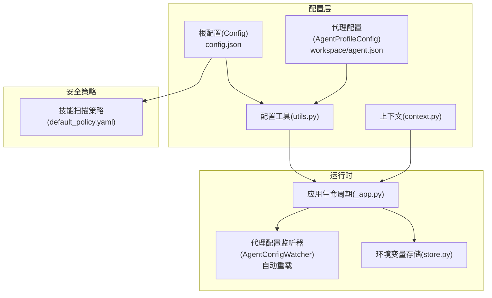
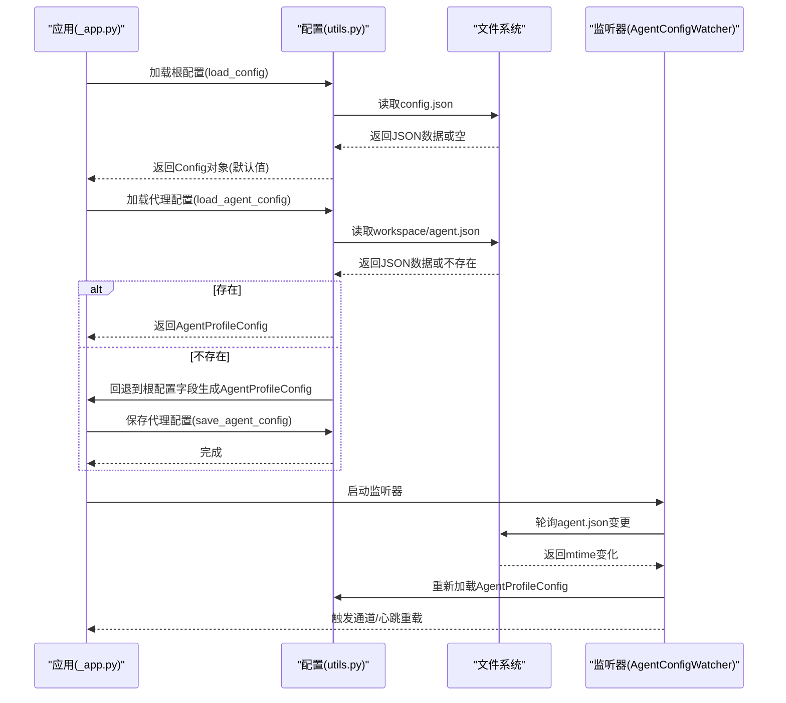
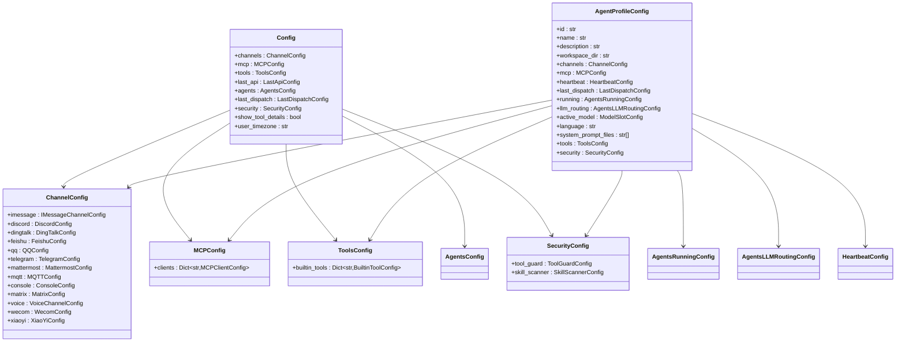
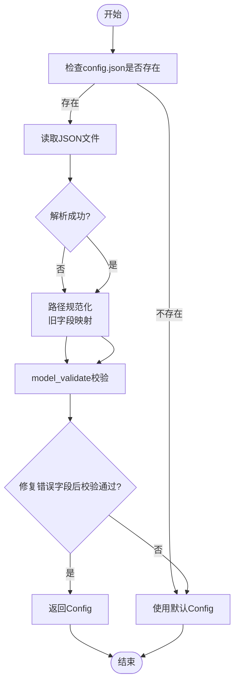
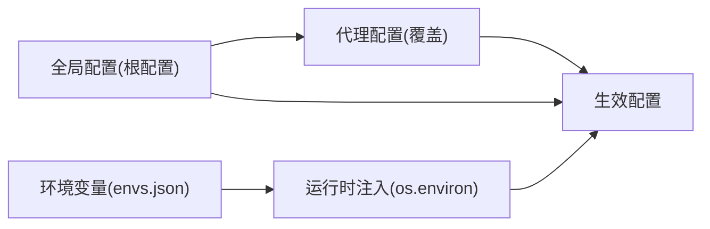
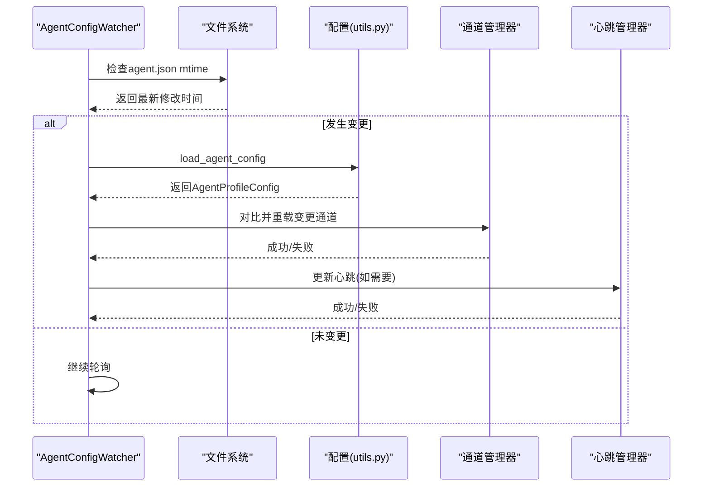
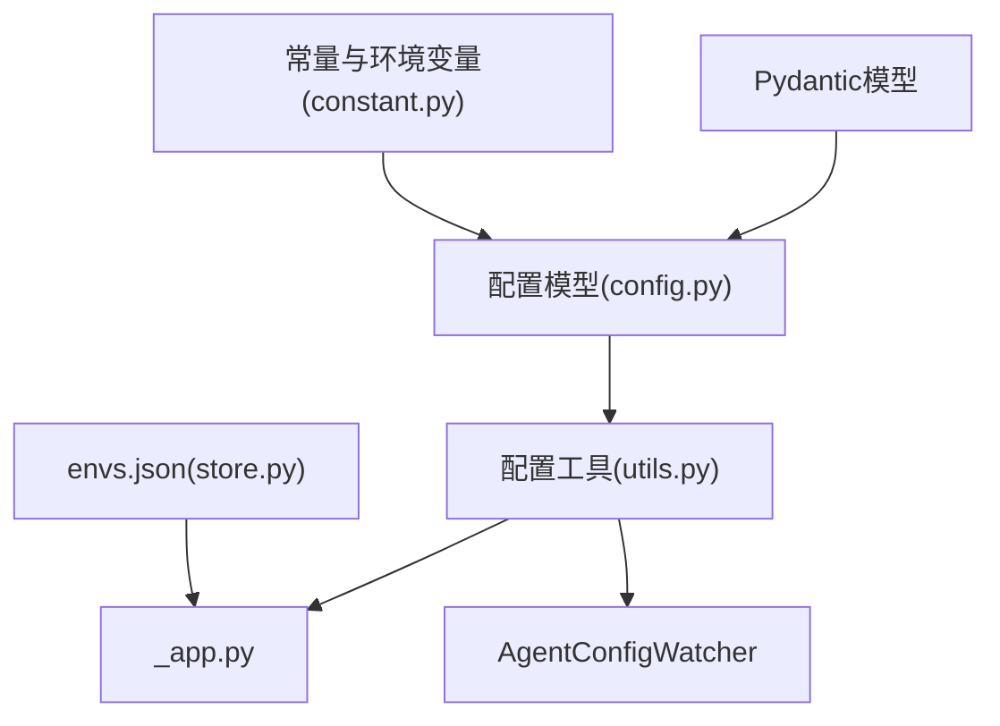

# 配置系统架构

<cite>
**本文档引用的文件**
- [config.py](file://src/copaw/config/config.py)
- [utils.py](file://src/copaw/config/utils.py)
- [context.py](file://src/copaw/config/context.py)
- [agent_config_watcher.py](file://src/copaw/app/agent_config_watcher.py)
- [constant.py](file://src/copaw/constant.py)
- [store.py](file://src/copaw/envs/store.py)
- [_app.py](file://src/copaw/app/_app.py)
- [default_policy.yaml](file://src/copaw/security/skill_scanner/data/default_policy.yaml)
</cite>

## 目录
1. [引言](#引言)
2. [项目结构](#项目结构)
3. [核心组件](#核心组件)
4. [架构总览](#架构总览)
5. [详细组件分析](#详细组件分析)
6. [依赖关系分析](#依赖关系分析)
7. [性能考虑](#性能考虑)
8. [故障排除指南](#故障排除指南)
9. [结论](#结论)
10. [附录](#附录)

## 引言
本文件系统性阐述CoPaw配置系统的整体架构与实现细节，覆盖配置文件结构、Pydantic模型定义、字段验证规则、配置加载与验证机制、配置层次结构（全局到代理特定）、配置优先级与合并策略、扩展点与自定义配置项添加方法、配置热重载机制、以及备份与恢复策略。目标是帮助开发者与运维人员快速理解并高效使用配置系统。

## 项目结构
CoPaw配置系统主要由以下模块组成：
- 根配置模型：定义顶层配置结构（channels、mcp、tools、agents等）
- 代理配置模型：每个代理独立的完整配置（workspace/agent.json）
- 工具函数：配置加载、保存、路径解析、向后兼容处理
- 环境变量管理：持久化与注入机制
- 热重载监听器：监控代理配置变更并自动重载
- 常量与环境变量：工作目录、文件名、默认行为等

**图表来源**
- [config.py](file://src/copaw/config/config.py)
- [utils.py](file://src/copaw/config/utils.py)
- [context.py](file://src/copaw/config/context.py)
- [_app.py](file://src/copaw/app/_app.py)
- [agent_config_watcher.py](file://src/copaw/app/agent_config_watcher.py)
- [store.py](file://src/copaw/envs/store.py)
- [default_policy.yaml](file://src/copaw/security/skill_scanner/data/default_policy.yaml)

**章节来源**
- [config.py](file://src/copaw/config/config.py)
- [utils.py](file://src/copaw/config/utils.py)
- [context.py](file://src/copaw/config/context.py)
- [_app.py](file://src/copaw/app/_app.py)
- [agent_config_watcher.py](file://src/copaw/app/agent_config_watcher.py)
- [store.py](file://src/copaw/envs/store.py)
- [default_policy.yaml](file://src/copaw/security/skill_scanner/data/default_policy.yaml)

## 核心组件
- 根配置模型（Config）：顶层配置容器，包含通道、MCP、工具、代理、安全等子配置。
- 代理配置模型（AgentProfileConfig）：每个代理的完整配置，独立于根配置存储在工作空间目录。
- 配置工具（utils.py）：负责配置文件读写、向后兼容处理、路径规范化、心跳与最后分发信息读写。
- 环境变量存储（store.py）：envs.json持久化与os.environ同步，支持受保护键注入策略。
- 上下文变量（context.py）：跨线程/协程传递当前代理工作空间目录。
- 代理配置监听器（AgentConfigWatcher）：轮询agent.json变更并触发通道与心跳重载。
- 常量与环境变量（constant.py）：工作目录、文件名、默认行为等通过环境变量控制。

**章节来源**
- [config.py](file://src/copaw/config/config.py)
- [utils.py](file://src/copaw/config/utils.py)
- [context.py](file://src/copaw/config/context.py)
- [agent_config_watcher.py](file://src/copaw/app/agent_config_watcher.py)
- [constant.py](file://src/copaw/constant.py)
- [store.py](file://src/copaw/envs/store.py)

## 架构总览
配置系统采用“根配置 + 多代理配置”的双层结构：
- 根配置（config.json）：全局默认设置、通用通道、MCP客户端、工具开关、安全策略、用户时区等。
- 代理配置（workspace/agent.json）：每个代理的独立配置，包含通道、MCP、心跳、运行参数、LLM路由、语言、系统提示文件、工具与安全策略等。

配置加载流程：
- 应用启动时加载根配置；若不存在则使用默认值。
- 对于代理特定配置，按需从工作空间加载；若不存在则回退到根配置字段生成代理配置并持久化。
- 环境变量通过envs.json持久化并在进程启动时注入os.environ。
- 运行时通过AgentConfigWatcher监听agent.json变更并自动重载通道与心跳。

**图表来源**
- [_app.py](file://src/copaw/app/_app.py)
- [utils.py](file://src/copaw/config/utils.py)
- [agent_config_watcher.py](file://src/copaw/app/agent_config_watcher.py)

**章节来源**
- [_app.py](file://src/copaw/app/_app.py)
- [utils.py](file://src/copaw/config/utils.py)
- [agent_config_watcher.py](file://src/copaw/app/agent_config_watcher.py)

## 详细组件分析

### 配置模型与字段验证
- 根配置（Config）：包含channels、mcp、tools、last_api、agents、last_dispatch、security、show_tool_details、user_timezone等字段，均通过Pydantic模型进行类型检查与默认值填充。
- 代理配置（AgentProfileConfig）：包含id、name、description、workspace_dir、channels、mcp、heartbeat、last_dispatch、running、llm_routing、active_model、language、system_prompt_files、tools、security等字段，支持可选字段与嵌套模型。
- 通道配置（ChannelConfig）：内置多种通道（IMessage、Discord、DingTalk、Feishu、QQ、Telegram、Mattermost、MQTT、Console、Matrix、Voice、Wecom、XiaoYi），每种通道有特定字段；额外允许插件通道的动态键。
- MCP配置（MCPConfig）：以字典形式管理客户端，支持动态定义；内置tavily_search客户端，当存在API密钥时自动启用。
- 工具配置（ToolsConfig）：内置工具集合，支持默认工具合并与去重。
- 安全配置（SecurityConfig）：包含工具守卫与技能扫描策略。
- 代理运行配置（AgentsRunningConfig）：包含迭代次数、令牌计数、内存压缩阈值、历史长度、嵌入模型配置等，大量字段带有范围约束（ge/le/lt/gt）与描述性注释。
- LLM路由配置（AgentsLLMRoutingConfig）：支持本地优先与云端优先两种模式，可指定本地与云端槽位。
- 心跳配置（HeartbeatConfig）：包含启用标志、周期、目标、活跃时段等。
- 环境变量与路径：通过常量模块统一管理，支持工作目录、文件名、默认媒体目录、心跳文件名等。

**图表来源**
- [config.py](file://src/copaw/config/config.py)

**章节来源**
- [config.py](file://src/copaw/config/config.py)

### 配置加载与验证机制
- 加载流程：优先从工作目录读取config.json，若不存在返回默认Config；解析失败时尝试移除错误字段后再次校验，仍失败则返回默认值。
- 代理配置加载：先从根配置获取代理引用，再读取对应工作空间的agent.json；若不存在则回退到根配置字段生成代理配置并保存。
- 向后兼容：对旧版路径（如~/.copaw）进行规范化，确保COPAW_WORKING_DIR变更不影响历史数据；对旧字段（如last_api_host/port）进行映射。
- 字段验证：广泛使用Pydantic的Field约束（如ge/le/gt/lt）、别名（alias）、模型级校验器（model_validator）与字段级校验器（field_validator），确保配置合法与一致。

**图表来源**
- [utils.py](file://src/copaw/config/utils.py)

**章节来源**
- [utils.py](file://src/copaw/config/utils.py)

### 配置层次结构与优先级
- 全局配置（根配置）：作为默认值与全局策略来源，包含通用通道、MCP、工具、安全策略等。
- 代理特定配置：覆盖全局配置中的同名字段，形成“代理级别优先”。
- 环境变量：通过envs.json持久化并在进程启动时注入os.environ，用于敏感信息与运行时参数。
- 通道白名单/黑名单：通过环境变量COPAW_ENABLED_CHANNELS与COPAW_DISABLED_CHANNELS控制可用通道集合，前者优先于后者。

**图表来源**
- [utils.py](file://src/copaw/config/utils.py)
- [store.py](file://src/copaw/envs/store.py)

**章节来源**
- [utils.py](file://src/copaw/config/utils.py)
- [store.py](file://src/copaw/envs/store.py)

### 配置合并策略
- 代理配置合并：当代理配置文件缺失时，从根配置中提取相应字段生成代理配置并保存，确保新旧版本兼容。
- 内置工具合并：ToolsConfig在模型后验证阶段会将新增的内置工具合并到现有配置中，避免遗漏。
- 路径规范化：对工作目录绑定的路径（如workspace_dir、media_dir）进行规范化，保证COPAW_WORKING_DIR变更后仍有效。

**章节来源**
- [config.py](file://src/copaw/config/config.py)
- [utils.py](file://src/copaw/config/utils.py)

### 扩展点与自定义配置项
- 插件通道：ChannelConfig允许额外键，便于第三方通道以动态键形式注册与使用。
- 动态MCP客户端：MCPConfig使用字典存储客户端，支持在运行时动态增删改查。
- 自定义工具：通过扩展内置工具定义与合并逻辑，可在不破坏现有配置的前提下添加新工具。
- 环境变量：通过envs.json持久化敏感配置，避免硬编码在配置文件中。

**章节来源**
- [config.py](file://src/copaw/config/config.py)
- [store.py](file://src/copaw/envs/store.py)

### 配置热重载机制
- 监听器：AgentConfigWatcher定期轮询agent.json的修改时间，检测到变更后重新加载代理配置。
- 变更应用：逐通道对比新旧配置，仅对变更的通道执行克隆与替换；同时根据心跳配置哈希更新心跳调度。
- 错误处理：单个通道重载失败时回滚该通道配置，不影响其他通道与心跳更新。

**图表来源**
- [agent_config_watcher.py](file://src/copaw/app/agent_config_watcher.py)
- [utils.py](file://src/copaw/config/utils.py)

**章节来源**
- [agent_config_watcher.py](file://src/copaw/app/agent_config_watcher.py)
- [utils.py](file://src/copaw/config/utils.py)

### 配置备份与恢复策略
- 备份建议：在修改重要配置前，复制config.json与各代理的agent.json至安全位置；对于envs.json也应备份。
- 恢复策略：若配置损坏，可直接删除或重命名损坏文件，系统会在必要时回退到默认值或从根配置生成代理配置。
- 迁移兼容：迁移脚本会保留根配置中的旧字段以支持降级，同时将历史数据迁移到新的工作空间结构。

**章节来源**
- [utils.py](file://src/copaw/config/utils.py)
- [config.py](file://src/copaw/config/config.py)

## 依赖关系分析
- 配置模型依赖Pydantic进行类型检查与序列化。
- 配置工具依赖常量模块提供的路径与默认值。
- 应用生命周期依赖配置工具进行配置加载与保存。
- 监听器依赖配置工具进行代理配置加载。
- 环境变量存储依赖常量模块确定默认路径。

**图表来源**
- [config.py](file://src/copaw/config/config.py)
- [utils.py](file://src/copaw/config/utils.py)
- [constant.py](file://src/copaw/constant.py)
- [_app.py](file://src/copaw/app/_app.py)
- [agent_config_watcher.py](file://src/copaw/app/agent_config_watcher.py)
- [store.py](file://src/copaw/envs/store.py)

**章节来源**
- [config.py](file://src/copaw/config/config.py)
- [utils.py](file://src/copaw/config/utils.py)
- [constant.py](file://src/copaw/constant.py)
- [_app.py](file://src/copaw/app/_app.py)
- [agent_config_watcher.py](file://src/copaw/app/agent_config_watcher.py)
- [store.py](file://src/copaw/envs/store.py)

## 性能考虑
- 轮询间隔：AgentConfigWatcher默认轮询间隔为2秒，可根据实际需求调整以平衡响应速度与CPU开销。
- 哈希比较：通道与心跳配置通过哈希快速判断是否发生变化，减少不必要的重载操作。
- 路径规范化：仅在首次加载与迁移时进行路径规范化，日常运行中避免重复计算。
- 环境变量注入：envs.json仅在进程启动时注入一次，后续通过增量同步减少开销。

[本节为通用指导，无需具体文件分析]

## 故障排除指南
- 配置加载失败：检查config.json语法与字段合法性；系统会尝试移除错误字段后重试，若仍失败则使用默认配置。
- 代理配置缺失：确认根配置中的代理引用是否正确；若agent.json不存在，系统会自动生成并保存。
- 通道重载失败：监听器会回滚该通道配置，检查通道配置的必填字段与传输类型要求。
- 环境变量未生效：确认envs.json权限与格式；确保进程启动时已调用加载函数。

**章节来源**
- [utils.py](file://src/copaw/config/utils.py)
- [agent_config_watcher.py](file://src/copaw/app/agent_config_watcher.py)
- [store.py](file://src/copaw/envs/store.py)

## 结论
CoPaw配置系统通过清晰的双层结构（根配置与代理配置）、严格的Pydantic验证、完善的向后兼容与热重载机制，提供了高可用、易扩展且可维护的配置管理能力。结合环境变量持久化与策略化安全配置，系统能够在多代理场景下保持一致性与安全性。

## 附录
- 默认策略文件：技能扫描策略位于default_policy.yaml，可通过组织策略文件进行覆盖。
- 常量与默认值：工作目录、文件名、心跳周期等通过常量模块集中管理，便于统一配置与调试。

**章节来源**
- [default_policy.yaml](file://src/copaw/security/skill_scanner/data/default_policy.yaml)
- [constant.py](file://src/copaw/constant.py)