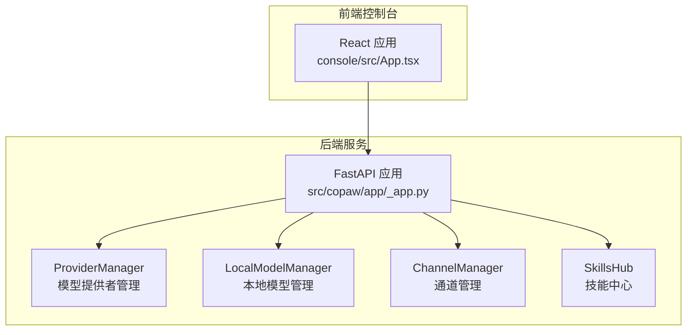
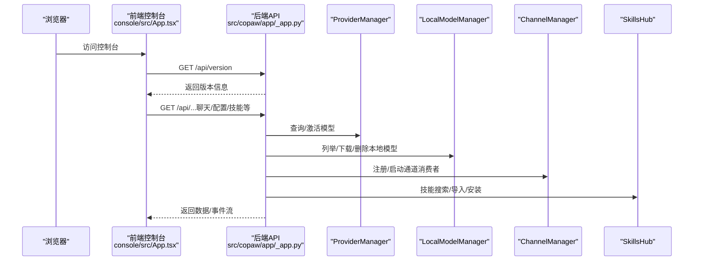
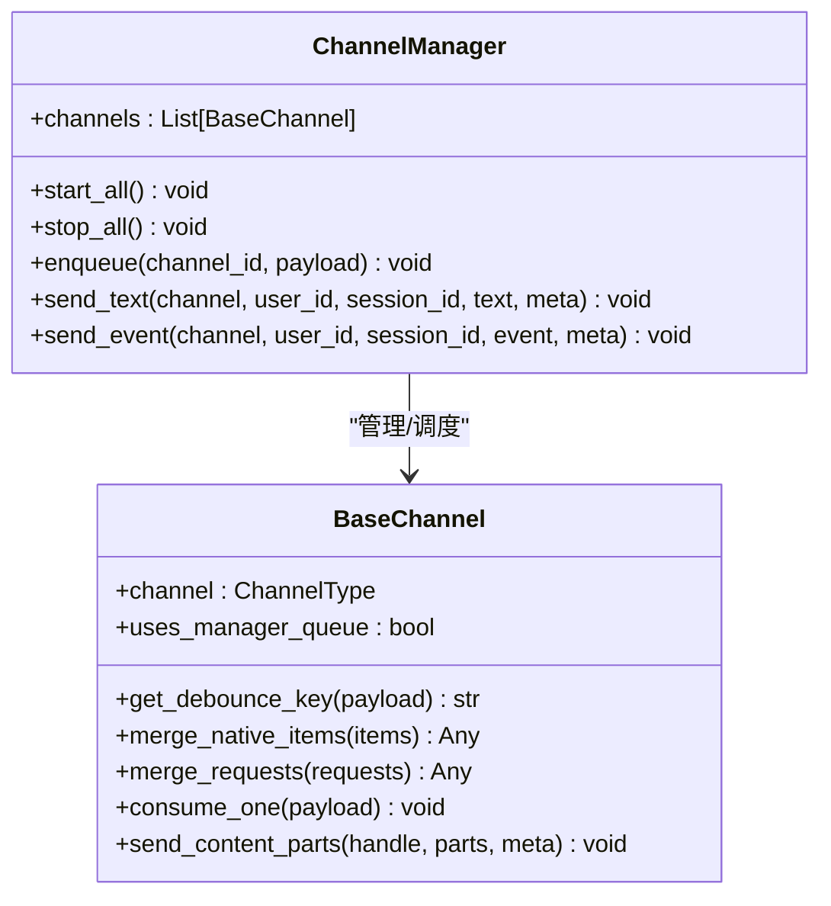
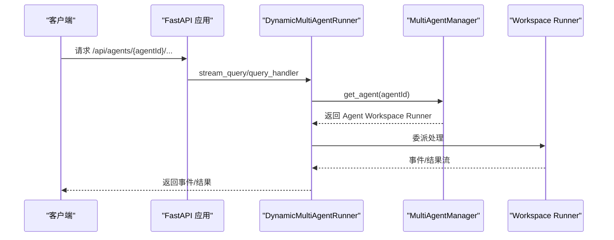
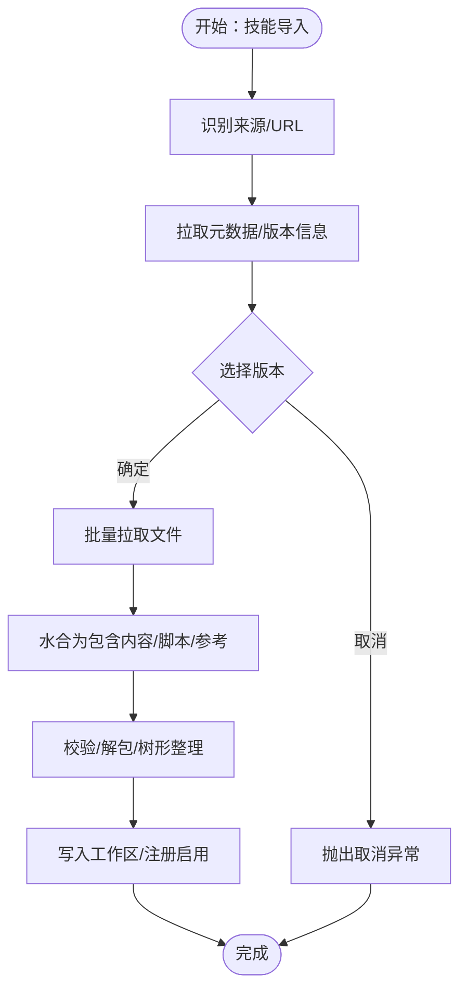
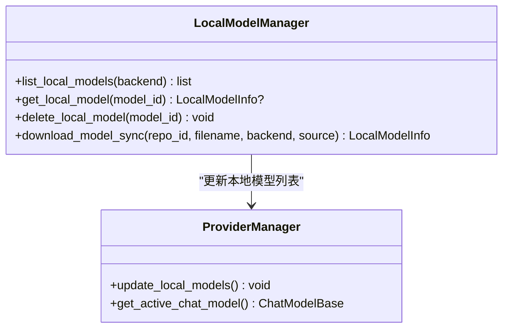
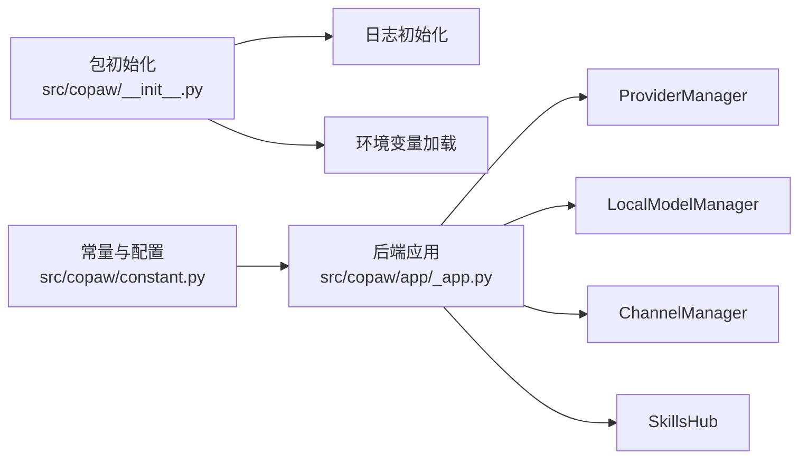

# 什么是CoPaw

<cite>
**本文引用的文件**
- [README.md](file://README.md)
- [src/copaw/__init__.py](file://src/copaw/__init__.py)
- [src/copaw/app/_app.py](file://src/copaw/app/_app.py)
- [src/copaw/constant.py](file://src/copaw/constant.py)
- [src/copaw/app/channels/manager.py](file://src/copaw/app/channels/manager.py)
- [src/copaw/app/channels/base.py](file://src/copaw/app/channels/base.py)
- [src/copaw/providers/provider_manager.py](file://src/copaw/providers/provider_manager.py)
- [src/copaw/local_models/manager.py](file://src/copaw/local_models/manager.py)
- [src/copaw/agents/tools/__init__.py](file://src/copaw/agents/tools/__init__.py)
- [src/copaw/agents/skills_hub.py](file://src/copaw/agents/skills_hub.py)
- [src/copaw/agents/skills/cron/SKILL.md](file://src/copaw/agents/skills/cron/SKILL.md)
- [src/copaw/agents/skills/browser_visible/SKILL.md](file://src/copaw/agents/skills/browser_visible/SKILL.md)
- [src/copaw/agents/skills/docx/SKILL.md](file://src/copaw/agents/skills/docx/SKILL.md)
- [console/src/App.tsx](file://console/src/App.tsx)
</cite>

## 目录
1. [引言](#引言)
2. [项目结构](#项目结构)
3. [核心组件](#核心组件)
4. [架构总览](#架构总览)
5. [详细组件分析](#详细组件分析)
6. [依赖关系分析](#依赖关系分析)
7. [性能考量](#性能考量)
8. [故障排查指南](#故障排查指南)
9. [结论](#结论)
10. [附录](#附录)

## 引言
CoPaw是一个“个人AI助手工作站”，既代表“协作的个人智能体工作站”，也寓意“陪伴左右的小爪子”。它强调“为你而生，与你共同成长”的理念，提供可安装、可部署在本地或云端的统一平台；支持多聊天渠道（钉钉、飞书、QQ、Discord、iMessage等10+平台），具备可控记忆与个性化、可扩展技能体系、可本地部署、无厂商锁定等优势。其目标是成为你数字生活的终极搭档，既能满足日常社交、生产力、创意、研究、桌面自动化等场景需求，也能通过技能与计划任务构建更复杂的“智能应用”。

## 项目结构
CoPaw采用前后端分离与模块化设计：
- 后端（Python）：FastAPI应用、通道管理、模型提供者管理、本地模型下载与注册、技能中心、工具集等。
- 前端（React）：控制台Web界面，提供聊天、配置、技能管理、模型管理、定时任务等操作入口。
- 配置与常量：工作目录、密钥目录、媒体目录、心跳、内存压缩策略、CORS、超时等环境变量与默认值集中管理。
- 渠道层：抽象通道基类与多渠道实现，统一处理请求合并、去抖、队列与消费者并发、会话隔离等。

图示来源
- [src/copaw/app/_app.py:241-409](file://src/copaw/app/_app.py#L241-L409)
- [src/copaw/providers/provider_manager.py:288-717](file://src/copaw/providers/provider_manager.py#L288-L717)
- [src/copaw/local_models/manager.py:94-413](file://src/copaw/local_models/manager.py#L94-L413)
- [src/copaw/app/channels/manager.py:114-565](file://src/copaw/app/channels/manager.py#L114-L565)
- [src/copaw/agents/skills_hub.py:1-800](file://src/copaw/agents/skills_hub.py#L1-L800)
- [console/src/App.tsx:1-171](file://console/src/App.tsx#L1-L171)

章节来源
- [README.md:29-51](file://README.md#L29-L51)
- [src/copaw/app/_app.py:241-409](file://src/copaw/app/_app.py#L241-L409)
- [src/copaw/constant.py:72-201](file://src/copaw/constant.py#L72-L201)

## 核心组件
- 多渠道聊天支持：通过ChannelManager统一调度，支持钉钉、飞书、QQ、Discord、iMessage、Telegram、Matrix、Mattermost、WeCom、XiaoYi、Voice（电话）等，具备去抖、合并、并发消费者、会话隔离等机制。
- 智能代理系统：基于AgentApp与动态多代理路由，支持多Agent工作区、上下文注入、事件流、工具与技能扩展。
- 技能扩展系统：内置技能（如定时任务、可见浏览器、Word文档处理等），支持从Hub导入、版本化、脚本与参考文件组织。
- 本地模型支持：支持llama.cpp、MLX、Ollama等本地推理后端，提供模型清单、下载、注册与激活。
- 模型提供者管理：统一管理云厂商（DashScope、ModelScope、OpenAI、Azure OpenAI、Gemini、Anthropic、MiniMax、DeepSeek、Kimi等）与本地提供者，支持模型发现、连接性检测、活跃模型配置持久化。
- 控制台Web界面：提供聊天、模型配置、通道配置、定时任务、技能管理、环境变量、安全设置等功能入口。

章节来源
- [src/copaw/app/channels/manager.py:114-565](file://src/copaw/app/channels/manager.py#L114-L565)
- [src/copaw/app/channels/base.py:69-200](file://src/copaw/app/channels/base.py#L69-L200)
- [src/copaw/providers/provider_manager.py:288-717](file://src/copaw/providers/provider_manager.py#L288-L717)
- [src/copaw/local_models/manager.py:94-413](file://src/copaw/local_models/manager.py#L94-L413)
- [src/copaw/agents/skills_hub.py:1-800](file://src/copaw/agents/skills_hub.py#L1-L800)
- [console/src/App.tsx:1-171](file://console/src/App.tsx#L1-L171)

## 架构总览
CoPaw后端以FastAPI为核心，通过中间件与路由组织各模块；前端通过控制台提供统一UI入口。核心流程包括：启动初始化（日志、环境、迁移）、多代理管理、通道消费循环、模型提供者与本地模型、技能与工具扩展、语音通道、静态资源与SPA回退。

图示来源
- [src/copaw/app/_app.py:321-342](file://src/copaw/app/_app.py#L321-L342)
- [src/copaw/providers/provider_manager.py:342-407](file://src/copaw/providers/provider_manager.py#L342-L407)
- [src/copaw/local_models/manager.py:52-87](file://src/copaw/local_models/manager.py#L52-L87)
- [src/copaw/app/channels/manager.py:350-378](file://src/copaw/app/channels/manager.py#L350-L378)
- [src/copaw/agents/skills_hub.py:226-335](file://src/copaw/agents/skills_hub.py#L226-L335)

## 详细组件分析

### 多渠道聊天支持（ChannelManager与BaseChannel）
- 统一抽象：BaseChannel定义内容类型、渲染风格、去抖键、合并策略、会话解析等。
- 管理与并发：ChannelManager为每个启用的渠道维护队列与多个消费者协程，按会话键去抖合并，支持原生负载合并与请求合并。
- 会话隔离：同一会话内的消息在同一批次内合并，避免重复与乱序；支持不同会话并行处理。
- 生命周期：支持启动/停止、替换通道、发送事件/文本、目标句柄转换等。

图示来源
- [src/copaw/app/channels/base.py:69-200](file://src/copaw/app/channels/base.py#L69-L200)
- [src/copaw/app/channels/manager.py:114-565](file://src/copaw/app/channels/manager.py#L114-L565)

章节来源
- [src/copaw/app/channels/base.py:69-200](file://src/copaw/app/channels/base.py#L69-L200)
- [src/copaw/app/channels/manager.py:114-565](file://src/copaw/app/channels/manager.py#L114-L565)

### 智能代理系统（多代理与动态路由）
- 动态多代理运行器：根据请求中的代理ID动态路由到对应工作区Runner，支持事件流与错误回传。
- 生命周期：启动时进行旧配置迁移、确保默认代理存在、初始化多代理管理器、启动所有配置的代理。
- 中间件：认证中间件、代理上下文中间件、CORS中间件、静态资源与SPA回退。

图示来源
- [src/copaw/app/_app.py:48-136](file://src/copaw/app/_app.py#L48-L136)
- [src/copaw/app/_app.py:148-240](file://src/copaw/app/_app.py#L148-L240)

章节来源
- [src/copaw/app/_app.py:48-136](file://src/copaw/app/_app.py#L48-L136)
- [src/copaw/app/_app.py:148-240](file://src/copaw/app/_app.py#L148-L240)

### 技能扩展系统（SkillsHub与内置技能）
- SkillsHub：支持ClawHub、LobeHub、Skills.sh、SkillsMP、ModelScope等源的技能检索、版本选择、文件拉取、解包与安装，具备重试、超时、取消检查、大小限制等鲁棒性。
- 内置技能示例：
  - 定时任务：通过copaw cron命令管理text/agent两类任务，支持列表、查看、暂停/恢复、删除、立即执行、JSON规格创建等。
  - 可见浏览器：以headed模式启动真实浏览器窗口，便于演示与调试。
  - Word文档：提供docx创建、编辑、转换、注释与修订接受等完整工作流。

图示来源
- [src/copaw/agents/skills_hub.py:226-335](file://src/copaw/agents/skills_hub.py#L226-L335)
- [src/copaw/agents/skills_hub.py:574-634](file://src/copaw/agents/skills_hub.py#L574-L634)

章节来源
- [src/copaw/agents/skills_hub.py:1-800](file://src/copaw/agents/skills_hub.py#L1-L800)
- [src/copaw/agents/skills/cron/SKILL.md:1-108](file://src/copaw/agents/skills/cron/SKILL.md#L1-L108)
- [src/copaw/agents/skills/browser_visible/SKILL.md:1-53](file://src/copaw/agents/skills/browser_visible/SKILL.md#L1-L53)
- [src/copaw/agents/skills/docx/SKILL.md:1-487](file://src/copaw/agents/skills/docx/SKILL.md#L1-L487)

### 本地模型支持（LocalModelManager）
- 支持Hugging Face与ModelScope仓库，自动选择GGUF/MLX权重，注册到清单并计算大小。
- 提供列表、查询、删除、同步下载等接口；MLX模型需全仓库快照并校验必要文件。
- 与ProviderManager联动，将本地模型注入到可用模型列表中，便于激活使用。

图示来源
- [src/copaw/local_models/manager.py:52-413](file://src/copaw/local_models/manager.py#L52-L413)
- [src/copaw/providers/provider_manager.py:670-697](file://src/copaw/providers/provider_manager.py#L670-L697)

章节来源
- [src/copaw/local_models/manager.py:94-413](file://src/copaw/local_models/manager.py#L94-L413)
- [src/copaw/providers/provider_manager.py:670-697](file://src/copaw/providers/provider_manager.py#L670-L697)

### 模型提供者管理（ProviderManager）
- 内置多家云厂商与本地提供者（DashScope、ModelScope、OpenAI、Azure OpenAI、Gemini、Anthropic、MiniMax、DeepSeek、Kimi、Ollama、LM Studio、llama.cpp、MLX等）。
- 支持动态添加/删除自定义提供者、模型发现、连接性检测、活跃模型持久化、权限限制（仅工作目录内读写）。

章节来源
- [src/copaw/providers/provider_manager.py:288-717](file://src/copaw/providers/provider_manager.py#L288-L717)

### 工具与能力（内置工具集）
- 文件IO、搜索、Shell执行、截图、图片查看、浏览器控制、时间与时区、令牌用量统计等，覆盖桌面自动化与信息检索常见场景。

章节来源
- [src/copaw/agents/tools/__init__.py:1-47](file://src/copaw/agents/tools/__init__.py#L1-L47)

## 依赖关系分析
- 启动与日志：包初始化阶段设置日志级别与环境变量加载，保证后续模块可用。
- 配置与常量：工作目录、密钥目录、媒体目录、心跳、内存压缩、CORS、超时等集中定义，影响全局行为。
- 前后端集成：前端通过控制台访问后端API，后端提供版本查询、聊天、模型、通道、技能、定时任务等接口。

图示来源
- [src/copaw/__init__.py:1-33](file://src/copaw/__init__.py#L1-L33)
- [src/copaw/constant.py:72-201](file://src/copaw/constant.py#L72-L201)
- [src/copaw/app/_app.py:241-409](file://src/copaw/app/_app.py#L241-L409)

章节来源
- [src/copaw/__init__.py:1-33](file://src/copaw/__init__.py#L1-L33)
- [src/copaw/constant.py:72-201](file://src/copaw/constant.py#L72-L201)
- [src/copaw/app/_app.py:241-409](file://src/copaw/app/_app.py#L241-L409)

## 性能考量
- 并发与去抖：ChannelManager对同一会话使用去抖与合并，减少重复处理与网络往返；多消费者并行处理不同会话，提升吞吐。
- 本地模型：优先使用本地推理可降低网络延迟与隐私风险；模型清单与自动选择（如Q4_K_M）优化下载与加载体验。
- 事件流：后端以事件流返回聊天结果，前端可渐进式渲染，改善交互响应。
- 资源与缓存：静态资源与CORS配置、MIME类型修正、日志文件落盘，保障跨平台兼容与可观测性。

## 故障排查指南
- 启动失败：检查日志输出与环境变量（如工作目录、密钥目录、容器标记），确认包初始化与持久化环境加载是否成功。
- 渠道不可用：确认渠道已启用、凭证正确、去抖与合并逻辑未阻塞；查看消费者任务状态与队列长度。
- 模型不可用：检查ProviderManager中活跃模型配置、本地模型清单与下载路径；验证模型后端（llama.cpp/MLX/Ollama）可用性。
- 技能导入失败：检查网络与Hub源可达性、GITHUB_TOKEN配置、重试与超时设置；关注取消检查与文件大小限制。
- 前端无法访问：确认控制台静态资源目录存在、SPA回退路由未被API路由覆盖、CORS配置正确。

章节来源
- [src/copaw/app/_app.py:148-240](file://src/copaw/app/_app.py#L148-L240)
- [src/copaw/app/channels/manager.py:350-411](file://src/copaw/app/channels/manager.py#L350-L411)
- [src/copaw/providers/provider_manager.py:582-647](file://src/copaw/providers/provider_manager.py#L582-L647)
- [src/copaw/agents/skills_hub.py:226-335](file://src/copaw/agents/skills_hub.py#L226-L335)

## 结论
CoPaw以“个人AI助手工作站”为定位，提供统一、可控、可扩展的智能体平台。其核心优势在于：
- 多渠道无缝接入与高并发、低抖动的消息处理；
- 可控记忆与个性化、支持本地部署与无厂商锁定；
- 丰富的技能生态与工具集，覆盖办公、创意、研究、桌面自动化等场景；
- 健壮的模型提供者与本地模型管理，兼顾隐私与性能；
- 开放的控制台界面与完善的生命周期管理，适合个人与团队长期使用。

## 附录
- 快速开始：通过pip安装、初始化配置、启动应用后在浏览器打开控制台；也可使用脚本安装或Docker/ModelScope一键部署。
- API与文档：后端提供版本查询、聊天、模型、通道、技能、定时任务等接口；前端控制台提供可视化配置与管理。
- 差异化优势：相比其他AI助手产品，CoPaw更强调“完全可控的记忆与个性化”“本地部署”“无厂商锁定”“可扩展技能体系”。

章节来源
- [README.md:97-377](file://README.md#L97-L377)
- [src/copaw/app/_app.py:321-342](file://src/copaw/app/_app.py#L321-L342)
- [console/src/App.tsx:1-171](file://console/src/App.tsx#L1-L171)