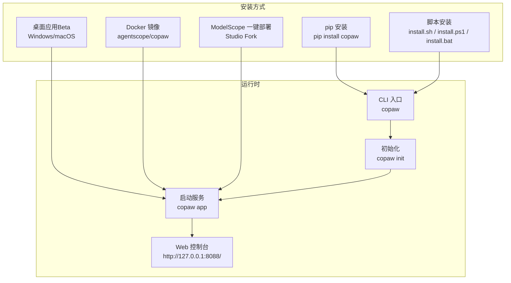
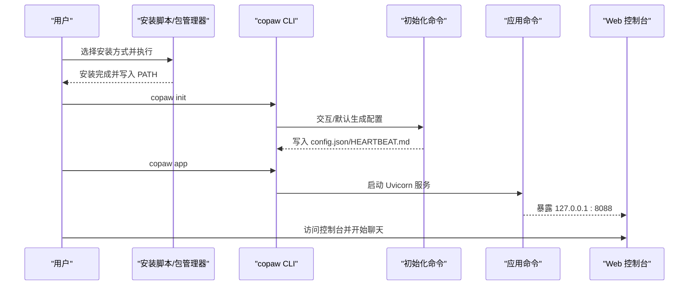
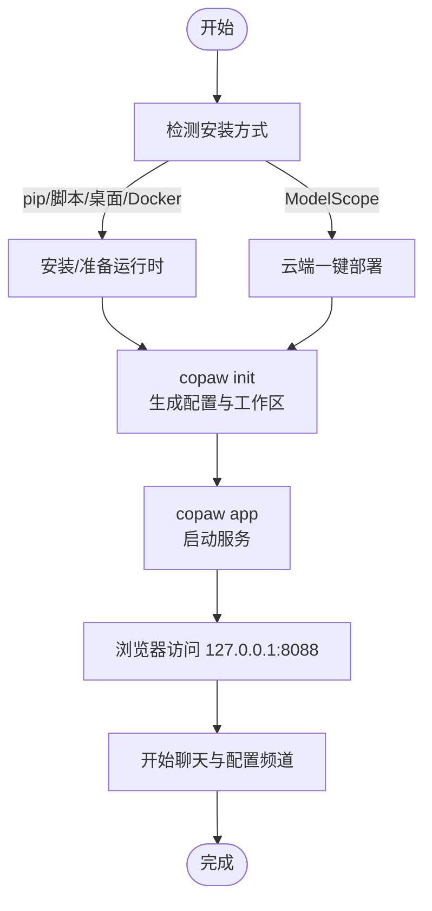

# 快速开始

<cite>
**本文引用的文件**
- [README.md](file://README.md)
- [scripts/README.md](file://scripts/README.md)
- [scripts/pack/README.md](file://scripts/pack/README.md)
- [scripts/install.sh](file://scripts/install.sh)
- [scripts/install.ps1](file://scripts/install.ps1)
- [scripts/install.bat](file://scripts/install.bat)
- [deploy/Dockerfile](file://deploy/Dockerfile)
- [deploy/entrypoint.sh](file://deploy/entrypoint.sh)
- [pyproject.toml](file://pyproject.toml)
- [setup.py](file://setup.py)
- [src/copaw/__main__.py](file://src/copaw/__main__.py)
- [src/copaw/cli/main.py](file://src/copaw/cli/main.py)
- [src/copaw/cli/init_cmd.py](file://src/copaw/cli/init_cmd.py)
- [src/copaw/cli/app_cmd.py](file://src/copaw/cli/app_cmd.py)
- [src/copaw/config/config.py](file://src/copaw/config/config.py)
- [website/public/docs/quickstart.zh.md](file://website/public/docs/quickstart.zh.md)
</cite>

## 目录
1. [简介](#简介)
2. [项目结构](#项目结构)
3. [核心组件](#核心组件)
4. [架构总览](#架构总览)
5. [详细组件分析](#详细组件分析)
6. [依赖分析](#依赖分析)
7. [性能考虑](#性能考虑)
8. [故障排除指南](#故障排除指南)
9. [结论](#结论)
10. [附录](#附录)

## 简介
本指南面向首次接触 CoPaw 的用户，提供多种安装方式与启动步骤，帮助你在最短时间内完成安装、初始化配置、启动服务并访问 Web 控制台，随后进行基础的聊天交互。内容覆盖 pip 安装、脚本安装（macOS/Linux/Windows）、桌面应用（Beta）、Docker 部署以及 ModelScope 一键部署等路径，并对不同操作系统与技术背景的用户给出适用建议。

## 项目结构
CoPaw 的安装与运行涉及多个层次：
- Python 包与 CLI：通过 pip 安装后提供 copaw 命令，入口位于 CLI 主模块与命令子模块。
- 安装脚本：自动检测/安装 uv，创建虚拟环境，安装包与前端资源，写入 PATH。
- 桌面应用：打包为独立应用，内置运行时与浏览器，首启引导初始化。
- 容器化：Docker 多阶段构建，包含前端构建与 Python 应用，提供 supervisord 管理。
- 文档与网站：提供中文快速开始与 CLI/控制台/频道等文档。

图示来源
- [src/copaw/cli/main.py:130-173](file://src/copaw/cli/main.py#L130-L173)
- [src/copaw/cli/init_cmd.py:119-487](file://src/copaw/cli/init_cmd.py#L119-L487)
- [src/copaw/cli/app_cmd.py:15-94](file://src/copaw/cli/app_cmd.py#L15-L94)
- [scripts/install.sh:1-340](file://scripts/install.sh#L1-L340)
- [scripts/install.ps1:1-477](file://scripts/install.ps1#L1-L477)
- [scripts/install.bat:1-557](file://scripts/install.bat#L1-L557)
- [deploy/Dockerfile:1-103](file://deploy/Dockerfile#L1-L103)
- [deploy/entrypoint.sh:1-10](file://deploy/entrypoint.sh#L1-L10)

章节来源
- [README.md:97-321](file://README.md#L97-L321)
- [website/public/docs/quickstart.zh.md:1-247](file://website/public/docs/quickstart.zh.md#L1-L247)

## 核心组件
- CLI 入口与命令分发：定义全局选项（host/port），聚合各子命令（app、init、channels、skills、models、daemon 等）。
- 初始化命令：交互式/默认式生成工作目录、配置文件、技能与 MD 文件，必要时要求安全确认与遥测同意。
- 应用命令：基于 Uvicorn 启动 FastAPI 应用，默认监听 127.0.0.1:8088，支持日志级别与隐藏特定访问路径。
- 安装脚本：统一处理 uv 检测/安装、Python 虚拟环境创建、包安装、前端资源准备与 PATH 注入。
- Docker 镜像：多阶段构建前端与 Python 应用，提供 supervisord 管理与端口暴露。
- 桌面应用：打包为独立应用，内置运行时与浏览器，首启引导初始化。

章节来源
- [src/copaw/cli/main.py:130-173](file://src/copaw/cli/main.py#L130-L173)
- [src/copaw/cli/init_cmd.py:119-487](file://src/copaw/cli/init_cmd.py#L119-L487)
- [src/copaw/cli/app_cmd.py:15-94](file://src/copaw/cli/app_cmd.py#L15-L94)
- [scripts/install.sh:1-340](file://scripts/install.sh#L1-L340)
- [scripts/install.ps1:1-477](file://scripts/install.ps1#L1-L477)
- [scripts/install.bat:1-557](file://scripts/install.bat#L1-L557)
- [deploy/Dockerfile:1-103](file://deploy/Dockerfile#L1-L103)
- [deploy/entrypoint.sh:1-10](file://deploy/entrypoint.sh#L1-L10)

## 架构总览
下图展示从安装到启动的关键流程与组件关系：

图示来源
- [src/copaw/cli/main.py:130-173](file://src/copaw/cli/main.py#L130-L173)
- [src/copaw/cli/init_cmd.py:119-487](file://src/copaw/cli/init_cmd.py#L119-L487)
- [src/copaw/cli/app_cmd.py:15-94](file://src/copaw/cli/app_cmd.py#L15-L94)
- [scripts/install.sh:256-340](file://scripts/install.sh#L256-L340)
- [scripts/install.ps1:333-477](file://scripts/install.ps1#L333-L477)
- [scripts/install.bat:469-557](file://scripts/install.bat#L469-L557)

## 详细组件分析

### 安装方式对比与适用场景
- pip 安装
  - 优点：适合有 Python 环境管理经验的用户，可控性强。
  - 适用：Linux/macOS/Windows 已有 Python 环境；需要精确控制虚拟环境与依赖。
  - 注意事项：确保 Python 版本满足要求；如需本地模型能力，可附加 extras。
- 脚本安装（macOS/Linux/Windows）
  - 优点：自动处理 uv、Python 虚拟环境与前端资源，无需手动配置。
  - 适用：首次体验、快速上手、网络受限环境下优先考虑。
  - 注意事项：Windows LTSC/受限语言模式可能影响 PATH 注入；必要时手动配置。
- 桌面应用（Beta）
  - 优点：零配置、跨平台、自动打开浏览器；适合不熟悉命令行的用户。
  - 适用：Windows 10+/macOS 14+；首次启动可能较慢。
  - 注意事项：macOS 可能出现 Gatekeeper 提示，按指南解除限制。
- Docker 部署
  - 优点：隔离性好、便于迁移与扩展；镜像含前端与运行时。
  - 适用：容器化部署、CI/CD、云环境。
  - 注意事项：容器内 localhost 指向容器自身，连接宿主机服务需 host.docker.internal 或 host 网络。
- ModelScope 一键部署
  - 优点：无需本地安装，直接云端运行。
  - 适用：不想本地配置、需要快速验证。
  - 注意事项：Studio 设为非公开，避免他人控制。

章节来源
- [README.md:97-321](file://README.md#L97-L321)
- [website/public/docs/quickstart.zh.md:1-247](file://website/public/docs/quickstart.zh.md#L1-L247)

### 安装步骤详解

#### pip 安装（推荐给有 Python 环境的用户）
- 安装：pip install copaw
- 初始化：copaw init --defaults 或交互式 copaw init
- 启动：copaw app
- 访问：浏览器打开 http://127.0.0.1:8088/

章节来源
- [README.md:99-109](file://README.md#L99-L109)

#### 脚本安装（macOS/Linux/Windows）
- macOS/Linux：curl -fsSL https://copaw.agentscope.io/install.sh | bash
- Windows（PowerShell）：irm https://copaw.agentscope.io/install.ps1 | iex
- Windows（CMD）：curl -fsSL https://copaw.agentscope.io/install.bat -o install.bat && install.bat
- 选项：--version、--from-source、--extras 等
- 首次运行后新开终端或 source 配置文件以生效 PATH

章节来源
- [README.md:113-178](file://README.md#L113-L178)
- [scripts/install.sh:57-93](file://scripts/install.sh#L57-L93)
- [scripts/install.ps1:17-62](file://scripts/install.ps1#L17-L62)
- [scripts/install.bat:36-74](file://scripts/install.bat#L36-L74)

#### 桌面应用（Beta）
- 下载：GitHub Releases 获取对应系统版本
- 启动：Windows 双击 .exe；macOS 解压后右键“打开”
- 首次启动：等待 10-60 秒初始化与加载依赖
- macOS Gatekeeper：右键“打开”或系统设置中允许

章节来源
- [README.md:228-270](file://README.md#L228-L270)
- [scripts/pack/README.md:61-73](file://scripts/pack/README.md#L61-L73)

#### Docker 部署
- 拉取镜像：agentscope/copaw:latest（或 ACR 镜像）
- 运行：映射端口 8088，挂载工作目录与密钥目录
- 访问：http://127.0.0.1:8088/
- 连接宿主机服务：使用 host.docker.internal 或 host 网络

章节来源
- [README.md:271-313](file://README.md#L271-L313)
- [deploy/Dockerfile:1-103](file://deploy/Dockerfile#L1-L103)
- [deploy/entrypoint.sh:1-10](file://deploy/entrypoint.sh#L1-L10)

#### ModelScope 一键部署
- 在魔搭 Studio Fork 项目，一键配置并运行
- 将 Studio 设为非公开，避免他人控制

章节来源
- [README.md:314-321](file://README.md#L314-L321)

### 初始化配置与启动服务
- 初始化：copaw init 支持 --defaults 与交互式；生成 config.json、HEARTBEAT.md、默认工作区与技能
- 启动：copaw app 默认监听 127.0.0.1:8088；支持 --host/--port/--workers/--log-level/--reload
- 访问：浏览器打开 http://127.0.0.1:8088/ 进入控制台

章节来源
- [src/copaw/cli/init_cmd.py:119-487](file://src/copaw/cli/init_cmd.py#L119-L487)
- [src/copaw/cli/app_cmd.py:15-94](file://src/copaw/cli/app_cmd.py#L15-L94)
- [src/copaw/cli/main.py:130-173](file://src/copaw/cli/main.py#L130-L173)

### 关键流程图：初始化与启动

图示来源
- [src/copaw/cli/init_cmd.py:119-487](file://src/copaw/cli/init_cmd.py#L119-L487)
- [src/copaw/cli/app_cmd.py:15-94](file://src/copaw/cli/app_cmd.py#L15-L94)
- [scripts/install.sh:256-340](file://scripts/install.sh#L256-L340)
- [scripts/install.ps1:333-477](file://scripts/install.ps1#L333-L477)
- [scripts/install.bat:469-557](file://scripts/install.bat#L469-L557)
- [deploy/Dockerfile:1-103](file://deploy/Dockerfile#L1-L103)

## 依赖分析
- Python 版本：要求 3.10 ≤ version < 3.14
- 依赖管理：pyproject.toml 定义核心依赖与可选 extras（llamacpp/mlx/ollama/whisper/full）
- CLI 入口：scripts/click 定义命令组与选项
- 包构建：setup.py 与 setuptools 动态版本与包发现

章节来源
- [pyproject.toml:1-99](file://pyproject.toml#L1-L99)
- [setup.py:1-5](file://setup.py#L1-L5)
- [src/copaw/cli/main.py:130-173](file://src/copaw/cli/main.py#L130-L173)

## 性能考虑
- 首次启动时间：桌面应用与容器化部署可能因环境初始化而较长，属正常现象。
- 日志与访问日志：可通过 --log-level 与隐藏访问路径减少噪声，便于定位问题。
- 多工作进程：生产环境可调整 --workers 数量以提升吞吐。
- 本地模型：根据硬件选择 llama.cpp/MLX/Ollama，平衡性能与隐私。

[本节为通用指导，无需列出具体文件来源]

## 故障排除指南
- Windows LTSC/受限语言模式
  - 现象：脚本无法写入 PATH 或无法自动下载 uv
  - 处理：按提示手动将 uv 与 CoPaw bin 目录加入 PATH，重启终端后重试
- uv 安装失败
  - 现象：脚本提示 uv 未找到或安装失败
  - 处理：手动安装 uv 并将其目录加入 PATH，或使用 Python -m pip install -U uv
- Docker 无法连接宿主机服务
  - 现象：容器内 localhost 指向容器自身
  - 处理：使用 host.docker.internal 或 --network=host
- 首次启动无响应（桌面应用）
  - 现象：双击无窗口，日志位于 ~/.copaw/desktop.log
  - 处理：按文档指引查看日志并按需开启调试模式
- macOS Gatekeeper 阻止
  - 处理：右键“打开”或系统设置中允许

章节来源
- [README.md:149-171](file://README.md#L149-L171)
- [scripts/install.ps1:420-447](file://scripts/install.ps1#L420-L447)
- [README.md:287-310](file://README.md#L287-L310)
- [scripts/pack/README.md:57-58](file://scripts/pack/README.md#L57-L58)

## 结论
通过以上多种安装方式与清晰的初始化/启动流程，你可以在 Windows、macOS、Linux 上快速搭建 CoPaw，并在 127.0.0.1:8088 的 Web 控制台中完成基础聊天与后续配置。如需进一步扩展（频道接入、技能与模型配置），可参考官方文档与 CLI 指南。

[本节为总结性内容，无需列出具体文件来源]

## 附录

### 常用命令速查
- 安装：pip install copaw 或使用 install.sh/install.ps1/install.bat
- 初始化：copaw init --defaults 或交互式 copaw init
- 启动：copaw app（默认 127.0.0.1:8088）
- 卸载：copaw uninstall（可选 --purge 清理数据）

章节来源
- [README.md:99-109](file://README.md#L99-L109)
- [website/public/docs/quickstart.zh.md:105-131](file://website/public/docs/quickstart.zh.md#L105-L131)