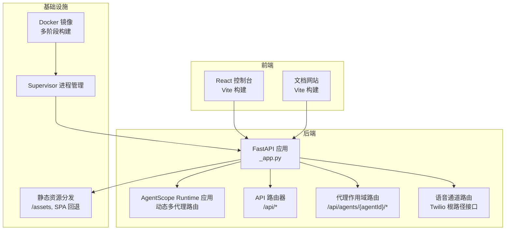
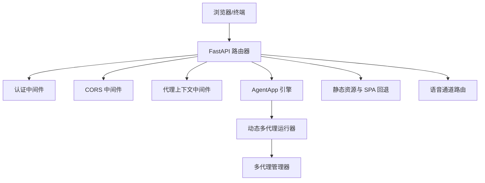
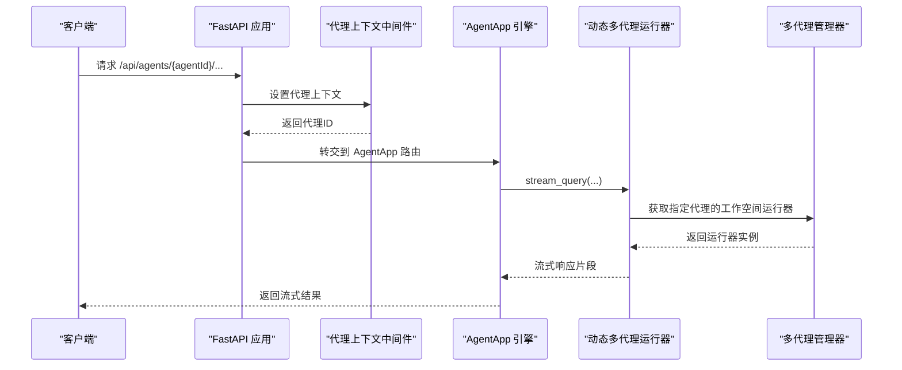
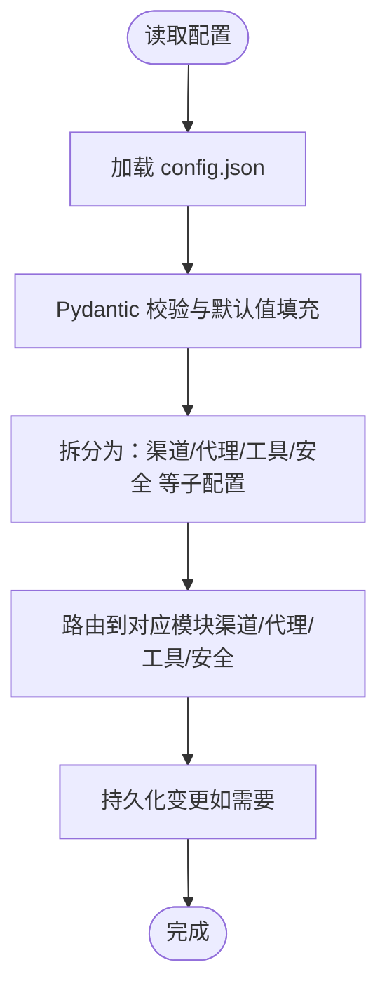
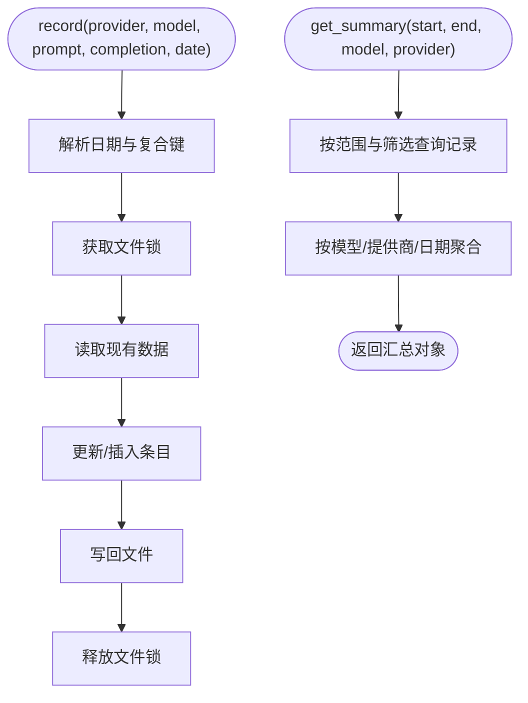
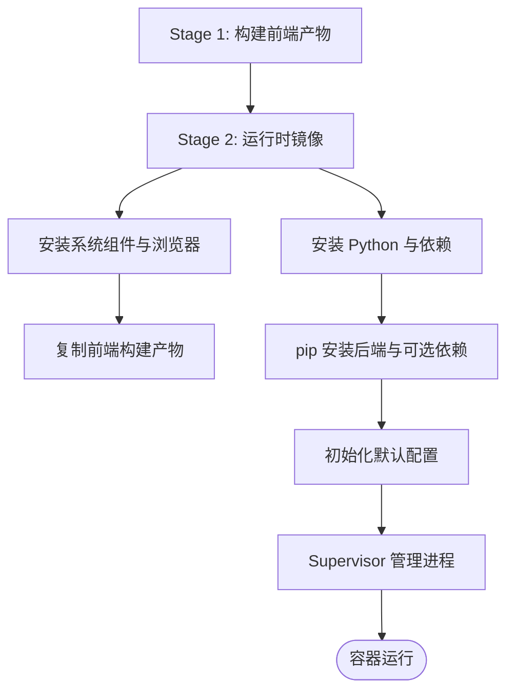
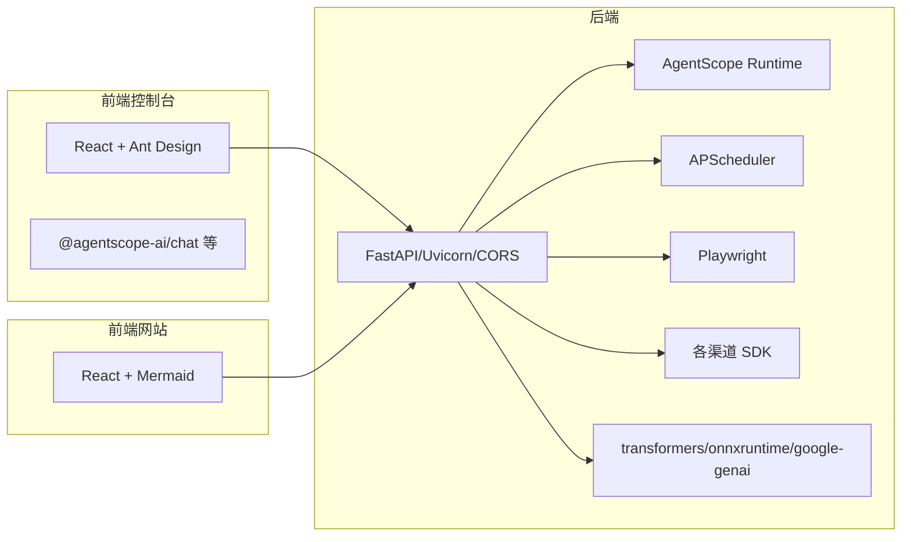

# 技术栈

<cite>
**本文引用的文件**
- [pyproject.toml](file://pyproject.toml)
- [console/package.json](file://console/package.json)
- [website/package.json](file://website/package.json)
- [deploy/Dockerfile](file://deploy/Dockerfile)
- [src/copaw/app/_app.py](file://src/copaw/app/_app.py)
- [src/copaw/config/config.py](file://src/copaw/config/config.py)
- [src/copaw/token_usage/manager.py](file://src/copaw/token_usage/manager.py)
- [src/copaw/utils/telemetry.py](file://src/copaw/utils/telemetry.py)
- [src/copaw/cli/app_cmd.py](file://src/copaw/cli/app_cmd.py)
- [src/copaw/__version__.py](file://src/copaw/__version__.py)
- [scripts/docker_sync_latest.sh](file://scripts/docker_sync_latest.sh)
</cite>

## 目录
1. [引言](#引言)
2. [项目结构](#项目结构)
3. [核心组件](#核心组件)
4. [架构总览](#架构总览)
5. [详细组件分析](#详细组件分析)
6. [依赖分析](#依赖分析)
7. [性能考虑](#性能考虑)
8. [故障排查指南](#故障排查指南)
9. [结论](#结论)
10. [附录](#附录)

## 引言
本文件面向开发者与运维人员，系统梳理 CoPaw 的技术栈构成与协作机制，覆盖后端 Python 技术栈（FastAPI、AgentScope Runtime 等）、前端 React 技术栈、数据库与缓存策略、容器化与部署方案，并给出版本兼容性、最佳实践与学习路径建议，帮助快速掌握项目所需技能。

## 项目结构
CoPaw 采用前后端分离与多语言混合的工程组织方式：
- 后端服务：基于 Python 与 FastAPI，提供统一 API 与多代理运行时能力，集成 AgentScope Runtime。
- 前端控制台：基于 React 与 Vite，提供可视化配置与管理界面。
- 容器化与部署：使用 Docker 多阶段构建，结合 Supervisor 管理进程，支持容器内运行与浏览器自动化。
- 配置与数据：以 JSON 配置为中心，结合本地文件存储与可选向量数据库后端。

图表来源
- [src/copaw/app/_app.py:241-409](file://src/copaw/app/_app.py#L241-L409)
- [deploy/Dockerfile:1-103](file://deploy/Dockerfile#L1-L103)

章节来源
- [src/copaw/app/_app.py:241-409](file://src/copaw/app/_app.py#L241-L409)
- [deploy/Dockerfile:1-103](file://deploy/Dockerfile#L1-L103)

## 核心组件
- 后端框架与运行时
  - FastAPI：提供高性能异步 Web 服务，内置 OpenAPI 文档与中间件生态。
  - AgentScope Runtime：作为应用引擎，承载多代理工作空间与流式对话能力。
- 前端控制台与网站
  - React + Vite：控制台用于代理配置、渠道管理、技能与工具管理；网站用于文档与展示。
- 配置与持久化
  - JSON 配置模型：集中管理渠道、代理、工具、安全策略等。
  - 令牌用量统计：按日期与模型聚合记录提示与补全 token 使用情况。
- 容器化与部署
  - Docker 多阶段构建：前端构建产物注入到后端镜像，安装运行时依赖与系统组件。
  - Supervisor：统一启动与守护后端服务及必要子进程。
- 可观测性
  - 日志与访问日志过滤：减少噪声，聚焦关键路径。
  - 遥测采集：匿名收集安装方式、系统信息与版本，便于生态洞察。

章节来源
- [src/copaw/app/_app.py:1-140](file://src/copaw/app/_app.py#L1-L140)
- [src/copaw/config/config.py:1-120](file://src/copaw/config/config.py#L1-L120)
- [src/copaw/token_usage/manager.py:62-110](file://src/copaw/token_usage/manager.py#L62-L110)
- [src/copaw/utils/telemetry.py:1-60](file://src/copaw/utils/telemetry.py#L1-L60)
- [deploy/Dockerfile:1-103](file://deploy/Dockerfile#L1-L103)

## 架构总览
CoPaw 的整体架构围绕“后端 API + 多代理运行时 + 前端控制台”的模式展开。后端通过 FastAPI 提供统一入口，内部以 AgentScope Runtime 为运行时引擎，动态路由到不同代理的工作空间。前端控制台与网站通过静态资源与 API 路由与后端交互。容器化层负责打包、运行与进程管理。

图表来源
- [src/copaw/app/_app.py:241-343](file://src/copaw/app/_app.py#L241-L343)

章节来源
- [src/copaw/app/_app.py:241-343](file://src/copaw/app/_app.py#L241-L343)

## 详细组件分析

### 后端应用与运行时
- 应用生命周期与中间件
  - 生命周期钩子负责迁移旧版工作区、初始化多代理管理器、注册审批服务等。
  - 中间件链：代理上下文中间件、认证中间件、CORS 中间件，确保跨域与鉴权可控。
- 动态多代理运行器
  - 依据请求头中的代理标识动态选择对应工作空间运行器，实现多代理共享同一后端实例。
- AgentApp 引擎
  - 将运行器包装为 AgentApp，暴露统一的代理相关路由，支持流式查询与处理。

图表来源
- [src/copaw/app/_app.py:48-125](file://src/copaw/app/_app.py#L48-L125)

章节来源
- [src/copaw/app/_app.py:148-239](file://src/copaw/app/_app.py#L148-L239)

### 配置模型与数据流
- 配置模型
  - 渠道配置：涵盖 Discord、钉钉、飞书、QQ、Telegram、MQTT、Console、Matrix、语音、企业微信、小艺等。
  - 代理运行配置：最大迭代次数、token 计数策略、内存压缩阈值、嵌入配置等。
  - 工具与安全：内置工具清单、工具守卫规则、技能扫描器配置。
- 数据流
  - 配置从 JSON 文件加载，经 Pydantic 校验与默认值填充，贯穿运行期的路由、工具调用与安全检查。

图表来源
- [src/copaw/config/config.py:167-185](file://src/copaw/config/config.py#L167-L185)
- [src/copaw/config/config.py:252-353](file://src/copaw/config/config.py#L252-L353)
- [src/copaw/config/config.py:713-727](file://src/copaw/config/config.py#L713-L727)

章节来源
- [src/copaw/config/config.py:1-120](file://src/copaw/config/config.py#L1-L120)
- [src/copaw/config/config.py:167-185](file://src/copaw/config/config.py#L167-L185)
- [src/copaw/config/config.py:252-353](file://src/copaw/config/config.py#L252-L353)
- [src/copaw/config/config.py:713-727](file://src/copaw/config/config.py#L713-L727)

### 令牌用量统计
- 设计要点
  - 基于日期与“提供商+模型”复合键聚合统计，支持按日期范围与筛选条件查询。
  - 使用异步文件锁与 aiofiles 实现并发安全写入，避免竞态。
- 关键流程
  - 记录：累加 prompt_tokens、completion_tokens 与调用次数。
  - 查询：按日期遍历，支持按模型或提供商过滤。
  - 汇总：生成总览与按模型/提供商/日期的明细。

图表来源
- [src/copaw/token_usage/manager.py:110-156](file://src/copaw/token_usage/manager.py#L110-L156)
- [src/copaw/token_usage/manager.py:198-294](file://src/copaw/token_usage/manager.py#L198-L294)

章节来源
- [src/copaw/token_usage/manager.py:62-110](file://src/copaw/token_usage/manager.py#L62-L110)
- [src/copaw/token_usage/manager.py:110-156](file://src/copaw/token_usage/manager.py#L110-L156)
- [src/copaw/token_usage/manager.py:198-294](file://src/copaw/token_usage/manager.py#L198-L294)

### 遥测与日志
- 遥测
  - 收集安装方式、操作系统、架构、GPU 检测等匿名信息，上传至指定端点，并通过标记文件避免重复上报。
- 日志
  - 统一日志格式与级别，对特定访问路径进行过滤，降低噪音。

章节来源
- [src/copaw/utils/telemetry.py:1-60](file://src/copaw/utils/telemetry.py#L1-L60)
- [src/copaw/utils/telemetry.py:163-182](file://src/copaw/utils/telemetry.py#L163-L182)
- [src/copaw/utils/logging.py:104-118](file://src/copaw/utils/logging.py#L104-L118)
- [src/copaw/cli/app_cmd.py:80-84](file://src/copaw/cli/app_cmd.py#L80-L84)

### 容器化与部署
- Docker 多阶段构建
  - 前端构建阶段：使用 Node 基础镜像构建 console 前端产物。
  - 运行时镜像：安装 Python、Chromium、Supervisor 等，复制前端构建产物，pip 安装后端与可选依赖，初始化默认配置。
- 进程管理
  - 通过 Supervisor 管理主进程与子进程，暴露固定端口，支持容器内无沙箱运行的浏览器自动化。
- 发布同步
  - 提供脚本将预发布镜像标签同步为 latest 标签，便于镜像仓库管理。

图表来源
- [deploy/Dockerfile:1-103](file://deploy/Dockerfile#L1-L103)
- [scripts/docker_sync_latest.sh:62-76](file://scripts/docker_sync_latest.sh#L62-L76)

章节来源
- [deploy/Dockerfile:1-103](file://deploy/Dockerfile#L1-L103)
- [scripts/docker_sync_latest.sh:62-76](file://scripts/docker_sync_latest.sh#L62-L76)

## 依赖分析
- 后端依赖（核心）
  - FastAPI 生态：Uvicorn（ASGI 服务器）、CORS 中间件、静态文件服务。
  - 多代理运行时：AgentScope Runtime 引擎。
  - 并发与调度：APScheduler（计划任务）、aiofiles（异步文件操作）。
  - 浏览器自动化：Playwright（系统 Chromium）。
  - 通讯与渠道：discord.py、lark-oapi、python-telegram-bot、twilio、paho-mqtt、wecom-aibot-python-sdk、matrix-nio 等。
  - 模型与推理：transformers、onnxruntime、google-genai、python-dotenv、pyyaml、tzdata 等。
- 前端依赖（控制台）
  - React 生态：react、react-router-dom、antd、@agentscope-ai/chat 等。
  - 开发工具：@vitejs/plugin-react、TypeScript、ESLint、Less 等。
- 前端依赖（网站）
  - React 生态：react、react-router-dom、mermaid、highlight.js 等。
  - 构建工具：Vite、TypeScript 等。

图表来源
- [pyproject.toml:7-36](file://pyproject.toml#L7-L36)
- [console/package.json:18-37](file://console/package.json#L18-L37)
- [website/package.json:12-25](file://website/package.json#L12-L25)

章节来源
- [pyproject.toml:7-36](file://pyproject.toml#L7-L36)
- [console/package.json:18-37](file://console/package.json#L18-L37)
- [website/package.json:12-25](file://website/package.json#L12-L25)

## 性能考虑
- 代理路由与并发
  - 动态多代理运行器通过异步生成器逐片产出流式响应，避免阻塞主线程。
- 文件 I/O 与锁
  - 令牌用量统计使用异步文件锁与 aiofiles，降低磁盘争用风险。
- 日志与访问日志
  - 对高频访问路径进行过滤，减少日志输出与 IO 压力。
- 浏览器自动化
  - 在容器中使用系统 Chromium 并禁用沙箱，平衡可用性与安全性。

章节来源
- [src/copaw/app/_app.py:95-125](file://src/copaw/app/_app.py#L95-L125)
- [src/copaw/token_usage/manager.py:133-155](file://src/copaw/token_usage/manager.py#L133-L155)
- [src/copaw/utils/logging.py:82-101](file://src/copaw/utils/logging.py#L82-L101)
- [deploy/Dockerfile:71-78](file://deploy/Dockerfile#L71-L78)

## 故障排查指南
- 启动与端口
  - 使用 CLI 子命令启动后端服务，支持主机、端口、工作者数量与日志级别配置。
  - 若访问 /console 无法显示，请确认前端构建产物已注入到后端包数据中。
- 日志与可观测性
  - 通过日志中间件过滤高频访问路径，定位异常请求与错误堆栈。
  - 遥测上传失败不会影响启动，但会记录调试信息。
- 容器运行
  - 确认容器内已安装 Chromium 并禁用沙箱；若出现浏览器自动化异常，检查系统字体与窗口系统依赖。
- 配置校验
  - 渠道与代理配置由 Pydantic 校验，字段缺失或类型不符会导致初始化失败，需核对配置文件与默认值。

章节来源
- [src/copaw/cli/app_cmd.py:54-93](file://src/copaw/cli/app_cmd.py#L54-L93)
- [src/copaw/app/_app.py:306-318](file://src/copaw/app/_app.py#L306-L318)
- [src/copaw/utils/telemetry.py:163-182](file://src/copaw/utils/telemetry.py#L163-L182)
- [deploy/Dockerfile:29-78](file://deploy/Dockerfile#L29-L78)
- [src/copaw/config/config.py:28-185](file://src/copaw/config/config.py#L28-L185)

## 结论
CoPaw 的技术栈以 FastAPI 与 AgentScope Runtime 为核心，结合 React 前端与 Docker 容器化方案，形成“多代理、多渠道、可扩展”的个人助理平台。通过清晰的配置模型、并发安全的数据统计与可观测性设计，项目在易用性与稳定性之间取得良好平衡。建议在开发与生产环境中遵循本文的版本兼容性与最佳实践，确保部署与维护的顺畅。

## 附录

### 版本与兼容性
- Python 版本要求：>=3.10,<3.14
- FastAPI 与 Uvicorn：使用现代异步特性与 OpenAPI 文档。
- AgentScope Runtime：与后端应用引擎集成，提供多代理运行时能力。
- 前端 Node 版本：控制台与网站均使用 Vite 与 TypeScript，建议使用 LTS 版本以获得稳定构建体验。

章节来源
- [pyproject.toml:6-14](file://pyproject.toml#L6-L14)
- [console/package.json:1-17](file://console/package.json#L1-L17)
- [website/package.json:1-11](file://website/package.json#L1-L11)

### 开发环境配置与依赖管理
- 后端
  - 使用 setuptools 构建，动态版本号来自包内版本文件。
  - 可选依赖：local（Hugging Face）、llamacpp（llama-cpp-python）、mlx（mlx-lm，仅 macOS）、ollama（ollama）、whisper（openai-whisper）、full（组合可选依赖）。
- 前端
  - 控制台与网站分别维护独立的 package.json，使用 Vite、TypeScript、ESLint、Prettier 等工具链。
- 容器
  - 多阶段构建，先构建前端再安装后端依赖，最终通过 Supervisor 启动服务。

章节来源
- [setup.py:1-5](file://setup.py#L1-L5)
- [src/copaw/__version__.py:1-3](file://src/copaw/__version__.py#L1-L3)
- [pyproject.toml:64-91](file://pyproject.toml#L64-L91)
- [console/package.json:1-17](file://console/package.json#L1-L17)
- [website/package.json:1-11](file://website/package.json#L1-L11)
- [deploy/Dockerfile:1-103](file://deploy/Dockerfile#L1-L103)

### 技术选型最佳实践
- 后端
  - 使用 FastAPI 的 Pydantic 模型进行配置校验，确保运行期一致性。
  - 对高并发场景优先采用异步 I/O 与生成器，避免阻塞。
- 前端
  - 控制台与网站分离构建，减少耦合；统一使用 Vite 与 TypeScript 提升开发效率。
- 容器化
  - 明确区分构建阶段与运行阶段，最小化镜像体积；在容器内启用必要的系统组件与字体。
- 安全与合规
  - 使用工具守卫与技能扫描器降低风险；遥测默认匿名且可关闭。

章节来源
- [src/copaw/config/config.py:797-800](file://src/copaw/config/config.py#L797-L800)
- [src/copaw/utils/telemetry.py:222-241](file://src/copaw/utils/telemetry.py#L222-L241)
- [deploy/Dockerfile:29-78](file://deploy/Dockerfile#L29-L78)

### 学习路径与资源推荐
- 后端
  - FastAPI 官方教程与中间件文档。
  - AgentScope Runtime 文档与示例。
  - Pydantic 模型与配置最佳实践。
- 前端
  - React 官方文档与 Hooks 指南。
  - Vite 与 TypeScript 配置与插件生态。
  - Ant Design 与 @agentscope-ai 组件库。
- 容器化
  - Docker 多阶段构建与 Supervisor 管理。
  - Playwright 在容器中的使用与限制。

[本节为通用学习建议，不直接分析具体文件，故无章节来源]