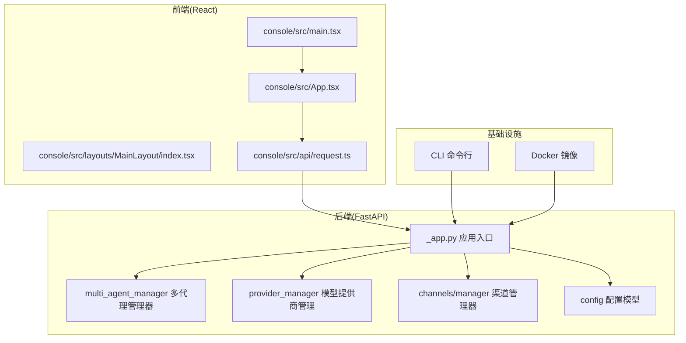
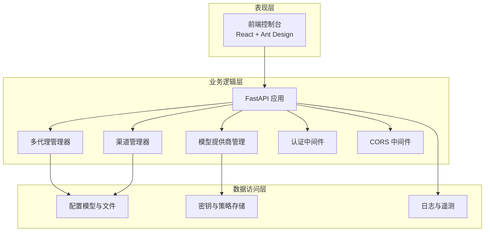
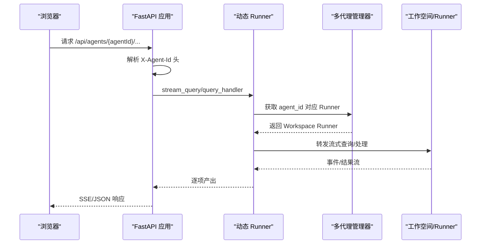
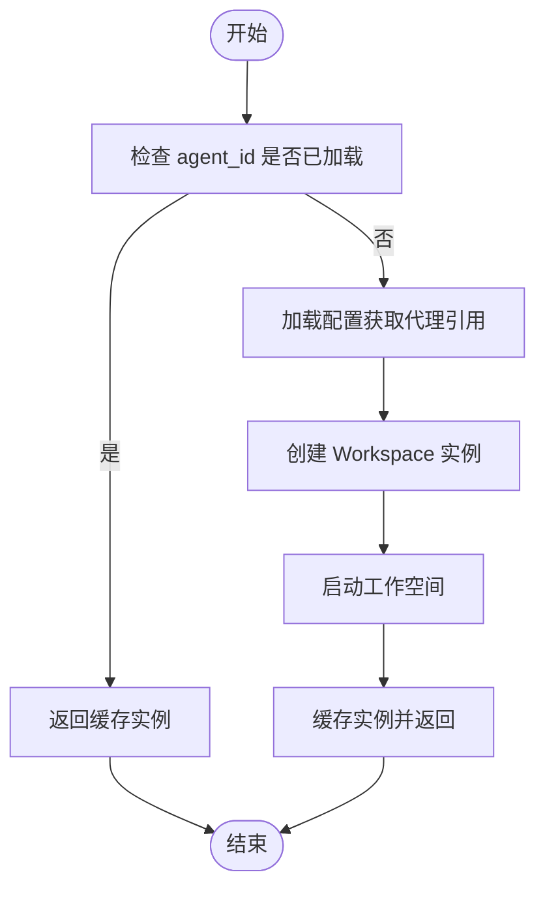
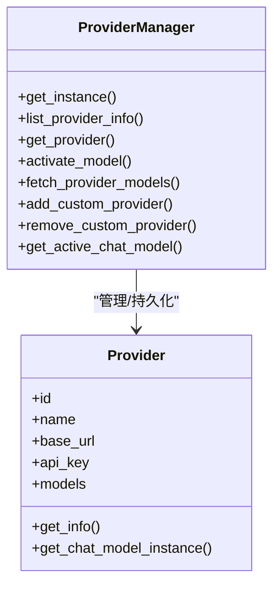
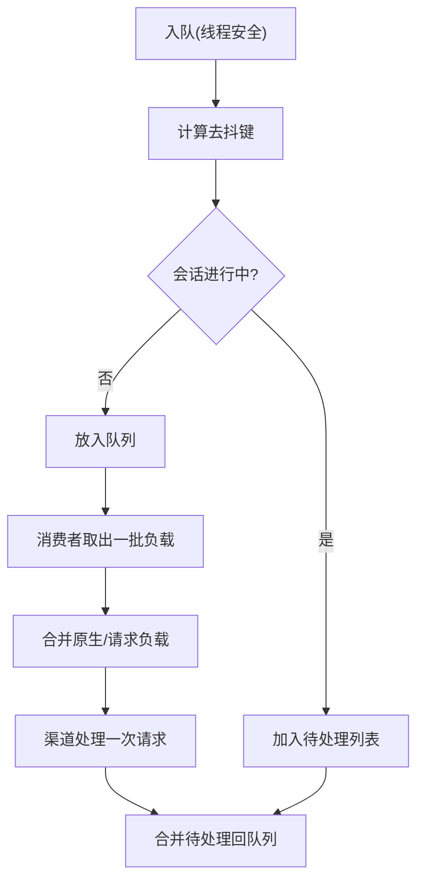
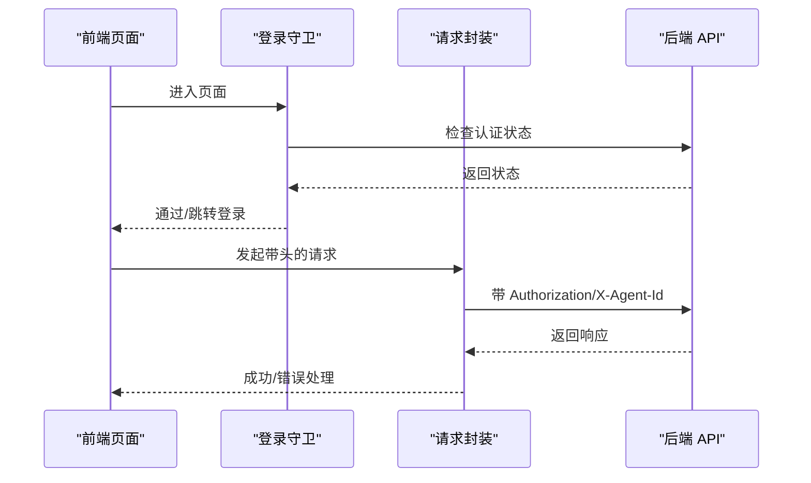
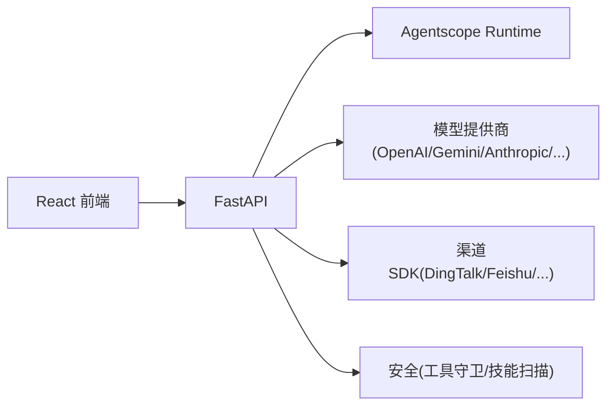

# 架构概览

<cite>
**本文引用的文件**
- [src/copaw/app/_app.py](file://src/copaw/app/_app.py)
- [src/copaw/app/multi_agent_manager.py](file://src/copaw/app/multi_agent_manager.py)
- [src/copaw/providers/provider_manager.py](file://src/copaw/providers/provider_manager.py)
- [src/copaw/app/channels/manager.py](file://src/copaw/app/channels/manager.py)
- [src/copaw/config/config.py](file://src/copaw/config/config.py)
- [src/copaw/cli/main.py](file://src/copaw/cli/main.py)
- [console/src/App.tsx](file://console/src/App.tsx)
- [console/src/main.tsx](file://console/src/main.tsx)
- [console/src/layouts/MainLayout/index.tsx](file://console/src/layouts/MainLayout/index.tsx)
- [console/src/api/request.ts](file://console/src/api/request.ts)
- [pyproject.toml](file://pyproject.toml)
- [README.md](file://README.md)
</cite>

## 目录
1. [引言](#引言)
2. [项目结构](#项目结构)
3. [核心组件](#核心组件)
4. [架构总览](#架构总览)
5. [详细组件分析](#详细组件分析)
6. [依赖分析](#依赖分析)
7. [性能考量](#性能考量)
8. [故障排查指南](#故障排查指南)
9. [结论](#结论)
10. [附录](#附录)

## 引言
本文件面向开发者与架构师，系统性阐述 CoPaw 的整体架构理念与实现方式。CoPaw 采用前后端分离与多代理（多工作空间）架构，结合插件化（渠道、模型提供商、技能）设计，形成“统一后端 + 可扩展前端”的现代化个人智能助理平台。本文从分层架构、核心组件、交互关系、设计模式、可扩展性与性能优化、安全策略等方面进行深入解析，并辅以架构图与时序图，帮助读者快速把握系统全貌。

## 项目结构
CoPaw 采用“Python 后端 + React 前端 + 插件化能力”的混合架构：
- 后端：基于 FastAPI 提供 REST API 与 SSE 流式接口，承载多代理生命周期管理、通道编排、模型路由与安全控制。
- 前端：React + Ant Design，提供聊天、配置、监控与设置界面；通过统一的请求封装与认证头实现与后端通信。
- 配置与运行时：以 Pydantic 模型定义配置结构，支持本地/云端模型、渠道、技能、工具与安全策略的动态加载与热更新。
- 可选安装方式：pip 安装、脚本一键安装、桌面应用、Docker 与云部署，满足不同环境需求。

**图表来源**
- [src/copaw/app/_app.py:241-409](file://src/copaw/app/_app.py#L241-L409)
- [src/copaw/app/multi_agent_manager.py:17-451](file://src/copaw/app/multi_agent_manager.py#L17-L451)
- [src/copaw/providers/provider_manager.py:288-717](file://src/copaw/providers/provider_manager.py#L288-L717)
- [src/copaw/app/channels/manager.py:114-565](file://src/copaw/app/channels/manager.py#L114-L565)
- [src/copaw/config/config.py:1-800](file://src/copaw/config/config.py#L1-L800)
- [console/src/App.tsx:1-171](file://console/src/App.tsx#L1-L171)
- [console/src/main.tsx:1-31](file://console/src/main.tsx#L1-L31)
- [console/src/layouts/MainLayout/index.tsx:1-86](file://console/src/layouts/MainLayout/index.tsx#L1-L86)
- [console/src/api/request.ts:1-81](file://console/src/api/request.ts#L1-L81)

**章节来源**
- [README.md:97-178](file://README.md#L97-L178)
- [pyproject.toml:1-99](file://pyproject.toml#L1-L99)

## 核心组件
- 应用入口与生命周期：FastAPI 应用负责路由注册、中间件装配、静态资源托管与应用生命周期管理。
- 多代理管理器：按需加载与启动代理工作空间，支持零停机热重载与并发任务追踪。
- 模型提供商管理：统一管理内置与自定义提供商，支持本地/云端模型切换与动态发现。
- 渠道管理器：抽象多渠道接入（DingTalk、Feishu、QQ、Discord、Telegram 等），实现消息合并、去抖与并行消费。
- 配置系统：以 Pydantic 模型定义配置结构，涵盖渠道、技能、工具、安全策略与运行参数。
- 前端控制台：路由驱动的单页应用，提供聊天、配置、监控与设置页面，统一处理认证与代理上下文。

**章节来源**
- [src/copaw/app/_app.py:148-239](file://src/copaw/app/_app.py#L148-L239)
- [src/copaw/app/multi_agent_manager.py:17-451](file://src/copaw/app/multi_agent_manager.py#L17-L451)
- [src/copaw/providers/provider_manager.py:288-717](file://src/copaw/providers/provider_manager.py#L288-L717)
- [src/copaw/app/channels/manager.py:114-565](file://src/copaw/app/channels/manager.py#L114-L565)
- [src/copaw/config/config.py:1-800](file://src/copaw/config/config.py#L1-L800)
- [console/src/App.tsx:106-171](file://console/src/App.tsx#L106-L171)

## 架构总览
CoPaw 的整体架构围绕“统一后端 + 多代理 + 插件化能力”展开：
- 分层架构
  - 表现层：React 前端，负责用户交互与可视化。
  - 业务逻辑层：FastAPI 路由与服务，协调多代理、渠道与模型路由。
  - 数据访问层：配置文件、工作区目录、提供商密钥存储与日志。
- 多代理架构
  - 通过“动态 Runner + 代理上下文”实现按代理路由请求，支持零停机热重载与并发隔离。
- 插件化设计
  - 渠道、模型提供商、技能、工具均以插件形式注册与加载，便于扩展与替换。
- 安全与可观测性
  - 认证中间件、工具守卫与技能扫描器、遥测收集与日志分级。

**图表来源**
- [src/copaw/app/_app.py:241-409](file://src/copaw/app/_app.py#L241-L409)
- [src/copaw/app/multi_agent_manager.py:17-451](file://src/copaw/app/multi_agent_manager.py#L17-L451)
- [src/copaw/providers/provider_manager.py:288-717](file://src/copaw/providers/provider_manager.py#L288-L717)
- [src/copaw/app/channels/manager.py:114-565](file://src/copaw/app/channels/manager.py#L114-L565)
- [src/copaw/config/config.py:1-800](file://src/copaw/config/config.py#L1-L800)

## 详细组件分析

### 组件一：应用入口与生命周期（FastAPI）
- 负责：
  - 注册全局中间件（认证、CORS）、静态资源托管与 SPA 回退。
  - 初始化多代理管理器、模型提供商管理器与默认代理的审批服务。
  - 动态 Runner 将请求按代理上下文路由至对应工作空间。
- 关键点：
  - 生命周期钩子中完成迁移、初始化与优雅关停。
  - 支持多代理上下文头（X-Agent-Id）与代理作用域路由。

**图表来源**
- [src/copaw/app/_app.py:48-136](file://src/copaw/app/_app.py#L48-L136)
- [src/copaw/app/_app.py:148-239](file://src/copaw/app/_app.py#L148-L239)
- [src/copaw/app/multi_agent_manager.py:34-82](file://src/copaw/app/multi_agent_manager.py#L34-L82)

**章节来源**
- [src/copaw/app/_app.py:241-409](file://src/copaw/app/_app.py#L241-L409)

### 组件二：多代理管理器（MultiAgentManager）
- 职责：
  - 按需懒加载代理工作空间，启动/停止/重载代理。
  - 实现零停机热重载：新实例预热完成后原子替换旧实例，后台清理旧实例。
  - 并发安全：使用异步锁保证状态一致性。
- 特性：
  - 预加载、并发启动、延迟清理、活跃任务追踪。

**图表来源**
- [src/copaw/app/multi_agent_manager.py:34-82](file://src/copaw/app/multi_agent_manager.py#L34-L82)

**章节来源**
- [src/copaw/app/multi_agent_manager.py:17-451](file://src/copaw/app/multi_agent_manager.py#L17-L451)

### 组件三：模型提供商管理（ProviderManager）
- 职责：
  - 管理内置与自定义提供商，统一暴露列表、信息查询、模型发现与激活。
  - 支持本地模型（llama.cpp、MLX）与云端模型（OpenAI、Gemini、Anthropic 等）。
  - 提供单例访问与活动模型获取。
- 设计要点：
  - 以 JSON 文件持久化提供商配置与活动模型。
  - 运行时根据是否本地模型选择本地或云端 ChatModel 实例。

**图表来源**
- [src/copaw/providers/provider_manager.py:288-717](file://src/copaw/providers/provider_manager.py#L288-L717)

**章节来源**
- [src/copaw/providers/provider_manager.py:1-717](file://src/copaw/providers/provider_manager.py#L1-L717)

### 组件四：渠道管理器（ChannelManager）
- 职责：
  - 统一管理多渠道接入，支持按会话去抖、批量合并与并行消费者。
  - 从环境或配置创建渠道实例，启动/停止与替换渠道。
- 设计要点：
  - 每个渠道一个队列与多个消费者，同一会话串行处理，跨会话并行提升吞吐。
  - 支持原生负载合并与请求合并，降低重复处理。

**图表来源**
- [src/copaw/app/channels/manager.py:42-112](file://src/copaw/app/channels/manager.py#L42-L112)
- [src/copaw/app/channels/manager.py:307-373](file://src/copaw/app/channels/manager.py#L307-L373)

**章节来源**
- [src/copaw/app/channels/manager.py:114-565](file://src/copaw/app/channels/manager.py#L114-L565)

### 组件五：前端控制台与请求封装
- 控制台：
  - 使用 React Router 管理页面路由，主布局包含侧边栏与头部。
  - 登录守卫与主题切换，国际化与语言切换。
- 请求封装：
  - 自动添加 Authorization 与 X-Agent-Id 头，统一错误处理与 401 登出逻辑。
  - 支持文本/JSON 响应与 204 特殊处理。

**图表来源**
- [console/src/App.tsx:45-100](file://console/src/App.tsx#L45-L100)
- [console/src/api/request.ts:39-81](file://console/src/api/request.ts#L39-L81)
- [console/src/layouts/MainLayout/index.tsx:1-86](file://console/src/layouts/MainLayout/index.tsx#L1-L86)

**章节来源**
- [console/src/App.tsx:1-171](file://console/src/App.tsx#L1-L171)
- [console/src/api/request.ts:1-81](file://console/src/api/request.ts#L1-L81)
- [console/src/layouts/MainLayout/index.tsx:1-86](file://console/src/layouts/MainLayout/index.tsx#L1-L86)

### 组件六：配置系统（Pydantic 模型）
- 覆盖范围：
  - 渠道配置（启用开关、策略、媒体目录等）
  - 代理运行参数（最大迭代、记忆压缩阈值、嵌入配置等）
  - MCP 客户端配置（传输类型、命令/URL、环境变量等）
  - 工具与安全策略（工具守卫、技能扫描器白名单等）
- 设计优势：
  - 类型安全与自动校验，支持默认值与向后兼容字段。

**章节来源**
- [src/copaw/config/config.py:1-800](file://src/copaw/config/config.py#L1-L800)

### 组件七：CLI 入口
- 职责：
  - 统一命令入口，按需加载子命令组（应用、频道、聊天、守护、清理、定时任务、环境变量、模型、技能、卸载、桌面、更新、关机、认证）。
  - 记录初始化耗时，便于诊断启动性能问题。

**章节来源**
- [src/copaw/cli/main.py:1-173](file://src/copaw/cli/main.py#L1-L173)

## 依赖分析
- 技术栈选择理由：
  - Python + FastAPI：高性能异步 Web 框架，适合流式接口与并发 IO。
  - React + Ant Design：成熟的前端生态，组件丰富，国际化与主题体系完善。
  - Agentscope/Agentscope Runtime：提供多代理框架与运行时能力，支撑多工作空间与工具链。
  - Playwright、Twilio、MQTT、Matrix 等：覆盖主流渠道与语音能力。
- 外部依赖与集成点：
  - 模型提供商：OpenAI、Gemini、Anthropic、DashScope、ModelScope、Ollama、LM Studio、llama.cpp、MLX。
  - 渠道 SDK：钉钉、飞书、QQ、Discord、Telegram、Mattermost、Matrix、WeCom、XiaoYi、iMessage 等。
  - 安全与合规：工具守卫规则、技能扫描器策略、遥测收集与日志分级。

**图表来源**
- [pyproject.toml:1-99](file://pyproject.toml#L1-L99)
- [src/copaw/app/_app.py:241-409](file://src/copaw/app/_app.py#L241-L409)

**章节来源**
- [pyproject.toml:1-99](file://pyproject.toml#L1-L99)

## 性能考量
- 多代理零停机热重载：新实例预热完成后原子替换，后台清理旧实例，确保服务连续性与低抖动。
- 渠道并行消费：每渠道多消费者并行处理不同会话，减少排队延迟。
- 懒加载与并发启动：仅在首次请求时创建代理实例，启动阶段并发初始化所有代理。
- 流式输出：SSE/流式接口降低首包延迟，提升交互体验。
- 日志与遥测：统一日志级别与文件句柄，遥测仅一次性匿名采集，避免运行期开销。

[本节为通用指导，无需具体文件引用]

## 故障排查指南
- 常见问题定位：
  - 启动慢：查看 CLI 初始化耗时日志，确认依赖加载顺序与磁盘 IO。
  - 多代理重载失败：检查新实例启动异常与旧实例延迟清理任务状态。
  - 渠道消息丢失/乱序：关注去抖键与合并逻辑，确认同一会话串行处理。
  - 认证失败：检查前端请求头是否携带 Authorization 与 X-Agent-Id，后端认证中间件是否生效。
- 排查建议：
  - 开启调试日志，复现问题并核对关键路径日志。
  - 使用 CLI 子命令验证模型/技能/频道配置。
  - 检查配置文件与工作区目录权限与完整性。

**章节来源**
- [src/copaw/cli/main.py:124-128](file://src/copaw/cli/main.py#L124-L128)
- [src/copaw/app/multi_agent_manager.py:200-311](file://src/copaw/app/multi_agent_manager.py#L200-L311)
- [src/copaw/app/channels/manager.py:307-373](file://src/copaw/app/channels/manager.py#L307-L373)
- [console/src/api/request.ts:52-68](file://console/src/api/request.ts#L52-L68)

## 结论
CoPaw 通过“前后端分离 + 多代理 + 插件化”的架构设计，在保证易用性的同时实现了高度可扩展与可维护性。其以 FastAPI 为核心的服务层、以 Agentscope 为内核的多代理运行时、以 Pydantic 为契约的配置系统，以及以 React 为主的前端控制台，共同构成了一个可演进、可治理、可安全可控的个人智能助理平台。未来可在多代理隔离、多模型协同、安全沙箱与云原生集成方面持续增强。

[本节为总结性内容，无需具体文件引用]

## 附录
- 快速启动与安装参考：[README 快速开始:97-178](file://README.md#L97-L178)
- 技术栈与可选依赖：[pyproject 依赖清单:1-99](file://pyproject.toml#L1-L99)
- 前端入口与路由：[console 入口与布局:1-31](file://console/src/main.tsx#L1-L31), [console 路由与布局:1-86](file://console/src/layouts/MainLayout/index.tsx#L1-L86)