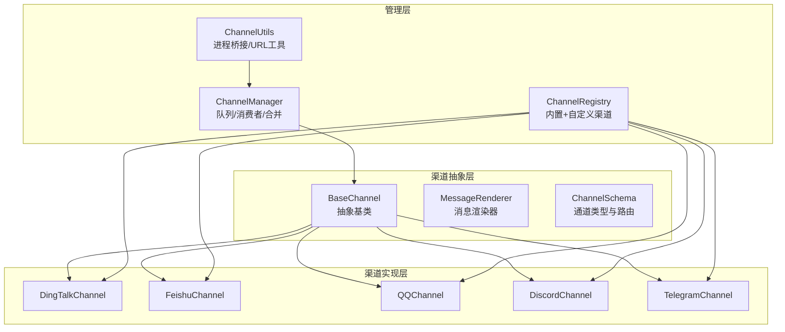
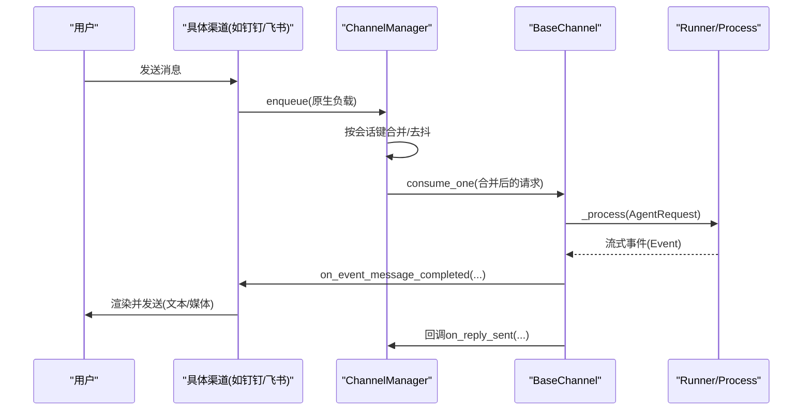
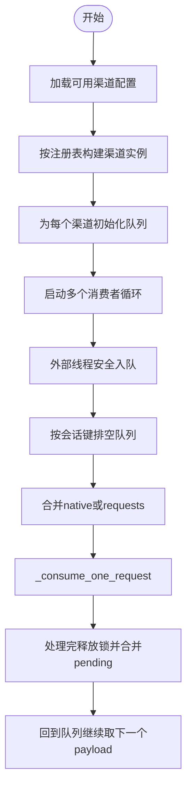
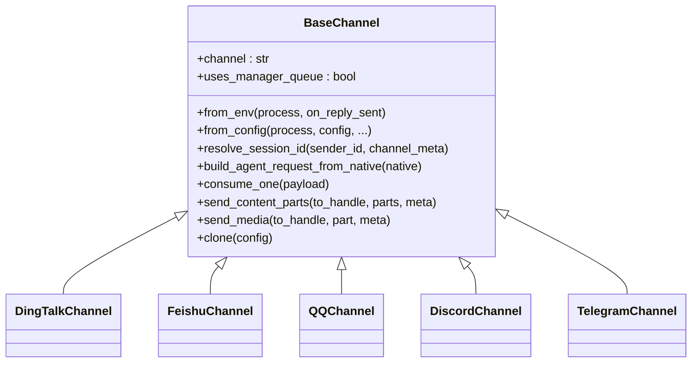
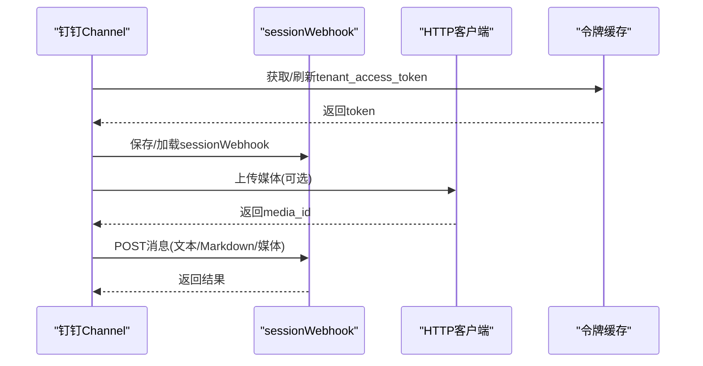
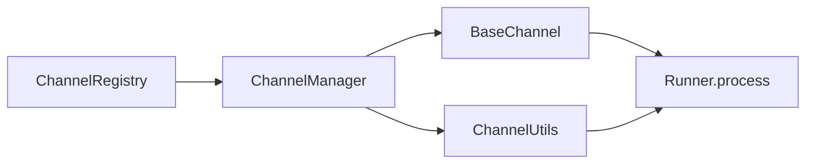

# 多渠道聊天支持

<cite>
**本文档引用的文件**
- [base.py](file://src/copaw/app/channels/base.py)
- [manager.py](file://src/copaw/app/channels/manager.py)
- [registry.py](file://src/copaw/app/channels/registry.py)
- [schema.py](file://src/copaw/app/channels/schema.py)
- [utils.py](file://src/copaw/app/channels/utils.py)
- [dingtalk/channel.py](file://src/copaw/app/channels/dingtalk/channel.py)
- [feishu/channel.py](file://src/copaw/app/channels/feishu/channel.py)
- [qq/channel.py](file://src/copaw/app/channels/qq/channel.py)
- [discord_/channel.py](file://src/copaw/app/channels/discord_/channel.py)
- [telegram/channel.py](file://src/copaw/app/channels/telegram/channel.py)
</cite>

## 目录
1. [简介](#简介)
2. [项目结构](#项目结构)
3. [核心组件](#核心组件)
4. [架构总览](#架构总览)
5. [详细组件分析](#详细组件分析)
6. [依赖分析](#依赖分析)
7. [性能考虑](#性能考虑)
8. [故障排除指南](#故障排除指南)
9. [结论](#结论)
10. [附录](#附录)

## 简介
本文件面向CoPaw的多渠道聊天支持能力，系统性阐述渠道管理器的架构与动态注册机制，解析ChannelManager类的实现原理、渠道适配器的抽象基类设计，以及钉钉、飞书、QQ、Discord、Telegram等主流平台的集成实现细节与适配策略。文档同时覆盖渠道认证机制、消息路由算法、状态管理与错误处理，并提供最佳实践、性能优化建议与故障排除指南，最后给出新增渠道的扩展步骤。

## 项目结构
CoPaw的多渠道聊天子系统位于src/copaw/app/channels目录下，采用“抽象基类 + 渠道实现 + 管理器 + 注册表”的分层设计：
- 抽象基类：统一消息格式、渲染器、去抖与合并策略、发送接口等
- 渠道实现：各平台独立模块，负责接入协议、鉴权、消息解析与发送
- 管理器：统一队列、消费者、会话合并、事件派发
- 注册表：内置渠道清单与自定义渠道发现
- 工具与模式：进程桥接、消息转换协议、通用工具函数

图示来源
- [base.py:69-800](file://src/copaw/app/channels/base.py#L69-L800)
- [manager.py:114-565](file://src/copaw/app/channels/manager.py#L114-L565)
- [registry.py:19-137](file://src/copaw/app/channels/registry.py#L19-L137)
- [schema.py:12-71](file://src/copaw/app/channels/schema.py#L12-L71)
- [utils.py:58-71](file://src/copaw/app/channels/utils.py#L58-L71)

章节来源
- [base.py:69-800](file://src/copaw/app/channels/base.py#L69-L800)
- [manager.py:114-565](file://src/copaw/app/channels/manager.py#L114-L565)
- [registry.py:19-137](file://src/copaw/app/channels/registry.py#L19-L137)
- [schema.py:12-71](file://src/copaw/app/channels/schema.py#L12-L71)
- [utils.py:58-71](file://src/copaw/app/channels/utils.py#L58-L71)

## 核心组件
- 抽象基类BaseChannel
  - 统一消息内容类型（文本、图片、视频、音频、文件、拒绝）与渲染器
  - 去抖与同会话合并策略，支持时间窗口合并与无文本缓冲
  - 会话ID解析、目标句柄映射、响应发送与媒体附件发送
  - 允许/拒绝策略、@提及策略、错误回调与回复完成回调
- 渠道管理器ChannelManager
  - 每个渠道一个队列与多个消费者，按会话键合并批量处理
  - 动态替换渠道实例、线程安全入队、生命周期管理
  - 统一事件派发与文本发送接口
- 渠道注册表ChannelRegistry
  - 内置渠道清单与必需渠道校验
  - 自定义渠道扫描与缓存
- 渠道模式与工具
  - ChannelAddress统一路由标识
  - 进程桥接make_process_from_runner
  - file_url本地路径转换工具

章节来源
- [base.py:69-800](file://src/copaw/app/channels/base.py#L69-L800)
- [manager.py:114-565](file://src/copaw/app/channels/manager.py#L114-L565)
- [registry.py:19-137](file://src/copaw/app/channels/registry.py#L19-L137)
- [schema.py:12-71](file://src/copaw/app/channels/schema.py#L12-L71)
- [utils.py:58-71](file://src/copaw/app/channels/utils.py#L58-L71)

## 架构总览
整体流程：各渠道通过各自的SDK或API接收消息，转换为统一的AgentRequest，交由ChannelManager进行队列化与合并，再经BaseChannel的处理链路调用运行时进程，最终将响应内容渲染并发送回对应渠道。

图示来源
- [manager.py:307-378](file://src/copaw/app/channels/manager.py#L307-L378)
- [base.py:443-583](file://src/copaw/app/channels/base.py#L443-L583)

章节来源
- [manager.py:307-378](file://src/copaw/app/channels/manager.py#L307-L378)
- [base.py:443-583](file://src/copaw/app/channels/base.py#L443-L583)

## 详细组件分析

### 渠道管理器ChannelManager
- 动态注册与初始化
  - 支持从环境变量与配置文件两种方式创建渠道实例
  - 通过注册表获取渠道类，过滤可用渠道并按配置构造
- 队列与消费者
  - 每个渠道维护独立队列与固定数量的消费者
  - 同一会话键在处理期间被锁定，避免跨worker拆分导致的顺序问题
- 批量合并与去抖
  - native负载按去抖键合并，requests按输入内容拼接
  - 合并后统一走_channel._consume_one_request
- 替换与停止
  - 支持在运行中替换指定渠道实例，保证平滑过渡
  - 停止时取消任务、清空状态并关闭渠道

图示来源
- [manager.py:135-411](file://src/copaw/app/channels/manager.py#L135-L411)

章节来源
- [manager.py:114-565](file://src/copaw/app/channels/manager.py#L114-L565)

### 渠道注册表ChannelRegistry
- 内置渠道清单：imessage、discord、dingtalk、feishu、qq、telegram、mattermost、mqtt、console、matrix、voice、wecom、xiaoyi
- 必需渠道：console
- 自定义渠道：扫描CUSTOM_CHANNELS_DIR下的Python文件或包，动态导入继承自BaseChannel的类

章节来源
- [registry.py:19-137](file://src/copaw/app/channels/registry.py#L19-L137)

### 抽象基类BaseChannel
- 会话与去抖
  - get_debounce_key基于session_id或会话元信息生成
  - _apply_no_text_debounce对纯媒体消息立即放行，避免无文本阻塞
- 请求构建与发送
  - build_agent_request_from_user_content统一构建AgentRequest
  - send_content_parts默认将媒体作为文本占位附加，可重写send_media实现真实附件发送
- 生命周期钩子
  - _before_consume_process用于保存接收ID等上下文
  - on_event_message_completed默认逐条发送，部分渠道可覆盖为批量发送
- 错误处理
  - _on_consume_error统一兜底发送错误文本
  - _get_response_error_message提取运行时错误

图示来源
- [base.py:69-800](file://src/copaw/app/channels/base.py#L69-L800)
- [dingtalk/channel.py:81-251](file://src/copaw/app/channels/dingtalk/channel.py#L81-L251)
- [feishu/channel.py:145-291](file://src/copaw/app/channels/feishu/channel.py#L145-L291)
- [qq/channel.py:503-659](file://src/copaw/app/channels/qq/channel.py#L503-L659)
- [discord_/channel.py:39-120](file://src/copaw/app/channels/discord_/channel.py#L39-L120)
- [telegram/channel.py:264-334](file://src/copaw/app/channels/telegram/channel.py#L264-L334)

章节来源
- [base.py:69-800](file://src/copaw/app/channels/base.py#L69-L800)

### 钉钉(DingTalk)集成
- 接入方式：Stream回调 + sessionWebhook长连接
- 会话与去抖：禁用时间去抖，由管理器合并；session_id短ID便于定时任务查找
- 令牌与媒体：访问令牌缓存与刷新；媒体上传使用Open API
- 去重与批回复：消息ID集合去重；支持早期ACK与批回复Future
- 存储：内存+磁盘持久化sessionWebhook映射，重启后恢复

图示来源
- [dingtalk/channel.py:596-777](file://src/copaw/app/channels/dingtalk/channel.py#L596-L777)

章节来源
- [dingtalk/channel.py:81-800](file://src/copaw/app/channels/dingtalk/channel.py#L81-L800)

### 飞书(Feishu)集成
- 接入方式：WebSocket接收事件，Open API发送消息
- 会话：群聊以chat_id短ID，私聊以open_id短ID；存储receive_id与receive_id_type
- 去重：维护消息ID环形缓存，超限淘汰
- 用户名：通过Contact API异步拉取昵称，带缓存
- 文档与媒体：Post富文本解析，图片/文件下载到本地后转为本地URL

章节来源
- [feishu/channel.py:145-800](file://src/copaw/app/channels/feishu/channel.py#L145-L800)

### QQ集成
- 接入方式：WebSocket接收事件，HTTP API发送消息
- 会话：区分C2C/群/Guild，消息类型映射到meta字段
- 去重与心跳：心跳控制器与断线重连；消息序列号与快速断线计数
- 令牌：应用级令牌获取与缓存
- 发送回退：Markdown失败回退纯文本；URL内容移除回退
- 媒体：富媒体上传与消息发送

章节来源
- [qq/channel.py:503-800](file://src/copaw/app/channels/qq/channel.py#L503-L800)

### Discord集成
- 接入方式：discord.py客户端，监听on_message事件
- 会话：按频道或私聊ID生成session_id
- 文本分片：超过长度限制自动按换行切分，保持代码块闭合
- 媒体：支持图片/视频/音频/文件作为附件发送
- 认证：通过Bot Token初始化客户端

章节来源
- [discord_/channel.py:39-573](file://src/copaw/app/channels/discord_/channel.py#L39-L573)

### Telegram集成
- 接入方式：python-telegram-bot轮询，支持代理
- 会话：以chat_id为session_id，支持话题线程
- 文本分片：按最大长度切分，优先在换行/空格处截断
- 媒体：支持图片/视频/音频/文档，自动下载到本地并上传
- 输入提示：可选显示typing输入提示，定时发送chat_action

章节来源
- [telegram/channel.py:264-800](file://src/copaw/app/channels/telegram/channel.py#L264-L800)

## 依赖分析
- 渠道到管理器
  - 渠道通过set_enqueue注入入队回调，管理器统一调度
- 渠道到运行时
  - 通过make_process_from_runner桥接runner.stream_query为统一ProcessHandler
- 渠道到平台SDK
  - 各渠道自行管理SDK初始化与生命周期（如Discord、Telegram）
- 注册表到渠道
  - 注册表提供渠道类字典，管理器按可用列表实例化

图示来源
- [registry.py:132-137](file://src/copaw/app/channels/registry.py#L132-L137)
- [manager.py:135-247](file://src/copaw/app/channels/manager.py#L135-L247)
- [utils.py:58-71](file://src/copaw/app/channels/utils.py#L58-L71)

章节来源
- [registry.py:132-137](file://src/copaw/app/channels/registry.py#L132-L137)
- [manager.py:135-247](file://src/copaw/app/channels/manager.py#L135-L247)
- [utils.py:58-71](file://src/copaw/app/channels/utils.py#L58-L71)

## 性能考虑
- 去抖与合并
  - 对native负载按去抖键合并，减少重复请求与平台限流
  - 无文本消息缓冲，避免空消息风暴
- 并发与锁
  - 每个会话键持有独享锁，确保同一会话内消息顺序与不拆分
  - 多消费者并发处理不同会话，提升吞吐
- 媒体处理
  - 下载到本地后再上传，避免平台直传失败
  - 限制媒体大小与速率，必要时回退为文本提示
- 超时与重试
  - 各渠道设置合理的超时与重试策略，避免阻塞主循环

## 故障排除指南
- 渠道未启用或初始化失败
  - 检查环境变量或配置项是否正确
  - 查看注册表日志，确认渠道类是否成功导入
- 消息未送达或重复
  - 核对去重逻辑（如钉钉消息ID、飞书消息ID缓存）
  - 检查会话键生成是否一致（短ID策略）
- 媒体发送失败
  - 检查文件URL解析与本地路径转换
  - 关注平台限额（如Telegram 50MB、QQ富媒体）
- 认证失败
  - 重新获取令牌并检查过期时间
  - 核对权限范围与scope
- 代理与网络
  - 确认HTTP代理配置与认证
  - 观察重连与退避策略

章节来源
- [dingtalk/channel.py:596-777](file://src/copaw/app/channels/dingtalk/channel.py#L596-L777)
- [feishu/channel.py:447-583](file://src/copaw/app/channels/feishu/channel.py#L447-L583)
- [qq/channel.py:585-620](file://src/copaw/app/channels/qq/channel.py#L585-L620)
- [telegram/channel.py:652-800](file://src/copaw/app/channels/telegram/channel.py#L652-L800)
- [discord_/channel.py:369-517](file://src/copaw/app/channels/discord_/channel.py#L369-L517)

## 结论
CoPaw的多渠道聊天支持通过抽象基类与管理器实现了高内聚、低耦合的架构：渠道仅关注平台差异，统一由管理器协调队列、合并与消费；注册表与配置驱动渠道的动态加载与替换。该设计既保证了扩展性（新增渠道只需实现基类方法），也兼顾了稳定性（统一的去抖、合并、错误处理与生命周期管理）。结合各平台的认证、路由与媒体策略，系统可在复杂场景下保持高性能与高可用。

## 附录

### 渠道认证机制
- 钉钉：client_id/client_secret换取access_token，定时刷新
- 飞书：内部应用token获取与缓存，机器人open_id查询
- QQ：应用级access_token获取与缓存
- Discord：Bot Token初始化客户端
- Telegram：Bot Token初始化应用

章节来源
- [dingtalk/channel.py:596-777](file://src/copaw/app/channels/dingtalk/channel.py#L596-L777)
- [feishu/channel.py:398-462](file://src/copaw/app/channels/feishu/channel.py#L398-L462)
- [qq/channel.py:585-620](file://src/copaw/app/channels/qq/channel.py#L585-L620)
- [discord_/channel.py:96-100](file://src/copaw/app/channels/discord_/channel.py#L96-L100)
- [telegram/channel.py:335-360](file://src/copaw/app/channels/telegram/channel.py#L335-L360)

### 消息路由算法
- 会话ID解析：各渠道根据sender_id与meta生成稳定短ID，便于定时任务查找
- 目标句柄映射：to_handle_from_target将user_id/session_id映射为平台特定的收件人标识
- 路由解析：_route_from_handle将句柄字符串解析为平台参数（如chat_id/open_id/webhook）

章节来源
- [base.py:416-435](file://src/copaw/app/channels/base.py#L416-L435)
- [dingtalk/channel.py:293-314](file://src/copaw/app/channels/dingtalk/channel.py#L293-L314)
- [feishu/channel.py:369-396](file://src/copaw/app/channels/feishu/channel.py#L369-L396)
- [discord_/channel.py:286-303](file://src/copaw/app/channels/discord_/channel.py#L286-L303)
- [telegram/channel.py:597-628](file://src/copaw/app/channels/telegram/channel.py#L597-L628)

### 状态管理与错误处理
- 状态：会话进行中集合、pending队列、去重集合、令牌缓存、媒体目录
- 错误：统一错误提取与兜底发送，平台特定异常分类处理（如Telegram文件过大、QQ URL限制）

章节来源
- [manager.py:125-133](file://src/copaw/app/channels/manager.py#L125-L133)
- [base.py:584-646](file://src/copaw/app/channels/base.py#L584-L646)
- [telegram/channel.py:716-767](file://src/copaw/app/channels/telegram/channel.py#L716-L767)
- [qq/channel.py:226-270](file://src/copaw/app/channels/qq/channel.py#L226-L270)

### 最佳实践
- 配置优先：通过配置文件集中管理渠道开关、策略与媒体目录
- 去抖与合并：合理设置去抖秒数，避免平台限流与重复消息
- 媒体策略：统一本地缓存与上传，控制文件大小与类型
- 安全：严格白名单与@提及策略，避免未授权访问
- 可观测：记录关键事件（去重命中、合并次数、错误码），便于排障

### 性能优化建议
- 合理设置消费者数量与队列容量，避免内存压力
- 使用会话级锁避免跨worker拆分，减少重复处理
- 媒体下载与上传分离，避免阻塞消息处理
- 令牌预热与提前刷新，降低首次调用延迟

### 新增渠道扩展步骤
- 实现类
  - 继承BaseChannel，实现from_env/from_config/build_agent_request_from_native/consume_one等
  - 如需平台特定发送，重写send_content_parts/send_media
- 注册
  - 在注册表中添加渠道键与类映射（或放置于自定义目录）
- 配置
  - 在配置文件中启用新渠道并填写必要参数
- 验证
  - 启动后观察日志，验证入队、合并、发送与错误处理链路

章节来源
- [registry.py:19-137](file://src/copaw/app/channels/registry.py#L19-L137)
- [base.py:317-339](file://src/copaw/app/channels/base.py#L317-L339)
- [manager.py:135-247](file://src/copaw/app/channels/manager.py#L135-L247)