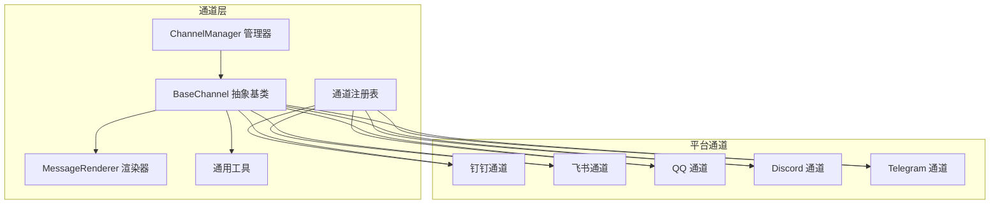
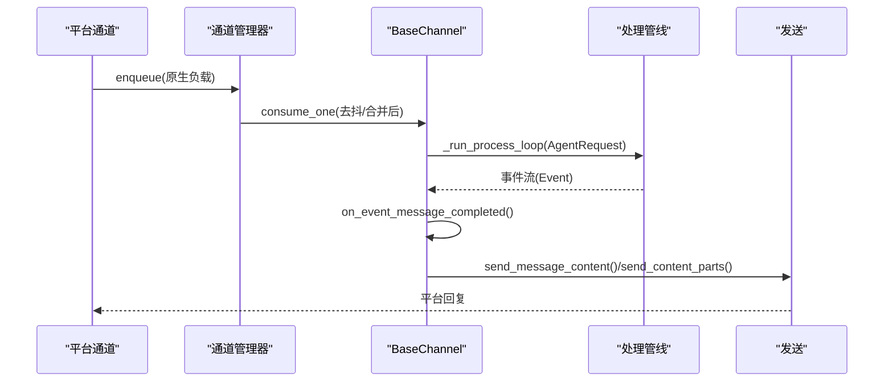
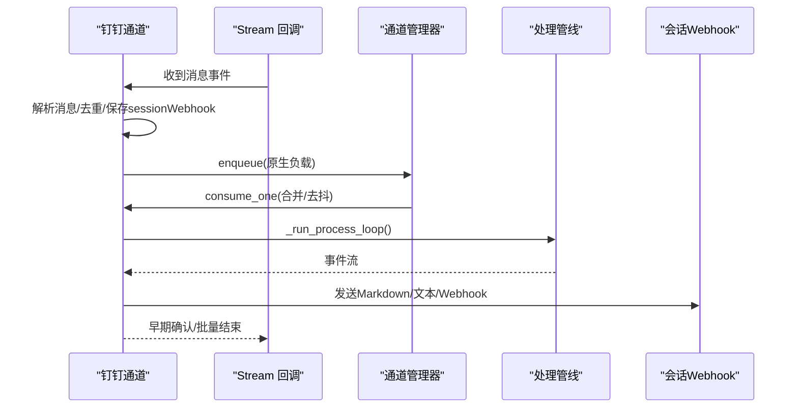
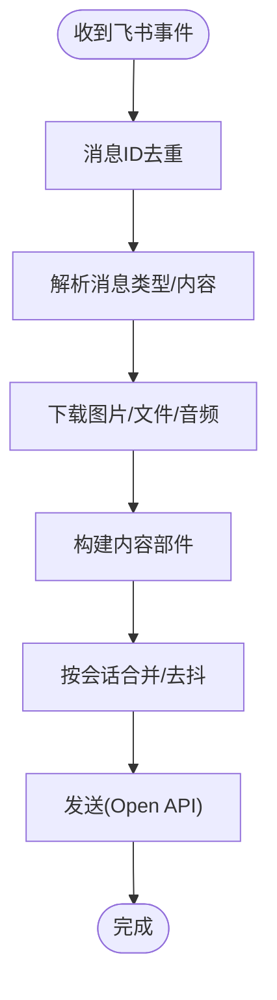
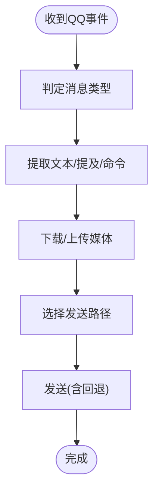
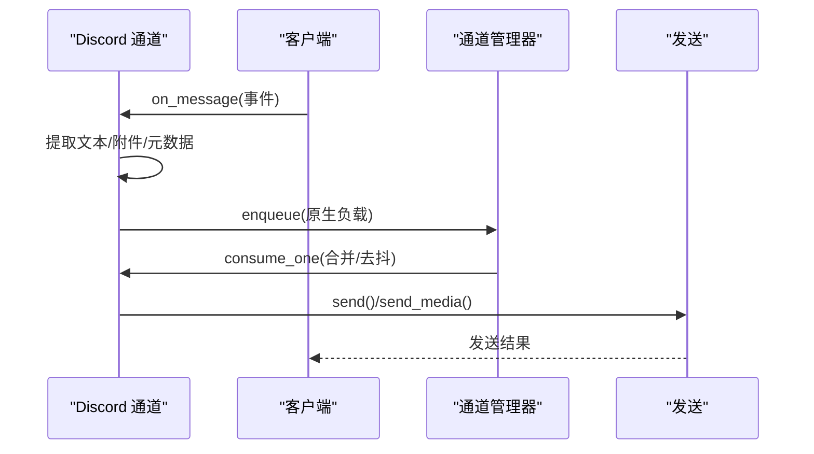
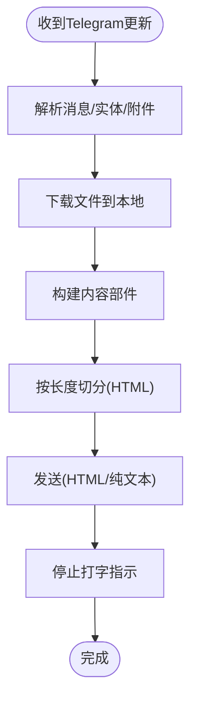
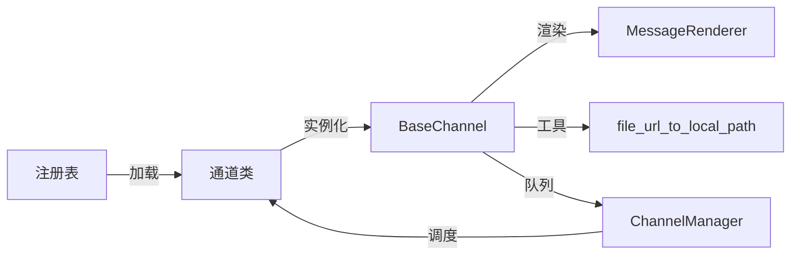

# 平台集成实现

<cite>
**本文档引用的文件**
- [src/copaw/app/channels/base.py](file://src/copaw/app/channels/base.py)
- [src/copaw/app/channels/manager.py](file://src/copaw/app/channels/manager.py)
- [src/copaw/app/channels/registry.py](file://src/copaw/app/channels/registry.py)
- [src/copaw/app/channels/utils.py](file://src/copaw/app/channels/utils.py)
- [src/copaw/app/channels/renderer.py](file://src/copaw/app/channels/renderer.py)
- [src/copaw/app/channels/dingtalk/channel.py](file://src/copaw/app/channels/dingtalk/channel.py)
- [src/copaw/app/channels/feishu/channel.py](file://src/copaw/app/channels/feishu/channel.py)
- [src/copaw/app/channels/qq/channel.py](file://src/copaw/app/channels/qq/channel.py)
- [src/copaw/app/channels/discord_/channel.py](file://src/copaw/app/channels/discord_/channel.py)
- [src/copaw/app/channels/telegram/channel.py](file://src/copaw/app/channels/telegram/channel.py)
</cite>

## 目录
1. [简介](#简介)
2. [项目结构](#项目结构)
3. [核心组件](#核心组件)
4. [架构总览](#架构总览)
5. [详细组件分析](#详细组件分析)
6. [依赖分析](#依赖分析)
7. [性能考虑](#性能考虑)
8. [故障排除指南](#故障排除指南)
9. [结论](#结论)
10. [附录](#附录)

## 简介
本文件系统性梳理 CoPaw 的多聊天平台集成实现，覆盖钉钉、飞书、QQ、Discord、Telegram 等主流平台。文档从架构设计、数据流、消息处理、富文本与多媒体渲染、认证与会话管理、差异化适配策略、性能优化与错误恢复等方面进行深入解析，并提供配置最佳实践、调试技巧与故障排除指南。

## 项目结构
CoPaw 的通道（Channel）体系以统一的抽象基类为核心，通过注册表加载内置与自定义通道，由通道管理器集中调度。各平台通道在统一框架下实现各自的接收、解析、认证、回复与媒体处理逻辑。

**图表来源**
- [src/copaw/app/channels/base.py:69-125](file://src/copaw/app/channels/base.py#L69-L125)
- [src/copaw/app/channels/manager.py:114-170](file://src/copaw/app/channels/manager.py#L114-L170)
- [src/copaw/app/channels/registry.py:19-33](file://src/copaw/app/channels/registry.py#L19-L33)
- [src/copaw/app/channels/renderer.py:78-86](file://src/copaw/app/channels/renderer.py#L78-L86)
- [src/copaw/app/channels/utils.py:58-71](file://src/copaw/app/channels/utils.py#L58-L71)

**章节来源**
- [src/copaw/app/channels/base.py:69-125](file://src/copaw/app/channels/base.py#L69-L125)
- [src/copaw/app/channels/manager.py:114-170](file://src/copaw/app/channels/manager.py#L114-L170)
- [src/copaw/app/channels/registry.py:19-33](file://src/copaw/app/channels/registry.py#L19-L33)

## 核心组件
- 统一抽象基类：定义通道通用接口、去抖动合并、消息渲染、发送策略与错误处理钩子。
- 通道管理器：负责队列化、批处理、同会话合并、并发消费者工作线程与生命周期管理。
- 渲染器：将运行时消息转换为可发送的内容部件（文本/图片/音频/视频/文件），支持工具调用与思维内容过滤。
- 通用工具：文件 URL 解析、进程工厂等。

关键职责与行为：
- 去抖动与时间合并：对同一会话的多个原生负载进行时间窗口合并，避免重复与乱序。
- 内容分发：将 AgentRequest 转换为平台特定的发送部件，优先发送文本，再逐个发送媒体。
- 错误回退：消费过程异常或响应错误时，自动发送错误提示；部分平台支持多级回退（如 QQ 的 Markdown/纯文本/URL 清洗）。

**章节来源**
- [src/copaw/app/channels/base.py:145-175](file://src/copaw/app/channels/base.py#L145-L175)
- [src/copaw/app/channels/base.py:208-280](file://src/copaw/app/channels/base.py#L208-L280)
- [src/copaw/app/channels/base.py:674-752](file://src/copaw/app/channels/base.py#L674-L752)
- [src/copaw/app/channels/manager.py:42-112](file://src/copaw/app/channels/manager.py#L42-L112)
- [src/copaw/app/channels/renderer.py:78-351](file://src/copaw/app/channels/renderer.py#L78-L351)

## 架构总览
统一的 AgentRequest 流程：平台通道接收原生事件 → 解析为内容部件 → 合并去抖 → 运行处理管线 → 消息完成事件 → 渲染并发送。

**图表来源**
- [src/copaw/app/channels/manager.py:307-350](file://src/copaw/app/channels/manager.py#L307-L350)
- [src/copaw/app/channels/base.py:541-583](file://src/copaw/app/channels/base.py#L541-L583)
- [src/copaw/app/channels/base.py:611-647](file://src/copaw/app/channels/base.py#L611-L647)

## 详细组件分析

### 钉钉通道（DingTalk）
- 接收与认证：基于 DingTalk Stream SDK，支持会话 Webhook 存储用于主动推送；带去重与早期确认以避免重试风暴。
- 会话与回复：短会话 ID 便于定时任务查找；支持卡片与 Webhook 双通道回复。
- 多媒体：上传媒体至钉钉 OAPI，返回 media_id；支持图片/视频/文件/音频的下载与转发。
- 文本与富文本：Markdown 正则归一化；支持卡片流式更新与最终态恢复。
- 安全与限流：访问令牌缓存与刷新；消息 ID 去重；批量合并减少回复次数。

**图表来源**
- [src/copaw/app/channels/dingtalk/channel.py:421-541](file://src/copaw/app/channels/dingtalk/channel.py#L421-L541)
- [src/copaw/app/channels/dingtalk/channel.py:596-693](file://src/copaw/app/channels/dingtalk/channel.py#L596-L693)
- [src/copaw/app/channels/manager.py:65-92](file://src/copaw/app/channels/manager.py#L65-L92)

**章节来源**
- [src/copaw/app/channels/dingtalk/channel.py:81-181](file://src/copaw/app/channels/dingtalk/channel.py#L81-L181)
- [src/copaw/app/channels/dingtalk/channel.py:257-416](file://src/copaw/app/channels/dingtalk/channel.py#L257-L416)
- [src/copaw/app/channels/dingtalk/channel.py:694-777](file://src/copaw/app/channels/dingtalk/channel.py#L694-L777)

### 飞书通道（Feishu）
- 接收与认证：WebSocket 接收事件，Tenant Access Token 管理；消息去重与昵称缓存。
- 会话与路由：群聊使用 chat_id，私聊使用 open_id；支持会话键短化以便定时任务查找。
- 富文本与媒体：Post 消息解析、图片/文件/音频下载；Markdown 归一化；支持交互式内容块。
- 用户名解析：Contact API 获取昵称，带超时与缓存上限。

**图表来源**
- [src/copaw/app/channels/feishu/channel.py:605-800](file://src/copaw/app/channels/feishu/channel.py#L605-L800)
- [src/copaw/app/channels/feishu/channel.py:398-446](file://src/copaw/app/channels/feishu/channel.py#L398-L446)

**章节来源**
- [src/copaw/app/channels/feishu/channel.py:145-229](file://src/copaw/app/channels/feishu/channel.py#L145-L229)
- [src/copaw/app/channels/feishu/channel.py:293-374](file://src/copaw/app/channels/feishu/channel.py#L293-L374)
- [src/copaw/app/channels/feishu/channel.py:447-584](file://src/copaw/app/channels/feishu/channel.py#L447-L584)

### QQ 通道（QQ）
- 接收与认证：WebSocket 事件 + APP Token 缓存；心跳控制器与断线重连策略。
- 文本与富媒体：支持 Markdown/纯文本双路径；URL 强制清洗与二次清洗回退；媒体上传与发送。
- 会话路由：C2C/群组/频道消息区分；消息序列号管理；速率限制与重试延迟。
- 错误处理：多级回退（Markdown→纯文本→URL清洗），异常分类与日志记录。

**图表来源**
- [src/copaw/app/channels/qq/channel.py:503-660](file://src/copaw/app/channels/qq/channel.py#L503-L660)
- [src/copaw/app/channels/qq/channel.py:726-800](file://src/copaw/app/channels/qq/channel.py#L726-L800)

**章节来源**
- [src/copaw/app/channels/qq/channel.py:503-660](file://src/copaw/app/channels/qq/channel.py#L503-L660)
- [src/copaw/app/channels/qq/channel.py:726-800](file://src/copaw/app/channels/qq/channel.py#L726-L800)

### Discord 通道（Discord）
- 接收与认证：基于 discord.py 客户端，支持代理与鉴权；消息去机器、提及检测与允许列表。
- 文本与媒体：消息长度拆分（2000字符），保留代码块闭合；媒体下载到临时文件后作为附件发送。
- 会话与目标：按频道或私聊目标发送；支持 DM 自动打开。

**图表来源**
- [src/copaw/app/channels/discord_/channel.py:102-227](file://src/copaw/app/channels/discord_/channel.py#L102-L227)
- [src/copaw/app/channels/discord_/channel.py:369-402](file://src/copaw/app/channels/discord_/channel.py#L369-L402)

**章节来源**
- [src/copaw/app/channels/discord_/channel.py:39-101](file://src/copaw/app/channels/discord_/channel.py#L39-L101)
- [src/copaw/app/channels/discord_/channel.py:305-368](file://src/copaw/app/channels/discord_/channel.py#L305-L368)
- [src/copaw/app/channels/discord_/channel.py:432-495](file://src/copaw/app/channels/discord_/channel.py#L432-L495)

### Telegram 通道（Telegram）
- 接收与认证：基于 python-telegram-bot 应用，支持代理；轮询模式；消息去机器与提及检测。
- 文本与媒体：HTML 渲染与回退（HTML→纯文本）；文件大小限制与错误分类；线程池控制打字指示。
- 会话与目标：按 chat_id 发送；支持话题线程 ID。

**图表来源**
- [src/copaw/app/channels/telegram/channel.py:140-238](file://src/copaw/app/channels/telegram/channel.py#L140-L238)
- [src/copaw/app/channels/telegram/channel.py:526-547](file://src/copaw/app/channels/telegram/channel.py#L526-L547)

**章节来源**
- [src/copaw/app/channels/telegram/channel.py:264-335](file://src/copaw/app/channels/telegram/channel.py#L264-L335)
- [src/copaw/app/channels/telegram/channel.py:597-651](file://src/copaw/app/channels/telegram/channel.py#L597-L651)
- [src/copaw/app/channels/telegram/channel.py:652-768](file://src/copaw/app/channels/telegram/channel.py#L652-L768)

## 依赖分析
- 通道注册表：集中管理内置与自定义通道类，支持热加载与缓存。
- 通道管理器：统一队列、批处理、同会话合并与并发消费者；对特定通道（如钉钉）提供特殊合并逻辑。
- 基类与渲染器：统一消息到部件的转换；风格化控制（是否显示工具详情、是否过滤思维内容等）。

**图表来源**
- [src/copaw/app/channels/registry.py:19-33](file://src/copaw/app/channels/registry.py#L19-L33)
- [src/copaw/app/channels/manager.py:114-170](file://src/copaw/app/channels/manager.py#L114-L170)
- [src/copaw/app/channels/base.py:35-45](file://src/copaw/app/channels/base.py#L35-L45)
- [src/copaw/app/channels/renderer.py:78-86](file://src/copaw/app/channels/renderer.py#L78-L86)

**章节来源**
- [src/copaw/app/channels/registry.py:87-137](file://src/copaw/app/channels/registry.py#L87-L137)
- [src/copaw/app/channels/manager.py:114-170](file://src/copaw/app/channels/manager.py#L114-L170)
- [src/copaw/app/channels/base.py:35-45](file://src/copaw/app/channels/base.py#L35-L45)

## 性能考虑
- 去抖与合并：对同一会话的多条原生消息进行时间窗口合并，减少处理与发送次数（钉钉、飞书、QQ、Discord、Telegram 均有相应策略）。
- 并发消费者：每通道固定数量的消费者线程，按会话键串行处理，避免乱序与重复内容。
- 批量发送：钉钉支持批量合并后再回复，降低回调压力。
- 媒体处理：本地缓存与下载，避免重复网络请求；Telegram/飞书等对媒体大小与格式有限制，需提前校验。
- 心跳与重连：QQ 通道具备心跳控制器与指数退避重连策略，提升稳定性。
- 速率限制：QQ/TG/Discord 对发送频率有限制，通道内已内置延迟与回退逻辑。

[本节为通用指导，无需具体文件引用]

## 故障排除指南
- 认证失败
  - 钉钉：检查 access_token 刷新与过期时间；关注会话 Webhook 是否有效。
  - 飞书：Tenant Access Token 获取失败或过期；检查 app_id/app_secret。
  - QQ：APP Token 缓存与过期；确认 API 基础地址与沙箱环境。
  - Telegram/Discord：Bot Token 为空或无效；检查代理设置与网络可达性。
- 消息未送达
  - 钉钉：早期确认（_ack_early）防止重试风暴；检查 sessionWebhook 是否持久化。
  - 飞书：消息去重队列满；检查 processed_message_ids 最大值。
  - QQ：Markdown 验证失败→回退到纯文本；URL 内容被拒绝→二次清洗。
  - Telegram：HTML 渲染失败→回退纯文本；文件过大→抛出“文件过大”错误。
- 媒体问题
  - 钉钉：上传 media_id 缺失或 API 返回错误码；检查文件类型与大小。
  - 飞书：图片/文件下载失败；检查资源 key 与权限。
  - Telegram/QQ：本地文件不存在或不可读；检查文件路径与权限。
- 允许列表与提及
  - Discord/Telegram：未满足提及要求或不在允许列表中；检查 require_mention 与 allow_from 配置。
- 日志与监控
  - 使用通道日志输出关键路径（去抖、合并、发送、错误回退）；结合 on_reply_sent 回调定位会话维度的发送轨迹。

**章节来源**
- [src/copaw/app/channels/dingtalk/channel.py:456-541](file://src/copaw/app/channels/dingtalk/channel.py#L456-L541)
- [src/copaw/app/channels/feishu/channel.py:398-446](file://src/copaw/app/channels/feishu/channel.py#L398-L446)
- [src/copaw/app/channels/qq/channel.py:726-800](file://src/copaw/app/channels/qq/channel.py#L726-L800)
- [src/copaw/app/channels/telegram/channel.py:652-768](file://src/copaw/app/channels/telegram/channel.py#L652-L768)
- [src/copaw/app/channels/discord_/channel.py:305-368](file://src/copaw/app/channels/discord_/channel.py#L305-L368)

## 结论
CoPaw 的多平台集成以统一抽象与管理器为核心，通过平台通道实现差异化适配。通道层提供了完善的去抖、合并、渲染与发送策略，配合平台特有认证、会话与媒体处理能力，实现了高可用、高性能的跨平台聊天体验。建议在生产环境中结合允许列表、速率限制与错误回退策略，持续优化媒体与文本渲染，确保稳定与一致的用户体验。

[本节为总结，无需具体文件引用]

## 附录

### 配置最佳实践
- 全局开关与策略
  - 允许列表：dm_policy/group_policy/allow_from/deny_message 控制接入范围。
  - 工具与思维过滤：filter_tool_messages/filter_thinking/show_tool_details 控制输出精细度。
  - 提及策略：require_mention 在群组场景仅响应提及或命令。
- 平台特定建议
  - 钉钉：启用 sessionWebhook 主动推送；合理设置消息类型（markdown/纯文本）。
  - 飞书：开启昵称缓存与去重队列上限；注意文件大小限制。
  - QQ：启用 Markdown 并准备纯文本回退；合理设置重连与速率限制。
  - Telegram：启用 HTML 渲染并准备纯文本回退；关注 50MB 上传限制。
  - Discord：启用代理与鉴权；注意 2000 字符拆分与代码块闭合。

**章节来源**
- [src/copaw/app/channels/base.py:86-101](file://src/copaw/app/channels/base.py#L86-L101)
- [src/copaw/app/channels/telegram/channel.py:264-335](file://src/copaw/app/channels/telegram/channel.py#L264-L335)
- [src/copaw/app/channels/qq/channel.py:503-660](file://src/copaw/app/channels/qq/channel.py#L503-L660)
- [src/copaw/app/channels/feishu/channel.py:145-229](file://src/copaw/app/channels/feishu/channel.py#L145-L229)
- [src/copaw/app/channels/dingtalk/channel.py:81-181](file://src/copaw/app/channels/dingtalk/channel.py#L81-L181)

### 调试技巧
- 开启通道日志：观察去抖、合并、发送与回退的关键节点。
- 使用 on_reply_sent：在消费完成后回调中记录 user_id/session_id，定位会话维度问题。
- 分步验证：先验证认证与会话路由，再逐步加入富文本与媒体。
- 平台隔离：在测试环境切换平台通道，快速定位平台特定问题。

**章节来源**
- [src/copaw/app/channels/base.py:573-583](file://src/copaw/app/channels/base.py#L573-L583)
- [src/copaw/app/channels/manager.py:484-512](file://src/copaw/app/channels/manager.py#L484-L512)