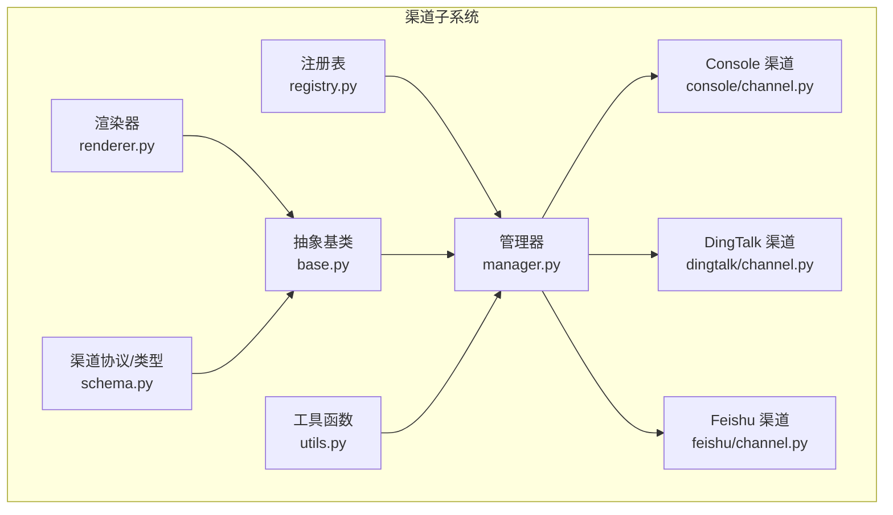
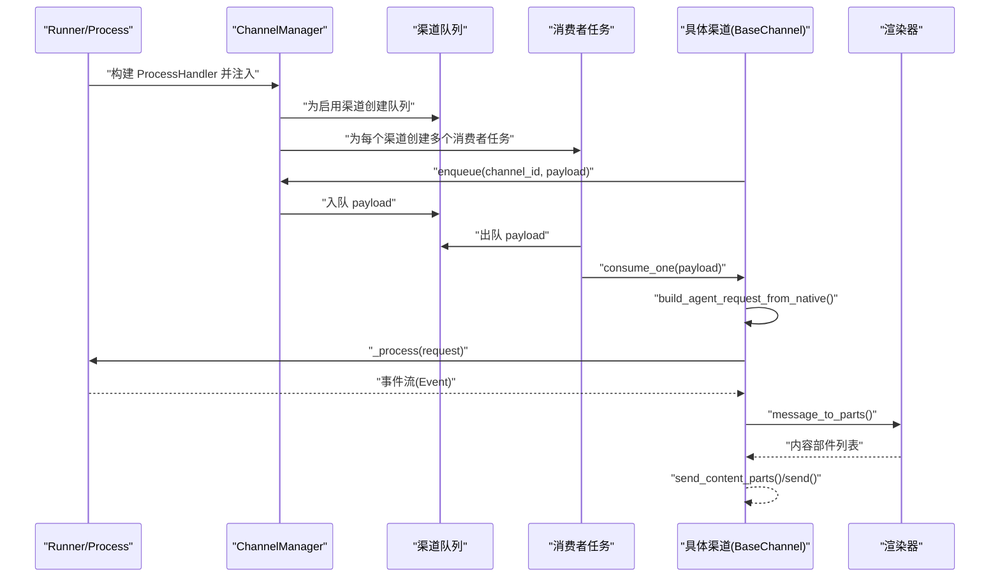
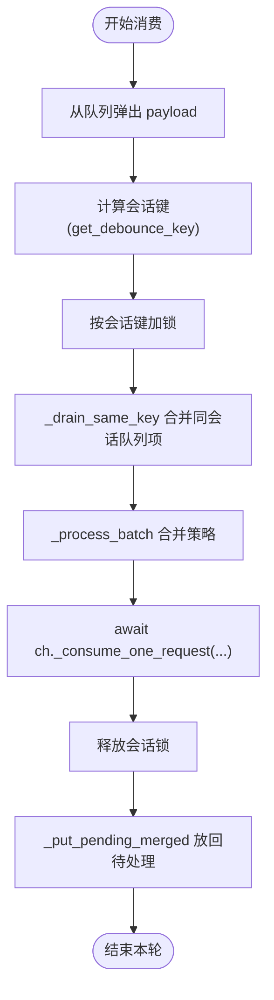
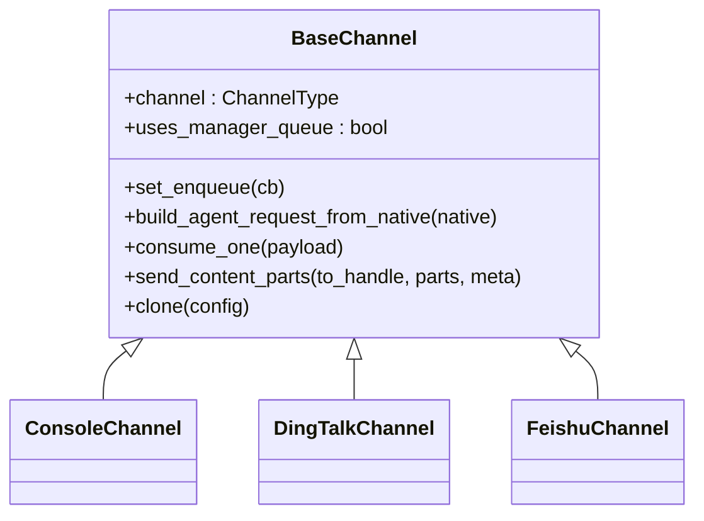
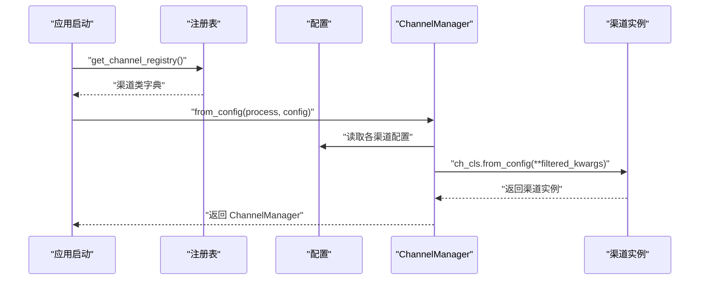
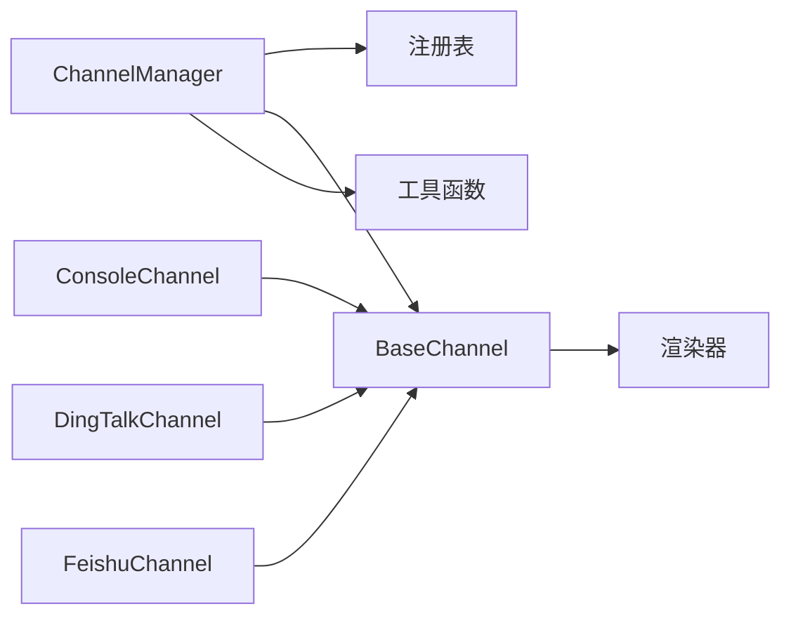

# 渠道管理器架构

<cite>
**本文引用的文件**
- [manager.py](file://src/copaw/app/channels/manager.py)
- [base.py](file://src/copaw/app/channels/base.py)
- [registry.py](file://src/copaw/app/channels/registry.py)
- [__init__.py](file://src/copaw/app/channels/__init__.py)
- [schema.py](file://src/copaw/app/channels/schema.py)
- [renderer.py](file://src/copaw/app/channels/renderer.py)
- [utils.py](file://src/copaw/app/channels/utils.py)
- [channel.py（Console）](file://src/copaw/app/channels/console/channel.py)
- [channel.py（DingTalk）](file://src/copaw/app/channels/dingtalk/channel.py)
- [channel.py（Feishu）](file://src/copaw/app/channels/feishu/channel.py)
- [_app.py](file://src/copaw/app/_app.py)
- [config.py](file://src/copaw/config/config.py)
</cite>

## 目录
1. [引言](#引言)
2. [项目结构](#项目结构)
3. [核心组件](#核心组件)
4. [架构总览](#架构总览)
5. [详细组件分析](#详细组件分析)
6. [依赖分析](#依赖分析)
7. [性能考虑](#性能考虑)
8. [故障排查指南](#故障排查指南)
9. [结论](#结论)
10. [附录：初始化与生命周期示例路径](#附录初始化与生命周期示例路径)

## 引言
本技术文档围绕 CoPaw 的渠道管理器架构展开，重点阐释 ChannelManager 的设计理念与实现要点，包括：
- 异步队列管理与消费者工作线程池
- 会话去重与时间抖动合并
- 批量处理算法与消息渲染
- BaseChannel 抽象基类的设计模式与适配器扩展点
- 渠道注册机制、动态加载与配置注入
- 生命周期管理、错误处理与资源清理
- 初始化、启动、停止与替换流程的具体示例路径

## 项目结构
CoPaw 的渠道子系统位于 src/copaw/app/channels 下，采用“抽象基类 + 多具体渠道实现 + 管理器 + 注册表”的分层设计。核心模块如下：
- manager.py：ChannelManager 负责队列、消费者任务、批量处理与生命周期管理
- base.py：BaseChannel 定义统一的消息模型、处理回调、渲染与发送接口
- registry.py：内置渠道注册表与自定义渠道发现
- schema.py：渠道类型标识、路由地址协议
- renderer.py：消息渲染器，将运行时消息转换为可发送的内容部件
- utils.py：通道与 Runner 的桥接工具
- 各具体渠道实现：console、dingtalk、feishu 等
- 配置与应用入口：config.py、_app.py

图表来源
- [registry.py:132-137](file://src/copaw/app/channels/registry.py#L132-L137)
- [manager.py:114-156](file://src/copaw/app/channels/manager.py#L114-L156)
- [base.py:69-125](file://src/copaw/app/channels/base.py#L69-L125)
- [renderer.py:78-86](file://src/copaw/app/channels/renderer.py#L78-L86)
- [schema.py:12-48](file://src/copaw/app/channels/schema.py#L12-L48)
- [utils.py:58-71](file://src/copaw/app/channels/utils.py#L58-L71)
- [channel.py（Console）:56-172](file://src/copaw/app/channels/console/channel.py#L56-L172)
- [channel.py（DingTalk）:81-251](file://src/copaw/app/channels/dingtalk/channel.py#L81-L251)
- [channel.py（Feishu）:145-291](file://src/copaw/app/channels/feishu/channel.py#L145-L291)

章节来源
- [registry.py:19-36](file://src/copaw/app/channels/registry.py#L19-L36)
- [manager.py:114-156](file://src/copaw/app/channels/manager.py#L114-L156)
- [base.py:69-125](file://src/copaw/app/channels/base.py#L69-L125)
- [renderer.py:78-86](file://src/copaw/app/channels/renderer.py#L78-L86)
- [schema.py:12-48](file://src/copaw/app/channels/schema.py#L12-L48)
- [utils.py:58-71](file://src/copaw/app/channels/utils.py#L58-L71)

## 核心组件
- ChannelManager：负责为每个启用的渠道创建队列与消费者任务；提供入队、批量处理、替换渠道、主动发送等能力
- BaseChannel：统一的渠道抽象，定义消息构建、渲染、发送、去重与错误处理钩子
- 渠道注册表：内置渠道清单与自定义渠道发现，支持懒加载与缓存
- 渲染器：将运行时消息转换为各渠道可发送的内容部件
- 工具函数：从 Runner 构造 ProcessHandler，文件 URL 解析等

章节来源
- [manager.py:114-156](file://src/copaw/app/channels/manager.py#L114-L156)
- [base.py:69-125](file://src/copaw/app/channels/base.py#L69-L125)
- [registry.py:132-137](file://src/copaw/app/channels/registry.py#L132-L137)
- [renderer.py:78-86](file://src/copaw/app/channels/renderer.py#L78-L86)
- [utils.py:58-71](file://src/copaw/app/channels/utils.py#L58-L71)

## 架构总览
ChannelManager 作为框架所有者，持有各渠道实例与其队列，消费者循环从队列取出同会话消息进行合并与处理。BaseChannel 将“原生负载”解析为 AgentRequest，再通过统一的 process 流水线驱动，最终由渠道选择性地发送。

图表来源
- [manager.py:307-372](file://src/copaw/app/channels/manager.py#L307-L372)
- [base.py:404-480](file://src/copaw/app/channels/base.py#L404-L480)
- [renderer.py:87-102](file://src/copaw/app/channels/renderer.py#L87-L102)
- [utils.py:58-71](file://src/copaw/app/channels/utils.py#L58-L71)

## 详细组件分析

### ChannelManager：异步队列与消费者工作线程池
- 队列与消费者
  - 为每个启用渠道创建固定大小队列与固定数量的工作任务（默认每渠道 4 个）
  - 消费者循环从队列取 payload，按会话键去重并合并批次后调用渠道处理
- 入队与线程安全
  - 提供线程安全的 enqueue 接口，内部通过事件循环回调确保线程切换安全
  - 对于正在处理中的会话，payload 进入 pending 缓冲并在完成后合并回队列
- 批量处理算法
  - _drain_same_key：按会话键从队列中提取同一批次
  - _process_batch：根据是否原生负载与渠道类型决定合并策略（原生项合并或请求合并）
  - _put_pending_merged：将合并后的待处理项放回队列
- 替换渠道
  - replace_channel：在不中断其他渠道的前提下，预启新渠道、交换并停止旧渠道，保证服务连续性

图表来源
- [manager.py:307-349](file://src/copaw/app/channels/manager.py#L307-L349)
- [manager.py:42-112](file://src/copaw/app/channels/manager.py#L42-L112)

章节来源
- [manager.py:114-156](file://src/copaw/app/channels/manager.py#L114-L156)
- [manager.py:249-306](file://src/copaw/app/channels/manager.py#L249-L306)
- [manager.py:307-372](file://src/copaw/app/channels/manager.py#L307-L372)
- [manager.py:419-483](file://src/copaw/app/channels/manager.py#L419-L483)

### BaseChannel：抽象基类与适配器模式
- 统一消息模型
  - build_agent_request_from_user_content：将内容部件组装为 AgentRequest
  - build_agent_request_from_native：子类必须实现，将原生负载解析为内容部件
  - get_to_handle_from_request：将请求映射为发送目标 handle
- 去重与时间抖动
  - get_debounce_key：基于会话键的去重键生成
  - _apply_no_text_debounce：对无文本内容进行缓冲，待有文本时合并发送
  - _debounce_seconds 与定时器：对原生负载进行时间窗口内的合并
- 处理回调与渲染
  - _consume_one_request：统一的处理入口，调用 process 流水线并发送
  - _run_process_loop：遍历事件流，消息完成时触发 on_event_message_completed
  - _message_to_content_parts + send_content_parts：渲染并发送多部件内容
- 错误处理
  - _on_consume_error：默认以文本形式回发错误信息
  - _get_response_error_message：从响应中提取错误消息

图表来源
- [base.py:69-125](file://src/copaw/app/channels/base.py#L69-L125)
- [channel.py（Console）:56-172](file://src/copaw/app/channels/console/channel.py#L56-L172)
- [channel.py（DingTalk）:81-251](file://src/copaw/app/channels/dingtalk/channel.py#L81-L251)
- [channel.py（Feishu）:145-291](file://src/copaw/app/channels/feishu/channel.py#L145-L291)

章节来源
- [base.py:126-174](file://src/copaw/app/channels/base.py#L126-L174)
- [base.py:208-279](file://src/copaw/app/channels/base.py#L208-L279)
- [base.py:404-583](file://src/copaw/app/channels/base.py#L404-L583)
- [base.py:611-647](file://src/copaw/app/channels/base.py#L611-L647)
- [base.py:648-787](file://src/copaw/app/channels/base.py#L648-L787)

### 渠道注册机制、动态加载与配置注入
- 注册表
  - 内置渠道清单与必需渠道（如 console），失败策略不同
  - 缓存内置渠道类，避免重复导入
  - 发现自定义渠道目录下的类，满足 BaseChannel 子类约束即注册
- 动态加载
  - 通过 get_channel_registry 获取全部可用渠道类
  - ChannelManager.from_env/from_config 根据可用渠道与配置构造实例
- 配置注入
  - from_config 读取配置对象，过滤多余字段，按渠道签名动态传参
  - 通过 process、on_reply_sent、show_tool_details、filter_* 等参数注入

图表来源
- [registry.py:132-137](file://src/copaw/app/channels/registry.py#L132-L137)
- [manager.py:157-247](file://src/copaw/app/channels/manager.py#L157-L247)
- [config.py:167-184](file://src/copaw/config/config.py#L167-L184)

章节来源
- [registry.py:42-84](file://src/copaw/app/channels/registry.py#L42-L84)
- [registry.py:94-126](file://src/copaw/app/channels/registry.py#L94-L126)
- [manager.py:157-247](file://src/copaw/app/channels/manager.py#L157-L247)
- [config.py:28-40](file://src/copaw/config/config.py#L28-L40)

### 生命周期管理、错误处理与资源清理
- 启动
  - start_all：为启用渠道创建队列与消费者任务；随后逐个调用渠道 start
- 停止
  - stop_all：清空去重状态与待处理项；取消消费者任务；清理队列；逐个调用渠道 stop
- 替换
  - replace_channel：预启新渠道、交换并停止旧渠道，保证服务连续性
- 错误处理
  - 消费者循环捕获异常并记录日志
  - BaseChannel._on_consume_error 默认回发错误文本
  - _get_response_error_message 从响应中提取错误消息

章节来源
- [manager.py:350-411](file://src/copaw/app/channels/manager.py#L350-L411)
- [manager.py:419-483](file://src/copaw/app/channels/manager.py#L419-L483)
- [base.py:584-647](file://src/copaw/app/channels/base.py#L584-L647)

### 主动发送与会话路由
- send_event/send_text：根据渠道类型与目标句柄发送事件或纯文本
- to_handle_from_target：将用户 ID 与会话 ID 映射为渠道特定的发送句柄
- ChannelAddress 协议：统一路由标识，替代分散的 meta 键

章节来源
- [manager.py:484-565](file://src/copaw/app/channels/manager.py#L484-L565)
- [schema.py:12-48](file://src/copaw/app/channels/schema.py#L12-L48)
- [base.py:416-435](file://src/copaw/app/channels/base.py#L416-L435)

## 依赖分析
- ChannelManager 依赖
  - 注册表：获取可用渠道类
  - BaseChannel：统一处理接口与去重/合并逻辑
  - 渲染器：消息到内容部件的转换
  - 工具函数：ProcessHandler 构造、文件 URL 解析
- 渠道实现依赖
  - BaseChannel：继承并实现原生负载解析与发送
  - 渠道特定 API：如 DingTalk、Feishu 的 WebSocket/Open API

图表来源
- [manager.py:23-28](file://src/copaw/app/channels/manager.py#L23-L28)
- [base.py:35-45](file://src/copaw/app/channels/base.py#L35-L45)
- [renderer.py:24-26](file://src/copaw/app/channels/renderer.py#L24-L26)
- [utils.py:58-71](file://src/copaw/app/channels/utils.py#L58-L71)
- [channel.py（Console）:27-37](file://src/copaw/app/channels/console/channel.py#L27-L37)
- [channel.py（DingTalk）:41-47](file://src/copaw/app/channels/dingtalk/channel.py#L41-L47)
- [channel.py（Feishu）:41-47](file://src/copaw/app/channels/feishu/channel.py#L41-L47)

章节来源
- [manager.py:23-28](file://src/copaw/app/channels/manager.py#L23-L28)
- [base.py:35-45](file://src/copaw/app/channels/base.py#L35-L45)
- [renderer.py:24-26](file://src/copaw/app/channels/renderer.py#L24-L26)
- [utils.py:58-71](file://src/copaw/app/channels/utils.py#L58-L71)

## 性能考虑
- 队列容量与并发
  - 每渠道固定队列上限，避免内存膨胀
  - 每渠道固定消费者数量，平衡吞吐与资源占用
- 合并与抖动
  - 时间抖动与“无文本缓冲”减少重复与乱序
  - 批量合并降低渠道 API 调用次数
- 渲染与媒体
  - 渲染器按渠道能力裁剪输出，避免冗余
  - 媒体内容优先走直链，必要时转文本占位

## 故障排查指南
- 渠道未启动
  - 检查配置中 enabled 字段与可用渠道列表
  - 查看注册表加载日志与异常
- 消费者任务异常退出
  - 关注消费者循环中的异常日志
  - 确认渠道 start 是否抛错
- 会话重复或丢失
  - 检查 get_debounce_key 与去重键一致性
  - 核对 pending 缓冲与合并逻辑
- 发送失败
  - 查看渠道 send_content_parts 的日志
  - 检查渲染器输出与媒体直链有效性

章节来源
- [registry.py:42-84](file://src/copaw/app/channels/registry.py#L42-L84)
- [manager.py:343-348](file://src/copaw/app/channels/manager.py#L343-L348)
- [base.py:631-647](file://src/copaw/app/channels/base.py#L631-L647)

## 结论
ChannelManager 通过统一的抽象与严格的生命周期管理，实现了多渠道的高内聚、低耦合接入。BaseChannel 的适配器模式让各渠道在保持一致行为的同时，又能发挥自身特性。结合注册表与动态加载，系统具备良好的扩展性与可维护性。

## 附录：初始化与生命周期示例路径
- 初始化与启动
  - 应用启动时，_app.py 中通过 DynamicMultiAgentRunner 注入 process，随后由 AgentApp 管理生命周期
  - 参考：[lifespan 启停流程:148-239](file://src/copaw/app/_app.py#L148-L239)
  - ChannelManager 构建：[from_env/from_config:135-247](file://src/copaw/app/channels/manager.py#L135-L247)
  - 启动队列与消费者：[start_all:350-372](file://src/copaw/app/channels/manager.py#L350-L372)
- 停止与替换
  - 停止：[stop_all:379-411](file://src/copaw/app/channels/manager.py#L379-L411)
  - 替换：[replace_channel:419-483](file://src/copaw/app/channels/manager.py#L419-L483)
- 渠道实现示例
  - Console 渠道：[ConsoleChannel:56-172](file://src/copaw/app/channels/console/channel.py#L56-L172)
  - DingTalk 渠道：[DingTalkChannel:81-251](file://src/copaw/app/channels/dingtalk/channel.py#L81-L251)
  - Feishu 渠道：[FeishuChannel:145-291](file://src/copaw/app/channels/feishu/channel.py#L145-L291)