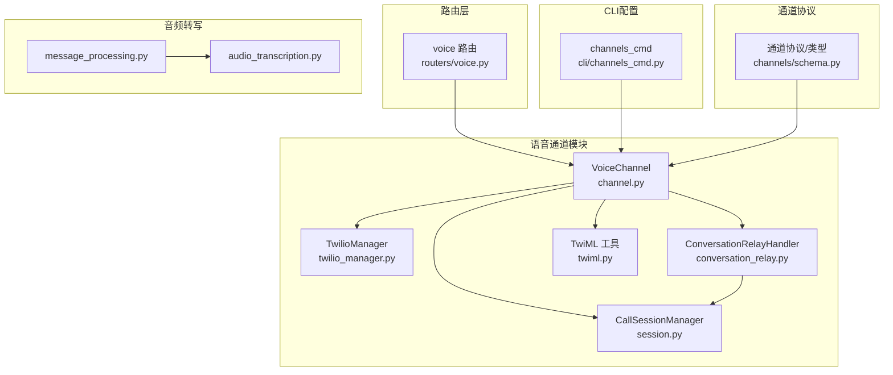
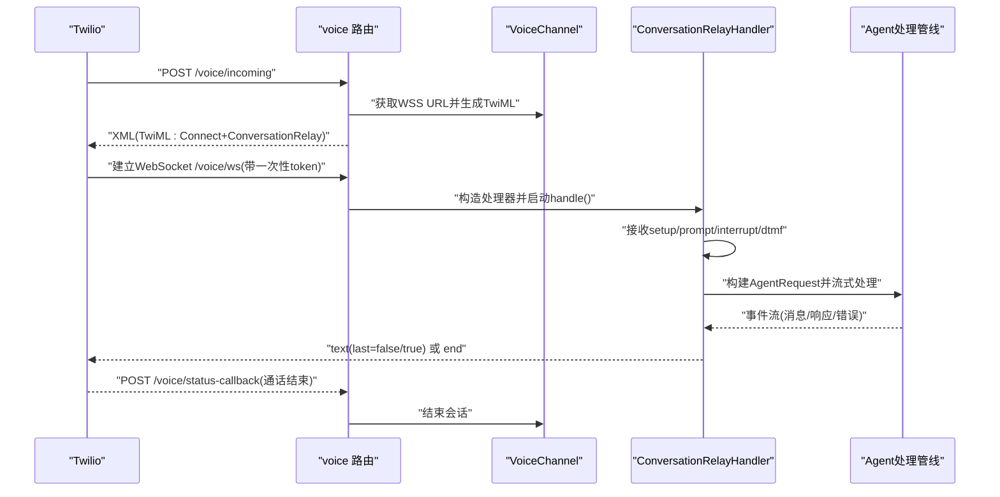
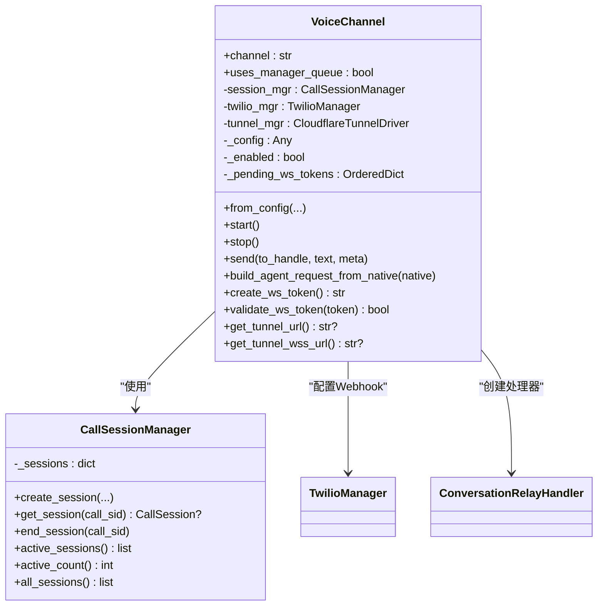
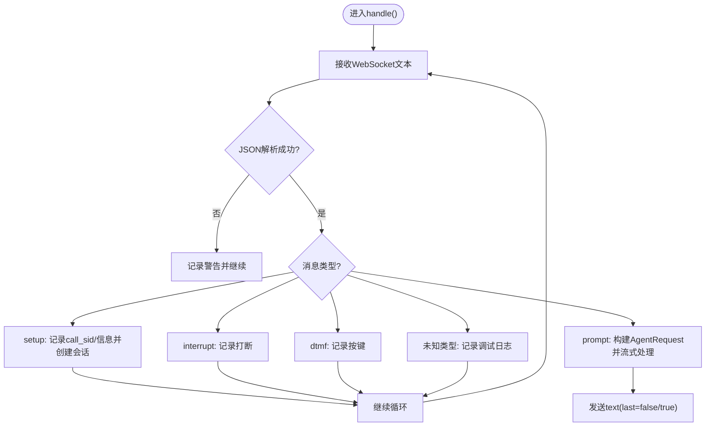
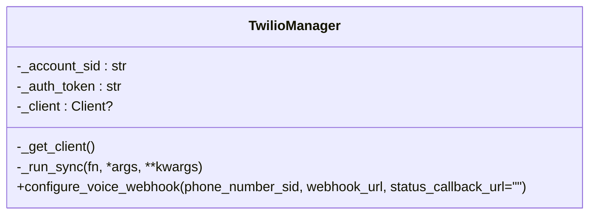
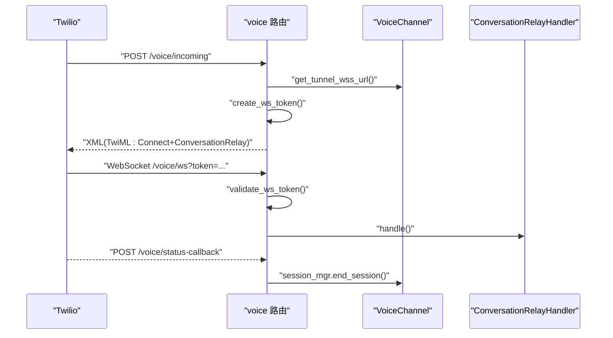
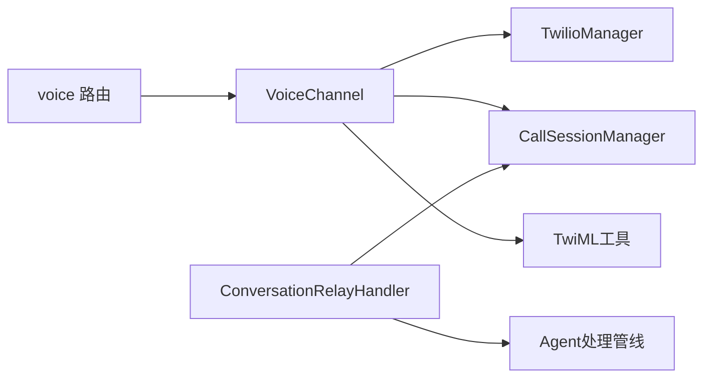

# 语音通道支持

<cite>
**本文引用的文件**
- [channel.py](file://src/copaw/app/channels/voice/channel.py)
- [session.py](file://src/copaw/app/channels/voice/session.py)
- [twilio_manager.py](file://src/copaw/app/channels/voice/twilio_manager.py)
- [conversation_relay.py](file://src/copaw/app/channels/voice/conversation_relay.py)
- [twiml.py](file://src/copaw/app/channels/voice/twiml.py)
- [voice.py](file://src/copaw/app/routers/voice.py)
- [schema.py](file://src/copaw/app/channels/schema.py)
- [channels_cmd.py](file://src/copaw/cli/channels_cmd.py)
- [audio_transcription.py](file://src/copaw/agents/utils/audio_transcription.py)
- [message_processing.py](file://src/copaw/agents/utils/message_processing.py)
</cite>

## 目录
1. [简介](#简介)
2. [项目结构](#项目结构)
3. [核心组件](#核心组件)
4. [架构总览](#架构总览)
5. [详细组件分析](#详细组件分析)
6. [依赖关系分析](#依赖关系分析)
7. [性能考虑](#性能考虑)
8. [故障排查指南](#故障排查指南)
9. [结论](#结论)
10. [附录：配置与使用示例](#附录配置与使用示例)

## 简介
本文件面向CoPaw的“语音通道”能力，系统性阐述其电话语音集成方案，包括Twilio API集成、会话管理、音频流处理、通话状态控制、语音转文字（STT）与文字转语音（TTS）技术实现、会话中继机制、多方通话支持与通话记录管理，以及配置方法、性能调优与故障诊断。文档同时提供关键流程的时序图与类图，帮助读者快速理解并落地部署。

## 项目结构
语音通道位于后端应用的“channels/voice”子模块，围绕以下关键文件组织：
- 语音通道入口与生命周期管理：channel.py
- 会话注册与状态管理：session.py
- Twilio API封装：twilio_manager.py
- 会话中继处理器（WebSocket）：conversation_relay.py
- TwiML生成工具：twiml.py
- 对外路由（Twilio Webhook与WebSocket）：routers/voice.py
- 通道类型与路由协议：channels/schema.py
- CLI交互式配置：cli/channels_cmd.py
- 音频转写能力（STT）：agents/utils/audio_transcription.py 与 message_processing.py

图表来源
- [channel.py:17-240](file://src/copaw/app/channels/voice/channel.py#L17-L240)
- [session.py:28-73](file://src/copaw/app/channels/voice/session.py#L28-L73)
- [twilio_manager.py:12-58](file://src/copaw/app/channels/voice/twilio_manager.py#L12-L58)
- [conversation_relay.py:29-289](file://src/copaw/app/channels/voice/conversation_relay.py#L29-L289)
- [twiml.py:8-62](file://src/copaw/app/channels/voice/twiml.py#L8-L62)
- [voice.py:25-184](file://src/copaw/app/routers/voice.py#L25-L184)
- [schema.py:12-71](file://src/copaw/app/channels/schema.py#L12-L71)
- [channels_cmd.py:497-593](file://src/copaw/cli/channels_cmd.py#L497-L593)
- [audio_transcription.py:295-317](file://src/copaw/agents/utils/audio_transcription.py#L295-L317)
- [message_processing.py:239-277](file://src/copaw/agents/utils/message_processing.py#L239-L277)

章节来源
- [channel.py:17-240](file://src/copaw/app/channels/voice/channel.py#L17-L240)
- [voice.py:25-184](file://src/copaw/app/routers/voice.py#L25-L184)

## 核心组件
- 语音通道（VoiceChannel）
  - 负责启动/停止、Webhook配置、WebSocket隧道、会话令牌管理与会话注册。
  - 关键职责：从配置读取凭据；启动Cloudflare隧道；向Twilio更新来电Webhook；暴露/校验一次性WebSocket令牌；构建Agent请求。
- 会话管理（CallSessionManager）
  - 维护活动会话集合，提供创建、查询、结束与统计接口。
- Twilio管理器（TwilioManager）
  - 异步封装Twilio SDK，负责更新来电号码的voice_url与status_callback。
- 会话中继处理器（ConversationRelayHandler）
  - 处理来自Twilio ConversationRelay的WebSocket消息，将用户语音文本转换为Agent请求，并将模型输出流式回传给Twilio以驱动TTS播放。
- TwiML生成器（build_conversation_relay_twiml）
  - 生成连接到WebSocket的TwiML，设置TTS/STT提供商、语言与可打断参数。
- 路由器（voice 路由）
  - 暴露 /voice/incoming（Webhook）、/voice/ws（WebSocket）、/voice/status-callback（状态回调），并进行Twilio签名验证。
- 通道协议（schema）
  - 定义内置通道类型标识（含"voice"），统一消息转换协议。

章节来源
- [channel.py:17-240](file://src/copaw/app/channels/voice/channel.py#L17-L240)
- [session.py:28-73](file://src/copaw/app/channels/voice/session.py#L28-L73)
- [twilio_manager.py:12-58](file://src/copaw/app/channels/voice/twilio_manager.py#L12-L58)
- [conversation_relay.py:29-289](file://src/copaw/app/channels/voice/conversation_relay.py#L29-L289)
- [twiml.py:8-62](file://src/copaw/app/channels/voice/twiml.py#L8-L62)
- [voice.py:25-184](file://src/copaw/app/routers/voice.py#L25-L184)
- [schema.py:30-42](file://src/copaw/app/channels/schema.py#L30-L42)

## 架构总览
语音通道采用“来电Webhook + WebSocket中继”的模式：
- Twilio来电触发Webhook，返回带WebSocket地址的TwiML；
- 来电建立WebSocket连接，进入ConversationRelay中继循环；
- 中继将用户语音文本转为Agent请求，流式接收模型输出并发送至Twilio以播放TTS；
- 通话状态通过status-callback同步至会话管理器，确保资源回收。

图表来源
- [voice.py:84-184](file://src/copaw/app/routers/voice.py#L84-L184)
- [conversation_relay.py:60-289](file://src/copaw/app/channels/voice/conversation_relay.py#L60-L289)
- [channel.py:81-157](file://src/copaw/app/channels/voice/channel.py#L81-L157)

## 详细组件分析

### 语音通道（VoiceChannel）
- 生命周期
  - start：启动Cloudflare隧道，获取公网URL，配置Twilio来电Webhook与状态回调。
  - stop：关闭所有活动会话并停止隧道。
- 会话与令牌
  - 使用CallSessionManager维护活动会话；生成一次性WebSocket令牌并校验，防止未授权接入。
- 请求转换
  - 将Twilio传入的语音文本转换为AgentRequest，携带session_id与user_id等元信息。

图表来源
- [channel.py:17-240](file://src/copaw/app/channels/voice/channel.py#L17-L240)
- [session.py:28-73](file://src/copaw/app/channels/voice/session.py#L28-L73)

章节来源
- [channel.py:17-240](file://src/copaw/app/channels/voice/channel.py#L17-L240)
- [session.py:28-73](file://src/copaw/app/channels/voice/session.py#L28-L73)

### 会话中继处理器（ConversationRelayHandler）
- 主循环
  - 接收并解析JSON消息，分发到setup/prompt/interrupt/dtmf处理分支。
- 事件处理
  - setup：记录call_sid与caller信息，创建会话。
  - prompt：提取语音文本，构建AgentRequest，流式处理并回传TTS片段。
  - interrupt/dtmf：记录打断与按键事件（可用于后续扩展）。
- 错误与关闭
  - 捕获异常并发送通用错误提示；在finally中关闭WebSocket并结束会话。

图表来源
- [conversation_relay.py:60-101](file://src/copaw/app/channels/voice/conversation_relay.py#L60-L101)
- [conversation_relay.py:103-163](file://src/copaw/app/channels/voice/conversation_relay.py#L103-L163)
- [conversation_relay.py:185-226](file://src/copaw/app/channels/voice/conversation_relay.py#L185-L226)

章节来源
- [conversation_relay.py:29-289](file://src/copaw/app/channels/voice/conversation_relay.py#L29-L289)

### Twilio管理器（TwilioManager）
- 异步封装
  - 使用线程池执行同步SDK调用，避免阻塞事件循环。
- Webhook配置
  - 更新incoming phone number的voice_url与status_callback（可选），设置HTTP方法。

图表来源
- [twilio_manager.py:12-58](file://src/copaw/app/channels/voice/twilio_manager.py#L12-L58)

章节来源
- [twilio_manager.py:12-58](file://src/copaw/app/channels/voice/twilio_manager.py#L12-L58)

### TwiML生成器（build_conversation_relay_twiml）
- 功能
  - 生成Connect+ConversationRelay节点的XML，注入WebSocket URL、欢迎语、TTS/STT提供商、语言与可打断开关。
- 兼容性
  - 通过XML字符串直接作为HTTP响应返回，供Twilio解析。

章节来源
- [twiml.py:8-38](file://src/copaw/app/channels/voice/twiml.py#L8-L38)

### 路由器（voice 路由）
- /voice/incoming
  - 校验Twilio签名；生成一次性token；拼接WSS URL；返回带ConversationRelay的TwiML。
- /voice/ws
  - 校验一次性token；接受WebSocket；实例化ConversationRelayHandler并运行主循环。
- /voice/status-callback
  - 校验Twilio签名；根据CallStatus结束对应会话。

图表来源
- [voice.py:84-184](file://src/copaw/app/routers/voice.py#L84-L184)
- [channel.py:213-240](file://src/copaw/app/channels/voice/channel.py#L213-L240)

章节来源
- [voice.py:25-184](file://src/copaw/app/routers/voice.py#L25-L184)

### 通道协议与类型
- 内置通道类型包含"voice"，用于统一消息转换协议与路由标识。
- ChannelMessageConverter协议定义了native到AgentRequest的转换与回复发送流程。

章节来源
- [schema.py:30-71](file://src/copaw/app/channels/schema.py#L30-L71)

### 音频转写（STT）与语音处理
- 音频转写
  - 支持禁用、远程Whisper API与本地Whisper三种模式；根据配置选择提供者并调用异步客户端进行转写。
- 语音消息处理
  - 在“auto”模式下尝试转写；若失败则降级为占位提示；在“native”模式下优先转换为WAV再发送。

章节来源
- [audio_transcription.py:295-317](file://src/copaw/agents/utils/audio_transcription.py#L295-L317)
- [message_processing.py:239-277](file://src/copaw/agents/utils/message_processing.py#L239-L277)

## 依赖关系分析
- 组件耦合
  - VoiceChannel依赖TwilioManager、CallSessionManager、Tunnel驱动与TwiML工具。
  - ConversationRelayHandler依赖FastAPI WebSocket与Agent处理管线，通过CallSessionManager进行会话管理。
  - 路由器依赖VoiceChannel进行令牌校验、WSS URL生成与会话结束。
- 外部依赖
  - Twilio SDK（同步）通过线程池异步执行。
  - Cloudflare Tunnel驱动用于内网穿透。
  - FastAPI WebSocket用于双向通信。
- 循环依赖
  - 未发现循环导入；模块间通过接口与协议解耦。

图表来源
- [channel.py:17-240](file://src/copaw/app/channels/voice/channel.py#L17-L240)
- [conversation_relay.py:29-289](file://src/copaw/app/channels/voice/conversation_relay.py#L29-L289)
- [voice.py:25-184](file://src/copaw/app/routers/voice.py#L25-L184)

章节来源
- [channel.py:17-240](file://src/copaw/app/channels/voice/channel.py#L17-L240)
- [conversation_relay.py:29-289](file://src/copaw/app/channels/voice/conversation_relay.py#L29-L289)
- [voice.py:25-184](file://src/copaw/app/routers/voice.py#L25-L184)

## 性能考虑
- 并发与异步
  - Twilio SDK调用通过线程池异步执行，避免阻塞事件循环。
  - WebSocket长连接按会话独立处理，适合高并发场景。
- 流式回传
  - 中继逐段发送text(last=false)，并在消息末尾发送last=true，使Twilio尽早开始TTS播放，降低端到端延迟。
- 令牌与会话
  - 一次性WebSocket令牌限制重放风险；会话超时清理与状态机保证资源回收。
- STT/TTS质量
  - 可通过配置TTS/STT提供商、语言与声音参数优化音质与识别准确率。
- 延迟优化建议
  - 合理设置TwiML中的interruptible参数，平衡打断体验与稳定性。
  - 在高负载场景下评估Cloudflare隧道的可用性与带宽。

## 故障排查指南
- Webhook配置失败
  - 现象：启动时无法配置Twilio来电Webhook或隧道启动失败。
  - 排查：检查Twilio凭据、phone_number_sid与网络连通性；查看日志异常堆栈。
- WebSocket拒绝连接
  - 现象：/voice/ws被拒绝，原因显示无效token。
  - 排查：确认/voice/incoming是否正确生成并下发一次性token；核对WSS URL与token有效期。
- 通话未结束
  - 现象：status-callback未触发或会话未清理。
  - 排查：确认Twilio已正确配置status_callback；检查回调URL可达性与签名验证逻辑。
- 语音转写失败
  - 现象：auto模式下语音消息未转写。
  - 排查：确认转写提供者类型与凭据；检查网络与超时设置；查看转写返回内容。

章节来源
- [channel.py:81-157](file://src/copaw/app/channels/voice/channel.py#L81-L157)
- [voice.py:125-184](file://src/copaw/app/routers/voice.py#L125-L184)
- [conversation_relay.py:88-101](file://src/copaw/app/channels/voice/conversation_relay.py#L88-L101)

## 结论
CoPaw的语音通道以Twilio ConversationRelay为核心，结合Cloudflare隧道与自研中继处理器，实现了从来电Webhook到WebSocket中继的完整链路。通过会话管理、一次性令牌与状态回调，系统在保证安全性的同时实现了高并发与低延迟的语音通话体验。配合灵活的STT/TTS配置与CLI交互式配置，用户可快速完成部署与优化。

## 附录：配置与使用示例

### 配置项概览（VoiceChannelConfig）
- enabled：启用语音通道
- twilio_account_sid / twilio_auth_token：Twilio认证凭据
- phone_number_sid：来电电话号码SID
- tts_provider / tts_voice / stt_provider / language：TTS/STT与语言参数
- welcome_greeting：欢迎语
- 其他：CLI交互式配置支持上述字段的输入与保存

章节来源
- [channels_cmd.py:497-593](file://src/copaw/cli/channels_cmd.py#L497-L593)

### 初始化与启动流程（代码路径）
- 启动
  - [VoiceChannel.start:81-137](file://src/copaw/app/channels/voice/channel.py#L81-L137)
  - [TwilioManager.configure_voice_webhook:31-58](file://src/copaw/app/channels/voice/twilio_manager.py#L31-L58)
- 会话建立
  - [voice 路由 /voice/incoming:84-123](file://src/copaw/app/routers/voice.py#L84-L123)
  - [voice 路由 /voice/ws:125-161](file://src/copaw/app/routers/voice.py#L125-L161)
  - [ConversationRelayHandler.handle:60-102](file://src/copaw/app/channels/voice/conversation_relay.py#L60-L102)
- 音频传输与播放
  - [ConversationRelayHandler._process_and_stream:185-226](file://src/copaw/app/channels/voice/conversation_relay.py#L185-L226)
  - [ConversationRelayHandler._send_token:247-268](file://src/copaw/app/channels/voice/conversation_relay.py#L247-L268)
- 通话结束
  - [voice 路由 /voice/status-callback:163-184](file://src/copaw/app/routers/voice.py#L163-L184)
  - [VoiceChannel.stop:138-157](file://src/copaw/app/channels/voice/channel.py#L138-L157)

### 会话中继机制与多方通话
- 中继机制
  - 单个WebSocket承载单一会话；通过CallSessionManager维护多会话并行。
- 多方通话支持
  - 当前实现聚焦单一会话；如需多方通话，可在ConversationRelay层扩展为多路音频混音与路由策略（需结合Twilio能力与平台合规要求）。

章节来源
- [session.py:28-73](file://src/copaw/app/channels/voice/session.py#L28-L73)
- [conversation_relay.py:29-289](file://src/copaw/app/channels/voice/conversation_relay.py#L29-L289)

### 语音转文字与文字转语音
- STT
  - [audio_transcription.transcribe_audio:295-317](file://src/copaw/agents/utils/audio_transcription.py#L295-L317)
  - [message_processing处理语音消息:239-277](file://src/copaw/agents/utils/message_processing.py#L239-L277)
- TTS
  - 通过ConversationRelay将文本片段发送至Twilio，由Twilio驱动TTS播放。

章节来源
- [audio_transcription.py:295-317](file://src/copaw/agents/utils/audio_transcription.py#L295-L317)
- [message_processing.py:239-277](file://src/copaw/agents/utils/message_processing.py#L239-L277)
- [conversation_relay.py:247-268](file://src/copaw/app/channels/voice/conversation_relay.py#L247-L268)