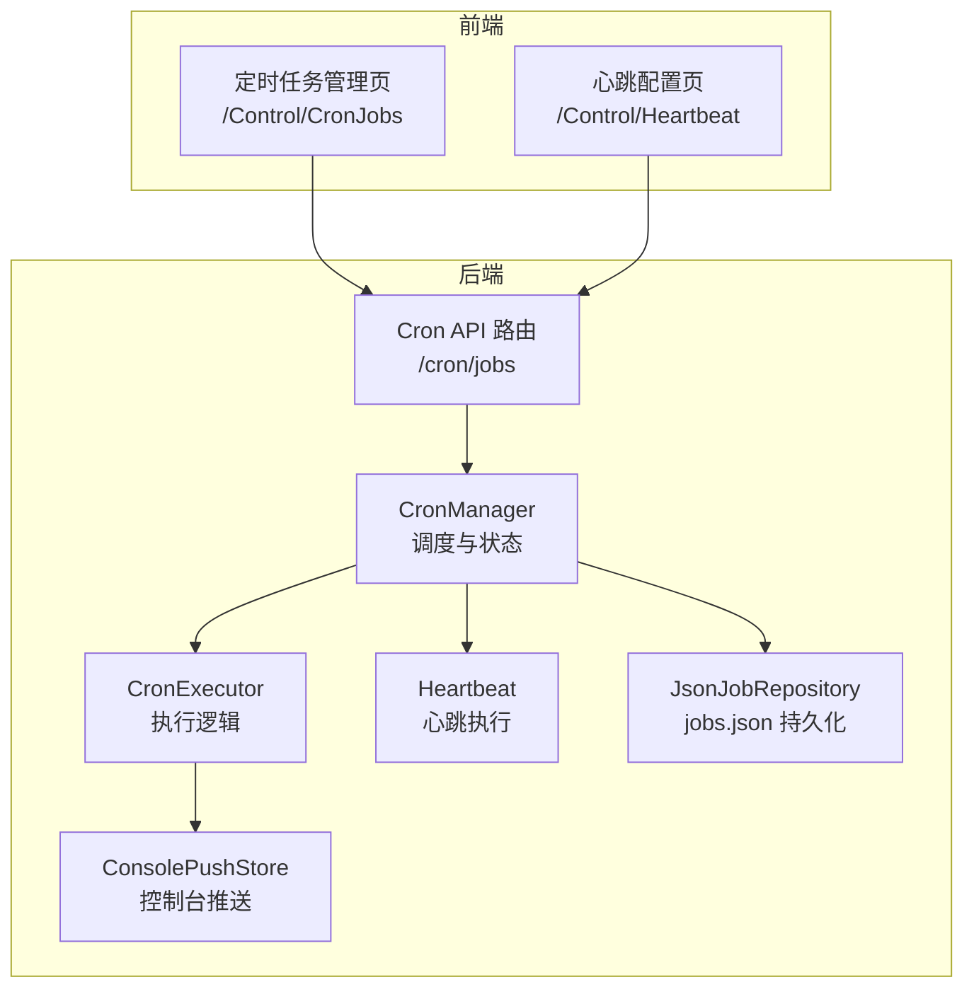
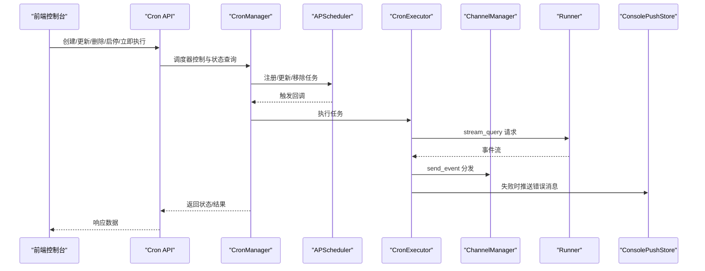
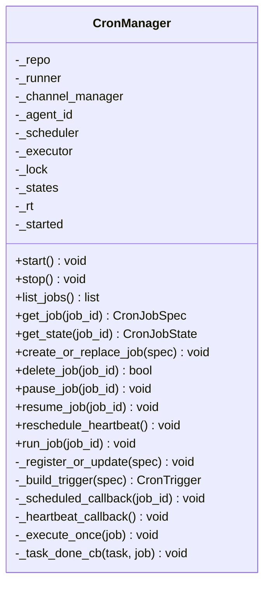
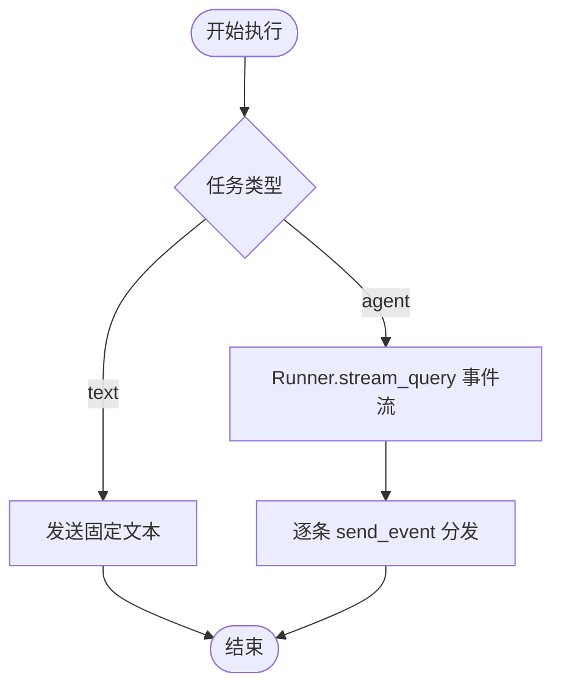
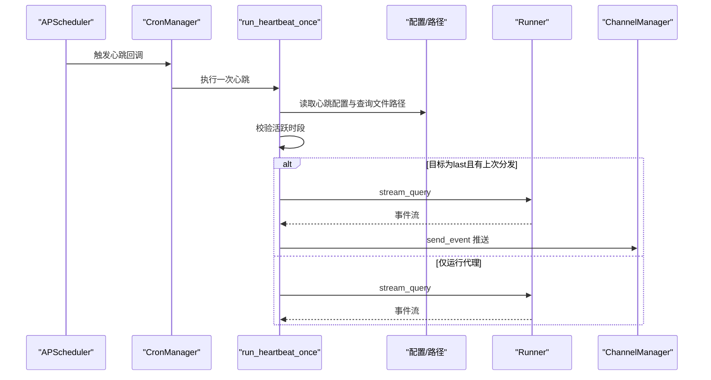
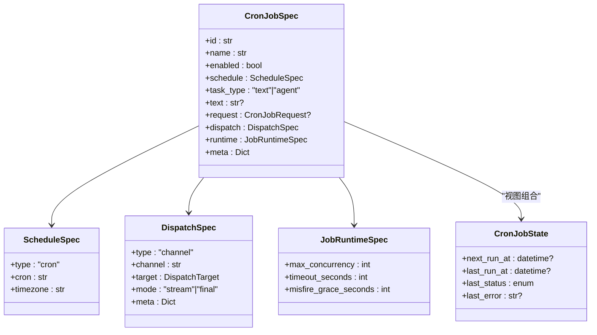
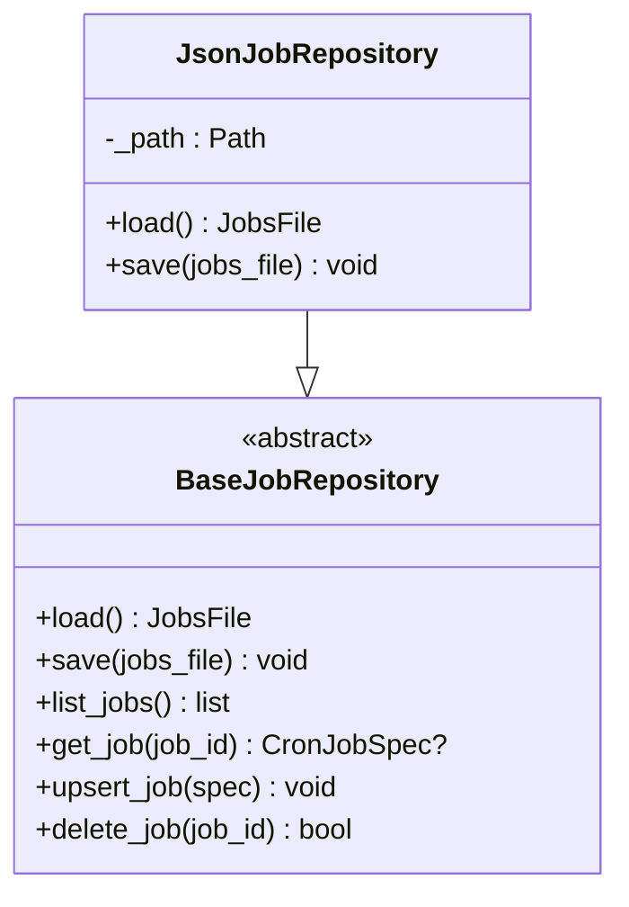
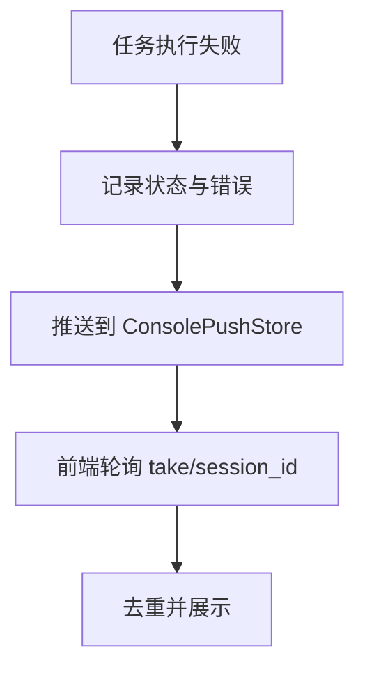
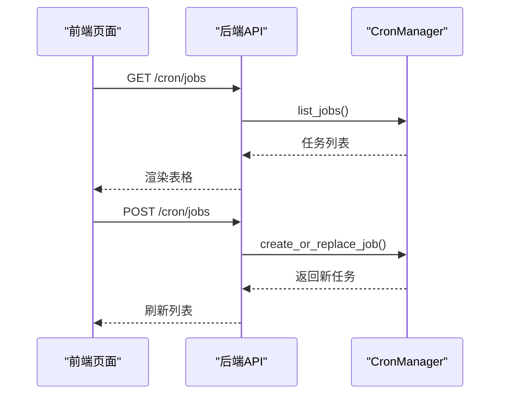
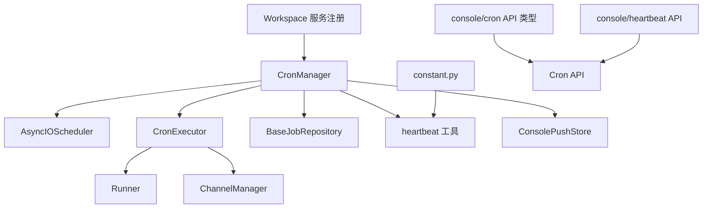

# 定时任务系统

<cite>
**本文档引用的文件**
- [manager.py](file://src/copaw/app/crons/manager.py)
- [models.py](file://src/copaw/app/crons/models.py)
- [executor.py](file://src/copaw/app/crons/executor.py)
- [heartbeat.py](file://src/copaw/app/crons/heartbeat.py)
- [base.py](file://src/copaw/app/crons/repo/base.py)
- [json_repo.py](file://src/copaw/app/crons/repo/json_repo.py)
- [api.py](file://src/copaw/app/crons/api.py)
- [console_push_store.py](file://src/copaw/app/console_push_store.py)
- [workspace.py](file://src/copaw/app/workspace/workspace.py)
- [_app.py](file://src/copaw/app/_app.py)
- [constant.py](file://src/copaw/constant.py)
- [index.tsx](file://console/src/pages/Control/CronJobs/index.tsx)
- [useCronJobs.ts](file://console/src/pages/Control/CronJobs/useCronJobs.ts)
- [heartbeat.ts](file://console/src/api/modules/heartbeat.ts)
- [heartbeat.ts](file://console/src/api/types/heartbeat.ts)
- [index.tsx](file://console/src/pages/Control/Heartbeat/index.tsx)
</cite>

## 目录
1. [简介](#简介)
2. [项目结构](#项目结构)
3. [核心组件](#核心组件)
4. [架构总览](#架构总览)
5. [详细组件分析](#详细组件分析)
6. [依赖关系分析](#依赖关系分析)
7. [性能考虑](#性能考虑)
8. [故障排查指南](#故障排查指南)
9. [结论](#结论)
10. [附录](#附录)

## 简介
本文件面向CoPaw的定时任务系统，围绕APScheduler集成、任务注册与执行、心跳机制、任务模型设计、配置与调度策略、并发与资源限制、以及前后端交互进行系统化技术文档说明。读者可据此理解从任务定义到执行、状态跟踪、错误处理与消息推送的完整闭环，并掌握最佳实践与性能优化建议。

## 项目结构
定时任务系统主要由后端Python服务与前端控制台两部分组成：
- 后端：基于FastAPI提供REST接口，使用APScheduler异步调度器管理周期性任务；通过仓库层持久化任务配置；通过执行器对接Runner与通道管理器完成消息分发；内置心跳机制按配置周期运行。
- 前端：控制台页面提供任务列表、创建/编辑、启停、立即执行等操作；心跳配置页面支持启用/禁用、间隔设置、目标选择与活跃时段控制。

**图表来源**
- [api.py:1-117](file://src/copaw/app/crons/api.py#L1-L117)
- [manager.py:32-111](file://src/copaw/app/crons/manager.py#L32-L111)
- [executor.py:13-90](file://src/copaw/app/crons/executor.py#L13-L90)
- [heartbeat.py:89-183](file://src/copaw/app/crons/heartbeat.py#L89-L183)
- [json_repo.py:12-47](file://src/copaw/app/crons/repo/json_repo.py#L12-L47)
- [console_push_store.py:22-83](file://src/copaw/app/console_push_store.py#L22-L83)
- [index.tsx:18-240](file://console/src/pages/Control/CronJobs/index.tsx#L18-L240)
- [index.tsx:70-210](file://console/src/pages/Control/Heartbeat/index.tsx#L70-L210)

**章节来源**
- [api.py:1-117](file://src/copaw/app/crons/api.py#L1-L117)
- [manager.py:32-111](file://src/copaw/app/crons/manager.py#L32-L111)
- [index.tsx:18-240](file://console/src/pages/Control/CronJobs/index.tsx#L18-L240)
- [index.tsx:70-210](file://console/src/pages/Control/Heartbeat/index.tsx#L70-L210)

## 核心组件
- CronManager：负责任务加载、注册/更新、启停、暂停/恢复、立即执行、心跳重调度与状态维护；内部使用AsyncIOScheduler与每任务信号量实现并发控制。
- CronExecutor：根据任务类型（文本或代理）执行查询并按通道发送事件；支持超时控制。
- Heartbeat：按配置读取查询文件、在指定时间窗口内运行并可选地向最后分发目标推送。
- 任务模型：CronJobSpec、ScheduleSpec、DispatchSpec、JobRuntimeSpec、CronJobState等，统一约束任务定义、调度、分发与运行时参数。
- 仓库层：BaseJobRepository抽象与JsonJobRepository实现，提供jobs.json单文件原子写入。
- 控制台推送：ConsolePushStore提供会话级消息推送，用于前端展示任务失败等信息。
- 前端控制台：提供任务管理与心跳配置UI，调用后端API完成任务生命周期管理。

**章节来源**
- [manager.py:32-359](file://src/copaw/app/crons/manager.py#L32-L359)
- [executor.py:13-90](file://src/copaw/app/crons/executor.py#L13-L90)
- [heartbeat.py:1-183](file://src/copaw/app/crons/heartbeat.py#L1-L183)
- [models.py:1-173](file://src/copaw/app/crons/models.py#L1-L173)
- [base.py:10-54](file://src/copaw/app/crons/repo/base.py#L10-L54)
- [json_repo.py:12-47](file://src/copaw/app/crons/repo/json_repo.py#L12-L47)
- [console_push_store.py:1-83](file://src/copaw/app/console_push_store.py#L1-L83)

## 架构总览
定时任务系统采用“调度器+执行器+仓库+推送”的分层架构，配合前端控制台实现可视化管理。

**图表来源**
- [api.py:28-117](file://src/copaw/app/crons/api.py#L28-L117)
- [manager.py:125-208](file://src/copaw/app/crons/manager.py#L125-L208)
- [executor.py:18-90](file://src/copaw/app/crons/executor.py#L18-L90)
- [console_push_store.py:22-83](file://src/copaw/app/console_push_store.py#L22-L83)

## 详细组件分析

### CronManager：调度与状态管理
- 初始化与启动：创建AsyncIOScheduler、构建CronExecutor；启动时从仓库加载任务并逐一注册；同时根据配置添加心跳任务。
- 任务注册/更新：校验cron表达式合法性，构建CronTrigger；为每个任务建立独立信号量以控制并发；支持misfire宽限时间；暂停状态的任务不触发。
- 立即执行：run_job通过后台任务触发一次执行，回调中记录状态并推送错误消息至控制台。
- 心跳重调度：reschedule_heartbeat根据最新配置动态调整心跳任务的触发间隔或移除。
- 状态维护：维护每任务的next_run_at、last_run_at、last_status、last_error等状态字段。

**图表来源**
- [manager.py:32-359](file://src/copaw/app/crons/manager.py#L32-L359)

**章节来源**
- [manager.py:57-111](file://src/copaw/app/crons/manager.py#L57-L111)
- [manager.py:125-146](file://src/copaw/app/crons/manager.py#L125-L146)
- [manager.py:147-183](file://src/copaw/app/crons/manager.py#L147-L183)
- [manager.py:184-208](file://src/copaw/app/crons/manager.py#L184-L208)
- [manager.py:236-286](file://src/copaw/app/crons/manager.py#L236-L286)
- [manager.py:287-359](file://src/copaw/app/crons/manager.py#L287-L359)

### CronExecutor：任务执行引擎
- 文本任务：直接通过通道管理器发送固定文本内容。
- 代理任务：将请求转交给Runner.stream_query，逐条事件通过通道管理器发送；支持超时控制与取消处理。
- 运行时参数：使用JobRuntimeSpec中的timeout_seconds作为执行超时上限。

**图表来源**
- [executor.py:18-90](file://src/copaw/app/crons/executor.py#L18-L90)

**章节来源**
- [executor.py:18-90](file://src/copaw/app/crons/executor.py#L18-L90)

### 心跳机制：定时检查、状态同步与异常恢复
- 配置解析：parse_heartbeat_every支持“NhMmSs”格式，返回秒数；默认30分钟。
- 时间窗口：_in_active_hours根据用户时区与配置的start/end判断是否在活跃时段内。
- 执行流程：读取HEARTBEAT.md为查询内容，构造请求；若目标为last且存在上次分发，则向last目标推送；否则仅运行代理但不推送；均设置超时保护。
- 异常恢复：心跳回调捕获异常并记录日志；reschedule_heartbeat可在配置变更后重新调度。

**图表来源**
- [heartbeat.py:33-49](file://src/copaw/app/crons/heartbeat.py#L33-L49)
- [heartbeat.py:51-87](file://src/copaw/app/crons/heartbeat.py#L51-L87)
- [heartbeat.py:89-183](file://src/copaw/app/crons/heartbeat.py#L89-L183)
- [manager.py:300-319](file://src/copaw/app/crons/manager.py#L300-L319)

**章节来源**
- [heartbeat.py:33-49](file://src/copaw/app/crons/heartbeat.py#L33-L49)
- [heartbeat.py:51-87](file://src/copaw/app/crons/heartbeat.py#L51-L87)
- [heartbeat.py:89-183](file://src/copaw/app/crons/heartbeat.py#L89-L183)
- [manager.py:300-319](file://src/copaw/app/crons/manager.py#L300-L319)

### 任务模型：定义、参数、历史与统计
- CronJobSpec：任务标识、名称、启用状态、调度、任务类型(text/agent)、文本内容或请求体、分发目标与模式、运行时参数、元数据。
- ScheduleSpec：cron表达式（5字段）、时区。
- DispatchSpec：通道、目标用户与会话、分发模式(stream/final)、附加元数据。
- JobRuntimeSpec：最大并发、超时秒数、错失宽限秒数。
- CronJobState：下次运行时间、最近运行时间、最近状态(success/error/running/skipped/cancelled)、最近错误信息。
- CronJobView：组合spec与state供API返回。

**图表来源**
- [models.py:58-173](file://src/copaw/app/crons/models.py#L58-L173)

**章节来源**
- [models.py:58-173](file://src/copaw/app/crons/models.py#L58-L173)

### 仓库层：任务持久化
- BaseJobRepository：抽象接口，提供load/save及常用便捷操作。
- JsonJobRepository：单文件jobs.json存储，支持原子写入（临时文件+替换），自动创建目录。

**图表来源**
- [base.py:10-54](file://src/copaw/app/crons/repo/base.py#L10-L54)
- [json_repo.py:12-47](file://src/copaw/app/crons/repo/json_repo.py#L12-L47)

**章节来源**
- [base.py:10-54](file://src/copaw/app/crons/repo/base.py#L10-L54)
- [json_repo.py:12-47](file://src/copaw/app/crons/repo/json_repo.py#L12-L47)

### 控制台推送：错误消息展示
- ConsolePushStore：内存队列，按会话聚合消息，支持追加、取出、清理过期消息；前端轮询获取并去重显示。

**图表来源**
- [console_push_store.py:22-83](file://src/copaw/app/console_push_store.py#L22-L83)
- [manager.py:211-233](file://src/copaw/app/crons/manager.py#L211-L233)

**章节来源**
- [console_push_store.py:1-83](file://src/copaw/app/console_push_store.py#L1-L83)
- [manager.py:211-233](file://src/copaw/app/crons/manager.py#L211-L233)

### 前端交互：任务管理与心跳配置
- 定时任务管理页：支持创建、编辑、删除、启停、立即执行；表单解析/序列化cron表达式；JSON输入校验。
- 心跳配置页：启用开关、间隔设置（数字+单位）、目标选择(main/last)、活跃时段(start/end)。

**图表来源**
- [index.tsx:18-240](file://console/src/pages/Control/CronJobs/index.tsx#L18-L240)
- [useCronJobs.ts:9-51](file://console/src/pages/Control/CronJobs/useCronJobs.ts#L9-L51)
- [api.py:28-74](file://src/copaw/app/crons/api.py#L28-L74)

**章节来源**
- [index.tsx:18-240](file://console/src/pages/Control/CronJobs/index.tsx#L18-L240)
- [useCronJobs.ts:9-51](file://console/src/pages/Control/CronJobs/useCronJobs.ts#L9-L51)
- [api.py:28-74](file://src/copaw/app/crons/api.py#L28-L74)

## 依赖关系分析
- CronManager依赖：AsyncIOScheduler、CronExecutor、仓库接口、心跳工具函数、控制台推送。
- CronExecutor依赖：Runner（流式查询）、ChannelManager（事件分发）。
- 工作空间集成：Workspace在服务注册中创建CronManager实例并绑定start/stop。
- 常量与配置：心跳文件名、默认间隔、目标常量来自constant.py；前端心跳API类型与模块位于console目录。

**图表来源**
- [manager.py:46-50](file://src/copaw/app/crons/manager.py#L46-L50)
- [executor.py:14-16](file://src/copaw/app/crons/executor.py#L14-L16)
- [workspace.py:231-251](file://src/copaw/app/workspace/workspace.py#L231-L251)
- [constant.py:102-105](file://src/copaw/constant.py#L102-L105)
- [heartbeat.ts:1-12](file://console/src/api/modules/heartbeat.ts#L1-L12)
- [heartbeat.ts:1-11](file://console/src/api/types/heartbeat.ts#L1-L11)

**章节来源**
- [manager.py:46-50](file://src/copaw/app/crons/manager.py#L46-L50)
- [workspace.py:231-251](file://src/copaw/app/workspace/workspace.py#L231-L251)
- [constant.py:102-105](file://src/copaw/constant.py#L102-L105)
- [heartbeat.ts:1-12](file://console/src/api/modules/heartbeat.ts#L1-L12)
- [heartbeat.ts:1-11](file://console/src/api/types/heartbeat.ts#L1-L11)

## 性能考虑
- 并发控制：每任务独立信号量，max_concurrency限制同时执行数量，避免资源争用。
- 错失宽限：misfire_grace_seconds允许任务在延迟后仍被触发，减少抖动。
- 超时保护：执行器对代理任务设置timeout_seconds，防止长时间阻塞。
- 存储原子性：jobs.json采用临时文件+替换方式，保证写入一致性。
- 日志与监控：关键路径记录info/warning/exception，便于问题定位与告警。

[本节为通用性能建议，无需特定文件引用]

## 故障排查指南
- 任务未触发
  - 检查任务是否启用、cron表达式是否合法（5字段）、时区是否正确。
  - 查看CronManager状态与next_run_at更新情况。
- 任务执行失败
  - 查看last_status与last_error；关注控制台推送的消息。
  - 检查Runner与ChannelManager可用性；确认网络与权限。
- 心跳异常
  - 确认HEARTBEAT.md是否存在且非空；检查活跃时段配置与时区。
  - 关注心跳回调日志，必要时缩短间隔以便快速验证。
- 前端无响应
  - 确认Cron API路由已挂载；检查工作空间是否正确注入CronManager。
  - 核对跨域与认证中间件配置。

**章节来源**
- [manager.py:211-233](file://src/copaw/app/crons/manager.py#L211-L233)
- [heartbeat.py:89-183](file://src/copaw/app/crons/heartbeat.py#L89-L183)
- [api.py:13-25](file://src/copaw/app/crons/api.py#L13-L25)

## 结论
CoPaw定时任务系统以APScheduler为核心，结合仓库持久化、执行器与通道分发、心跳机制与控制台推送，形成完整的任务生命周期管理闭环。通过严格的模型约束、并发与超时控制、以及清晰的错误处理与日志记录，系统具备良好的稳定性与可观测性。前端控制台提供了直观的操作入口，便于日常运维与配置管理。

[本节为总结性内容，无需特定文件引用]

## 附录

### 配置方法与调度策略
- 任务定义
  - 使用CronJobSpec描述任务：id/name/enabled、schedule（cron与时区）、task_type（text/agent）、dispatch（通道与目标）、runtime（并发/超时/错失宽限）、meta。
  - cron表达式需为5字段；系统支持标准化天数字段（crontab数字转英文缩写）。
- 调度策略
  - 支持CronTrigger与IntervalTrigger（心跳）；错失宽限可通过misfire_grace_seconds配置。
- 优先级与资源限制
  - max_concurrency限制单任务并发；timeout_seconds限制执行时长；控制台推送消息上限与过期时间保障内存占用可控。
- 心跳配置
  - enabled/every/target/active_hours；every支持“NhMmSs”格式；target支持“main/last”。

**章节来源**
- [models.py:58-173](file://src/copaw/app/crons/models.py#L58-L173)
- [manager.py:268-286](file://src/copaw/app/crons/manager.py#L268-L286)
- [heartbeat.py:33-49](file://src/copaw/app/crons/heartbeat.py#L33-L49)
- [constant.py:102-105](file://src/copaw/constant.py#L102-L105)

### 开发最佳实践
- 任务设计
  - 明确任务粒度，避免长耗时任务；合理设置max_concurrency与timeout_seconds。
  - 对外部依赖增加超时与重试策略，确保任务可恢复。
- 错误处理
  - 在CronExecutor中捕获并记录异常，必要时通过控制台推送提示用户。
  - 对无效任务自动禁用并记录警告，避免影响其他任务。
- 监控与日志
  - 关注CronManager与CronExecutor的关键日志点；结合APScheduler的next_run_at与last_run_at进行健康检查。
- 前端交互
  - 表单校验与JSON解析要健壮；立即执行前进行二次确认；错误提示友好明确。

**章节来源**
- [manager.py:67-86](file://src/copaw/app/crons/manager.py#L67-L86)
- [manager.py:211-233](file://src/copaw/app/crons/manager.py#L211-L233)
- [executor.py:75-90](file://src/copaw/app/crons/executor.py#L75-L90)

### 代码示例（路径指引）
- 创建任务
  - 后端：POST /cron/jobs，Body为CronJobSpec（id由服务器生成）
  - 前端：调用createJob，提交表单后刷新列表
  - 参考路径：[api.py:41-51](file://src/copaw/app/crons/api.py#L41-L51)，[index.tsx:176-190](file://console/src/pages/Control/CronJobs/index.tsx#L176-L190)
- 更新任务
  - 后端：PUT /cron/jobs/{job_id}，Body为CronJobSpec
  - 前端：编辑表单并提交
  - 参考路径：[api.py:53-62](file://src/copaw/app/crons/api.py#L53-L62)，[index.tsx:176-190](file://console/src/pages/Control/CronJobs/index.tsx#L176-L190)
- 删除任务
  - 后端：DELETE /cron/jobs/{job_id}
  - 前端：确认对话框后调用deleteJob
  - 参考路径：[api.py:65-74](file://src/copaw/app/crons/api.py#L65-L74)，[index.tsx:95-106](file://console/src/pages/Control/CronJobs/index.tsx#L95-L106)
- 启停任务
  - 后端：POST /cron/jobs/{job_id}/pause 或 /resume
  - 前端：点击按钮触发toggleEnabled
  - 参考路径：[api.py:76-94](file://src/copaw/app/crons/api.py#L76-L94)，[index.tsx:108-111](file://console/src/pages/Control/CronJobs/index.tsx#L108-L111)
- 立即执行
  - 后端：POST /cron/jobs/{job_id}/run
  - 前端：点击按钮触发executeNow
  - 参考路径：[api.py:97-105](file://src/copaw/app/crons/api.py#L97-L105)，[index.tsx:112-123](file://console/src/pages/Control/CronJobs/index.tsx#L112-L123)
- 心跳配置
  - 后端：GET/PUT /config/heartbeat
  - 前端：Heartbeat配置页设置enabled/every/target/active_hours
  - 参考路径：[heartbeat.ts:1-12](file://console/src/api/modules/heartbeat.ts#L1-L12)，[index.tsx:104-136](file://console/src/pages/Control/Heartbeat/index.tsx#L104-L136)