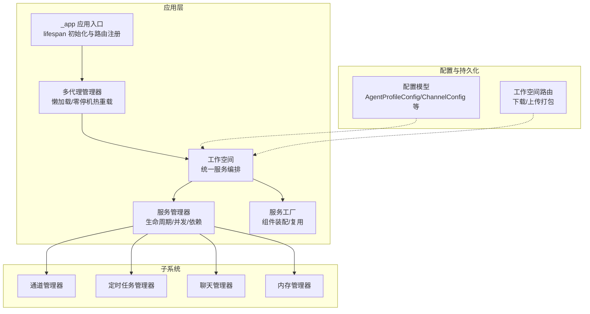
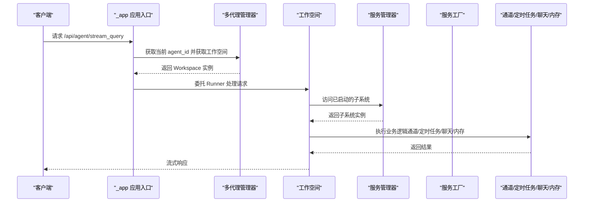
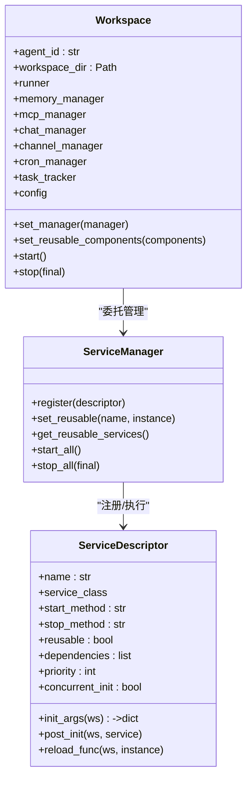
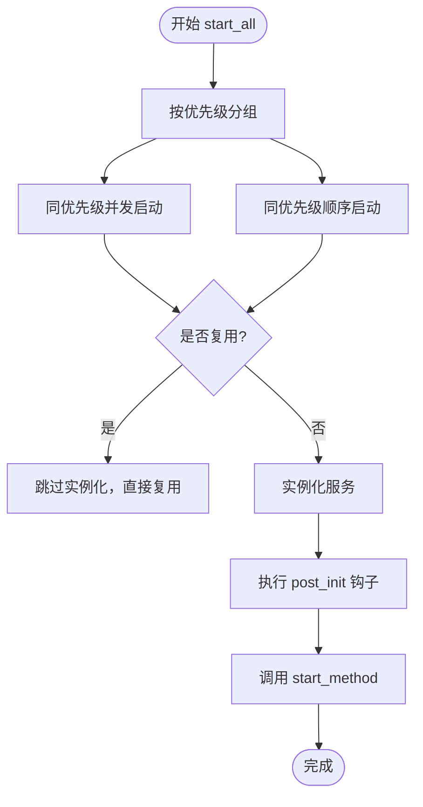
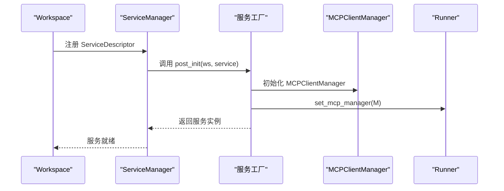
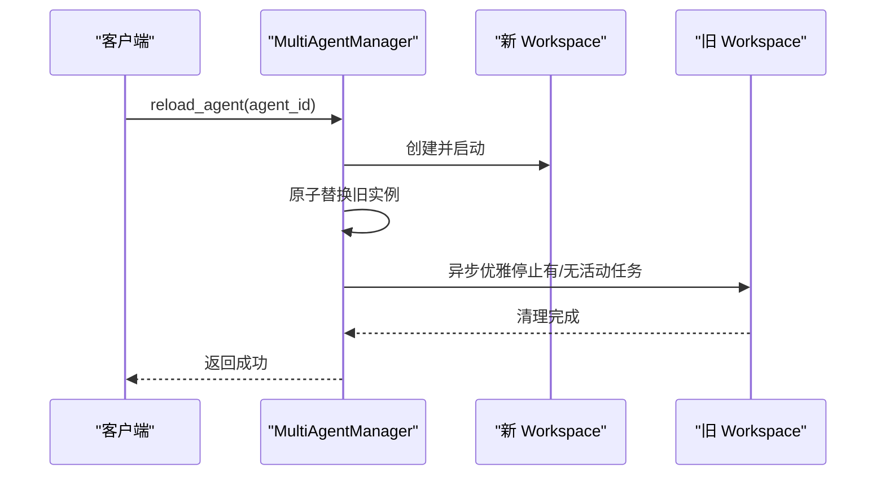
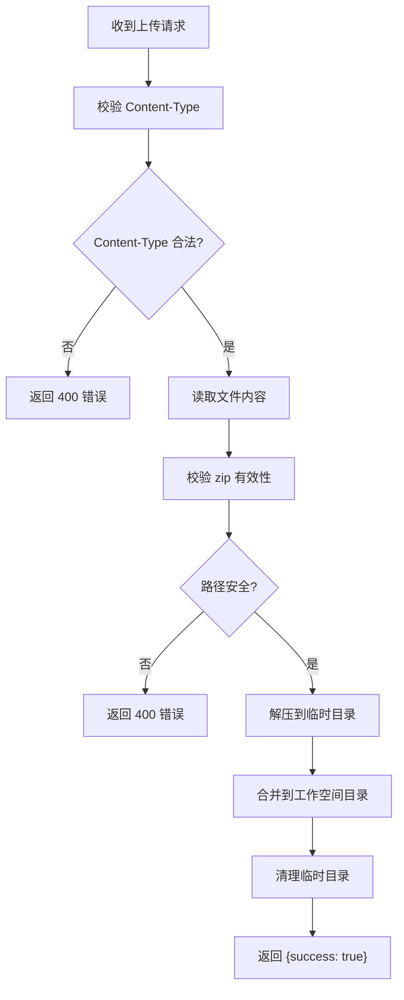
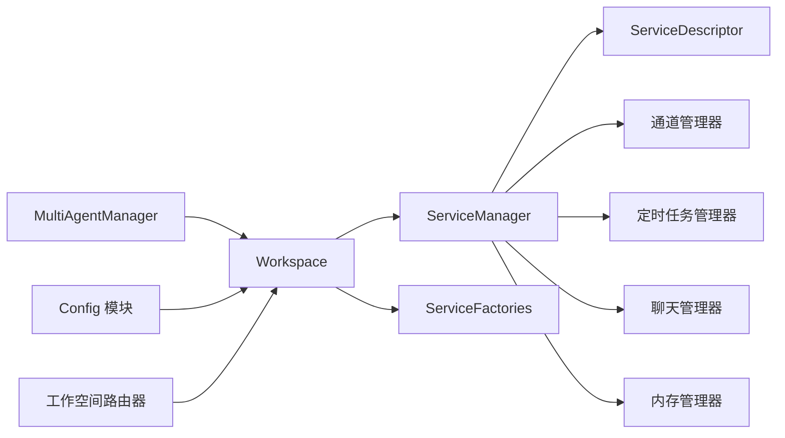

# 工作空间管理

<cite>
**本文引用的文件列表**
- [workspace.py](file://src/copaw/app/workspace/workspace.py)
- [service_manager.py](file://src/copaw/app/workspace/service_manager.py)
- [service_factories.py](file://src/copaw/app/workspace/service_factories.py)
- [workspace 路由器](file://src/copaw/app/routers/workspace.py)
- [配置模块](file://src/copaw/config/config.py)
- [多代理管理器](file://src/copaw/app/multi_agent_manager.py)
- [_app 应用入口](file://src/copaw/app/_app.py)
- [聊天管理器](file://src/copaw/app/runner/manager.py)
- [内存管理器](file://src/copaw/agents/memory/memory_manager.py)
- [通道管理器](file://src/copaw/app/channels/manager.py)
- [定时任务管理器](file://src/copaw/app/crons/manager.py)
- [工作空间单元测试](file://tests/unit/workspace/test_workspace.py)
- [代理创建单元测试](file://tests/unit/workspace/test_agent_creation.py)
</cite>

## 目录
1. [简介](#简介)
2. [项目结构](#项目结构)
3. [核心组件](#核心组件)
4. [架构总览](#架构总览)
5. [详细组件分析](#详细组件分析)
6. [依赖关系分析](#依赖关系分析)
7. [性能考量](#性能考量)
8. [故障排查指南](#故障排查指南)
9. [结论](#结论)
10. [附录：最佳实践与扩展指南](#附录最佳实践与扩展指南)

## 简介
本文件系统性阐述 CoPaw 的工作空间（Workspace）管理能力，涵盖多工作区支持、配置隔离、数据持久化、服务生命周期管理、服务工厂模式、配置结构与环境变量、权限与安全机制，并提供最佳实践、性能优化建议与扩展开发指南。读者可据此理解如何在多代理场景下，通过统一的服务编排与工厂化装配，实现高可用、可热重载、可扩展的工作空间运行时。

## 项目结构
围绕工作空间的核心代码位于应用层的 workspace 子模块，配合全局的多代理管理器、配置系统、以及各子系统（通道、定时任务、内存等）。API 层提供工作空间打包下载与上传合并的能力，便于运维与迁移。

图表来源
- [_app 应用入口:148-246](file://src/copaw/app/_app.py#L148-L246)
- [多代理管理器:17-32](file://src/copaw/app/multi_agent_manager.py#L17-L32)
- [工作空间:39-78](file://src/copaw/app/workspace/workspace.py#L39-L78)
- [服务管理器:74-91](file://src/copaw/app/workspace/service_manager.py#L74-L91)
- [服务工厂:18-34](file://src/copaw/app/workspace/service_factories.py#L18-L34)
- [通道管理器:114-156](file://src/copaw/app/channels/manager.py#L114-L156)
- [定时任务管理器:32-56](file://src/copaw/app/crons/manager.py#L32-L56)
- [聊天管理器:17-41](file://src/copaw/app/runner/manager.py#L17-L41)
- [内存管理器:43-52](file://src/copaw/agents/memory/memory_manager.py#L43-L52)
- [配置模块:394-453](file://src/copaw/config/config.py#L394-L453)
- [工作空间 路由器:18-203](file://src/copaw/app/routers/workspace.py#L18-L203)

章节来源
- [_app 应用入口:148-246](file://src/copaw/app/_app.py#L148-L246)
- [多代理管理器:17-32](file://src/copaw/app/multi_agent_manager.py#L17-L32)
- [工作空间:39-78](file://src/copaw/app/workspace/workspace.py#L39-L78)
- [服务管理器:74-91](file://src/copaw/app/workspace/service_manager.py#L74-L91)
- [服务工厂:18-34](file://src/copaw/app/workspace/service_factories.py#L18-L34)
- [通道管理器:114-156](file://src/copaw/app/channels/manager.py#L114-L156)
- [定时任务管理器:32-56](file://src/copaw/app/crons/manager.py#L32-L56)
- [聊天管理器:17-41](file://src/copaw/app/runner/manager.py#L17-L41)
- [内存管理器:43-52](file://src/copaw/agents/memory/memory_manager.py#L43-L52)
- [配置模块:394-453](file://src/copaw/config/config.py#L394-L453)
- [工作空间 路由器:18-203](file://src/copaw/app/routers/workspace.py#L18-L203)

## 核心组件
- 工作空间（Workspace）：封装单个代理的完整运行时，包含 Runner、ChannelManager、MemoryManager、MCPClientManager、CronManager 等。
- 服务管理器（ServiceManager）：统一注册、并发启动/停止、依赖解析、组件复用与热重载。
- 服务工厂（ServiceFactories）：负责具体组件的创建与装配，支持复用已有实例并注入到 Runner。
- 多代理管理器（MultiAgentManager）：集中管理多个 Workspace，支持懒加载、零停机热重载、批量启动。
- 配置系统（Config）：定义 AgentProfileConfig、ChannelConfig、MCPConfig、ToolsConfig、SecurityConfig 等，支持从文件与环境变量加载。
- API 路由器（workspace 路由器）：提供工作空间打包下载与上传合并接口，保障路径安全与内容校验。

章节来源
- [工作空间:39-122](file://src/copaw/app/workspace/workspace.py#L39-L122)
- [服务管理器:74-157](file://src/copaw/app/workspace/service_manager.py#L74-L157)
- [服务工厂:18-164](file://src/copaw/app/workspace/service_factories.py#L18-L164)
- [多代理管理器:17-82](file://src/copaw/app/multi_agent_manager.py#L17-L82)
- [配置模块:394-453](file://src/copaw/config/config.py#L394-L453)
- [工作空间 路由器:18-203](file://src/copaw/app/routers/workspace.py#L18-L203)

## 架构总览
工作空间采用“声明式服务描述 + 工厂装配 + 统一生命周期管理”的架构：
- Workspace 在初始化时注册一组 ServiceDescriptor，描述每个服务的类、参数、后处理钩子、启动/停止方法、优先级与并发策略。
- ServiceManager 按优先级分组并发启动，支持“复用”标记的服务在热重载时保留实例。
- ServiceFactories 将外部配置（如 MCP、通道、聊天仓库）转换为服务实例并注入 Runner。
- MultiAgentManager 提供零停机热重载：先创建新实例，再原子替换旧实例，最后异步优雅停止旧实例。
- API 路由器提供工作空间打包下载与上传合并，确保路径安全与内容校验。

图表来源
- [_app 应用入口:64-125](file://src/copaw/app/_app.py#L64-L125)
- [多代理管理器:34-82](file://src/copaw/app/multi_agent_manager.py#L34-L82)
- [工作空间:79-122](file://src/copaw/app/workspace/workspace.py#L79-L122)
- [服务管理器:171-229](file://src/copaw/app/workspace/service_manager.py#L171-L229)
- [服务工厂:18-62](file://src/copaw/app/workspace/service_factories.py#L18-L62)
- [通道管理器:350-378](file://src/copaw/app/channels/manager.py#L350-L378)
- [定时任务管理器:57-104](file://src/copaw/app/crons/manager.py#L57-L104)
- [聊天管理器:17-41](file://src/copaw/app/runner/manager.py#L17-L41)
- [内存管理器:43-52](file://src/copaw/agents/memory/memory_manager.py#L43-L52)

## 详细组件分析

### 工作空间（Workspace）
- 设计理念：每个 Workspace 是独立的代理运行时，内部包含 Runner、ChannelManager、MemoryManager、MCPClientManager、CronManager 等，所有组件均复用现有单代理代码，不进行侵入式修改。
- 关键职责：
  - 注册服务：通过 ServiceDescriptor 声明式注册 Runner、MemoryManager、MCPClientManager、ChatManager、ChannelManager、CronManager、配置监视器等。
  - 生命周期：start()/stop()，支持最终关闭（final=True）与热重载关闭（final=False）。
  - 复用：set_reusable_components() 支持在热重载前设置可复用组件（如 MemoryManager、ChatManager），避免重建。
  - 配置：延迟加载 AgentProfileConfig，按需读取 agent.json。
- 重要属性与方法：
  - runner/memory_manager/mcp_manager/chat_manager/channel_manager/cron_manager：通过 ServiceManager 提供的属性访问。
  - set_manager(manager)：将 MultiAgentManager 注入 Runner，用于 /daemon restart 命令。
  - start()/stop(final)/set_reusable_components(components)/config：生命周期与配置访问。

图表来源
- [工作空间:39-122](file://src/copaw/app/workspace/workspace.py#L39-L122)
- [服务管理器:74-157](file://src/copaw/app/workspace/service_manager.py#L74-L157)
- [服务管理器:30-72](file://src/copaw/app/workspace/service_manager.py#L30-L72)

章节来源
- [工作空间:39-122](file://src/copaw/app/workspace/workspace.py#L39-L122)
- [工作空间:134-278](file://src/copaw/app/workspace/workspace.py#L134-L278)
- [工作空间:311-358](file://src/copaw/app/workspace/workspace.py#L311-L358)

### 服务管理器（ServiceManager）
- 设计要点：
  - ServiceDescriptor 描述服务的类、构造参数、后处理钩子、启动/停止方法、是否可复用、依赖关系、优先级与并发初始化策略。
  - 按优先级分组，同优先级并发启动；不同优先级顺序启动。
  - 支持“复用”服务：在热重载时保留实例，必要时调用 reload_func 进行状态迁移。
  - 启动/停止异常被记录但不影响整体流程，保证健壮性。
- 关键流程：
  - start_all：分组并发启动，遇到 reused 服务跳过实例化，直接复用。
  - stop_all：按逆优先级停止，可选择是否停止可复用服务（final 控制）。
  - set_reusable/get_reusable_services：支持热重载时的实例转移。

图表来源
- [服务管理器:171-229](file://src/copaw/app/workspace/service_manager.py#L171-L229)
- [服务管理器:201-229](file://src/copaw/app/workspace/service_manager.py#L201-L229)

章节来源
- [服务管理器:74-157](file://src/copaw/app/workspace/service_manager.py#L74-L157)
- [服务管理器:171-229](file://src/copaw/app/workspace/service_manager.py#L171-L229)
- [服务管理器:324-415](file://src/copaw/app/workspace/service_manager.py#L324-L415)

### 服务工厂（ServiceFactories）
- 职责：将 Workspace 配置转换为具体服务实例，并注入到 Runner。
- 主要工厂函数：
  - create_mcp_service：根据配置初始化 MCPClientManager，并注入 Runner。
  - create_chat_service：创建或复用 ChatManager，并注入 Runner。
  - create_channel_service：根据配置创建 ChannelManager（若启用），并注入 Runner。
  - create_agent_config_watcher/create_mcp_config_watcher：条件性创建配置监视器，用于热更新。
- 复用策略：对于可复用组件（如 ChatManager、MemoryManager），通过 set_reusable_components 传入实例，避免重复初始化。

图表来源
- [服务工厂:18-34](file://src/copaw/app/workspace/service_factories.py#L18-L34)
- [服务工厂:36-62](file://src/copaw/app/workspace/service_factories.py#L36-L62)
- [服务工厂:64-101](file://src/copaw/app/workspace/service_factories.py#L64-L101)
- [服务工厂:104-131](file://src/copaw/app/workspace/service_factories.py#L104-L131)
- [服务工厂:134-163](file://src/copaw/app/workspace/service_factories.py#L134-L163)

章节来源
- [服务工厂:18-164](file://src/copaw/app/workspace/service_factories.py#L18-L164)

### 多代理管理器（MultiAgentManager）
- 功能：
  - 懒加载：首次请求某 agent_id 时才创建并启动 Workspace。
  - 零停机热重载：创建新实例 -> 原子替换 -> 异步优雅停止旧实例。
  - 批量启动：并发启动配置中的所有代理。
  - 清理任务：跟踪后台清理任务，确保旧实例在任务完成后停止。
- 关键流程：
  - get_agent：懒加载与缓存。
  - reload_agent：零停机热重载，最小锁时间，后台清理。
  - stop_all：取消清理任务并停止所有代理。

图表来源
- [多代理管理器:200-311](file://src/copaw/app/multi_agent_manager.py#L200-L311)
- [多代理管理器:83-179](file://src/copaw/app/multi_agent_manager.py#L83-L179)

章节来源
- [多代理管理器:17-82](file://src/copaw/app/multi_agent_manager.py#L17-L82)
- [多代理管理器:200-311](file://src/copaw/app/multi_agent_manager.py#L200-L311)
- [多代理管理器:338-362](file://src/copaw/app/multi_agent_manager.py#L338-L362)

### 配置系统（Config）
- AgentProfileConfig：每个代理的独立配置文件（workspace/agent.json），包含 channels、mcp、heartbeat、running、llm_routing、tools、security 等。
- ChannelConfig：内置多种通道配置（如 Discord、Telegram、WeCom 等），支持启用开关、过滤策略、媒体目录等。
- MCPConfig：动态定义 MCP 客户端，支持多种传输类型（stdio、streamable_http、sse），自动启用/禁用基于环境变量。
- ToolsConfig：内置工具集与显示策略，支持默认工具合并与自定义规则。
- SecurityConfig：工具守卫与技能扫描策略，支持白名单、规则禁用、超时等。
- 环境变量：EMBEDDING_*、FTS_ENABLED、MEMORY_STORE_BACKEND 等影响内存与嵌入配置。

章节来源
- [配置模块:394-453](file://src/copaw/config/config.py#L394-L453)
- [配置模块:167-185](file://src/copaw/config/config.py#L167-L185)
- [配置模块:607-626](file://src/copaw/config/config.py#L607-L626)
- [配置模块:713-727](file://src/copaw/config/config.py#L713-L727)
- [配置模块:797-800](file://src/copaw/config/config.py#L797-L800)

### API 路由器（工作空间）
- 下载工作空间：将整个工作空间目录打包为 zip 并流式返回。
- 上传工作空间：接收 zip 文件，进行有效性与路径安全检查，解压并合并到目标目录。
- 安全措施：校验 zip 是否为有效归档、防止路径穿越、仅允许 zip 内容覆盖/合并。

图表来源
- [工作空间 路由器:165-203](file://src/copaw/app/routers/workspace.py#L165-L203)
- [工作空间 路由器:56-105](file://src/copaw/app/routers/workspace.py#L56-L105)

章节来源
- [工作空间 路由器:18-203](file://src/copaw/app/routers/workspace.py#L18-L203)

### 子系统组件
- 通道管理器（ChannelManager）：从配置或环境创建通道实例，维护队列与消费者协程，支持并发处理与去抖合并。
- 定时任务管理器（CronManager）：基于 APScheduler 的异步调度器，支持 cron 表达式与间隔触发，提供心跳任务与并发信号量控制。
- 聊天管理器（ChatManager）：管理聊天规格（ChatSpec）的增删改查，与仓库交互，不管理会话状态。
- 内存管理器（MemoryManager）：基于 ReMeLight 的记忆管理，支持消息压缩、总结、向量/全文检索，嵌入配置可热重载。

章节来源
- [通道管理器:114-247](file://src/copaw/app/channels/manager.py#L114-L247)
- [通道管理器:350-411](file://src/copaw/app/channels/manager.py#L350-L411)
- [定时任务管理器:32-104](file://src/copaw/app/crons/manager.py#L32-L104)
- [聊天管理器:17-41](file://src/copaw/app/runner/manager.py#L17-L41)
- [内存管理器:43-52](file://src/copaw/agents/memory/memory_manager.py#L43-L52)

## 依赖关系分析
- Workspace 依赖 ServiceManager 进行统一生命周期管理；依赖 ServiceFactories 进行组件装配。
- ServiceManager 依赖 ServiceDescriptor 描述服务元数据；对子系统（通道、定时任务、聊天、内存）进行统一启动/停止。
- MultiAgentManager 依赖 Workspace；在热重载时通过 ServiceManager 的 get_reusable_services 与 set_reusable 实现零停机。
- 配置模块为 Workspace 提供 AgentProfileConfig 等配置；API 路由器依赖 AgentContext 获取当前 agent_id。
- 子系统之间通过 Runner 协同工作，避免直接耦合。

图表来源
- [工作空间:39-122](file://src/copaw/app/workspace/workspace.py#L39-L122)
- [服务管理器:74-157](file://src/copaw/app/workspace/service_manager.py#L74-L157)
- [服务工厂:18-164](file://src/copaw/app/workspace/service_factories.py#L18-L164)
- [多代理管理器:17-82](file://src/copaw/app/multi_agent_manager.py#L17-L82)
- [配置模块:394-453](file://src/copaw/config/config.py#L394-L453)
- [工作空间 路由器:18-203](file://src/copaw/app/routers/workspace.py#L18-L203)
- [通道管理器:114-156](file://src/copaw/app/channels/manager.py#L114-L156)
- [定时任务管理器:32-56](file://src/copaw/app/crons/manager.py#L32-L56)
- [聊天管理器:17-41](file://src/copaw/app/runner/manager.py#L17-L41)
- [内存管理器:43-52](file://src/copaw/agents/memory/memory_manager.py#L43-L52)

章节来源
- [工作空间:39-122](file://src/copaw/app/workspace/workspace.py#L39-L122)
- [服务管理器:74-157](file://src/copaw/app/workspace/service_manager.py#L74-L157)
- [服务工厂:18-164](file://src/copaw/app/workspace/service_factories.py#L18-L164)
- [多代理管理器:17-82](file://src/copaw/app/multi_agent_manager.py#L17-L82)
- [配置模块:394-453](file://src/copaw/config/config.py#L394-L453)
- [工作空间 路由器:18-203](file://src/copaw/app/routers/workspace.py#L18-L203)
- [通道管理器:114-156](file://src/copaw/app/channels/manager.py#L114-L156)
- [定时任务管理器:32-56](file://src/copaw/app/crons/manager.py#L32-L56)
- [聊天管理器:17-41](file://src/copaw/app/runner/manager.py#L17-L41)
- [内存管理器:43-52](file://src/copaw/agents/memory/memory_manager.py#L43-L52)

## 性能考量
- 并发启动：ServiceManager 对同优先级服务采用并发初始化，缩短启动时间。
- 零停机热重载：MultiAgentManager 在创建新实例时不阻塞其他代理，原子替换与后台清理降低停机窗口。
- 通道并发：ChannelManager 为每个通道维护固定数量的消费者协程，提升吞吐。
- 内存与检索：MemoryManager 支持向量与全文检索，可通过环境变量调整后端与启用状态，平衡性能与准确性。
- 定时任务并发：CronManager 为每个任务提供并发信号量，避免资源争用。

[本节为通用性能讨论，无需特定文件引用]

## 故障排查指南
- 启动失败：检查 Workspace.start() 中的日志，确认 ServiceManager 启动异常与回滚行为。
- 热重载失败：查看 MultiAgentManager.reload_agent() 的异常处理与新实例启动失败后的清理。
- 通道问题：检查 ChannelManager.from_config() 的配置解析与启动异常日志。
- 定时任务异常：CronManager 的任务回调会记录异常并通过控制台推送错误信息。
- 工作空间上传失败：核对工作空间路由器的 zip 校验与路径安全检查逻辑。

章节来源
- [工作空间:330-337](file://src/copaw/app/workspace/workspace.py#L330-L337)
- [多代理管理器:274-289](file://src/copaw/app/multi_agent_manager.py#L274-L289)
- [通道管理器:237-246](file://src/copaw/app/channels/manager.py#L237-L246)
- [定时任务管理器:210-233](file://src/copaw/app/crons/manager.py#L210-L233)
- [工作空间 路由器:193-202](file://src/copaw/app/routers/workspace.py#L193-L202)

## 结论
CoPaw 的工作空间管理通过声明式服务描述、工厂化装配与统一生命周期管理，实现了多工作区的高效隔离与协同。结合零停机热重载与严格的配置隔离，系统在稳定性、可维护性与可扩展性方面具备良好表现。配合完善的 API 与安全校验，能够满足生产环境下的运维与迁移需求。

[本节为总结性内容，无需特定文件引用]

## 附录：最佳实践与扩展指南

### 最佳实践
- 使用 MultiAgentManager 的懒加载与批量启动，减少冷启动开销。
- 在热重载前调用 set_reusable_components，尽量复用 MemoryManager、ChatManager 等昂贵组件。
- 通过配置文件与环境变量分离公共与私密配置，严格区分不同工作区的敏感信息。
- 使用工作空间路由器进行备份与恢复，确保路径安全与内容一致性。
- 为通道与定时任务设置合理的并发与去抖策略，避免资源争用与重复处理。

### 性能优化建议
- 启动阶段：利用 ServiceManager 的同优先级并发初始化；对可复用服务启用复用。
- 运行阶段：通道消费者数量与队列大小按负载调优；定时任务并发信号量限制 CPU/IO 密集型任务。
- 存储阶段：合理设置嵌入维度与缓存大小；根据平台选择合适的内存存储后端。

### 扩展开发指南
- 新增服务：在 Workspace._register_services 中添加 ServiceDescriptor，定义 init_args/post_init/start_method/stop_method/priority/concurrent_init/reusable 等。
- 自定义工厂：在 ServiceFactories 中新增工厂函数，负责从配置创建服务实例并注入 Runner。
- 新增通道：在通道注册表中注册新通道类，确保 from_config 能正确解析配置并支持队列与消费者。
- 新增定时任务：在 CronManager 中扩展任务类型与执行器，确保并发与错误处理策略一致。
- 配置扩展：在配置模块中新增配置模型字段，遵循 Pydantic 校验与默认值策略。

### 代码示例（路径引用）
- 工作空间创建与启动
  - [工作空间创建与启动:52-122](file://src/copaw/app/workspace/workspace.py#L52-L122)
  - [工作空间启动流程:311-329](file://src/copaw/app/workspace/workspace.py#L311-L329)
- 设置可复用组件
  - [设置可复用组件:279-310](file://src/copaw/app/workspace/workspace.py#L279-L310)
- 多代理管理器热重载
  - [零停机热重载流程:200-311](file://src/copaw/app/multi_agent_manager.py#L200-L311)
- 服务工厂装配
  - [MCP 服务工厂:18-34](file://src/copaw/app/workspace/service_factories.py#L18-L34)
  - [聊天服务工厂:36-62](file://src/copaw/app/workspace/service_factories.py#L36-L62)
  - [通道服务工厂:64-101](file://src/copaw/app/workspace/service_factories.py#L64-L101)
- 配置模型
  - [AgentProfileConfig:394-453](file://src/copaw/config/config.py#L394-L453)
  - [ChannelConfig:167-185](file://src/copaw/config/config.py#L167-L185)
  - [MCPConfig:607-626](file://src/copaw/config/config.py#L607-L626)
  - [ToolsConfig:713-727](file://src/copaw/config/config.py#L713-L727)
  - [SecurityConfig:797-800](file://src/copaw/config/config.py#L797-L800)
- 工作空间 API
  - [下载工作空间:126-150](file://src/copaw/app/routers/workspace.py#L126-L150)
  - [上传工作空间:165-195](file://src/copaw/app/routers/workspace.py#L165-L195)

章节来源
- [工作空间:52-122](file://src/copaw/app/workspace/workspace.py#L52-L122)
- [工作空间:279-310](file://src/copaw/app/workspace/workspace.py#L279-L310)
- [多代理管理器:200-311](file://src/copaw/app/multi_agent_manager.py#L200-L311)
- [服务工厂:18-101](file://src/copaw/app/workspace/service_factories.py#L18-L101)
- [配置模块:394-453](file://src/copaw/config/config.py#L394-L453)
- [工作空间 路由器:126-195](file://src/copaw/app/routers/workspace.py#L126-L195)
- [工作空间 单元测试:8-97](file://tests/unit/workspace/test_workspace.py#L8-L97)
- [代理创建 单元测试:11-87](file://tests/unit/workspace/test_agent_creation.py#L11-L87)