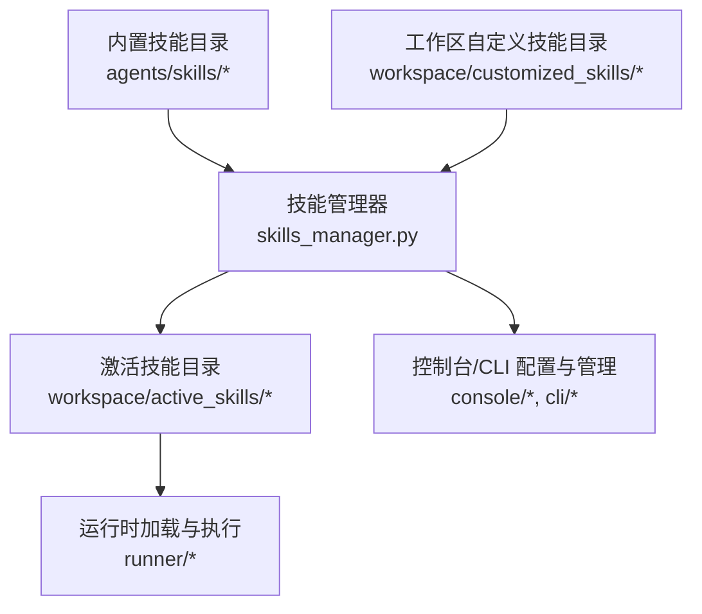
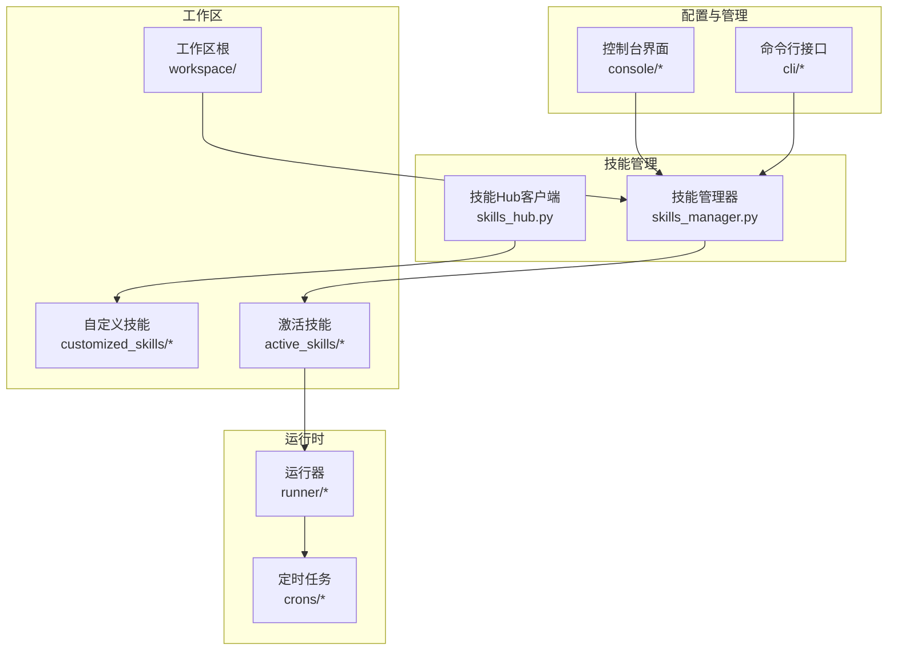
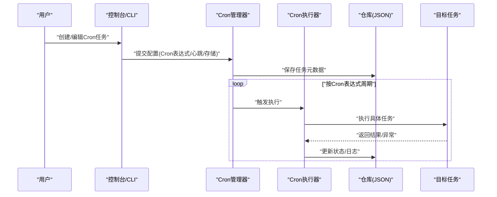
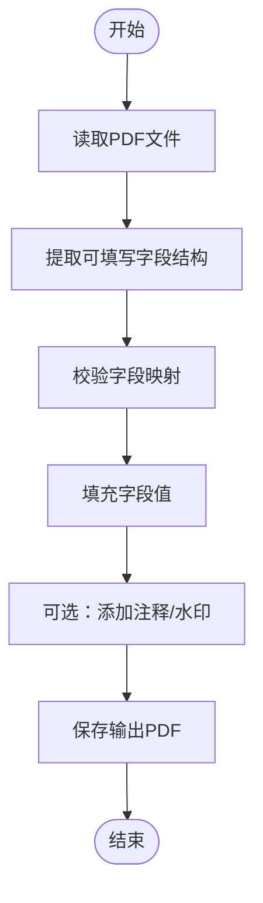
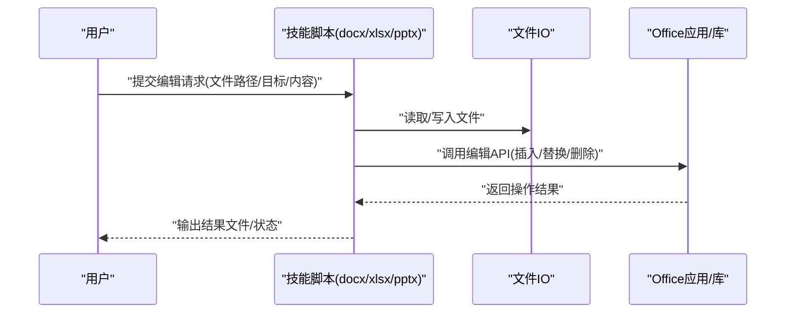
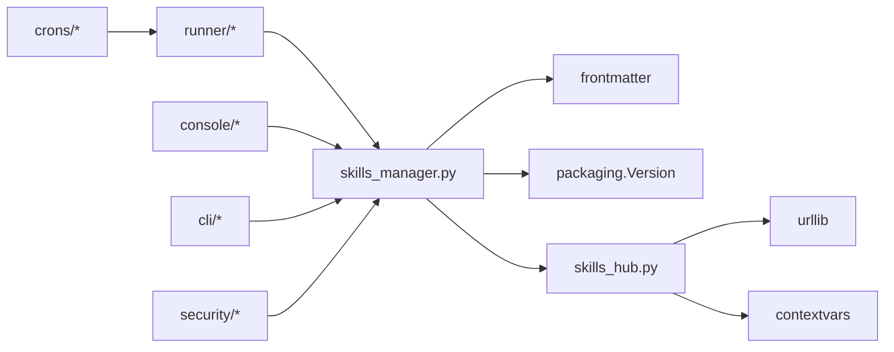

# 内置技能

<cite>
**本文引用的文件**
- [skills_hub.py](file://src/copaw/agents/skills_hub.py)
- [skills_manager.py](file://src/copaw/agents/skills_manager.py)
- [cron/SKILL.md](file://src/copaw/agents/skills/cron/SKILL.md)
- [pdf/SKILL.md](file://src/copaw/agents/skills/pdf/SKILL.md)
- [docx/SKILL.md](file://src/copaw/agents/skills/docx/SKILL.md)
- [xlsx/SKILL.md](file://src/copaw/agents/skills/xlsx/SKILL.md)
- [pptx/SKILL.md](file://src/copaw/agents/skills/pptx/SKILL.md)
- [news/SKILL.md](file://src/copaw/agents/skills/news/SKILL.md)
- [file_reader/SKILL.md](file://src/copaw/agents/skills/file_reader/SKILL.md)
- [himalaya/SKILL.md](file://src/copaw/agents/skills/himalaya/SKILL.md)
- [pdf/forms.md](file://src/copaw/agents/skills/pdf/forms.md)
- [pdf/reference.md](file://src/copaw/agents/skills/pdf/reference.md)
- [docx/editing.md](file://src/copaw/agents/skills/docx/editing.md)
- [docx/pptxgenjs.md](file://src/copaw/agents/skills/docx/pptxgenjs.md)
- [xlsx/editing.md](file://src/copaw/agents/skills/xlsx/editing.md)
- [pptx/editing.md](file://src/copaw/agents/skills/pptx/editing.md)
- [himalaya/references/configuration.md](file://src/copaw/agents/skills/himalaya/references/configuration.md)
- [console/src/api/modules/skill.ts](file://console/src/api/modules/skill.ts)
- [console/src/pages/Agent/Skills/index.tsx](file://console/src/pages/Agent/Skills/index.tsx)
- [console/src/pages/Agent/Skills/components/SkillCard.tsx](file://console/src/pages/Agent/Skills/components/SkillCard.tsx)
- [console/src/pages/Agent/Skills/components/SkillDrawer.tsx](file://console/src/pages/Agent/Skills/components/SkillDrawer.tsx)
- [console/src/pages/Agent/Skills/useSkills.ts](file://console/src/pages/Agent/Skills/useSkills.ts)
- [console/src/pages/Settings/Security/useSkillScanner.ts](file://console/src/pages/Settings/Security/useSkillScanner.ts)
- [console/src/pages/Settings/Security/useToolGuard.ts](file://console/src/pages/Settings/Security/useToolGuard.ts)
- [security/skill_scanner/scanner.py](file://src/copaw/security/skill_scanner/scanner.py)
- [security/tool_guard/engine.py](file://src/copaw/security/tool_guard/engine.py)
- [agents/hooks/bootstrap.py](file://src/copaw/agents/hooks/bootstrap.py)
- [agents/hooks/memory_compaction.py](file://src/copaw/agents/hooks/memory_compaction.py)
- [agents/memory/memory_manager.py](file://src/copaw/agents/memory/memory_manager.py)
- [agents/tools/file_io.py](file://src/copaw/agents/tools/file_io.py)
- [agents/tools/file_search.py](file://src/copaw/agents/tools/file_search.py)
- [agents/tools/get_current_time.py](file://src/copaw/agents/tools/get_current_time.py)
- [agents/tools/view_image.py](file://src/copaw/agents/tools/view_image.py)
- [agents/tools/shell.py](file://src/copaw/agents/tools/shell.py)
- [agents/tools/send_file.py](file://src/copaw/agents/tools/send_file.py)
- [agents/tools/desktop_screenshot.py](file://src/copaw/agents/tools/desktop_screenshot.py)
- [agents/tools/browser_control.py](file://src/copaw/agents/tools/browser_control.py)
- [agents/tools/browser_snapshot.py](file://src/copaw/agents/tools/browser_snapshot.py)
- [agents/tools/utils.py](file://src/copaw/agents/tools/utils.py)
- [agents/tools/memory_search.py](file://src/copaw/agents/tools/memory_search.py)
- [agents/tools/get_token_usage.py](file://src/copaw/agents/tools/get_token_usage.py)
- [agents/tools/view_image.py](file://src/copaw/agents/tools/view_image.py)
- [agents/utils/file_handling.py](file://src/copaw/agents/utils/file_handling.py)
- [agents/utils/message_processing.py](file://src/copaw/agents/utils/message_processing.py)
- [agents/utils/setup_utils.py](file://src/copaw/agents/utils/setup_utils.py)
- [agents/utils/tool_message_utils.py](file://src/copaw/agents/utils/tool_message_utils.py)
- [app/routers/skills.py](file://src/copaw/app/routers/skills.py)
- [app/runner/runner.py](file://src/copaw/app/runner/runner.py)
- [app/runner/manager.py](file://src/copaw/app/runner/manager.py)
- [app/runner/command_dispatch.py](file://src/copaw/app/runner/command_dispatch.py)
- [app/runner/models.py](file://src/copaw/app/runner/models.py)
- [app/runner/task_tracker.py](file://src/copaw/app/runner/task_tracker.py)
- [app/runner/query_error_dump.py](file://src/copaw/app/runner/query_error_dump.py)
- [app/runner/repo/base.py](file://src/copaw/app/runner/repo/base.py)
- [app/runner/repo/json_repo.py](file://src/copaw/app/runner/repo/json_repo.py)
- [app/crons/manager.py](file://src/copaw/app/crons/manager.py)
- [app/crons/executor.py](file://src/copaw/app/crons/executor.py)
- [app/crons/api.py](file://src/copaw/app/crons/api.py)
- [app/crons/models.py](file://src/copaw/app/crons/models.py)
- [app/crons/repo/base.py](file://src/copaw/app/crons/repo/base.py)
- [app/crons/repo/json_repo.py](file://src/copaw/app/crons/repo/json_repo.py)
- [app/crons/heartbeat.py](file://src/copaw/app/crons/heartbeat.py)
- [cli/skills_cmd.py](file://src/copaw/cli/skills_cmd.py)
- [cli/cron_cmd.py](file://src/copaw/cli/cron_cmd.py)
- [app/_app.py](file://src/copaw/app/_app.py)
- [agents/__init__.py](file://src/copaw/agents/__init__.py)
- [agents/schema.py](file://src/copaw/agents/schema.py)
- [agents/command_handler.py](file://src/copaw/agents/command_handler.py)
- [agents/model_factory.py](file://src/copaw/agents/model_factory.py)
- [agents/react_agent.py](file://src/copaw/agents/react_agent.py)
- [agents/routing_chat_model.py](file://src/copaw/agents/routing_chat_model.py)
- [agents/prompt.py](file://src/copaw/agents/prompt.py)
- [agents/tool_guard_mixin.py](file://src/copaw/agents/tool_guard_mixin.py)
- [agents/memory/agent_md_manager.py](file://src/copaw/agents/memory/agent_md_manager.py)
- [agents/memory/memory_manager.py](file://src/copaw/agents/memory/memory_manager.py)
- [agents/utils/file_handling.py](file://src/copaw/agents/utils/file_handling.py)
- [agents/utils/message_processing.py](file://src/copaw/agents/utils/message_processing.py)
- [agents/utils/setup_utils.py](file://src/copaw/agents/utils/setup_utils.py)
- [agents/utils/tool_message_utils.py](file://src/copaw/agents/utils/tool_message_utils.py)
- [agents/hooks/bootstrap.py](file://src/copaw/agents/hooks/bootstrap.py)
- [agents/hooks/memory_compaction.py](file://src/copaw/agents/hooks/memory_compaction.py)
- [agents/memory/memory_manager.py](file://src/copaw/agents/memory/memory_manager.py)
- [agents/tools/file_io.py](file://src/copaw/agents/tools/file_io.py)
- [agents/tools/file_search.py](file://src/copaw/agents/tools/file_search.py)
- [agents/tools/get_current_time.py](file://src/copaw/agents/tools/get_current_time.py)
- [agents/tools/view_image.py](file://src/copaw/agents/tools/view_image.py)
- [agents/tools/shell.py](file://src/copaw/agents/tools/shell.py)
- [agents/tools/send_file.py](file://src/copaw/agents/tools/send_file.py)
- [agents/tools/desktop_screenshot.py](file://src/copaw/agents/tools/desktop_screenshot.py)
- [agents/tools/browser_control.py](file://src/copaw/agents/tools/browser_control.py)
- [agents/tools/browser_snapshot.py](file://src/copaw/agents/tools/browser_snapshot.py)
- [agents/tools/utils.py](file://src/copaw/agents/tools/utils.py)
- [agents/tools/memory_search.py](file://src/copaw/agents/tools/memory_search.py)
- [agents/tools/get_token_usage.py](file://src/copaw/agents/tools/get_token_usage.py)
- [agents/tools/view_image.py](file://src/copaw/agents/tools/view_image.py)
- [agents/utils/file_handling.py](file://src/copaw/agents/utils/file_handling.py)
- [agents/utils/message_processing.py](file://src/copaw/agents/utils/message_processing.py)
- [agents/utils/setup_utils.py](file://src/copaw/agents/utils/setup_utils.py)
- [agents/utils/tool_message_utils.py](file://src/copaw/agents/utils/tool_message_utils.py)
- [agents/hooks/bootstrap.py](file://src/copaw/agents/hooks/bootstrap.py)
- [agents/hooks/memory_compaction.py](file://src/copaw/agents/hooks/memory_compaction.py)
- [agents/memory/memory_manager.py](file://src/copaw/agents/memory/memory_manager.py)
- [agents/tools/file_io.py](file://src/copaw/agents/tools/file_io.py)
- [agents/tools/file_search.py](file://src/copaw/agents/tools/file_search.py)
- [agents/tools/get_current_time.py](file://src/copaw/agents/tools/get_current_time.py)
- [agents/tools/view_image.py](file://src/copaw/agents/tools/view_image.py)
- [agents/tools/shell.py](file://src/copaw/agents/tools/shell.py)
- [agents/tools/send_file.py](file://src/copaw/agents/tools/send_file.py)
- [agents/tools/desktop_screenshot.py](file://src/copaw/agents/tools/desktop_screenshot.py)
- [agents/tools/browser_control.py](file://src/copaw/agents/tools/browser_control.py)
- [agents/tools/browser_snapshot.py](file://src/copaw/agents/tools/browser_snapshot.py)
- [agents/tools/utils.py](file://src/copaw/agents/tools/utils.py)
- [agents/tools/memory_search.py](file://src/copaw/agents/tools/memory_search.py)
- [agents/tools/get_token_usage.py](file://src/copaw/agents/tools/get_token_usage.py)
- [agents/tools/view_image.py](file://src/copaw/agents/tools/view_image.py)
- [agents/utils/file_handling.py](file://src/copaw/agents/utils/file_handling.py)
- [agents/utils/message_processing.py](file://src/copaw/agents/utils/message_processing.py)
- [agents/utils/setup_utils.py](file://src/copaw/agents/utils/setup_utils.py)
- [agents/utils/tool_message_utils.py](file://src/copaw/agents/utils/tool_message_utils.py)
</cite>

## 目录
1. [简介](#简介)
2. [项目结构](#项目结构)
3. [核心组件](#核心组件)
4. [架构总览](#架构总览)
5. [详细组件分析](#详细组件分析)
6. [依赖分析](#依赖分析)
7. [性能考虑](#性能考虑)
8. [故障排查指南](#故障排查指南)
9. [结论](#结论)
10. [附录](#附录)

## 简介
本文件面向CoPaw内置技能系统的使用者与维护者，系统性梳理并说明以下内置技能的实现原理、配置参数、API接口、使用场景与限制条件：定时任务技能（cron）、PDF处理技能、Office文档处理技能（docx、xlsx、pptx）、新闻聚合技能、文件读取技能、以及Himalaya技能。文档同时提供启用方式、参数配置、错误处理与性能优化建议，并通过图示展示关键流程与数据流。

## 项目结构
CoPaw的内置技能以“技能包”形式组织，每个技能包含一个描述文件（SKILL.md）及可选的脚本与参考资源目录（scripts、references）。技能管理器负责从代码内置目录与工作区自定义目录同步到“激活技能”目录，并在运行时加载与执行。

图表来源
- [skills_manager.py:183-260](file://src/copaw/agents/skills_manager.py#L183-L260)
- [skills_manager.py:344-392](file://src/copaw/agents/skills_manager.py#L344-L392)

章节来源
- [skills_manager.py:63-85](file://src/copaw/agents/skills_manager.py#L63-L85)
- [skills_manager.py:183-260](file://src/copaw/agents/skills_manager.py#L183-L260)
- [skills_manager.py:344-392](file://src/copaw/agents/skills_manager.py#L344-L392)

## 核心组件
- 技能管理器（SkillService）
  - 负责扫描、合并、同步内置与自定义技能，生成可激活技能集合；支持创建新技能、导入ZIP等。
  - 关键职责：读取SKILL.md、构建references/scripts树、校验与写入文件、版本比较与回写。
- 技能仓库（Hub）
  - 提供从Hub源拉取、解析、解压与安装技能的能力，含超时、重试、速率限制处理。
- 运行时执行（Runner）
  - 将激活技能目录映射到运行环境，按需调用脚本或工具函数。
- 定时任务（Cron）
  - 基于Cron表达式周期性触发任务，支持心跳与持久化存储。
- 控制台与CLI
  - 提供技能列表、启用/禁用、配置与安全扫描入口。

章节来源
- [skills_manager.py:627-800](file://src/copaw/agents/skills_manager.py#L627-L800)
- [skills_hub.py:225-335](file://src/copaw/agents/skills_hub.py#L225-L335)
- [app/runner/runner.py](file://src/copaw/app/runner/runner.py)
- [app/crons/manager.py](file://src/copaw/app/crons/manager.py)

## 架构总览
下图展示了技能生命周期：从内置/自定义目录到激活目录，再到运行时执行与控制台/CLI交互。

图表来源
- [skills_manager.py:627-800](file://src/copaw/agents/skills_manager.py#L627-L800)
- [skills_hub.py:488-571](file://src/copaw/agents/skills_hub.py#L488-L571)
- [app/runner/runner.py](file://src/copaw/app/runner/runner.py)
- [app/crons/manager.py](file://src/copaw/app/crons/manager.py)

## 详细组件分析

### 定时任务技能（cron）
- 功能概述
  - 基于Cron表达式周期性触发任务，支持心跳与持久化存储，适用于周期性检查、清理、备份等场景。
- 实现要点
  - 表达式解析与调度：由Cron管理器与执行器负责，支持JSON存储与心跳检测。
  - 任务持久化：通过仓库层保存任务状态，便于重启后恢复。
- 配置参数
  - Cron表达式：定义触发频率。
  - 心跳间隔：用于健康监测与告警。
  - 存储路径：任务状态与日志的落盘位置。
- 使用场景
  - 定时清理临时文件、定期备份、周期性数据同步。
- 限制与注意事项
  - Cron表达式必须合法，否则调度失败。
  - 心跳与存储路径需具备写权限。
- 错误处理
  - 解析失败、执行异常、存储失败均会记录日志并尝试重试。
- 性能优化
  - 合理设置表达式，避免过于频繁的任务；对耗时任务进行异步化。

图表来源
- [app/crons/manager.py](file://src/copaw/app/crons/manager.py)
- [app/crons/executor.py](file://src/copaw/app/crons/executor.py)
- [app/crons/repo/json_repo.py](file://src/copaw/app/crons/repo/json_repo.py)
- [app/crons/api.py](file://src/copaw/app/crons/api.py)

章节来源
- [cron/SKILL.md](file://src/copaw/agents/skills/cron/SKILL.md)
- [app/crons/manager.py](file://src/copaw/app/crons/manager.py)
- [app/crons/executor.py](file://src/copaw/app/crons/executor.py)
- [app/crons/repo/json_repo.py](file://src/copaw/app/crons/repo/json_repo.py)
- [app/crons/api.py](file://src/copaw/app/crons/api.py)

### PDF处理技能
- 功能概述
  - 支持PDF文档解析、可填写字段提取与表单填充，以及基于注释的表单填充。
- 实现要点
  - 字段信息提取：解析PDF中的可填写字段结构，识别名称、类型、默认值等。
  - 表单填充：根据输入数据自动填写字段，支持图片水印、验证图像生成等辅助功能。
  - 参考与规范：提供字段清单与参考文档，确保填充一致性。
- 配置参数
  - 输入PDF路径、输出PDF路径、字段映射字典、是否生成验证图像等。
- 使用场景
  - 自动化表单填写、批量数据录入、合规性验证。
- 限制与注意事项
  - 需要可填写字段的PDF；复杂布局可能影响识别精度。
- 错误处理
  - 字段缺失、格式不匹配、渲染失败等情况会抛出明确错误。
- 性能优化
  - 对大文件分页处理，减少内存占用；缓存验证图像以复用。

图表来源
- [pdf/SKILL.md](file://src/copaw/agents/skills/pdf/SKILL.md)
- [pdf/forms.md](file://src/copaw/agents/skills/pdf/forms.md)
- [pdf/reference.md](file://src/copaw/agents/skills/pdf/reference.md)

章节来源
- [pdf/SKILL.md](file://src/copaw/agents/skills/pdf/SKILL.md)
- [pdf/forms.md](file://src/copaw/agents/skills/pdf/forms.md)
- [pdf/reference.md](file://src/copaw/agents/skills/pdf/reference.md)

### Office文档处理技能（docx、xlsx、pptx）
- 功能概述
  - 提供Word、Excel、PowerPoint的文档编辑、内容修改、缩略图生成、幻灯片新增等功能。
- 实现要点
  - Word：支持段落、表格、样式修改与审阅操作（如接受修订、评论）。
  - Excel：支持单元格计算与重计算。
  - PowerPoint：支持新增幻灯片、清理内容、生成缩略图。
- 配置参数
  - 输入/输出文件路径、目标对象（段落/单元格/幻灯片索引）、样式/内容模板等。
- 使用场景
  - 自动生成报告、批量数据填充、演示文稿自动化。
- 限制与注意事项
  - 复杂格式可能需要额外处理；注意兼容性与版本差异。
- 错误处理
  - 文件损坏、对象不存在、权限不足等会给出明确提示。
- 性能优化
  - 分批处理大文档；避免重复序列化；缓存中间结果。

图表来源
- [docx/SKILL.md](file://src/copaw/agents/skills/docx/SKILL.md)
- [xlsx/SKILL.md](file://src/copaw/agents/skills/xlsx/SKILL.md)
- [pptx/SKILL.md](file://src/copaw/agents/skills/pptx/SKILL.md)
- [docx/editing.md](file://src/copaw/agents/skills/docx/editing.md)
- [xlsx/editing.md](file://src/copaw/agents/skills/xlsx/editing.md)
- [pptx/editing.md](file://src/copaw/agents/skills/pptx/editing.md)
- [docx/pptxgenjs.md](file://src/copaw/agents/skills/docx/pptxgenjs.md)

章节来源
- [docx/SKILL.md](file://src/copaw/agents/skills/docx/SKILL.md)
- [xlsx/SKILL.md](file://src/copaw/agents/skills/xlsx/SKILL.md)
- [pptx/SKILL.md](file://src/copaw/agents/skills/pptx/SKILL.md)
- [docx/editing.md](file://src/copaw/agents/skills/docx/editing.md)
- [xlsx/editing.md](file://src/copaw/agents/skills/xlsx/editing.md)
- [pptx/editing.md](file://src/copaw/agents/skills/pptx/editing.md)
- [docx/pptxgenjs.md](file://src/copaw/agents/skills/docx/pptxgenjs.md)

### 新闻聚合技能
- 功能概述
  - 从多个来源抓取并整理新闻信息，支持去重、分类与摘要生成。
- 实现要点
  - 数据抓取：对接RSS/Atom/网页等源。
  - 信息清洗：去除广告、冗余内容，标准化标题与摘要。
  - 结果输出：统一格式（文本/JSON），便于后续消费。
- 配置参数
  - 源地址列表、过滤规则、输出路径、并发度等。
- 使用场景
  - 内容聚合、监控热点事件、生成简报。
- 限制与注意事项
  - 遵守robots.txt与服务条款；对反爬虫策略需有应对方案。
- 错误处理
  - 网络超时、解析失败、编码问题等均有降级策略。
- 性能优化
  - 并发抓取与限速；缓存热点源；增量更新。

章节来源
- [news/SKILL.md](file://src/copaw/agents/skills/news/SKILL.md)

### 文件读取技能
- 功能概述
  - 提供对本地文件的安全访问能力，支持多种文件类型的读取与预览。
- 实现要点
  - 文件IO封装：统一读取、写入、搜索与预览接口。
  - 安全策略：白名单路径、大小限制、隐藏文件过滤。
- 配置参数
  - 允许读取的目录、最大文件大小、允许的文件扩展名等。
- 使用场景
  - 日志查看、配置文件读取、文档预览。
- 限制与注意事项
  - 严格限制访问范围，避免敏感文件泄露。
- 错误处理
  - 权限不足、文件过大、路径不合法等均会拒绝。
- 性能优化
  - 流式读取大文件；缓存常用小文件；压缩传输。

章节来源
- [file_reader/SKILL.md](file://src/copaw/agents/skills/file_reader/SKILL.md)
- [agents/tools/file_io.py](file://src/copaw/agents/tools/file_io.py)
- [agents/tools/file_search.py](file://src/copaw/agents/tools/file_search.py)

### Himalaya技能
- 功能概述
  - 提供特定领域的知识检索与问答能力，支持配置化参数与上下文增强。
- 实现要点
  - 配置驱动：通过配置文件控制检索策略、上下文长度、输出格式等。
  - 上下文管理：结合记忆模块与钩子，提升回答质量。
- 配置参数
  - 检索器参数、上下文窗口、输出模板、安全阈值等。
- 使用场景
  - 知识库问答、FAQ生成、智能客服。
- 限制与注意事项
  - 需要足够的语料与合适的检索策略；注意隐私与版权。
- 错误处理
  - 检索失败、上下文过长、模型调用异常等均有兜底。
- 性能优化
  - 向量化检索、分段召回、缓存热门问题。

章节来源
- [himalaya/SKILL.md](file://src/copaw/agents/skills/himalaya/SKILL.md)
- [himalaya/references/configuration.md](file://src/copaw/agents/skills/himalaya/references/configuration.md)
- [agents/hooks/bootstrap.py](file://src/copaw/agents/hooks/bootstrap.py)
- [agents/hooks/memory_compaction.py](file://src/copaw/agents/hooks/memory_compaction.py)
- [agents/memory/memory_manager.py](file://src/copaw/agents/memory/memory_manager.py)

## 依赖分析
- 技能管理器依赖
  - frontmatter：解析SKILL.md的YAML前言。
  - packaging.Version：比较内置技能版本。
  - shutil/zipfile：复制与解压技能包。
- Hub客户端依赖
  - urllib：HTTP请求、重试、超时、速率限制。
  - contextvars：取消检查与上下文传递。
- 运行时依赖
  - runner：任务执行与状态跟踪。
  - crons：定时任务调度与持久化。
- 控制台/CLI依赖
  - API模块：技能列表、启用/禁用、配置。
  - 安全扫描：技能扫描与工具守卫。

图表来源
- [skills_manager.py:13-14](file://src/copaw/agents/skills_manager.py#L13-L14)
- [skills_manager.py:142-161](file://src/copaw/agents/skills_manager.py#L142-L161)
- [skills_hub.py:167-180](file://src/copaw/agents/skills_hub.py#L167-L180)
- [skills_hub.py:108-129](file://src/copaw/agents/skills_hub.py#L108-L129)
- [app/runner/runner.py](file://src/copaw/app/runner/runner.py)
- [app/crons/manager.py](file://src/copaw/app/crons/manager.py)

章节来源
- [skills_manager.py:13-14](file://src/copaw/agents/skills_manager.py#L13-L14)
- [skills_manager.py:142-161](file://src/copaw/agents/skills_manager.py#L142-L161)
- [skills_hub.py:167-180](file://src/copaw/agents/skills_hub.py#L167-L180)
- [skills_hub.py:108-129](file://src/copaw/agents/skills_hub.py#L108-L129)

## 性能考虑
- 技能同步
  - 批量同步时优先覆盖差异，避免重复写入；对自定义技能变更进行快速传播。
- Hub拉取
  - 设置合理的超时与重试；对GitHub API进行令牌鉴权以规避速率限制。
- 文档处理
  - 大文件采用流式处理与分页；缓存中间结果与验证图像。
- 定时任务
  - 合理设置Cron表达式，避免高并发冲突；对耗时任务异步化。
- 文件读取
  - 限制文件大小与扩展名；使用流式读取与压缩传输。

## 故障排查指南
- 技能未显示或无法启用
  - 检查SKILL.md是否包含必需的YAML前言字段；确认激活目录存在且可写。
- Hub安装失败
  - 检查网络与超时设置；若出现429/5xx，调整重试与退避策略；为GitHub设置访问令牌。
- PDF/Office处理异常
  - 确认输入文件有效且具有相应权限；检查字段映射与版本兼容性。
- 定时任务不触发
  - 校验Cron表达式合法性；检查存储路径与心跳配置。
- 控制台/CLI无响应
  - 查看日志与网络状态；确认API端点可达。

章节来源
- [skills_manager.py:421-470](file://src/copaw/agents/skills_manager.py#L421-L470)
- [skills_hub.py:225-335](file://src/copaw/agents/skills_hub.py#L225-L335)
- [app/crons/manager.py](file://src/copaw/app/crons/manager.py)

## 结论
CoPaw内置技能系统通过清晰的目录结构、完善的管理与运行机制，实现了从技能发现、同步、安全扫描到执行的全链路闭环。针对不同领域（文档、定时、文件、新闻、知识库）提供了可扩展的技能框架，既满足通用需求，又允许自定义扩展与安全加固。

## 附录
- 控制台与CLI入口
  - 技能管理：控制台“Agent/Skills”页面与CLI命令。
  - 定时任务：控制台“Control/CronJobs”与CLI命令。
- 安全扫描
  - 技能扫描与工具守卫，保障技能与工具使用的安全性。

章节来源
- [console/src/pages/Agent/Skills/index.tsx](file://console/src/pages/Agent/Skills/index.tsx)
- [console/src/pages/Agent/Skills/components/SkillCard.tsx](file://console/src/pages/Agent/Skills/components/SkillCard.tsx)
- [console/src/pages/Agent/Skills/components/SkillDrawer.tsx](file://console/src/pages/Agent/Skills/components/SkillDrawer.tsx)
- [console/src/pages/Agent/Skills/useSkills.ts](file://console/src/pages/Agent/Skills/useSkills.ts)
- [console/src/api/modules/skill.ts](file://console/src/api/modules/skill.ts)
- [cli/skills_cmd.py](file://src/copaw/cli/skills_cmd.py)
- [cli/cron_cmd.py](file://src/copaw/cli/cron_cmd.py)
- [console/src/pages/Settings/Security/useSkillScanner.ts](file://console/src/pages/Settings/Security/useSkillScanner.ts)
- [console/src/pages/Settings/Security/useToolGuard.ts](file://console/src/pages/Settings/Security/useToolGuard.ts)
- [security/skill_scanner/scanner.py](file://src/copaw/security/skill_scanner/scanner.py)
- [security/tool_guard/engine.py](file://src/copaw/security/tool_guard/engine.py)