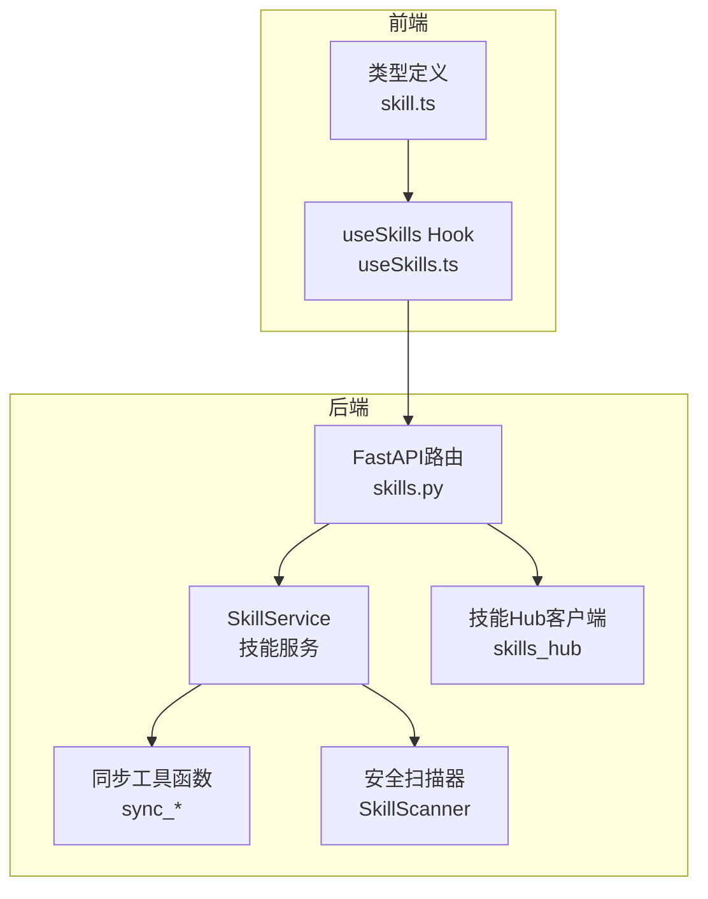
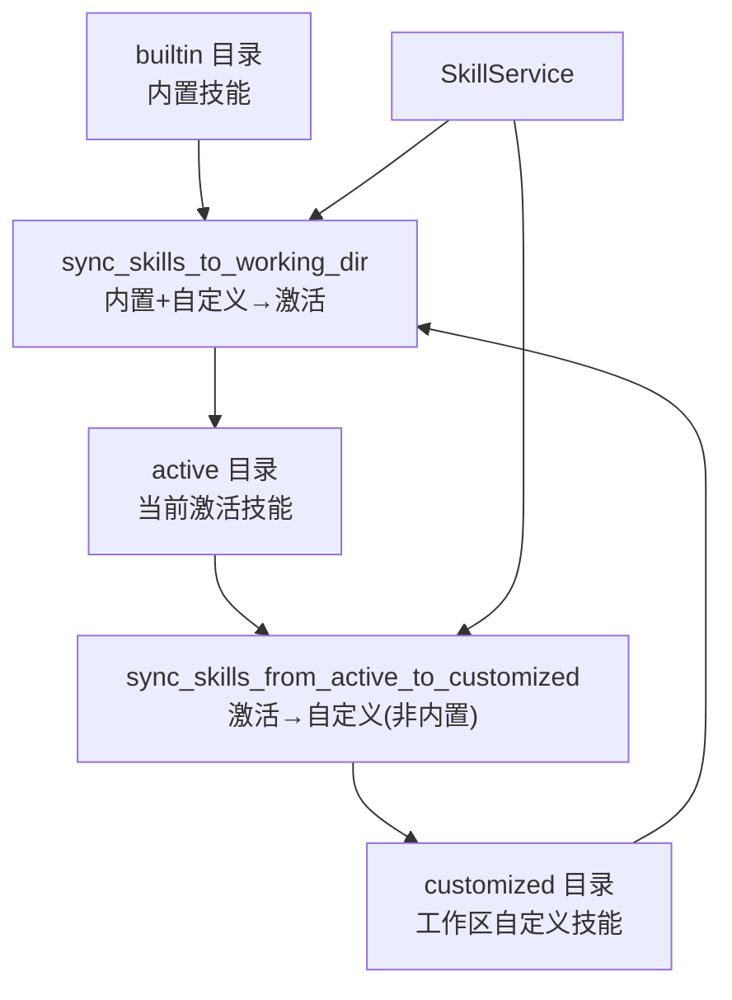
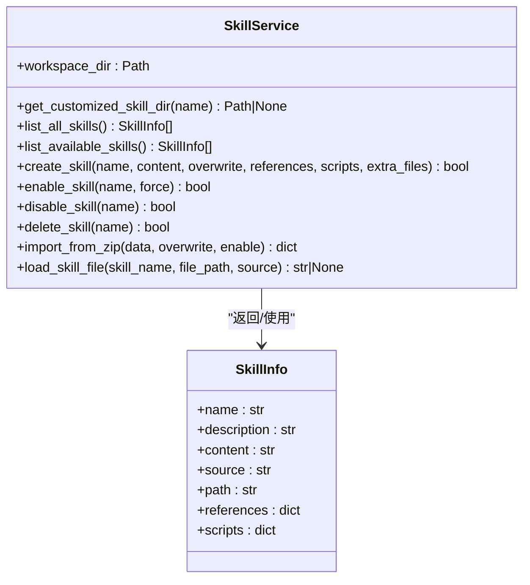
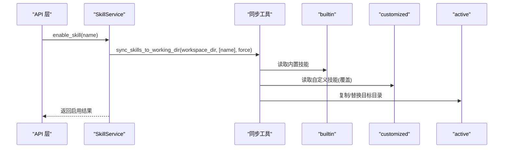
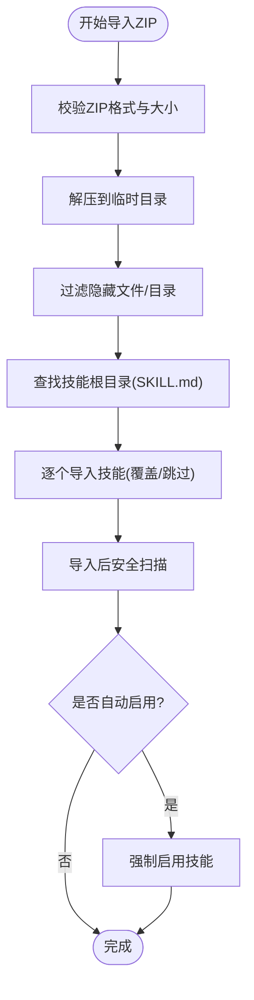
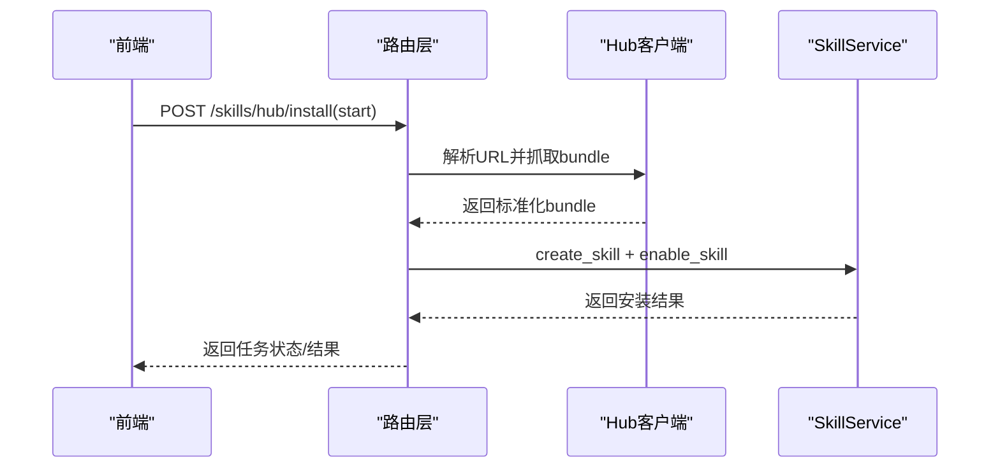
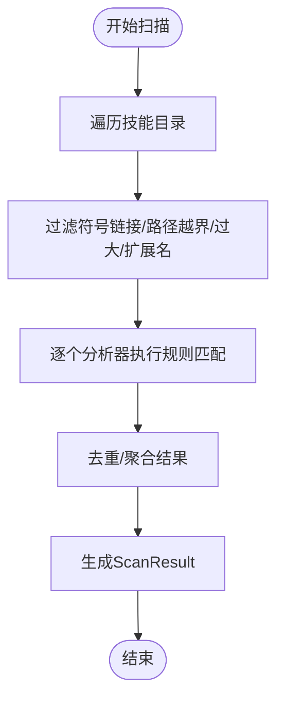
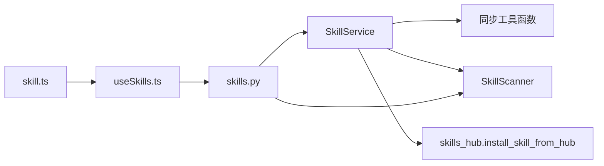

# 技能管理器

<cite>
**本文档引用的文件**
- [skills_manager.py](file://src/copaw/agents/skills_manager.py)
- [skills.py](file://src/copaw/app/routers/skills.py)
- [scanner.py](file://src/copaw/security/skill_scanner/scanner.py)
- [skills_hub.py](file://src/copaw/agents/skills_hub.py)
- [useSkills.ts](file://console/src/pages/Agent/Skills/useSkills.ts)
- [skill.ts](file://console/src/api/types/skill.ts)
</cite>

## 目录
1. [简介](#简介)
2. [项目结构](#项目结构)
3. [核心组件](#核心组件)
4. [架构总览](#架构总览)
5. [详细组件分析](#详细组件分析)
6. [依赖分析](#依赖分析)
7. [性能考虑](#性能考虑)
8. [故障排除指南](#故障排除指南)
9. [结论](#结论)
10. [附录](#附录)

## 简介
本文件面向CoPaw的技能管理器，系统性阐述SkillService类的完整实现，涵盖技能的发现、验证、加载与卸载的全生命周期管理；详解技能目录结构（builtin、customized、active）的设计理念与工作机制；说明技能同步机制（从内置到活动技能的同步流程、自定义覆盖内置的优先级规则、版本升级与回滚机制）；介绍技能导入导出功能（ZIP包导入的安全验证、文件树结构创建、隐藏文件过滤等）；并提供技能管理API的使用示例（列出技能、创建技能、同步技能等）。

## 项目结构
技能管理器由后端Python服务与前端控制台两部分组成：
- 后端核心：位于src/copaw/agents/skills_manager.py，提供技能的读写、同步、扫描与导入导出能力；路由层位于src/copaw/app/routers/skills.py，暴露REST API；安全扫描位于src/copaw/security/skill_scanner/scanner.py；技能Hub集成位于src/copaw/agents/skills_hub.py。
- 前端控制台：位于console/src/pages/Agent/Skills/useSkills.ts，封装技能列表、创建、启用/禁用、删除、上传ZIP、从Hub安装等交互逻辑；类型定义位于console/src/api/types/skill.ts。

图表来源
- [skills_manager.py:627-1206](file://src/copaw/agents/skills_manager.py#L627-L1206)
- [skills.py:122-753](file://src/copaw/app/routers/skills.py#L122-L753)
- [scanner.py:76-319](file://src/copaw/security/skill_scanner/scanner.py#L76-L319)
- [skills_hub.py:1567-1619](file://src/copaw/agents/skills_hub.py#L1567-L1619)
- [useSkills.ts:1-411](file://console/src/pages/Agent/Skills/useSkills.ts#L1-L411)
- [skill.ts:1-30](file://console/src/api/types/skill.ts#L1-L30)

章节来源
- [skills_manager.py:1-1206](file://src/copaw/agents/skills_manager.py#L1-L1206)
- [skills.py:1-753](file://src/copaw/app/routers/skills.py#L1-L753)
- [scanner.py:1-319](file://src/copaw/security/skill_scanner/scanner.py#L1-L319)
- [skills_hub.py:1-1619](file://src/copaw/agents/skills_hub.py#L1-L1619)
- [useSkills.ts:1-411](file://console/src/pages/Agent/Skills/useSkills.ts#L1-L411)
- [skill.ts:1-30](file://console/src/api/types/skill.ts#L1-L30)

## 核心组件
- SkillService：面向工作区的技能服务，负责技能的创建、启用/禁用、删除、导入ZIP、从Hub安装、文件读取等。
- 同步工具函数：sync_skills_to_working_dir、sync_skills_from_active_to_customized等，负责builtin/customized/active三目录之间的同步与覆盖策略。
- 安全扫描器SkillScanner：对技能包进行文件发现、规则扫描与结果聚合。
- 技能Hub客户端：解析多源URL，抓取技能包内容，标准化为可导入的bundle。
- 路由层：提供REST API，如列出技能、创建技能、启用/禁用、上传ZIP、从Hub安装等。
- 前端Hook：useSkills.ts封装了技能管理的UI交互与错误处理。

章节来源
- [skills_manager.py:627-1206](file://src/copaw/agents/skills_manager.py#L627-L1206)
- [skills.py:122-753](file://src/copaw/app/routers/skills.py#L122-L753)
- [scanner.py:76-319](file://src/copaw/security/skill_scanner/scanner.py#L76-L319)
- [skills_hub.py:1567-1619](file://src/copaw/agents/skills_hub.py#L1567-L1619)
- [useSkills.ts:1-411](file://console/src/pages/Agent/Skills/useSkills.ts#L1-L411)

## 架构总览
技能管理器采用“三层目录 + 两条同步流水线”的架构：
- 目录层：builtin（内置技能）、customized（工作区自定义技能）、active（当前激活技能）。
- 同步层：从builtin与customized汇聚到active；从active回写到customized（非内置技能首次导入时）。
- 安全层：在关键节点（创建、导入、启用前）执行安全扫描，阻断高危风险。

图表来源
- [skills_manager.py:183-341](file://src/copaw/agents/skills_manager.py#L183-L341)

章节来源
- [skills_manager.py:183-341](file://src/copaw/agents/skills_manager.py#L183-L341)

## 详细组件分析

### SkillService 类与生命周期管理
SkillService围绕工作区路径进行技能管理，提供以下核心方法：
- list_all_skills：从builtin与customized读取技能，去重后返回（customized优先）。
- list_available_skills：仅读取active目录中的技能。
- create_skill：校验SKILL.md YAML Front Matter，创建技能目录与子树（references/scripts），并执行安全扫描。
- enable_skill/disable_skill：启用/禁用技能，支持强制覆盖；启用前进行安全扫描。
- delete_skill：删除customized中的技能（内置不可删）。
- import_from_zip：校验ZIP安全性（大小、路径、符号链接），解压后批量导入技能，支持自动启用。
- load_skill_file：安全读取builtin/customized中references/scripts下的文件，防止路径穿越。

图表来源
- [skills_manager.py:28-62](file://src/copaw/agents/skills_manager.py#L28-L62)
- [skills_manager.py:627-1206](file://src/copaw/agents/skills_manager.py#L627-L1206)

章节来源
- [skills_manager.py:627-1206](file://src/copaw/agents/skills_manager.py#L627-L1206)

### 技能目录结构与设计理念
- builtin：内置技能目录，只读，包含官方或默认技能模板。
- customized：工作区自定义技能目录，用户创建/导入的技能存放于此，可覆盖builtin同名技能。
- active：当前激活的技能集合，运行时实际使用的技能副本。

设计要点：
- 列表展示时，customized覆盖builtin同名技能，确保用户自定义优先。
- 同步时，先收集builtin，再以customized覆盖，保证用户修改优先于内置更新。
- 版本升级：当active中技能来自builtin且版本更高时，回写builtin至active，实现“内置升级”。

章节来源
- [skills_manager.py:63-75](file://src/copaw/agents/skills_manager.py#L63-L75)
- [skills_manager.py:673-685](file://src/copaw/agents/skills_manager.py#L673-L685)
- [skills_manager.py:297-318](file://src/copaw/agents/skills_manager.py#L297-L318)

### 技能同步机制
- 内置→激活同步：sync_skills_to_working_dir按customized覆盖builtin的顺序合并，支持按需同步与强制覆盖。
- 激活→自定义回写：sync_skills_from_active_to_customized仅对非builtin技能首次回写，避免破坏内置一致性；同时检测版本升级，必要时将builtin更新回active。
- 优先级与去重：list_all_skills对同名技能以customized为准，确保UI/API展示正确。

图表来源
- [skills.py:626-693](file://src/copaw/app/routers/skills.py#L626-L693)
- [skills_manager.py:183-260](file://src/copaw/agents/skills_manager.py#L183-L260)

章节来源
- [skills_manager.py:183-341](file://src/copaw/agents/skills_manager.py#L183-L341)
- [skills.py:517-693](file://src/copaw/app/routers/skills.py#L517-L693)

### 自定义覆盖与版本升级/回滚
- 自定义覆盖：customized与builtin同名时，customized优先；若customized的SKILL.md变更，则更新active。
- 版本升级：通过比较builtin_skill_version字段，当builtin版本高于active时，将builtin复制回active，实现“内置升级”。
- 回滚机制：当前未提供显式回滚API；可通过重新启用builtin或手动删除customized覆盖来实现“回退”效果。

章节来源
- [skills_manager.py:142-161](file://src/copaw/agents/skills_manager.py#L142-L161)
- [skills_manager.py:297-318](file://src/copaw/agents/skills_manager.py#L297-L318)

### ZIP导入与安全验证
- 安全检查：限制最大解压体积、校验相对路径、禁止符号链接、过滤隐藏文件与系统目录。
- 结构创建：根据bundle生成references/scripts树与额外根文件。
- 扫描与启用：导入后执行安全扫描，可选自动启用。

图表来源
- [skills_manager.py:1000-1086](file://src/copaw/agents/skills_manager.py#L1000-L1086)
- [skills_manager.py:529-550](file://src/copaw/agents/skills_manager.py#L529-L550)
- [skills_manager.py:569-577](file://src/copaw/agents/skills_manager.py#L569-L577)

章节来源
- [skills_manager.py:529-577](file://src/copaw/agents/skills_manager.py#L529-L577)
- [skills_manager.py:1000-1086](file://src/copaw/agents/skills_manager.py#L1000-L1086)

### 技能Hub集成与安装流程
- URL解析：支持ClawHub、LobeHub、ModelScope、skills.sh、GitHub等多种来源。
- Bundle标准化：统一提取name、SKILL.md、references、scripts与额外文件。
- 安装：调用SkillService.create_skill与enable_skill完成导入与启用。

图表来源
- [skills.py:344-452](file://src/copaw/app/routers/skills.py#L344-L452)
- [skills_hub.py:1567-1619](file://src/copaw/agents/skills_hub.py#L1567-L1619)

章节来源
- [skills.py:344-452](file://src/copaw/app/routers/skills.py#L344-L452)
- [skills_hub.py:1567-1619](file://src/copaw/agents/skills_hub.py#L1567-L1619)

### 安全扫描机制
- 扫描时机：创建技能后、导入ZIP后、启用技能前（预激活扫描）。
- 文件发现：遍历技能目录，跳过符号链接、超出范围路径、超大文件与指定扩展名。
- 规则分析：PatternAnalyzer等分析器对文件内容进行规则匹配，输出Findings。
- 结果处理：去重、记录失败分析器、聚合ScanResult。

图表来源
- [scanner.py:148-242](file://src/copaw/security/skill_scanner/scanner.py#L148-L242)
- [scanner.py:248-299](file://src/copaw/security/skill_scanner/scanner.py#L248-L299)

章节来源
- [scanner.py:76-319](file://src/copaw/security/skill_scanner/scanner.py#L76-L319)

### 技能管理API使用示例
- 列出技能：GET /skills（含enabled标记）
- 创建技能：POST /skills（含name、content、references、scripts）
- 启用技能：POST /skills/{skill_name}/enable
- 禁用技能：POST /skills/{skill_name}/disable
- 删除技能：DELETE /skills/{skill_name}
- 上传ZIP：POST /skills/upload（支持enable、overwrite参数）
- 从Hub安装：POST /skills/hub/install 或 异步任务流

章节来源
- [skills.py:122-753](file://src/copaw/app/routers/skills.py#L122-L753)

## 依赖分析
- SkillService依赖：
  - 同步工具函数：sync_skills_to_working_dir、sync_skills_from_active_to_customized
  - 安全扫描器：scan_skill_directory（在创建、导入、启用前调用）
  - 技能Hub：install_skill_from_hub（异步安装）
- 路由层依赖SkillService与安全扫描异常类型，统一返回结构化错误响应。
- 前端依赖路由API与类型定义，封装错误弹窗与扫描告警提示。

图表来源
- [skills_manager.py:627-1206](file://src/copaw/agents/skills_manager.py#L627-L1206)
- [skills.py:122-753](file://src/copaw/app/routers/skills.py#L122-L753)
- [useSkills.ts:1-411](file://console/src/pages/Agent/Skills/useSkills.ts#L1-L411)
- [skill.ts:1-30](file://console/src/api/types/skill.ts#L1-L30)

章节来源
- [skills_manager.py:627-1206](file://src/copaw/agents/skills_manager.py#L627-L1206)
- [skills.py:122-753](file://src/copaw/app/routers/skills.py#L122-L753)
- [useSkills.ts:1-411](file://console/src/pages/Agent/Skills/useSkills.ts#L1-L411)
- [skill.ts:1-30](file://console/src/api/types/skill.ts#L1-L30)

## 性能考虑
- 同步策略：按需同步与强制覆盖结合，避免不必要的I/O；对空集合快速返回。
- 文件扫描：限制最大文件数与单文件大小，跳过二进制与归档扩展名，降低扫描成本。
- 导入ZIP：限制解压体积与条目数量，减少内存与磁盘压力。
- 异步安装：Hub安装支持异步任务与取消，避免阻塞主线程。

## 故障排除指南
- 安全扫描失败：API会返回结构化错误，包含最高严重级别与具体发现项；前端会弹窗展示扫描告警。
- ZIP导入失败：检查文件类型、大小限制、路径合法性与符号链接；确认每个技能根目录包含有效的SKILL.md。
- 启用失败：确认技能存在且通过安全扫描；检查active目录权限与磁盘空间。
- Hub安装失败：检查网络连通性、速率限制（特别是GitHub API）与URL格式；必要时设置认证令牌。

章节来源
- [skills.py:28-50](file://src/copaw/app/routers/skills.py#L28-L50)
- [skills.py:463-514](file://src/copaw/app/routers/skills.py#L463-L514)
- [useSkills.ts:10-117](file://console/src/pages/Agent/Skills/useSkills.ts#L10-L117)

## 结论
CoPaw技能管理器通过清晰的目录分层与严格的同步策略，实现了内置与自定义技能的协同管理；借助安全扫描器与Hub集成，保障了技能导入与启用的安全性与可维护性。SkillService提供了完善的生命周期管理接口，配合路由层与前端Hook，形成了从创建、导入、启用到删除的完整闭环。

## 附录
- 目录约定：
  - builtin：内置技能根目录
  - customized：工作区自定义技能根目录
  - active：当前激活技能根目录
- 关键数据结构：
  - SkillInfo：技能元信息与目录树
  - ScanResult/Finding：扫描结果与发现项
  - HubInstallResult：Hub安装结果