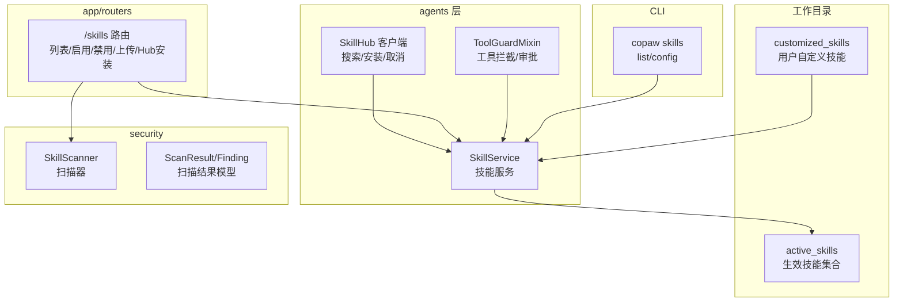
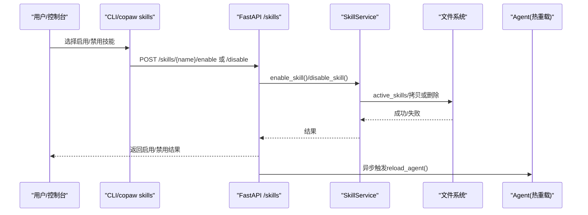
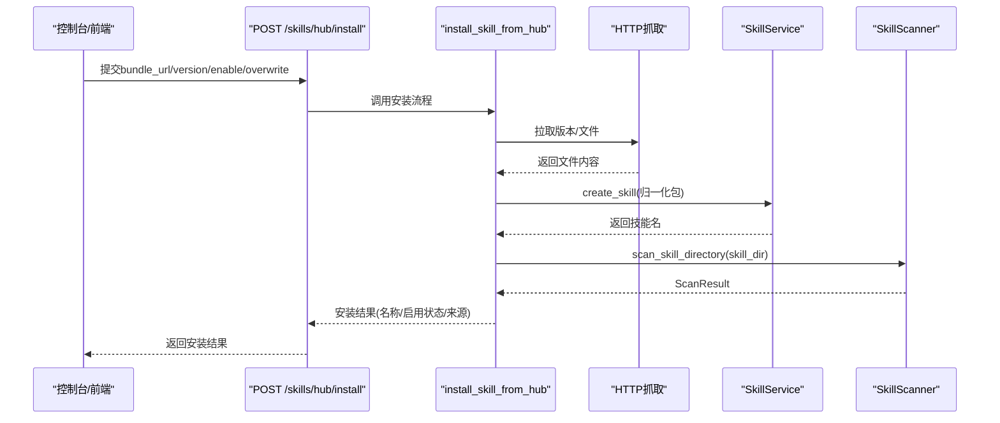
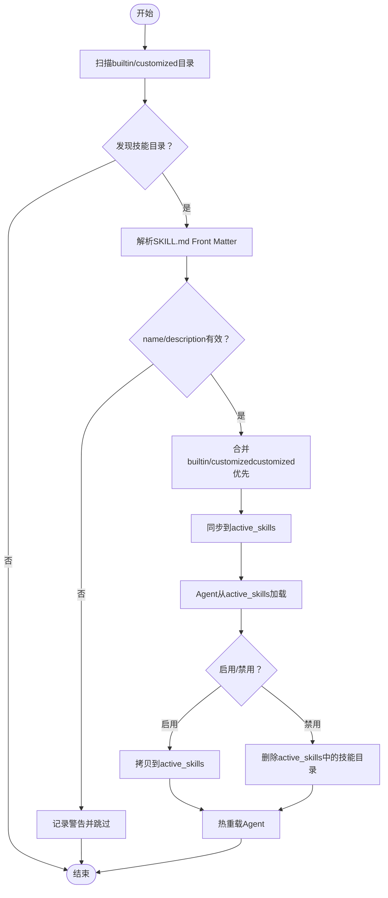
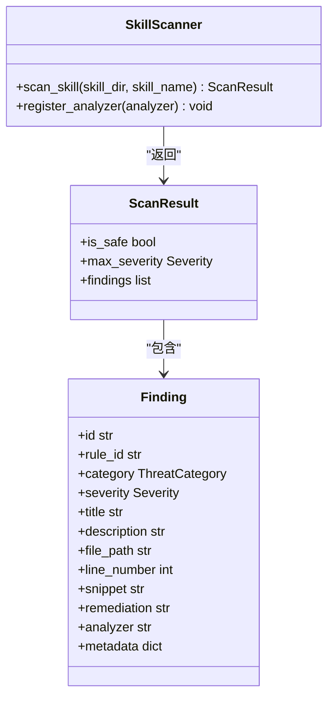
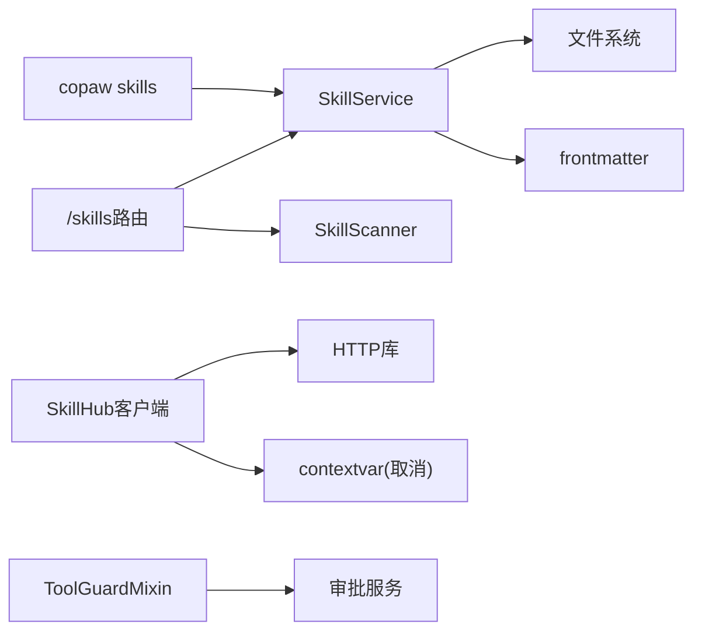

# 技能系统

<cite>
**本文引用的文件**
- [skills_hub.py](file://src/copaw/agents/skills_hub.py)
- [skills_manager.py](file://src/copaw/agents/skills_manager.py)
- [tool_guard_mixin.py](file://src/copaw/agents/tool_guard_mixin.py)
- [skills.py](file://src/copaw/app/routers/skills.py)
- [skills_cmd.py](file://src/copaw/cli/skills_cmd.py)
- [scanner.py](file://src/copaw/security/skill_scanner/scanner.py)
- [models.py](file://src/copaw/security/skill_scanner/models.py)
- [skills.zh.md](file://website/public/docs/skills.zh.md)
</cite>

## 目录
1. [简介](#简介)
2. [项目结构](#项目结构)
3. [核心组件](#核心组件)
4. [架构总览](#架构总览)
5. [详细组件分析](#详细组件分析)
6. [依赖分析](#依赖分析)
7. [性能考虑](#性能考虑)
8. [故障排查指南](#故障排查指南)
9. [结论](#结论)
10. [附录](#附录)

## 简介
本文件面向CoPaw的“技能系统”，系统化阐述技能的生命周期管理（发现、验证、加载、启用/禁用、卸载）、技能Hub的动态加载与注册流程、内置技能的实现与使用、安全扫描机制与最佳实践，并提供自定义技能开发的完整指南（模板、配置、测试与部署）。读者可据此快速理解并扩展CoPaw的技能生态。

## 项目结构
技能系统围绕“工作目录”组织，核心目录与职责如下：
- 工作目录（workspace_dir）
  - customized_skills：用户自定义技能（优先级高于内置）
  - active_skills：最终生效的技能集合（由内置与自定义合并同步而来）
- agents层
  - skills_manager：技能清单、同步、创建、导入导出、启用/禁用
  - skills_hub：技能Hub搜索、安装、取消、状态跟踪
  - tool_guard_mixin：工具调用前的安全拦截与审批
- app/routers：FastAPI路由，提供技能的HTTP接口（列表、启用/禁用、上传、Hub安装等）
- security/skill_scanner：技能包安全扫描（规则引擎、策略、结果模型）
- CLI：copaw skills list/config，交互式配置技能启用状态
- 文档：website/public/docs/skills.zh.md，内置技能概览与使用说明

图示来源
- [skills_manager.py](file://src/copaw/agents/skills_manager.py)
- [skills_hub.py](file://src/copaw/agents/skills_hub.py)
- [tool_guard_mixin.py](file://src/copaw/agents/tool_guard_mixin.py)
- [skills.py](file://src/copaw/app/routers/skills.py)
- [scanner.py](file://src/copaw/security/skill_scanner/scanner.py)
- [models.py](file://src/copaw/security/skill_scanner/models.py)
- [skills_cmd.py](file://src/copaw/cli/skills_cmd.py)

章节来源
- [skills_manager.py](file://src/copaw/agents/skills_manager.py)
- [skills_hub.py](file://src/copaw/agents/skills_hub.py)
- [skills.py](file://src/copaw/app/routers/skills.py)
- [scanner.py](file://src/copaw/security/skill_scanner/scanner.py)
- [models.py](file://src/copaw/security/skill_scanner/models.py)
- [skills_cmd.py](file://src/copaw/cli/skills_cmd.py)
- [skills.zh.md](file://website/public/docs/skills.zh.md)

## 核心组件
- SkillService：技能服务，负责技能的读取、合并、同步、创建、导入导出、启用/禁用、删除等。
- SkillHub客户端：封装Hub搜索、版本解析、文件拉取、包结构归一化、取消检查、重试退避等。
- ToolGuardMixin：在推理/行动阶段拦截敏感工具调用，结合审批服务实现“拒绝/守卫/审批”流程。
- FastAPI路由：提供技能的HTTP接口，包括列表、启用/禁用、批量操作、上传ZIP、Hub安装与状态查询。
- SkillScanner：扫描器，遍历技能包文件，基于策略与规则分析，输出Findings与ScanResult。
- CLI：copaw skills list/config，交互式选择启用/禁用技能。

章节来源
- [skills_manager.py](file://src/copaw/agents/skills_manager.py)
- [skills_hub.py](file://src/copaw/agents/skills_hub.py)
- [tool_guard_mixin.py](file://src/copaw/agents/tool_guard_mixin.py)
- [skills.py](file://src/copaw/app/routers/skills.py)
- [scanner.py](file://src/copaw/security/skill_scanner/scanner.py)
- [models.py](file://src/copaw/security/skill_scanner/models.py)
- [skills_cmd.py](file://src/copaw/cli/skills_cmd.py)

## 架构总览
技能系统采用“工作目录为中心”的三层结构：
- 源数据层：内置技能（包内）与自定义技能（用户目录）
- 同步层：SkillService将内置与自定义技能合并到active_skills，实现“自定义优先”
- 生效层：Agent仅从active_skills加载技能；启用/禁用通过拷贝/删除实现；热重载触发配置刷新

图示来源
- [skills.py](file://src/copaw/app/routers/skills.py)
- [skills_manager.py](file://src/copaw/agents/skills_manager.py)
- [skills_cmd.py](file://src/copaw/cli/skills_cmd.py)

## 详细组件分析

### 技能Hub设计与动态加载
- 功能要点
  - 支持多种Hub入口（skills.sh/clawhub.ai/skillsmp.com/lobehub.com/market.lobehub.com/github.com/modelscope.cn）
  - 搜索、详情、版本解析、文件拉取、包结构归一化（references/scripts树）
  - 取消检查、超时/重试/退避、速率限制处理、大小限制与安全校验
  - 将Hub包导入到customized_skills，随后由SkillService同步至active_skills
- 关键流程
  - 解析URL，提取slug/version
  - 拉取版本元数据与文件列表
  - 拉取文件内容，构建references/scripts树
  - 归一化为SkillService可接受的包结构
  - 安全扫描后导入customized_skills，可选立即启用

图示来源
- [skills_hub.py](file://src/copaw/agents/skills_hub.py)
- [skills.py](file://src/copaw/app/routers/skills.py)
- [scanner.py](file://src/copaw/security/skill_scanner/scanner.py)
- [models.py](file://src/copaw/security/skill_scanner/models.py)

章节来源
- [skills_hub.py](file://src/copaw/agents/skills_hub.py)
- [skills.py](file://src/copaw/app/routers/skills.py)
- [scanner.py](file://src/copaw/security/skill_scanner/scanner.py)
- [models.py](file://src/copaw/security/skill_scanner/models.py)

### 技能生命周期与注册流程
- 生命周期
  - 发现：扫描builtin/customized目录，以“包含SKILL.md的子目录”为单位
  - 验证：解析SKILL.md YAML Front Matter，校验name/description；ZIP导入时校验结构
  - 加载：Agent从active_skills读取技能；启用即拷贝，禁用即删除
  - 卸载：删除active_skills中的技能目录；热重载使Agent重新加载
- 注册机制
  - 无需显式注册：只要目录下有SKILL.md即被识别
  - 同名优先级：customized覆盖builtin
  - 版本控制：内置技能通过SKILL.md metadata中的builtin_skill_version进行升级判断

图示来源
- [skills_manager.py](file://src/copaw/agents/skills_manager.py)
- [skills.py](file://src/copaw/app/routers/skills.py)

章节来源
- [skills_manager.py](file://src/copaw/agents/skills_manager.py)
- [skills.py](file://src/copaw/app/routers/skills.py)

### 内置技能实现与使用
- 内置技能类型与来源
  - 定时任务(cron)、文件读取(file_reader)、邮件(himalaya)、新闻(news)、PDF(docx/pptx/xlsx)、浏览器可见(browser_visible)、钉钉通道接入(dingtalk_channel_connect)
  - 部分来自社区仓库（如pdf/docx/pptx/xlsx），部分自建
- 使用方式
  - 控制台：Agent → Skills 页面查看、启用/禁用、新建、编辑、导入
  - CLI：copaw cron 等命令行工具配合定时任务
  - 工作目录：在customized_skills中新增目录与SKILL.md，重启Agent或触发同步后生效

章节来源
- [skills.zh.md](file://website/public/docs/skills.zh.md)
- [skills.py](file://src/copaw/app/routers/skills.py)
- [skills_cmd.py](file://src/copaw/cli/skills_cmd.py)

### 安全扫描机制与工具拦截
- SkillScanner
  - 文件发现：递归遍历，排除符号链接、隐藏文件、超出大小/数量限制
  - 分析器：默认PatternAnalyzer（正则签名），可扩展注册其他分析器
  - 策略：基于ScanPolicy的文件分类、阈值、去重策略
  - 结果：ScanResult包含findings、最大严重级别、耗时等
- ToolGuardMixin
  - 在_reacting/_reasoning阶段拦截敏感工具调用
  - 支持“拒绝名单”“守卫范围”“预审批”“审批流”
  - 记录被拦截的消息标记，支持清理与重试

图示来源
- [scanner.py](file://src/copaw/security/skill_scanner/scanner.py)
- [models.py](file://src/copaw/security/skill_scanner/models.py)

章节来源
- [scanner.py](file://src/copaw/security/skill_scanner/scanner.py)
- [models.py](file://src/copaw/security/skill_scanner/models.py)
- [tool_guard_mixin.py](file://src/copaw/agents/tool_guard_mixin.py)

### API接口与控制台集成
- 路由概览
  - GET /skills：列出所有技能（含builtin/customized），标注enabled状态
  - GET /skills/available：列出已启用技能
  - POST /skills/hub/install：安装Hub技能（阻塞式）
  - POST /skills/hub/install/start：异步安装（返回任务ID）
  - GET /skills/hub/install/status/{task_id}：查询任务状态
  - POST /skills/hub/install/cancel/{task_id}：取消安装
  - POST /skills/upload：上传ZIP导入技能
  - POST /skills/batch-enable/disable：批量启用/禁用
  - POST /skills：创建自定义技能
  - POST /skills/{skill_name}/enable/disable：启用/禁用单个技能
  - DELETE /skills/{skill_name}：删除自定义技能
  - GET /skills/{skill_name}/files/{source}/{file_path}：读取references/scripts文件
- 安全扫描
  - 启用/上传/Hub安装均在导入前进行安全扫描，失败返回422并携带findings

章节来源
- [skills.py](file://src/copaw/app/routers/skills.py)

### CLI与工作目录管理
- copaw skills list：列出技能及状态
- copaw skills config：交互式选择启用/禁用技能
- 工作目录同步
  - 启动或变更后，SkillService将builtin与customized同步到active_skills
  - 同名时customized覆盖builtin；首次缺失时从builtin复制

章节来源
- [skills_cmd.py](file://src/copaw/cli/skills_cmd.py)
- [skills_manager.py](file://src/copaw/agents/skills_manager.py)

## 依赖分析
- 组件耦合
  - SkillService依赖文件系统与frontmatter解析，耦合度低，便于单元测试
  - SkillHub客户端与HTTP库耦合，但通过环境变量与上下文取消钩子解耦
  - ToolGuardMixin与审批服务、内存消息标记耦合，遵循MRO组合
  - 路由层依赖SkillService与扫描器，形成清晰边界
- 外部依赖
  - frontmatter：解析SKILL.md YAML Front Matter
  - packaging.Version：内置技能版本比较
  - fastapi/uvicorn：HTTP服务
  - asyncio/threading：异步任务与取消事件

图示来源
- [skills_manager.py](file://src/copaw/agents/skills_manager.py)
- [skills_hub.py](file://src/copaw/agents/skills_hub.py)
- [skills.py](file://src/copaw/app/routers/skills.py)
- [tool_guard_mixin.py](file://src/copaw/agents/tool_guard_mixin.py)
- [skills_cmd.py](file://src/copaw/cli/skills_cmd.py)

章节来源
- [skills_manager.py](file://src/copaw/agents/skills_manager.py)
- [skills_hub.py](file://src/copaw/agents/skills_hub.py)
- [skills.py](file://src/copaw/app/routers/skills.py)
- [tool_guard_mixin.py](file://src/copaw/agents/tool_guard_mixin.py)
- [skills_cmd.py](file://src/copaw/cli/skills_cmd.py)

## 性能考虑
- 文件扫描
  - 默认最大文件数与单文件大小限制，避免大体积技能导致扫描耗时过长
  - 跳过二进制/压缩/图标等非文本扩展名，减少I/O
- HTTP请求
  - 可配置超时、重试次数、指数退避，缓解Hub不稳定
  - ZIP解压前进行大小与路径合法性校验，防止过大或危险路径
- 同步与热重载
  - 同步时仅在差异或强制模式下复制，避免重复IO
  - 启用/禁用后异步触发Agent重载，降低阻塞

## 故障排查指南
- Hub安装失败
  - 检查URL是否完整、域名是否受支持
  - 若为GitHub源，设置GITHUB_TOKEN以提升配额
  - 查看任务状态接口，确认是否因速率限制或网络异常
- 安全扫描阻断
  - 查看返回的findings列表，定位高危规则与文件位置
  - 调整策略或修复技能内容后重试
- 启用/禁用无效
  - 确认active_skills中目标技能是否存在
  - 观察后台热重载日志，确认Agent已重新加载
- ZIP导入失败
  - 确认ZIP大小不超过限制，且路径合法（无越界/软链接）
  - 检查SKILL.md是否包含必需字段（name/description）

章节来源
- [skills.py](file://src/copaw/app/routers/skills.py)
- [scanner.py](file://src/copaw/security/skill_scanner/scanner.py)
- [skills_hub.py](file://src/copaw/agents/skills_hub.py)

## 结论
CoPaw的技能系统以“工作目录为中心”，通过SkillService实现内置与自定义技能的合并同步，辅以SkillHub的动态导入与安全扫描，形成“发现—验证—加载—启用/禁用—卸载”的完整闭环。ToolGuardMixin进一步强化了运行期安全。该架构既保证易用性（无需注册、控制台可视化），又具备可扩展性（可插拔分析器、策略化扫描、异步任务与取消）。

## 附录

### 自定义技能开发指南
- 目录结构
  - 在customized_skills下新建目录（如my_skill），并在其中放置SKILL.md
  - 可选：references/ 与 scripts/ 子目录存放辅助文件与脚本
- SKILL.md规范
  - 必须包含YAML Front Matter，至少包含name与description
  - metadata可包含builtin_skill_version等元信息
- 创建方式
  - 控制台：新建/编辑技能，填写名称与内容
  - API：POST /skills 创建
  - CLI：copaw skills config 交互式启用
- 测试与验证
  - 上传ZIP进行安全扫描（422返回携带findings）
  - 启用后观察Agent行为与日志
- 部署与发布
  - 本地验证通过后，可打包为ZIP或发布到Hub供他人导入
  - 使用POST /skills/hub/install或控制台导入

章节来源
- [skills.py](file://src/copaw/app/routers/skills.py)
- [scanner.py](file://src/copaw/security/skill_scanner/scanner.py)
- [skills_cmd.py](file://src/copaw/cli/skills_cmd.py)
- [skills.zh.md](file://website/public/docs/skills.zh.md)