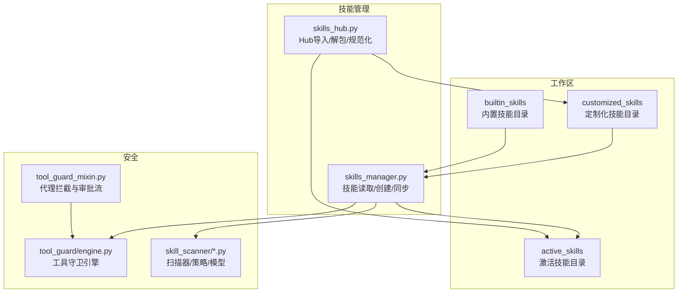
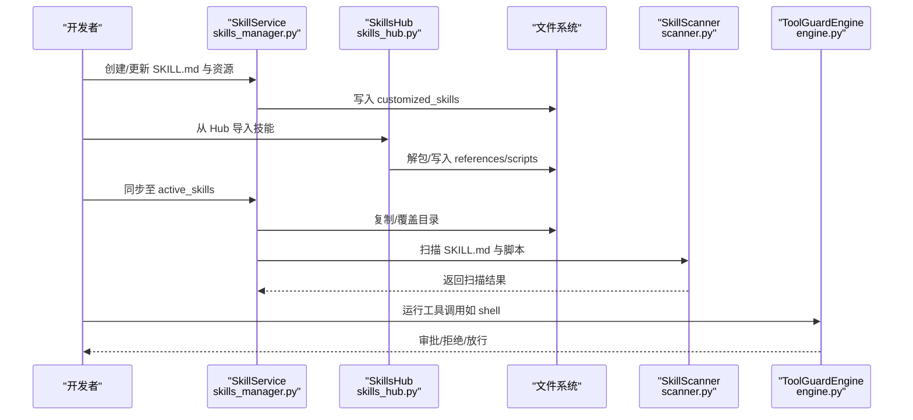
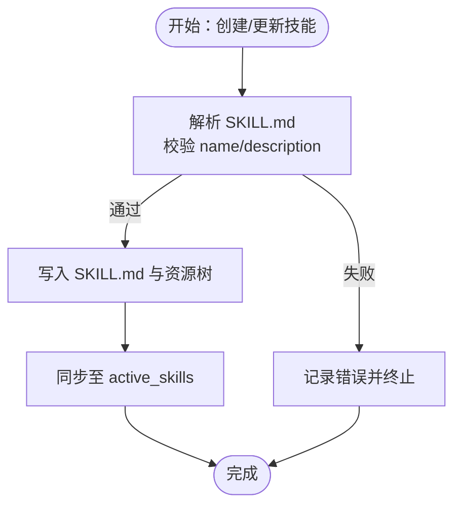
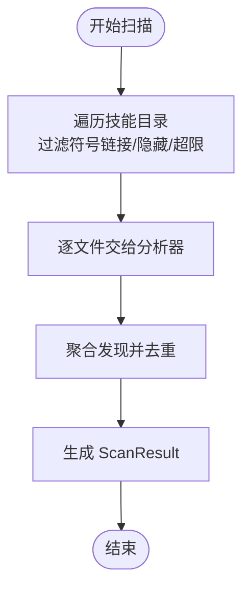
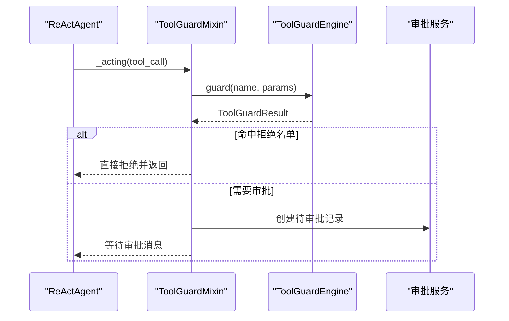
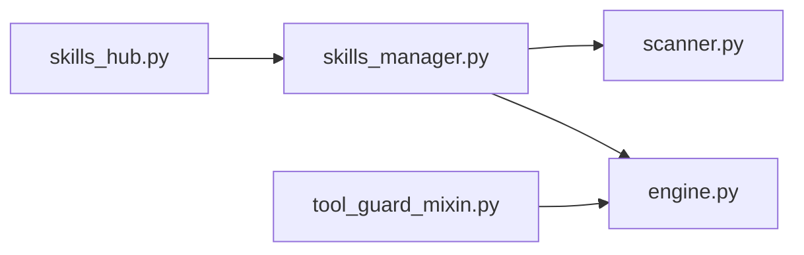

# 自定义技能开发

<cite>
**本文引用的文件**   
- [skills_manager.py](file://src/copaw/agents/skills_manager.py)
- [skills_hub.py](file://src/copaw/agents/skills_hub.py)
- [tool_guard_mixin.py](file://src/copaw/agents/tool_guard_mixin.py)
- [scanner.py](file://src/copaw/security/skill_scanner/scanner.py)
- [models.py](file://src/copaw/security/skill_scanner/models.py)
- [scan_policy.py](file://src/copaw/security/skill_scanner/scan_policy.py)
- [engine.py](file://src/copaw/security/tool_guard/engine.py)
- [SKILL.md](file://src/copaw/agents/skills/docx/SKILL.md)
- [SKILL.md](file://src/copaw/agents/skills/pdf/SKILL.md)
- [SKILL.md](file://src/copaw/agents/skills/cron/SKILL.md)
</cite>

## 目录
1. [简介](#简介)
2. [项目结构](#项目结构)
3. [核心组件](#核心组件)
4. [架构总览](#架构总览)
5. [详细组件分析](#详细组件分析)
6. [依赖分析](#依赖分析)
7. [性能考量](#性能考量)
8. [故障排查指南](#故障排查指南)
9. [结论](#结论)
10. [附录](#附录)

## 简介
本指南面向希望基于 CoPaw 开发“自定义技能”的开发者，系统讲解技能开发的完整流程与最佳实践，涵盖以下主题：
- SKILL.md 配置文件的编写规范与 YAML Front Matter 字段
- 技能目录结构与文件组织（references、scripts、额外资源）
- 安全扫描与工具守卫机制（沙箱、权限、输入校验、输出过滤）
- 开发示例（文本处理、文件操作、网络调用）
- 测试、调试、打包、发布与版本管理策略

## 项目结构
CoPaw 的技能体系由“技能目录树”“内置/定制化/激活目录同步”“Hub 导入与归档”“安全扫描与工具守卫”等模块协同组成。下图展示与技能开发直接相关的目录与模块：

图表来源
- [skills_manager.py:634-800](file://src/copaw/agents/skills_manager.py#L634-L800)
- [skills_hub.py:574-634](file://src/copaw/agents/skills_hub.py#L574-L634)
- [scanner.py:76-242](file://src/copaw/security/skill_scanner/scanner.py#L76-L242)
- [engine.py:52-218](file://src/copaw/security/tool_guard/engine.py#L52-L218)
- [tool_guard_mixin.py:24-349](file://src/copaw/agents/tool_guard_mixin.py#L24-L349)

章节来源
- [skills_manager.py:63-122](file://src/copaw/agents/skills_manager.py#L63-L122)
- [skills_hub.py:574-634](file://src/copaw/agents/skills_hub.py#L574-L634)

## 核心组件
- 技能目录与命名
  - 技能根目录以 SKILL.md 作为入口与元数据源；目录名应仅包含字母、数字、连字符与下划线，避免路径分隔符。
  - 目录内可包含 references 子目录（文档/模板等只读资源）、scripts 子目录（执行脚本），以及其它额外资源文件。
- 技能元数据与描述
  - SKILL.md 使用 YAML Front Matter 定义 name、description、license、metadata 等字段；其中 metadata 可包含内置技能版本号等。
- 技能同步与覆盖
  - 同步顺序：builtin_skills 覆盖定制化；定制化覆盖激活目录；激活目录用于运行时加载。
- Hub 导入与归档
  - 支持从 Hub 下载、解包、规范化为本地技能目录树，并进行安全扫描。

章节来源
- [skills_manager.py:28-61](file://src/copaw/agents/skills_manager.py#L28-L61)
- [skills_manager.py:63-122](file://src/copaw/agents/skills_manager.py#L63-L122)
- [skills_manager.py:183-260](file://src/copaw/agents/skills_manager.py#L183-L260)
- [skills_manager.py:552-567](file://src/copaw/agents/skills_manager.py#L552-L567)
- [skills_hub.py:574-634](file://src/copaw/agents/skills_hub.py#L574-L634)

## 架构总览
下图展示技能从“创建/导入”到“运行”的端到端流程，以及安全控制点：

图表来源
- [skills_manager.py:699-800](file://src/copaw/agents/skills_manager.py#L699-L800)
- [skills_hub.py:574-634](file://src/copaw/agents/skills_hub.py#L574-L634)
- [scanner.py:148-242](file://src/copaw/security/skill_scanner/scanner.py#L148-L242)
- [engine.py:161-206](file://src/copaw/security/tool_guard/engine.py#L161-L206)

## 详细组件分析

### 组件一：技能目录与元数据（SKILL.md）
- 必备字段
  - name：技能名称（用于目录名与显示名）
  - description：技能描述（建议包含触发条件、适用场景）
  - license：许可证信息（可指向同目录 LICENSE.txt）
  - metadata：可包含内置技能版本号等
- 目录结构建议
  - references：存放只读文档、模板、参考材料
  - scripts：存放执行脚本（Python/Shell 等），按功能分层组织
  - 其它资源：图片、字体、配置文件等
- 名称与路径约束
  - 目录名仅允许字母、数字、连字符、下划线；避免斜杠与反斜杠
  - scripts 中的相对路径以技能根目录为基准

章节来源
- [SKILL.md:1-11](file://src/copaw/agents/skills/docx/SKILL.md#L1-L11)
- [SKILL.md:1-6](file://src/copaw/agents/skills/pdf/SKILL.md#L1-L6)
- [SKILL.md:1-5](file://src/copaw/agents/skills/cron/SKILL.md#L1-L5)
- [skills_manager.py:552-567](file://src/copaw/agents/skills_manager.py#L552-L567)

### 组件二：技能创建与同步（SkillService）
- 创建流程
  - 校验 SKILL.md 的 YAML Front Matter，要求包含 name 与 description
  - 在 customized_skills 下创建目录与 SKILL.md
  - 可选择传入 references/scripts 的树形结构与额外资源
- 同步流程
  - 将 builtin_skills 与 customized_skills 合并，定制化覆盖内置
  - 将最终结果复制到 active_skills，供运行时加载
- 版本与回退
  - 对于内置技能，可通过 metadata 中的版本号进行升级判断

图表来源
- [skills_manager.py:699-800](file://src/copaw/agents/skills_manager.py#L699-L800)
- [skills_manager.py:183-260](file://src/copaw/agents/skills_manager.py#L183-L260)

章节来源
- [skills_manager.py:699-800](file://src/copaw/agents/skills_manager.py#L699-L800)
- [skills_manager.py:183-260](file://src/copaw/agents/skills_manager.py#L183-L260)

### 组件三：Hub 导入与归档（SkillsHub）
- 支持来源
  - 支持从多种 Hub 地址导入，自动识别 slug、版本、文件清单
- 归档与解包
  - 支持 zip 包导入，进行大小与路径合法性校验（防止越界与符号链接）
  - 将文件树规范化为 references/scripts 与额外资源
- 名称与路径清洗
  - 对显示名进行清洗，避免非法字符
  - 严格限制仅保留 references/scripts 顶层与根目录文件

章节来源
- [skills_hub.py:574-634](file://src/copaw/agents/skills_hub.py#L574-L634)
- [skills_hub.py:529-550](file://src/copaw/agents/skills_hub.py#L529-L550)
- [skills_hub.py:692-704](file://src/copaw/agents/skills_hub.py#L692-L704)

### 组件四：安全扫描（SkillScanner）
- 扫描范围
  - 遍历技能目录，跳过符号链接、隐藏文件、超出阈值的文件
  - 默认忽略图片/压缩包/可执行等扩展，除非策略允许
- 分析器
  - 默认使用 PatternAnalyzer（基于正则签名）进行模式匹配
  - 可注册更多分析器（如未来 LLM 分析器）
- 结果聚合
  - 去重、统计最高严重级别、输出 ScanResult

图表来源
- [scanner.py:148-242](file://src/copaw/security/skill_scanner/scanner.py#L148-L242)
- [scanner.py:248-299](file://src/copaw/security/skill_scanner/scanner.py#L248-L299)
- [models.py:168-235](file://src/copaw/security/skill_scanner/models.py#L168-L235)

章节来源
- [scanner.py:76-242](file://src/copaw/security/skill_scanner/scanner.py#L76-L242)
- [models.py:168-235](file://src/copaw/security/skill_scanner/models.py#L168-L235)
- [scan_policy.py:156-178](file://src/copaw/security/skill_scanner/scan_policy.py#L156-L178)

### 组件五：工具守卫（ToolGuardEngine 与 Mixin）
- 引擎
  - 默认启用规则基守卫，支持动态注册/注销守卫者
  - 可配置“拒绝名单”“守卫范围”，并支持重载规则
- 代理拦截
  - 在 ReActAgent 的 _acting/_reasoning 阶段拦截敏感工具调用
  - 若命中高危规则，进入审批流；若在拒绝名单则直接拒绝
- 审批与清理
  - 记录被拒绝的消息标记，必要时清理内存中的拒绝消息

图表来源
- [tool_guard_mixin.py:103-182](file://src/copaw/agents/tool_guard_mixin.py#L103-L182)
- [tool_guard_mixin.py:237-310](file://src/copaw/agents/tool_guard_mixin.py#L237-L310)
- [engine.py:161-206](file://src/copaw/security/tool_guard/engine.py#L161-L206)

章节来源
- [engine.py:52-218](file://src/copaw/security/tool_guard/engine.py#L52-L218)
- [tool_guard_mixin.py:24-349](file://src/copaw/agents/tool_guard_mixin.py#L24-L349)

## 依赖分析
- 技能管理对安全扫描与工具守卫的耦合点
  - 同步完成后，运行前进行安全扫描；运行时通过工具守卫拦截敏感工具调用
- 文件系统与 Zip 安全
  - Zip 解包时进行大小与路径合法性校验，拒绝越界路径与符号链接
- 策略与阈值
  - 扫描策略可覆盖默认行为，如扩展分类、禁用规则、调整阈值

图表来源
- [skills_manager.py:634-800](file://src/copaw/agents/skills_manager.py#L634-L800)
- [scanner.py:76-242](file://src/copaw/security/skill_scanner/scanner.py#L76-L242)
- [engine.py:52-218](file://src/copaw/security/tool_guard/engine.py#L52-L218)
- [skills_hub.py:574-634](file://src/copaw/agents/skills_hub.py#L574-L634)
- [tool_guard_mixin.py:24-349](file://src/copaw/agents/tool_guard_mixin.py#L24-L349)

章节来源
- [skills_manager.py:634-800](file://src/copaw/agents/skills_manager.py#L634-L800)
- [scanner.py:76-242](file://src/copaw/security/skill_scanner/scanner.py#L76-L242)
- [engine.py:52-218](file://src/copaw/security/tool_guard/engine.py#L52-L218)
- [skills_hub.py:529-550](file://src/copaw/agents/skills_hub.py#L529-L550)
- [tool_guard_mixin.py:24-349](file://src/copaw/agents/tool_guard_mixin.py#L24-L349)

## 性能考量
- 扫描性能
  - 限制最大文件数与单文件大小，避免大体积资源影响扫描时间
  - 默认忽略图片/压缩包等扩展，减少无效扫描
- 同步性能
  - 仅在变更时复制目录，避免重复 IO
- 工具守卫
  - 规则集可按需扩展，避免过度扫描导致推理延迟

章节来源
- [scanner.py:116-134](file://src/copaw/security/skill_scanner/scanner.py#L116-L134)
- [scan_policy.py:123-132](file://src/copaw/security/skill_scanner/scan_policy.py#L123-L132)
- [skills_manager.py:235-260](file://src/copaw/agents/skills_manager.py#L235-L260)

## 故障排查指南
- SKILL.md 解析失败
  - 检查 YAML Front Matter 是否包含 name 与 description
  - 确认编码为 UTF-8，缩进与冒号后有空格
- 目录名不合法
  - 清洗显示名为仅含字母、数字、连字符、下划线的字符串
- Zip 导入失败
  - 检查压缩包大小是否超过上限、是否存在越界路径或符号链接
- 工具调用被拒绝
  - 查看工具守卫的审批记录，确认是否命中拒绝名单或需要审批
- 扫描结果异常
  - 检查策略配置与阈值，确认是否误判或遗漏

章节来源
- [skills_manager.py:580-625](file://src/copaw/agents/skills_manager.py#L580-L625)
- [skills_hub.py:529-550](file://src/copaw/agents/skills_hub.py#L529-L550)
- [tool_guard_mixin.py:168-182](file://src/copaw/agents/tool_guard_mixin.py#L168-L182)
- [engine.py:147-156](file://src/copaw/security/tool_guard/engine.py#L147-L156)
- [scan_policy.py:156-178](file://src/copaw/security/skill_scanner/scan_policy.py#L156-L178)

## 结论
通过标准化的 SKILL.md 元数据、严格的目录结构与安全扫描/工具守卫机制，CoPaw 为自定义技能提供了安全、可控且可扩展的开发框架。遵循本文的流程与最佳实践，开发者可以高效构建高质量的技能，并在生产环境中稳定运行。

## 附录

### A. 开发示例：文本处理技能
- 目标：根据用户输入生成/编辑富文本文档
- 步骤
  - 在 customized_skills 下创建目录与 SKILL.md（包含 name/description/metadata）
  - 在 scripts 中编写 Python/Shell 脚本，references 中放置模板/说明
  - 使用 Hub 导入或直接复制到 active_skills
  - 运行前进行安全扫描，运行时受工具守卫保护

章节来源
- [SKILL.md:1-11](file://src/copaw/agents/skills/docx/SKILL.md#L1-L11)
- [skills_manager.py:699-800](file://src/copaw/agents/skills_manager.py#L699-L800)
- [skills_hub.py:574-634](file://src/copaw/agents/skills_hub.py#L574-L634)
- [scanner.py:148-242](file://src/copaw/security/skill_scanner/scanner.py#L148-L242)
- [engine.py:161-206](file://src/copaw/security/tool_guard/engine.py#L161-L206)

### B. 开发示例：文件操作技能
- 目标：PDF/DOCX/XLSX 等文档处理
- 步骤
  - 在 SKILL.md 中声明依赖（如 pypdf、docx、pandas 等）
  - 在 scripts 中实现具体逻辑（读取、转换、合并、提取）
  - 在 references 中提供参考文档与注意事项
  - 导入 Hub 或本地复制到 active_skills

章节来源
- [SKILL.md:1-6](file://src/copaw/agents/skills/pdf/SKILL.md#L1-L6)
- [SKILL.md:14-22](file://src/copaw/agents/skills/docx/SKILL.md#L14-L22)
- [SKILL.md](file://src/copaw/agents/skills/xlsx/SKILL.md)

### C. 开发示例：网络技能
- 目标：调用外部 API 获取/提交数据
- 步骤
  - 在 SKILL.md 中声明 API 依赖与认证方式
  - 在 scripts 中实现请求封装与错误处理
  - 工具守卫将拦截敏感网络调用，必要时进入审批流
- 安全要点
  - 输入参数严格校验，避免注入
  - 输出过滤，避免泄露敏感信息

章节来源
- [engine.py:161-206](file://src/copaw/security/tool_guard/engine.py#L161-L206)
- [tool_guard_mixin.py:103-182](file://src/copaw/agents/tool_guard_mixin.py#L103-L182)

### D. 测试与调试
- 单元测试
  - 使用 Python 测试框架对脚本函数进行断言
- 集成测试
  - 在本地 workspace 中导入技能，执行典型用例
- 调试技巧
  - 逐步打印中间变量与返回值
  - 使用最小化输入复现问题
  - 关注扫描器与工具守卫的日志输出

### E. 打包、发布与版本管理
- 打包
  - 将 references/scripts 与 SKILL.md 打包为 zip，确保不超过大小限制
- 发布
  - 通过 Hub 平台发布，提供版本号与变更说明
- 版本管理
  - 在 SKILL.md 的 metadata 中维护内置技能版本号，便于升级与回滚

章节来源
- [skills_hub.py:529-550](file://src/copaw/agents/skills_hub.py#L529-L550)
- [skills_manager.py:142-162](file://src/copaw/agents/skills_manager.py#L142-L162)
- [SKILL.md:4-5](file://src/copaw/agents/skills/cron/SKILL.md#L4-L5)