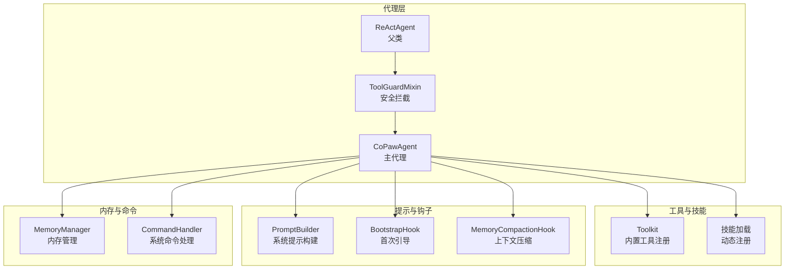
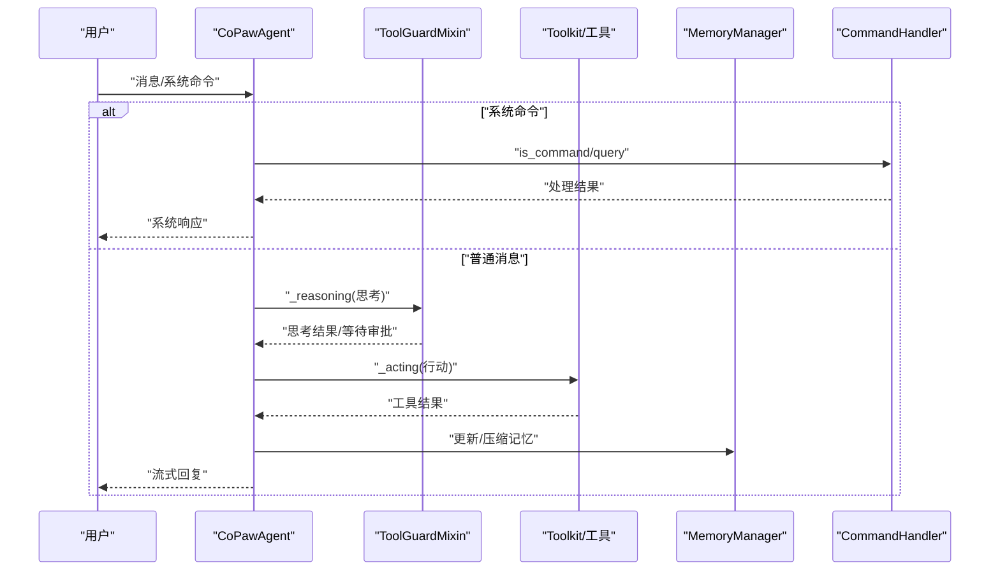
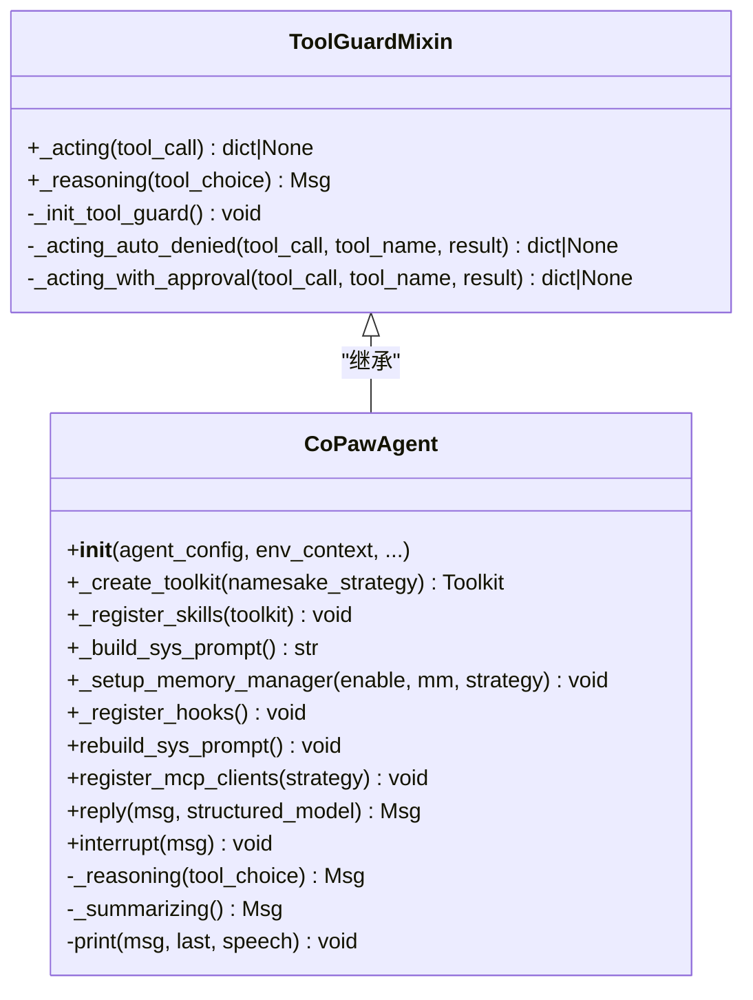
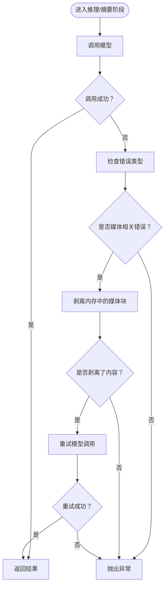
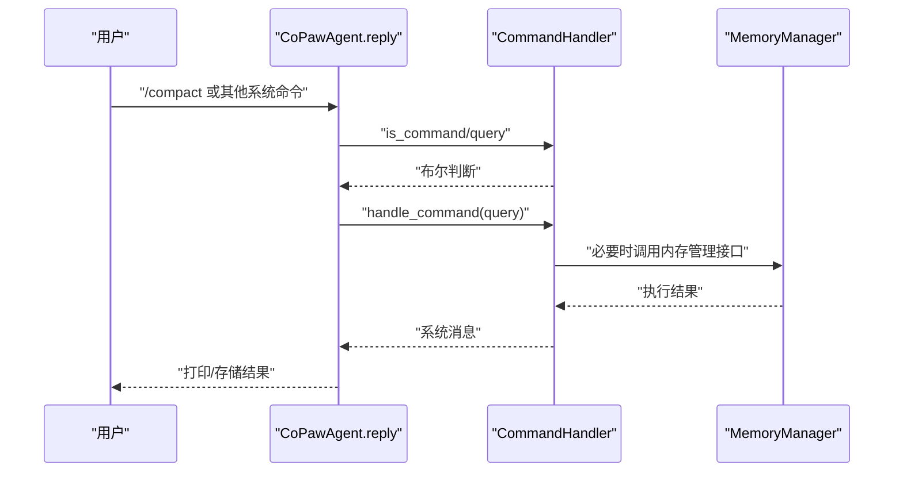
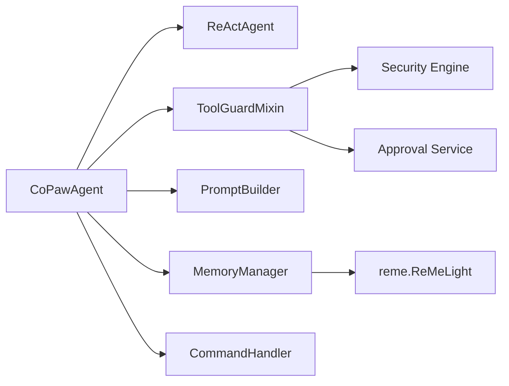

# ReAct代理框架

<cite>
**本文档引用的文件**
- [react_agent.py](file://src/copaw/agents/react_agent.py)
- [command_handler.py](file://src/copaw/agents/command_handler.py)
- [tool_guard_mixin.py](file://src/copaw/agents/tool_guard_mixin.py)
- [prompt.py](file://src/copaw/agents/prompt.py)
- [memory_manager.py](file://src/copaw/agents/memory/memory_manager.py)
- [bootstrap.py](file://src/copaw/agents/hooks/bootstrap.py)
- [memory_compaction.py](file://src/copaw/agents/hooks/memory_compaction.py)
- [constant.py](file://src/copaw/constant.py)
- [__init__.py](file://src/copaw/agents/tools/__init__.py)
</cite>

## 目录
1. [引言](#引言)
2. [项目结构](#项目结构)
3. [核心组件](#核心组件)
4. [架构总览](#架构总览)
5. [详细组件分析](#详细组件分析)
6. [依赖关系分析](#依赖关系分析)
7. [性能考虑](#性能考虑)
8. [故障排除指南](#故障排除指南)
9. [结论](#结论)
10. [附录](#附录)

## 引言
本文件面向CoPaw的ReAct代理框架，系统性阐述ReAct代理的核心架构与实现细节，重点覆盖以下主题：
- 思考-行动循环机制的实现原理与控制流
- 推理阶段与行动阶段的具体流程
- CoPawAgent类如何继承ReActAgent并扩展功能（工具集管理、系统提示构建、内存管理集成）
- 命令处理器CommandHandler的工作机制（系统命令解析与执行）
- 媒体块回退机制（多模态内容处理与错误恢复策略）
- 代理初始化、配置管理与交互流程的代码示例路径

## 项目结构
CoPaw的ReAct代理框架位于src/copaw/agents目录下，围绕ReActAgent进行扩展，形成“安全拦截 + 工具集 + 技能 + 内存”的一体化代理能力。

图表来源
- [react_agent.py:63-146](file://src/copaw/agents/react_agent.py#L63-L146)
- [tool_guard_mixin.py:24-30](file://src/copaw/agents/tool_guard_mixin.py#L24-L30)
- [prompt.py:35-174](file://src/copaw/agents/prompt.py#L35-L174)
- [bootstrap.py:20-104](file://src/copaw/agents/hooks/bootstrap.py#L20-L104)
- [memory_compaction.py:28-201](file://src/copaw/agents/hooks/memory_compaction.py#L28-L201)
- [memory_manager.py:43-310](file://src/copaw/agents/memory/memory_manager.py#L43-L310)
- [command_handler.py:59-489](file://src/copaw/agents/command_handler.py#L59-L489)

章节来源
- [react_agent.py:63-146](file://src/copaw/agents/react_agent.py#L63-L146)
- [prompt.py:35-174](file://src/copaw/agents/prompt.py#L35-L174)
- [command_handler.py:59-489](file://src/copaw/agents/command_handler.py#L59-L489)
- [memory_manager.py:43-310](file://src/copaw/agents/memory/memory_manager.py#L43-L310)

## 核心组件
- CoPawAgent：继承ReActAgent，负责代理生命周期、工具集注册、系统提示构建、内存管理集成、命令处理与媒体块回退。
- ToolGuardMixin：提供工具调用前的安全拦截，支持自动拒绝、预批准与审批流程。
- CommandHandler：解析并执行系统命令（如/compact、/new、/clear等），并与内存管理器协作。
- PromptBuilder：从工作目录的Markdown文件构建系统提示，支持心跳节过滤与多文件合并。
- MemoryManager：提供消息压缩、摘要生成、向量/全文检索与嵌入配置管理。
- Hook体系：BootstrapHook（首次交互引导）、MemoryCompactionHook（上下文压缩）。

章节来源
- [react_agent.py:63-146](file://src/copaw/agents/react_agent.py#L63-L146)
- [tool_guard_mixin.py:24-30](file://src/copaw/agents/tool_guard_mixin.py#L24-L30)
- [command_handler.py:59-489](file://src/copaw/agents/command_handler.py#L59-L489)
- [prompt.py:35-174](file://src/copaw/agents/prompt.py#L35-L174)
- [memory_manager.py:43-310](file://src/copaw/agents/memory/memory_manager.py#L43-L310)
- [bootstrap.py:20-104](file://src/copaw/agents/hooks/bootstrap.py#L20-L104)
- [memory_compaction.py:28-201](file://src/copaw/agents/hooks/memory_compaction.py#L28-L201)

## 架构总览
ReAct代理采用“思考-行动”循环，结合安全拦截、工具调用、内存压缩与系统命令处理，形成闭环的智能体交互架构。

图表来源
- [react_agent.py:786-840](file://src/copaw/agents/react_agent.py#L786-L840)
- [tool_guard_mixin.py:103-181](file://src/copaw/agents/tool_guard_mixin.py#L103-L181)
- [command_handler.py:460-488](file://src/copaw/agents/command_handler.py#L460-L488)
- [memory_manager.py:198-257](file://src/copaw/agents/memory/memory_manager.py#L198-L257)

## 详细组件分析

### CoPawAgent：ReAct代理的扩展实现
- 继承关系与职责
  - 继承ReActAgent，通过ToolGuardMixin实现工具调用前的安全拦截。
  - 负责工具集初始化、技能动态加载、系统提示构建、内存管理集成、命令处理与媒体块回退。
- 初始化流程
  - 从AgentProfileConfig提取运行参数（迭代次数、语言、嵌入配置等）。
  - 创建Toolkit并按启用状态注册内置工具；动态注册工作目录中的技能。
  - 使用PromptBuilder构建系统提示，结合环境上下文与心跳开关。
  - 初始化模型与格式化器，创建父类ReActAgent实例。
  - 可选启用MemoryManager，注册内存搜索工具，注入内存压缩钩子。
  - 构造CommandHandler用于系统命令处理。
- 关键方法
  - _create_toolkit：按namesake策略注册工具函数集合。
  - _register_skills：扫描工作目录技能并注册到Toolkit。
  - _build_sys_prompt：从AGENTS.md/SOUL.md/PROFILE.md构建系统提示，支持心跳节过滤。
  - _setup_memory_manager：根据环境变量与配置启用内存管理，注册内存搜索工具。
  - _register_hooks：注册BootstrapHook与MemoryCompactionHook。
  - rebuild_sys_prompt：重建系统提示并同步内存中的系统消息。
  - register_mcp_clients/_recover_mcp_client：MCP客户端注册与恢复。
  - _reasoning/_summarizing/print：媒体块回退与phantom tool_use过滤。
  - reply：消息预处理（文件/媒体块）、命令检测、正常对话流程。
  - interrupt：中断当前回复任务并清理。

图表来源
- [tool_guard_mixin.py:24-349](file://src/copaw/agents/tool_guard_mixin.py#L24-L349)
- [react_agent.py:63-840](file://src/copaw/agents/react_agent.py#L63-L840)

章节来源
- [react_agent.py:83-165](file://src/copaw/agents/react_agent.py#L83-L165)
- [react_agent.py:166-228](file://src/copaw/agents/react_agent.py#L166-L228)
- [react_agent.py:230-256](file://src/copaw/agents/react_agent.py#L230-L256)
- [react_agent.py:257-286](file://src/copaw/agents/react_agent.py#L257-L286)
- [react_agent.py:288-351](file://src/copaw/agents/react_agent.py#L288-L351)
- [react_agent.py:353-368](file://src/copaw/agents/react_agent.py#L353-L368)
- [react_agent.py:369-550](file://src/copaw/agents/react_agent.py#L369-L550)
- [react_agent.py:558-784](file://src/copaw/agents/react_agent.py#L558-L784)
- [react_agent.py:786-840](file://src/copaw/agents/react_agent.py#L786-L840)

### 媒体块回退机制：多模态内容处理与错误恢复
- 触发条件
  - 当模型调用失败且错误类型为400类或包含图像/音频/视频/多模态关键词时触发回退。
- 处理策略
  - 在推理与摘要阶段捕获异常，移除内存中的媒体块（image/audio/video），必要时插入占位文本以避免请求非法。
  - 摘要阶段额外过滤tool_use块，防止前端短暂渲染“不会被执行”的工具调用。
  - 在最终流式事件中追加轮次结束提示，提升用户体验。
- 关键实现点
  - _reasoning：捕获异常后剥离媒体块并重试一次。
  - _summarizing：同上，并在返回前过滤tool_use块。
  - print：在摘要阶段对消息内容进行过滤，避免phantom工具调用显示。
  - _strip_media_blocks_from_memory：遍历消息内容，移除媒体块并填充占位。
  - _is_bad_request_or_media_error：判断是否为媒体相关错误。
  - _strip_tool_use_from_msg：移除tool_use块并附加轮次结束提示。

图表来源
- [react_agent.py:558-586](file://src/copaw/agents/react_agent.py#L558-L586)
- [react_agent.py:587-622](file://src/copaw/agents/react_agent.py#L587-L622)
- [react_agent.py:623-660](file://src/copaw/agents/react_agent.py#L623-L660)
- [react_agent.py:702-784](file://src/copaw/agents/react_agent.py#L702-L784)

章节来源
- [react_agent.py:558-660](file://src/copaw/agents/react_agent.py#L558-L660)
- [react_agent.py:702-784](file://src/copaw/agents/react_agent.py#L702-L784)

### CommandHandler：系统命令解析与执行
- 支持命令集合
  - compact/new/clear/history/compact_str/await_summary/message/dump_history/load_history。
- 解析与路由
  - 以“/”开头识别命令，解析命令名与参数，分派至对应处理函数。
- 关键流程
  - /compact：启动后台摘要任务，压缩历史并清空内容，保留压缩摘要。
  - /new：清空压缩摘要与内容，准备新会话。
  - /clear：清空压缩摘要与内容。
  - /history：获取历史字符串并按配置截断。
  - /await_summary：等待所有摘要任务完成。
  - /message：按索引展示消息详情。
  - /dump_history：保存历史到JSONL文件（含压缩摘要标记）。
  - /load_history：从JSONL文件加载历史（支持摘要标记）。
- 错误处理
  - 文件不存在、索引越界、解析失败等均返回系统消息提示。

图表来源
- [react_agent.py:809-823](file://src/copaw/agents/react_agent.py#L809-L823)
- [command_handler.py:460-488](file://src/copaw/agents/command_handler.py#L460-L488)
- [command_handler.py:113-145](file://src/copaw/agents/command_handler.py#L113-L145)
- [command_handler.py:147-172](file://src/copaw/agents/command_handler.py#L147-L172)
- [command_handler.py:174-186](file://src/copaw/agents/command_handler.py#L174-L186)
- [command_handler.py:188-203](file://src/copaw/agents/command_handler.py#L188-L203)
- [command_handler.py:205-230](file://src/copaw/agents/command_handler.py#L205-L230)
- [command_handler.py:232-258](file://src/copaw/agents/command_handler.py#L232-L258)
- [command_handler.py:260-326](file://src/copaw/agents/command_handler.py#L260-L326)
- [command_handler.py:328-382](file://src/copaw/agents/command_handler.py#L328-L382)
- [command_handler.py:384-458](file://src/copaw/agents/command_handler.py#L384-L458)

章节来源
- [command_handler.py:59-489](file://src/copaw/agents/command_handler.py#L59-L489)
- [react_agent.py:809-823](file://src/copaw/agents/react_agent.py#L809-L823)

### PromptBuilder：系统提示构建
- 功能要点
  - 从工作目录读取AGENTS.md/SOUL.md/PROFILE.md，去除YAML前言，按文件名分段拼接。
  - 支持心跳节过滤：当心跳关闭时移除AGENTS.md中的心跳段；开启时仅移除标记。
  - 支持按配置或默认顺序加载文件，若无可用文件则回退到默认提示。
  - 可选在提示开头添加agent_id标识。
- 使用场景
  - CoPawAgent初始化时构建sys_prompt；支持rebuild_sys_prompt热更新。

章节来源
- [prompt.py:35-174](file://src/copaw/agents/prompt.py#L35-L174)
- [prompt.py:177-257](file://src/copaw/agents/prompt.py#L177-L257)
- [react_agent.py:257-286](file://src/copaw/agents/react_agent.py#L257-L286)
- [react_agent.py:353-368](file://src/copaw/agents/react_agent.py#L353-L368)

### MemoryManager：内存管理与摘要
- 能力概览
  - 消息压缩：基于配置的压缩比例与令牌计数器，生成压缩摘要。
  - 摘要生成：结合文件操作工具（读写编辑）增强摘要质量。
  - 搜索能力：向量相似与全文检索（可配置）。
  - 嵌入配置：优先级配置>环境变量>默认值，支持缓存与维度参数。
- 关键接口
  - compact_memory：压缩指定消息范围。
  - summary_memory：生成综合摘要。
  - memory_search：检索存储内容。
  - get_in_memory_memory：获取带令牌计数的内存视图。
  - restart_embedding_model：重启嵌入模型。

章节来源
- [memory_manager.py:43-310](file://src/copaw/agents/memory/memory_manager.py#L43-L310)
- [memory_manager.py:198-257](file://src/copaw/agents/memory/memory_manager.py#L198-L257)

### Hook体系：引导与上下文压缩
- BootstrapHook
  - 首次用户交互时检查BOOTSTRAP.md，向第一条用户消息前置引导内容，并创建完成标志避免重复触发。
- MemoryCompactionHook
  - 预推理阶段评估上下文令牌占用，超过阈值时触发压缩任务，保留系统提示与近期消息，压缩历史并更新压缩摘要。

章节来源
- [bootstrap.py:20-104](file://src/copaw/agents/hooks/bootstrap.py#L20-L104)
- [memory_compaction.py:28-201](file://src/copaw/agents/hooks/memory_compaction.py#L28-L201)

### 工具集与MCP客户端集成
- 内置工具
  - 包括shell执行、文件读写/编辑、grep/glob搜索、浏览器使用、桌面截图、图片查看、发送文件、时间与时区、令牌用量统计等。
- MCP客户端
  - 支持StdIO与HTTP传输，具备连接恢复与重建能力，按namesake策略注册工具函数。

章节来源
- [__init__.py:1-47](file://src/copaw/agents/tools/__init__.py#L1-L47)
- [react_agent.py:369-550](file://src/copaw/agents/react_agent.py#L369-L550)

## 依赖关系分析
- 类耦合
  - CoPawAgent强依赖ReActAgent与ToolGuardMixin（通过多重继承），弱依赖PromptBuilder、MemoryManager、CommandHandler。
  - ToolGuardMixin依赖工具守卫引擎与审批服务，对Agent内存结构有访问需求。
  - MemoryManager依赖外部库reme，提供压缩、摘要与检索能力。
- 外部依赖
  - agentscope（ReActAgent、消息与工具框架）
  - reme（内存与检索）
  - 安全模块（工具守卫与审批）

图表来源
- [react_agent.py:63-146](file://src/copaw/agents/react_agent.py#L63-L146)
- [tool_guard_mixin.py:36-47](file://src/copaw/agents/tool_guard_mixin.py#L36-L47)
- [memory_manager.py:27-42](file://src/copaw/agents/memory/memory_manager.py#L27-L42)

章节来源
- [react_agent.py:63-146](file://src/copaw/agents/react_agent.py#L63-L146)
- [tool_guard_mixin.py:36-47](file://src/copaw/agents/tool_guard_mixin.py#L36-L47)
- [memory_manager.py:27-42](file://src/copaw/agents/memory/memory_manager.py#L27-L42)

## 性能考虑
- 上下文压缩
  - 合理设置memory_compact_threshold与memory_compact_ratio，避免频繁压缩导致性能抖动。
  - 使用MemoryCompactionHook在推理前自动触发，减少超限错误概率。
- 媒体块回退
  - 对于不支持多模态的模型，媒体块剥离可显著降低请求失败率，但需注意剥离后信息损失。
- 工具调用安全
  - ToolGuardMixin的预批准与审批流程可能引入延迟，建议在高并发场景优化审批服务性能。
- 嵌入与检索
  - 向量检索需配置有效的base_url与model_name，否则回退为全文检索；合理设置FTS_ENABLED与缓存参数。

## 故障排除指南
- 媒体块相关错误
  - 现象：模型返回400或包含image/audio/video关键词的错误。
  - 处理：启用媒体块回退逻辑，剥离媒体块后重试；若仍失败，检查模型支持能力。
- 命令执行失败
  - 现象：/dump_history或/load_history失败。
  - 处理：确认工作目录与DEBUG_HISTORY_FILE配置正确，检查文件权限与大小限制。
- 内存管理不可用
  - 现象：/compact或摘要任务无效。
  - 处理：确认ENABLE_MEMORY_MANAGER未设为false，reme安装完整，嵌入配置有效。
- 工具调用被拦截
  - 现象：出现“工具已拦截/风险检测到”提示。
  - 处理：检查工具守卫规则与审批状态，必要时使用预批准或调整策略。

章节来源
- [react_agent.py:558-784](file://src/copaw/agents/react_agent.py#L558-L784)
- [command_handler.py:328-458](file://src/copaw/agents/command_handler.py#L328-L458)
- [memory_manager.py:82-86](file://src/copaw/agents/memory/memory_manager.py#L82-L86)
- [tool_guard_mixin.py:103-181](file://src/copaw/agents/tool_guard_mixin.py#L103-L181)

## 结论
CoPaw的ReAct代理框架通过“安全拦截 + 工具集 + 技能 + 内存 + 命令处理 + 媒体块回退”的组合，实现了稳定、可控且可扩展的智能体交互能力。其设计强调：
- 明确的思考-行动循环与可插拔的工具调用
- 全流程的安全控制与审批机制
- 自动化的上下文压缩与历史管理
- 面向多模态的健壮性与错误恢复策略
- 清晰的系统命令接口与可观测性

## 附录
- 代理初始化与配置管理
  - 初始化路径参考：[react_agent.py:83-165](file://src/copaw/agents/react_agent.py#L83-L165)
  - 系统提示构建参考：[prompt.py:177-257](file://src/copaw/agents/prompt.py#L177-L257)
  - 内存管理启用参考：[react_agent.py:288-322](file://src/copaw/agents/react_agent.py#L288-L322)
- 命令处理示例
  - 系统命令解析与执行参考：[command_handler.py:460-488](file://src/copaw/agents/command_handler.py#L460-L488)
  - 历史导出/导入参考：[command_handler.py:328-382](file://src/copaw/agents/command_handler.py#L328-L382), [command_handler.py:384-458](file://src/copaw/agents/command_handler.py#L384-L458)
- 媒体块回退示例
  - 推理阶段回退参考：[react_agent.py:558-586](file://src/copaw/agents/react_agent.py#L558-L586)
  - 摘要阶段回退与过滤参考：[react_agent.py:587-622](file://src/copaw/agents/react_agent.py#L587-L622), [react_agent.py:623-660](file://src/copaw/agents/react_agent.py#L623-L660)
- 常量与环境变量
  - 常量与环境变量参考：[constant.py:72-201](file://src/copaw/constant.py#L72-L201)