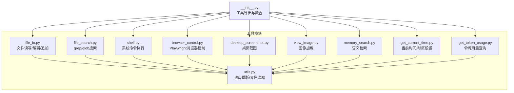
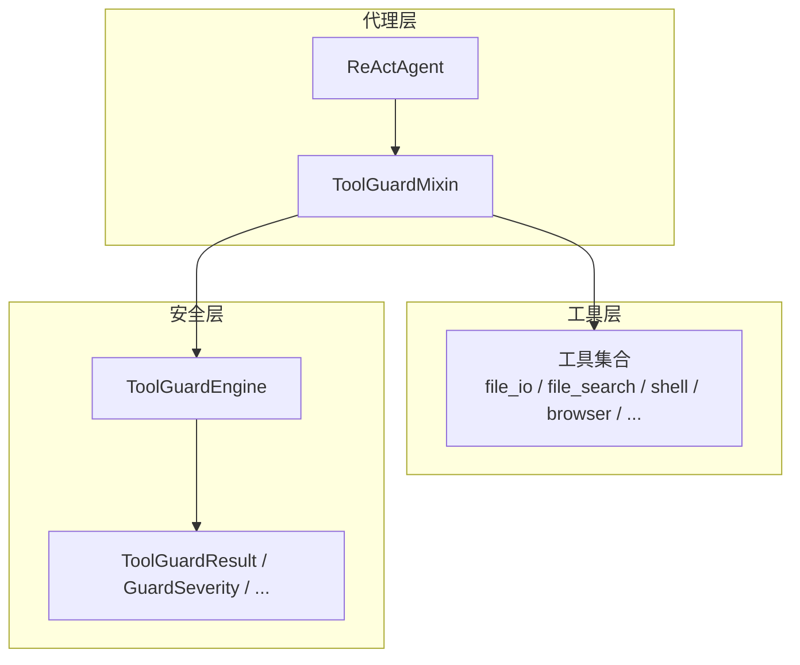
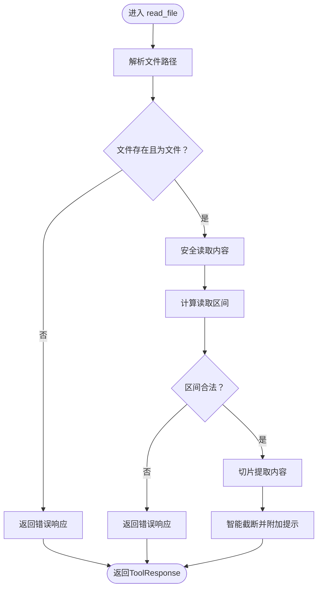
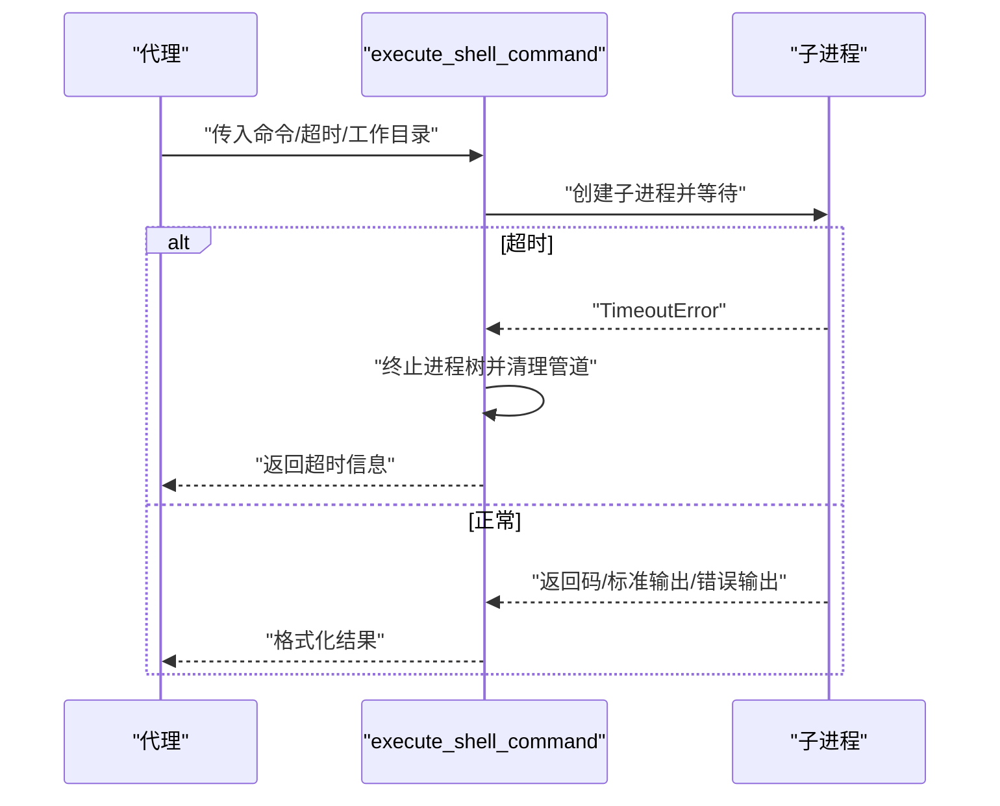
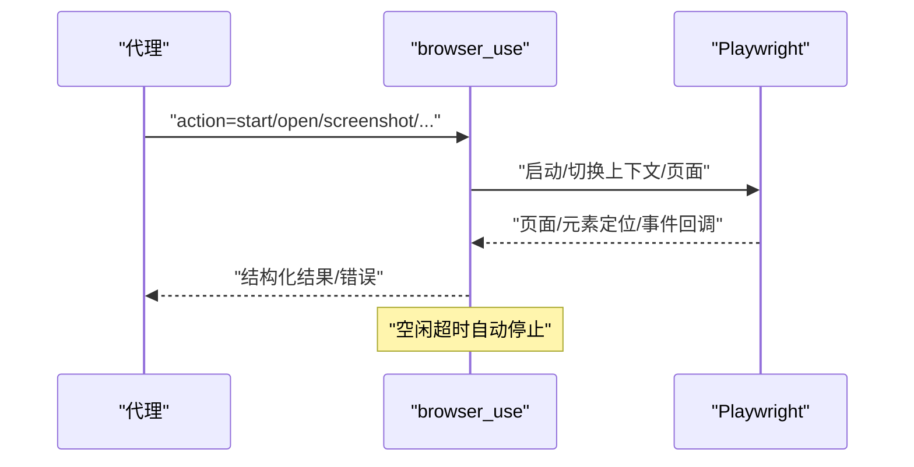
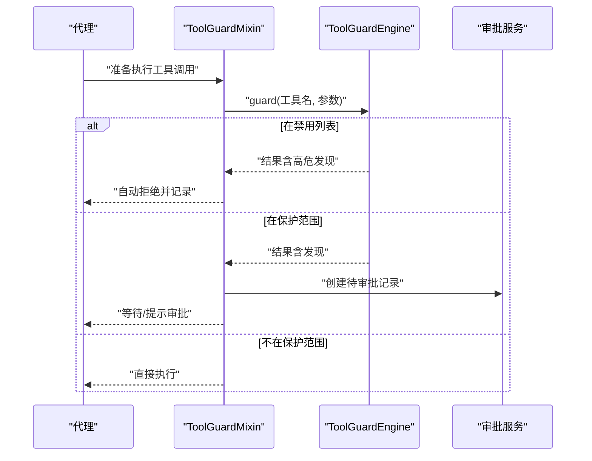
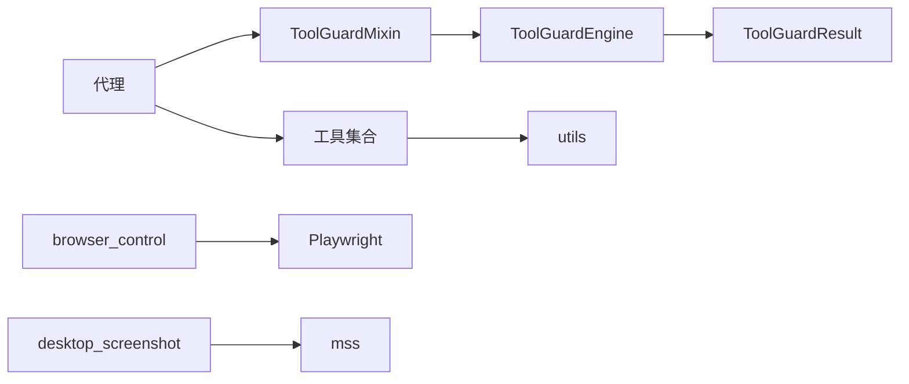

# 代理工具集成

<cite>
**本文引用的文件**
- [src\copaw\agents\tools\__init__.py](file://src\copaw\agents\tools\__init__.py)
- [src\copaw\agents\tools\file_io.py](file://src\copaw\agents\tools\file_io.py)
- [src\copaw\agents\tools\file_search.py](file://src\copaw\agents\tools\file_search.py)
- [src\copaw\agents\tools\shell.py](file://src\copaw\agents\tools\shell.py)
- [src\copaw\agents\tools\browser_control.py](file://src\copaw\agents\tools\browser_control.py)
- [src\copaw\agents\tools\desktop_screenshot.py](file://src\copaw\agents\tools\desktop_screenshot.py)
- [src\copaw\agents\tools\view_image.py](file://src\copaw\agents\tools\view_image.py)
- [src\copaw\agents\tools\memory_search.py](file://src\copaw\agents\tools\memory_search.py)
- [src\copaw\agents\tools\get_current_time.py](file://src\copaw\agents\tools\get_current_time.py)
- [src\copaw\agents\tools\get_token_usage.py](file://src\copaw\agents\tools\get_token_usage.py)
- [src\copaw\agents\tools\utils.py](file://src\copaw\agents\tools\utils.py)
- [src\copaw\agents\tool_guard_mixin.py](file://src\copaw\agents\tool_guard_mixin.py)
- [src\copaw\security\tool_guard\engine.py](file://src\copaw\security\tool_guard\engine.py)
- [src\copaw\security\tool_guard\models.py](file://src\copaw\security\tool_guard\models.py)
</cite>

## 目录
1. [简介](#简介)
2. [项目结构](#项目结构)
3. [核心组件](#核心组件)
4. [架构总览](#架构总览)
5. [详细组件分析](#详细组件分析)
6. [依赖分析](#依赖分析)
7. [性能考虑](#性能考虑)
8. [故障排查指南](#故障排查指南)
9. [结论](#结论)
10. [附录](#附录)

## 简介
本文件面向CoPaw的“代理工具集成”子系统，系统化梳理工具集管理架构（工具注册、命名策略、冲突处理）、内置工具功能实现（文件操作、系统命令、浏览器控制、截图与图像查看、搜索与记忆检索、时间与时长统计、令牌用量查询），以及工具安全防护机制（权限控制、参数校验、执行限制）。同时提供工具开发规范、测试方法与集成示例，帮助开发者快速扩展与安全地使用工具。

## 项目结构
工具子系统位于Python包src\copaw\agents\tools下，采用模块化设计，每个工具独立为一个模块，并通过统一的导出入口集中注册。安全防护由独立的安全子系统提供，代理类通过混入方式接入工具调用前的拦截与审批流程。

图示来源
- [src\copaw\agents\tools\__init__.py](file://src\copaw\agents\tools\__init__.py)
- [src\copaw\agents\tools\file_io.py](file://src\copaw\agents\tools\file_io.py)
- [src\copaw\agents\tools\file_search.py](file://src\copaw\agents\tools\file_search.py)
- [src\copaw\agents\tools\shell.py](file://src\copaw\agents\tools\shell.py)
- [src\copaw\agents\tools\browser_control.py](file://src\copaw\agents\tools\browser_control.py)
- [src\copaw\agents\tools\desktop_screenshot.py](file://src\copaw\agents\tools\desktop_screenshot.py)
- [src\copaw\agents\tools\view_image.py](file://src\copaw\agents\tools\view_image.py)
- [src\copaw\agents\tools\memory_search.py](file://src\copaw\agents\tools\memory_search.py)
- [src\copaw\agents\tools\get_current_time.py](file://src\copaw\agents\tools\get_current_time.py)
- [src\copaw\agents\tools\get_token_usage.py](file://src\copaw\agents\tools\get_token_usage.py)
- [src\copaw\agents\tools\utils.py](file://src\copaw\agents\tools\utils.py)

章节来源
- [src\copaw\agents\tools\__init__.py](file://src\copaw\agents\tools\__init__.py)

## 核心组件
- 工具注册与导出：通过工具包的__init__.py集中导出所有工具函数，形成统一的工具集合，便于代理注册与调用。
- 工具命名策略：工具名称遵循清晰的动宾结构，如read_file、execute_shell_command、browser_use等，便于理解与检索。
- 冲突处理机制：工具名在导出层统一收敛，避免重复；若需扩展新工具，应确保命名唯一并在导出层显式注册。
- 安全防护：通过ToolGuardEngine对工具调用进行预检，支持规则型守护、审批流与拒绝列表，代理类通过ToolGuardMixin在执行前拦截敏感工具。

章节来源
- [src\copaw\agents\tools\__init__.py](file://src\copaw\agents\tools\__init__.py)
- [src\copaw\agents\tool_guard_mixin.py](file://src\copaw\agents\tool_guard_mixin.py)
- [src\copaw\security\tool_guard\engine.py](file://src\copaw\security\tool_guard\engine.py)

## 架构总览
工具子系统与安全子系统的交互如下：

图示来源
- [src\copaw\agents\tool_guard_mixin.py](file://src\copaw\agents\tool_guard_mixin.py)
- [src\copaw\security\tool_guard\engine.py](file://src\copaw\security\tool_guard\engine.py)
- [src\copaw\security\tool_guard\models.py](file://src\copaw\security\tool_guard\models.py)

## 详细组件分析

### 文件操作工具
- 功能要点
  - 统一路径解析：相对路径优先从当前工作空间解析，否则回退至全局工作目录。
  - 读取：支持按行范围读取与智能截断，避免大文件一次性输出。
  - 写入/追加：UTF-8编码写入，异常捕获并返回结构化错误。
  - 编辑：全文替换，先读取再写入，失败时保持原子性。
  - 截断策略：按行数与字节数上限截断，保留头部或尾部，附加续读提示。
- 关键实现参考
  - 路径解析与读取逻辑：[file_io.py](file://src\copaw\agents\tools\file_io.py)
  - 输出截断与文件读取：[utils.py](file://src\copaw\agents\tools\utils.py)

图示来源
- [src\copaw\agents\tools\file_io.py](file://src\copaw\agents\tools\file_io.py)
- [src\copaw\agents\tools\utils.py](file://src\copaw\agents\tools\utils.py)

章节来源
- [src\copaw\agents\tools\file_io.py](file://src\copaw\agents\tools\file_io.py)
- [src\copaw\agents\tools\utils.py](file://src\copaw\agents\tools\utils.py)

### 系统命令工具
- 功能要点
  - 跨平台执行：Windows使用线程池绕过异步子进程限制；其他平台使用asyncio子进程。
  - 超时控制：统一超时处理，超时后终止进程树并清理管道。
  - 环境变量：自动注入虚拟环境Python路径，保证子进程一致性。
  - 输出处理：根据返回码格式化输出，必要时截断。
- 关键实现参考
  - 命令执行与超时处理：[shell.py](file://src\copaw\agents\tools\shell.py)

图示来源
- [src\copaw\agents\tools\shell.py](file://src\copaw\agents\tools\shell.py)

章节来源
- [src\copaw\agents\tools\shell.py](file://src\copaw\agents\tools\shell.py)

### 浏览器控制工具
- 功能要点
  - Playwright驱动：支持同步/异步模式，自动选择默认浏览器或容器沙箱参数。
  - 多页签管理：基于page_id维护多标签页，自动监听新标签页打开。
  - 参考系统：基于快照refs进行稳定定位，支持点击、输入、截图、拖拽、表单填写、网络请求与控制台日志收集。
  - 空闲回收：空闲超时自动关闭浏览器以释放资源。
- 关键实现参考
  - 行为API与状态管理：[browser_control.py](file://src\copaw\agents\tools\browser_control.py)

图示来源
- [src\copaw\agents\tools\browser_control.py](file://src\copaw\agents\tools\browser_control.py)

章节来源
- [src\copaw\agents\tools\browser_control.py](file://src\copaw\agents\tools\browser_control.py)

### 截图与图像查看工具
- 功能要点
  - 桌面截图：跨平台全屏截图，Windows/Linux/macOS均可用mss；macOS可选窗口截图。
  - 图像查看：将图像文件封装为消息块供模型查看，支持格式校验。
- 关键实现参考
  - 截图与错误处理：[desktop_screenshot.py](file://src\copaw\agents\tools\desktop_screenshot.py)
  - 图像加载：[view_image.py](file://src\copaw\agents\tools\view_image.py)

章节来源
- [src\copaw\agents\tools\desktop_screenshot.py](file://src\copaw\agents\tools\desktop_screenshot.py)
- [src\copaw\agents\tools\view_image.py](file://src\copaw\agents\tools\view_image.py)

### 搜索与记忆检索工具
- 文件内容搜索（grep）
  - 支持正则/大小写敏感/上下文行数，自动跳过二进制与超大文件，限制匹配数量。
- 文件发现（glob）
  - 支持递归匹配与结果上限，相对路径解析。
- 记忆检索
  - 通过绑定的记忆管理器进行语义检索，返回片段与元信息。
- 关键实现参考
  - 搜索与过滤：[file_search.py](file://src\copaw\agents\tools\file_search.py)
  - 记忆检索工厂：[memory_search.py](file://src\copaw\agents\tools\memory_search.py)

章节来源
- [src\copaw\agents\tools\file_search.py](file://src\copaw\agents\tools\file_search.py)
- [src\copaw\agents\tools\memory_search.py](file://src\copaw\agents\tools\memory_search.py)

### 时间与时长统计工具
- 当前时间：按用户配置时区返回本地时间字符串。
- 时区设置：校验IANA时区名称并持久化保存。
- 关键实现参考
  - 时间与时区：[get_current_time.py](file://src\copaw\agents\tools\get_current_time.py)

章节来源
- [src\copaw\agents\tools\get_current_time.py](file://src\copaw\agents\tools\get_current_time.py)

### 令牌用量查询工具
- 功能要点
  - 按天/模型/供应商聚合统计，支持最近N天范围与过滤条件。
  - 返回汇总文本，便于直接展示。
- 关键实现参考
  - 令牌用量查询：[get_token_usage.py](file://src\copaw\agents\tools\get_token_usage.py)

章节来源
- [src\copaw\agents\tools\get_token_usage.py](file://src\copaw\agents\tools\get_token_usage.py)

### 工具安全防护机制
- 预检引擎
  - ToolGuardEngine负责编排守护者，聚合检查结果，支持启用开关、受保护工具集与禁用工具集。
- 结果模型
  - ToolGuardResult包含工具名、参数、发现项、严重级别、耗时等，支持按严重度与类别统计。
- 代理拦截
  - ToolGuardMixin在代理推理与行动阶段拦截敏感工具调用，支持自动拒绝、预审批与人工审批流程。
- 关键实现参考
  - 引擎与模型：[engine.py](file://src\copaw\security\tool_guard\engine.py), [models.py](file://src\copaw\security\tool_guard\models.py)
  - 代理混入：[tool_guard_mixin.py](file://src\copaw\agents\tool_guard_mixin.py)

图示来源
- [src\copaw\agents\tool_guard_mixin.py](file://src\copaw\agents\tool_guard_mixin.py)
- [src\copaw\security\tool_guard\engine.py](file://src\copaw\security\tool_guard\engine.py)
- [src\copaw\security\tool_guard\models.py](file://src\copaw\security\tool_guard\models.py)

章节来源
- [src\copaw\agents\tool_guard_mixin.py](file://src\copaw\agents\tool_guard_mixin.py)
- [src\copaw\security\tool_guard\engine.py](file://src\copaw\security\tool_guard\engine.py)
- [src\copaw\security\tool_guard\models.py](file://src\copaw\security\tool_guard\models.py)

## 依赖分析
- 工具间耦合
  - 工具模块彼此低耦合，仅通过公共工具（如utils）进行输出截断与文件读取。
- 安全子系统
  - 代理通过混入接入安全引擎；安全引擎依赖守护者与规则配置，结果模型独立于技能扫描。
- 外部依赖
  - 浏览器工具依赖Playwright；截图工具依赖mss（部分平台）；命令工具依赖系统子进程。

图示来源
- [src\copaw\agents\tool_guard_mixin.py](file://src\copaw\agents\tool_guard_mixin.py)
- [src\copaw\security\tool_guard\engine.py](file://src\copaw\security\tool_guard\engine.py)
- [src\copaw\security\tool_guard\models.py](file://src\copaw\security\tool_guard\models.py)
- [src\copaw\agents\tools\browser_control.py](file://src\copaw\agents\tools\browser_control.py)
- [src\copaw\agents\tools\desktop_screenshot.py](file://src\copaw\agents\tools\desktop_screenshot.py)
- [src\copaw\agents\tools\utils.py](file://src\copaw\agents\tools\utils.py)

章节来源
- [src\copaw\agents\tools\__init__.py](file://src\copaw\agents\tools\__init__.py)
- [src\copaw\agents\tools\utils.py](file://src\copaw\agents\tools\utils.py)
- [src\copaw\agents\tools\browser_control.py](file://src\copaw\agents\tools\browser_control.py)
- [src\copaw\agents\tools\desktop_screenshot.py](file://src\copaw\agents\tools\desktop_screenshot.py)
- [src\copaw\agents\tool_guard_mixin.py](file://src\copaw\agents\tool_guard_mixin.py)
- [src\copaw\security\tool_guard\engine.py](file://src\copaw\security\tool_guard\engine.py)
- [src\copaw\security\tool_guard\models.py](file://src\copaw\security\tool_guard\models.py)

## 性能考虑
- I/O与输出截断
  - 文件读取与命令输出均采用截断策略，避免大体量数据阻塞通信链路。
- 子进程与平台差异
  - Windows使用线程池规避异步子进程限制，其他平台使用原生异步；合理设置超时与资源回收。
- 浏览器生命周期
  - 空闲超时自动关闭浏览器，减少资源占用；在混合模式下使用同步Playwright以兼容特定运行环境。
- 搜索与过滤
  - 搜索工具对二进制与超大文件进行启发式跳过，限制最大匹配数，降低I/O压力。

## 故障排查指南
- 工具返回错误
  - 使用统一的ToolResponse结构，错误信息包含明确的类型与文本描述，便于前端渲染与日志定位。
- 命令执行失败
  - 检查超时设置、工作目录、环境变量PATH是否包含虚拟环境Python路径；关注stderr中的具体错误。
- 浏览器相关问题
  - 确认Playwright安装与可执行文件路径；容器环境启用沙箱参数；macOS可尝试使用系统默认浏览器。
- 安全拦截
  - 若工具被拦截，检查ToolGuardResult的严重级别与发现项；确认是否需要预审批或调整规则。

章节来源
- [src\copaw\agents\tools\file_io.py](file://src\copaw\agents\tools\file_io.py)
- [src\copaw\agents\tools\shell.py](file://src\copaw\agents\tools\shell.py)
- [src\copaw\agents\tools\browser_control.py](file://src\copaw\agents\tools\browser_control.py)
- [src\copaw\agents\tool_guard_mixin.py](file://src\copaw\agents\tool_guard_mixin.py)
- [src\copaw\security\tool_guard\models.py](file://src\copaw\security\tool_guard\models.py)

## 结论
CoPaw的代理工具集成以模块化与安全为核心设计原则：工具通过统一导出入口注册，命名清晰、职责单一；安全子系统在代理执行前进行预检与审批，保障系统安全可控。内置工具覆盖文件、命令、浏览器、截图、搜索与统计等常见场景，具备完善的参数校验、输出截断与错误处理能力。建议在扩展新工具时遵循统一接口、严格参数校验与输出截断策略，并纳入安全预检流程。

## 附录

### 工具开发规范
- 接口定义
  - 工具函数签名应明确参数与返回值类型，返回ToolResponse结构，包含类型化的消息块。
- 错误处理
  - 对输入参数进行显式校验；对文件/命令/网络等外部依赖进行异常捕获并返回结构化错误。
- 日志记录
  - 使用标准日志库记录关键事件与错误；避免在日志中泄露敏感信息。
- 输出截断
  - 对大体量输出采用行数与字节上限截断，保留头部或尾部，并附加续读提示。
- 平台兼容
  - 跨平台工具需分别处理Windows与其他平台差异，必要时提供降级方案。

### 测试方法
- 单元测试
  - 针对工具函数编写参数边界与异常分支测试，覆盖文件不存在、路径非法、超时等场景。
- 集成测试
  - 在代理中集成工具调用，验证安全拦截与审批流程；模拟浏览器与命令执行环境。
- 回归测试
  - 对输出截断、路径解析、时区设置等功能进行回归验证，确保版本升级不引入破坏性变更。

### 集成示例
- 注册工具
  - 在工具包导出入口添加新工具函数，确保命名唯一并加入__all__列表。
- 安全接入
  - 将ToolGuardMixin混入代理类，确保在推理与行动阶段拦截敏感工具调用。
- 规则配置
  - 通过环境变量或配置文件启用/禁用工具守卫，设置受保护工具集与禁用工具集。

章节来源
- [src\copaw\agents\tools\__init__.py](file://src\copaw\agents\tools\__init__.py)
- [src\copaw\agents\tool_guard_mixin.py](file://src\copaw\agents\tool_guard_mixin.py)
- [src\copaw\security\tool_guard\engine.py](file://src\copaw\security\tool_guard\engine.py)