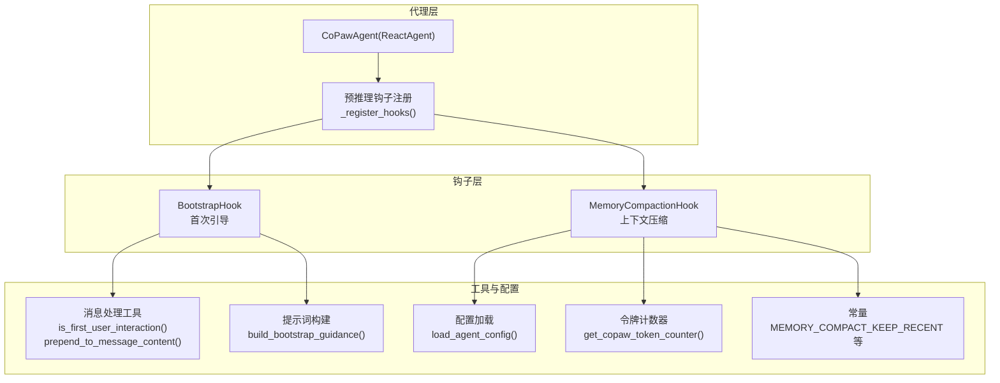
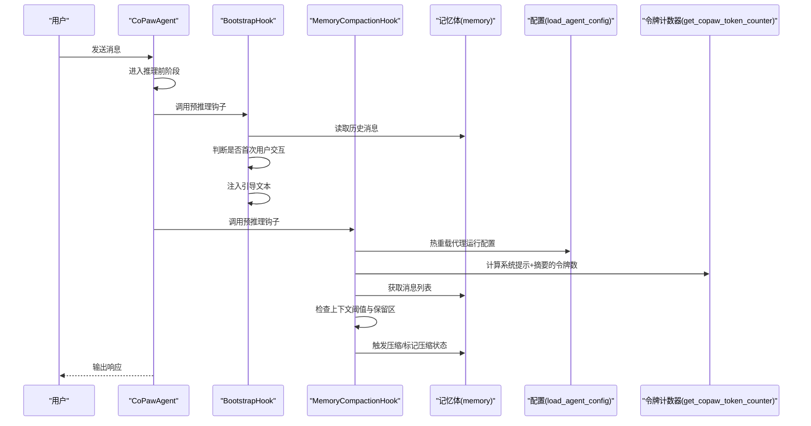
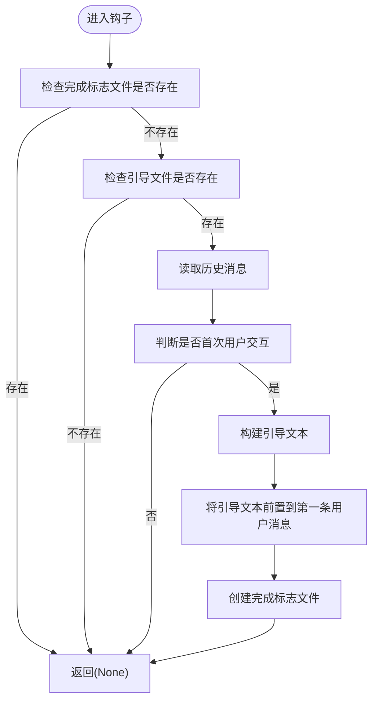
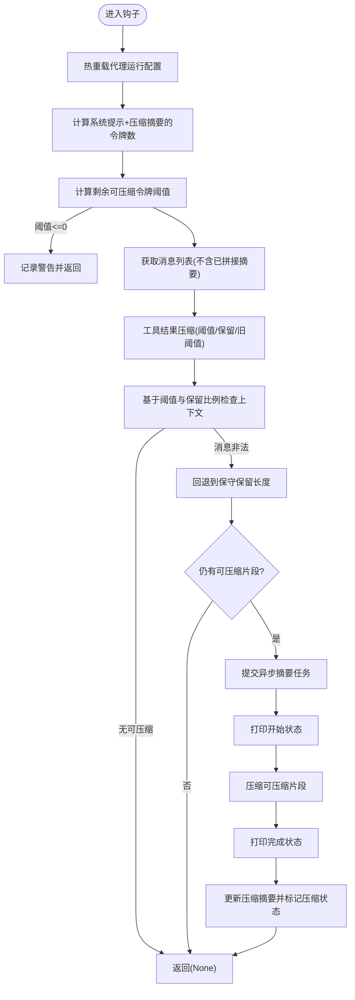
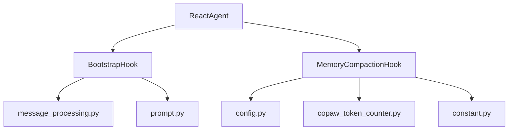

# 代理钩子系统

<cite>
**本文引用的文件**   
- [src/copaw/agents/hooks/bootstrap.py](file://src/copaw/agents/hooks/bootstrap.py)
- [src/copaw/agents/hooks/memory_compaction.py](file://src/copaw/agents/hooks/memory_compaction.py)
- [src/copaw/agents/hooks/__init__.py](file://src/copaw/agents/hooks/__init__.py)
- [src/copaw/agents/react_agent.py](file://src/copaw/agents/react_agent.py)
- [src/copaw/agents/utils/message_processing.py](file://src/copaw/agents/utils/message_processing.py)
- [src/copaw/agents/prompt.py](file://src/copaw/agents/prompt.py)
- [src/copaw/agents/utils/setup_utils.py](file://src/copaw/agents/utils/setup_utils.py)
- [src/copaw/constant.py](file://src/copaw/constant.py)
- [src/copaw/config/config.py](file://src/copaw/config/config.py)
- [website/public/docs/context.en.md](file://website/public/docs/context.en.md)
</cite>

## 目录
1. [简介](#简介)
2. [项目结构](#项目结构)
3. [核心组件](#核心组件)
4. [架构总览](#架构总览)
5. [详细组件分析](#详细组件分析)
6. [依赖分析](#依赖分析)
7. [性能考虑](#性能考虑)
8. [故障排查指南](#故障排查指南)
9. [结论](#结论)
10. [附录：自定义钩子开发指南与最佳实践](#附录自定义钩子开发指南与最佳实践)

## 简介
本文件面向CoPaw的“代理钩子系统”，系统性阐述以下内容：
- 钩子机制设计原理与执行时机：预推理钩子、预行动钩子的注册与执行流程
- BootstrapHook的实现细节：首次启动引导、配置检查、环境初始化
- MemoryCompactionHook的工作机制：内存使用监控、自动压缩触发、清理策略执行
- 执行顺序、异常处理与性能影响评估
- 自定义钩子开发指南、最佳实践与示例路径

## 项目结构
钩子系统位于代理模块的hooks包内，并由代理实例在推理前注册为预推理钩子；同时配合消息处理工具与提示词构建工具，形成完整的上下文管理闭环。

图表来源
- [src/copaw/agents/react_agent.py:323-351](file://src/copaw/agents/react_agent.py#L323-L351)
- [src/copaw/agents/hooks/bootstrap.py:20-104](file://src/copaw/agents/hooks/bootstrap.py#L20-L104)
- [src/copaw/agents/hooks/memory_compaction.py:28-201](file://src/copaw/agents/hooks/memory_compaction.py#L28-L201)
- [src/copaw/agents/utils/message_processing.py:419-462](file://src/copaw/agents/utils/message_processing.py#L419-L462)
- [src/copaw/agents/prompt.py:260-309](file://src/copaw/agents/prompt.py#L260-L309)
- [src/copaw/config/config.py:1-200](file://src/copaw/config/config.py#L1-L200)
- [src/copaw/constant.py:148-160](file://src/copaw/constant.py#L148-L160)

章节来源
- [src/copaw/agents/react_agent.py:323-351](file://src/copaw/agents/react_agent.py#L323-L351)
- [src/copaw/agents/hooks/__init__.py:1-19](file://src/copaw/agents/hooks/__init__.py#L1-L19)

## 核心组件
- BootstrapHook：在首次用户交互时检测工作目录中的引导文件，向第一条用户消息注入引导说明，仅触发一次
- MemoryCompactionHook：在推理前检查上下文令牌阈值，按策略压缩历史消息并保留近期与系统提示，支持工具结果压缩与清理

章节来源
- [src/copaw/agents/hooks/bootstrap.py:20-104](file://src/copaw/agents/hooks/bootstrap.py#L20-L104)
- [src/copaw/agents/hooks/memory_compaction.py:28-201](file://src/copaw/agents/hooks/memory_compaction.py#L28-L201)

## 架构总览
下图展示钩子在代理生命周期中的注册与调用位置，以及与消息、配置、令牌计数器等的交互关系。

图表来源
- [src/copaw/agents/react_agent.py:323-351](file://src/copaw/agents/react_agent.py#L323-L351)
- [src/copaw/agents/hooks/bootstrap.py:42-104](file://src/copaw/agents/hooks/bootstrap.py#L42-L104)
- [src/copaw/agents/hooks/memory_compaction.py:62-201](file://src/copaw/agents/hooks/memory_compaction.py#L62-L201)
- [src/copaw/config/config.py:1-200](file://src/copaw/config/config.py#L1-L200)
- [src/copaw/agents/utils/message_processing.py:419-462](file://src/copaw/agents/utils/message_processing.py#L419-L462)

## 详细组件分析

### BootstrapHook 组件分析
- 设计目标：首次启动引导，帮助用户建立身份与偏好，避免重复触发
- 关键行为
  - 检测工作目录是否存在引导文件与完成标志
  - 通过消息工具判断是否为首次用户交互
  - 使用提示词构建工具生成对应语言的引导文本
  - 将引导文本前置到第一条用户消息的内容中
  - 创建完成标志以防止后续重复触发
- 错误处理：捕获异常并记录错误日志，不影响主推理流程

图表来源
- [src/copaw/agents/hooks/bootstrap.py:42-104](file://src/copaw/agents/hooks/bootstrap.py#L42-L104)
- [src/copaw/agents/utils/message_processing.py:419-462](file://src/copaw/agents/utils/message_processing.py#L419-L462)
- [src/copaw/agents/prompt.py:260-309](file://src/copaw/agents/prompt.py#L260-L309)

章节来源
- [src/copaw/agents/hooks/bootstrap.py:20-104](file://src/copaw/agents/hooks/bootstrap.py#L20-L104)
- [src/copaw/agents/utils/message_processing.py:419-462](file://src/copaw/agents/utils/message_processing.py#L419-L462)
- [src/copaw/agents/prompt.py:260-309](file://src/copaw/agents/prompt.py#L260-L309)

### MemoryCompactionHook 组件分析
- 设计目标：在上下文接近阈值时自动压缩历史消息，保留系统提示与近期消息，维持对话连贯性
- 关键行为
  - 热重载代理运行配置，获取上下文阈值、保留比例、工具结果压缩策略等
  - 计算系统提示与压缩摘要的令牌数，得到剩余可压缩空间
  - 对工具结果进行分段压缩与落盘清理
  - 基于令牌计数与保留策略划分“可压缩区”与“保留区”
  - 异常安全：当消息序列不合法时，回退到保守保留长度
  - 提交异步摘要任务并打印状态消息，完成后更新压缩摘要与标记压缩状态
- 性能与可靠性
  - 采用异步摘要任务与状态输出，避免阻塞主推理
  - 通过保留区确保近期上下文完整性
  - 当阈值设置过低或摘要过长时给出警告

图表来源
- [src/copaw/agents/hooks/memory_compaction.py:62-201](file://src/copaw/agents/hooks/memory_compaction.py#L62-L201)
- [src/copaw/config/config.py:1-200](file://src/copaw/config/config.py#L1-L200)
- [src/copaw/constant.py:148-160](file://src/copaw/constant.py#L148-L160)
- [website/public/docs/context.en.md:107-153](file://website/public/docs/context.en.md#L107-L153)

章节来源
- [src/copaw/agents/hooks/memory_compaction.py:28-201](file://src/copaw/agents/hooks/memory_compaction.py#L28-L201)
- [src/copaw/constant.py:148-160](file://src/copaw/constant.py#L148-L160)
- [website/public/docs/context.en.md:107-153](file://website/public/docs/context.en.md#L107-L153)

### 执行顺序与控制流
- 预推理钩子注册：在代理构造完成后，按顺序注册BootstrapHook与MemoryCompactionHook
- 执行顺序：先执行BootstrapHook，再执行MemoryCompactionHook
- 预行动钩子：当前未使用预行动钩子，但框架支持扩展

章节来源
- [src/copaw/agents/react_agent.py:323-351](file://src/copaw/agents/react_agent.py#L323-L351)
- [src/copaw/agents/hooks/__init__.py:1-19](file://src/copaw/agents/hooks/__init__.py#L1-L19)

## 依赖分析
- 内部依赖
  - BootstrapHook依赖消息处理工具（首次交互判断、内容前置）
  - BootstrapHook依赖提示词构建工具（引导文本生成）
  - MemoryCompactionHook依赖配置加载（热重载）、令牌计数器（估算令牌数）、常量（保留条数）
- 外部依赖
  - AgentScope的钩子接口约定（callable协议）
  - ReActAgent与消息格式（Msg、TextBlock）

图表来源
- [src/copaw/agents/hooks/bootstrap.py:12-15](file://src/copaw/agents/hooks/bootstrap.py#L12-L15)
- [src/copaw/agents/hooks/memory_compaction.py:15-19](file://src/copaw/agents/hooks/memory_compaction.py#L15-L19)
- [src/copaw/agents/react_agent.py:323-351](file://src/copaw/agents/react_agent.py#L323-L351)
- [src/copaw/agents/utils/message_processing.py:419-462](file://src/copaw/agents/utils/message_processing.py#L419-L462)
- [src/copaw/agents/prompt.py:260-309](file://src/copaw/agents/prompt.py#L260-L309)
- [src/copaw/config/config.py:1-200](file://src/copaw/config/config.py#L1-L200)
- [src/copaw/constant.py:148-160](file://src/copaw/constant.py#L148-L160)

## 性能考虑
- 令牌估算与缓存：MemoryCompactionHook通过令牌计数器缓存降低重复计算开销
- 异步摘要：压缩过程提交异步任务，避免阻塞推理主流程
- 保留区策略：通过保留最近N条消息保证上下文连续性，减少重复压缩成本
- 工具结果压缩：对长输出进行截断与落盘，降低整体上下文体积

章节来源
- [src/copaw/agents/hooks/memory_compaction.py:62-201](file://src/copaw/agents/hooks/memory_compaction.py#L62-L201)
- [src/copaw/constant.py:148-160](file://src/copaw/constant.py#L148-L160)
- [website/public/docs/context.en.md:107-153](file://website/public/docs/context.en.md#L107-L153)

## 故障排查指南
- 引导钩子无效
  - 检查工作目录是否存在引导文件与完成标志
  - 确认是否为首次用户交互
  - 查看日志中关于引导注入与标志创建的调试信息
- 上下文压缩未触发
  - 检查上下文阈值与系统提示+摘要的令牌占用
  - 若阈值过低会记录警告
  - 确认工具结果压缩策略参数是否启用
- 压缩后消息不合法
  - 当检测到消息对不完整时，会回退到保守保留长度
  - 可通过历史命令查看上下文状态
- 日志定位
  - 引导钩子与压缩钩子均包含详细的日志记录，便于问题定位

章节来源
- [src/copaw/agents/hooks/bootstrap.py:56-104](file://src/copaw/agents/hooks/bootstrap.py#L56-L104)
- [src/copaw/agents/hooks/memory_compaction.py:104-151](file://src/copaw/agents/hooks/memory_compaction.py#L104-L151)
- [src/copaw/agents/utils/message_processing.py:419-462](file://src/copaw/agents/utils/message_processing.py#L419-L462)

## 结论
CoPaw的代理钩子系统通过BootstrapHook与MemoryCompactionHook实现了“首次引导”和“上下文压缩”的关键能力。前者确保新用户的顺利上手，后者保障长对话场景下的稳定性与性能。两者均遵循AgentScope的钩子接口规范，在预推理阶段执行，具备完善的异常处理与可观测性。未来可在预行动钩子扩展更多业务逻辑，如动作前校验、审计日志等。

## 附录：自定义钩子开发指南与最佳实践
- 开发步骤
  - 实现可调用对象（类或函数），遵循AgentScope钩子接口
  - 在代理的预推理阶段注册钩子
  - 在钩子内部进行条件判断与数据修改，保持幂等与最小副作用
- 最佳实践
  - 优先使用异步IO与缓存（如令牌计数器缓存）
  - 明确钩子职责边界，避免跨钩子共享状态
  - 充分记录日志，区分调试、警告与错误级别
  - 对外部依赖（配置、模型、文件系统）做好异常保护
- 示例路径参考
  - 引导钩子实现与注册：[src/copaw/agents/hooks/bootstrap.py:20-104](file://src/copaw/agents/hooks/bootstrap.py#L20-L104)，[src/copaw/agents/react_agent.py:323-351](file://src/copaw/agents/react_agent.py#L323-L351)
  - 上下文压缩钩子实现与配置加载：[src/copaw/agents/hooks/memory_compaction.py:28-201](file://src/copaw/agents/hooks/memory_compaction.py#L28-L201)，[src/copaw/config/config.py:1-200](file://src/copaw/config/config.py#L1-L200)
  - 消息处理工具（首次交互判断、内容前置）：[src/copaw/agents/utils/message_processing.py:419-462](file://src/copaw/agents/utils/message_processing.py#L419-L462)
  - 提示词构建工具（引导文本）：[src/copaw/agents/prompt.py:260-309](file://src/copaw/agents/prompt.py#L260-L309)
  - 常量与默认值（保留条数等）：[src/copaw/constant.py:148-160](file://src/copaw/constant.py#L148-L160)