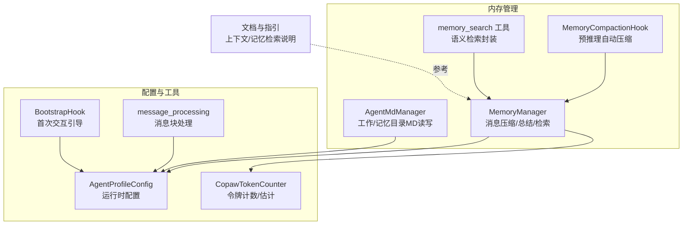
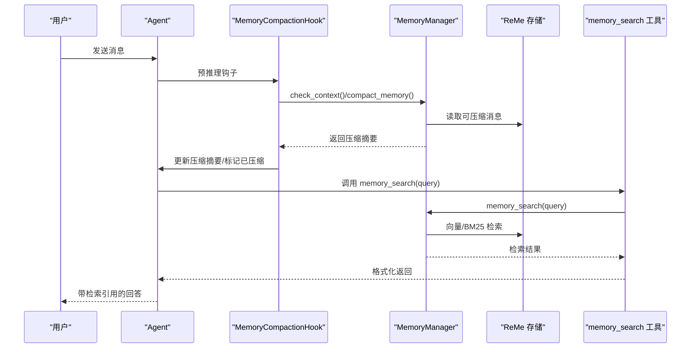
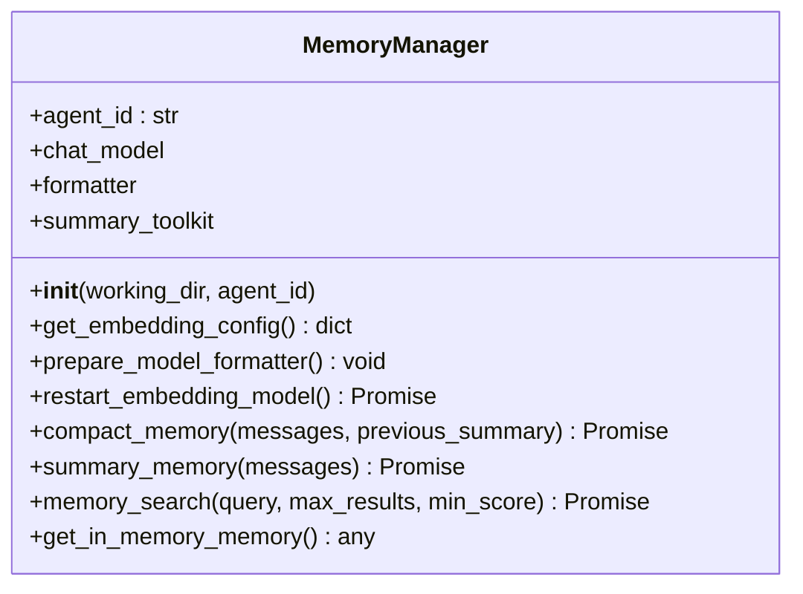
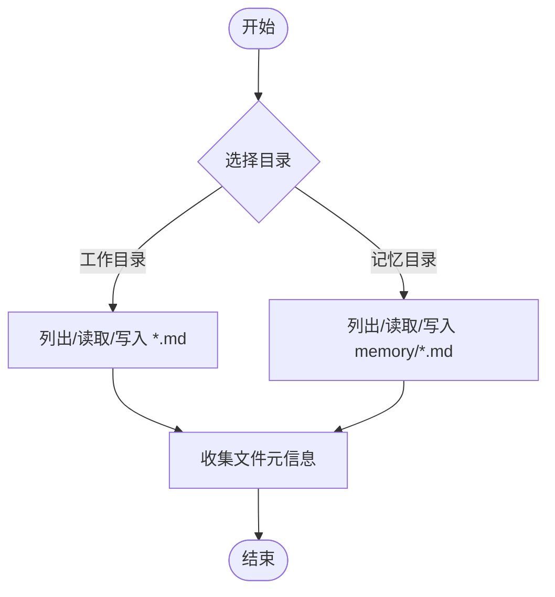
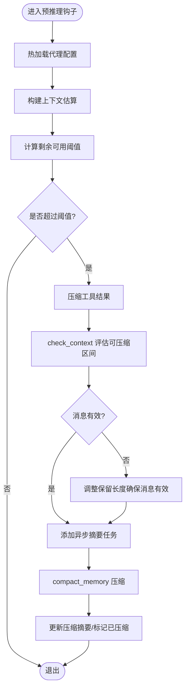
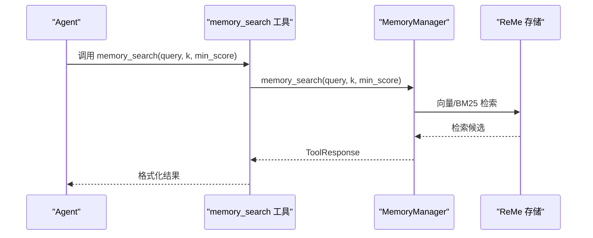
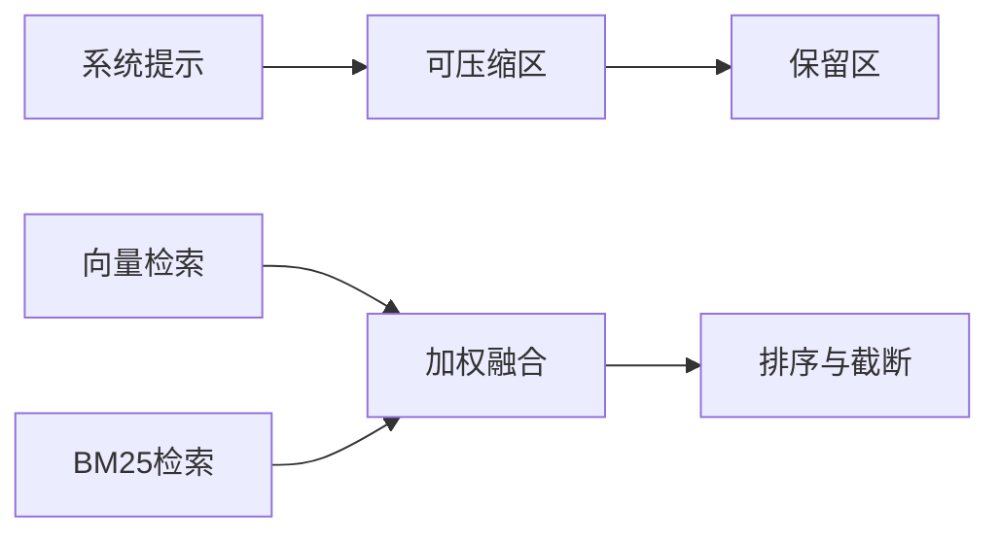
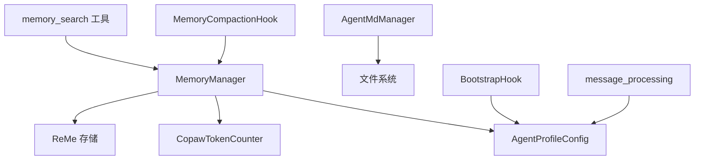

# 内存管理系统

<cite>
**本文引用的文件**
- [memory_manager.py](file://src/copaw/agents/memory/memory_manager.py)
- [agent_md_manager.py](file://src/copaw/agents/memory/agent_md_manager.py)
- [memory_compaction.py](file://src/copaw/agents/hooks/memory_compaction.py)
- [memory_search.py](file://src/copaw/agents/tools/memory_search.py)
- [config.py](file://src/copaw/config/config.py)
- [copaw_token_counter.py](file://src/copaw/agents/utils/copaw_token_counter.py)
- [message_processing.py](file://src/copaw/agents/utils/message_processing.py)
- [bootstrap.py](file://src/copaw/agents/hooks/bootstrap.py)
- [MEMORY.md（中文）](file://src/copaw/agents/md_files/zh/MEMORY.md)
- [context.en.md](file://website/public/docs/context.en.md)
- [memory.zh.md](file://website/public/docs/memory.zh.md)
- [constant.py](file://src/copaw/constant.py)
</cite>

## 目录
1. [简介](#简介)
2. [项目结构](#项目结构)
3. [核心组件](#核心组件)
4. [架构总览](#架构总览)
5. [详细组件分析](#详细组件分析)
6. [依赖关系分析](#依赖关系分析)
7. [性能考量](#性能考量)
8. [故障排查指南](#故障排查指南)
9. [结论](#结论)
10. [附录](#附录)

## 简介
本文件系统化梳理 CoPaw 的内存管理系统，覆盖消息存储、上下文管理、记忆检索机制；详解 AgentMDManager 的 Markdown 文件管理、配置文件处理与动态内容更新；说明内存压缩钩子的自动清理策略、阈值控制与性能优化；介绍内存搜索工具的向量化搜索、相似度计算与结果排序；并提供内存配置、监控与调试的实用指南与代码示例路径。

## 项目结构
围绕内存管理的关键模块分布如下：
- 内存管理器：负责消息压缩、总结、检索与嵌入配置加载
- Markdown 管理器：工作目录与记忆目录的 Markdown 文件读写与列表
- 内存压缩钩子：基于上下文窗口阈值的自动压缩
- 搜索工具：封装 MemoryManager 的语义检索能力
- 配置与计数：运行时配置、嵌入参数、令牌计数与缓存
- 文档与引导：上下文结构说明、记忆检索原理、首次交互引导

**图表来源**
- [memory_manager.py:43-310](file://src/copaw/agents/memory/memory_manager.py#L43-L310)
- [agent_md_manager.py:8-124](file://src/copaw/agents/memory/agent_md_manager.py#L8-L124)
- [memory_compaction.py:28-201](file://src/copaw/agents/hooks/memory_compaction.py#L28-L201)
- [memory_search.py:7-70](file://src/copaw/agents/tools/memory_search.py#L7-L70)
- [config.py:252-353](file://src/copaw/config/config.py#L252-L353)
- [copaw_token_counter.py:20-211](file://src/copaw/agents/utils/copaw_token_counter.py#L20-L211)
- [message_processing.py:374-462](file://src/copaw/agents/utils/message_processing.py#L374-L462)
- [bootstrap.py:20-104](file://src/copaw/agents/hooks/bootstrap.py#L20-L104)

**章节来源**
- [memory_manager.py:1-310](file://src/copaw/agents/memory/memory_manager.py#L1-L310)
- [agent_md_manager.py:1-124](file://src/copaw/agents/memory/agent_md_manager.py#L1-L124)
- [memory_compaction.py:1-201](file://src/copaw/agents/hooks/memory_compaction.py#L1-L201)
- [memory_search.py:1-70](file://src/copaw/agents/tools/memory_search.py#L1-L70)
- [config.py:252-353](file://src/copaw/config/config.py#L252-L353)
- [copaw_token_counter.py:1-211](file://src/copaw/agents/utils/copaw_token_counter.py#L1-L211)
- [message_processing.py:1-462](file://src/copaw/agents/utils/message_processing.py#L1-L462)
- [bootstrap.py:1-104](file://src/copaw/agents/hooks/bootstrap.py#L1-L104)
- [context.en.md:1-62](file://website/public/docs/context.en.md#L1-L62)
- [memory.zh.md:143-168](file://website/public/docs/memory.zh.md#L143-L168)

## 核心组件
- MemoryManager：扩展 ReMeLight，提供消息压缩、总结、检索与嵌入配置加载；支持向量与全文检索后端选择；支持热重载嵌入配置。
- AgentMdManager：统一管理工作目录与记忆目录下的 Markdown 文件，提供列表、读取、写入能力。
- MemoryCompactionHook：在推理前检查上下文窗口，自动触发压缩，保留系统提示与近期消息，压缩历史消息。
- memory_search 工具：绑定 MemoryManager，提供语义检索封装，返回带路径与行号的结果。
- 配置与计数：运行时配置包含嵌入与上下文阈值；CopawTokenCounter 提供本地/镜像 HuggingFace 分词器与字符估算。
- 引导与消息处理：BootstrapHook 在首次用户交互时注入引导；message_processing 处理文件/媒体块下载与本地化。

**章节来源**
- [memory_manager.py:43-310](file://src/copaw/agents/memory/memory_manager.py#L43-L310)
- [agent_md_manager.py:8-124](file://src/copaw/agents/memory/agent_md_manager.py#L8-L124)
- [memory_compaction.py:28-201](file://src/copaw/agents/hooks/memory_compaction.py#L28-L201)
- [memory_search.py:7-70](file://src/copaw/agents/tools/memory_search.py#L7-L70)
- [config.py:252-353](file://src/copaw/config/config.py#L252-L353)
- [copaw_token_counter.py:20-211](file://src/copaw/agents/utils/copaw_token_counter.py#L20-L211)
- [message_processing.py:374-462](file://src/copaw/agents/utils/message_processing.py#L374-L462)
- [bootstrap.py:20-104](file://src/copaw/agents/hooks/bootstrap.py#L20-L104)

## 架构总览
内存管理由“配置驱动 + 工具链 + 钩子”构成：
- 配置层：AgentProfileConfig 提供运行时参数（最大输入长度、压缩比例、保留比例、嵌入配置等）
- 工具层：MemoryManager 聚合 ReMeLight 能力；AgentMdManager 管理 MD 文件；memory_search 工具封装检索
- 钩子层：MemoryCompactionHook 在推理前进行上下文评估与压缩
- 计数层：CopawTokenCounter 提供准确计数与字符估算，支撑阈值判断
- 文档与引导：上下文结构与记忆检索原理文档，BootstrapHook 注入首次交互引导

**图表来源**
- [memory_compaction.py:62-201](file://src/copaw/agents/hooks/memory_compaction.py#L62-L201)
- [memory_manager.py:198-310](file://src/copaw/agents/memory/memory_manager.py#L198-L310)
- [memory_search.py:17-70](file://src/copaw/agents/tools/memory_search.py#L17-L70)

## 详细组件分析

### MemoryManager 组件分析
- 设计要点
  - 嵌入配置优先级：配置文件 > 环境变量 > 默认值；支持热重载
  - 向量检索启用条件：需同时具备 base_url 与 model_name
  - 全文检索开关：通过环境变量控制
  - 存储后端选择：auto 根据平台选择 local 或 chroma
  - 总结与压缩：结合聊天模型、格式化器与令牌计数器
  - 检索接口：返回 ToolResponse，支持最小分数与结果数量控制
- 关键方法
  - compact_memory：按比例压缩消息，支持传入先前摘要
  - summary_memory：生成综合摘要，配合文件操作工具
  - memory_search：跨存储检索，支持向量与全文融合
  - get_in_memory_memory：返回内存中当前内容并统计令牌
  - restart_embedding_model：重启嵌入模型以应用新配置
- 错误处理
  - 未启动 ReMe 时返回错误提示
  - 嵌入不可用时记录警告并降级功能

**图表来源**
- [memory_manager.py:43-310](file://src/copaw/agents/memory/memory_manager.py#L43-L310)

**章节来源**
- [memory_manager.py:43-310](file://src/copaw/agents/memory/memory_manager.py#L43-L310)
- [config.py:217-250](file://src/copaw/config/config.py#L217-L250)

### AgentMdManager 组件分析
- 功能
  - 工作目录与记忆目录的 Markdown 列表、读取、写入
  - 自动补齐 .md 后缀
  - 返回文件元信息（大小、创建/修改时间）
- 使用场景
  - 工作区初始化与经验沉淀
  - 记忆归档与快速检索
- 注意事项
  - 不存在文件时抛出异常，调用方需捕获

**图表来源**
- [agent_md_manager.py:19-124](file://src/copaw/agents/memory/agent_md_manager.py#L19-L124)

**章节来源**
- [agent_md_manager.py:8-124](file://src/copaw/agents/memory/agent_md_manager.py#L8-L124)
- [MEMORY.md（中文）:1-27](file://src/copaw/agents/md_files/zh/MEMORY.md#L1-L27)

### 内存压缩钩子（MemoryCompactionHook）分析
- 自动清理策略
  - 预推理阶段评估上下文令牌占用
  - 保留系统提示与近期消息，压缩历史消息
  - 支持工具结果的近期/旧阈值压缩与保留天数
- 阈值控制
  - memory_compact_threshold：基于最大输入长度与压缩比例
  - memory_compact_reserve：基于保留比例
  - 若阈值过低，记录警告并回退至安全保留长度
- 性能优化
  - 异步任务队列：先添加异步摘要任务，再进行压缩
  - 仅对可压缩区间进行压缩，避免重复压缩
  - 压缩完成后标记消息状态，避免重复处理

**图表来源**
- [memory_compaction.py:62-201](file://src/copaw/agents/hooks/memory_compaction.py#L62-L201)
- [config.py:291-353](file://src/copaw/config/config.py#L291-L353)

**章节来源**
- [memory_compaction.py:28-201](file://src/copaw/agents/hooks/memory_compaction.py#L28-L201)
- [config.py:291-353](file://src/copaw/config/config.py#L291-L353)
- [context.en.md:25-62](file://website/public/docs/context.en.md#L25-L62)

### 内存搜索工具（memory_search）分析
- 封装逻辑
  - 绑定 MemoryManager 实例，直接调用 memory_search
  - 返回 ToolResponse，包含路径、行号与片段内容
- 使用建议
  - 在回答前调用，确保检索到相关记忆
  - 合理设置 max_results 与 min_score，平衡召回与噪声
- 错误处理
  - 管理器未启用时返回错误提示
  - 捕获异常并返回可读错误信息

**图表来源**
- [memory_search.py:17-70](file://src/copaw/agents/tools/memory_search.py#L17-L70)
- [memory_manager.py:259-294](file://src/copaw/agents/memory/memory_manager.py#L259-L294)

**章节来源**
- [memory_search.py:7-70](file://src/copaw/agents/tools/memory_search.py#L7-L70)
- [memory_manager.py:259-294](file://src/copaw/agents/memory/memory_manager.py#L259-L294)
- [memory.zh.md:143-168](file://website/public/docs/memory.zh.md#L143-L168)

### 上下文管理与记忆检索原理
- 上下文结构
  - 系统提示（始终保留）
  - 可压缩区（历史消息，超阈值时压缩）
  - 保留区（最近 N 条消息，保持连续性）
- 混合检索
  - 向量语义搜索：捕捉语义相近但措辞不同
  - BM25 全文检索：对精确 token 更敏感
  - 加权融合：向量权重 0.7，BM25 权重 0.3，去重合并后排序

**图表来源**
- [context.en.md:25-62](file://website/public/docs/context.en.md#L25-L62)
- [memory.zh.md:154-220](file://website/public/docs/memory.zh.md#L154-L220)

**章节来源**
- [context.en.md:1-62](file://website/public/docs/context.en.md#L1-L62)
- [memory.zh.md:143-220](file://website/public/docs/memory.zh.md#L143-L220)

## 依赖关系分析
- 组件耦合
  - MemoryManager 依赖配置加载、令牌计数器与模型工厂
  - MemoryCompactionHook 依赖 MemoryManager 与配置热加载
  - memory_search 工具依赖 MemoryManager
  - AgentMdManager 依赖工作目录路径
- 外部依赖
  - ReMe（内存存储与检索）
  - Agentscope（消息、工具、格式化器、令牌计数器）
  - HuggingFace（分词器镜像支持）

**图表来源**
- [memory_manager.py:15-310](file://src/copaw/agents/memory/memory_manager.py#L15-L310)
- [memory_compaction.py:28-201](file://src/copaw/agents/hooks/memory_compaction.py#L28-L201)
- [memory_search.py:7-70](file://src/copaw/agents/tools/memory_search.py#L7-L70)
- [agent_md_manager.py:12-17](file://src/copaw/agents/memory/agent_md_manager.py#L12-L17)
- [config.py:252-353](file://src/copaw/config/config.py#L252-L353)
- [copaw_token_counter.py:20-211](file://src/copaw/agents/utils/copaw_token_counter.py#L20-L211)
- [message_processing.py:374-462](file://src/copaw/agents/utils/message_processing.py#L374-L462)
- [bootstrap.py:20-104](file://src/copaw/agents/hooks/bootstrap.py#L20-L104)

**章节来源**
- [memory_manager.py:1-310](file://src/copaw/agents/memory/memory_manager.py#L1-L310)
- [memory_compaction.py:1-201](file://src/copaw/agents/hooks/memory_compaction.py#L1-L201)
- [memory_search.py:1-70](file://src/copaw/agents/tools/memory_search.py#L1-L70)
- [agent_md_manager.py:1-124](file://src/copaw/agents/memory/agent_md_manager.py#L1-L124)
- [config.py:252-353](file://src/copaw/config/config.py#L252-L353)
- [copaw_token_counter.py:1-211](file://src/copaw/agents/utils/copaw_token_counter.py#L1-L211)
- [message_processing.py:1-462](file://src/copaw/agents/utils/message_processing.py#L1-L462)
- [bootstrap.py:1-104](file://src/copaw/agents/hooks/bootstrap.py#L1-L104)

## 性能考量
- 令牌计数与估算
  - 优先使用本地/镜像 HuggingFace 分词器，失败时回退字符估算
  - 通过缓存复用相同配置的计数器实例，降低初始化开销
- 检索性能
  - 向量与 BM25 并行候选池扩大（默认 3×），再进行加权融合
  - 结果去重与排序在候选集上完成，控制输出规模
- 压缩策略
  - 仅压缩历史消息，保留近期消息保证连续性
  - 异步摘要任务避免阻塞主推理流程
- 存储后端
  - auto 模式根据平台选择本地或 Chroma，兼顾易用与性能

**章节来源**
- [copaw_token_counter.py:20-211](file://src/copaw/agents/utils/copaw_token_counter.py#L20-L211)
- [memory_manager.py:72-130](file://src/copaw/agents/memory/memory_manager.py#L72-L130)
- [memory_compaction.py:169-191](file://src/copaw/agents/hooks/memory_compaction.py#L169-L191)
- [memory.zh.md:200-220](file://website/public/docs/memory.zh.md#L200-L220)

## 故障排查指南
- ReMe 未启动
  - 现象：检索返回错误提示
  - 排查：确认 MemoryManager 初始化成功且已启动
  - 参考路径：[memory_manager.py:279-287](file://src/copaw/agents/memory/memory_manager.py#L279-L287)
- 嵌入不可用或配置缺失
  - 现象：向量检索不可用，记录警告
  - 排查：检查嵌入配置优先级与环境变量
  - 参考路径：[memory_manager.py:82-104](file://src/copaw/agents/memory/memory_manager.py#L82-L104)
- 阈值设置过低
  - 现象：系统提示与压缩摘要总长度超过阈值
  - 排查：增大 memory_compact_ratio 或减少系统提示长度
  - 参考路径：[memory_compaction.py:104-113](file://src/copaw/agents/hooks/memory_compaction.py#L104-L113)
- 检索结果为空或质量差
  - 现象：min_score 设置过高或候选不足
  - 排查：适当降低 min_score，扩大候选倍数
  - 参考路径：[memory_manager.py:259-294](file://src/copaw/agents/memory/memory_manager.py#L259-L294)
- MD 文件读写异常
  - 现象：找不到文件或权限问题
  - 排查：确认文件存在与编码正确
  - 参考路径：[agent_md_manager.py:59-62](file://src/copaw/agents/memory/agent_md_manager.py#L59-L62)

**章节来源**
- [memory_manager.py:82-104](file://src/copaw/agents/memory/memory_manager.py#L82-L104)
- [memory_manager.py:259-294](file://src/copaw/agents/memory/memory_manager.py#L259-L294)
- [memory_compaction.py:104-113](file://src/copaw/agents/hooks/memory_compaction.py#L104-L113)
- [agent_md_manager.py:59-62](file://src/copaw/agents/memory/agent_md_manager.py#L59-L62)

## 结论
CoPaw 的内存管理系统通过“配置驱动 + 工具链 + 钩子”的架构实现了：
- 可靠的消息存储与检索（向量 + 全文）
- 智能的上下文压缩与保留策略
- 易用的 Markdown 文件管理与引导机制
- 可观测与可调试的令牌计数与错误处理
建议在生产环境中合理设置阈值与检索参数，并结合实际硬件选择合适的存储后端。

## 附录

### 内存配置与环境变量速查
- 嵌入配置优先级：配置文件 > 环境变量 > 默认值
- 环境变量
  - EMBEDDING_API_KEY：嵌入 API 密钥
  - EMBEDDING_BASE_URL：嵌入基础地址
  - EMBEDDING_MODEL_NAME：嵌入模型名称
  - FTS_ENABLED：是否启用全文检索（默认 true）
  - MEMORY_STORE_BACKEND：内存存储后端（auto/local/chroma，默认 auto）
- 运行时配置（AgentProfileConfig.running）
  - max_input_length：最大输入长度（tokens）
  - memory_compact_ratio：压缩比例
  - memory_reserve_ratio：保留比例
  - tool_result_compact_*：工具结果压缩阈值与保留天数
- 常量与环境
  - MEMORY_COMPACT_KEEP_RECENT：保留最近消息条数
  - MEMORY_DIR：记忆目录
  - WORKING_DIR：工作目录

**章节来源**
- [memory_manager.py:68-118](file://src/copaw/agents/memory/memory_manager.py#L68-L118)
- [config.py:252-353](file://src/copaw/config/config.py#L252-L353)
- [constant.py:148-152](file://src/copaw/constant.py#L148-L152)

### 实用指南与代码示例路径
- 启用/禁用全文检索
  - 设置环境变量 FTS_ENABLED
  - 参考路径：[memory_manager.py:106-107](file://src/copaw/agents/memory/memory_manager.py#L106-L107)
- 配置嵌入参数
  - 在配置文件中设置 embedding_config，或通过环境变量覆盖
  - 参考路径：[memory_manager.py:149-167](file://src/copaw/agents/memory/memory_manager.py#L149-L167)
- 调整压缩阈值
  - 修改 memory_compact_ratio 与 memory_reserve_ratio
  - 参考路径：[config.py:291-353](file://src/copaw/config/config.py#L291-L353)
- 使用 memory_search 工具
  - 在回答前调用，设置 max_results 与 min_score
  - 参考路径：[memory_search.py:17-70](file://src/copaw/agents/tools/memory_search.py#L17-L70)
- 管理 Markdown 文件
  - 列表/读取/写入工作目录与记忆目录下的 .md 文件
  - 参考路径：[agent_md_manager.py:19-124](file://src/copaw/agents/memory/agent_md_manager.py#L19-L124)
- 首次交互引导
  - 检测 BOOTSTRAP.md 并在首次用户消息前注入引导
  - 参考路径：[bootstrap.py:42-104](file://src/copaw/agents/hooks/bootstrap.py#L42-L104)