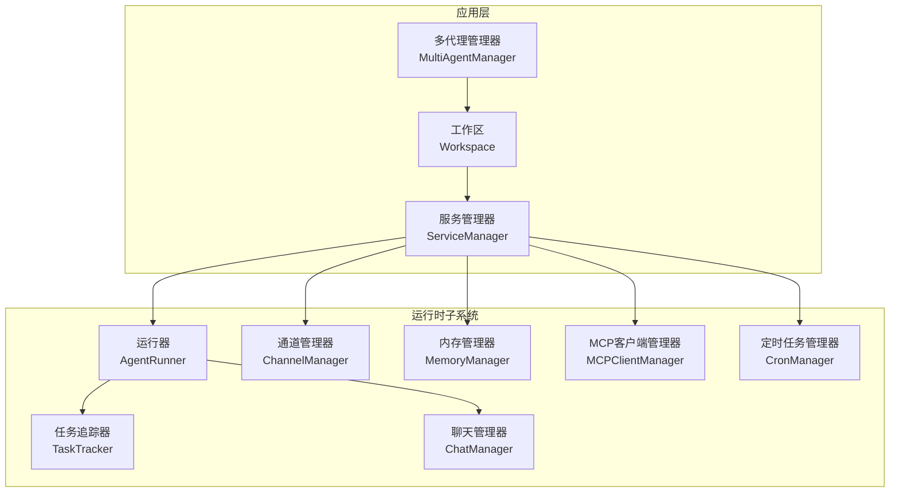
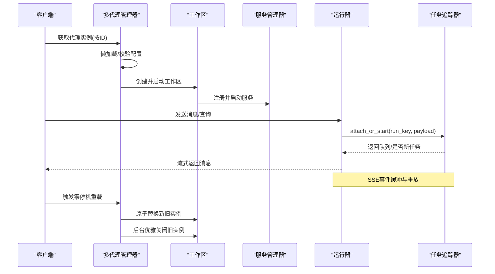
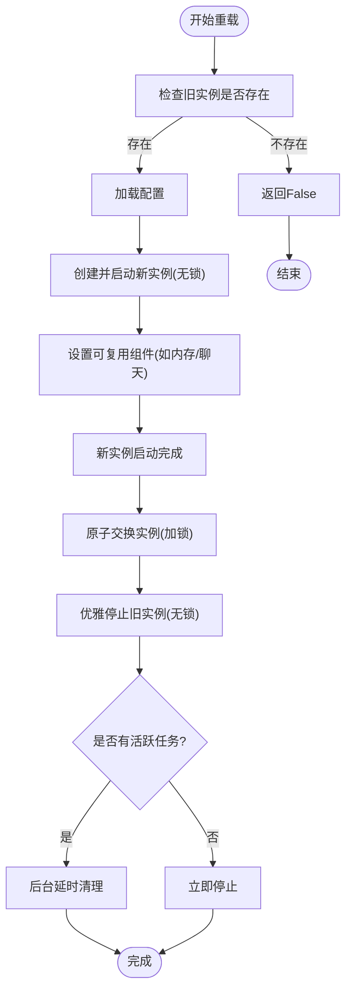
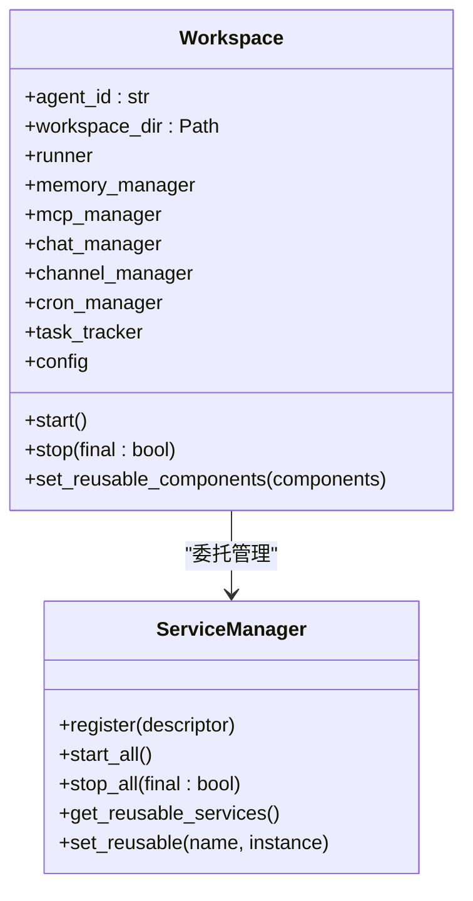
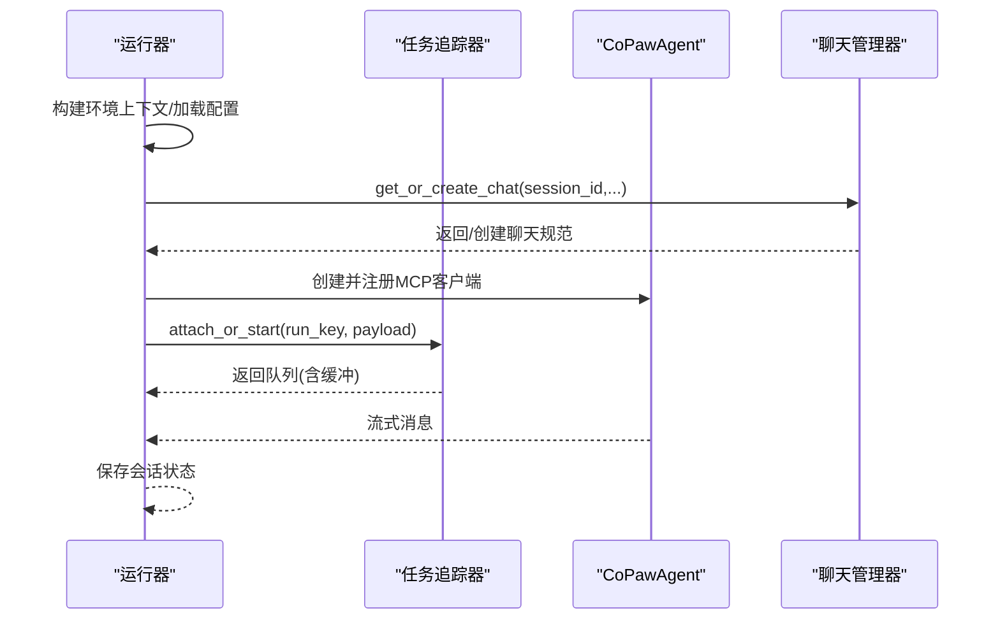
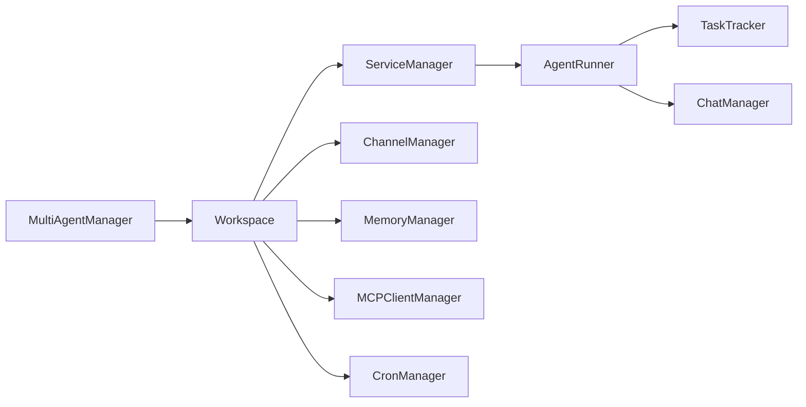

# 多代理管理系统

<cite>
**本文档引用的文件**
- [multi_agent_manager.py](file://src/copaw/app/multi_agent_manager.py)
- [workspace.py](file://src/copaw/app/workspace/workspace.py)
- [service_manager.py](file://src/copaw/app/workspace/service_manager.py)
- [service_factories.py](file://src/copaw/app/workspace/service_factories.py)
- [runner.py](file://src/copaw/app/runner/runner.py)
- [task_tracker.py](file://src/copaw/app/runner/task_tracker.py)
- [manager.py](file://src/copaw/app/runner/manager.py)
- [config.py](file://src/copaw/config/config.py)
- [react_agent.py](file://src/copaw/agents/react_agent.py)
- [memory_manager.py](file://src/copaw/agents/memory/memory_manager.py)
- [manager.py](file://src/copaw/app/crons/manager.py)
- [manager.py](file://src/copaw/app/mcp/manager.py)
- [manager.py](file://src/copaw/app/channels/manager.py)
</cite>

## 目录
1. [简介](#简介)
2. [项目结构](#项目结构)
3. [核心组件](#核心组件)
4. [架构总览](#架构总览)
5. [详细组件分析](#详细组件分析)
6. [依赖关系分析](#依赖关系分析)
7. [性能考虑](#性能考虑)
8. [故障排查指南](#故障排查指南)
9. [结论](#结论)

## 简介
本文件面向CoPaw多代理管理系统，系统性阐述多代理管理器的架构与实现，覆盖代理实例的创建、启动、停止与销毁流程；工作区系统的运行机制与配置隔离；代理生命周期管理（状态跟踪、资源分配、并发控制）；代理间通信与资源共享、冲突解决策略；以及多代理部署、监控与故障恢复的实践指南。

## 项目结构
CoPaw采用“多代理 + 工作区”双层架构：每个代理以独立工作区运行，工作区内部包含Runner、ChannelManager、MemoryManager、MCPClientManager、CronManager等子系统；多代理管理器负责按需加载、零停机热重载、清理后台任务与全局关停。

图表来源
- [multi_agent_manager.py:17-451](file://src/copaw/app/multi_agent_manager.py#L17-L451)
- [workspace.py:39-367](file://src/copaw/app/workspace/workspace.py#L39-L367)
- [service_manager.py:74-415](file://src/copaw/app/workspace/service_manager.py#L74-L415)
- [runner.py:63-515](file://src/copaw/app/runner/runner.py#L63-L515)
- [task_tracker.py:31-222](file://src/copaw/app/runner/task_tracker.py#L31-L222)
- [manager.py:17-203](file://src/copaw/app/runner/manager.py#L17-L203)
- [manager.py:114-565](file://src/copaw/app/channels/manager.py#L114-L565)
- [manager.py:23-225](file://src/copaw/app/mcp/manager.py#L23-L225)
- [manager.py:32-359](file://src/copaw/app/crons/manager.py#L32-L359)

章节来源
- [multi_agent_manager.py:17-451](file://src/copaw/app/multi_agent_manager.py#L17-L451)
- [workspace.py:39-367](file://src/copaw/app/workspace/workspace.py#L39-L367)
- [service_manager.py:74-415](file://src/copaw/app/workspace/service_manager.py#L74-L415)

## 核心组件
- 多代理管理器（MultiAgentManager）
  - 按需懒加载代理工作区，线程安全（异步锁），支持零停机热重载与后台清理任务管理。
- 工作区（Workspace）
  - 单个代理的完整运行时容器，封装Runner、ChannelManager、MemoryManager、MCPClientManager、CronManager等。
- 服务管理器（ServiceManager）
  - 统一注册、生命周期编排、依赖解析与可复用组件传递，支持并发初始化与顺序初始化混合。
- 运行器（AgentRunner）
  - 请求处理入口，集成工具守卫审批、会话状态读写、MCP客户端注入与流式输出。
- 任务追踪器（TaskTracker）
  - 跟踪每个run_key的异步任务，支持事件缓冲、队列广播、断连重放与批量清理。
- 配置系统（Config）
  - 根配置与代理配置分离，支持代理引用、通道、MCP、心跳、运行参数等。

章节来源
- [multi_agent_manager.py:17-451](file://src/copaw/app/multi_agent_manager.py#L17-L451)
- [workspace.py:39-367](file://src/copaw/app/workspace/workspace.py#L39-L367)
- [service_manager.py:74-415](file://src/copaw/app/workspace/service_manager.py#L74-L415)
- [runner.py:63-515](file://src/copaw/app/runner/runner.py#L63-L515)
- [task_tracker.py:31-222](file://src/copaw/app/runner/task_tracker.py#L31-L222)
- [config.py:380-453](file://src/copaw/config/config.py#L380-L453)

## 架构总览
下图展示从请求到响应的端到端路径，以及多代理管理器如何协调工作区生命周期与服务复用。

图表来源
- [multi_agent_manager.py:34-311](file://src/copaw/app/multi_agent_manager.py#L34-L311)
- [workspace.py:311-357](file://src/copaw/app/workspace/workspace.py#L311-L357)
- [service_manager.py:171-229](file://src/copaw/app/workspace/service_manager.py#L171-L229)
- [runner.py:175-378](file://src/copaw/app/runner/runner.py#L175-L378)
- [task_tracker.py:124-207](file://src/copaw/app/runner/task_tracker.py#L124-L207)

## 详细组件分析

### 多代理管理器（MultiAgentManager）
- 功能要点
  - 懒加载：首次请求时才创建并启动工作区。
  - 生命周期：支持停止单个代理、批量启动、零停机重载。
  - 并发安全：使用异步锁保护共享状态。
  - 零停机重载：新实例先在无锁环境下创建与启动，再原子替换，旧实例若有活跃任务则延后清理。
  - 清理任务：跟踪后台清理任务，关停时统一取消/等待。
- 关键流程
  - get_agent：懒加载与异常处理。
  - reload_agent：分阶段创建新实例、设置可复用组件、原子替换、优雅关闭旧实例。
  - stop_all/cancel_all_cleanup_tasks：关停所有代理并清理后台任务。

图表来源
- [multi_agent_manager.py:200-311](file://src/copaw/app/multi_agent_manager.py#L200-L311)

章节来源
- [multi_agent_manager.py:34-311](file://src/copaw/app/multi_agent_manager.py#L34-L311)

### 工作区（Workspace）
- 功能要点
  - 封装Runner、ChannelManager、MemoryManager、MCPClientManager、CronManager等。
  - 通过ServiceManager声明式注册服务，支持优先级、并发/顺序初始化、可复用组件传递。
  - 提供set_reusable_components用于热重载时复用内存/聊天等组件。
- 生命周期
  - start：加载代理配置，通过ServiceManager启动全部服务。
  - stop：根据final标志决定是否停止可复用组件，避免热重载中断。

图表来源
- [workspace.py:39-367](file://src/copaw/app/workspace/workspace.py#L39-L367)
- [service_manager.py:74-415](file://src/copaw/app/workspace/service_manager.py#L74-L415)

章节来源
- [workspace.py:39-367](file://src/copaw/app/workspace/workspace.py#L39-L367)
- [service_manager.py:74-415](file://src/copaw/app/workspace/service_manager.py#L74-L415)
- [service_factories.py:18-164](file://src/copaw/app/workspace/service_factories.py#L18-L164)

### 服务管理器（ServiceManager）
- 设计模式
  - 使用ServiceDescriptor描述服务元信息（类、初始化参数、后置钩子、启动/停止方法、优先级、是否可复用、并发初始化等）。
  - 分组按优先级启动，同优先级内并发或顺序混合。
  - 可复用组件在reload时传递给新实例，并触发reload_func。
- 关键能力
  - start_all：并发/顺序混合启动，自动跳过已复用组件。
  - stop_all：逆序停止，final=False时跳过可复用组件。
  - get_reusable_services/set_reusable：支持热重载组件复用。

章节来源
- [service_manager.py:30-415](file://src/copaw/app/workspace/service_manager.py#L30-L415)

### 运行器（AgentRunner）与任务追踪器（TaskTracker）
- AgentRunner
  - 查询处理入口：构建环境上下文、加载代理配置、创建CoPawAgent、自动注册聊天、加载/保存会话状态、流式输出。
  - 工具守卫审批：检测待审批会话，超时/同意/拒绝分支处理。
  - MCP客户端注入：在每次查询前从MCPClientManager获取最新客户端列表。
- TaskTracker
  - per-run状态：run_key -> 任务Future、队列列表、事件缓冲。
  - attach_or_start：若已有活动run则重放缓冲并加入队列，否则新建生产者任务。
  - attach/request_stop/wait_all_done：支持断连重连、取消、等待全部完成。

图表来源
- [runner.py:175-378](file://src/copaw/app/runner/runner.py#L175-L378)
- [task_tracker.py:124-207](file://src/copaw/app/runner/task_tracker.py#L124-L207)
- [manager.py:80-135](file://src/copaw/app/runner/manager.py#L80-L135)

章节来源
- [runner.py:63-515](file://src/copaw/app/runner/runner.py#L63-L515)
- [task_tracker.py:31-222](file://src/copaw/app/runner/task_tracker.py#L31-L222)
- [manager.py:17-203](file://src/copaw/app/runner/manager.py#L17-L203)

### 配置系统（Config）
- 根配置（AgentsConfig）：包含active_agent与profiles（仅ID与工作区目录），便于多代理并存。
- 代理配置（AgentProfileConfig）：每代理独立配置文件，包含通道、MCP、心跳、运行参数、语言、工具、安全等。
- 支持热重载：MemoryManager嵌入的向量/全文检索配置可通过环境变量与配置动态调整。

章节来源
- [config.py:455-496](file://src/copaw/config/config.py#L455-L496)
- [config.py:394-453](file://src/copaw/config/config.py#L394-L453)
- [memory_manager.py:149-196](file://src/copaw/agents/memory/memory_manager.py#L149-L196)

### 代理组件与安全
- CoPawAgent
  - 集成工具、技能、内存管理、引导钩子与命令处理。
  - 支持MCP客户端注册与恢复，媒体块回退（当模型不支持时自动剥离媒体内容并重试）。
- 工具守卫与技能扫描
  - 工具守卫规则与审批超时控制，拒绝/超时/同意分支明确。
  - 技能扫描白名单与模式匹配，支持阻断/警告/关闭三种模式。

章节来源
- [react_agent.py:63-800](file://src/copaw/agents/react_agent.py#L63-L800)

### 通道、定时任务与MCP
- 通道管理器（ChannelManager）
  - 从配置/环境创建各通道实例，统一入队与消费者循环，支持同会话合并、去抖与并发消费者。
  - 支持热替换单通道，最小锁持有时间。
- 定时任务管理器（CronManager）
  - 基于AsyncIOScheduler，支持并发信号量、misfire处理、心跳作业动态调度。
- MCP客户端管理器（MCPClientManager）
  - 从配置初始化客户端，支持连接超时、替换与关闭，重建信息保留以便恢复。

章节来源
- [manager.py:114-565](file://src/copaw/app/channels/manager.py#L114-L565)
- [manager.py:32-359](file://src/copaw/app/crons/manager.py#L32-L359)
- [manager.py:23-225](file://src/copaw/app/mcp/manager.py#L23-L225)

## 依赖关系分析
- 组件耦合
  - MultiAgentManager与Workspace强关联：前者负责实例生命周期与热重载，后者承载具体运行时。
  - Workspace与ServiceManager高内聚：通过描述符声明式装配各子系统。
  - AgentRunner与TaskTracker、ChatManager紧密协作：前者驱动推理与流式输出，后者保障事件可靠传输。
- 外部依赖
  - APScheduler用于定时任务；AgentScope/ReActAgent作为推理引擎；ReMeLight提供记忆与检索能力。
- 循环依赖规避
  - 通过工厂函数与延迟绑定（post_init）避免直接循环导入；Manager与ServiceManager解耦。

图表来源
- [multi_agent_manager.py:17-451](file://src/copaw/app/multi_agent_manager.py#L17-L451)
- [workspace.py:39-367](file://src/copaw/app/workspace/workspace.py#L39-L367)
- [service_manager.py:74-415](file://src/copaw/app/workspace/service_manager.py#L74-L415)

章节来源
- [multi_agent_manager.py:17-451](file://src/copaw/app/multi_agent_manager.py#L17-L451)
- [workspace.py:39-367](file://src/copaw/app/workspace/workspace.py#L39-L367)
- [service_manager.py:74-415](file://src/copaw/app/workspace/service_manager.py#L74-L415)

## 性能考虑
- 懒加载与并发启动
  - MultiAgentManager按需创建代理，减少冷启动开销；ServiceManager对同优先级服务并发初始化，缩短启动时间。
- 零停机重载
  - 新实例提前创建与启动，仅在原子交换阶段短暂加锁，最大化服务可用性。
- 事件流优化
  - TaskTracker使用队列缓冲与广播，避免重复消费；断连时重放缓冲，降低丢包风险。
- 内存与检索
  - MemoryManager支持向量/全文检索开关与缓存配置，结合令牌计数器与压缩阈值，平衡性能与存储。

## 故障排查指南
- 重载失败
  - 现象：新实例启动失败，旧实例继续提供服务。
  - 排查：查看MultiAgentManager日志中“Failed to start new workspace instance”与清理尝试。
  - 处理：修复配置或资源限制后再次重载。
- 活跃任务导致延迟清理
  - 现象：旧实例在重载后仍保留一段时间。
  - 排查：确认TaskTracker.has_active_tasks与后台清理任务状态。
  - 处理：等待任务自然完成或调用cancel_all_cleanup_tasks进行强制清理。
- 工具守卫拒绝/超时
  - 现象：用户收到“已拒绝/超时”的提示。
  - 排查：检查AgentRunner中的审批状态与超时逻辑。
  - 处理：在前端同意或重新发起请求；必要时调整超时阈值。
- 通道/定时任务异常
  - 现象：消息未送达或定时任务未执行。
  - 排查：查看ChannelManager/CronManager日志与状态更新。
  - 处理：重启对应管理器或修正配置。

章节来源
- [multi_agent_manager.py:83-179](file://src/copaw/app/multi_agent_manager.py#L83-L179)
- [task_tracker.py:54-98](file://src/copaw/app/runner/task_tracker.py#L54-L98)
- [runner.py:97-174](file://src/copaw/app/runner/runner.py#L97-L174)
- [manager.py:379-411](file://src/copaw/app/channels/manager.py#L379-L411)
- [manager.py:105-111](file://src/copaw/app/crons/manager.py#L105-L111)

## 结论
CoPaw的多代理管理系统通过“多代理管理器 + 工作区 + 服务管理器”的分层设计，实现了代理实例的懒加载、零停机热重载、并发初始化与优雅关停；配合运行器、任务追踪器、通道/定时任务/MCP管理器，形成完整的多代理运行时生态。该架构在保证高可用的同时，提供了良好的扩展性与可观测性，适合在生产环境中进行多代理部署与运维。