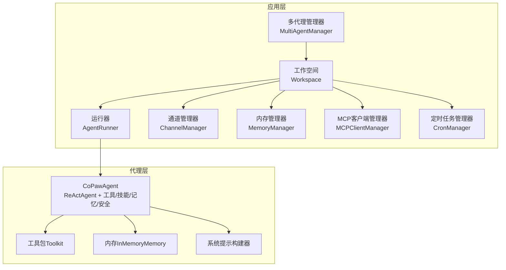
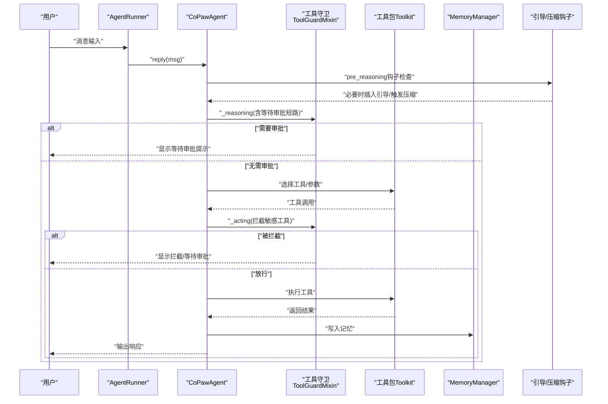
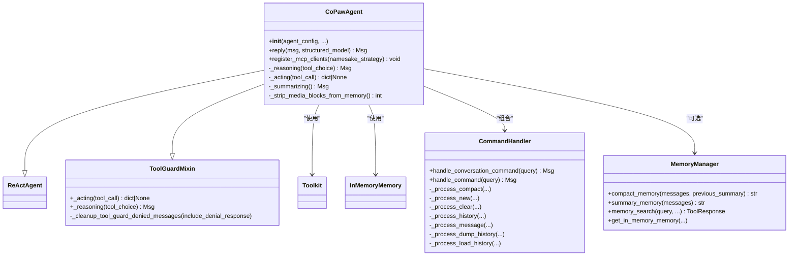
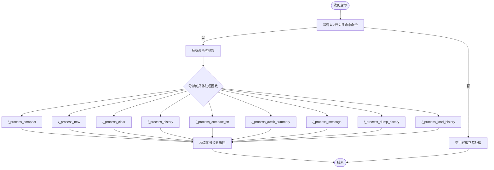
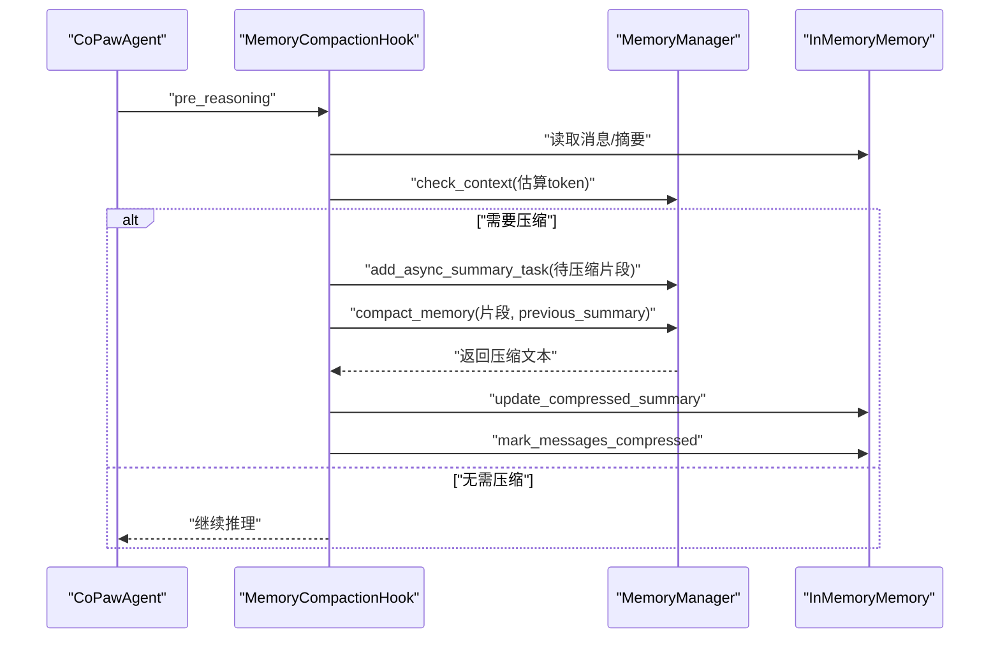
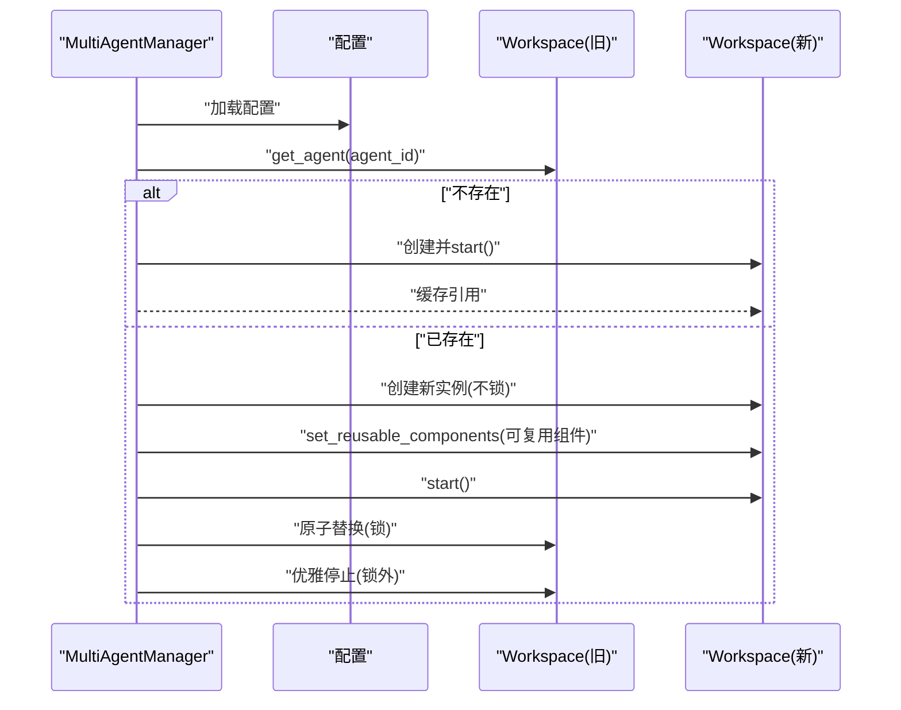
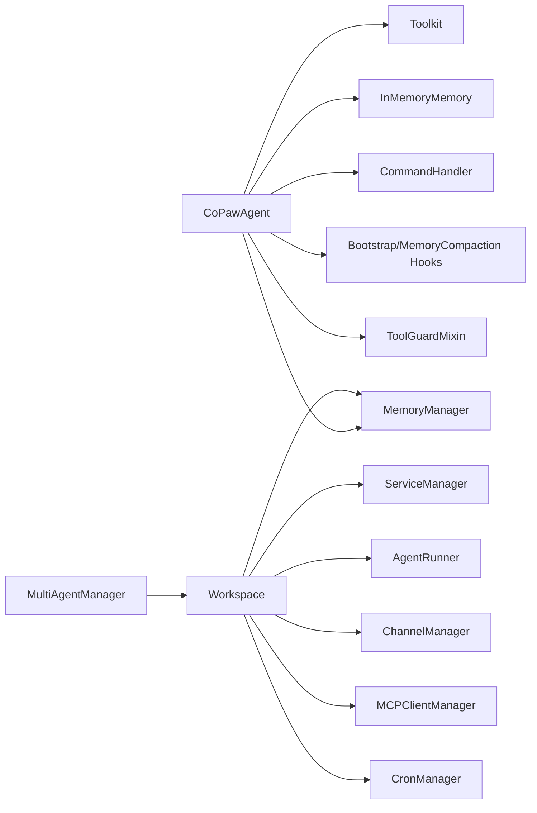

# 智能代理系统

<cite>
**本文引用的文件**
- [react_agent.py](file://src/copaw/agents/react_agent.py)
- [multi_agent_manager.py](file://src/copaw/app/multi_agent_manager.py)
- [command_handler.py](file://src/copaw/agents/command_handler.py)
- [skills_manager.py](file://src/copaw/agents/skills_manager.py)
- [memory_manager.py](file://src/copaw/agents/memory/memory_manager.py)
- [bootstrap.py](file://src/copaw/agents/hooks/bootstrap.py)
- [memory_compaction.py](file://src/copaw/agents/hooks/memory_compaction.py)
- [tool_guard_mixin.py](file://src/copaw/agents/tool_guard_mixin.py)
- [prompt.py](file://src/copaw/agents/prompt.py)
- [workspace.py](file://src/copaw/app/workspace/workspace.py)
- [__init__.py（工具包）](file://src/copaw/agents/tools/__init__.py)
- [utils.py（工具共享）](file://src/copaw/agents/tools/utils.py)
- [schema.py（工具类型）](file://src/copaw/agents/schema.py)
</cite>

## 目录
1. [简介](#简介)
2. [项目结构](#项目结构)
3. [核心组件](#核心组件)
4. [架构总览](#架构总览)
5. [详细组件分析](#详细组件分析)
6. [依赖分析](#依赖分析)
7. [性能考虑](#性能考虑)
8. [故障排查指南](#故障排查指南)
9. [结论](#结论)
10. [附录](#附录)

## 简介
本文件面向CoPaw智能代理系统的开发者与运维人员，系统化阐述ReAct代理架构在CoPaw中的实现方式，包括思考-行动循环机制、工具调用流程、记忆管理策略；深入解析CoPawAgent类的设计与继承关系、钩子机制与命令处理器；说明多代理管理器的生命周期与零停机热重载机制；介绍代理配置管理、会话状态维护与错误恢复；并提供最佳实践、性能优化与调试方法。

## 项目结构
CoPaw采用“工作空间+多代理管理器”的组织方式：每个代理以独立工作空间运行，内部封装Runner、通道、内存、MCP客户端、定时任务等完整运行时；多代理管理器负责按需加载、生命周期管理与零停机热重载。

图示来源
- [multi_agent_manager.py:17-451](file://src/copaw/app/multi_agent_manager.py#L17-L451)
- [workspace.py:39-367](file://src/copaw/app/workspace/workspace.py#L39-L367)
- [react_agent.py:63-165](file://src/copaw/agents/react_agent.py#L63-L165)

章节来源
- [multi_agent_manager.py:17-451](file://src/copaw/app/multi_agent_manager.py#L17-L451)
- [workspace.py:39-367](file://src/copaw/app/workspace/workspace.py#L39-L367)

## 核心组件
- CoPawAgent：基于ReActAgent扩展，集成内置工具、动态技能、内存管理、引导与自动压缩钩子、媒体块回退、工具守卫拦截等能力。
- 多代理管理器：按需加载、零停机热重载、并发启动、清理后台延迟任务。
- 命令处理器：支持/compact、/new、/clear、/history、/message、/dump_history、/load_history等会话级命令。
- 记忆管理器：消息压缩、摘要生成、向量/全文检索、嵌入配置热加载。
- 技能管理器：内置/自定义/激活技能同步、版本与差异检测、导入导出。
- 工具与工具集：文件操作、搜索、浏览器控制、截图、时间与时区、令牌用量统计、内存检索等。
- 钩子：首次交互引导、上下文满自动压缩。
- 工作空间：统一服务注册与生命周期管理。

章节来源
- [react_agent.py:63-840](file://src/copaw/agents/react_agent.py#L63-L840)
- [command_handler.py:59-489](file://src/copaw/agents/command_handler.py#L59-L489)
- [memory_manager.py:43-310](file://src/copaw/agents/memory/memory_manager.py#L43-L310)
- [skills_manager.py:1-1206](file://src/copaw/agents/skills_manager.py#L1-L1206)
- [workspace.py:39-367](file://src/copaw/app/workspace/workspace.py#L39-L367)

## 架构总览
下图展示ReAct代理在CoPaw中的关键交互路径：推理阶段触发工具守卫与可选的引导/压缩钩子；行动阶段进行工具调用与结果回写；记忆模块贯穿全程，支持压缩与检索；命令处理器提供会话级控制。

图示来源
- [react_agent.py:558-700](file://src/copaw/agents/react_agent.py#L558-L700)
- [tool_guard_mixin.py:103-182](file://src/copaw/agents/tool_guard_mixin.py#L103-L182)
- [command_handler.py:460-489](file://src/copaw/agents/command_handler.py#L460-L489)
- [memory_compaction.py:62-201](file://src/copaw/agents/hooks/memory_compaction.py#L62-L201)
- [bootstrap.py:42-104](file://src/copaw/agents/hooks/bootstrap.py#L42-L104)

## 详细组件分析

### CoPawAgent：ReAct代理的增强实现
- 继承关系与职责
  - 继承自ReActAgent，通过ToolGuardMixin实现工具拦截与审批流。
  - 内置工具包Toolkit，注册文件/搜索/浏览器/截图/图片查看/发文件/时间与时区/令牌用量等工具。
  - 动态加载技能目录，注册为工具函数。
  - 构建系统提示：从AGENTS/SOUL/PROFILE/MEMORY等Markdown文件拼装，并支持心跳段过滤。
  - 记忆管理：可选启用MemoryManager，注册内存检索工具，注入模型与格式化器。
  - 钩子：注册引导钩子与内存压缩钩子。
  - 命令处理器：提供/compact、/new、/clear、/history、/message、/dump/load_history等。
  - MCP客户端：支持运行时注册外部MCP工具源，具备断线重连与重建恢复。
  - 媒体块回退：当模型报400或媒体相关错误时，剥离媒体块重试；汇总阶段过滤phantom tool_use块。
- 关键流程
  - 初始化：创建工具包、注册技能、构建系统提示、初始化父类、设置记忆管理器、注册钩子、创建命令处理器。
  - 推理：覆盖_reasoning，若检测到上次工具结果被拦截则短路等待审批；否则调用父类推理。
  - 行动：覆盖_acting，前置工具守卫拦截与审批；放行后调用父类行动。
  - 汇总：覆盖_summarizing，剥离phantom tool_use块并追加回合结束提示。
  - 响应：覆盖reply，处理文件/媒体块并转发命令。

图示来源
- [react_agent.py:63-840](file://src/copaw/agents/react_agent.py#L63-L840)
- [tool_guard_mixin.py:24-349](file://src/copaw/agents/tool_guard_mixin.py#L24-L349)
- [command_handler.py:59-489](file://src/copaw/agents/command_handler.py#L59-L489)
- [memory_manager.py:43-310](file://src/copaw/agents/memory/memory_manager.py#L43-L310)

章节来源
- [react_agent.py:63-840](file://src/copaw/agents/react_agent.py#L63-L840)
- [tool_guard_mixin.py:24-349](file://src/copaw/agents/tool_guard_mixin.py#L24-L349)

### 命令处理器：会话级系统命令
- 支持命令集合：/compact、/new、/clear、/history、/compact_str、/await_summary、/message、/dump_history、/load_history。
- 能力范围：直接操作内存内容、压缩摘要、等待摘要任务、查看历史、导出/导入历史。
- 错误处理：参数校验、索引越界、文件不存在、长度截断提示等。

图示来源
- [command_handler.py:460-489](file://src/copaw/agents/command_handler.py#L460-L489)
- [command_handler.py:113-459](file://src/copaw/agents/command_handler.py#L113-L459)

章节来源
- [command_handler.py:59-489](file://src/copaw/agents/command_handler.py#L59-L489)

### 记忆管理器：压缩、摘要与检索
- 能力
  - 消息压缩：按配置比例压缩旧消息，保留系统提示与近期消息。
  - 摘要生成：结合文件读写编辑工具辅助生成摘要。
  - 检索：向量相似与全文检索（受环境变量控制）。
  - 嵌入配置：优先从配置，其次环境变量，最后默认值；支持热重启。
  - 内存访问：提供带令牌计数的内存视图。
- 集成点：CoPawAgent在初始化时注入模型与格式化器；钩子在推理前触发压缩任务。

图示来源
- [memory_compaction.py:62-201](file://src/copaw/agents/hooks/memory_compaction.py#L62-L201)
- [memory_manager.py:198-310](file://src/copaw/agents/memory/memory_manager.py#L198-L310)

章节来源
- [memory_manager.py:43-310](file://src/copaw/agents/memory/memory_manager.py#L43-L310)
- [memory_compaction.py:28-201](file://src/copaw/agents/hooks/memory_compaction.py#L28-L201)

### 技能管理：动态加载与同步
- 目录结构：builtin_skills（内置）、customized_skills（自定义）、active_skills（激活）。
- 同步策略：内置覆盖未匹配的自定义；自定义覆盖内置同名；支持强制覆盖与版本比较。
- 导入/导出：ZIP校验与解压、树形文件结构创建、名称规范化。
- 列表与读取：读取SKILL.md与references/scripts子树，去重策略。

章节来源
- [skills_manager.py:183-341](file://src/copaw/agents/skills_manager.py#L183-L341)
- [skills_manager.py:344-392](file://src/copaw/agents/skills_manager.py#L344-L392)
- [skills_manager.py:394-527](file://src/copaw/agents/skills_manager.py#L394-L527)
- [skills_manager.py:529-625](file://src/copaw/agents/skills_manager.py#L529-L625)
- [skills_manager.py:627-800](file://src/copaw/agents/skills_manager.py#L627-L800)

### 工作空间与多代理管理器：生命周期与热重载
- 工作空间
  - 统一服务注册：Runner、MemoryManager、MCPManager、ChatManager、ChannelManager、CronManager、配置监视器等。
  - 生命周期：start按优先级顺序启动，stop按相反顺序停止；支持可复用组件传递。
- 多代理管理器
  - 懒加载：按需创建与启动。
  - 零停机热重载：先创建新实例，再原子替换，最后优雅停止旧实例（有活动任务则延后清理）。
  - 并发启动：批量并行启动所有已配置代理。
  - 清理：取消并等待后台清理任务完成。

图示来源
- [multi_agent_manager.py:34-311](file://src/copaw/app/multi_agent_manager.py#L34-L311)
- [workspace.py:134-367](file://src/copaw/app/workspace/workspace.py#L134-L367)

章节来源
- [multi_agent_manager.py:17-451](file://src/copaw/app/multi_agent_manager.py#L17-L451)
- [workspace.py:39-367](file://src/copaw/app/workspace/workspace.py#L39-L367)

### 工具与工具类型
- 工具包导出：文件读写编辑、搜索、Shell执行、发文件、截图、图片查看、浏览器控制、当前时间与时区、令牌用量、内存检索等。
- 工具共享：输出截断策略（行数/字节）、尾部截断、UTF-8安全截断、文件/Shell输出专用截断。
- 类型定义：文件块类型（文件类型、来源、文件名）。

章节来源
- [__init__.py（工具包）:1-47](file://src/copaw/agents/tools/__init__.py#L1-L47)
- [utils.py（工具共享）:10-241](file://src/copaw/agents/tools/utils.py#L10-L241)
- [schema.py（工具类型）:11-22](file://src/copaw/agents/schema.py#L11-L22)

### 系统提示构建与引导
- 提示构建：从工作目录读取AGENTS/SOUL/PROFILE/MEMORY等文件，移除YAML头，支持心跳段过滤。
- 引导钩子：首次用户交互时，若存在BOOTSTRAP.md，则在第一条用户消息前插入引导内容，并打上完成标记避免重复。

章节来源
- [prompt.py:177-257](file://src/copaw/agents/prompt.py#L177-L257)
- [bootstrap.py:42-104](file://src/copaw/agents/hooks/bootstrap.py#L42-L104)

## 依赖分析
- 组件耦合
  - CoPawAgent对工具包、内存、命令处理器、记忆管理器、钩子强依赖；对MCP客户端弱依赖（运行时可选）。
  - 多代理管理器与工作空间：前者持有后者实例，后者通过服务管理器统一编排。
- 外部依赖
  - agentscope（ReActAgent、Toolkit、消息模型）
  - reme（ReMeLight，用于记忆压缩/摘要/检索）
  - 安全模块：工具守卫引擎与审批服务（按需懒加载）

图示来源
- [react_agent.py:63-165](file://src/copaw/agents/react_agent.py#L63-L165)
- [workspace.py:134-278](file://src/copaw/app/workspace/workspace.py#L134-L278)
- [multi_agent_manager.py:27-82](file://src/copaw/app/multi_agent_manager.py#L27-L82)

章节来源
- [react_agent.py:63-165](file://src/copaw/agents/react_agent.py#L63-L165)
- [workspace.py:134-278](file://src/copaw/app/workspace/workspace.py#L134-L278)
- [multi_agent_manager.py:27-82](file://src/copaw/app/multi_agent_manager.py#L27-L82)

## 性能考虑
- 上下文压缩阈值与保留策略：合理设置memory_compact_threshold与保留条目，避免频繁压缩。
- 压缩比率与摘要任务：compact_ratio与摘要任务异步化，减少推理阻塞。
- 嵌入与检索：根据平台选择本地或Chroma后端，开启/关闭全文检索与向量检索以平衡性能与功能。
- 工具输出截断：对大输出进行行数/字节限制，避免前端渲染与网络传输压力。
- 并发启动：多代理管理器批量并行启动，缩短冷启动时间。
- 零停机热重载：仅替换实例指针，旧实例后台清理，最大化服务可用性。

## 故障排查指南
- 工具守卫拦截
  - 现象：出现“工具已拦截/等待审批”提示。
  - 排查：确认会话ID是否存在、是否命中拒绝名单、是否触发风险发现；使用/await_summary等待后台摘要任务完成；必要时清理被拦截消息。
- 媒体块导致的请求失败
  - 现象：模型返回400或媒体相关错误。
  - 排查：系统会自动剥离媒体块重试；若仍失败，检查媒体类型与模型支持情况。
- 记忆压缩异常
  - 现象：压缩阈值过低或无效消息导致压缩失败。
  - 排查：使用/history查看上下文；调整threshold/保留策略；必要时/clear重置。
- MCP客户端异常
  - 现象：工具不可用或注册失败。
  - 排查：尝试register_mcp_clients触发重连/重建；检查客户端配置与进程状态。
- 历史导出/导入问题
  - 现象：/dump_history或/load_history失败。
  - 排查：确认文件存在、未超过最大读取条数、摘要标记正确。

章节来源
- [tool_guard_mixin.py:103-182](file://src/copaw/agents/tool_guard_mixin.py#L103-L182)
- [react_agent.py:558-700](file://src/copaw/agents/react_agent.py#L558-L700)
- [memory_compaction.py:142-201](file://src/copaw/agents/hooks/memory_compaction.py#L142-L201)
- [command_handler.py:328-459](file://src/copaw/agents/command_handler.py#L328-L459)

## 结论
CoPaw通过“工作空间+多代理管理器”的架构实现了高内聚、低耦合的智能代理系统。ReAct代理在CoPaw中得到充分增强：工具守卫保障安全、记忆压缩维持长上下文、引导钩子提升首次体验、命令处理器提供会话级控制、MCP生态无缝接入。配合零停机热重载与并发启动，系统在稳定性与可运维性方面表现优异。

## 附录
- 代理创建与使用建议
  - 使用工作空间封装代理实例，确保Runner/通道/内存/MCP/Cron等组件完整可用。
  - 在初始化时传入agent_id与workspace_dir，以便记忆管理器与配置热加载生效。
  - 合理配置工具开关与记忆阈值，避免不必要的压缩与检索开销。
  - 对于外部工具源，使用register_mcp_clients并在异常时触发重连/重建。
- 最佳实践
  - 将代理行为与规则沉淀为AGENTS/SOUL/PROFILE/MEMORY等Markdown文件，便于引导与压缩。
  - 使用/compact与/await_summary定期整理长对话，保持上下文新鲜度。
  - 对大输出工具（如Shell/文件读取）配合截断策略，提升前端体验。
  - 在生产环境启用工具守卫与审批流程，降低高风险工具使用风险。