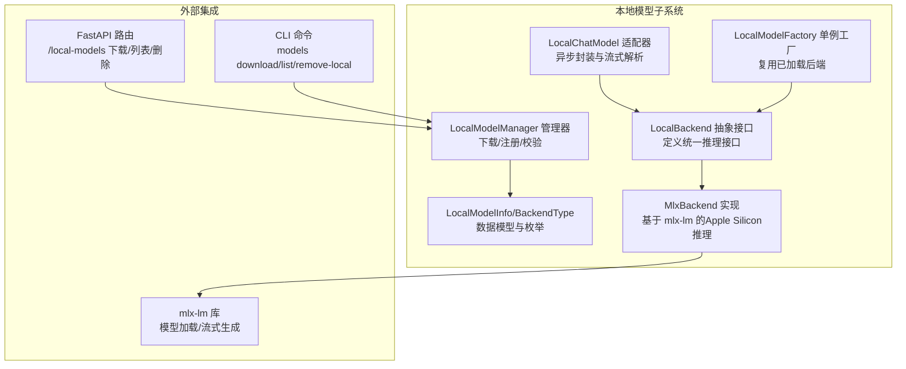
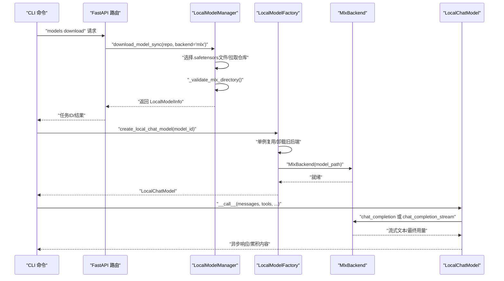
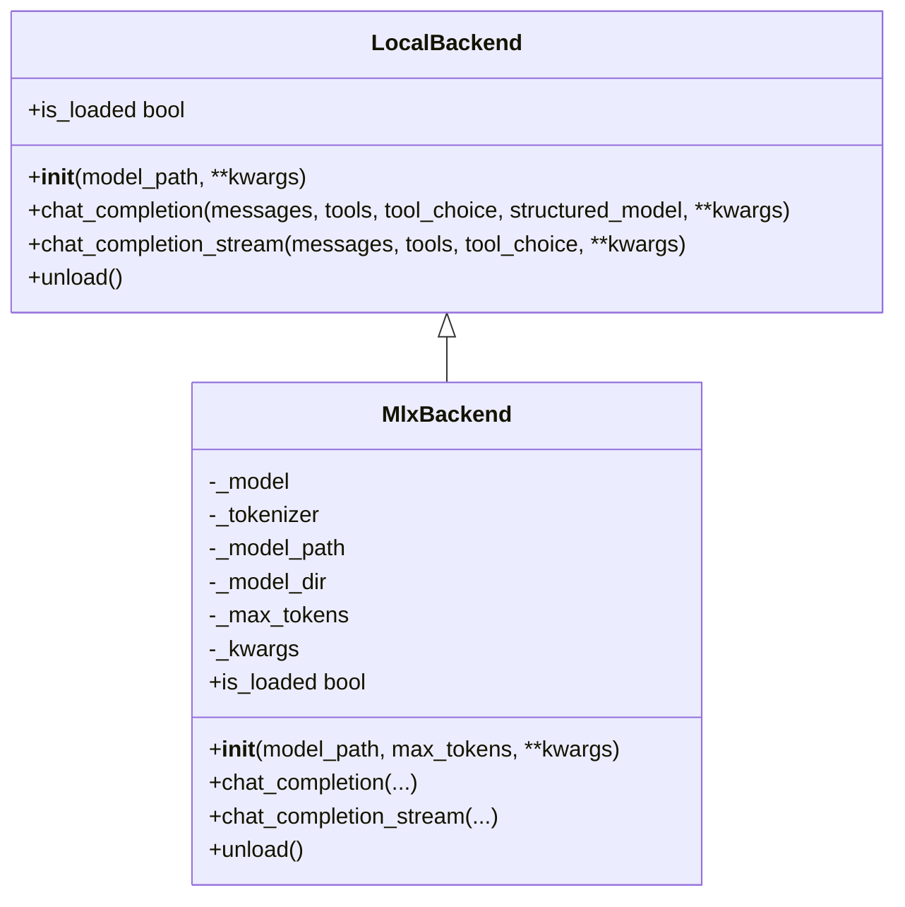
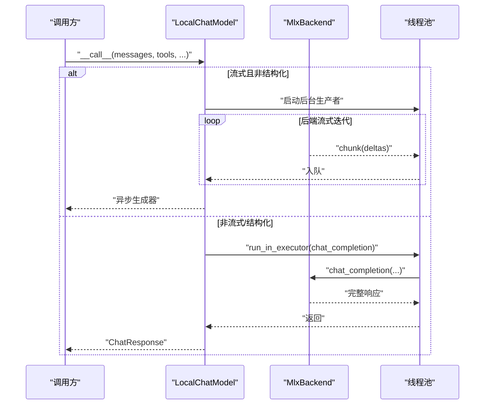
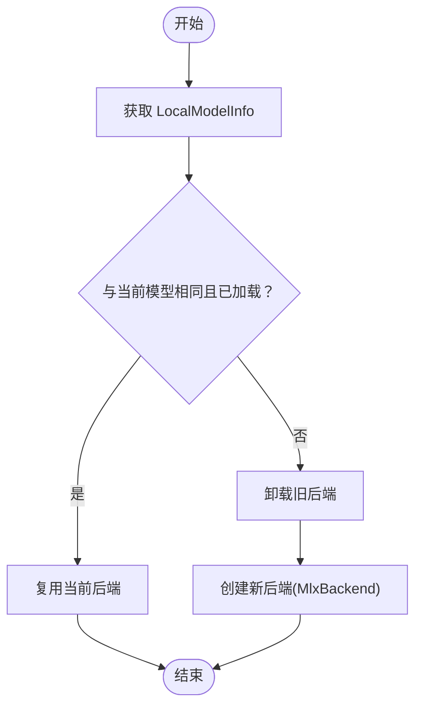
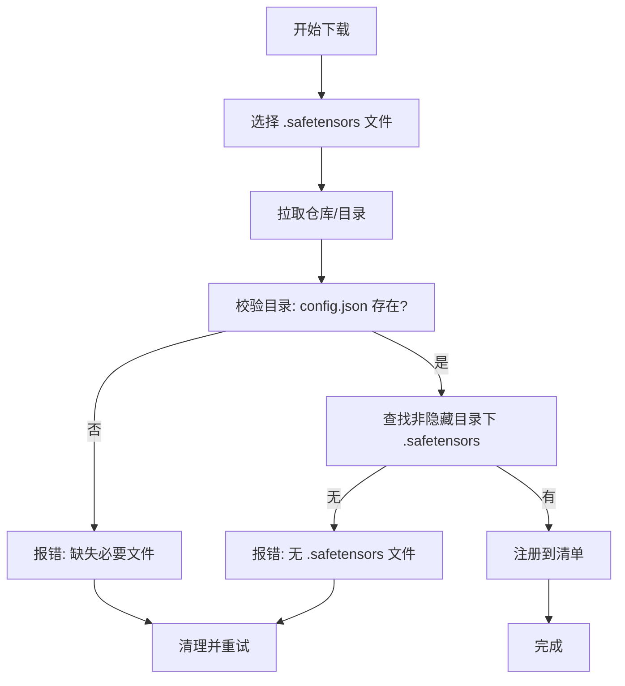
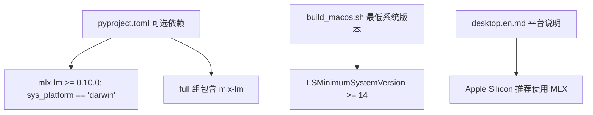

# MLX后端

<cite>
**本文引用的文件**
- [mlx_backend.py](file://src/copaw/local_models/backends/mlx_backend.py)
- [base.py](file://src/copaw/local_models/backends/base.py)
- [chat_model.py](file://src/copaw/local_models/chat_model.py)
- [factory.py](file://src/copaw/local_models/factory.py)
- [schema.py](file://src/copaw/local_models/schema.py)
- [manager.py](file://src/copaw/local_models/manager.py)
- [local_models.py](file://src/copaw/app/routers/local_models.py)
- [providers_cmd.py](file://src/copaw/cli/providers_cmd.py)
- [pyproject.toml](file://pyproject.toml)
- [build_macos.sh](file://scripts/pack/build_macos.sh)
- [desktop.en.md](file://website/public/docs/desktop.en.md)
</cite>

## 目录
1. [简介](#简介)
2. [项目结构](#项目结构)
3. [核心组件](#核心组件)
4. [架构总览](#架构总览)
5. [详细组件分析](#详细组件分析)
6. [依赖分析](#依赖分析)
7. [性能考虑](#性能考虑)
8. [故障排查指南](#故障排查指南)
9. [结论](#结论)
10. [附录](#附录)

## 简介
本文件面向CoPaw的MLX后端实现，系统性阐述其设计与实现原理，重点覆盖以下方面：
- Apple Silicon优化的推理引擎：基于mlx-lm的目录型模型加载、聊天模板应用与流式生成。
- 模型格式与结构：safetensors格式、目录结构要求与下载校验流程。
- 初始化与加载策略：单例工厂模式、后台任务下载、注册与验证。
- 性能优化：采样器参数映射、流式输出、线程池执行与异步封装。
- 使用示例：如何在Apple设备上启用MLX后端进行高效推理，含GPU加速、内存优化与批量处理建议。
- 配置与平台：Apple设备要求、安装依赖与打包配置。

## 项目结构
围绕本地模型与后端抽象，MLX后端位于本地模型子系统中，采用“后端抽象 + 具体实现 + 工厂 + 聊天模型适配”的分层组织方式，并通过FastAPI路由与CLI命令对外暴露下载与管理能力。

图表来源
- [base.py:12-64](file://src/copaw/local_models/backends/base.py#L12-L64)
- [mlx_backend.py:57-82](file://src/copaw/local_models/backends/mlx_backend.py#L57-L82)
- [chat_model.py:39-95](file://src/copaw/local_models/chat_model.py#L39-L95)
- [factory.py:110-125](file://src/copaw/local_models/factory.py#L110-L125)
- [schema.py:22-42](file://src/copaw/local_models/schema.py#L22-L42)
- [local_models.py:128-168](file://src/copaw/app/routers/local_models.py#L128-L168)
- [providers_cmd.py:659-719](file://src/copaw/cli/providers_cmd.py#L659-L719)

章节来源
- [base.py:12-64](file://src/copaw/local_models/backends/base.py#L12-L64)
- [mlx_backend.py:57-82](file://src/copaw/local_models/backends/mlx_backend.py#L57-L82)
- [chat_model.py:39-95](file://src/copaw/local_models/chat_model.py#L39-L95)
- [factory.py:110-125](file://src/copaw/local_models/factory.py#L110-L125)
- [schema.py:22-42](file://src/copaw/local_models/schema.py#L22-L42)
- [local_models.py:128-168](file://src/copaw/app/routers/local_models.py#L128-L168)
- [providers_cmd.py:659-719](file://src/copaw/cli/providers_cmd.py#L659-L719)

## 核心组件
- LocalBackend 抽象接口：定义后端统一的构造、非流式与流式推理、卸载与状态查询方法。
- MlxBackend：基于mlx-lm加载Apple Silicon模型，应用聊天模板，构建采样器并进行流式生成；支持结构化输出提示注入。
- LocalChatModel：将LocalBackend适配为异步ChatModel，负责线程池执行、流式块解析、思维/工具调用提取与用量统计。
- LocalModelFactory：单例工厂，按模型ID复用已加载后端；不同模型时先卸载再加载。
- LocalModelManager：下载与注册逻辑，MLX目录完整性校验（config.json与至少一个safetensors文件）。
- FastAPI路由与CLI命令：提供模型下载、状态查询、删除等管理能力。

章节来源
- [base.py:12-64](file://src/copaw/local_models/backends/base.py#L12-L64)
- [mlx_backend.py:57-236](file://src/copaw/local_models/backends/mlx_backend.py#L57-L236)
- [chat_model.py:39-362](file://src/copaw/local_models/chat_model.py#L39-L362)
- [factory.py:22-107](file://src/copaw/local_models/factory.py#L22-L107)
- [manager.py:331-413](file://src/copaw/local_models/manager.py#L331-L413)
- [local_models.py:128-256](file://src/copaw/app/routers/local_models.py#L128-L256)
- [providers_cmd.py:659-719](file://src/copaw/cli/providers_cmd.py#L659-L719)

## 架构总览
MLX后端在CoPaw中的位置与交互如下：

图表来源
- [local_models.py:128-256](file://src/copaw/app/routers/local_models.py#L128-L256)
- [providers_cmd.py:659-719](file://src/copaw/cli/providers_cmd.py#L659-L719)
- [manager.py:331-413](file://src/copaw/local_models/manager.py#L331-L413)
- [factory.py:77-107](file://src/copaw/local_models/factory.py#L77-L107)
- [mlx_backend.py:105-224](file://src/copaw/local_models/backends/mlx_backend.py#L105-L224)
- [chat_model.py:58-158](file://src/copaw/local_models/chat_model.py#L58-L158)

## 详细组件分析

### MlxBackend 设计与实现
- 初始化与模型加载
  - 通过导入检测确保mlx-lm可用，否则抛出明确异常提示安装方式。
  - 将传入路径标准化为模型目录（目录或文件均可），调用mlx-lm加载模型与分词器。
  - 记录最大生成长度与默认参数，便于后续生成调用合并。
- 提示构建与消息归一化
  - 归一化消息：将多段内容拼接为纯文本，移除空的tool_calls字段，保证聊天模板输入规范。
  - 应用聊天模板：根据是否具备工具调用能力决定是否注入工具描述。
- 采样器与生成参数
  - 支持温度、top_p、min_p、top_k等参数；将“temperature”映射为“temp”以适配mlx-lm。
  - 若存在采样参数，动态构建采样器并传入流式生成函数。
- 结构化输出
  - 对于结构化模式，向提示追加JSON Schema指令，借助模型遵循约束生成JSON。
- 流式与非流式推理
  - 非流式：累积所有文本片段，返回完整回答与用量。
  - 流式：逐块产出delta，最终块附带用量统计。
- 资源释放
  - 显式删除模型与分词器对象，记录卸载日志。

图表来源
- [base.py:12-64](file://src/copaw/local_models/backends/base.py#L12-L64)
- [mlx_backend.py:57-82](file://src/copaw/local_models/backends/mlx_backend.py#L57-L82)
- [mlx_backend.py:105-224](file://src/copaw/local_models/backends/mlx_backend.py#L105-L224)

章节来源
- [mlx_backend.py:57-236](file://src/copaw/local_models/backends/mlx_backend.py#L57-L236)

### LocalChatModel 异步适配与流式解析
- 线程池执行
  - 非流式与结构化输出在线程池中执行后端同步接口，避免阻塞事件循环。
- 流式封装
  - 将后端同步流式迭代器包装为异步生成器，通过队列在后台线程驱动。
- 内容解析
  - 支持思维内容（reasoning_content）与<think>标签回退解析。
  - 支持工具调用（tool_calls）与<tool_call>标签回退解析，累积并组装为消息块。
- 用量统计
  - 从最终块或非流式响应中提取prompt_tokens与completion_tokens，计算耗时。

图表来源
- [chat_model.py:58-158](file://src/copaw/local_models/chat_model.py#L58-L158)
- [chat_model.py:259-362](file://src/copaw/local_models/chat_model.py#L259-L362)

章节来源
- [chat_model.py:39-362](file://src/copaw/local_models/chat_model.py#L39-L362)

### 工厂与单例加载策略
- 单例工厂
  - 通过全局锁保护当前活跃后端与模型ID，若请求相同模型且已加载则直接复用。
  - 若不同模型，则先卸载旧后端再加载新后端，确保资源可控。
- 后端选择
  - 根据LocalModelInfo.backend类型选择对应后端实现（LLAMACPP或MLX）。

图表来源
- [factory.py:22-107](file://src/copaw/local_models/factory.py#L22-L107)

章节来源
- [factory.py:22-107](file://src/copaw/local_models/factory.py#L22-L107)

### 模型管理与MLX目录校验
- 下载与注册
  - MLX模型为目录型（包含safetensors与配置文件），注册时计算目录内总大小并写入清单。
- 目录完整性校验
  - 必须包含config.json；至少存在一个非隐藏目录下的safetensors文件，否则判定下载不完整并提示清理重试。
- 文件名自动选择
  - 当仓库同时包含多个.safetensors文件时，自动选择第一个用于拉取整库，随后注册为模型。

图表来源
- [manager.py:314-327](file://src/copaw/local_models/manager.py#L314-L327)
- [manager.py:331-413](file://src/copaw/local_models/manager.py#L331-L413)

章节来源
- [manager.py:314-413](file://src/copaw/local_models/manager.py#L314-L413)

### API与CLI集成
- FastAPI路由
  - 提供下载任务创建、状态查询、取消与删除本地模型等接口；后台执行下载并在完成后更新状态。
- CLI命令
  - 支持指定backend=mlx下载模型，列出/删除本地模型；自动打印模型保存路径与大小等信息。

章节来源
- [local_models.py:128-256](file://src/copaw/app/routers/local_models.py#L128-L256)
- [providers_cmd.py:659-719](file://src/copaw/cli/providers_cmd.py#L659-L719)

## 依赖分析
- 可选依赖与平台限定
  - MLX可选依赖仅在macOS平台生效，确保Apple Silicon设备可用。
  - full与mlx组均声明了对mlx-lm的版本要求。
- 安装与打包
  - macOS打包脚本设置最低系统版本为14（Sonoma），与Apple Silicon生态一致。
  - 文档明确Apple Silicon推荐使用MLX本地加速，Intel芯片不支持MLX功能。

图表来源
- [pyproject.toml:78-91](file://pyproject.toml#L78-L91)
- [build_macos.sh:171](file://scripts/pack/build_macos.sh#L171)
- [desktop.en.md:96](file://website/public/docs/desktop.en.md#L96)

章节来源
- [pyproject.toml:78-91](file://pyproject.toml#L78-L91)
- [build_macos.sh:171](file://scripts/pack/build_macos.sh#L171)
- [desktop.en.md:96](file://website/public/docs/desktop.en.md#L96)

## 性能考虑
- Apple Silicon优化
  - 通过mlx-lm直接利用Apple Silicon的硬件加速能力，无需额外显存驱动配置。
- 采样参数映射
  - 将“temperature”映射为“temp”，减少参数歧义，提升采样一致性。
- 流式生成
  - 使用流式生成接口，降低首token延迟，改善交互体验。
- 线程池与异步
  - 在LocalChatModel中将同步后端调用放入线程池，避免阻塞事件循环；流式通过队列解耦生产与消费。
- 批量处理建议
  - 由于MLX后端为同步实现，建议在应用侧控制并发度，结合线程池大小与模型显存占用评估吞吐。
  - 对于长上下文场景，合理设置max_tokens与温度参数，平衡质量与速度。

## 故障排查指南
- 未安装mlx-lm
  - 现象：初始化MlxBackend时报ImportError。
  - 处理：按照提示安装可选依赖，确保在macOS平台。
  - 参考：[mlx_backend.py:66-72](file://src/copaw/local_models/backends/mlx_backend.py#L66-L72)
- 模型目录不完整
  - 现象：下载完成后无法加载MLX模型，提示缺失config.json或无safetensors文件。
  - 处理：删除目录后重新下载，确保网络稳定，避免中断。
  - 参考：[manager.py:337-361](file://src/copaw/local_models/manager.py#L337-L361)
- 重复加载导致资源占用
  - 现象：频繁切换模型导致显存/内存增长。
  - 处理：使用工厂的单例复用机制，避免同时加载多个模型；必要时调用卸载接口。
  - 参考：[factory.py:77-107](file://src/copaw/local_models/factory.py#L77-L107)
- 流式解析异常
  - 现象：工具调用或<think>标签解析不正确。
  - 处理：检查后端返回的结构化字段与文本格式；必要时关闭结构化模式回退至文本解析。
  - 参考：[chat_model.py:175-258](file://src/copaw/local_models/chat_model.py#L175-L258)

章节来源
- [mlx_backend.py:66-72](file://src/copaw/local_models/backends/mlx_backend.py#L66-L72)
- [manager.py:337-361](file://src/copaw/local_models/manager.py#L337-L361)
- [factory.py:77-107](file://src/copaw/local_models/factory.py#L77-L107)
- [chat_model.py:175-258](file://src/copaw/local_models/chat_model.py#L175-L258)

## 结论
CoPaw的MLX后端通过清晰的抽象与实现分离，将mlx-lm的Apple Silicon加速能力无缝集成到本地模型推理链路中。配合单例工厂、后台下载与目录校验机制，实现了易用、可靠且高性能的本地推理体验。对于Apple设备用户，建议优先选择MLX后端以获得最佳性能与资源利用率。

## 附录
- 使用步骤（概览）
  - 通过CLI或API选择backend=mlx下载模型，确保系统满足Apple Silicon与macOS 14+要求。
  - 使用工厂创建LocalChatModel实例，即可在应用中进行异步推理。
  - 如需结构化输出，可在调用时传入结构化模型类，后端会自动注入JSON Schema提示。
- Apple设备配置要点
  - 平台：Apple Silicon（M1/M2/M3/M4）。
  - 系统：macOS 14（Sonoma）及以上。
  - 依赖：安装可选依赖以启用MLX后端。
- 性能基准与优化建议
  - 基准：建议在实际设备上针对目标模型与上下文长度进行基准测试。
  - 优化：合理设置采样参数、控制并发度、使用流式生成降低延迟、避免重复加载模型。