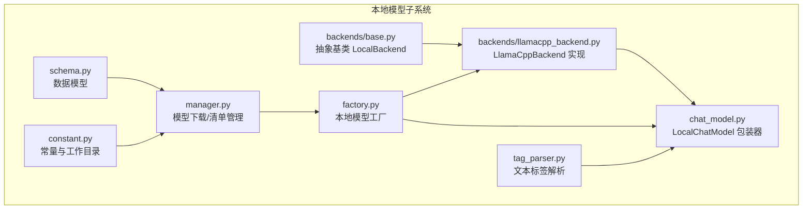
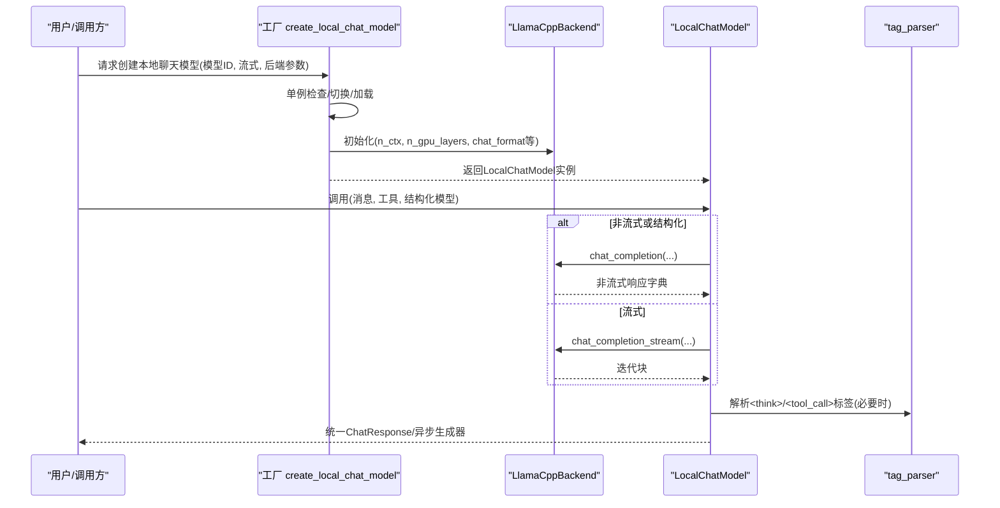
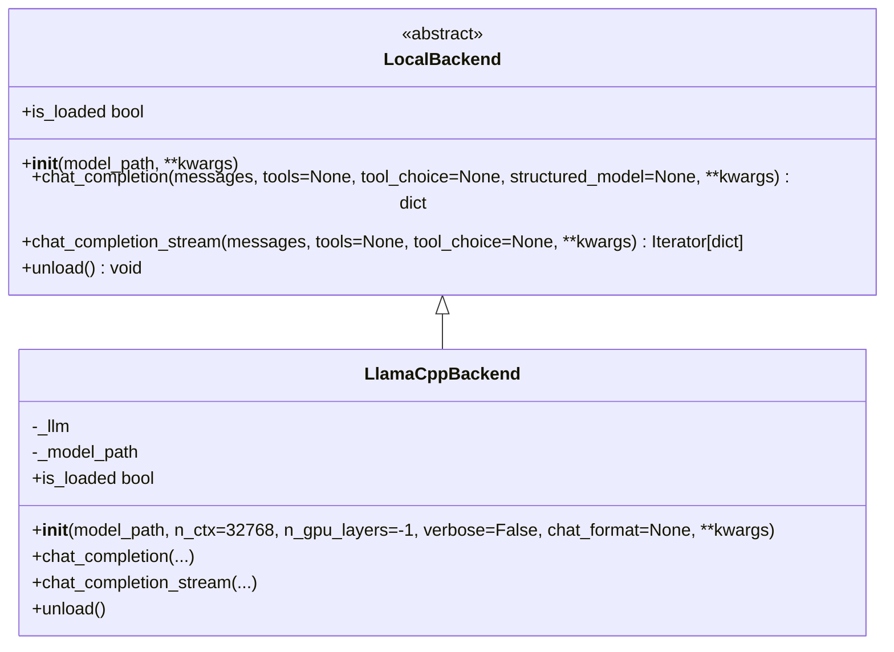
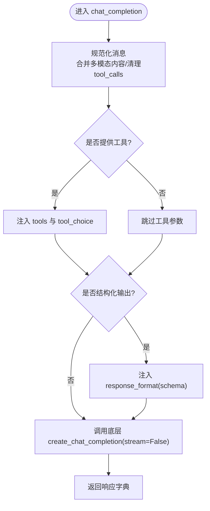
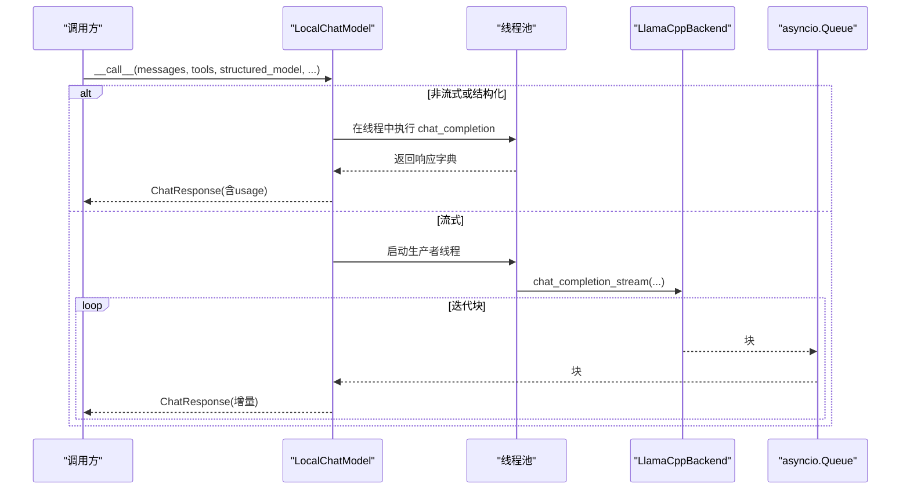
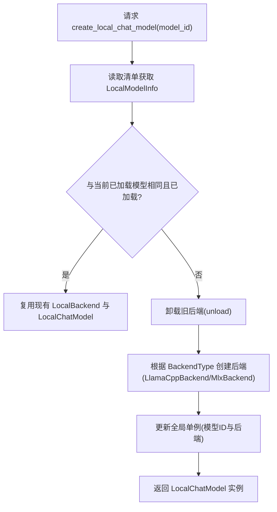
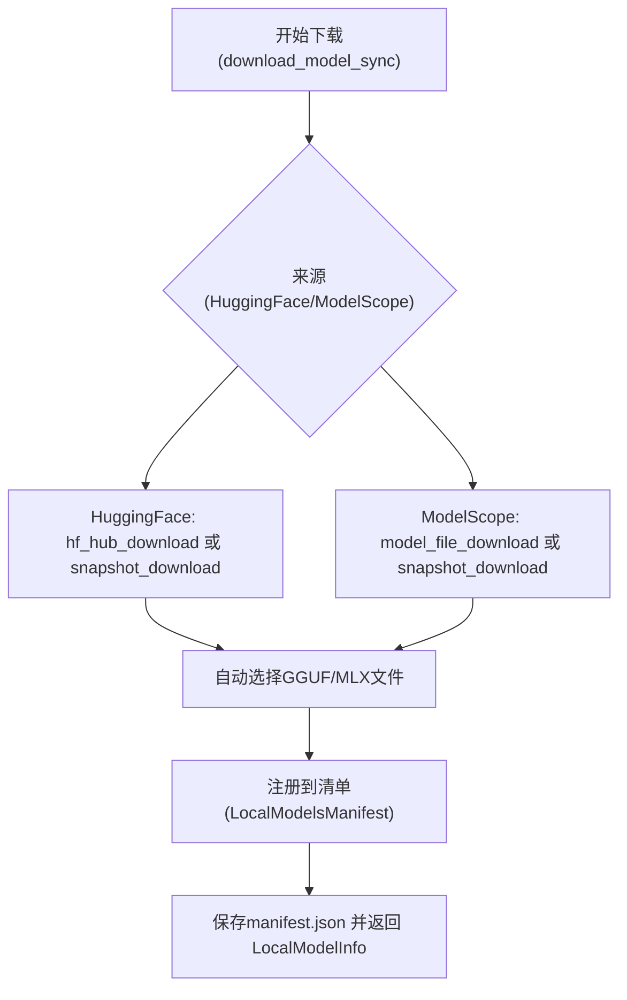
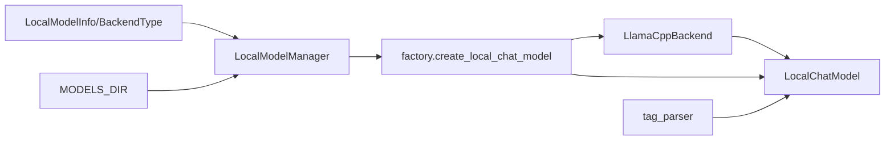

# llama.cpp后端

<cite>
**本文引用的文件**
- [llamacpp_backend.py](file://src/copaw/local_models/backends/llamacpp_backend.py)
- [base.py](file://src/copaw/local_models/backends/base.py)
- [chat_model.py](file://src/copaw/local_models/chat_model.py)
- [factory.py](file://src/copaw/local_models/factory.py)
- [manager.py](file://src/copaw/local_models/manager.py)
- [schema.py](file://src/copaw/local_models/schema.py)
- [tag_parser.py](file://src/copaw/local_models/tag_parser.py)
- [constant.py](file://src/copaw/constant.py)
- [README.md](file://README.md)
</cite>

## 目录
1. [简介](#简介)
2. [项目结构](#项目结构)
3. [核心组件](#核心组件)
4. [架构总览](#架构总览)
5. [详细组件分析](#详细组件分析)
6. [依赖关系分析](#依赖关系分析)
7. [性能考虑](#性能考虑)
8. [故障排除指南](#故障排除指南)
9. [结论](#结论)
10. [附录](#附录)

## 简介
本文件面向CoPaw的llama.cpp后端实现，系统性阐述其设计与实现原理，包括后端抽象基类的继承关系与具体实现、模型加载机制、推理流程与资源管理策略、支持的模型格式与量化级别、初始化与配置参数、内存管理、以及如何通过本地模型接口进行会话管理、上下文处理与响应生成。同时提供性能调优建议、硬件要求与常见问题排查方法。

## 项目结构
CoPaw的本地模型子系统围绕“后端抽象 + 具体后端实现 + 本地模型工厂 + 模型下载与清单管理 + 响应解析与流式封装”组织，llama.cpp后端位于本地模型子系统的后端层，负责与llama-cpp-python库交互，提供统一的聊天补全接口，并由上层模型包装器适配到通用的聊天模型接口。

**图表来源**
- [base.py:12-64](file://src/copaw/local_models/backends/base.py#L12-L64)
- [llamacpp_backend.py:45-140](file://src/copaw/local_models/backends/llamacpp_backend.py#L45-L140)
- [chat_model.py:39-362](file://src/copaw/local_models/chat_model.py#L39-L362)
- [factory.py:110-125](file://src/copaw/local_models/factory.py#L110-L125)
- [manager.py:94-413](file://src/copaw/local_models/manager.py#L94-L413)
- [schema.py:22-59](file://src/copaw/local_models/schema.py#L22-L59)
- [tag_parser.py:1-230](file://src/copaw/local_models/tag_parser.py#L1-L230)
- [constant.py:145-146](file://src/copaw/constant.py#L145-L146)

**章节来源**
- [base.py:12-64](file://src/copaw/local_models/backends/base.py#L12-L64)
- [llamacpp_backend.py:45-140](file://src/copaw/local_models/backends/llamacpp_backend.py#L45-L140)
- [chat_model.py:39-362](file://src/copaw/local_models/chat_model.py#L39-L362)
- [factory.py:42-125](file://src/copaw/local_models/factory.py#L42-L125)
- [manager.py:94-413](file://src/copaw/local_models/manager.py#L94-L413)
- [schema.py:22-59](file://src/copaw/local_models/schema.py#L22-L59)
- [tag_parser.py:1-230](file://src/copaw/local_models/tag_parser.py#L1-L230)
- [constant.py:145-146](file://src/copaw/constant.py#L145-L146)

## 核心组件
- 抽象基类 LocalBackend：定义统一的本地推理后端接口，包括模型加载、非流式与流式聊天补全、卸载与状态查询。
- LlamaCppBackend：基于llama-cpp-python的具体实现，负责将消息规范化、调用底层LLM对象执行推理，并提供非流式与流式两种输出。
- LocalChatModel：对LocalBackend的同步接口进行封装，提供异步调用能力；在流式模式下通过线程池驱动同步迭代器，并将块转换为统一的聊天响应对象；在非流式或结构化输出时在线程中执行。
- 工厂与单例：create_local_chat_model提供按模型ID的单例加载与复用逻辑；unload_active_model用于释放当前已加载的后端。
- 下载与清单：LocalModelManager负责从HuggingFace或ModelScope下载GGUF模型文件，自动选择合适量化文件并注册到清单；清单持久化为JSON。
- 数据模型：BackendType、LocalModelInfo、DownloadProgress、LocalModelsManifest等，支撑后端类型、模型元信息、下载进度与清单存储。
- 文本标签解析：tag_parser模块解析<think>与<tool_call>工具调用标签，兼容后端未直接返回结构化字段的情况。
- 常量：MODELS_DIR等路径常量，决定模型文件存放位置。

**章节来源**
- [base.py:12-64](file://src/copaw/local_models/backends/base.py#L12-L64)
- [llamacpp_backend.py:45-140](file://src/copaw/local_models/backends/llamacpp_backend.py#L45-L140)
- [chat_model.py:39-362](file://src/copaw/local_models/chat_model.py#L39-L362)
- [factory.py:42-125](file://src/copaw/local_models/factory.py#L42-L125)
- [manager.py:94-413](file://src/copaw/local_models/manager.py#L94-L413)
- [schema.py:22-59](file://src/copaw/local_models/schema.py#L22-L59)
- [tag_parser.py:1-230](file://src/copaw/local_models/tag_parser.py#L1-L230)
- [constant.py:145-146](file://src/copaw/constant.py#L145-L146)

## 架构总览
下图展示了CoPaw本地模型子系统的高层架构与关键交互：

**图表来源**
- [factory.py:42-125](file://src/copaw/local_models/factory.py#L42-L125)
- [llamacpp_backend.py:86-130](file://src/copaw/local_models/backends/llamacpp_backend.py#L86-L130)
- [chat_model.py:58-258](file://src/copaw/local_models/chat_model.py#L58-L258)
- [tag_parser.py:134-230](file://src/copaw/local_models/tag_parser.py#L134-L230)

## 详细组件分析

### 抽象基类与继承关系
- LocalBackend定义了统一接口：构造函数接收模型路径与后端特定参数；chat_completion与chat_completion_stream分别提供非流式与流式的OpenAI兼容响应；unload释放资源；is_loaded查询加载状态。
- LlamaCppBackend继承LocalBackend，内部持有llama-cpp-python的Llama实例，完成消息规范化、工具调用与结构化输出的桥接。

**图表来源**
- [base.py:12-64](file://src/copaw/local_models/backends/base.py#L12-L64)
- [llamacpp_backend.py:45-140](file://src/copaw/local_models/backends/llamacpp_backend.py#L45-L140)

**章节来源**
- [base.py:12-64](file://src/copaw/local_models/backends/base.py#L12-L64)
- [llamacpp_backend.py:45-140](file://src/copaw/local_models/backends/llamacpp_backend.py#L45-L140)

### llama.cpp后端实现细节
- 消息规范化：将多模态内容合并为纯文本，确保tool_calls为列表或移除该项，避免模板渲染错误。
- 初始化参数：支持n_ctx、n_gpu_layers、verbose、chat_format等；若未提供则使用默认值。
- 推理接口：
  - 非流式：将消息与工具参数传入底层create_chat_completion，返回OpenAI兼容字典。
  - 流式：以流式模式迭代返回块，逐块向上抛出。
- 资源管理：unload删除底层Llama实例，置空引用，记录日志。

**图表来源**
- [llamacpp_backend.py:86-111](file://src/copaw/local_models/backends/llamacpp_backend.py#L86-L111)

**章节来源**
- [llamacpp_backend.py:16-42](file://src/copaw/local_models/backends/llamacpp_backend.py#L16-L42)
- [llamacpp_backend.py:48-84](file://src/copaw/local_models/backends/llamacpp_backend.py#L48-L84)
- [llamacpp_backend.py:86-130](file://src/copaw/local_models/backends/llamacpp_backend.py#L86-L130)

### LocalChatModel：异步包装与流式驱动
- 异步调用：在非流式或结构化输出场景，使用线程池在后台执行同步推理，避免阻塞事件循环。
- 流式封装：通过线程池驱动后端的同步迭代器，将块投递到asyncio.Queue，再由异步生成器逐个产出统一的ChatResponse。
- 内容解析：优先使用后端提供的结构化字段（如reasoning_content、tool_calls）；若缺失，则回退到解析<think>与<tool_call>标签，构建ThinkingBlock、TextBlock与ToolUseBlock。
- 使用统计：从响应中提取prompt_tokens与completion_tokens，计算耗时并封装为ChatUsage。

**图表来源**
- [chat_model.py:58-130](file://src/copaw/local_models/chat_model.py#L58-L130)
- [chat_model.py:132-258](file://src/copaw/local_models/chat_model.py#L132-L258)
- [chat_model.py:259-362](file://src/copaw/local_models/chat_model.py#L259-L362)

**章节来源**
- [chat_model.py:39-95](file://src/copaw/local_models/chat_model.py#L39-L95)
- [chat_model.py:96-258](file://src/copaw/local_models/chat_model.py#L96-L258)
- [chat_model.py:259-362](file://src/copaw/local_models/chat_model.py#L259-L362)
- [tag_parser.py:134-230](file://src/copaw/local_models/tag_parser.py#L134-L230)

### 工厂与单例：模型生命周期管理
- 单例模式：全局持有当前已加载的后端与模型ID；若请求的模型ID与当前一致且仍加载，则直接复用。
- 切换逻辑：若不同模型，先卸载旧后端，再加载新后端；通过_lock保证线程安全。
- 参数透传：后端构造参数与生成参数分别传入后端与包装器。

**图表来源**
- [factory.py:42-107](file://src/copaw/local_models/factory.py#L42-L107)
- [manager.py:63-67](file://src/copaw/local_models/manager.py#L63-L67)
- [schema.py:12-15](file://src/copaw/local_models/schema.py#L12-L15)

**章节来源**
- [factory.py:22-107](file://src/copaw/local_models/factory.py#L22-L107)
- [manager.py:63-67](file://src/copaw/local_models/manager.py#L63-L67)
- [schema.py:12-15](file://src/copaw/local_models/schema.py#L12-L15)

### 模型下载与清单管理
- 支持来源：HuggingFace与ModelScope；自动选择GGUF文件（llama.cpp）或safetensors（MLX）。
- 自动量化选择：llama.cpp默认优先选择Q4_K_M量化文件。
- 清单注册：将模型元信息写入manifest.json，包含唯一ID、仓库ID、文件名、后端类型、来源、大小、本地绝对路径与显示名称。
- 完整性校验：MLX模型目录需包含config.json与至少一个safetensors文件。

**图表来源**
- [manager.py:98-123](file://src/copaw/local_models/manager.py#L98-L123)
- [manager.py:125-292](file://src/copaw/local_models/manager.py#L125-L292)
- [manager.py:294-330](file://src/copaw/local_models/manager.py#L294-L330)
- [manager.py:364-413](file://src/copaw/local_models/manager.py#L364-L413)

**章节来源**
- [manager.py:94-413](file://src/copaw/local_models/manager.py#L94-L413)
- [schema.py:22-59](file://src/copaw/local_models/schema.py#L22-L59)
- [constant.py:145-146](file://src/copaw/constant.py#L145-L146)

### 数据模型与标签解析
- 数据模型：BackendType枚举区分llamacpp与mlx；LocalModelInfo描述模型元信息；DownloadProgress与LocalModelsManifest支撑下载与清单。
- 标签解析：支持<think>与<tool_call>标签；当后端未提供结构化reasoning_content或tool_calls时，解析文本中的标签，生成ThinkingBlock与ToolUseBlock，提升兼容性。

**章节来源**
- [schema.py:12-59](file://src/copaw/local_models/schema.py#L12-L59)
- [tag_parser.py:1-230](file://src/copaw/local_models/tag_parser.py#L1-L230)

## 依赖关系分析
- 外部依赖：llama-cpp-python（推理）、huggingface_hub/modelscope（下载）、pydantic（数据模型）、agentscope（聊天模型基类与响应对象）。
- 内部耦合：LocalChatModel依赖LocalBackend接口；工厂依赖LocalModelInfo与BackendType；下载管理依赖清单与常量；标签解析独立于后端实现。
- 资源耦合：单例工厂持有后端实例，unload负责释放底层LLM对象；下载管理负责磁盘文件与清单一致性。

**图表来源**
- [llamacpp_backend.py:45-140](file://src/copaw/local_models/backends/llamacpp_backend.py#L45-L140)
- [chat_model.py:39-362](file://src/copaw/local_models/chat_model.py#L39-L362)
- [factory.py:42-125](file://src/copaw/local_models/factory.py#L42-L125)
- [manager.py:94-413](file://src/copaw/local_models/manager.py#L94-L413)
- [schema.py:22-59](file://src/copaw/local_models/schema.py#L22-L59)
- [constant.py:145-146](file://src/copaw/constant.py#L145-L146)

**章节来源**
- [llamacpp_backend.py:45-140](file://src/copaw/local_models/backends/llamacpp_backend.py#L45-L140)
- [chat_model.py:39-362](file://src/copaw/local_models/chat_model.py#L39-L362)
- [factory.py:42-125](file://src/copaw/local_models/factory.py#L42-L125)
- [manager.py:94-413](file://src/copaw/local_models/manager.py#L94-L413)
- [schema.py:22-59](file://src/copaw/local_models/schema.py#L22-L59)
- [constant.py:145-146](file://src/copaw/constant.py#L145-L146)

## 性能考虑
- 上下文长度与显存：n_ctx控制上下文长度，n_gpu_layers控制GPU显存分层加载；合理设置可平衡吞吐与延迟。
- 流式输出：在需要低时延首包时启用流式，结合异步生成器减少等待时间。
- 单例复用：通过工厂单例避免重复加载，降低冷启动开销。
- 量化选择：下载阶段优先选择Q4_K_M量化文件，兼顾体积与精度；在资源受限设备上更推荐较低量化级别。
- 线程池与并发：非流式与结构化输出在后台线程执行，避免阻塞事件循环；注意并发调用数量与系统核数匹配。
- 磁盘与网络：模型文件尽量放置在SSD；下载时关注网络稳定性，避免中断导致的不完整模型。

[本节为通用指导，无需列出具体文件来源]

## 故障排除指南
- 缺少依赖：安装llama.cpp后端依赖；参考安装说明与README中的本地模型安装指引。
- 模型未找到：确认模型已在清单中注册；使用list_local_models检查；若不存在则先download_model_sync。
- 加载失败：检查n_ctx与n_gpu_layers设置是否超出设备限制；查看日志输出定位错误。
- 流式异常：确认后端支持流式；若上游抛出异常，包装器会将其透传至调用方。
- 下载失败：更换下载源（HF/ModelScope），或手动指定文件名；确保网络稳定。
- 清单损坏：manifest.json损坏时会自动重建，但可能丢失历史记录；检查文件权限与编码。

**章节来源**
- [llamacpp_backend.py:57-63](file://src/copaw/local_models/backends/llamacpp_backend.py#L57-L63)
- [factory.py:70-76](file://src/copaw/local_models/factory.py#L70-L76)
- [manager.py:30-38](file://src/copaw/local_models/manager.py#L30-L38)
- [README.md:338-355](file://README.md#L338-L355)

## 结论
CoPaw的llama.cpp后端通过清晰的抽象与实现分离，提供了跨平台、可扩展的本地推理能力。其单例工厂与异步包装器设计，既保证了易用性也兼顾了性能；配合完善的下载与清单管理、标签解析兼容层，使得在不同后端与模型格式下均能获得一致的使用体验。建议在实际部署中结合硬件条件合理配置上下文长度与量化级别，并利用流式输出与单例复用提升交互体验。

[本节为总结性内容，无需列出具体文件来源]

## 附录

### 支持的模型格式与量化级别
- 模型格式：GGUF（llama.cpp后端）；MLX后端为目录型（包含safetensors与配置文件）。
- 量化级别：下载阶段优先选择Q4_K_M；也可手动指定其他文件名。
- 下载来源：HuggingFace与ModelScope。

**章节来源**
- [manager.py:294-330](file://src/copaw/local_models/manager.py#L294-L330)
- [manager.py:125-292](file://src/copaw/local_models/manager.py#L125-L292)
- [schema.py:12-15](file://src/copaw/local_models/schema.py#L12-L15)

### 初始化与配置参数
- 后端初始化参数：model_path、n_ctx、n_gpu_layers、verbose、chat_format等。
- 生成参数：temperature、top_p等（通过generate_kwargs传入）。
- 工作目录：MODELS_DIR决定模型文件存放位置。

**章节来源**
- [llamacpp_backend.py:48-84](file://src/copaw/local_models/backends/llamacpp_backend.py#L48-L84)
- [factory.py:42-60](file://src/copaw/local_models/factory.py#L42-L60)
- [constant.py:145-146](file://src/copaw/constant.py#L145-L146)

### 使用示例（步骤说明）
- 下载模型：使用LocalModelManager.download_model_sync或命令行工具下载GGUF文件。
- 创建模型：调用create_local_chat_model传入模型ID与后端参数。
- 执行推理：调用LocalChatModel的__call__方法，支持流式与非流式两种模式。
- 会话管理：通过工厂单例复用同一模型实例，避免重复加载。
- 上下文处理：消息列表与工具调用参数按OpenAI兼容格式传递。
- 响应生成：包装器将块或完整响应解析为统一的ChatResponse对象。

**章节来源**
- [manager.py:98-123](file://src/copaw/local_models/manager.py#L98-L123)
- [factory.py:42-107](file://src/copaw/local_models/factory.py#L42-L107)
- [chat_model.py:58-258](file://src/copaw/local_models/chat_model.py#L58-L258)
- [llamacpp_backend.py:86-130](file://src/copaw/local_models/backends/llamacpp_backend.py#L86-L130)