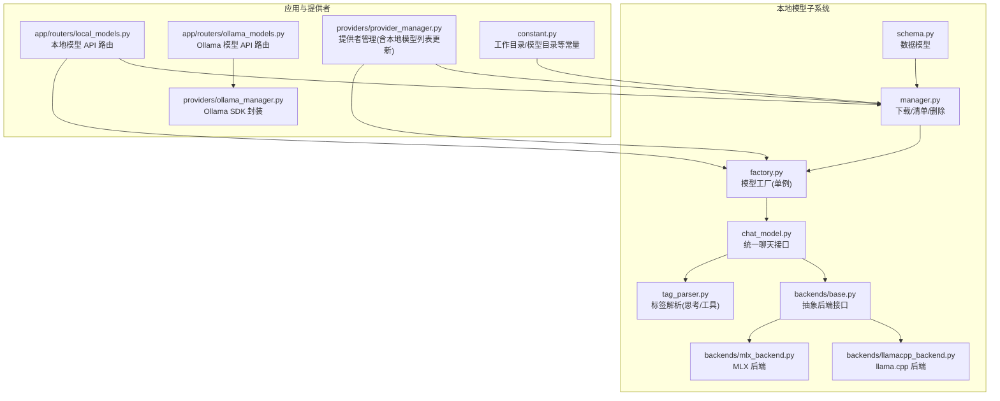
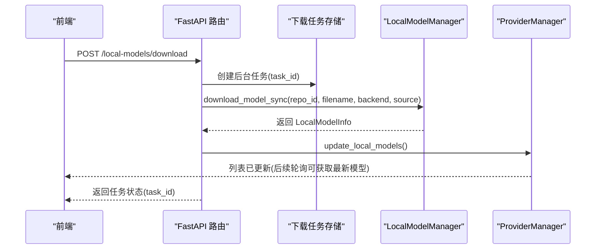
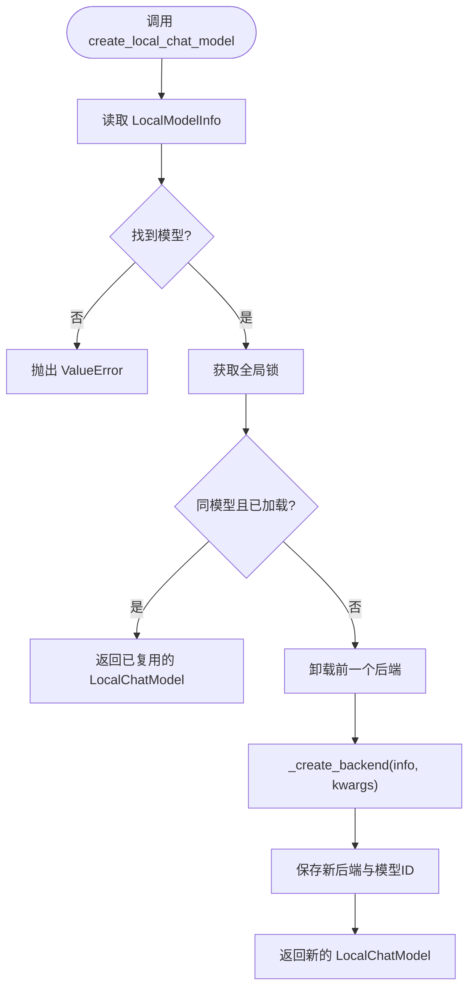
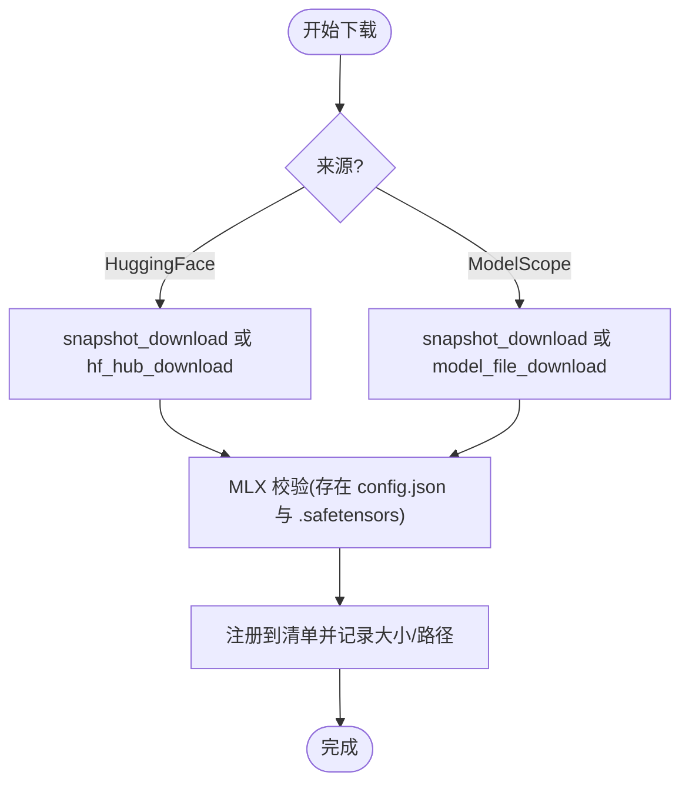
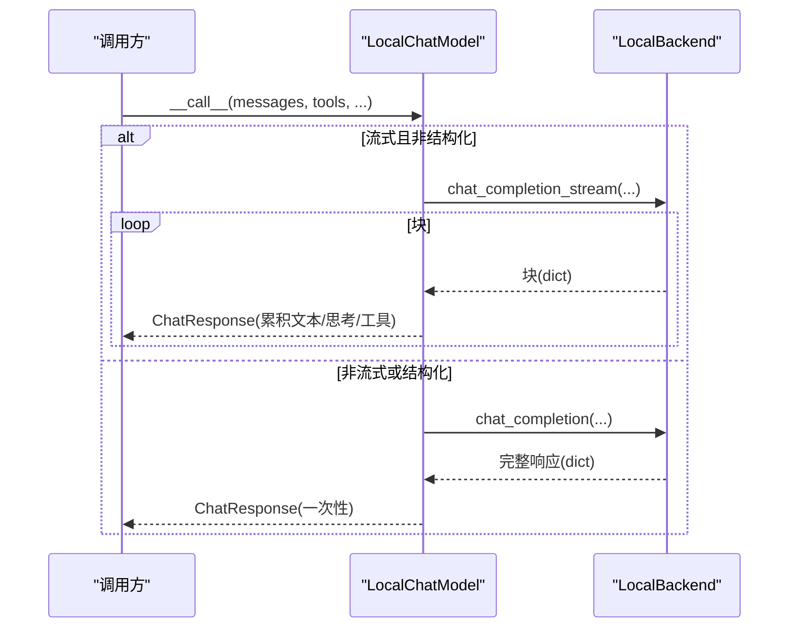
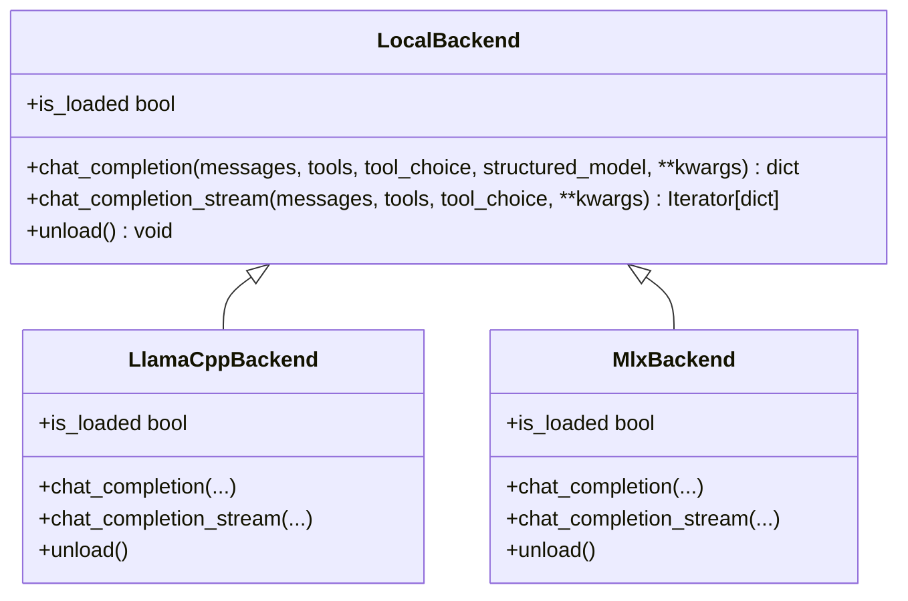
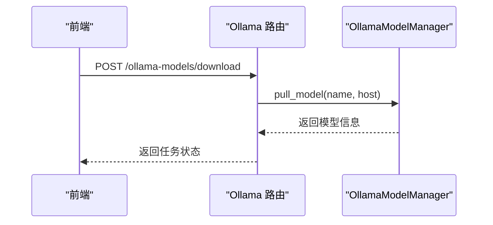
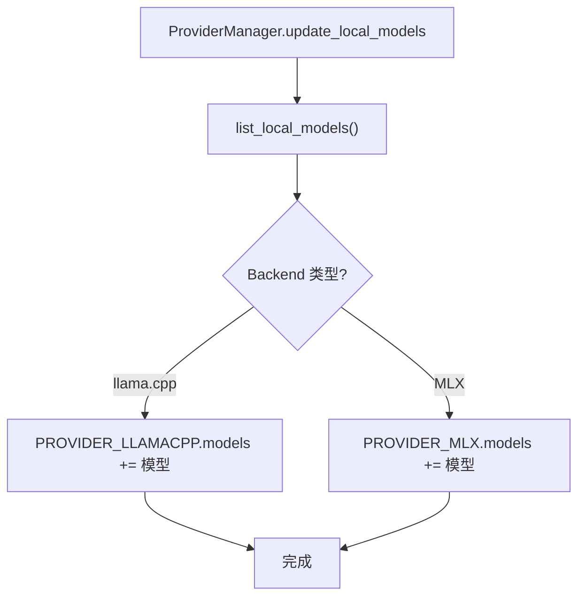
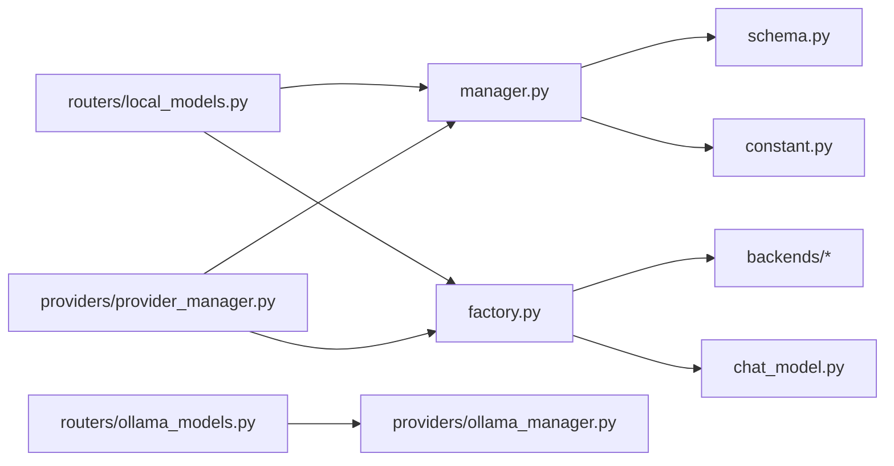

# 本地模型支持

<cite>
**本文引用的文件**
- [factory.py](file://src/copaw/local_models/factory.py)
- [manager.py](file://src/copaw/local_models/manager.py)
- [chat_model.py](file://src/copaw/local_models/chat_model.py)
- [schema.py](file://src/copaw/local_models/schema.py)
- [tag_parser.py](file://src/copaw/local_models/tag_parser.py)
- [base.py](file://src/copaw/local_models/backends/base.py)
- [llamacpp_backend.py](file://src/copaw/local_models/backends/llamacpp_backend.py)
- [mlx_backend.py](file://src/copaw/local_models/backends/mlx_backend.py)
- [local_models.py](file://src/copaw/app/routers/local_models.py)
- [ollama_models.py](file://src/copaw/app/routers/ollama_models.py)
- [constant.py](file://src/copaw/constant.py)
- [provider_manager.py](file://src/copaw/providers/provider_manager.py)
- [ollama_manager.py](file://src/copaw/providers/ollama_manager.py)
</cite>

## 目录
1. [简介](#简介)
2. [项目结构](#项目结构)
3. [核心组件](#核心组件)
4. [架构总览](#架构总览)
5. [详细组件分析](#详细组件分析)
6. [依赖关系分析](#依赖关系分析)
7. [性能考量](#性能考量)
8. [故障排除指南](#故障排除指南)
9. [结论](#结论)
10. [附录：配置与使用示例路径](#附录配置与使用示例路径)

## 简介
本文件系统化阐述 CoPaw 的本地模型支持能力，覆盖本地模型管理器的设计与实现、模型工厂的单例与资源调度机制、多后端推理引擎（llama.cpp 后端、MLX 后端）以及 Ollama 集成的技术特点与使用场景。文档同时给出模型加载流程、内存管理策略、性能优化建议、错误处理机制、配置参数、兼容性与硬件要求、部署指南及最佳实践。

## 项目结构
本地模型相关代码主要位于 src/copaw/local_models 及其子目录，配合应用层路由、常量与提供者管理模块协同工作，形成“清单与下载—工厂与后端—接口适配—提供者集成”的完整链路。

图示来源
- [schema.py:1-59](file://src/copaw/local_models/schema.py#L1-L59)
- [manager.py:1-413](file://src/copaw/local_models/manager.py#L1-L413)
- [factory.py:1-125](file://src/copaw/local_models/factory.py#L1-L125)
- [chat_model.py:1-362](file://src/copaw/local_models/chat_model.py#L1-L362)
- [base.py:1-64](file://src/copaw/local_models/backends/base.py#L1-L64)
- [llamacpp_backend.py:1-140](file://src/copaw/local_models/backends/llamacpp_backend.py#L1-L140)
- [mlx_backend.py:1-236](file://src/copaw/local_models/backends/mlx_backend.py#L1-L236)
- [tag_parser.py:1-230](file://src/copaw/local_models/tag_parser.py#L1-L230)
- [local_models.py:1-320](file://src/copaw/app/routers/local_models.py#L1-L320)
- [ollama_models.py:1-291](file://src/copaw/app/routers/ollama_models.py#L1-L291)
- [provider_manager.py:1-717](file://src/copaw/providers/provider_manager.py#L1-L717)
- [ollama_manager.py:1-140](file://src/copaw/providers/ollama_manager.py#L1-L140)
- [constant.py:1-201](file://src/copaw/constant.py#L1-L201)

章节来源
- [schema.py:1-59](file://src/copaw/local_models/schema.py#L1-L59)
- [manager.py:1-413](file://src/copaw/local_models/manager.py#L1-L413)
- [factory.py:1-125](file://src/copaw/local_models/factory.py#L1-L125)
- [chat_model.py:1-362](file://src/copaw/local_models/chat_model.py#L1-L362)
- [base.py:1-64](file://src/copaw/local_models/backends/base.py#L1-L64)
- [llamacpp_backend.py:1-140](file://src/copaw/local_models/backends/llamacpp_backend.py#L1-L140)
- [mlx_backend.py:1-236](file://src/copaw/local_models/backends/mlx_backend.py#L1-L236)
- [tag_parser.py:1-230](file://src/copaw/local_models/tag_parser.py#L1-L230)
- [local_models.py:1-320](file://src/copaw/app/routers/local_models.py#L1-L320)
- [ollama_models.py:1-291](file://src/copaw/app/routers/ollama_models.py#L1-L291)
- [constant.py:1-201](file://src/copaw/constant.py#L1-L201)
- [provider_manager.py:1-717](file://src/copaw/providers/provider_manager.py#L1-L717)
- [ollama_manager.py:1-140](file://src/copaw/providers/ollama_manager.py#L1-L140)

## 核心组件
- 数据模型与清单
  - BackendType/DownloadSource/LocalModelInfo/LocalModelsManifest：定义后端类型、下载来源、模型元信息与清单持久化结构。
- 下载与清单管理
  - LocalModelManager：封装从 Hugging Face 或 ModelScope 的同步下载、自动文件选择、清单注册、删除与校验；提供 list/get/delete 接口。
- 工厂与单例
  - create_local_chat_model：基于 model_id 获取 LocalModelInfo，按需加载/复用后端，返回 LocalChatModel；提供卸载与活跃实例查询。
- 统一聊天接口
  - LocalChatModel：适配 agentscope ChatModelBase，封装同步后端的非流式与流式推理，并解析思考标签<think>与工具调用标签<tool_call>…</tool_call>。
- 抽象后端与具体实现
  - LocalBackend：统一 chat_completion、chat_completion_stream、unload、is_loaded 接口。
  - LlamaCppBackend：基于 llama-cpp-python，支持 n_ctx、n_gpu_layers、chat_format 等参数。
  - MlxBackend：基于 mlx-lm，面向 Apple Silicon，支持消息规范化、模板构建与采样参数映射。
- 标签解析
  - 提取<think>与<tool_call>…</tool_call>，支持流式未闭合标签的处理与 JSON 参数解析。
- 应用路由与提供者集成
  - 本地模型路由：列出、下载（后台任务）、取消、删除；下载状态轮询。
  - Ollama 路由：列出、拉取（后台任务）、取消、删除；连接异常检测。
  - ProviderManager：维护内置与自定义提供者，动态更新本地模型列表（llama.cpp/MLX），并根据激活配置生成本地模型实例。

章节来源
- [schema.py:1-59](file://src/copaw/local_models/schema.py#L1-L59)
- [manager.py:94-413](file://src/copaw/local_models/manager.py#L94-L413)
- [factory.py:42-125](file://src/copaw/local_models/factory.py#L42-L125)
- [chat_model.py:39-362](file://src/copaw/local_models/chat_model.py#L39-L362)
- [base.py:12-64](file://src/copaw/local_models/backends/base.py#L12-L64)
- [llamacpp_backend.py:45-140](file://src/copaw/local_models/backends/llamacpp_backend.py#L45-L140)
- [mlx_backend.py:57-236](file://src/copaw/local_models/backends/mlx_backend.py#L57-L236)
- [tag_parser.py:134-230](file://src/copaw/local_models/tag_parser.py#L134-L230)
- [local_models.py:94-320](file://src/copaw/app/routers/local_models.py#L94-L320)
- [ollama_models.py:152-291](file://src/copaw/app/routers/ollama_models.py#L152-L291)
- [provider_manager.py:670-717](file://src/copaw/providers/provider_manager.py#L670-L717)

## 架构总览
本地模型支持以“清单与下载”为入口，通过“工厂与后端”提供统一推理接口，并在“提供者管理”中与全局模型槽位集成，最终由应用路由对外暴露管理能力。

图示来源
- [local_models.py:123-168](file://src/copaw/app/routers/local_models.py#L123-L168)
- [manager.py:98-123](file://src/copaw/local_models/manager.py#L98-L123)
- [provider_manager.py:670-690](file://src/copaw/providers/provider_manager.py#L670-L690)

章节来源
- [local_models.py:123-168](file://src/copaw/app/routers/local_models.py#L123-L168)
- [manager.py:98-123](file://src/copaw/local_models/manager.py#L98-L123)
- [provider_manager.py:670-690](file://src/copaw/providers/provider_manager.py#L670-L690)

## 详细组件分析

### 模型工厂与单例管理
- 单例策略
  - 全局锁保护当前活跃后端与模型 ID；若请求相同模型且已加载则直接复用；否则先卸载旧模型再加载新模型。
- 关键点
  - get_active_local_model：返回当前活跃模型与后端。
  - unload_active_model：释放资源。
  - create_local_chat_model：合并 generate_kwargs，构造 LocalChatModel。
  - _create_backend：按 BackendType 分派到具体后端类。

图示来源
- [factory.py:42-125](file://src/copaw/local_models/factory.py#L42-L125)

章节来源
- [factory.py:22-125](file://src/copaw/local_models/factory.py#L22-L125)

### 本地模型管理器（下载/清单/删除）
- 清单持久化
  - manifest.json 存于 MODELS_DIR，默认 ~/.copaw/models/manifest.json。
- 下载流程
  - 支持 HuggingFace 与 ModelScope；MLX 后端默认全量快照下载并校验必要文件。
  - 自动文件选择：llama.cpp 优先 Q4_K_M GGUF；MLX 优先 safetensors 文件。
  - 注册模型：计算大小、生成 display_name、写入清单。
- 删除流程
  - 从清单移除并删除磁盘文件或目录，清理空父目录。

图示来源
- [manager.py:98-292](file://src/copaw/local_models/manager.py#L98-L292)
- [constant.py:145-146](file://src/copaw/constant.py#L145-L146)

章节来源
- [manager.py:94-413](file://src/copaw/local_models/manager.py#L94-L413)
- [constant.py:145-146](file://src/copaw/constant.py#L145-L146)

### 统一聊天接口（LocalChatModel）
- 异步适配
  - 非流式：在线程池执行后端同步推理，再解析响应。
  - 流式：后台线程驱动后端迭代器，通过 asyncio.Queue 传递块，累积文本、思考内容与工具调用。
- 内容解析
  - 结构化 reasoning_content 优先；否则从文本中提取<think>标签。
  - 结构化 tool_calls 优先；否则从文本中提取<tool_call>…</tool_call> 并解析 JSON 参数。
- 使用结构化输出时，将 schema 注入到后端生成参数中（如 llama.cpp 的 response_format）。

图示来源
- [chat_model.py:58-94](file://src/copaw/local_models/chat_model.py#L58-L94)
- [chat_model.py:96-258](file://src/copaw/local_models/chat_model.py#L96-L258)
- [chat_model.py:259-362](file://src/copaw/local_models/chat_model.py#L259-L362)

章节来源
- [chat_model.py:39-362](file://src/copaw/local_models/chat_model.py#L39-L362)
- [tag_parser.py:134-230](file://src/copaw/local_models/tag_parser.py#L134-L230)

### 抽象后端与具体实现
- 抽象接口
  - LocalBackend：统一 chat_completion、chat_completion_stream、unload、is_loaded。
- llama.cpp 后端
  - 参数：n_ctx、n_gpu_layers、verbose、chat_format 等；消息规范化以适配模板。
- MLX 后端
  - 参数：max_tokens；消息规范化；模板构建；采样参数映射（temperature→temp 等）；结构化输出通过在提示词中附加 JSON Schema 指令实现。

图示来源
- [base.py:12-64](file://src/copaw/local_models/backends/base.py#L12-L64)
- [llamacpp_backend.py:45-140](file://src/copaw/local_models/backends/llamacpp_backend.py#L45-L140)
- [mlx_backend.py:57-236](file://src/copaw/local_models/backends/mlx_backend.py#L57-L236)

章节来源
- [base.py:12-64](file://src/copaw/local_models/backends/base.py#L12-L64)
- [llamacpp_backend.py:45-140](file://src/copaw/local_models/backends/llamacpp_backend.py#L45-L140)
- [mlx_backend.py:57-236](file://src/copaw/local_models/backends/mlx_backend.py#L57-L236)

### Ollama 集成
- 路由能力
  - 列出、拉取（后台任务）、取消、删除；连接失败检测与友好报错。
- SDK 封装
  - OllamaModelManager：list/pull/delete；支持自定义 host；超时控制；时间字段标准化。
- 与本地模型的区别
  - 本地模型管理文件与清单；Ollama 由本地守护进程管理镜像生命周期。

图示来源
- [ollama_models.py:193-230](file://src/copaw/app/routers/ollama_models.py#L193-L230)
- [ollama_manager.py:112-132](file://src/copaw/providers/ollama_manager.py#L112-L132)

章节来源
- [ollama_models.py:1-291](file://src/copaw/app/routers/ollama_models.py#L1-L291)
- [ollama_manager.py:75-140](file://src/copaw/providers/ollama_manager.py#L75-L140)

### 提供者管理与本地模型列表联动
- ProviderManager 动态更新本地模型列表
  - 读取本地清单，填充 llama.cpp 与 MLX 提供者的模型列表。
- 激活本地模型
  - 当激活的是本地提供者时，通过 create_local_chat_model 创建实例并注入 generate_kwargs。

图示来源
- [provider_manager.py:670-690](file://src/copaw/providers/provider_manager.py#L670-L690)

章节来源
- [provider_manager.py:670-717](file://src/copaw/providers/provider_manager.py#L670-L717)

## 依赖关系分析
- 组件耦合
  - LocalChatModel 依赖 LocalBackend 抽象，通过工厂按需实例化具体后端，降低耦合度。
  - LocalModelManager 与清单文件耦合，负责下载与注册；与 ProviderManager 解耦但通过回调刷新本地模型列表。
  - 应用路由仅负责任务编排与错误包装，不直接操作后端。
- 外部依赖
  - llama.cpp 后端依赖 llama-cpp-python；MLX 后端依赖 mlx-lm；下载依赖 huggingface_hub 与 modelscope；Ollama 依赖 ollama SDK。
- 潜在循环
  - 本地模型子系统与提供者管理解耦良好，未见循环导入。

图示来源
- [factory.py:1-125](file://src/copaw/local_models/factory.py#L1-L125)
- [manager.py:1-413](file://src/copaw/local_models/manager.py#L1-L413)
- [chat_model.py:1-362](file://src/copaw/local_models/chat_model.py#L1-L362)
- [schema.py:1-59](file://src/copaw/local_models/schema.py#L1-L59)
- [constant.py:145-146](file://src/copaw/constant.py#L145-L146)
- [local_models.py:1-320](file://src/copaw/app/routers/local_models.py#L1-L320)
- [ollama_models.py:1-291](file://src/copaw/app/routers/ollama_models.py#L1-L291)
- [ollama_manager.py:1-140](file://src/copaw/providers/ollama_manager.py#L1-L140)
- [provider_manager.py:1-717](file://src/copaw/providers/provider_manager.py#L1-L717)

章节来源
- [factory.py:1-125](file://src/copaw/local_models/factory.py#L1-L125)
- [manager.py:1-413](file://src/copaw/local_models/manager.py#L1-L413)
- [chat_model.py:1-362](file://src/copaw/local_models/chat_model.py#L1-L362)
- [schema.py:1-59](file://src/copaw/local_models/schema.py#L1-L59)
- [constant.py:145-146](file://src/copaw/constant.py#L145-L146)
- [local_models.py:1-320](file://src/copaw/app/routers/local_models.py#L1-L320)
- [ollama_models.py:1-291](file://src/copaw/app/routers/ollama_models.py#L1-L291)
- [ollama_manager.py:1-140](file://src/copaw/providers/ollama_manager.py#L1-L140)
- [provider_manager.py:1-717](file://src/copaw/providers/provider_manager.py#L1-L717)

## 性能考量
- 资源占用与释放
  - 单例工厂确保同一模型只加载一次；显式卸载接口用于释放 VRAM/RAM。
- 推理模式
  - 流式输出可降低首字延迟，适合交互体验；非流式适合批处理与结构化输出。
- 后端参数
  - llama.cpp：n_ctx 控制上下文长度，n_gpu_layers 控制显存分层；chat_format 影响模板匹配。
  - MLX：max_tokens 控制生成长度；采样参数映射（temperature→temp 等）影响多样性。
- 线程与异步
  - LocalChatModel 在异步环境中通过线程池执行同步后端推理，避免阻塞事件循环。
- I/O 与网络
  - 下载阶段使用同步 API，结合后台任务与进度推送；MLX 全量快照下载确保完整性。

[本节为通用性能讨论，无需特定文件引用]

## 故障排除指南
- 依赖缺失
  - llama.cpp 后端：安装 copaw[llamacpp]；MLX 后端：安装 copaw[mlx]；本地下载：安装 copaw[local]；Ollama：安装 copaw[ollama]。
- 下载失败
  - HuggingFace/ModelScope 仓库无目标格式文件：检查仓库是否提供 GGUF(.gguf) 或 safetensors(.safetensors)。
  - MLX 下载不完整：确认目录包含 config.json 与至少一个 .safetensors 文件。
- 连接问题
  - Ollama：无法连接到守护进程时，检查服务状态与 host 配置；SDK 版本差异可能导致异常类型不同，需兼容检测。
- 清单损坏
  - manifest.json 解析失败时会回退为空清单并警告；可手动删除后重试。
- 模型未出现在提供者列表
  - 确认已调用 ProviderManager.update_local_models 或重启应用；检查本地模型目录权限与路径。

章节来源
- [llamacpp_backend.py:57-63](file://src/copaw/local_models/backends/llamacpp_backend.py#L57-L63)
- [mlx_backend.py:66-72](file://src/copaw/local_models/backends/mlx_backend.py#L66-L72)
- [manager.py:130-136](file://src/copaw/local_models/manager.py#L130-L136)
- [manager.py:332-361](file://src/copaw/local_models/manager.py#L332-L361)
- [ollama_models.py:59-68](file://src/copaw/app/routers/ollama_models.py#L59-L68)
- [local_models.py:133-141](file://src/copaw/app/routers/local_models.py#L133-L141)

## 结论
CoPaw 的本地模型支持以清晰的分层设计实现了“清单与下载—工厂与后端—统一接口—提供者集成”的闭环。工厂单例与后端抽象保证了资源高效利用与扩展便利；标签解析与结构化输出适配提升了与工具链的兼容性；Ollama 集成提供了另一种本地推理路径。通过合理的参数配置与错误处理，可在不同硬件与部署环境下获得稳定可靠的本地推理体验。

[本节为总结性内容，无需特定文件引用]

## 附录：配置与使用示例路径
以下示例均以“代码片段路径”形式给出，便于定位实现细节与参数位置：

- 创建本地聊天模型（工厂）
  - [create_local_chat_model(...):42-107](file://src/copaw/local_models/factory.py#L42-L107)
- 加载/卸载活跃模型（工厂）
  - [get_active_local_model():22-29](file://src/copaw/local_models/factory.py#L22-L29)
  - [unload_active_model():32-39](file://src/copaw/local_models/factory.py#L32-L39)
- llama.cpp 后端初始化与推理
  - [LlamaCppBackend.__init__(...):48-84](file://src/copaw/local_models/backends/llamacpp_backend.py#L48-L84)
  - [LlamaCppBackend.chat_completion(...):86-111](file://src/copaw/local_models/backends/llamacpp_backend.py#L86-L111)
  - [LlamaCppBackend.chat_completion_stream(...):113-129](file://src/copaw/local_models/backends/llamacpp_backend.py#L113-L129)
- MLX 后端初始化与推理
  - [MlxBackend.__init__(...):60-82](file://src/copaw/local_models/backends/mlx_backend.py#L60-L82)
  - [MlxBackend.chat_completion(...):98-173](file://src/copaw/local_models/backends/mlx_backend.py#L98-L173)
  - [MlxBackend.chat_completion_stream(...):175-223](file://src/copaw/local_models/backends/mlx_backend.py#L175-L223)
- 本地模型下载与清单管理
  - [LocalModelManager.download_model_sync(...):98-123](file://src/copaw/local_models/manager.py#L98-L123)
  - [LocalModelManager._auto_select_file(...):294-329](file://src/copaw/local_models/manager.py#L294-L329)
  - [LocalModelManager._validate_mlx_directory(...):332-361](file://src/copaw/local_models/manager.py#L332-L361)
  - [LocalModelManager._register_model(...):364-412](file://src/copaw/local_models/manager.py#L364-L412)
- 应用路由：本地模型管理
  - [GET /local-models:94-121](file://src/copaw/app/routers/local_models.py#L94-L121)
  - [POST /local-models/download:123-168](file://src/copaw/app/routers/local_models.py#L123-L168)
  - [DELETE /local-models/{model_id}:270-290](file://src/copaw/app/routers/local_models.py#L270-L290)
- 应用路由：Ollama 模型管理
  - [GET /ollama-models:152-190](file://src/copaw/app/routers/ollama_models.py#L152-L190)
  - [POST /ollama-models/download:193-230](file://src/copaw/app/routers/ollama_models.py#L193-L230)
  - [DELETE /ollama-models/download/{task_id}:243-263](file://src/copaw/app/routers/ollama_models.py#L243-L263)
- 提供者管理：本地模型列表联动
  - [ProviderManager.update_local_models():670-690](file://src/copaw/providers/provider_manager.py#L670-L690)
  - [ProviderManager.get_active_chat_model():699-716](file://src/copaw/providers/provider_manager.py#L699-L716)
- 常量与工作目录
  - [MODELS_DIR:145-146](file://src/copaw/constant.py#L145-L146)