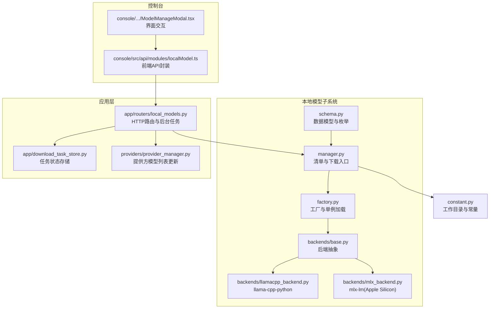
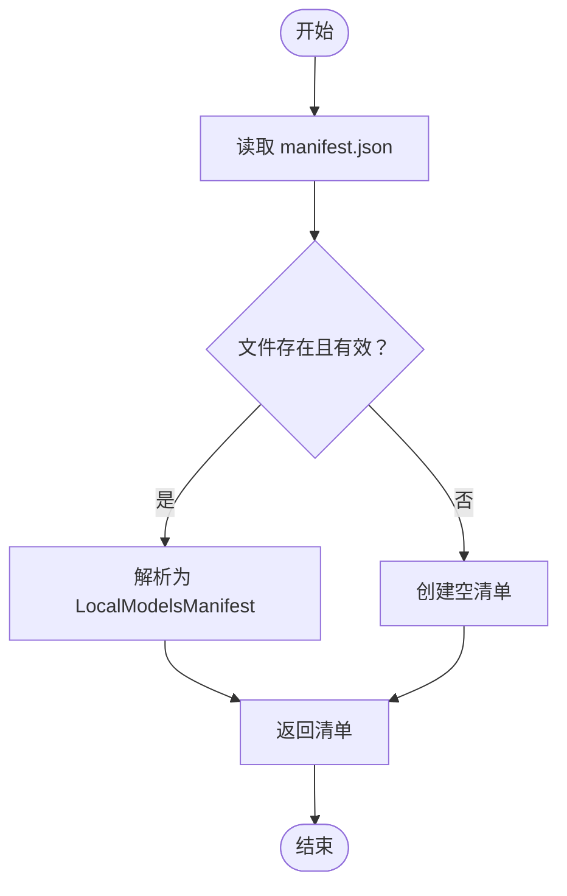
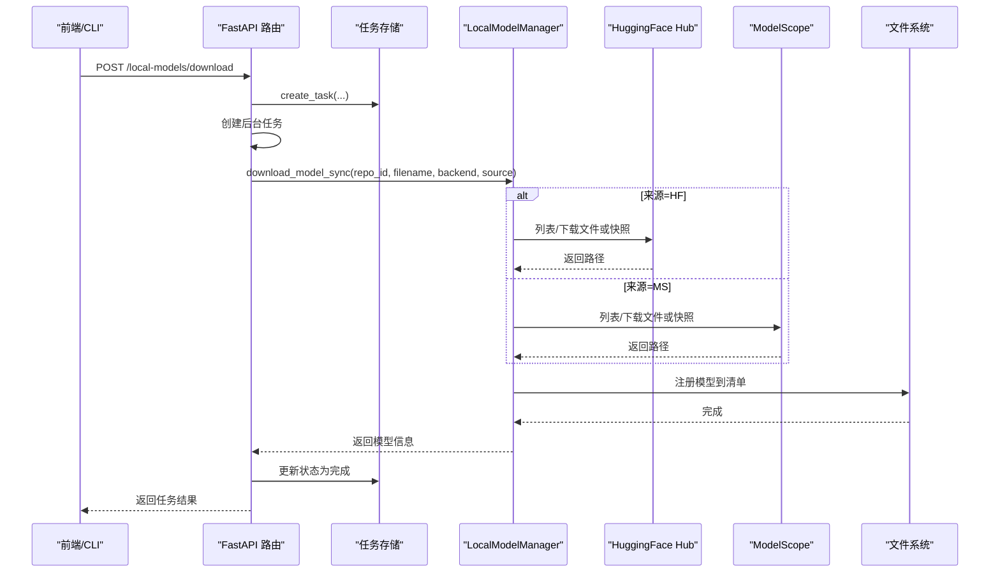
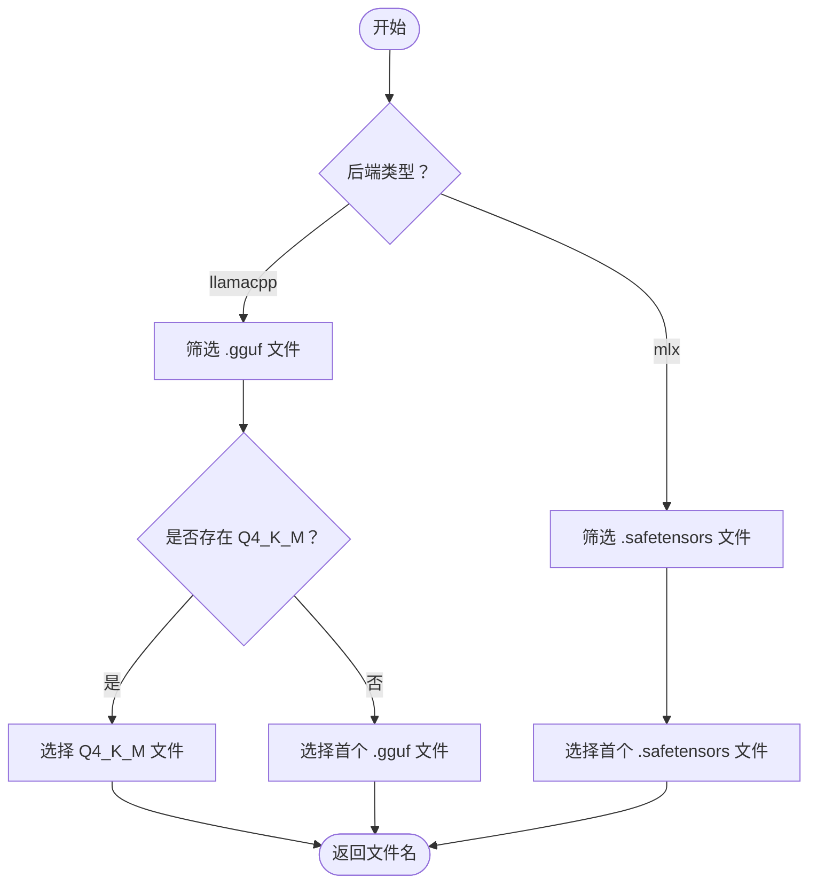
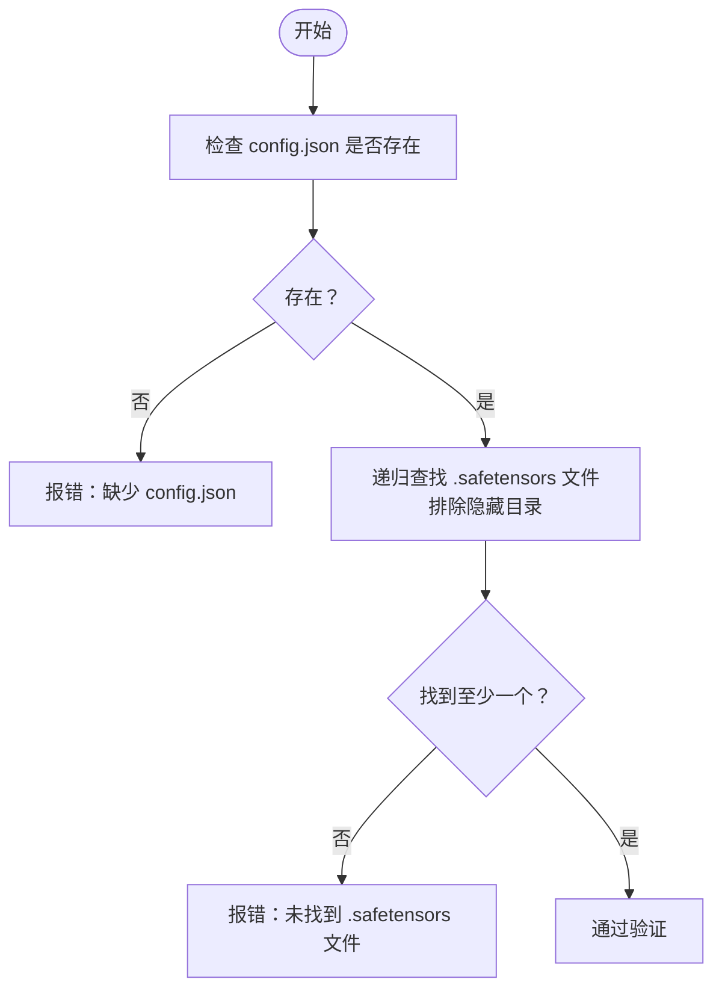
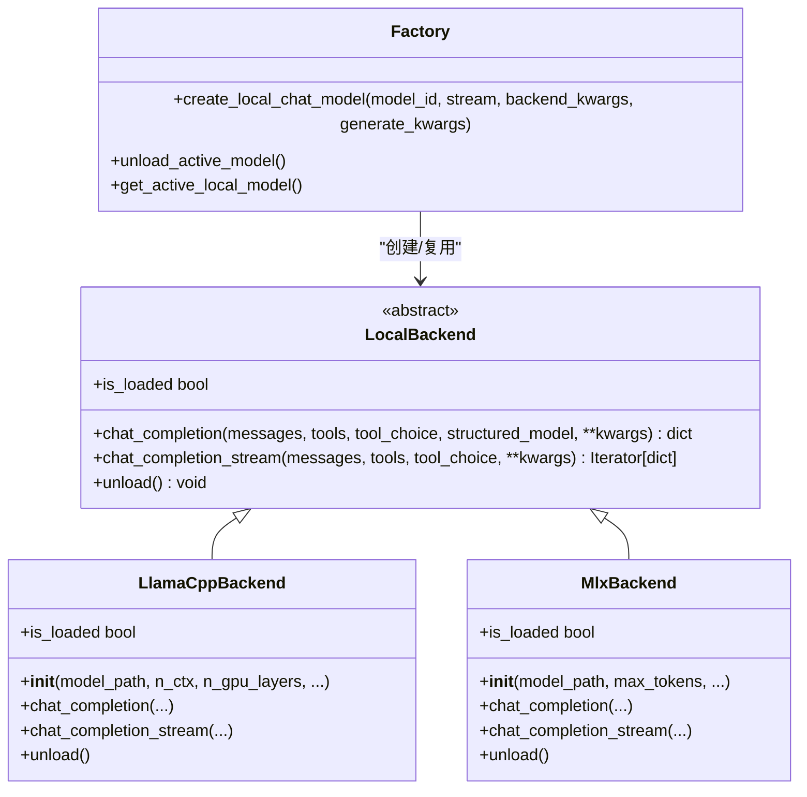
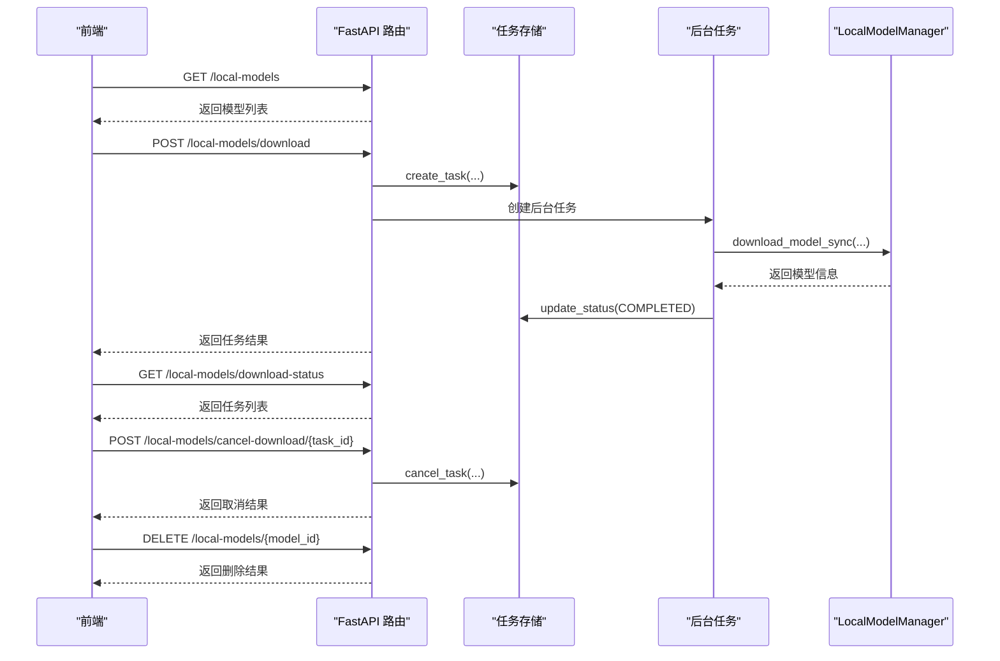
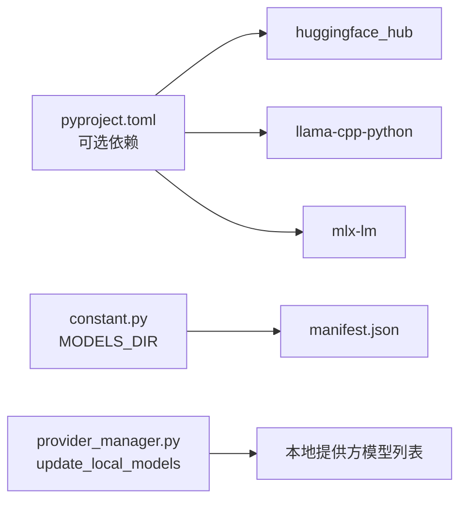

# 本地模型管理器

<cite>
**本文引用的文件**
- [manager.py](file://src/copaw/local_models/manager.py)
- [schema.py](file://src/copaw/local_models/schema.py)
- [base.py](file://src/copaw/local_models/backends/base.py)
- [llamacpp_backend.py](file://src/copaw/local_models/backends/llamacpp_backend.py)
- [mlx_backend.py](file://src/copaw/local_models/backends/mlx_backend.py)
- [factory.py](file://src/copaw/local_models/factory.py)
- [local_models.py](file://src/copaw/app/routers/local_models.py)
- [download_task_store.py](file://src/copaw/app/download_task_store.py)
- [constant.py](file://src/copaw/constant.py)
- [provider_manager.py](file://src/copaw/providers/provider_manager.py)
- [localModel.ts](file://console/src/api/modules/localModel.ts)
- [ModelManageModal.tsx](file://console/src/pages/Settings/Models/components/ModelManageModal.tsx)
- [pyproject.toml](file://pyproject.toml)
</cite>

## 目录
1. [简介](#简介)
2. [项目结构](#项目结构)
3. [核心组件](#核心组件)
4. [架构总览](#架构总览)
5. [详细组件分析](#详细组件分析)
6. [依赖分析](#依赖分析)
7. [性能考虑](#性能考虑)
8. [故障排查指南](#故障排查指南)
9. [结论](#结论)
10. [附录](#附录)

## 简介
本文件面向CoPaw的本地模型管理器，系统性阐述LocalModelManager类的设计与实现，覆盖模型下载、注册、清单管理、后端适配、API路由与任务调度等关键能力。文档同时解释manifest.json清单文件的结构与作用，详述从Hugging Face Hub与ModelScope两种来源的下载流程、自动文件选择算法、错误处理与验证机制，并给出删除、列表查询、查找等操作的实现细节。最后提供使用示例路径、最佳实践与常见问题解决方案。

## 项目结构
本地模型管理相关代码主要分布在以下模块：
- 后端抽象与实现：backends/base.py、backends/llamacpp_backend.py、backends/mlx_backend.py
- 数据模型与清单：schema.py、manager.py（含清单读写）
- 工厂与实例管理：factory.py
- 应用路由与后台任务：app/routers/local_models.py、app/download_task_store.py
- 常量与工作目录：constant.py
- 提供方集成：providers/provider_manager.py
- 控制台API封装：console/src/api/modules/localModel.ts
- 控制台界面交互：console/src/pages/Settings/Models/components/ModelManageModal.tsx
- 可选依赖声明：pyproject.toml



**图表来源**
- [schema.py:1-59](file://src/copaw/local_models/schema.py#L1-L59)
- [manager.py:1-413](file://src/copaw/local_models/manager.py#L1-L413)
- [factory.py:1-124](file://src/copaw/local_models/factory.py#L1-L124)
- [base.py:1-64](file://src/copaw/local_models/backends/base.py#L1-L64)
- [llamacpp_backend.py:1-140](file://src/copaw/local_models/backends/llamacpp_backend.py#L1-L140)
- [mlx_backend.py:1-236](file://src/copaw/local_models/backends/mlx_backend.py#L1-L236)
- [local_models.py:1-320](file://src/copaw/app/routers/local_models.py#L1-L320)
- [download_task_store.py:1-131](file://src/copaw/app/download_task_store.py#L1-L131)
- [provider_manager.py:670-694](file://src/copaw/providers/provider_manager.py#L670-L694)
- [constant.py:145-146](file://src/copaw/constant.py#L145-L146)

**章节来源**
- [manager.py:1-413](file://src/copaw/local_models/manager.py#L1-L413)
- [schema.py:1-59](file://src/copaw/local_models/schema.py#L1-L59)
- [local_models.py:1-320](file://src/copaw/app/routers/local_models.py#L1-L320)
- [constant.py:145-146](file://src/copaw/constant.py#L145-L146)

## 核心组件
- LocalModelManager：统一的模型下载入口，支持Hugging Face Hub与ModelScope，内置自动文件选择与清单注册。
- 清单系统：以manifest.json持久化模型元数据，提供增删查与校验。
- 后端抽象与实现：LocalBackend抽象接口，llamacpp与mlx两个具体后端。
- 工厂与单例：create_local_chat_model负责模型加载与复用，unload_active_model释放资源。
- 路由与任务：FastAPI路由提供列表、下载、取消、删除；后台任务通过download_task_store管理状态。
- 提供方集成：ProviderManager在本地模型变更后刷新本地提供方的可用模型列表。

**章节来源**
- [manager.py:94-413](file://src/copaw/local_models/manager.py#L94-L413)
- [schema.py:22-59](file://src/copaw/local_models/schema.py#L22-L59)
- [base.py:12-64](file://src/copaw/local_models/backends/base.py#L12-L64)
- [factory.py:22-124](file://src/copaw/local_models/factory.py#L22-L124)
- [local_models.py:94-320](file://src/copaw/app/routers/local_models.py#L94-L320)
- [download_task_store.py:26-131](file://src/copaw/app/download_task_store.py#L26-L131)
- [provider_manager.py:670-694](file://src/copaw/providers/provider_manager.py#L670-L694)

## 架构总览
本地模型管理器采用“清单驱动 + 后端适配”的分层设计：
- 数据层：LocalModelsManifest与LocalModelInfo持久化模型元数据。
- 下载层：LocalModelManager根据来源与后端类型调用对应下载函数，自动选择文件并注册到清单。
- 推理层：LocalBackend抽象统一推理接口，工厂按需加载具体后端实例。
- 应用层：FastAPI路由暴露REST接口，配合后台任务与推送消息通知用户。
- 集成层：ProviderManager在本地模型变更后更新本地提供方的模型列表。

```mermaid
classDiagram
class LocalModelsManifest {
+models : dict[str, LocalModelInfo]
}
class LocalModelInfo {
+id : str
+repo_id : str
+filename : str
+backend : BackendType
+source : DownloadSource
+file_size : int
+local_path : str
+display_name : str
}
class LocalModelManager {
+download_model_sync(repo_id, filename, backend, source) LocalModelInfo
-_download_from_huggingface(...)
-_download_from_modelscope(...)
-_auto_select_file(files, backend) str
-_register_model(...)
}
class LocalBackend {
<<abstract>>
+chat_completion(...)
+chat_completion_stream(...)
+unload()
+is_loaded bool
}
class LlamaCppBackend
class MlxBackend
class Factory {
+create_local_chat_model(model_id, ...)
+unload_active_model()
+get_active_local_model()
}
class Router {
+GET /local-models
+POST /local-models/download
+GET /local-models/download-status
+DELETE /local-models/{model_id}
+POST /local-models/cancel-download/{task_id}
}
class TaskStore {
+create_task(...)
+get_tasks(...)
+update_status(...)
+cancel_task(...)
}
LocalModelsManifest --> LocalModelInfo : "包含"
LocalModelManager --> LocalModelsManifest : "读写"
Factory --> LocalBackend : "创建"
LocalBackend <|-- LlamaCppBackend
LocalBackend <|-- MlxBackend
Router --> LocalModelManager : "调用"
Router --> TaskStore : "管理任务"
```

**图表来源**
- [schema.py:22-59](file://src/copaw/local_models/schema.py#L22-L59)
- [manager.py:94-413](file://src/copaw/local_models/manager.py#L94-L413)
- [base.py:12-64](file://src/copaw/local_models/backends/base.py#L12-L64)
- [llamacpp_backend.py:45-140](file://src/copaw/local_models/backends/llamacpp_backend.py#L45-L140)
- [mlx_backend.py:57-236](file://src/copaw/local_models/backends/mlx_backend.py#L57-L236)
- [factory.py:42-124](file://src/copaw/local_models/factory.py#L42-L124)
- [local_models.py:94-320](file://src/copaw/app/routers/local_models.py#L94-L320)
- [download_task_store.py:26-131](file://src/copaw/app/download_task_store.py#L26-L131)

## 详细组件分析

### 清单系统与manifest.json
- 清单文件位置：由常量定义的工作目录下的models子目录，文件名为manifest.json。
- 结构说明：
  - models：键为模型唯一ID，值为LocalModelInfo对象，包含仓库ID、文件名、后端类型、来源、大小、本地路径与显示名称等。
- 读写策略：
  - 加载时若文件损坏则警告并重建空清单。
  - 保存时确保目录存在，使用JSON序列化并格式化输出。
- 元数据存储与检索：
  - 列表：可按后端类型过滤返回所有模型。
  - 查找：按模型ID精确查找。
  - 删除：从清单移除并删除磁盘文件或目录，必要时清理空父目录。



**图表来源**
- [manager.py:30-49](file://src/copaw/local_models/manager.py#L30-L49)
- [constant.py:145-146](file://src/copaw/constant.py#L145-L146)

**章节来源**
- [manager.py:30-87](file://src/copaw/local_models/manager.py#L30-L87)
- [schema.py:55-59](file://src/copaw/local_models/schema.py#L55-L59)
- [constant.py:145-146](file://src/copaw/constant.py#L145-L146)

### 模型下载流程（Hugging Face Hub 与 ModelScope）
- 入口方法：LocalModelManager.download_model_sync，根据来源分派到不同下载函数。
- Hugging Face Hub：
  - MLX后端：直接拉取完整快照，校验目录完整性后注册。
  - 非MLX后端：若未指定文件名，则自动选择GGUF文件（优先Q4_K_M）。
- ModelScope：
  - MLX后端：兼容新旧版本的snapshot_download，失败时清理临时目录。
  - 非MLX后端：尝试列出文件并自动选择合适文件，否则要求显式指定。
- 注册与命名：
  - 文件型模型：ID为“仓库/文件”，显示名为“仓库简称（文件名）”。
  - 目录型模型（MLX）：ID为仓库ID，显示名为仓库简称。
  - 计算大小：目录模型统计非隐藏目录下所有文件大小。



**图表来源**
- [local_models.py:128-256](file://src/copaw/app/routers/local_models.py#L128-L256)
- [manager.py:98-292](file://src/copaw/local_models/manager.py#L98-L292)

**章节来源**
- [manager.py:98-292](file://src/copaw/local_models/manager.py#L98-L292)
- [local_models.py:128-256](file://src/copaw/app/routers/local_models.py#L128-L256)

### 自动文件选择算法
- llamacpp后端：优先选择包含“Q4_K_M”的GGUF文件；若不存在则报错提示需要显式指定。
- mlx后端：选择任意.safetensors文件作为触发点，实际会拉取包含该文件在内的整个仓库，保证配置与权重齐全。
- 错误处理：当仓库不包含目标文件类型时，抛出明确的错误信息，引导用户显式指定文件名。



**图表来源**
- [manager.py:294-330](file://src/copaw/local_models/manager.py#L294-L330)

**章节来源**
- [manager.py:294-330](file://src/copaw/local_models/manager.py#L294-L330)

### MLX模型目录验证
- 必备文件：config.json必须存在。
- 至少一个safetensors文件：排除隐藏目录与临时目录后检查。
- 失败处理：若缺失关键文件，抛出错误提示用户重新下载。



**图表来源**
- [manager.py:331-362](file://src/copaw/local_models/manager.py#L331-L362)

**章节来源**
- [manager.py:331-362](file://src/copaw/local_models/manager.py#L331-L362)

### 后端适配与推理接口
- 抽象接口：LocalBackend定义统一的初始化、聊天补全（非流式与流式）、卸载与加载状态属性。
- llama.cpp后端：基于llama-cpp-python，对消息进行规范化处理，支持工具调用与结构化输出。
- MLX后端：基于mlx-lm，针对Apple Silicon优化，支持采样参数映射与流式生成。
- 工厂模式：create_local_chat_model负责单例加载与复用，unload_active_model释放资源。



**图表来源**
- [base.py:12-64](file://src/copaw/local_models/backends/base.py#L12-L64)
- [llamacpp_backend.py:45-140](file://src/copaw/local_models/backends/llamacpp_backend.py#L45-L140)
- [mlx_backend.py:57-236](file://src/copaw/local_models/backends/mlx_backend.py#L57-L236)
- [factory.py:42-124](file://src/copaw/local_models/factory.py#L42-L124)

**章节来源**
- [base.py:12-64](file://src/copaw/local_models/backends/base.py#L12-L64)
- [llamacpp_backend.py:45-140](file://src/copaw/local_models/backends/llamacpp_backend.py#L45-L140)
- [mlx_backend.py:57-236](file://src/copaw/local_models/backends/mlx_backend.py#L57-L236)
- [factory.py:42-124](file://src/copaw/local_models/factory.py#L42-L124)

### API与任务管理
- 列表：GET /local-models，支持按后端过滤。
- 下载：POST /local-models/download，立即返回任务ID，后台执行下载。
- 状态：GET /local-models/download-status，轮询任务状态。
- 取消：POST /local-models/cancel-download/{task_id}，支持取消进行中或待处理任务。
- 删除：DELETE /local-models/{model_id}，从清单与磁盘删除。
- 任务存储：DownloadTaskStore维护任务生命周期状态（待处理/下载中/完成/失败/已取消）。



**图表来源**
- [local_models.py:94-320](file://src/copaw/app/routers/local_models.py#L94-L320)
- [download_task_store.py:43-131](file://src/copaw/app/download_task_store.py#L43-L131)

**章节来源**
- [local_models.py:94-320](file://src/copaw/app/routers/local_models.py#L94-L320)
- [download_task_store.py:26-131](file://src/copaw/app/download_task_store.py#L26-L131)

### 控制台集成与使用示例
- 前端API封装：console/src/api/modules/localModel.ts提供列表、下载、状态、取消、删除等方法。
- 界面交互：ModelManageModal.tsx根据提供方类型路由到本地模型管理弹窗，轮询下载状态并通知结果。
- 使用路径示例（仅路径，不含代码内容）：
  - 同步下载：参考 [manager.py:98-122](file://src/copaw/local_models/manager.py#L98-L122)
  - 异步下载：参考 [local_models.py:128-167](file://src/copaw/app/routers/local_models.py#L128-L167)
  - 批量管理：结合任务状态轮询与删除接口，参考 [local_models.py:258-320](file://src/copaw/app/routers/local_models.py#L258-L320) 与 [localModel.ts:8-38](file://console/src/api/modules/localModel.ts#L8-L38)

**章节来源**
- [localModel.ts:8-38](file://console/src/api/modules/localModel.ts#L8-L38)
- [ModelManageModal.tsx:87-127](file://console/src/pages/Settings/Models/components/ModelManageModal.tsx#L87-L127)
- [local_models.py:128-320](file://src/copaw/app/routers/local_models.py#L128-L320)
- [manager.py:98-122](file://src/copaw/local_models/manager.py#L98-L122)

## 依赖分析
- 可选依赖：
  - local：huggingface_hub（用于HF下载）
  - llamacpp：copaw[local] + llama-cpp-python
  - mlx：copaw[local] + mlx-lm（macOS平台）
- 工作目录与清单：
  - MODELS_DIR来自常量，清单文件位于该目录下。
- 提供方集成：
  - ProviderManager在本地模型变更后调用update_local_models刷新本地提供方的模型列表。



**图表来源**
- [pyproject.toml:71-91](file://pyproject.toml#L71-L91)
- [constant.py:145-146](file://src/copaw/constant.py#L145-L146)
- [provider_manager.py:670-694](file://src/copaw/providers/provider_manager.py#L670-L694)

**章节来源**
- [pyproject.toml:71-91](file://pyproject.toml#L71-L91)
- [constant.py:145-146](file://src/copaw/constant.py#L145-L146)
- [provider_manager.py:670-694](file://src/copaw/providers/provider_manager.py#L670-L694)

## 性能考虑
- 目录型模型（MLX）下载：拉取完整仓库，适合包含配置与权重的模型，但占用空间较大；可通过自动选择.safetensors文件触发完整下载。
- 文件型模型（llamacpp）下载：仅下载指定GGUF文件，节省空间；自动选择优先级可减少网络与IO开销。
- 后台任务：使用线程池执行同步下载，避免阻塞事件循环；完成后推送消息通知。
- 单例加载：工厂模式复用已加载的后端实例，减少重复初始化成本。

[本节为通用指导，无需特定文件引用]

## 故障排查指南
- 清单损坏：加载manifest.json失败时会警告并重建空清单，请检查文件权限与磁盘空间。
- 下载失败：
  - 缺少可选依赖：根据提示安装对应可选依赖（如huggingface_hub、llama-cpp-python、mlx-lm）。
  - ModelScope下载异常：确认仓库ID正确，必要时显式指定文件名。
  - MLX目录不完整：检查config.json与.safetensors文件是否齐全。
- 任务取消：取消后会清理刚下载的模型文件，确保磁盘空间不被占用。
- 提供方模型列表未更新：确认ProviderManager.update_local_models被调用，通常在删除或下载完成后自动触发。

**章节来源**
- [manager.py:30-37](file://src/copaw/local_models/manager.py#L30-L37)
- [local_models.py:132-141](file://src/copaw/app/routers/local_models.py#L132-L141)
- [local_models.py:239-254](file://src/copaw/app/routers/local_models.py#L239-L254)
- [provider_manager.py:670-694](file://src/copaw/providers/provider_manager.py#L670-L694)

## 结论
本地模型管理器通过清单驱动与后端适配实现了跨来源（HF Hub、ModelScope）的统一下载与管理，结合后台任务与提供方集成，为用户提供一致的本地推理体验。其设计强调可扩展性与健壮性，便于未来引入新的后端与下载源。

[本节为总结，无需特定文件引用]

## 附录
- 最佳实践建议：
  - 显式指定文件名以避免自动选择带来的不确定性（尤其在ModelScope）。
  - 在MLX环境下优先选择包含config.json与safetensors的仓库，确保目录验证通过。
  - 使用后台下载与轮询状态，避免阻塞UI或CLI交互。
  - 定期清理不再使用的模型，释放磁盘空间。
- 常见问题：
  - “找不到GGUF文件”：请在HF上选择GGUF格式仓库，或在ModelScope上显式指定文件。
  - “MLX模型下载失败”：检查仓库是否包含必需文件，必要时重新下载。
  - “依赖未安装”：根据提示安装对应可选依赖组。

[本节为通用指导，无需特定文件引用]