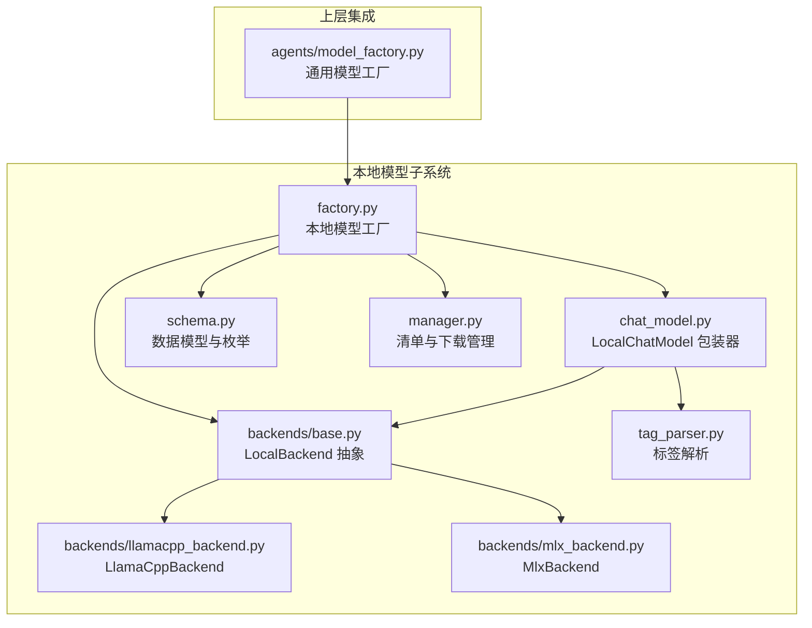
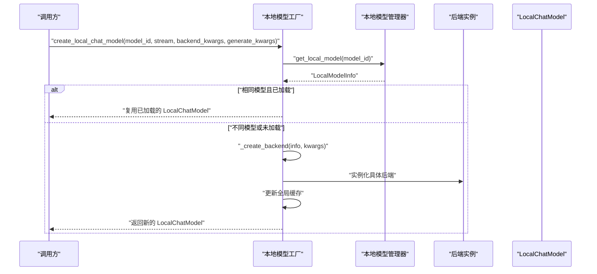
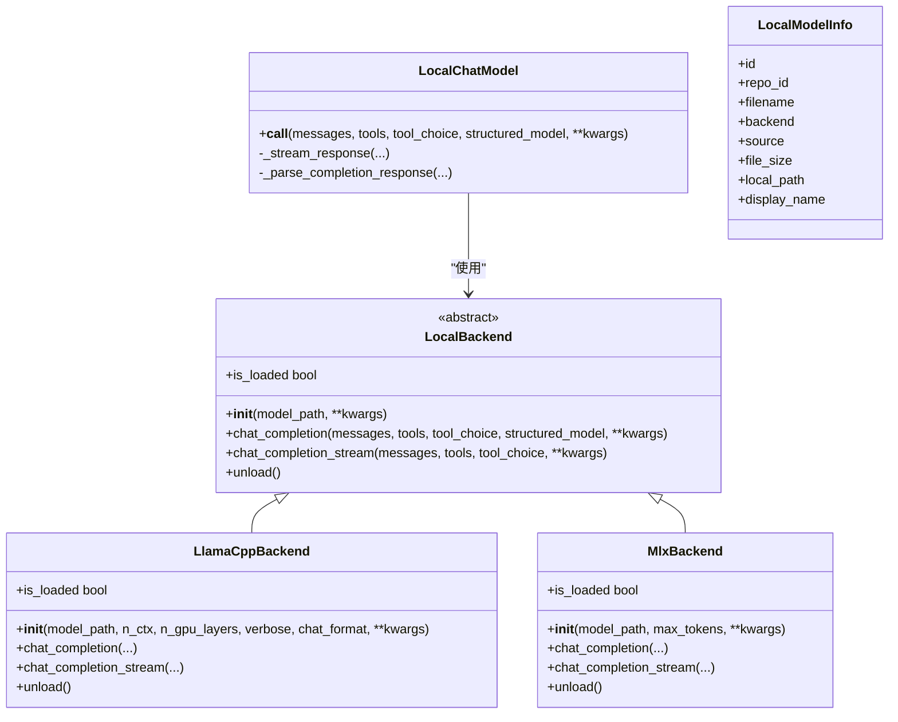

# 模型工厂

<cite>
**本文引用的文件列表**
- [factory.py](file://src/copaw/local_models/factory.py)
- [base.py](file://src/copaw/local_models/backends/base.py)
- [llamacpp_backend.py](file://src/copaw/local_models/backends/llamacpp_backend.py)
- [mlx_backend.py](file://src/copaw/local_models/backends/mlx_backend.py)
- [chat_model.py](file://src/copaw/local_models/chat_model.py)
- [schema.py](file://src/copaw/local_models/schema.py)
- [manager.py](file://src/copaw/local_models/manager.py)
- [tag_parser.py](file://src/copaw/local_models/tag_parser.py)
- [model_factory.py](file://src/copaw/agents/model_factory.py)
</cite>

## 目录
1. [简介](#简介)
2. [项目结构](#项目结构)
3. [核心组件](#核心组件)
4. [架构总览](#架构总览)
5. [详细组件分析](#详细组件分析)
6. [依赖关系分析](#依赖关系分析)
7. [性能考量](#性能考量)
8. [故障排查指南](#故障排查指南)
9. [结论](#结论)
10. [附录：使用示例与最佳实践](#附录使用示例与最佳实践)

## 简介
本文件系统化梳理 CoPaw 的“本地模型工厂”设计与实现，重点覆盖：
- 工厂方法模式在本地模型实例创建中的应用
- 抽象工厂思想在后端选择与封装中的体现
- 不同模型后端（llama.cpp、MLX）的创建机制、参数传递与配置管理
- 工厂如何依据模型类型、后端类型与配置参数选择合适实现
- 扩展机制：新增后端的流程与兼容性保障
- 使用示例：如何通过工厂创建与管理本地模型，含错误处理与资源清理
- 最佳实践与性能优化建议

## 项目结构
围绕本地模型工厂的相关模块组织如下：
- local_models/factory.py：本地模型工厂（单例），负责创建 LocalChatModel 并按需加载后端
- local_models/backends/*：后端抽象与具体实现（LocalBackend 抽象类，llamacpp_backend、mlx_backend）
- local_models/chat_model.py：统一的聊天模型包装器，适配异步接口并解析输出
- local_models/schema.py：本地模型元数据与枚举定义（BackendType、LocalModelInfo 等）
- local_models/manager.py：本地模型清单与下载管理（注册、删除、自动选择文件等）
- local_models/tag_parser.py：从文本中解析思维与工具调用标签的辅助模块
- agents/model_factory.py：通用模型工厂（OpenAI/Gemini/Anthropic 等），内部可复用本地工厂

图表来源
- [factory.py:1-125](file://src/copaw/local_models/factory.py#L1-L125)
- [base.py:12-64](file://src/copaw/local_models/backends/base.py#L12-L64)
- [llamacpp_backend.py:45-140](file://src/copaw/local_models/backends/llamacpp_backend.py#L45-L140)
- [mlx_backend.py:57-236](file://src/copaw/local_models/backends/mlx_backend.py#L57-L236)
- [chat_model.py:39-362](file://src/copaw/local_models/chat_model.py#L39-L362)
- [schema.py:12-59](file://src/copaw/local_models/schema.py#L12-L59)
- [manager.py:94-413](file://src/copaw/local_models/manager.py#L94-L413)
- [tag_parser.py:1-230](file://src/copaw/local_models/tag_parser.py#L1-L230)
- [model_factory.py:280-379](file://src/copaw/agents/model_factory.py#L280-L379)

章节来源
- [factory.py:1-125](file://src/copaw/local_models/factory.py#L1-L125)
- [model_factory.py:280-379](file://src/copaw/agents/model_factory.py#L280-L379)

## 核心组件
- 本地模型工厂（单例）：负责根据模型 ID 获取本地模型信息，按需加载后端，复用已加载实例，并返回统一的 LocalChatModel 实例。
- 后端抽象与实现：LocalBackend 定义统一接口；LlamaCppBackend 与 MlxBackend 分别封装 llama-cpp-python 与 mlx-lm 的推理能力。
- LocalChatModel：将 LocalBackend 的同步接口适配为异步 ChatModelBase，支持流式与非流式输出，解析思维与工具调用块。
- 数据模型与枚举：BackendType、LocalModelInfo 等，用于描述模型元数据与后端类型。
- 清单与下载管理：LocalModelManager 提供下载、注册、删除、自动选择文件等功能。
- 通用模型工厂：agents/model_factory.py 可基于配置选择本地或远程模型，并进行格式化与重试包装。

章节来源
- [factory.py:42-125](file://src/copaw/local_models/factory.py#L42-L125)
- [base.py:12-64](file://src/copaw/local_models/backends/base.py#L12-L64)
- [chat_model.py:39-362](file://src/copaw/local_models/chat_model.py#L39-L362)
- [schema.py:12-59](file://src/copaw/local_models/schema.py#L12-L59)
- [manager.py:94-413](file://src/copaw/local_models/manager.py#L94-L413)
- [model_factory.py:280-379](file://src/copaw/agents/model_factory.py#L280-L379)

## 架构总览
本地模型工厂采用“工厂方法 + 单例缓存”的组合模式：
- 工厂方法：create_local_chat_model 负责创建 LocalChatModel，并在需要时调用 _create_backend 选择具体后端。
- 单例缓存：全局持有当前已加载的后端实例，避免重复加载，提升性能。
- 抽象工厂思想：_create_backend 根据 LocalModelInfo.backend 字段分派到不同后端实现，形成“按类型选择”的工厂分发逻辑。

图表来源
- [factory.py:42-125](file://src/copaw/local_models/factory.py#L42-L125)
- [manager.py:63-67](file://src/copaw/local_models/manager.py#L63-L67)

章节来源
- [factory.py:42-125](file://src/copaw/local_models/factory.py#L42-L125)

## 详细组件分析

### 本地模型工厂（单例）
- 职责
  - 根据 model_id 获取 LocalModelInfo
  - 单例缓存当前已加载的后端实例，避免重复初始化
  - 条件卸载旧模型，加载新模型
  - 返回统一的 LocalChatModel，支持流式与非流式生成
- 关键点
  - 线程安全：使用锁保护全局状态
  - 复用策略：若请求的 model_id 与当前一致且后端已加载，则直接复用
  - 错误处理：未找到模型抛出异常；未知后端类型抛出异常
  - 参数透传：backend_kwargs 透传给后端构造函数；generate_kwargs 透传给每次生成调用

章节来源
- [factory.py:22-125](file://src/copaw/local_models/factory.py#L22-L125)

### 后端抽象与实现
- LocalBackend 抽象类
  - 统一接口：__init__、chat_completion、chat_completion_stream、unload、is_loaded
  - 作用：屏蔽不同推理库的差异，向上提供一致的聊天补全接口
- LlamaCppBackend
  - 基于 llama-cpp-python，支持 n_ctx、n_gpu_layers、chat_format 等参数
  - 支持工具调用与结构化输出（通过 response_format）
  - 流式与非流式接口均通过 llama_cpp.Llama 实现
- MlxBackend
  - 基于 mlx-lm，适用于 Apple Silicon 设备
  - 需要目录型模型（safetensors + config），会解析模型目录路径
  - 支持采样参数映射（如 temperature->temp），并提供流式生成

章节来源
- [base.py:12-64](file://src/copaw/local_models/backends/base.py#L12-L64)
- [llamacpp_backend.py:45-140](file://src/copaw/local_models/backends/llamacpp_backend.py#L45-L140)
- [mlx_backend.py:57-236](file://src/copaw/local_models/backends/mlx_backend.py#L57-L236)

### LocalChatModel 包装器
- 职责
  - 将 LocalBackend 的同步接口适配为异步 ChatModelBase
  - 在非流式或结构化输出场景下，在线程池中执行同步调用
  - 在流式场景下，通过队列与后台线程驱动同步迭代器，转换为异步生成器
  - 解析输出：提取思维内容（think）、工具调用（tool_use）、文本内容，并统计 token 使用
- 特性
  - 异常透传：后台线程中的异常通过队列抛出
  - 结构化输出：支持 Pydantic 模型约束的 JSON 输出
  - 标签解析：当后端未提供结构化字段时，从文本中解析思维与工具调用标签

章节来源
- [chat_model.py:39-362](file://src/copaw/local_models/chat_model.py#L39-L362)
- [tag_parser.py:134-230](file://src/copaw/local_models/tag_parser.py#L134-L230)

### 数据模型与枚举
- BackendType：枚举本地模型后端类型（LLAMACPP、MLX）
- LocalModelInfo：描述本地模型元数据（id、repo_id、filename、backend、source、file_size、local_path、display_name）
- DownloadProgress、LocalModelsManifest：下载进度与清单模型

章节来源
- [schema.py:12-59](file://src/copaw/local_models/schema.py#L12-L59)

### 清单与下载管理
- 列表与查询：list_local_models、get_local_model
- 删除：delete_local_model，同时清理磁盘与清单
- 下载：LocalModelManager.download_model_sync，支持 HuggingFace 与 ModelScope，自动选择文件（GGUF 或 safetensors），并注册到清单
- 自动选择：_auto_select_file 根据后端类型优先选择量化文件
- MLX 校验：_validate_mlx_directory 校验目录完整性

章节来源
- [manager.py:52-413](file://src/copaw/local_models/manager.py#L52-L413)

### 通用模型工厂（与本地工厂协作）
- 作用：根据配置选择本地或远程模型，创建对应的 ChatModelBase 与 Formatter
- 与本地工厂协作：当 provider.is_local 为真时，调用 create_local_chat_model 创建本地模型
- 包装：TokenRecordingModelWrapper 与 RetryChatModel 对模型进行计费与重试增强

章节来源
- [model_factory.py:280-379](file://src/copaw/agents/model_factory.py#L280-L379)

## 依赖关系分析
- 工厂依赖
  - 依赖 LocalModelInfo 与 BackendType 决定后端类型
  - 依赖 LocalModelManager 查询模型元数据
  - 依赖 LocalBackend 抽象与具体实现
  - 依赖 LocalChatModel 进行统一包装
- 后端实现
  - LlamaCppBackend 依赖 llama_cpp
  - MlxBackend 依赖 mlx_lm，并解析模型目录
- 上层集成
  - agents/model_factory.py 依赖本地工厂以支持本地模型

图表来源
- [base.py:12-64](file://src/copaw/local_models/backends/base.py#L12-L64)
- [llamacpp_backend.py:45-140](file://src/copaw/local_models/backends/llamacpp_backend.py#L45-L140)
- [mlx_backend.py:57-236](file://src/copaw/local_models/backends/mlx_backend.py#L57-L236)
- [chat_model.py:39-362](file://src/copaw/local_models/chat_model.py#L39-L362)
- [schema.py:22-42](file://src/copaw/local_models/schema.py#L22-L42)

章节来源
- [base.py:12-64](file://src/copaw/local_models/backends/base.py#L12-L64)
- [llamacpp_backend.py:45-140](file://src/copaw/local_models/backends/llamacpp_backend.py#L45-L140)
- [mlx_backend.py:57-236](file://src/copaw/local_models/backends/mlx_backend.py#L57-L236)
- [chat_model.py:39-362](file://src/copaw/local_models/chat_model.py#L39-L362)
- [schema.py:22-42](file://src/copaw/local_models/schema.py#L22-L42)

## 性能考量
- 单例缓存与复用
  - 工厂通过全局变量与锁缓存当前后端实例，避免重复加载，显著降低延迟与内存占用
- 线程池与异步适配
  - LocalChatModel 在非流式与结构化输出场景下使用线程池执行同步调用，避免阻塞事件循环
  - 流式场景通过后台线程与队列桥接，保持异步接口一致性
- 后端参数优化
  - llama.cpp：合理设置 n_ctx、n_gpu_layers，平衡显存与性能
  - MLX：注意模型目录完整性校验，避免因文件缺失导致反复失败
- I/O 与磁盘访问
  - 清单读写与模型文件访问应尽量避免频繁触发，建议批量操作或缓存结果

[本节为通用性能讨论，不直接分析具体文件]

## 故障排查指南
- 未找到模型
  - 现象：抛出“未找到模型”的异常
  - 排查：确认模型是否已下载并注册到清单；检查 model_id 是否正确
  - 参考
    - [factory.py:70-76](file://src/copaw/local_models/factory.py#L70-L76)
    - [manager.py:63-67](file://src/copaw/local_models/manager.py#L63-L67)
- 未知后端类型
  - 现象：抛出“未知后端”异常
  - 排查：确认 LocalModelInfo.backend 是否为 LLAMACPP 或 MLX
  - 参考
    - [factory.py:123-124](file://src/copaw/local_models/factory.py#L123-L124)
- 缺少后端依赖库
  - 现象：导入时抛出 ImportError
  - 排查：安装对应后端依赖（llama-cpp-python 或 mlx-lm）
  - 参考
    - [llamacpp_backend.py:57-63](file://src/copaw/local_models/backends/llamacpp_backend.py#L57-L63)
    - [mlx_backend.py:66-72](file://src/copaw/local_models/backends/mlx_backend.py#L66-L72)
- MLX 模型目录不完整
  - 现象：校验失败，提示缺少必要文件
  - 排查：重新下载模型目录，确保包含 config.json 与至少一个 safetensors 文件
  - 参考
    - [manager.py:332-361](file://src/copaw/local_models/manager.py#L332-L361)
- 流式输出异常
  - 现象：后台线程异常通过队列抛出
  - 排查：检查后端实现与消息规范化逻辑；关注工具调用与思维标签解析
  - 参考
    - [chat_model.py:113-139](file://src/copaw/local_models/chat_model.py#L113-L139)
    - [tag_parser.py:176-230](file://src/copaw/local_models/tag_parser.py#L176-L230)

章节来源
- [factory.py:70-124](file://src/copaw/local_models/factory.py#L70-L124)
- [llamacpp_backend.py:57-63](file://src/copaw/local_models/backends/llamacpp_backend.py#L57-L63)
- [mlx_backend.py:66-72](file://src/copaw/local_models/backends/mlx_backend.py#L66-L72)
- [manager.py:332-361](file://src/copaw/local_models/manager.py#L332-L361)
- [chat_model.py:113-139](file://src/copaw/local_models/chat_model.py#L113-L139)
- [tag_parser.py:176-230](file://src/copaw/local_models/tag_parser.py#L176-L230)

## 结论
CoPaw 的本地模型工厂通过“工厂方法 + 单例缓存”的设计，实现了对多后端推理库的一致封装与高效复用。其抽象工厂式的后端分派机制使得新增后端变得简单可控，同时配合清单管理与下载工具，形成了从模型发现、下载、注册到推理使用的完整闭环。结合异步适配与标签解析，工厂既满足了易用性，也兼顾了性能与兼容性。

[本节为总结性内容，不直接分析具体文件]

## 附录：使用示例与最佳实践

### 如何使用本地模型工厂
- 创建本地聊天模型
  - 步骤：准备 model_id（已在清单中注册）、可选 stream、backend_kwargs、generate_kwargs
  - 调用：调用工厂方法创建 LocalChatModel
  - 参考
    - [factory.py:42-107](file://src/copaw/local_models/factory.py#L42-L107)
- 使用 LocalChatModel
  - 支持异步调用，可选择流式或非流式
  - 可传入 tools、tool_choice、structured_model 等参数
  - 参考
    - [chat_model.py:58-94](file://src/copaw/local_models/chat_model.py#L58-L94)
- 错误处理与资源清理
  - 未找到模型：捕获异常并引导用户先下载模型
  - 未知后端：检查模型清单中的 backend 字段
  - 卸载模型：调用工厂卸载接口释放资源
  - 参考
    - [factory.py:70-76](file://src/copaw/local_models/factory.py#L70-L76)
    - [factory.py:123-124](file://src/copaw/local_models/factory.py#L123-L124)
    - [factory.py:32-40](file://src/copaw/local_models/factory.py#L32-L40)

### 新增后端的扩展流程
- 定义后端类
  - 继承 LocalBackend，实现 __init__、chat_completion、chat_completion_stream、unload、is_loaded
  - 参考
    - [base.py:12-64](file://src/copaw/local_models/backends/base.py#L12-L64)
- 实现后端逻辑
  - 参考现有实现：llama.cpp 与 MLX 的实现方式
  - 参考
    - [llamacpp_backend.py:45-140](file://src/copaw/local_models/backends/llamacpp_backend.py#L45-L140)
    - [mlx_backend.py:57-236](file://src/copaw/local_models/backends/mlx_backend.py#L57-L236)
- 注册后端类型
  - 在枚举与工厂分派逻辑中加入新类型
  - 参考
    - [schema.py:12-15](file://src/copaw/local_models/schema.py#L12-L15)
    - [factory.py:110-124](file://src/copaw/local_models/factory.py#L110-L124)
- 兼容性保障
  - 保持接口一致性（消息格式、工具调用、结构化输出）
  - 提供必要的参数映射与默认值
  - 参考
    - [llamacpp_backend.py:86-129](file://src/copaw/local_models/backends/llamacpp_backend.py#L86-L129)
    - [mlx_backend.py:98-223](file://src/copaw/local_models/backends/mlx_backend.py#L98-L223)

### 最佳实践
- 参数传递
  - backend_kwargs 用于后端构造参数（如 n_ctx、n_gpu_layers、max_tokens 等）
  - generate_kwargs 用于每次生成调用的参数（如 temperature、top_p、max_tokens 等）
- 资源管理
  - 长时间运行场景下，适时调用卸载接口释放显存/内存
  - 多模型切换时，利用单例缓存减少重复加载
- 错误处理
  - 明确区分“模型不存在”“后端类型未知”“依赖缺失”等异常
  - 在上层统一包装重试与计费记录
- 性能优化
  - 合理设置 n_ctx 与 n_gpu_layers（llama.cpp）
  - 避免频繁切换模型，充分利用单例缓存
  - 流式输出时控制队列大小与线程池并发度

[本节为通用指导，不直接分析具体文件]