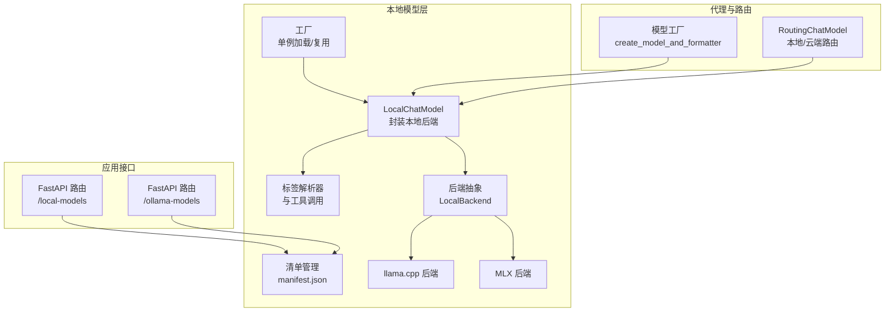
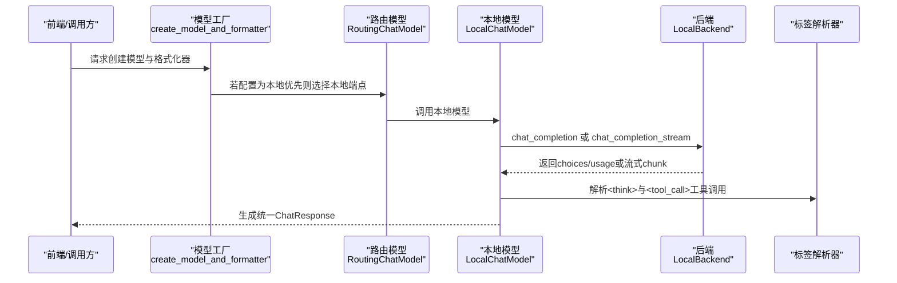
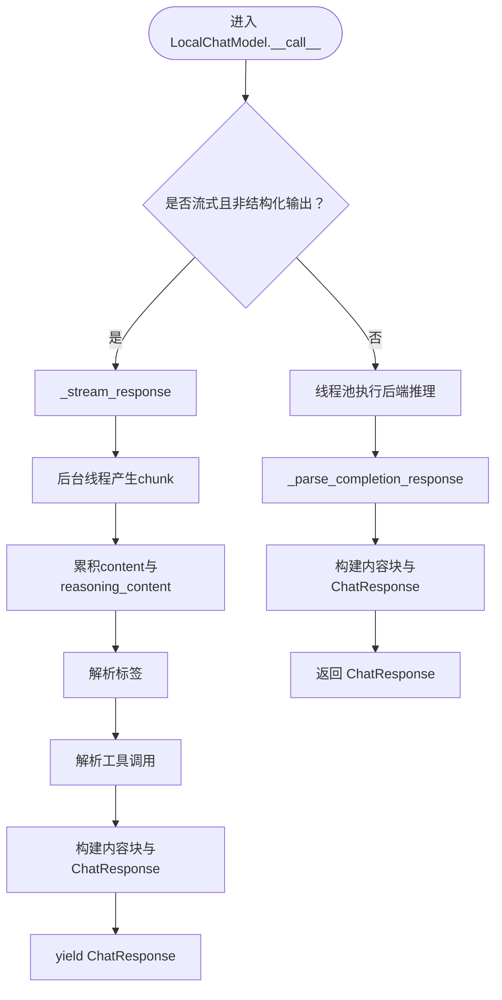
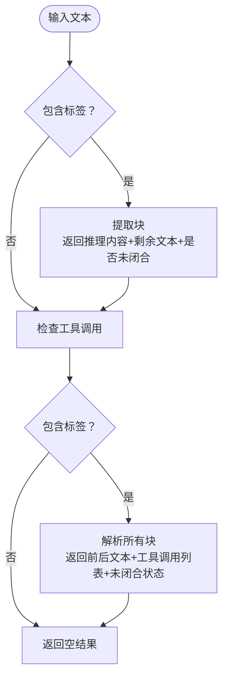
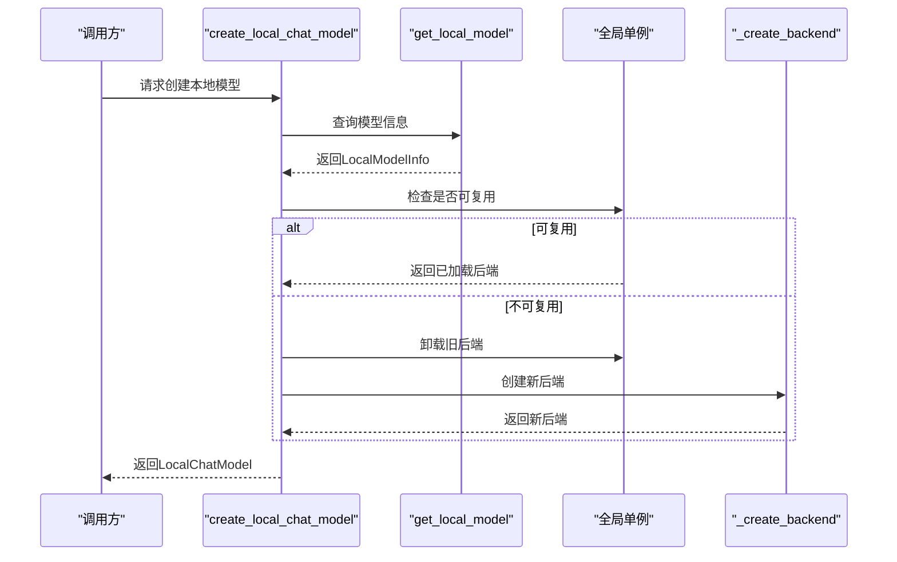
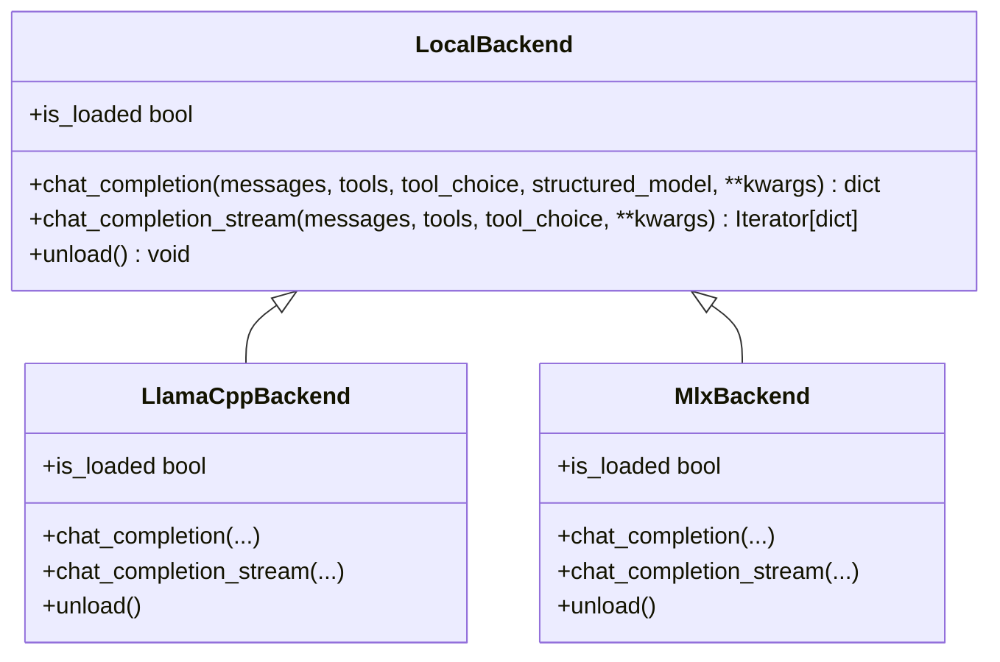
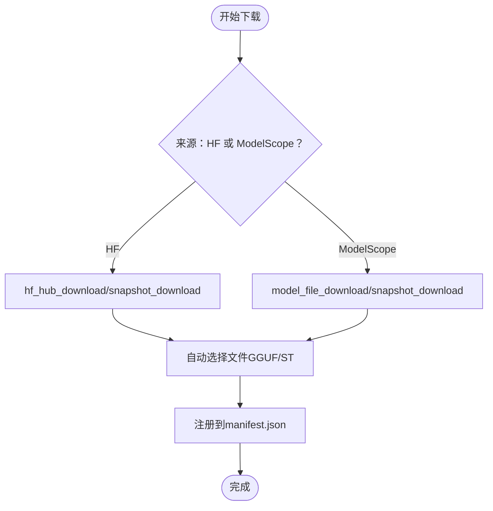
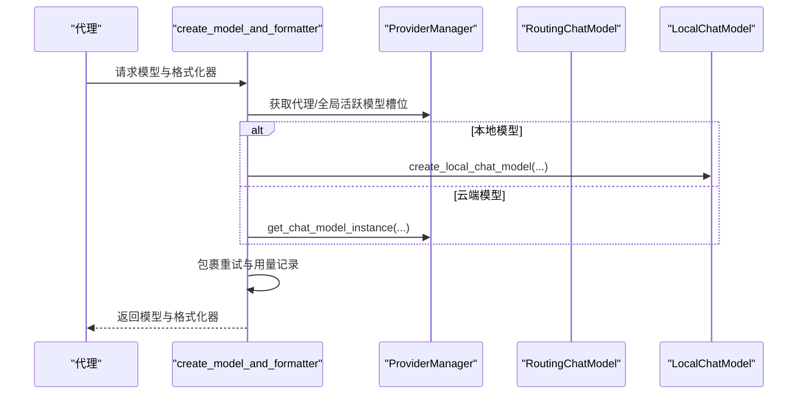
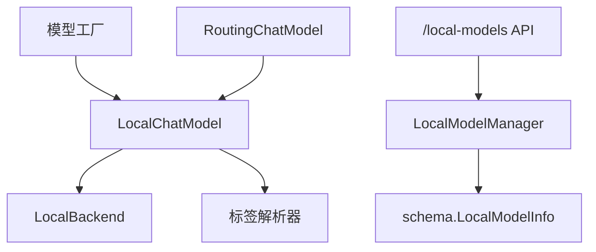

# 聊天模型集成

<cite>
**本文引用的文件**
- [chat_model.py](file://src/copaw/local_models/chat_model.py)
- [tag_parser.py](file://src/copaw/local_models/tag_parser.py)
- [factory.py](file://src/copaw/local_models/factory.py)
- [manager.py](file://src/copaw/local_models/manager.py)
- [base.py](file://src/copaw/local_models/backends/base.py)
- [llamacpp_backend.py](file://src/copaw/local_models/backends/llamacpp_backend.py)
- [mlx_backend.py](file://src/copaw/local_models/backends/mlx_backend.py)
- [schema.py](file://src/copaw/local_models/schema.py)
- [routing_chat_model.py](file://src/copaw/agents/routing_chat_model.py)
- [model_factory.py](file://src/copaw/agents/model_factory.py)
- [local_models.py](file://src/copaw/app/routers/local_models.py)
- [ollama_models.py](file://src/copaw/app/routers/ollama_models.py)
</cite>

## 目录
1. [简介](#简介)
2. [项目结构](#项目结构)
3. [核心组件](#核心组件)
4. [架构总览](#架构总览)
5. [详细组件分析](#详细组件分析)
6. [依赖关系分析](#依赖关系分析)
7. [性能考虑](#性能考虑)
8. [故障排查指南](#故障排查指南)
9. [结论](#结论)
10. [附录：使用示例与最佳实践](#附录使用示例与最佳实践)

## 简介
本文件面向希望在 CoPaw 中集成本地聊天模型的开发者，系统性阐述本地模型与聊天系统的集成方式，包括：
- 本地模型包装与接口适配（LocalChatModel）
- 模型标签解析器（用于<think>与<tool_call>工具调用标签）的工作原理
- 输入到推理再到响应生成的完整流程
- 集成中的缓存与资源管理、会话与状态保持策略
- 错误处理、性能监控与调试技巧
- 在聊天系统中使用本地模型的具体步骤与示例路径

## 项目结构
围绕“本地聊天模型集成”的关键模块分布如下：
- local_models：本地模型封装、后端抽象与实现、标签解析、工厂与清单管理
- agents：路由模型选择、统一模型工厂、格式化器与重试包装
- app/routers：对外 API（FastAPI），提供本地模型下载、删除、状态查询等能力
- providers：云模型提供方与兼容层（与本地模型协同）

图表来源
- [chat_model.py:39-362](file://src/copaw/local_models/chat_model.py#L39-L362)
- [tag_parser.py:134-230](file://src/copaw/local_models/tag_parser.py#L134-L230)
- [factory.py:42-125](file://src/copaw/local_models/factory.py#L42-L125)
- [manager.py:94-413](file://src/copaw/local_models/manager.py#L94-L413)
- [base.py:12-64](file://src/copaw/local_models/backends/base.py#L12-L64)
- [llamacpp_backend.py:45-140](file://src/copaw/local_models/backends/llamacpp_backend.py#L45-L140)
- [mlx_backend.py:57-236](file://src/copaw/local_models/backends/mlx_backend.py#L57-L236)
- [routing_chat_model.py:65-123](file://src/copaw/agents/routing_chat_model.py#L65-L123)
- [model_factory.py:280-379](file://src/copaw/agents/model_factory.py#L280-L379)
- [local_models.py:94-320](file://src/copaw/app/routers/local_models.py#L94-L320)
- [ollama_models.py:152-291](file://src/copaw/app/routers/ollama_models.py#L152-L291)

章节来源
- [chat_model.py:39-362](file://src/copaw/local_models/chat_model.py#L39-L362)
- [factory.py:42-125](file://src/copaw/local_models/factory.py#L42-L125)
- [manager.py:94-413](file://src/copaw/local_models/manager.py#L94-L413)
- [base.py:12-64](file://src/copaw/local_models/backends/base.py#L12-L64)
- [llamacpp_backend.py:45-140](file://src/copaw/local_models/backends/llamacpp_backend.py#L45-L140)
- [mlx_backend.py:57-236](file://src/copaw/local_models/backends/mlx_backend.py#L57-L236)
- [tag_parser.py:134-230](file://src/copaw/local_models/tag_parser.py#L134-L230)
- [routing_chat_model.py:65-123](file://src/copaw/agents/routing_chat_model.py#L65-L123)
- [model_factory.py:280-379](file://src/copaw/agents/model_factory.py#L280-L379)
- [local_models.py:94-320](file://src/copaw/app/routers/local_models.py#L94-L320)
- [ollama_models.py:152-291](file://src/copaw/app/routers/ollama_models.py#L152-L291)

## 核心组件
- LocalChatModel：将任意 LocalBackend（如 llama.cpp、MLX）通过统一接口暴露给上层，支持流式与非流式推理，并负责将后端输出解析为统一的 ChatResponse 结构，同时处理<think>与<tool_call>工具调用标签。
- 标签解析器：从文本中提取<think>推理内容与<tool_call>工具调用块，支持未闭合标签的流式场景。
- 工厂与单例：create_local_chat_model 提供单例加载/卸载与复用，避免重复占用内存；get_active_local_model/unload_active_model 支持显式资源回收。
- 后端抽象与实现：LocalBackend 定义统一接口；LlamaCppBackend 与 MlxBackend 分别对接 llama-cpp-python 与 mlx-lm。
- 清单管理：LocalModelManager 负责下载、注册、列出、删除本地模型，并维护 manifest.json。
- 路由与统一工厂：RoutingChatModel 决定本地/云端路由；model_factory 的 create_model_and_formatter 统一创建模型与格式化器，并包裹重试与用量记录。

章节来源
- [chat_model.py:39-362](file://src/copaw/local_models/chat_model.py#L39-L362)
- [tag_parser.py:134-230](file://src/copaw/local_models/tag_parser.py#L134-L230)
- [factory.py:42-125](file://src/copaw/local_models/factory.py#L42-L125)
- [base.py:12-64](file://src/copaw/local_models/backends/base.py#L12-L64)
- [llamacpp_backend.py:45-140](file://src/copaw/local_models/backends/llamacpp_backend.py#L45-L140)
- [mlx_backend.py:57-236](file://src/copaw/local_models/backends/mlx_backend.py#L57-L236)
- [manager.py:94-413](file://src/copaw/local_models/manager.py#L94-L413)
- [routing_chat_model.py:65-123](file://src/copaw/agents/routing_chat_model.py#L65-L123)
- [model_factory.py:280-379](file://src/copaw/agents/model_factory.py#L280-L379)

## 架构总览
本地模型集成采用“后端抽象 + 包装适配 + 统一接口 + 路由与工厂”的分层设计：
- 底层：LocalBackend 抽象不同本地推理库（llama.cpp、MLX）
- 中层：LocalChatModel 将后端输出标准化为 ChatResponse，解析<think>与<tool_call>标签
- 上层：工厂与路由负责实例化、复用与调度；API 层负责下载与状态管理

图表来源
- [model_factory.py:280-379](file://src/copaw/agents/model_factory.py#L280-L379)
- [routing_chat_model.py:65-123](file://src/copaw/agents/routing_chat_model.py#L65-L123)
- [chat_model.py:58-127](file://src/copaw/local_models/chat_model.py#L58-L127)
- [tag_parser.py:134-230](file://src/copaw/local_models/tag_parser.py#L134-L230)
- [base.py:29-54](file://src/copaw/local_models/backends/base.py#L29-L54)

## 详细组件分析

### LocalChatModel：本地模型包装与接口适配
- 初始化：接收 model_name、LocalBackend 实例、是否流式以及默认生成参数
- 推理入口：
  - 流式：_stream_response 使用线程池驱动后端同步迭代器，通过 asyncio.Queue 异步产出增量块，累积<think>与<tool_call>工具调用，构建 ThinkingBlock、TextBlock、ToolUseBlock 并返回 ChatResponse
  - 非流式：在线程池中执行后端同步推理，随后解析为 ChatResponse
- 标签解析：
  - <think>：优先使用后端提供的 reasoning_content；若为空则尝试从文本中提取<think>块
  - <tool_call>工具调用：优先使用后端提供的 tool_calls；若为空则从文本中解析工具调用块
- 用量统计：从后端返回的 usage 字段构造 ChatUsage，包含 prompt_tokens、completion_tokens 与耗时

图表来源
- [chat_model.py:58-127](file://src/copaw/local_models/chat_model.py#L58-L127)
- [chat_model.py:129-258](file://src/copaw/local_models/chat_model.py#L129-L258)
- [chat_model.py:259-362](file://src/copaw/local_models/chat_model.py#L259-L362)

章节来源
- [chat_model.py:39-362](file://src/copaw/local_models/chat_model.py#L39-L362)

### 标签解析器：模型标识与标签解析
- 功能：
  - 判断文本是否包含<think>标签
  - 从文本中提取<think>块，返回推理内容与剩余文本，并标记是否仍有未闭合标签（流式）
  - 判断文本是否包含<tool_call>工具调用标签
  - 从文本中解析所有<tool_call>工具调用块，返回调用前/后的文本、已解析工具调用列表、未闭合状态与部分文本
- 复杂度：正则匹配与字符串扫描，时间复杂度近似 O(n)，空间取决于匹配结果数量
- 兼容性：支持<think>与<tool_call>标签的流式拼接场景，自动处理未闭合标签

图表来源
- [tag_parser.py:134-230](file://src/copaw/local_models/tag_parser.py#L134-L230)

章节来源
- [tag_parser.py:134-230](file://src/copaw/local_models/tag_parser.py#L134-L230)

### 工厂与单例：模型加载与复用
- 单例模式：全局持有当前已加载的 LocalBackend 与 model_id，相同模型再次请求时直接复用，不同模型则先卸载旧模型再加载新模型
- 资源管理：unload_active_model 主动释放 GPU/内存资源
- 后端选择：根据 LocalModelInfo.backend 自动选择 LlamaCppBackend 或 MlxBackend

图表来源
- [factory.py:42-125](file://src/copaw/local_models/factory.py#L42-L125)
- [manager.py:63-67](file://src/copaw/local_models/manager.py#L63-L67)

章节来源
- [factory.py:42-125](file://src/copaw/local_models/factory.py#L42-L125)
- [manager.py:63-67](file://src/copaw/local_models/manager.py#L63-L67)

### 后端抽象与实现：llama.cpp 与 MLX
- LocalBackend：定义统一接口（chat_completion、chat_completion_stream、unload、is_loaded）
- LlamaCppBackend：
  - 将消息规范化（content 必须为纯字符串、tool_calls 为列表或缺失）
  - 支持工具调用与结构化输出（通过 response_format.schema）
  - 非流式与流式均通过 llama_cpp.Llama.create_chat_completion 实现
- MlxBackend：
  - 通过 mlx_lm.load 加载模型与分词器
  - 规范化消息后，使用 apply_chat_template 生成提示串
  - 非流式：累积 stream_generate 文本并构造 choices/usage
  - 流式：逐块产出 delta，最终附加 usage

图表来源
- [base.py:12-64](file://src/copaw/local_models/backends/base.py#L12-L64)
- [llamacpp_backend.py:45-140](file://src/copaw/local_models/backends/llamacpp_backend.py#L45-L140)
- [mlx_backend.py:57-236](file://src/copaw/local_models/backends/mlx_backend.py#L57-L236)

章节来源
- [base.py:12-64](file://src/copaw/local_models/backends/base.py#L12-L64)
- [llamacpp_backend.py:45-140](file://src/copaw/local_models/backends/llamacpp_backend.py#L45-L140)
- [mlx_backend.py:57-236](file://src/copaw/local_models/backends/mlx_backend.py#L57-L236)

### 清单管理：下载、注册与删除
- 列表/查找：读取并校验 manifest.json，返回已下载模型列表或按 ID 查找
- 删除：移除文件/目录并更新清单
- 下载：
  - HuggingFace：按后端类型自动选择 GGUF 或 safetensors 文件，MLX 模型拉取整库
  - ModelScope：MLX 模型同样拉取整库；普通后端按文件名下载
  - 注册：计算大小、生成 display_name，写回 manifest.json

图表来源
- [manager.py:98-292](file://src/copaw/local_models/manager.py#L98-L292)
- [manager.py:294-413](file://src/copaw/local_models/manager.py#L294-L413)

章节来源
- [manager.py:94-413](file://src/copaw/local_models/manager.py#L94-L413)

### 路由与统一工厂：本地/云端模型选择
- RoutingChatModel：基于配置决定本地优先还是云端优先，将请求转发至对应端点
- model_factory.create_model_and_formatter：
  - 优先使用代理特定模型槽位；否则使用全局活跃模型
  - 对本地模型：调用 create_local_chat_model 创建 LocalChatModel
  - 对云端模型：通过 ProviderManager 获取对应 ChatModel
  - 包裹 TokenRecordingModelWrapper 与 RetryChatModel，增强可观测性与鲁棒性

图表来源
- [model_factory.py:280-379](file://src/copaw/agents/model_factory.py#L280-L379)
- [routing_chat_model.py:65-123](file://src/copaw/agents/routing_chat_model.py#L65-L123)

章节来源
- [routing_chat_model.py:65-123](file://src/copaw/agents/routing_chat_model.py#L65-L123)
- [model_factory.py:280-379](file://src/copaw/agents/model_factory.py#L280-L379)

### API 层：本地模型管理
- 列表/删除：/local-models 与 /local-models/{model_id}
- 下载：/local-models/download 返回任务 ID，后台执行；轮询 /local-models/download-status 获取进度
- 取消：/local-models/cancel-download/{task_id}
- Ollama 模型：/ollama-models 与 /ollama-models/download 类似流程，但委托给 Ollama 守护进程

章节来源
- [local_models.py:94-320](file://src/copaw/app/routers/local_models.py#L94-L320)
- [ollama_models.py:152-291](file://src/copaw/app/routers/ollama_models.py#L152-L291)

## 依赖关系分析
- 组件耦合：
  - LocalChatModel 依赖 LocalBackend 抽象，通过工厂注入具体实现
  - 标签解析器独立于推理后端，仅处理文本层面的标签提取
  - 路由模型与统一工厂解耦具体模型类型，通过 ChatModelBase 统一接口
- 外部依赖：
  - llama.cpp：llama-cpp-python
  - MLX：mlx-lm
  - 下载：huggingface_hub、modelscope（可选）
- 潜在循环依赖：未发现直接循环；各模块职责清晰，通过接口与工厂解耦

图表来源
- [chat_model.py:39-362](file://src/copaw/local_models/chat_model.py#L39-L362)
- [tag_parser.py:134-230](file://src/copaw/local_models/tag_parser.py#L134-L230)
- [model_factory.py:280-379](file://src/copaw/agents/model_factory.py#L280-L379)
- [routing_chat_model.py:65-123](file://src/copaw/agents/routing_chat_model.py#L65-L123)
- [local_models.py:94-320](file://src/copaw/app/routers/local_models.py#L94-L320)
- [schema.py:22-59](file://src/copaw/local_models/schema.py#L22-L59)

章节来源
- [chat_model.py:39-362](file://src/copaw/local_models/chat_model.py#L39-L362)
- [tag_parser.py:134-230](file://src/copaw/local_models/tag_parser.py#L134-L230)
- [model_factory.py:280-379](file://src/copaw/agents/model_factory.py#L280-L379)
- [routing_chat_model.py:65-123](file://src/copaw/agents/routing_chat_model.py#L65-L123)
- [local_models.py:94-320](file://src/copaw/app/routers/local_models.py#L94-L320)
- [schema.py:22-59](file://src/copaw/local_models/schema.py#L22-L59)

## 性能考虑
- 流式输出：LocalChatModel 在流式场景下通过线程池与队列异步产出，避免阻塞事件循环
- 线程池：非流式与流式生产者均在独立线程执行后端推理，减少主线程压力
- 单例复用：工厂单例避免重复加载模型带来的 CPU/GPU 开销与内存占用
- 后端优化：
  - llama.cpp：合理设置 n_ctx、n_gpu_layers；选择合适量化文件（如 Q4_K_M）
  - MLX：控制 max_tokens，使用采样参数（temp/top_p 等）以平衡速度与质量
- 清单与磁盘：定期清理不再使用的模型，避免磁盘膨胀影响 IO

## 故障排查指南
- 依赖缺失：
  - 本地模型下载：安装 huggingface_hub 或 modelscope
  - llama.cpp：安装 llama-cpp-python
  - MLX：安装 mlx-lm
- 下载失败：
  - 检查网络与仓库权限；MLX 模型需整库完整性校验
  - 使用 /local-models/download-status 轮询任务状态
- 运行异常：
  - 检查 LocalChatModel 的流式/非流式参数是否与后端一致
  - 确认消息规范化（content 为字符串、tool_calls 为列表或缺失）
- 资源泄漏：
  - 使用 unload_active_model 主动卸载模型
  - 通过 /local-models/{model_id} 删除不再需要的模型

章节来源
- [llamacpp_backend.py:57-84](file://src/copaw/local_models/backends/llamacpp_backend.py#L57-L84)
- [mlx_backend.py:66-82](file://src/copaw/local_models/backends/mlx_backend.py#L66-L82)
- [local_models.py:130-148](file://src/copaw/app/routers/local_models.py#L130-L148)
- [manager.py:130-136](file://src/copaw/local_models/manager.py#L130-L136)

## 结论
CoPaw 的本地聊天模型集成通过“后端抽象 + 包装适配 + 统一接口 + 路由与工厂”的架构，实现了对 llama.cpp 与 MLX 的无缝接入。标签解析器确保<think>与<tool_call>工具调用在不同后端间的一致性；工厂单例与清单管理保障了资源与状态的可控性；API 层提供了完整的下载与生命周期管理。配合路由与统一工厂，系统可在本地与云端模型之间灵活切换，满足多样化的部署与性能需求。

## 附录：使用示例与最佳实践
- 初始化本地模型：
  - 通过 create_local_chat_model 创建 LocalChatModel，传入 model_id、stream、backend_kwargs、generate_kwargs
  - 示例路径：[factory.py:42-125](file://src/copaw/local_models/factory.py#L42-L125)
- 在代理中使用本地模型：
  - 使用 model_factory.create_model_and_formatter 获取模型与格式化器
  - 示例路径：[model_factory.py:280-379](file://src/copaw/agents/model_factory.py#L280-L379)
- 路由到本地模型：
  - 使用 RoutingChatModel，按配置选择本地优先
  - 示例路径：[routing_chat_model.py:65-123](file://src/copaw/agents/routing_chat_model.py#L65-L123)
- 处理<think>与工具调用：
  - LocalChatModel 内部自动解析<think>与<tool_call>标签，生成 ThinkingBlock/ToolUseBlock
  - 示例路径：[chat_model.py:168-258](file://src/copaw/local_models/chat_model.py#L168-L258)
- 下载与管理本地模型：
  - 通过 /local-models/download 发起后台下载任务
  - 通过 /local-models 与 /local-models/{model_id} 列表与删除
  - 示例路径：[local_models.py:123-320](file://src/copaw/app/routers/local_models.py#L123-L320)
- 性能与稳定性建议：
  - 使用工厂单例避免重复加载
  - 合理设置后端参数（n_ctx、n_gpu_layers、max_tokens、采样参数）
  - 定期清理不再使用的模型
  - 在流式场景下注意队列与线程池的背压处理