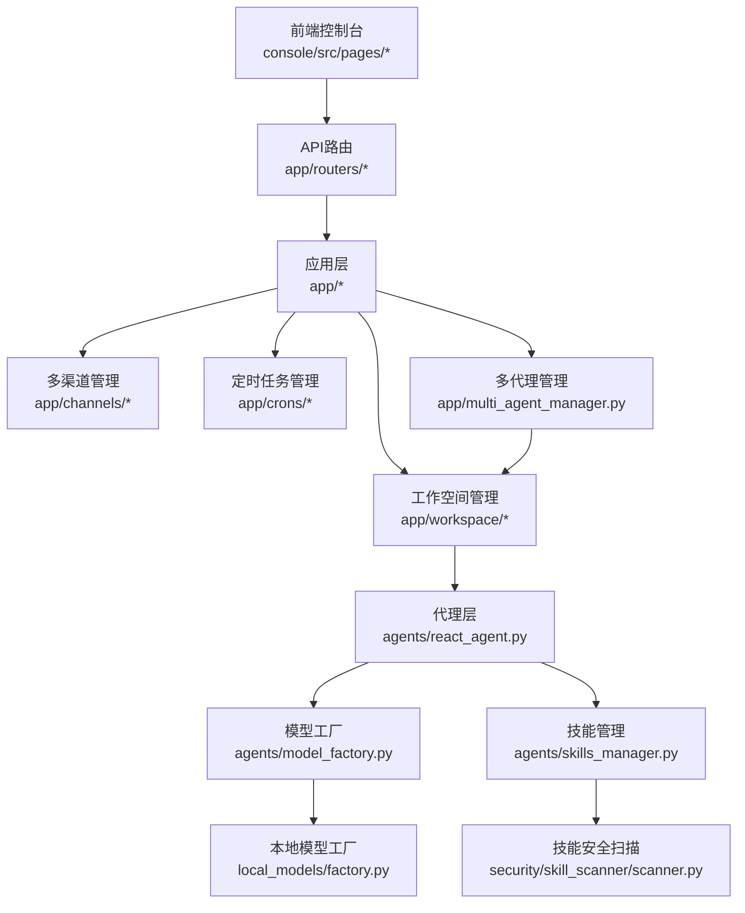
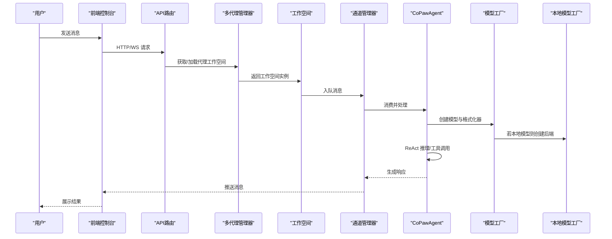
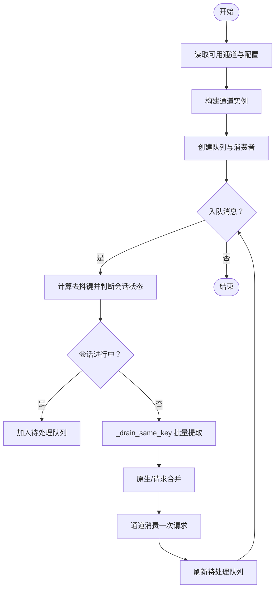
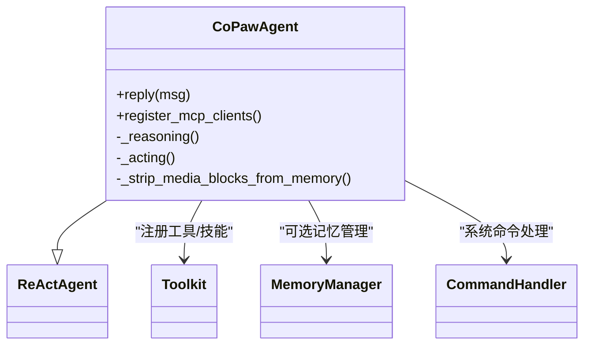
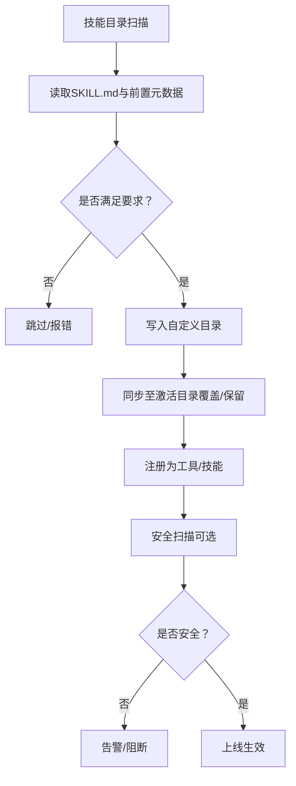
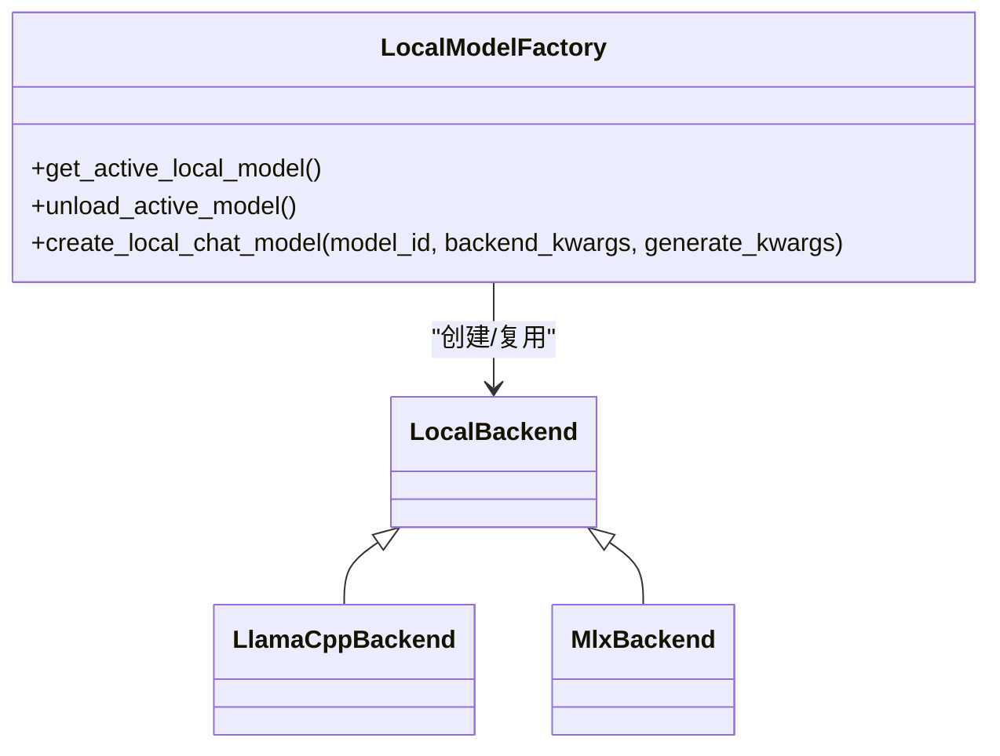
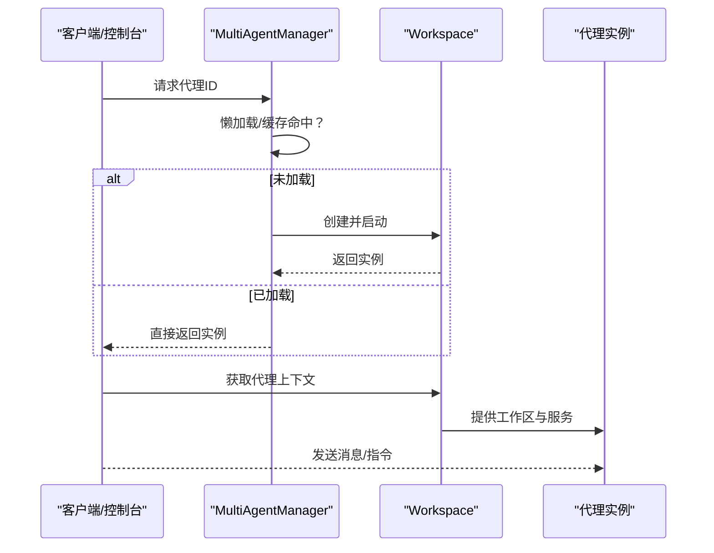
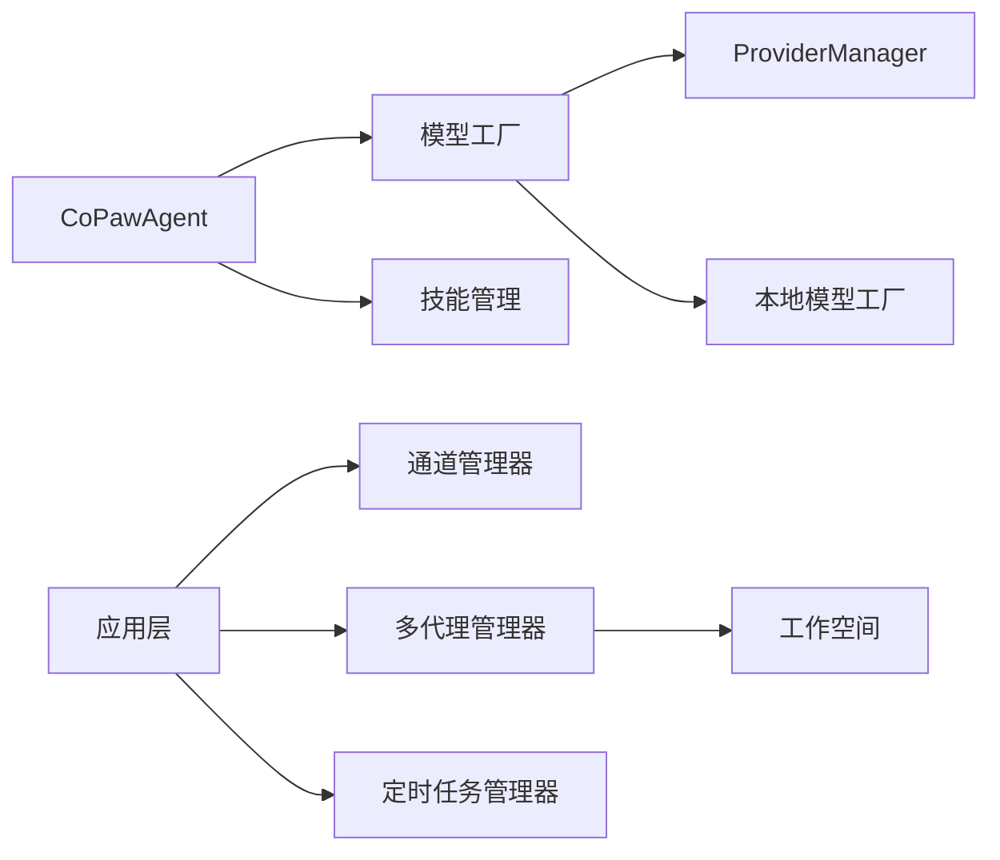

# 核心功能

<cite>
**本文引用的文件**
- [src/copaw/agents/react_agent.py](file://src/copaw/agents/react_agent.py)
- [src/copaw/agents/model_factory.py](file://src/copaw/agents/model_factory.py)
- [src/copaw/agents/skills_manager.py](file://src/copaw/agents/skills_manager.py)
- [src/copaw/local_models/factory.py](file://src/copaw/local_models/factory.py)
- [src/copaw/app/channels/manager.py](file://src/copaw/app/channels/manager.py)
- [src/copaw/app/multi_agent_manager.py](file://src/copaw/app/multi_agent_manager.py)
- [src/copaw/security/skill_scanner/scanner.py](file://src/copaw/security/skill_scanner/scanner.py)
- [src/copaw/app/crons/manager.py](file://src/copaw/app/crons/manager.py)
- [src/copaw/app/workspace/workspace.py](file://src/copaw/app/workspace/workspace.py)
- [src/copaw/app/routers/workspace.py](file://src/copaw/app/routers/workspace.py)
</cite>

## 目录
1. [引言](#引言)
2. [项目结构](#项目结构)
3. [核心组件](#核心组件)
4. [架构总览](#架构总览)
5. [详细组件分析](#详细组件分析)
6. [依赖分析](#依赖分析)
7. [性能考虑](#性能考虑)
8. [故障排查指南](#故障排查指南)
9. [结论](#结论)
10. [附录](#附录)

## 引言
本文件聚焦CoPaw的核心功能与实现机制，围绕以下主题展开：多渠道聊天支持（含适配策略）、智能代理ReAct框架（思考-行动循环、工具调用、记忆管理）、技能系统（动态加载、安全扫描、扩展开发）、本地模型支持（llama.cpp、MLX、Ollama）、工作空间与多代理架构、定时任务系统等。每个功能均提供使用示例与最佳实践建议，帮助开发者与用户高效落地。

## 项目结构
CoPaw采用“应用层-通道层-代理层-工具与技能层-本地模型层”的分层组织。前端控制台通过API路由与应用层交互；应用层负责多代理工作空间、通道编排、定时任务与工作区管理；代理层以ReActAgent为核心，集成工具、技能与记忆；本地模型层提供统一工厂与后端抽象。

图示来源
- [src/copaw/app/routers/workspace.py](file://src/copaw/app/routers/workspace.py)
- [src/copaw/app/workspace/workspace.py](file://src/copaw/app/workspace/workspace.py)
- [src/copaw/app/channels/manager.py](file://src/copaw/app/channels/manager.py)
- [src/copaw/app/multi_agent_manager.py](file://src/copaw/app/multi_agent_manager.py)
- [src/copaw/agents/react_agent.py](file://src/copaw/agents/react_agent.py)
- [src/copaw/agents/model_factory.py](file://src/copaw/agents/model_factory.py)
- [src/copaw/local_models/factory.py](file://src/copaw/local_models/factory.py)
- [src/copaw/agents/skills_manager.py](file://src/copaw/agents/skills_manager.py)
- [src/copaw/security/skill_scanner/scanner.py](file://src/copaw/security/skill_scanner/scanner.py)

章节来源
- [src/copaw/app/routers/workspace.py](file://src/copaw/app/routers/workspace.py)
- [src/copaw/app/workspace/workspace.py](file://src/copaw/app/workspace/workspace.py)
- [src/copaw/app/channels/manager.py](file://src/copaw/app/channels/manager.py)
- [src/copaw/app/multi_agent_manager.py](file://src/copaw/app/multi_agent_manager.py)

## 核心组件
- 智能代理（CoPawAgent）
  - 基于ReActAgent，内置工具集、动态技能注册、内存管理钩子、命令处理与媒体块回退逻辑。
- 模型工厂（create_model_and_formatter）
  - 统一创建远端/本地模型实例与格式化器，支持重试包装与令牌用量记录。
- 技能管理（skills_manager）
  - 同步内置/自定义/激活技能目录，提供导入、校验、版本比较与树形结构导出。
- 多渠道管理（ChannelManager）
  - 统一队列与消费者模型，按会话去抖合并，支持多种平台适配。
- 多代理管理（MultiAgentManager）
  - 工作空间懒加载、零停机热重载、后台清理与并发启动。
- 本地模型工厂（local_models.factory）
  - 单例模式加载本地模型，按后端类型选择llama.cpp或MLX实现。
- 技能安全扫描（SkillScanner）
  - 文件发现、规则分析、结果聚合与策略化阈值控制。
- 定时任务（CronManager）
  - 任务仓库、执行器、心跳与管理器，支持JSON存储与任务调度。
- 工作空间（Workspace）
  - 代理工作区生命周期管理、服务工厂与可复用组件注入。

章节来源
- [src/copaw/agents/react_agent.py](file://src/copaw/agents/react_agent.py)
- [src/copaw/agents/model_factory.py](file://src/copaw/agents/model_factory.py)
- [src/copaw/agents/skills_manager.py](file://src/copaw/agents/skills_manager.py)
- [src/copaw/app/channels/manager.py](file://src/copaw/app/channels/manager.py)
- [src/copaw/app/multi_agent_manager.py](file://src/copaw/app/multi_agent_manager.py)
- [src/copaw/local_models/factory.py](file://src/copaw/local_models/factory.py)
- [src/copaw/security/skill_scanner/scanner.py](file://src/copaw/security/skill_scanner/scanner.py)
- [src/copaw/app/crons/manager.py](file://src/copaw/app/crons/manager.py)
- [src/copaw/app/workspace/workspace.py](file://src/copaw/app/workspace/workspace.py)

## 架构总览
下图展示从请求到响应的关键流程：前端发起会话请求，经API路由进入应用层，由多代理管理器定位工作空间，通道管理器接收并合并消息，代理执行ReAct推理与工具调用，最终通过通道返回给用户。

图示来源
- [src/copaw/app/multi_agent_manager.py](file://src/copaw/app/multi_agent_manager.py)
- [src/copaw/app/workspace/workspace.py](file://src/copaw/app/workspace/workspace.py)
- [src/copaw/app/channels/manager.py](file://src/copaw/app/channels/manager.py)
- [src/copaw/agents/react_agent.py](file://src/copaw/agents/react_agent.py)
- [src/copaw/agents/model_factory.py](file://src/copaw/agents/model_factory.py)
- [src/copaw/local_models/factory.py](file://src/copaw/local_models/factory.py)

## 详细组件分析

### 多渠道聊天支持与适配策略
- 设计要点
  - 通道注册表与动态初始化：根据可用通道列表与配置，按需实例化各平台通道。
  - 队列与消费者：每通道维护固定大小队列与多个消费者，同一会话按键去抖合并，避免重复与乱序。
  - 会话级锁：同一会话在处理期间被锁定，确保批内消息顺序一致。
  - 事件发送：支持文本与内容片段发送，并自动合并元信息（如会话ID、用户ID、机器人前缀）。
- 关键流程
  - 初始化：从环境或配置读取通道，过滤禁用项，构造通道实例。
  - 入队：线程安全入队，若会话正在处理则暂存至待处理队列。
  - 批处理：同键批量取出，按原生/请求类型合并，调用通道消费接口。
  - 替换与停止：支持运行时替换通道并优雅停止旧通道。
- 使用示例
  - 在配置中启用某平台通道并设置参数，启动后由管理器自动拉起消费者循环。
  - 通过发送文本接口向指定通道推送消息，自动转换目标句柄与元数据。
- 最佳实践
  - 合理设置队列容量与消费者数量，避免阻塞与资源争用。
  - 对高频平台开启原生合并能力，减少重复请求。
  - 为不同平台设置独立过滤策略（如隐藏工具细节、屏蔽思考内容）。

图示来源
- [src/copaw/app/channels/manager.py](file://src/copaw/app/channels/manager.py)

章节来源
- [src/copaw/app/channels/manager.py](file://src/copaw/app/channels/manager.py)

### 智能代理ReAct框架实现
- ReAct循环与钩子
  - 思考阶段：构建系统提示、上下文与记忆，调用模型生成推理内容。
  - 行动阶段：选择工具/技能，执行并收集结果，必要时进行媒体块回退。
  - 钩子：引导首次设置、自动压缩记忆，保证上下文可控。
- 工具与技能
  - 内置工具：文件读写、搜索、浏览器、截图、时间与时区、令牌用量等。
  - 动态技能：从工作区同步技能目录，注册为工具函数，支持自定义与内置覆盖。
- 媒体块回退
  - 当模型拒绝包含图片/音频/视频的消息时，自动剥离媒体块并重试，避免失败中断。
- 使用示例
  - 在代理配置中启用所需工具，编写技能脚本并通过工作区同步生效。
  - 通过命令处理器触发系统命令（如压缩记忆），提升长期对话稳定性。
- 最佳实践
  - 合理设置最大迭代次数与上下文长度，避免超限。
  - 为高视觉复杂度场景准备替代方案（如截图转描述）。
  - 使用钩子进行引导与压缩，保持记忆质量。

图示来源
- [src/copaw/agents/react_agent.py](file://src/copaw/agents/react_agent.py)

章节来源
- [src/copaw/agents/react_agent.py](file://src/copaw/agents/react_agent.py)

### 技能系统：动态加载、安全扫描与扩展
- 动态加载
  - 目录结构：内置技能、自定义技能、激活技能三类目录，自定义覆盖内置。
  - 同步策略：支持强制覆盖、版本比较与差异检测，保障升级一致性。
  - 导入与校验：解析SKILL.md前置元数据，校验名称与描述，支持树形文件结构写入。
- 安全扫描
  - 文件发现：递归遍历，跳过符号链接与越界路径，限制文件大小与数量。
  - 分析器：默认基于正则签名的PatternAnalyzer，可扩展其他分析器。
  - 结果聚合：去重、统计与策略化判定，输出是否安全的结论。
- 扩展开发
  - 新建技能：编写SKILL.md与脚本/参考文件，放置于自定义目录，同步至激活目录。
  - 规则定制：通过策略YAML调整扫描范围、阈值与允许名单。
- 使用示例
  - 通过CLI或控制台导入技能包，自动校验并写入目录树。
  - 在技能管理界面查看可用技能与来源，一键启用。
- 最佳实践
  - 为技能添加清晰描述与版本号，便于追踪与升级。
  - 对外部资产（如模板、脚本）进行白名单与大小限制。
  - 定期扫描技能包，关注敏感模式与异常文件类型。

图示来源
- [src/copaw/agents/skills_manager.py](file://src/copaw/agents/skills_manager.py)
- [src/copaw/security/skill_scanner/scanner.py](file://src/copaw/security/skill_scanner/scanner.py)

章节来源
- [src/copaw/agents/skills_manager.py](file://src/copaw/agents/skills_manager.py)
- [src/copaw/security/skill_scanner/scanner.py](file://src/copaw/security/skill_scanner/scanner.py)

### 本地模型支持：llama.cpp、MLX、Ollama
- 统一工厂
  - 单例模式：当前已加载模型与后端缓存，相同模型直接复用，不同模型先卸载再加载。
  - 参数透传：后端构造参数与生成参数分别传递，支持上下文长度、显存层数、采样参数等。
- 后端实现
  - llama.cpp：适用于CPU/GPU混合场景，参数侧重上下文与显存层。
  - MLX：苹果设备优化，参数侧重量化与加速。
- Ollama集成
  - 通过ProviderManager与OllamaProvider对接，实现远程推理与流式输出。
- 使用示例
  - 在全局或代理配置中选择本地模型ID，工厂自动创建对应后端实例。
  - 调整生成参数以平衡速度与质量。
- 最佳实践
  - 根据硬件选择合适后端与量化策略。
  - 控制并发与上下文长度，避免显存不足。
  - 为不同模型设定独立参数，避免跨模型误用。

图示来源
- [src/copaw/local_models/factory.py](file://src/copaw/local_models/factory.py)

章节来源
- [src/copaw/local_models/factory.py](file://src/copaw/local_models/factory.py)

### 工作空间管理与多代理架构
- 工作空间
  - 生命周期：启动、停止、任务跟踪、可复用组件注入与服务工厂。
  - 与代理：为代理提供工作区文件系统、提示构建与上下文隔离。
- 多代理管理
  - 懒加载：首次请求才创建实例，降低启动成本。
  - 零停机热重载：新实例完全启动后再原子替换，后台清理旧实例。
  - 并发启动：一次性启动所有已配置代理，提升可用性。
- 使用示例
  - 在配置中定义多个代理与工作区，启动后通过管理器访问。
  - 通过API或控制台切换代理，观察热重载过程中的无感服务。
- 最佳实践
  - 为不同代理分配独立工作区，避免共享状态污染。
  - 启用任务跟踪，监控长时任务与流式输出。
  - 对高负载代理启用并发消费者与队列扩容。

图示来源
- [src/copaw/app/multi_agent_manager.py](file://src/copaw/app/multi_agent_manager.py)
- [src/copaw/app/workspace/workspace.py](file://src/copaw/app/workspace/workspace.py)

章节来源
- [src/copaw/app/multi_agent_manager.py](file://src/copaw/app/multi_agent_manager.py)
- [src/copaw/app/workspace/workspace.py](file://src/copaw/app/workspace/workspace.py)

### 定时任务系统
- 任务仓库与执行
  - JSON仓库：持久化任务定义与状态，支持增删改查。
  - 执行器：按计划周期执行，支持文本/事件/工具等多种任务类型。
  - 心跳：监控任务健康与延迟，异常告警。
- 管理器
  - 注册与启停：集中管理任务生命周期，支持动态增删。
  - 解析与调度：解析Cron表达式与“每N分钟”等表达式，调度执行。
- 使用示例
  - 在控制台创建定时任务，选择通道与目标会话，设置Cron表达式。
  - 查看任务历史与执行日志，调整频率与内容。
- 最佳实践
  - 将高频任务拆分为多个短周期任务，避免阻塞。
  - 为任务设置超时与重试策略，防止无限等待。
  - 使用心跳监控与告警，及时发现异常。

章节来源
- [src/copaw/app/crons/manager.py](file://src/copaw/app/crons/manager.py)

## 依赖分析
- 组件耦合
  - 代理层依赖模型工厂与技能管理，形成“推理-工具-技能”的闭环。
  - 应用层通过多代理管理器与工作空间解耦，支持多租户与热重载。
  - 通道管理器对具体平台透明，仅依赖统一接口与去抖合并策略。
- 外部依赖
  - 第三方LLM提供商（OpenAI、Anthropic、Gemini等）通过ProviderManager统一接入。
  - 本地模型通过工厂与后端抽象屏蔽差异。
- 循环依赖
  - 未见直接循环依赖；模块间通过接口与工厂解耦。

图示来源
- [src/copaw/agents/react_agent.py](file://src/copaw/agents/react_agent.py)
- [src/copaw/agents/model_factory.py](file://src/copaw/agents/model_factory.py)
- [src/copaw/agents/skills_manager.py](file://src/copaw/agents/skills_manager.py)
- [src/copaw/app/channels/manager.py](file://src/copaw/app/channels/manager.py)
- [src/copaw/app/multi_agent_manager.py](file://src/copaw/app/multi_agent_manager.py)
- [src/copaw/app/crons/manager.py](file://src/copaw/app/crons/manager.py)
- [src/copaw/local_models/factory.py](file://src/copaw/local_models/factory.py)

章节来源
- [src/copaw/agents/react_agent.py](file://src/copaw/agents/react_agent.py)
- [src/copaw/agents/model_factory.py](file://src/copaw/agents/model_factory.py)
- [src/copaw/agents/skills_manager.py](file://src/copaw/agents/skills_manager.py)
- [src/copaw/app/channels/manager.py](file://src/copaw/app/channels/manager.py)
- [src/copaw/app/multi_agent_manager.py](file://src/copaw/app/multi_agent_manager.py)
- [src/copaw/app/crons/manager.py](file://src/copaw/app/crons/manager.py)
- [src/copaw/local_models/factory.py](file://src/copaw/local_models/factory.py)

## 性能考虑
- 并发与队列
  - 通道消费者数量与队列容量应与平台吞吐匹配，避免积压与丢弃。
  - 会话级去抖合并减少重复请求，提高整体效率。
- 本地模型
  - 合理设置上下文长度与采样参数，避免显存峰值过高。
  - 单例复用已加载模型，减少冷启动开销。
- 代理与工作空间
  - 懒加载与零停机热重载降低运维成本，提升可用性。
  - 任务跟踪与后台清理避免资源泄漏。
- 安全扫描
  - 限制文件数量与大小，避免扫描成为瓶颈。
  - 优先使用策略化的文件分类，减少无效扫描。

## 故障排查指南
- 通道相关
  - 症状：消息堆积或丢失
  - 排查：检查队列容量、消费者数量、去抖键是否正确、会话锁是否释放。
- 代理相关
  - 症状：推理失败或媒体块报错
  - 排查：确认模型是否支持多模态；启用媒体块回退逻辑；检查系统提示与上下文长度。
- 技能相关
  - 症状：技能未生效或扫描不通过
  - 排查：确认SKILL.md元数据完整；检查激活目录同步状态；核对扫描策略与阈值。
- 本地模型相关
  - 症状：加载失败或显存溢出
  - 排查：确认后端库安装与版本；调整上下文长度与量化参数；检查单例复用逻辑。
- 多代理相关
  - 症状：热重载后旧实例仍在运行
  - 排查：检查后台清理任务状态与超时；确认新实例已完全启动。

章节来源
- [src/copaw/app/channels/manager.py](file://src/copaw/app/channels/manager.py)
- [src/copaw/agents/react_agent.py](file://src/copaw/agents/react_agent.py)
- [src/copaw/agents/skills_manager.py](file://src/copaw/agents/skills_manager.py)
- [src/copaw/local_models/factory.py](file://src/copaw/local_models/factory.py)
- [src/copaw/app/multi_agent_manager.py](file://src/copaw/app/multi_agent_manager.py)

## 结论
CoPaw通过模块化与抽象设计，实现了从多渠道接入、ReAct推理、技能扩展到本地模型与工作空间管理的完整链路。其关键优势在于：统一的工厂与管理器、可插拔的通道与模型后端、可热重载的多代理架构、以及可策略化的安全扫描。遵循本文的最佳实践，可在保证安全性与稳定性的前提下，快速扩展业务场景并提升用户体验。

## 附录
- 使用示例清单
  - 多渠道：在配置中启用平台通道，启动后自动拉起消费者；通过发送文本接口推送消息。
  - ReAct：在代理配置中启用工具，编写技能脚本并通过工作区同步；触发系统命令压缩记忆。
  - 技能：导入技能包，校验并写入自定义目录，同步至激活目录；定期扫描技能包。
  - 本地模型：选择模型ID与后端参数，工厂自动创建实例；调整生成参数平衡性能与质量。
  - 多代理：在配置中定义多个代理与工作区，懒加载与热重载无缝切换。
  - 定时任务：创建任务并设置Cron表达式，查看执行日志与心跳状态。