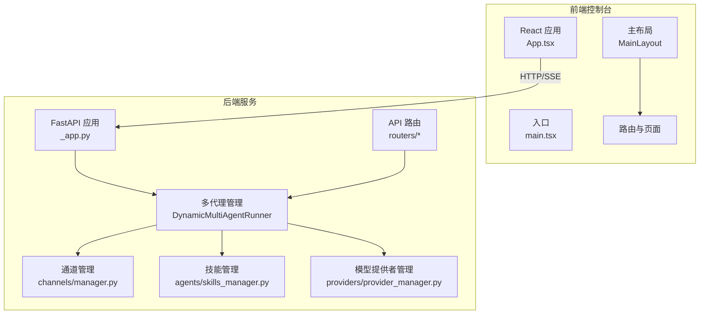
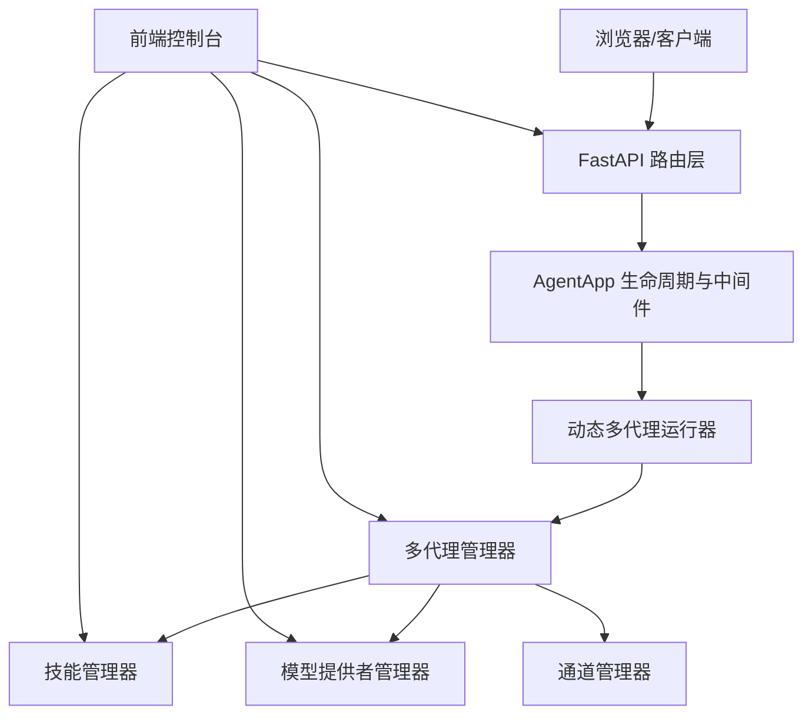
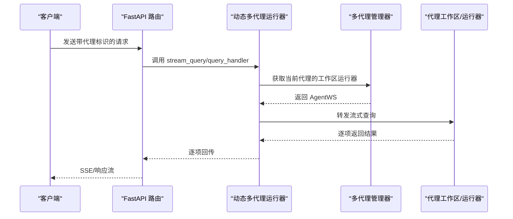
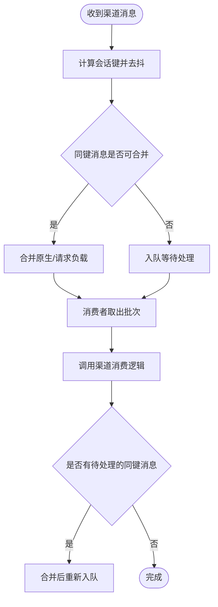
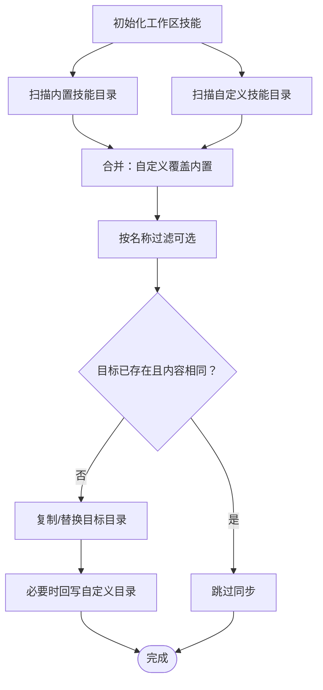
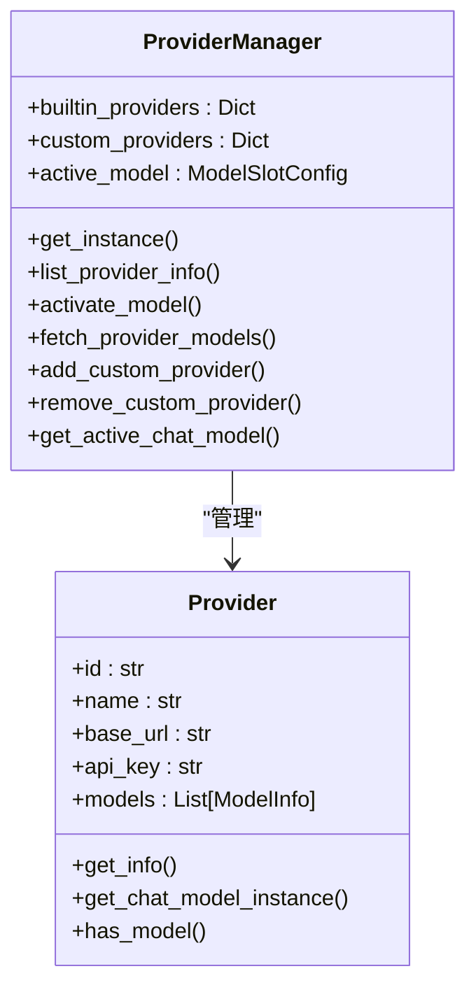
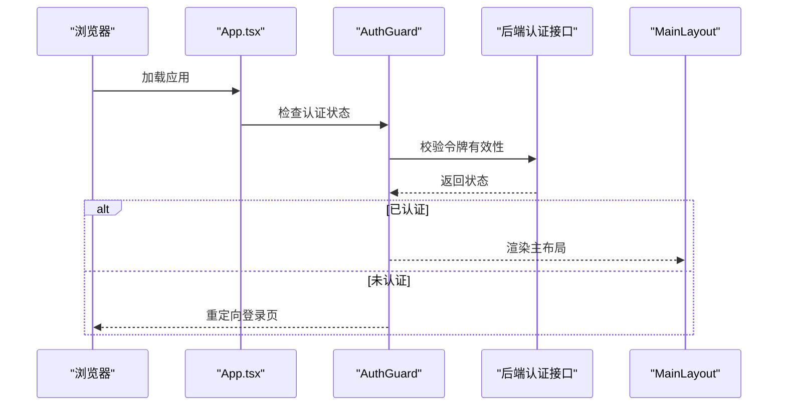
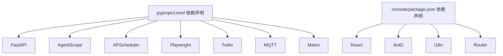

# 项目概述

<cite>
**本文档引用的文件**
- [README.md](file://README.md)
- [CONTRIBUTING.md](file://CONTRIBUTING.md)
- [src/copaw/__version__.py](file://src/copaw/__version__.py)
- [pyproject.toml](file://pyproject.toml)
- [console/package.json](file://console/package.json)
- [src/copaw/__main__.py](file://src/copaw/__main__.py)
- [src/copaw/app/_app.py](file://src/copaw/app/_app.py)
- [src/copaw/app/channels/manager.py](file://src/copaw/app/channels/manager.py)
- [src/copaw/agents/skills_manager.py](file://src/copaw/agents/skills_manager.py)
- [src/copaw/providers/provider_manager.py](file://src/copaw/providers/provider_manager.py)
- [src/copaw/app/routers/agent.py](file://src/copaw/app/routers/agent.py)
- [console/src/App.tsx](file://console/src/App.tsx)
- [console/src/main.tsx](file://console/src/main.tsx)
- [console/src/layouts/MainLayout/index.tsx](file://console/src/layouts/MainLayout/index.tsx)
</cite>

## 目录
1. [引言](#引言)
2. [项目结构](#项目结构)
3. [核心组件](#核心组件)
4. [架构总览](#架构总览)
5. [详细组件分析](#详细组件分析)
6. [依赖关系分析](#依赖关系分析)
7. [性能考量](#性能考量)
8. [故障排查指南](#故障排查指南)
9. [结论](#结论)
10. [附录](#附录)

## 引言
CoPaw 是一个“个人AI助手”平台，强调“在你自己的环境中运行”。它通过统一的多渠道协议连接到多种即时通讯平台（如钉钉、飞书、QQ、Discord、iMessage 等），支持定时任务与心跳检查，并通过“技能”扩展能力，实现“无限可能”的应用场景。项目采用前后端分离架构：后端基于 FastAPI 提供统一 API 与多代理管理，前端控制台基于 React + Ant Design 提供图形化配置与交互。

核心价值与定位：
- 多渠道聊天：统一协议适配不同平台的消息形态，实现跨渠道对话与事件处理。
- 智能代理系统：支持多代理工作区，按请求动态路由到对应代理实例，具备热重载与生命周期管理。
- 技能扩展系统：内置与自定义技能目录合并，支持从代码仓库与工作区同步技能，提供技能导入与版本管理。
- 前后端分离：后端提供 REST API 与 SSE 流式对话，前端控制台负责配置、可视化与交互。
- 插件化设计：模型提供者、通道、工具、MCP 客户端均可按需扩展与热插拔。

## 项目结构
项目采用“Python 后端 + React 前端 + 多代理工作区”的分层组织方式：
- 后端（Python）：FastAPI 应用、多代理管理器、通道管理器、技能管理器、模型提供者管理器、路由与中间件。
- 前端（React）：控制台应用，包含路由、布局、认证守卫、国际化与主题切换。
- 配置与数据：工作区目录下保存技能、记忆体、环境变量、模型配置与令牌用量统计等。

图表来源
- [src/copaw/app/_app.py:141-145](file://src/copaw/app/_app.py#L141-L145)
- [src/copaw/app/channels/manager.py:114-124](file://src/copaw/app/channels/manager.py#L114-L124)
- [src/copaw/agents/skills_manager.py:627-685](file://src/copaw/agents/skills_manager.py#L627-L685)
- [src/copaw/providers/provider_manager.py:288-311](file://src/copaw/providers/provider_manager.py#L288-L311)
- [console/src/App.tsx:106-160](file://console/src/App.tsx#L106-L160)
- [console/src/layouts/MainLayout/index.tsx:45-85](file://console/src/layouts/MainLayout/index.tsx#L45-L85)

章节来源
- [README.md:97-111](file://README.md#L97-L111)
- [console/package.json:1-57](file://console/package.json#L1-L57)
- [pyproject.toml:1-99](file://pyproject.toml#L1-L99)

## 核心组件
- 多代理运行器与动态路由：通过动态包装器根据请求头选择具体代理实例，实现多工作区隔离与按需调度。
- 通道管理器：统一队列与消费者模型，对不同渠道进行去抖、合并与批处理，保证会话一致性与并发处理。
- 技能管理器：内置与自定义技能合并、版本比较、差异检测与同步，支持 ZIP 导入与树形目录结构。
- 模型提供者管理器：内置多家云模型与本地模型（llama.cpp、MLX、Ollama），支持用户自定义提供者与模型发现。
- 控制台前端：认证守卫、国际化、主题切换、路由与页面组件，提供配置与操作界面。

章节来源
- [src/copaw/app/_app.py:48-136](file://src/copaw/app/_app.py#L48-L136)
- [src/copaw/app/channels/manager.py:114-124](file://src/copaw/app/channels/manager.py#L114-L124)
- [src/copaw/agents/skills_manager.py:627-685](file://src/copaw/agents/skills_manager.py#L627-L685)
- [src/copaw/providers/provider_manager.py:288-311](file://src/copaw/providers/provider_manager.py#L288-L311)
- [console/src/App.tsx:45-100](file://console/src/App.tsx#L45-L100)

## 架构总览
CoPaw 的整体架构围绕“多代理 + 统一通道 + 可插拔提供者 + 技能生态”展开。后端以 FastAPI 为核心，通过 AgentApp 与多代理管理器协作；前端控制台提供认证、国际化与页面导航；通道层抽象消息收发，技能层承载可扩展能力，提供者层统一模型访问。

图表来源
- [src/copaw/app/_app.py:241-246](file://src/copaw/app/_app.py#L241-L246)
- [src/copaw/app/_app.py:327-338](file://src/copaw/app/_app.py#L327-L338)
- [src/copaw/app/_app.py:344-408](file://src/copaw/app/_app.py#L344-L408)
- [src/copaw/app/channels/manager.py:350-378](file://src/copaw/app/channels/manager.py#L350-L378)
- [src/copaw/providers/provider_manager.py:342-351](file://src/copaw/providers/provider_manager.py#L342-L351)
- [src/copaw/agents/skills_manager.py:687-697](file://src/copaw/agents/skills_manager.py#L687-L697)

## 详细组件分析

### 多代理与动态路由
- 动态多代理运行器根据请求中的代理标识选择对应工作区运行器，实现按代理隔离与流式查询转发。
- AgentApp 生命周期中注入全局状态（多代理管理器、提供者管理器），并挂载统一路由与静态资源。

图表来源
- [src/copaw/app/_app.py:95-125](file://src/copaw/app/_app.py#L95-L125)
- [src/copaw/app/_app.py:177-207](file://src/copaw/app/_app.py#L177-L207)

章节来源
- [src/copaw/app/_app.py:48-136](file://src/copaw/app/_app.py#L48-L136)

### 通道管理与消息处理
- 通道管理器为每个启用的渠道维护独立队列与多个消费者，按会话键去抖与合并，确保同一会话内的消息顺序与完整性。
- 支持从环境或配置初始化渠道，按签名过滤参数，动态替换与停止旧渠道。

图表来源
- [src/copaw/app/channels/manager.py:42-112](file://src/copaw/app/channels/manager.py#L42-L112)
- [src/copaw/app/channels/manager.py:307-378](file://src/copaw/app/channels/manager.py#L307-L378)

章节来源
- [src/copaw/app/channels/manager.py:114-124](file://src/copaw/app/channels/manager.py#L114-L124)

### 技能管理与同步
- 技能管理器负责内置与自定义技能的合并、差异检测与同步，支持从 ZIP 导入、树形目录结构写入与名称解析。
- 提供列表、创建、导入与版本比较等能力，确保工作区技能与代码仓库保持一致。

图表来源
- [src/copaw/agents/skills_manager.py:183-260](file://src/copaw/agents/skills_manager.py#L183-L260)
- [src/copaw/agents/skills_manager.py:263-341](file://src/copaw/agents/skills_manager.py#L263-L341)

章节来源
- [src/copaw/agents/skills_manager.py:627-685](file://src/copaw/agents/skills_manager.py#L627-L685)

### 模型提供者管理
- 内置多家云模型与本地模型提供者，支持用户自定义提供者与模型发现。
- 提供加载、激活、迁移、持久化与实例化聊天模型的能力，支持本地模型动态更新。

图表来源
- [src/copaw/providers/provider_manager.py:288-311](file://src/copaw/providers/provider_manager.py#L288-L311)
- [src/copaw/providers/provider_manager.py:342-363](file://src/copaw/providers/provider_manager.py#L342-L363)
- [src/copaw/providers/provider_manager.py:452-467](file://src/copaw/providers/provider_manager.py#L452-L467)
- [src/copaw/providers/provider_manager.py:691-716](file://src/copaw/providers/provider_manager.py#L691-L716)

章节来源
- [src/copaw/providers/provider_manager.py:321-337](file://src/copaw/providers/provider_manager.py#L321-L337)

### 前端控制台与认证
- 控制台应用通过路由守卫进行认证校验，支持多语言与暗黑模式切换，主布局包含侧边栏与内容区域。
- 入口文件对控制台警告与错误进行轻量过滤，提升开发体验。

图表来源
- [console/src/App.tsx:45-100](file://console/src/App.tsx#L45-L100)
- [console/src/layouts/MainLayout/index.tsx:45-85](file://console/src/layouts/MainLayout/index.tsx#L45-L85)
- [console/src/main.tsx:5-28](file://console/src/main.tsx#L5-L28)

章节来源
- [console/src/App.tsx:106-160](file://console/src/App.tsx#L106-L160)
- [console/src/main.tsx:1-31](file://console/src/main.tsx#L1-L31)

## 依赖关系分析
- 后端依赖：FastAPI、uvicorn、AgentScope 运行时、调度器 APScheduler、浏览器自动化 Playwright、Twilio、MQTT、Matrix 等第三方 SDK。
- 前端依赖：React、Ant Design、i18n、路由与 Markdown 渲染等。
- 可选依赖：llama.cpp、MLX、Ollama、Whisper 等本地模型与语音转写能力。

图表来源
- [pyproject.toml:1-99](file://pyproject.toml#L1-L99)
- [console/package.json:18-56](file://console/package.json#L18-L56)

章节来源
- [pyproject.toml:1-99](file://pyproject.toml#L1-L99)
- [console/package.json:1-57](file://console/package.json#L1-L57)

## 性能考量
- 多消费者并发：通道管理器为每个渠道配置固定数量的消费者，按会话键去抖与合并，避免重复与乱序。
- 流式响应：后端提供 SSE 流式对话，前端按事件增量渲染，降低首屏延迟与内存占用。
- 热重载与零停机：多代理管理器支持后台热重载代理配置，减少运维中断时间。
- 本地模型优化：本地模型提供者按后端类型动态更新模型列表，避免无效请求与错误。

## 故障排查指南
- 版本与安装：确认安装方式与版本，参考快速启动与脚本安装说明，必要时清理缓存后重试。
- API Key 与模型：若使用云端模型，需在控制台设置相应 API Key；本地模型需正确下载与配置。
- 渠道配置：检查渠道开关、回调地址与鉴权参数；关注日志中的启动失败与停止异常。
- 技能同步：若技能未生效，检查内置与自定义目录的差异与版本；必要时强制同步或回退。
- 语音转写：检查本地 Whisper 依赖与 ffmpeg 是否可用，或切换为远程 Whisper 接口。

章节来源
- [README.md:324-354](file://README.md#L324-L354)
- [src/copaw/app/channels/manager.py:379-410](file://src/copaw/app/channels/manager.py#L379-L410)
- [src/copaw/agents/skills_manager.py:183-260](file://src/copaw/agents/skills_manager.py#L183-L260)

## 结论
CoPaw 以“多代理 + 统一通道 + 可插拔提供者 + 技能生态”为核心理念，构建了可扩展、可部署、可治理的个人AI助手平台。后端通过 FastAPI 与 AgentApp 实现高内聚的运行时管理，前端控制台提供直观的配置与可视化界面。项目在多渠道适配、技能扩展、模型提供者与本地模型方面具备良好兼容性与可维护性，适合个人与企业自建智能助手场景。

## 附录

### 技术栈概览
- 后端：Python、FastAPI、uvicorn、AgentScope 运行时、APScheduler、Playwright、Twilio、MQTT、Matrix 等。
- 前端：React、Ant Design、i18n、路由与 Markdown 渲染。
- 可选：llama.cpp、MLX、Ollama、Whisper。

章节来源
- [pyproject.toml:1-99](file://pyproject.toml#L1-L99)
- [console/package.json:18-56](file://console/package.json#L18-L56)

### 许可证信息
- 项目采用 Apache License 2.0。

章节来源
- [README.md:490-493](file://README.md#L490-L493)

### 社区贡献指南
- 贡献流程：先开 Issue 讨论，再提交 PR；遵循约定式提交规范；本地通过 pre-commit、pytest 与格式化检查。
- 主要贡献方向：新增模型/提供者、新增渠道、技能扩展、平台兼容性与文档改进。

章节来源
- [CONTRIBUTING.md:11-86](file://CONTRIBUTING.md#L11-L86)
- [CONTRIBUTING.md:89-214](file://CONTRIBUTING.md#L89-L214)

### 发展历程与版本演进
- 当前版本：0.1.0.post1。
- 近期重点：多工作区架构、技能安全扫描、Web 认证、WeCom/XiaoYi 渠道、Gemini/MiniMax/Kimi 提供者、SSE 流式对话、语音转写、工具与技能导入等。

章节来源
- [src/copaw/__version__.py:1-3](file://src/copaw/__version__.py#L1-L3)
- [README.md:55-62](file://README.md#L55-L62)

### 未来规划
- 横向扩展：更多渠道、模型、技能与 MCP。
- 现有功能增强：显示优化、下载提示、Windows 路径兼容等。
- 自愈能力：魔法命令与守护进程能力。
- 多代理：后台任务、隔离、争用解决与通信。
- 多模态：语音/视频通话与实时交互。
- 小大模型协同：本地小模型与云端模型的平衡。
- 内存系统：经验提炼与技能抽取。
- 安全：命令执行确认、工具/技能安全与可配置安全级别。
- 云原生：与 AgentScope Runtime 深度集成。

章节来源
- [README.md:387-416](file://README.md#L387-L416)